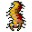

# { .sprite } Dead worms

| Stat | Value |
|---|---|
| Class | construct |
| HP | 50 |
| Max AP | 10 |
| Attack cost | 5 |
| Move cost | 5 |
| Damage | 5 to 15 |
| Attack chance | 100 |
| Block chance | 50 |
| Damage resistance | 5 |
| Critical skill | 0 |
| Critical multiplier | 0 |

!!! note "Immune to critical hits"
    Monsters of this class cannot be critically hit.

## Found on

- [mountainlake_sub](../maps/mountainlake_sub.md)

<small>Monster ID: `dead_worms` · Data from v0.8.18</small>
