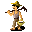

# { .sprite } Ainsley

**Where to find Ainsley:** Deebo's Orchard: [Sullengard apple farm west](../maps/sullengard_apple_farm_west.md#pin-npc-deebo_orchard_farmer_ainsley)

<div class="infobox" markdown>

<p class="ib-img"></p>

| | |
|---|---|
| **Type** | NPC (talk only; never fought) |
| **Found in** | Deebo's Orchard |
| **Introduced** | [v0.8.2](../versions/0.8.2.md) |

</div>

## Quests

- [Getting home on time](../quests/deebo_orchard_ght.md): stages 25, 50

## Dialogue simulator

Talk to Ainsley as you would in the game. When the conversation depends on your progress (a quest, an item, a dice roll…), the simulator asks you. Try another answer with **Undo**.

<div class="dlg-sim" data-src="../../assets/dialogue/sullengard_ainsley_selector_0.json" data-npc="Ainsley" markdown="0"><noscript>The simulator needs JavaScript. The full dialogue is listed below.</noscript></div>

<p class="verified">Follows the game's own conversation rules (v0.8.18).</p>

??? quote "Dialogue (10 lines)"

    *Exactly as in the game files. Each line appears once; links jump to where a choice leads.*

    <span id="d-sullengard_ainsley_selector_0"></span>**`sullengard_ainsley_selector_0`** *(silent check: the first matching branch below is taken)*

    - branch 1 *(if NOT reached stage 50 of [Getting home on time](../quests/deebo_orchard_ght.md#stage-50))* → [sullengard_ainsley_0](#d-sullengard_ainsley_0)
    - branch 2 → [sullengard_ainsley_3](#d-sullengard_ainsley_3)

    <span id="d-sullengard_ainsley_0"></span>**`sullengard_ainsley_0`** Ainsley: “Yikes! You surprised me, kid. I'm Ainsley and I have a lot of work to do here so talk to me later.”

    - “OK. I'm going now.” → *conversation ends*
    - “OK. I'll leave now.” → *conversation ends*
    - “Just a quick question. Have you seen my brother Andor?” → [sullengard_ainsley_1a](#d-sullengard_ainsley_1a)
    - “The husband of Hadena?” *(if latest stage of [Getting home on time](../quests/deebo_orchard_ght.md#stage-20) is 20)* → [sullengard_ainsley_1b](#d-sullengard_ainsley_1b)

    <span id="d-sullengard_ainsley_3"></span>**`sullengard_ainsley_3`** Ainsley: “Thank you so much, kid. Tell my wife Hadena I can come home on time today.” — **effects:** sets stage 50 of [Getting home on time](../quests/deebo_orchard_ght.md#stage-50)

    - “You're welcome.” → *conversation ends*

    <span id="d-sullengard_ainsley_1a"></span>**`sullengard_ainsley_1a`** Ainsley: “Uhhh...yes. No. Maybe. Argh. Sorry kid, I'm so busy right now. I can't even work properly with this old pitchfork.”

    - “OK. I'll won't disturb you.” → *conversation ends*
    - “OK. I'll leave now.” → *conversation ends*
    - “I have a new pitchfork here.” *(if hand over 1× [Farmer's pitchfork](../items/farmer_pitchfork.md); latest stage of [Getting home on time](../quests/deebo_orchard_ght.md#stage-40) is 40)* → [sullengard_ainsley_3](#d-sullengard_ainsley_3)
    - “Oops...I don't have a new pitchfork. I'll be right back.” *(if NOT hand over 1× [Farmer's pitchfork](../items/farmer_pitchfork.md); latest stage of [Getting home on time](../quests/deebo_orchard_ght.md#stage-40) is 40)* → *conversation ends*

    <span id="d-sullengard_ainsley_1b"></span>**`sullengard_ainsley_1b`** Ainsley: “Hadena? Ah yes. She's my wife. Why do you ask?”

    - “She asked me to ensure that you get home on time today.” → [ainsley_goto_loneford_0](#d-ainsley_goto_loneford_0)
    - “Just asking. I thought you are busy?” → *conversation ends*

    <span id="d-ainsley_goto_loneford_0"></span>**`ainsley_goto_loneford_0`** Ainsley: “Well, in order to do that, then I will need some help.”

    - “Help? What kind of help?” → [ainsley_goto_loneford_10](#d-ainsley_goto_loneford_10)

    <span id="d-ainsley_goto_loneford_10"></span>**`ainsley_goto_loneford_10`** Ainsley: “You see, because I am the least experienced of Deebo's farmers, I get assigned the extra work that the other farmers don't want to do. On top of my already heavy responsibilities.”

    - “Extra work? Like what?” → [ainsley_goto_loneford_20](#d-ainsley_goto_loneford_20)

    <span id="d-ainsley_goto_loneford_20"></span>**`ainsley_goto_loneford_20`** Ainsley: “Well, for example, we need a new pitchfork here on the orchard and the closest place to get one is in Loneford. So guess who has to go get it? Me! I do.”

    - Next → [ainsley_goto_loneford_30](#d-ainsley_goto_loneford_30)

    <span id="d-ainsley_goto_loneford_30"></span>**`ainsley_goto_loneford_30`** Ainsley: “This is not an easy trip. Not only the distance, but with all of those monsters between here and there, it is very dangerous.”

    - “Especially for a farmer. Trust me, I know.” → [ainsley_goto_loneford_40](#d-ainsley_goto_loneford_40)
    - “I agree with you as you don't look strong enough to handle that trip.” → [ainsley_goto_loneford_40](#d-ainsley_goto_loneford_40)

    <span id="d-ainsley_goto_loneford_40"></span>**`ainsley_goto_loneford_40`** Ainsley: “Anyways, I would really appreciate it if you would go to Loneford and get the pitchfork.” — **effects:** sets stage 25 of [Getting home on time](../quests/deebo_orchard_ght.md#stage-25)

    - “Sure. I will go to Loneford and get your new pitchfork.” → *conversation ends*


## Version history

| Version | Change |
|---|---|
| [v0.8.2](../versions/0.8.2.md) | Added<br>Dialogue: 10 lines added |

<p class="verified">Verified against v0.8.18 and every earlier release back to v0.7.0 (game data compared release by release).</p>


## Behind the scenes

*How the game data handles this character. Not needed for playing.*

??? info "Technical information"

    | | |
    |---|---|
    | Entry ID | `deebo_orchard_farmer_ainsley` |
    | Type (wiki) | NPC |
    | Spawn group | `deebo_orchard_farmer_ainsley` |
    | Loot table | – |
    | Conversation | `sullengard_ainsley_selector_0` |
    | Faction | – |
    | Movement | – |
    | Icon | `monsters_karvis2:1` |
    | Defined in | `res/raw/monsterlist_sullengard.json` |

    Raw data:

    ```json
    {
     "id": "deebo_orchard_farmer_ainsley",
     "name": "Ainsley",
     "iconID": "monsters_karvis2:1",
     "unique": 1,
     "monsterClass": "humanoid",
     "spawnGroup": "deebo_orchard_farmer_ainsley",
     "phraseID": "sullengard_ainsley_selector_0"
    }
    ```


## Community notes

<small>Written by players, not generated from game data. **Observations**: what players notice in-game · **Lore**: the in-world story · **Trivia**: real-world facts, references, development history · **Theory / speculation**: unconfirmed ideas; may just be unfinished content</small>

### Observations

*No notes yet. Contributions are welcome: [add a note](https://github.com/asdfghjkl628/Andor-s-Trail-Wikiiii/new/main/notes/monsters?filename=deebo_orchard_farmer_ainsley.md&value=%23%23%20Observations%0A%0A%3C%21--%20what%20players%20notice%20in-game%20--%3E%0A%0A%23%23%20Lore%0A%0A%3C%21--%20the%20in-world%20story%20--%3E%0A%0A%23%23%20Trivia%0A%0A%3C%21--%20real-world%20facts%2C%20references%2C%20development%20history%20--%3E%0A%0A%23%23%20Theory%20/%20speculation%0A%0A%3C%21--%20unconfirmed%20ideas%3B%20may%20just%20be%20unfinished%20content%20--%3E%0A).*

### Lore

*No notes yet. Contributions are welcome: [add a note](https://github.com/asdfghjkl628/Andor-s-Trail-Wikiiii/new/main/notes/monsters?filename=deebo_orchard_farmer_ainsley.md&value=%23%23%20Observations%0A%0A%3C%21--%20what%20players%20notice%20in-game%20--%3E%0A%0A%23%23%20Lore%0A%0A%3C%21--%20the%20in-world%20story%20--%3E%0A%0A%23%23%20Trivia%0A%0A%3C%21--%20real-world%20facts%2C%20references%2C%20development%20history%20--%3E%0A%0A%23%23%20Theory%20/%20speculation%0A%0A%3C%21--%20unconfirmed%20ideas%3B%20may%20just%20be%20unfinished%20content%20--%3E%0A).*

### Trivia

*No notes yet. Contributions are welcome: [add a note](https://github.com/asdfghjkl628/Andor-s-Trail-Wikiiii/new/main/notes/monsters?filename=deebo_orchard_farmer_ainsley.md&value=%23%23%20Observations%0A%0A%3C%21--%20what%20players%20notice%20in-game%20--%3E%0A%0A%23%23%20Lore%0A%0A%3C%21--%20the%20in-world%20story%20--%3E%0A%0A%23%23%20Trivia%0A%0A%3C%21--%20real-world%20facts%2C%20references%2C%20development%20history%20--%3E%0A%0A%23%23%20Theory%20/%20speculation%0A%0A%3C%21--%20unconfirmed%20ideas%3B%20may%20just%20be%20unfinished%20content%20--%3E%0A).*

### Theory / speculation

*No notes yet. Contributions are welcome: [add a note](https://github.com/asdfghjkl628/Andor-s-Trail-Wikiiii/new/main/notes/monsters?filename=deebo_orchard_farmer_ainsley.md&value=%23%23%20Observations%0A%0A%3C%21--%20what%20players%20notice%20in-game%20--%3E%0A%0A%23%23%20Lore%0A%0A%3C%21--%20the%20in-world%20story%20--%3E%0A%0A%23%23%20Trivia%0A%0A%3C%21--%20real-world%20facts%2C%20references%2C%20development%20history%20--%3E%0A%0A%23%23%20Theory%20/%20speculation%0A%0A%3C%21--%20unconfirmed%20ideas%3B%20may%20just%20be%20unfinished%20content%20--%3E%0A).*


<small>Data from v0.8.18</small>
