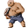

# { .sprite } Dirty grimmthorn marauder

**Where to find Dirty grimmthorn marauder:** [Way to sullengard west 0](../maps/way_to_sullengard_west_0.md#pin-npc-dirty_grimmthorn_marauder), [Way to sullengard west 1](../maps/way_to_sullengard_west_1.md#pin-npc-dirty_grimmthorn_marauder), [Way to sullengard west 2](../maps/way_to_sullengard_west_2.md#pin-npc-dirty_grimmthorn_marauder), [Way to sullengard west 3](../maps/way_to_sullengard_west_3.md#pin-npc-dirty_grimmthorn_marauder)

<div class="infobox" markdown>

<p class="ib-img"></p>

| | |
|---|---|
| **Type** | NPC/Enemy (talks, but can also be fought) |
| **Found in** | Way to sullengard west 0, Way to sullengard west 1, Way to sullengard west 2 |
| **Class** | Humanoid |
| **HP** | 370 |
| **XP when defeated** | 606 |
| **Introduced** | [v0.8.8](../versions/0.8.8.md) |

</div>

!!! warning "You can fight Dirty grimmthorn marauder"
    Any of your answers (“Where is the Shadow to help me now?” or “Please don't hurt me.”) starts a fight with Dirty grimmthorn marauder.

## Combat

| | |
|---|---|
| Class | Humanoid |
| HP | 370 |
| XP when defeated | 606 |
| Damage | 9 |
| AC | 189 |
| BC | 77 |
| DR | 9 |
| Attacks per turn | 2 (5 AP each, 10 AP) |
| Crit chance | 10% (×2.25) |


<p class="verified">Verified against v0.8.18 monster data.</p>

## Drops

| Item | Chance | Qty |
|---|---|---|
| [Gold coins](../items/gold.md) | 75% | 4 to 10 |
| [Maul](../items/maul.md) | 3% | 1 |
| [Titanforge stompers](../items/titanforge_stompers.md) | 0.1% | 1 |

## Locations

| Map | Region | Up to | Notes |
|---|---|---|---|
| [Way to sullengard west 0](../maps/way_to_sullengard_west_0.md) | – | 1 | – |
| [Way to sullengard west 1](../maps/way_to_sullengard_west_1.md) | – | 1 | – |
| [Way to sullengard west 2](../maps/way_to_sullengard_west_2.md) | – | 1 | – |
| [Way to sullengard west 3](../maps/way_to_sullengard_west_3.md) | – | 2 | – |

## Dialogue simulator

Talk to Dirty grimmthorn marauder as you would in the game. When the conversation depends on your progress (a quest, an item, a dice roll…), the simulator asks you. Try another answer with **Undo**.

<div class="dlg-sim" data-src="../../assets/dialogue/dirty_grimmthorn_marauder_1.json" data-npc="Dirty grimmthorn marauder" markdown="0"><noscript>The simulator needs JavaScript. The full dialogue is listed below.</noscript></div>

<p class="verified">Follows the game's own conversation rules (v0.8.18).</p>

??? quote "Dialogue (1 lines)"

    *Exactly as in the game files. Each line appears once; links jump to where a choice leads.*

    <span id="d-dirty_grimmthorn_marauder_1"></span>**`dirty_grimmthorn_marauder_1`** Dirty grimmthorn marauder: “We are in a rush to get through here, kid. Get out of our way or die.”

    - “Where is the Shadow to help me now?” → *fight starts*
    - “Please don't hurt me.” → *fight starts*


## Version history

| Version | Change |
|---|---|
| [v0.8.8](../versions/0.8.8.md) | Added<br>Dialogue: 1 line added |

<p class="verified">Verified against v0.8.18 and every earlier release back to v0.7.0 (game data compared release by release).</p>


## Behind the scenes

*How the game data handles this character. Not needed for playing.*

??? info "How the XP value is calculated"

    The game computes each enemy's experience value when it loads the data (`MonsterTypeParser.java`):

    XP = ⌈(attacks per turn × attack chance × average damage × (1 + critical skill × critical multiplier) × 3 + HP × (1 + block chance) + 9 × damage resistance) × 0.7⌉

    Percentages are used as fractions (e.g. 60% = 0.6). Enemies whose attacks inflict a condition are worth 50 XP more. The More Exp skill adds a percentage on top.

??? info "Technical information"

    | | |
    |---|---|
    | Entry ID | `dirty_grimmthorn_marauder` |
    | Type (wiki) | NPC/Enemy |
    | Spawn group | `dirty_grimmthorn_marauder` |
    | Loot table | `dirty_grimmthorn_marauder_dl` |
    | Conversation | `dirty_grimmthorn_marauder_1` |
    | Faction | – |
    | Movement | protectSpawn |
    | Icon | `monsters_newb_1:20` |
    | Defined in | `res/raw/monsterlist_mt_galmore.json` |

    Raw data:

    ```json
    {
     "id": "dirty_grimmthorn_marauder",
     "name": "Dirty grimmthorn marauder",
     "iconID": "monsters_newb_1:20",
     "maxHP": 370,
     "moveCost": 5,
     "monsterClass": "humanoid",
     "movementAggressionType": "protectSpawn",
     "attackDamage": {
      "min": 9,
      "max": 9
     },
     "phraseID": "dirty_grimmthorn_marauder_1",
     "droplistID": "dirty_grimmthorn_marauder_dl",
     "attackCost": 5,
     "attackChance": 189,
     "criticalSkill": 12,
     "criticalMultiplier": 2.25,
     "blockChance": 77,
     "damageResistance": 9
    }
    ```


## Community notes

<small>Written by players, not generated from game data. **Observations**: what players notice in-game · **Lore**: the in-world story · **Trivia**: real-world facts, references, development history · **Theory / speculation**: unconfirmed ideas; may just be unfinished content</small>

### Observations

*No notes yet. Contributions are welcome: [add a note](https://github.com/asdfghjkl628/Andor-s-Trail-Wikiiii/new/main/notes/monsters?filename=dirty_grimmthorn_marauder.md&value=%23%23%20Observations%0A%0A%3C%21--%20what%20players%20notice%20in-game%20--%3E%0A%0A%23%23%20Lore%0A%0A%3C%21--%20the%20in-world%20story%20--%3E%0A%0A%23%23%20Trivia%0A%0A%3C%21--%20real-world%20facts%2C%20references%2C%20development%20history%20--%3E%0A%0A%23%23%20Theory%20/%20speculation%0A%0A%3C%21--%20unconfirmed%20ideas%3B%20may%20just%20be%20unfinished%20content%20--%3E%0A).*

### Lore

*No notes yet. Contributions are welcome: [add a note](https://github.com/asdfghjkl628/Andor-s-Trail-Wikiiii/new/main/notes/monsters?filename=dirty_grimmthorn_marauder.md&value=%23%23%20Observations%0A%0A%3C%21--%20what%20players%20notice%20in-game%20--%3E%0A%0A%23%23%20Lore%0A%0A%3C%21--%20the%20in-world%20story%20--%3E%0A%0A%23%23%20Trivia%0A%0A%3C%21--%20real-world%20facts%2C%20references%2C%20development%20history%20--%3E%0A%0A%23%23%20Theory%20/%20speculation%0A%0A%3C%21--%20unconfirmed%20ideas%3B%20may%20just%20be%20unfinished%20content%20--%3E%0A).*

### Trivia

*No notes yet. Contributions are welcome: [add a note](https://github.com/asdfghjkl628/Andor-s-Trail-Wikiiii/new/main/notes/monsters?filename=dirty_grimmthorn_marauder.md&value=%23%23%20Observations%0A%0A%3C%21--%20what%20players%20notice%20in-game%20--%3E%0A%0A%23%23%20Lore%0A%0A%3C%21--%20the%20in-world%20story%20--%3E%0A%0A%23%23%20Trivia%0A%0A%3C%21--%20real-world%20facts%2C%20references%2C%20development%20history%20--%3E%0A%0A%23%23%20Theory%20/%20speculation%0A%0A%3C%21--%20unconfirmed%20ideas%3B%20may%20just%20be%20unfinished%20content%20--%3E%0A).*

### Theory / speculation

*No notes yet. Contributions are welcome: [add a note](https://github.com/asdfghjkl628/Andor-s-Trail-Wikiiii/new/main/notes/monsters?filename=dirty_grimmthorn_marauder.md&value=%23%23%20Observations%0A%0A%3C%21--%20what%20players%20notice%20in-game%20--%3E%0A%0A%23%23%20Lore%0A%0A%3C%21--%20the%20in-world%20story%20--%3E%0A%0A%23%23%20Trivia%0A%0A%3C%21--%20real-world%20facts%2C%20references%2C%20development%20history%20--%3E%0A%0A%23%23%20Theory%20/%20speculation%0A%0A%3C%21--%20unconfirmed%20ideas%3B%20may%20just%20be%20unfinished%20content%20--%3E%0A).*


<small>Data from v0.8.18</small>
