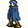

# { .sprite } Dunla

| Stat | Value |
|---|---|
| Class | humanoid |
| HP | 0 |
| Max AP | 10 |
| Attack cost | 10 |
| Move cost | 10 |
| Damage | 0 |
| Attack chance | 0 |
| Block chance | 0 |
| Damage resistance | 0 |
| Critical skill | 0 |
| Critical multiplier | 0 |

## Shop stock

| Item | Chance | Qty |
|---|---|---|
| [Sharp iron dagger](../items/dagger1.md) | 100% | 1 |
| [Villain's blade](../items/sword_villains.md) | 100% | 1 |
| [Fine shirt](../items/shirt2.md) | 100% | 1 |
| [Firm leather armor](../items/armour_firm_leather.md) | 100% | 1 |
| [Superior leather armor](../items/armor2.md) | 100% | 1 |
| [Hardened leather shirt](../items/shirt_dmgresist.md) | 100% | 1 |
| [Snakeskin gloves](../items/gloves3.md) | 100% | 1 |
| [Fine snakeskin gloves](../items/gloves4.md) | 100% | 1 |
| [Polished combat ring](../items/ring_polished_combat.md) | 100% | 1 |
| [Ring of backstabbing](../items/ring_backstab.md) | 100% | 1 |
| [Curved dagger](../items/daggr_curv.md) | 100% | 1 |
| [Bloodletter](../items/daggr_bloodlet.md) | 100% | 1 |
| [Polished gem](../items/gem3.md) | 100% | 5 |

## Found on

- [vilegard_tavern](../maps/vilegard_tavern.md)

## Quests

- [Beer Bootlegging](../quests/beer_bootlegging.md): stages 40
- [Thief apprentice](../quests/Thieves01.md): stages 30

??? quote "Dialogue (9 lines)"

    *What the dialogue says, exactly as in the game files. Lines are listed once; links jump to the line a choice leads to.*

    **`dunla_default`** [Dunla](../monsters/dunla.md): “You look like a smart fellow. Need any supplies?”

    - “Sure, let me see what you have available.” → *shop opens*
    - “What can you tell me about yourself?” → [dunla_1](#d-dunla_1)
    - “I spoke to Tharwyn about who her beer 'distributor' is and she sent me to you.” *(if latest stage of [Beer Bootlegging](../quests/beer_bootlegging.md#stage-30) is 30; NOT reached stage 50 of [The ruthless Crackshot](../quests/Thieves03.md#stage-50))* → [dunla_beer](#d-dunla_beer)
    - “I spoke to Tharwyn about who her beer 'distributor' is and she sent me to you.” *(if latest stage of [Beer Bootlegging](../quests/beer_bootlegging.md#stage-30) is 30; reached stage 50 of [The ruthless Crackshot](../quests/Thieves03.md#stage-50))* → [dunla_beer_10](#d-dunla_beer_10)

    **`dunla_1`** Dunla: “Me? I am no one. You didn't even see me. You certainly did not talk to me.”

    - “Troublemaker sent me to get your report.” *(if reached stage 25 of [Thief apprentice](../quests/Thieves01.md#stage-25); NOT reached stage 30 of [Thief apprentice](../quests/Thieves01.md#stage-30))* → [dunla_guild_1](#d-dunla_guild_1)

    **`dunla_beer`** Dunla: “She did, did she? Well, that is an insider topic, and you are not an "insider". Come back when you are.”

    **`dunla_beer_10`** Dunla: “She did, did she? What do you want to know?”

    - “What is this 'business agreement' that the taven owners have?” → [dunla_beer_20](#d-dunla_beer_20)

    **`dunla_guild_1`** Dunla: “What? I don't know what you are talking about.”

    - “You are no one. No one knows you. No one has seen you.” *(if NOT reached stage 30 of [Thief apprentice](../quests/Thieves01.md#stage-30))* → [dunla_guild_2a](#d-dunla_guild_2a)
    - “You are no one. No one knows you. No one has seen you.” *(if reached stage 30 of [Thief apprentice](../quests/Thieves01.md#stage-30))* → [dunla_guild_2b](#d-dunla_guild_2b)

    **`dunla_beer_20`** Dunla: “That is not for me to say.”

    - “Is the Thieves guild the 'distributors'?” → [dunla_beer_30](#d-dunla_beer_30)

    **`dunla_guild_2a`** Dunla: “So, you are one of us. Here, take my journal.” — **effects:** gives 1× [Dunla's Journal](../items/Dunla_journal.md), sets stage 30 of [Thief apprentice](../quests/Thieves01.md#stage-30)

    - “Thank you.” → *conversation ends*
    - “Do you have anything to trade?” → *shop opens*

    **`dunla_guild_2b`** Dunla: “Sorry, I don't have any more information for you.”

    - “Do you have anything to trade?” → *shop opens*
    - “Ok, bye.” → *conversation ends*

    **`dunla_beer_30`** Dunla: “Yes, yes we are, but if you want to learn more, go talk to Farrik back at our guild house.” — **effects:** sets stage 40 of [Beer Bootlegging](../quests/beer_bootlegging.md#stage-40)

## Community notes

<small>Written by players, not generated from game data. **Observations**: what players notice in-game · **Lore**: the in-world story · **Trivia**: real-world facts, references, development history · **Theory / speculation**: unconfirmed ideas; may just be unfinished content</small>

### Observations

*Nothing here yet. Know something? [Add it](https://github.com/asdfghjkl628/Andor-s-Trail-Wikiiii/new/main/notes/monsters?filename=dunla.md&value=%23%23%20Observations%0A%0A%3C%21--%20what%20players%20notice%20in-game%20--%3E%0A%0A%23%23%20Lore%0A%0A%3C%21--%20the%20in-world%20story%20--%3E%0A%0A%23%23%20Trivia%0A%0A%3C%21--%20real-world%20facts%2C%20references%2C%20development%20history%20--%3E%0A%0A%23%23%20Theory%20/%20speculation%0A%0A%3C%21--%20unconfirmed%20ideas%3B%20may%20just%20be%20unfinished%20content%20--%3E%0A).*

### Lore

*Nothing here yet. Know something? [Add it](https://github.com/asdfghjkl628/Andor-s-Trail-Wikiiii/new/main/notes/monsters?filename=dunla.md&value=%23%23%20Observations%0A%0A%3C%21--%20what%20players%20notice%20in-game%20--%3E%0A%0A%23%23%20Lore%0A%0A%3C%21--%20the%20in-world%20story%20--%3E%0A%0A%23%23%20Trivia%0A%0A%3C%21--%20real-world%20facts%2C%20references%2C%20development%20history%20--%3E%0A%0A%23%23%20Theory%20/%20speculation%0A%0A%3C%21--%20unconfirmed%20ideas%3B%20may%20just%20be%20unfinished%20content%20--%3E%0A).*

### Trivia

*Nothing here yet. Know something? [Add it](https://github.com/asdfghjkl628/Andor-s-Trail-Wikiiii/new/main/notes/monsters?filename=dunla.md&value=%23%23%20Observations%0A%0A%3C%21--%20what%20players%20notice%20in-game%20--%3E%0A%0A%23%23%20Lore%0A%0A%3C%21--%20the%20in-world%20story%20--%3E%0A%0A%23%23%20Trivia%0A%0A%3C%21--%20real-world%20facts%2C%20references%2C%20development%20history%20--%3E%0A%0A%23%23%20Theory%20/%20speculation%0A%0A%3C%21--%20unconfirmed%20ideas%3B%20may%20just%20be%20unfinished%20content%20--%3E%0A).*

### Theory / speculation

*Nothing here yet. Know something? [Add it](https://github.com/asdfghjkl628/Andor-s-Trail-Wikiiii/new/main/notes/monsters?filename=dunla.md&value=%23%23%20Observations%0A%0A%3C%21--%20what%20players%20notice%20in-game%20--%3E%0A%0A%23%23%20Lore%0A%0A%3C%21--%20the%20in-world%20story%20--%3E%0A%0A%23%23%20Trivia%0A%0A%3C%21--%20real-world%20facts%2C%20references%2C%20development%20history%20--%3E%0A%0A%23%23%20Theory%20/%20speculation%0A%0A%3C%21--%20unconfirmed%20ideas%3B%20may%20just%20be%20unfinished%20content%20--%3E%0A).*

<small>Monster ID: `dunla` · Data from v0.8.18</small>
