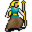

# { .sprite } Egrinda

**Where to find Egrinda:** [Way to sullengard west 3](../maps/way_to_sullengard_west_3.md#pin-npc-egrinda)

<div class="infobox" markdown>

<p class="ib-img">{ .sprite }</p>

| | |
|---|---|
| **Type** | NPC/Enemy (can be spoken to, but can also be fought) |
| **Found in** | Way to sullengard west 3 |
| **Class** | Humanoid |
| **HP** | 255 |
| **XP when defeated** | 989 |
| **Entry ID** | `egrinda` |
| **Introduced** | [v0.8.14](../versions/0.8.14.md) |

</div>

!!! warning "Can be fought"
    This entry can be talked to, but it can also become an opponent: a conversation with this character can end in combat (a dialogue branch leads to a fight).

## Combat statistics

| Statistic | Value |
|---|---|
| Class | Humanoid |
| HP | 255 |
| XP when defeated | 989 |
| Damage | 8 to 16 |
| Attack chance | 270 |
| Block chance | 130 |
| Damage resistance | 19 |
| Max AP | 12 |
| Attack cost | 2 AP |
| Attacks per turn | 6 |
| Move cost | 3 AP |
| Critical skill | 0 |
| Critical multiplier | – |
| Critical hit chance | None (requires both critical skill and a critical multiplier) |

**On hit:** On target: [Baited strike](../conditions/baited_strike.md) (magnitude 4, 2 rounds, 50% chance)

**When hit:** On target: [Trapped](../conditions/trapped.md) (magnitude 1, 2 rounds)

**On death:** On self: removes [Trapped](../conditions/trapped.md)


<p class="verified">Verified against v0.8.18 monster data and game code (`MonsterTypeParser.java`).</p>

## Drops

| Item | Chance | Qty |
|---|---|---|
| [Gold coins](../items/gold.md) | 100% | 1 |
| [Oaken staff](../items/oaken_staff.md) | 100% | 1 |

## Locations

| Map | Region | Up to | Notes |
|---|---|---|---|
| [Way to sullengard west 3](../maps/way_to_sullengard_west_3.md) | – | 1 | Appears later, during a quest |

## Quests

- [Galmore story flags (hidden flag)](../quests/galmore_nondisplayed.md): stage 61

## Dialogue simulator

Set your quest stages and items, then talk to Egrinda. Same rules as the game: same checks, same options, same effects.

<div class="dlg-sim" data-src="../../assets/dialogue/egrinda_selector.json" data-npc="Egrinda" markdown="0"><noscript>The simulator needs JavaScript. The full dialogue is listed below.</noscript></div>

<p class="verified">Rules verified against v0.8.18 game code (ConversationController.java) and dialogue data.</p>

??? quote "Dialogue (13 lines)"

    *Exactly as in the game files. Each line appears once; links jump to where a choice leads.*

    <span id="d-egrinda_selector"></span>**`egrinda_selector`** *(silent check: the first matching branch below is taken)*

    - branch 1 *(if reached stage 61 of [Galmore story flags (hidden flag)](../quests/galmore_nondisplayed.md#stage-61))* → [egrinda_already_given_gold_10](#d-egrinda_already_given_gold_10)
    - branch 2 → [egrinda_wants_gold_10](#d-egrinda_wants_gold_10)

    <span id="d-egrinda_already_given_gold_10"></span>**`egrinda_already_given_gold_10`** Egrinda: “This gold will really help me rebuild my life. Now I just need to decide where to do that.”

    - “May I suggest Feygard?” → [egrinda_already_given_gold_20](#d-egrinda_already_given_gold_20)
    - “May I suggest Nor City?” → [egrinda_already_given_gold_15](#d-egrinda_already_given_gold_15)

    <span id="d-egrinda_wants_gold_10"></span>**`egrinda_wants_gold_10`** Egrinda: “That gold you're holding... it belonged to my family. Stolen from us not long ago, taken by hands no better than yours.”

    - Next → [egrinda_wants_gold_narrator_1](#d-egrinda_wants_gold_narrator_1)

    <span id="d-egrinda_already_given_gold_20"></span>**`egrinda_already_given_gold_20`** Egrinda: “Feygard? Why would I ever want to live there?”

    - “Well, I've heard such wonderful things about that glorious city. There's so many opportunities for almost anyone.” → [egrinda_already_given_gold_30](#d-egrinda_already_given_gold_30)

    <span id="d-egrinda_already_given_gold_15"></span>**`egrinda_already_given_gold_15`** Egrinda: “Nor City? Why would I ever want to live there?”

    - “I'm really not sure why except that I've met so many Shadow folk that rave about that place.” → [egrinda_already_given_gold_25](#d-egrinda_already_given_gold_25)

    <span id="d-egrinda_wants_gold_narrator_1"></span>**`egrinda_wants_gold_narrator_1`** [Dummy NPC](../monsters/none.md): “She takes a cautious step forward.”

    - Next → [egrinda_wants_gold_20](#d-egrinda_wants_gold_20)

    <span id="d-egrinda_already_given_gold_30"></span>**`egrinda_already_given_gold_30`** Egrinda: “Feygard? I don't know, maybe. But thank you for your suggestion.”

    - “Good luck!” → *conversation ends*

    <span id="d-egrinda_already_given_gold_25"></span>**`egrinda_already_given_gold_25`** Egrinda: “Nor City? I don't know, maybe. But thank you for your suggestion.”

    - “Good luck!” → *conversation ends*

    <span id="d-egrinda_wants_gold_20"></span>**`egrinda_wants_gold_20`** [Egrinda](../monsters/egrinda.md): “You can do right and give it back. Or you can learn what happens to those who carry what's not theirs.”

    - “If it's truly yours, then take it. [Hand over the recently looted gold.]” *(if pay 10,000 gold)* → [egrinda_wants_gold_reward_qs61](#d-egrinda_wants_gold_reward_qs61)
    - “Oh, you mean that gold that now belongs to me? It's now mine.” → [egrinda_wants_gold_fight](#d-egrinda_wants_gold_fight)
    - “[Lie] Oh, you mean the 500 gold pieces that I found back there? [Pointing west.]” → [egrinda_wants_gold_lier](#d-egrinda_wants_gold_lier)

    <span id="d-egrinda_wants_gold_reward_qs61"></span>**`egrinda_wants_gold_reward_qs61`** Egrinda: “Thank you very much!” — **effects:** sets stage 61 of [Galmore story flags (hidden flag)](../quests/galmore_nondisplayed.md#stage-61)

    - Next → [egrinda_already_given_gold_10](#d-egrinda_already_given_gold_10)

    <span id="d-egrinda_wants_gold_fight"></span>**`egrinda_wants_gold_fight`** [Dummy NPC](../monsters/none.md): “Egrinda lunges at you.” — **effects:** faction “egrinda” set to -1

    - “You will not survive this!” → [egrinda_fight](#d-egrinda_fight)

    <span id="d-egrinda_wants_gold_lier"></span>**`egrinda_wants_gold_lier`** Egrinda: “Liar!”

    - Next → [egrinda_wants_gold_fight](#d-egrinda_wants_gold_fight)

    <span id="d-egrinda_fight"></span>**`egrinda_fight`** *(silent check: the first matching branch below is taken)*

    - branch 1 → *fight starts*


## Version history

| Version | Change |
|---|---|
| [v0.8.14](../versions/0.8.14.md) | Added<br>Dialogue: 13 lines added |

<p class="verified">Verified against v0.8.18 and every earlier release back to v0.7.0 (game data compared release by release).</p>


??? info "Technical information"

    | | |
    |---|---|
    | Entry ID | `egrinda` |
    | Spawn group | `egrinda` |
    | Loot table | `egrinda_dl` |
    | Conversation | `egrinda_selector` |
    | Faction | `egrinda` |
    | Movement | – |
    | Icon | `monsters_ld1:146` |
    | Defined in | `res/raw/monsterlist_mt_galmore2.json` |

    Raw data:

    ```json
    {
     "id": "egrinda",
     "name": "Egrinda",
     "iconID": "monsters_ld1:146",
     "maxHP": 255,
     "maxAP": 12,
     "moveCost": 3,
     "unique": 1,
     "monsterClass": "humanoid",
     "attackDamage": {
      "min": 8,
      "max": 16
     },
     "faction": "egrinda",
     "phraseID": "egrinda_selector",
     "droplistID": "egrinda_dl",
     "attackCost": 2,
     "attackChance": 270,
     "blockChance": 130,
     "damageResistance": 19,
     "hitEffect": {
      "conditionsTarget": [
       {
        "condition": "baited_strike",
        "magnitude": 4,
        "duration": 2,
        "chance": "50"
       }
      ]
     },
     "hitReceivedEffect": {
      "conditionsTarget": [
       {
        "condition": "trapped",
        "magnitude": 1,
        "duration": 2,
        "chance": "100"
       }
      ]
     },
     "deathEffect": {
      "conditionsSource": [
       {
        "condition": "trapped",
        "chance": "100"
       }
      ]
     }
    }
    ```


??? info "How the XP value is calculated"

    The game computes each enemy's experience value when it loads the data (`MonsterTypeParser.java`):

    XP = ⌈(attacks per turn × attack chance × average damage × (1 + critical skill × critical multiplier) × 3 + HP × (1 + block chance) + 9 × damage resistance) × 0.7⌉

    Percentages are used as fractions (e.g. 60% = 0.6). Enemies whose attacks inflict a condition are worth 50 XP more. The More Exp skill adds a percentage on top.


## Community notes

<small>Written by players, not generated from game data. **Observations**: what players notice in-game · **Lore**: the in-world story · **Trivia**: real-world facts, references, development history · **Theory / speculation**: unconfirmed ideas; may just be unfinished content</small>

### Observations

*No notes yet. Contributions are welcome: [add a note](https://github.com/asdfghjkl628/Andor-s-Trail-Wikiiii/new/main/notes/monsters?filename=egrinda.md&value=%23%23%20Observations%0A%0A%3C%21--%20what%20players%20notice%20in-game%20--%3E%0A%0A%23%23%20Lore%0A%0A%3C%21--%20the%20in-world%20story%20--%3E%0A%0A%23%23%20Trivia%0A%0A%3C%21--%20real-world%20facts%2C%20references%2C%20development%20history%20--%3E%0A%0A%23%23%20Theory%20/%20speculation%0A%0A%3C%21--%20unconfirmed%20ideas%3B%20may%20just%20be%20unfinished%20content%20--%3E%0A).*

### Lore

*No notes yet. Contributions are welcome: [add a note](https://github.com/asdfghjkl628/Andor-s-Trail-Wikiiii/new/main/notes/monsters?filename=egrinda.md&value=%23%23%20Observations%0A%0A%3C%21--%20what%20players%20notice%20in-game%20--%3E%0A%0A%23%23%20Lore%0A%0A%3C%21--%20the%20in-world%20story%20--%3E%0A%0A%23%23%20Trivia%0A%0A%3C%21--%20real-world%20facts%2C%20references%2C%20development%20history%20--%3E%0A%0A%23%23%20Theory%20/%20speculation%0A%0A%3C%21--%20unconfirmed%20ideas%3B%20may%20just%20be%20unfinished%20content%20--%3E%0A).*

### Trivia

*No notes yet. Contributions are welcome: [add a note](https://github.com/asdfghjkl628/Andor-s-Trail-Wikiiii/new/main/notes/monsters?filename=egrinda.md&value=%23%23%20Observations%0A%0A%3C%21--%20what%20players%20notice%20in-game%20--%3E%0A%0A%23%23%20Lore%0A%0A%3C%21--%20the%20in-world%20story%20--%3E%0A%0A%23%23%20Trivia%0A%0A%3C%21--%20real-world%20facts%2C%20references%2C%20development%20history%20--%3E%0A%0A%23%23%20Theory%20/%20speculation%0A%0A%3C%21--%20unconfirmed%20ideas%3B%20may%20just%20be%20unfinished%20content%20--%3E%0A).*

### Theory / speculation

*No notes yet. Contributions are welcome: [add a note](https://github.com/asdfghjkl628/Andor-s-Trail-Wikiiii/new/main/notes/monsters?filename=egrinda.md&value=%23%23%20Observations%0A%0A%3C%21--%20what%20players%20notice%20in-game%20--%3E%0A%0A%23%23%20Lore%0A%0A%3C%21--%20the%20in-world%20story%20--%3E%0A%0A%23%23%20Trivia%0A%0A%3C%21--%20real-world%20facts%2C%20references%2C%20development%20history%20--%3E%0A%0A%23%23%20Theory%20/%20speculation%0A%0A%3C%21--%20unconfirmed%20ideas%3B%20may%20just%20be%20unfinished%20content%20--%3E%0A).*


<small>Data from v0.8.18</small>
