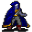

# { .sprite } Ehrenfest

| Stat | Value |
|---|---|
| Class | humanoid |
| HP | 0 |
| Max AP | 10 |
| Attack cost | 10 |
| Move cost | 10 |
| Damage | 0 |
| Attack chance | 0 |
| Block chance | 0 |
| Damage resistance | 0 |
| Critical skill | 0 |
| Critical multiplier | 0 |

## Found on

- [blackwater_mountain11](../maps/blackwater_mountain11.md)
- [blackwater_mountain43](../maps/blackwater_mountain43.md)
- [elm5f_2](../maps/elm5f_2.md)
- [elm_mine1](../maps/elm_mine1.md)

## Quests

- [Climbing up is forbidden](../quests/Omi2_bwm1.md): stages 6, 7, 10, 11, 15, 16, 20, 31, 33, 45, 46, 53
- [Hidden: events in bwm (hidden flag)](../quests/bwm72_beginning.md): stages 5, 6, 7, 14, 21

??? quote "Dialogue (126 lines)"

    *What the dialogue says, exactly as in the game files. Lines are listed once; links jump to the line a choice leads to.*

    **`ehrenfest_selector_2`** *(silent check: the first matching branch below is taken)*

    - branch 1 *(if reached stage 53 of [Climbing up is forbidden](../quests/Omi2_bwm1.md#stage-53))* → [omi2_fix_ehrenfest_53](#d-omi2_fix_ehrenfest_53)
    - branch 2 *(if reached stage 52 of [Climbing up is forbidden](../quests/Omi2_bwm1.md#stage-52))* → [ehrenfest_49](#d-ehrenfest_49)
    - branch 3 *(if reached stage 34 of [Climbing up is forbidden](../quests/Omi2_bwm1.md#stage-34))* → [ortholion_conversation2_1](#d-ortholion_conversation2_1)
    - branch 4 *(if reached stage 40 of [Climbing up is forbidden](../quests/Omi2_bwm1.md#stage-40))* → [ortholion_conversation2_1](#d-ortholion_conversation2_1)
    - branch 5 *(if reached stage 33 of [Climbing up is forbidden](../quests/Omi2_bwm1.md#stage-33))* → [ehrenfest_46b](#d-ehrenfest_46b)
    - branch 6 *(if reached stage 32 of [Climbing up is forbidden](../quests/Omi2_bwm1.md#stage-32))* → [ehrenfest_39c](#d-ehrenfest_39c)
    - branch 7 *(if reached stage 14 of [Hidden: events in bwm (hidden flag)](../quests/bwm72_beginning.md#stage-14))* → [ehrenfest_38a](#d-ehrenfest_38a)
    - branch 8 *(if reached stage 20 of [Climbing up is forbidden](../quests/Omi2_bwm1.md#stage-20))* → [ehrenfest_34](#d-ehrenfest_34)
    - branch 9 *(if reached stage 16 of [Climbing up is forbidden](../quests/Omi2_bwm1.md#stage-16))* → [ehrenfest_30c](#d-ehrenfest_30c)
    - branch 10 *(if reached stage 15 of [Climbing up is forbidden](../quests/Omi2_bwm1.md#stage-15))* → [ehrenfest_25b](#d-ehrenfest_25b)
    - branch 11 *(if reached stage 11 of [Climbing up is forbidden](../quests/Omi2_bwm1.md#stage-11))* → [ehrenfest_11](#d-ehrenfest_11)
    - branch 12 *(if reached stage 7 of [Climbing up is forbidden](../quests/Omi2_bwm1.md#stage-7))* → [ehrenfest_8](#d-ehrenfest_8)
    - branch 13 *(if reached stage 7 of [Hidden: events in bwm (hidden flag)](../quests/bwm72_beginning.md#stage-7))* → [ehrenfest_4](#d-ehrenfest_4)
    - branch 14 *(if reached stage 6 of [Hidden: events in bwm (hidden flag)](../quests/bwm72_beginning.md#stage-6))* → [ehrenfest_3b](#d-ehrenfest_3b)
    - branch 15 *(if latest stage of [Climbing up is forbidden](../quests/Omi2_bwm1.md#stage-6) is 6)* → [ehrenfest_2b2](#d-ehrenfest_2b2)
    - branch 16 → [ehrenfest_0](#d-ehrenfest_0)

    **`omi2_fix_ehrenfest_53`** Ehrenfest: “You are wrong. I'm not here, just an illusion.” — **effects:** removes monsters from blackwater_mountain43, removes monsters from blackwater_mountain43

    **`ehrenfest_49`** Ehrenfest: “Hmm... $playername, I wonder how your brother Andor would react if he knew I had to kill you.”

    - “What do you know about him?!” → [ehrenfest_50a](#d-ehrenfest_50a)
    - “So you're the guy that Lodar told me about.” *(if reached stage 72 of [Search for Andor](../quests/andor.md#stage-72))* → [ehrenfest_50b](#d-ehrenfest_50b)
    - “I won't hear your lies. I'll finish you right here.” → [ehrenfest_50c](#d-ehrenfest_50c)

    **`ortholion_conversation2_1`** [General Ortholion](../monsters/ortholion.md): “Ehrenfest, you have come this far just to get rid of me...” — **effects:** removes monsters from blackwater_mountain31

    - “Ehrenfest, here I am to help you.” *(if reached stage 33 of [Climbing up is forbidden](../quests/Omi2_bwm1.md#stage-33))* → [ortholion_conversation2_2a](#d-ortholion_conversation2_2a)
    - “Ortholion, beware! He is a dangerous liar!” *(if reached stage 40 of [Climbing up is forbidden](../quests/Omi2_bwm1.md#stage-40))* → [ortholion_conversation2_2b](#d-ortholion_conversation2_2b)

    **`ehrenfest_46b`** Ehrenfest: “Excellent, excellent! I will lead the way, meet me at Blackwater Settlement. Beware of the monsters.” — **effects:** sets stage 33 of [Climbing up is forbidden](../quests/Omi2_bwm1.md#stage-33), removes monsters from elm_mine1

    - “Fine...Let's do this.” → *NPC leaves*
    - “Same to you, those scared monsters will make way to me.” → *NPC leaves*

    **`ehrenfest_39c`** Ehrenfest: “It's time to share what we've discovered.”

    - “You are already aware of my information.” → [ehrenfest_40b](#d-ehrenfest_40b)
    - “What have you found out?” → [ehrenfest_40c](#d-ehrenfest_40c)

    **`ehrenfest_38a`** Ehrenfest: “I won't try to convince you. Now you must decide whether to help me or not. I won't ask twice, so make your choice wisely.” — **effects:** sets stage 14 of [Hidden: events in bwm (hidden flag)](../quests/bwm72_beginning.md#stage-14)

    - “I don't trust you. I will find my own way to solve this.” *(if NOT reached stage 32 of [Climbing up is forbidden](../quests/Omi2_bwm1.md#stage-32))* → [ehrenfest_39a](#d-ehrenfest_39a)
    - “I'll think about it. See you soon.” → *conversation ends*
    - “OK, I will help you. Let's solve this once for all.” *(if NOT reached stage 31 of [Climbing up is forbidden](../quests/Omi2_bwm1.md#stage-31))* → [ehrenfest_39b](#d-ehrenfest_39b)

    **`ehrenfest_34`** Ehrenfest: “$playername, how is it going?” — **effects:** sets stage 20 of [Climbing up is forbidden](../quests/Omi2_bwm1.md#stage-20)

    - “Nothing interesting yet.” → [ehrenfest_35a](#d-ehrenfest_35a)
    - “You lied to me. There wasn't any missing couple.” *(if reached stage 30 of [Climbing up is forbidden](../quests/Omi2_bwm1.md#stage-30))* → [ehrenfest_35b](#d-ehrenfest_35b)

    **`ehrenfest_30c`** Ehrenfest: “Now that everything is told, let's find some answers.”

    - “More chatting? No thanks.” → [ehrenfest_31b](#d-ehrenfest_31b)
    - “What's your proposal?” → [ehrenfest_31a](#d-ehrenfest_31a)

    **`ehrenfest_25b`** Ehrenfest: “Anything more you can tell me about that place?”

    - “Give me some time to remember.” → [ehrenfest_26b](#d-ehrenfest_26b)
    - “The corpses were covered by cobwebs. They were probably tortured.” → [ehrenfest_26a](#d-ehrenfest_26a)

    **`ehrenfest_11`** Ehrenfest: “Hello again my little friend. We'll be safe from prying ears here.”

    - “Care to explain your reasons for stalking me?” → [ehrenfest_12](#d-ehrenfest_12)

    **`ehrenfest_8`** Ehrenfest: “Well, how did it go?”

    - “Nothing of your concern. Bye.” → *conversation ends*
    - “Good, don't bother me.” → *conversation ends*
    - “No luck, but I heard a tense conversation between a Feygard general and one of the patrol captains.” *(if reached stage 9 of [Climbing up is forbidden](../quests/Omi2_bwm1.md#stage-9))* → [ehrenfest_9](#d-ehrenfest_9)

    **`ehrenfest_4`** [Ehrenfest](../monsters/ehrenfest.md): “*looks nervous* I told you. Something big is about to happen. I believe it is somehow related to what you've seen up in the mountain.”

    - “How did they reach this place?” → [ehrenfest_5a](#d-ehrenfest_5a)
    - “How do you know what I've seen?” → [ehrenfest_5b](#d-ehrenfest_5b)

    **`ehrenfest_3b`** Ehrenfest: “This is not a good place to talk about this. But trust me, there is much at stake and Prim's situation is only going to get worse. Let me introduce myself. My name is Ehrenfest, and...” — **effects:** sets stage 6 of [Hidden: events in bwm (hidden flag)](../quests/bwm72_beginning.md#stage-6)

    - Next → [ehrenfest_conversation_1](#d-ehrenfest_conversation_1)

    **`ehrenfest_2b2`** Ehrenfest: “Look, I personally don't think that telling the guards is a good choice.” — **effects:** sets stage 6 of [Climbing up is forbidden](../quests/Omi2_bwm1.md#stage-6)

    - “Care to explain?” → [ehrenfest_3b](#d-ehrenfest_3b)
    - “I will try anyway, thanks.” → [ehrenfest_3a](#d-ehrenfest_3a)

    **`ehrenfest_0`** [Ehrenfest](../monsters/ehrenfest.md): “Damn it, kid! Watch your step. You almost knocked me over!” — **effects:** spawns monsters on blackwater_mountain11

    - “Sorry, I am in a hurry.” → [ehrenfest_1a](#d-ehrenfest_1a)
    - “Watch my step? You'd better watch your tongue!” → [ehrenfest_1b](#d-ehrenfest_1b)

    **`ehrenfest_50a`** Ehrenfest: “If only you were stronger...Maybe I could convince you to join us, [cough] but I have to admit my plan was blaming you for Ortholion's death. You know, we're tired of you asking questions here and there, [cough] [cough].”

    - Next → [ehrenfest_51](#d-ehrenfest_51)

    **`ehrenfest_50b`** Ehrenfest: “Lodar, right. He sins of double morality! His poisons killed hundreds, but he prefers to hide in that dirty forest and escape any responsibility like a retired farmer.”

    - Next → [ehrenfest_50a](#d-ehrenfest_50a)

    **`ehrenfest_50c`** Ehrenfest: “No you won't, sorry. My mission is done here. It was done weeks ago, but I...Someone decided I should stay and draw Feygard's attention here.”

    - Next → [ehrenfest_50a](#d-ehrenfest_50a)

    **`ortholion_conversation2_2a`** [Ehrenfest](../monsters/ehrenfest.md): “The crimes you have commited must be punished!”

    - Next → [ortholion_conversation2_3a](#d-ortholion_conversation2_3a)

    **`ortholion_conversation2_2b`** [Ehrenfest](../monsters/ehrenfest.md): “I hoped someone else would take the blame for this. But don't worry, soon we shall be unstoppable.”

    - “Stop!” → [ortholion_conversation2_3b](#d-ortholion_conversation2_3b)
    - “Do you always talk this much, liar?” → [ortholion_conversation2_3b](#d-ortholion_conversation2_3b)

    **`ehrenfest_40b`** Ehrenfest: “Hasn't anybody said anything else?”

    - “No, nobody.” → [ehrenfest_41a](#d-ehrenfest_41a)
    - “Nothing important.” → [ehrenfest_41c](#d-ehrenfest_41c)

    **`ehrenfest_40c`** Ehrenfest: “I just confirmed my suspicion.”

    - Next → [ehrenfest_41b](#d-ehrenfest_41b)

    **`ehrenfest_39a`** Ehrenfest: “I see...Good luck, you'll need it. [Ehrenfest walks slowly out of the room]” — **effects:** sets stage 31 of [Climbing up is forbidden](../quests/Omi2_bwm1.md#stage-31), removes monsters from elm_mine1

    - “You're still being shady, huh. Goodbye.” → *NPC leaves*
    - “Shadow be with you.” → [ehrenfest_40a](#d-ehrenfest_40a)

    **`ehrenfest_39b`** Ehrenfest: “Excellent. Let's share what we found out then.”

    - “You're already aware of my information.” → [ehrenfest_40b](#d-ehrenfest_40b)
    - “I'm all ears.” → [ehrenfest_40c](#d-ehrenfest_40c)

    **`ehrenfest_35a`** Ehrenfest: “Don't give up. We'll eventually get some answers.”

    **`ehrenfest_35b`** Ehrenfest: “You are right, but I didn't lie.”

    - “How is it not a lie?” → [ehrenfest_36](#d-ehrenfest_36)

    **`ehrenfest_31b`** Ehrenfest: “Okay, okay. Let's take a break. We'll talk later.”

    - “Thank you.” → *conversation ends*
    - “Do you have anything to trade?” → [ehrenfest_32b](#d-ehrenfest_32b)

    **`ehrenfest_31a`** Ehrenfest: “We must gather information. I am convinced Lorn's death has to do with what you saw down the hole.”

    - Next → [ehrenfest_32a](#d-ehrenfest_32a)

    **`ehrenfest_26b`** Ehrenfest: “Fine, I'll be waiting here.”

    **`ehrenfest_26a`** Ehrenfest: “Tortured, you say? That makes no sense!”

    - “That's what I saw.” → [ehrenfest_27a](#d-ehrenfest_27a)
    - “I took some ropes to prove what I saw to the guards...” *(if hand over 1× [Blood-stained rope](../items/bwm72_rope.md))* → [ehrenfest_27b](#d-ehrenfest_27b)

    **`ehrenfest_12`** Ehrenfest: “I only saw you by chance. Please, let me explain what happened.”

    - “Sure, go on.” → [ehrenfest_13a](#d-ehrenfest_13a)
    - “I'm all ears.” → [ehrenfest_13a](#d-ehrenfest_13a)
    - “Get straight to the point.” → [ehrenfest_13b](#d-ehrenfest_13b)

    **`ehrenfest_9`** Ehrenfest: “I did see that general leaving. Now his henchmen are patrolling the village entrance.”

    - “They are up to no good.” → [ehrenfest_10a](#d-ehrenfest_10a)
    - “It's good to see they are protecting the villagers.” → [ehrenfest_10b](#d-ehrenfest_10b)

    **`ehrenfest_5a`** Ehrenfest: “I assume the same way you did.”

    - Next → [ehrenfest_6a](#d-ehrenfest_6a)

    **`ehrenfest_5b`** Ehrenfest: “I've seen you climbing up the mountainside and going down the hole, of course! I was waiting for your return.”

    - “All of this is getting too shady. I'd better leave.” → [ehrenfest_6b](#d-ehrenfest_6b)
    - “Continue, please.” → [ehrenfest_6a](#d-ehrenfest_6a)

    **`ehrenfest_conversation_1`** [General's henchman](../monsters/ortholion_guard_hidden.md): “OUT OF THE WAY, COMMONERS!”

    - Next → [ehrenfest_conversation_1a](#d-ehrenfest_conversation_1a)

    **`ehrenfest_3a`** Ehrenfest: “OK, kid. Do it, and I'll wait here for your return, heh. By the way, my name is Ehrenfest.” — **effects:** sets stage 7 of [Climbing up is forbidden](../quests/Omi2_bwm1.md#stage-7), spawns monsters on blackwater_mountain29, spawns monsters on blackwater_mountain29, spawns monsters on blackwater_mountain29, spawns monsters on blackwater_mountain29, spawns monsters on blackwater_mountain29, sets stage 5 of [Hidden: events in bwm (hidden flag)](../quests/bwm72_beginning.md#stage-5)

    - “Do whatever you want, bye.” → *conversation ends*
    - “OK.” → *conversation ends*

    **`ehrenfest_1a`** Ehrenfest: “Umm, what's the matter?”

    - “As I said, I don't have time to talk. I need to report something important.” → [ehrenfest_2a](#d-ehrenfest_2a)
    - “Nothing of your concern. I must go inside.” → [ehrenfest_2a](#d-ehrenfest_2a)
    - “I have discovered something suspicious inside the mountain.” → [ehrenfest_2b](#d-ehrenfest_2b)

    **`ehrenfest_1b`** Ehrenfest: “Not only blind but bad-mannered too! You remind me of myself when I was younger. I was not blind, though, ha ha ha!”

    - Next → [ehrenfest_1b2](#d-ehrenfest_1b2)

    **`ehrenfest_51`** Ehrenfest: “Don't look at me that way, kid...[laughs]. This is too complicated for a young mind.”

    - “Die!” → [ehrenfest_52](#d-ehrenfest_52)
    - “How dare you!” → [ehrenfest_52](#d-ehrenfest_52)

    **`ortholion_conversation2_3a`** [General Ortholion](../monsters/ortholion.md): “Hmmm... What crimes, evil creature? You even dared to think you had a chance to trick a general of glorious Feygard?!”

    - Next → [ortholion_conversation2_4a](#d-ortholion_conversation2_4a)

    **`ortholion_conversation2_3b`** [General Ortholion](../monsters/ortholion.md): “[unsheathes his sword] Well, enough talk. I won't ignore your threats, evil creature.”

    - “Hey, stop you two!” → [ortholion_conversation2_4b](#d-ortholion_conversation2_4b)
    - “Ehrenfest, you have many things to explain!” → [ortholion_conversation2_4b](#d-ortholion_conversation2_4b)

    **`ehrenfest_41a`** Ehrenfest: “Then, it seems I've been the lucky one this time.”

    - “What did you find out?” → [ehrenfest_41b](#d-ehrenfest_41b)

    **`ehrenfest_41c`** Ehrenfest: “Are you sure?”

    - “Yes. Please, tell me what you've discovered.” → [ehrenfest_41b](#d-ehrenfest_41b)

    **`ehrenfest_41b`** Ehrenfest: “Both villagers and guards seemed pretty uneasy when I asked about the Feygard soldiers' presence.”

    - Next → [ehrenfest_42](#d-ehrenfest_42)

    **`ehrenfest_40a`** Ehrenfest: “It is, it will.”

    - “You're still being shady, huh.” → *NPC leaves*

    **`ehrenfest_36`** Ehrenfest: “Remember while you were asking for Lorn, I asked some villagers precisely about that missing couple.”

    - “I'm not going to hear your stories anymore.” → [ehrenfest_37a](#d-ehrenfest_37a)
    - “What I remember is you, telling me about that missing couple.” → [ehrenfest_37a](#d-ehrenfest_37a)

    **`ehrenfest_32b`** Ehrenfest: “I'm afraid not.”

    - “OK, we'll talk later.” → *conversation ends*

    **`ehrenfest_32a`** Ehrenfest: “You will have to talk to the villagers of Prim. We have to find out what happened to Lorn's partners, about whom we know nothing yet.”

    - “What will you do?” → [ehrenfest_33a](#d-ehrenfest_33a)
    - “Sounds boring, but I'll do it.” → [ehrenfest_33b](#d-ehrenfest_33b)
    - “Fine. I'll go.” → [ehrenfest_33b](#d-ehrenfest_33b)

    **`ehrenfest_27a`** Ehrenfest: “Are you sure?”

    - “Yes, look at this blood-stained rope.” *(if hand over 1× [Blood-stained rope](../items/bwm72_rope.md))* → [ehrenfest_27b](#d-ehrenfest_27b)
    - “Yes, look at this blood-stained rope... Oh, I seem to have lost it. Just a second, I'll go and find it.” *(if NOT carry 1× [Blood-stained rope](../items/bwm72_rope.md))* → [ehrenfest_27b](#d-ehrenfest_27b)

    **`ehrenfest_27b`** Ehrenfest: “Just after witnessing my savior's death, I ran away and came back to the village.” — **effects:** sets stage 16 of [Climbing up is forbidden](../quests/Omi2_bwm1.md#stage-16)

    - “Did you tell the guards what you saw?” → [ehrenfest_28a](#d-ehrenfest_28a)
    - “Shame on you! You should have buried him at least.” → [ehrenfest_28b](#d-ehrenfest_28b)

    **`ehrenfest_13a`** Ehrenfest: “I arrived here several weeks ago for no particularly interesting reason. I am part of a family of explorers and travelers, and the story of a ruined tunnel infested by dangerous beasts was something I wanted to see with my own eyes.”

    - Next → [ehrenfest_14](#d-ehrenfest_14)

    **`ehrenfest_13b`** Ehrenfest: “Hmm, I will try.”

    - Next → [ehrenfest_13a](#d-ehrenfest_13a)

    **`ehrenfest_10a`** Ehrenfest: “Most probably.”

    - Next → [ehrenfest_6a](#d-ehrenfest_6a)

    **`ehrenfest_10b`** Ehrenfest: “Hah! I seriously doubt they are here just for that.”

    - “Are you accusing the great soldiers of Feygard of anything? I'd better leave.” → *conversation ends*
    - “What do you think?” → [ehrenfest_6a](#d-ehrenfest_6a)

    **`ehrenfest_6a`** [Ehrenfest](../monsters/ehrenfest.md): “Look, this is not a safe place to talk. Meet me in the Elm mine, west of here, OK?”

    - “I will think about it.” → [ehrenfest_7a](#d-ehrenfest_7a)
    - “OK, we will meet there.” → [ehrenfest_7b](#d-ehrenfest_7b)
    - “I hope this won't get any shadier.” → [ehrenfest_7c](#d-ehrenfest_7c)

    **`ehrenfest_6b`** Ehrenfest: “Do whatever you want, youngster. But two minds sometimes work better than one, and four eyes better than two...”

    - Next → [ehrenfest_6a](#d-ehrenfest_6a)

    **`ehrenfest_conversation_1a`** [Dummy NPC](../monsters/none.md): “You and Ehrenfest are startled, and step aside. Three men with Feygard insignia leave the hall. You remain silent as they pass.”

    - Next → [ehrenfest_conversation_2](#d-ehrenfest_conversation_2)

    **`ehrenfest_2a`** Ehrenfest: “I see. But keep in mind that no one inside there will pay attention to you, whatever you say.”

    - “Why is that?” → [ehrenfest_2b2](#d-ehrenfest_2b2)
    - “You never know...” → [ehrenfest_3a](#d-ehrenfest_3a)
    - “Whatever, I will try anyway.” → [ehrenfest_3a](#d-ehrenfest_3a)

    **`ehrenfest_2b`** Ehrenfest: “Have you? *He gets closer*”

    - Next → [ehrenfest_2b2](#d-ehrenfest_2b2)

    **`ehrenfest_1b2`** Ehrenfest: “I'll let it go. But tell me, what is it that you find so urgent?”

    - “I don't trust you with something this important, so nothing.” → [ehrenfest_2a](#d-ehrenfest_2a)
    - “I have information related to recent disappearances.” → [ehrenfest_2b](#d-ehrenfest_2b)
    - “Sorry, it's important, so I must go.” → [ehrenfest_2a](#d-ehrenfest_2a)

    **`ehrenfest_52`** Ehrenfest: “How tetchy! The guards I tortured eventually understood my words... Maybe you should try that orangish substance too.”

    - Next → [ehrenfest_53](#d-ehrenfest_53)

    **`ortholion_conversation2_4a`** [Ehrenfest](../monsters/ehrenfest.md): “I'm... [stares at you] $playername! It's time to end with all of this!”

    - “Right! Ortholion must pay for killing innocent people from Prim!” → [ortholion_conversation2_5a](#d-ortholion_conversation2_5a)
    - “Gladly. Ortholion, prepare to die!” *(if reached stage 35 of [Climbing up is forbidden](../quests/Omi2_bwm1.md#stage-35))* → [ortholion_conversation2_5a2](#d-ortholion_conversation2_5a2)

    **`ortholion_conversation2_4b`** [Ehrenfest](../monsters/ehrenfest.md): “[People from the tavern start looking at the place where Ortholion and Ehrenfest are about to have a fight] [looks around] No...Not yet. Argh! You kid, betrayer! You are about to discover how wrongly you have chosen!”

    - Next → [ortholion_conversation2_5b](#d-ortholion_conversation2_5b)

    **`ehrenfest_42`** Ehrenfest: “I strongly believe they're related to the disappearings.”

    - “Why would they do this?” → [ehrenfest_43](#d-ehrenfest_43)
    - “That has to be taken with a grain of salt.” → [ehrenfest_43](#d-ehrenfest_43)

    **`ehrenfest_37a`** Ehrenfest: “$playername, I'm not lying!”

    - “Again, you did. I cannot trust you.” → [ehrenfest_38a](#d-ehrenfest_38a)
    - “I can't be sure of that.” → [ehrenfest_37a](#d-ehrenfest_37a)

    **`ehrenfest_33a`** Ehrenfest: “I will ask in the inn about the missing couple that Lorn and his partners followed.”

    - “I'd complain, but I prefer not to hear your explanation.” → [ehrenfest_33b](#d-ehrenfest_33b)
    - “Fine.” → [ehrenfest_33b](#d-ehrenfest_33b)

    **`ehrenfest_33b`** Ehrenfest: “Excellent. Let's meet again later, best of luck.” — **effects:** sets stage 20 of [Climbing up is forbidden](../quests/Omi2_bwm1.md#stage-20)

    - “Shadow be with you.” → *conversation ends*
    - “Same to you.” → *conversation ends*

    **`ehrenfest_28a`** Ehrenfest: “I tried, but they considered it an accident. My constant babbling did not help...”

    - “Why did the guards not bury their partner?” → [ehrenfest_29a](#d-ehrenfest_29a)
    - “An accident?” → [ehrenfest_29a](#d-ehrenfest_29a)

    **`ehrenfest_28b`** Ehrenfest: “You are honestly right, but it's too late to go back...”

    - “No, it's not.” → [ehrenfest_29b](#d-ehrenfest_29b)
    - “You didn't bury him, but why didn't the guards either?” → [ehrenfest_29a](#d-ehrenfest_29a)

    **`ehrenfest_14`** Ehrenfest: “The rumors were true. Those gornauds are not natural creatures. They gave me a really hard time at first.”

    - “Please go on.” → [ehrenfest_15](#d-ehrenfest_15)
    - “What happened then?” → [ehrenfest_15](#d-ehrenfest_15)

    **`ehrenfest_7a`** Ehrenfest: “OK, I'll be waiting for you there.” — **effects:** sets stage 11 of [Climbing up is forbidden](../quests/Omi2_bwm1.md#stage-11), spawns monsters on elm_mine1, removes monsters from blackwater_mountain11

    - “Bye.” → *NPC leaves*
    - “Shadow be with you.” → *NPC leaves*

    **`ehrenfest_7b`** Ehrenfest: “Excellent. Try not to raise suspicions.” — **effects:** sets stage 11 of [Climbing up is forbidden](../quests/Omi2_bwm1.md#stage-11), spawns monsters on elm_mine1, removes monsters from blackwater_mountain11

    - “You're the suspicious guy here.” → *NPC leaves*
    - “OK, bye.” → *NPC leaves*

    **`ehrenfest_7c`** Ehrenfest: “I'm afraid it will. Farewell.” — **effects:** sets stage 11 of [Climbing up is forbidden](../quests/Omi2_bwm1.md#stage-11), spawns monsters on elm_mine1, removes monsters from blackwater_mountain11

    - “Uhh, great. Bye.” → *NPC leaves*
    - “Shadow be with you.” → *NPC leaves*
    - “See you later then.” → *NPC leaves*

    **`ehrenfest_conversation_2`** [General Ortholion](../monsters/ortholion_hidden.md): “I will say it only once. No taverns, no exploring, no drama with those untrained Prim guards. And for the glory of our homeland, don't pursue any injured monster.”

    - Next → [ehrenfest_conversation_3](#d-ehrenfest_conversation_3)

    **`ehrenfest_53`** [???](../monsters/unknown.md): “Ehrenfest jumps off the cliff, sinking in the dark streams, leaving you in the middle of a word. You soon begin to hear steps. Someone's coming - maybe the Feygard reinforcements?” — **effects:** removes monsters from elm5f_2, removes monsters from blackwater_mountain43, removes monsters from blackwater_mountain43, sets stage 53 of [Climbing up is forbidden](../quests/Omi2_bwm1.md#stage-53), spawns monsters on elm5f_2, spawns monsters on elm5f_2

    - “Check who is coming.” → *conversation ends*
    - “Leave.” → *conversation ends*

    **`ortholion_conversation2_5a`** [General Ortholion](../monsters/ortholion.md): “A kid? You come with a kid accusing me of something I never heard about?”

    - Next → [ortholion_conversation2_6a](#d-ortholion_conversation2_6a)

    **`ortholion_conversation2_5a2`** [Dummy NPC](../monsters/none.md): “General Ortholion ignores you and continues to speak to Ehrenfest.”

    - Next → [ortholion_conversation2_6a](#d-ortholion_conversation2_6a)

    **`ortholion_conversation2_5b`** [General Ortholion](../monsters/ortholion.md): “[The general tries to land a strike on Ehrenfest, but he just cuts a piece of his cloak. Ehrenfest is gone] Hmpf...” — **effects:** sets stage 45 of [Climbing up is forbidden](../quests/Omi2_bwm1.md#stage-45), removes monsters from blackwater_mountain43

    - “Eh... Greetings, general.” → [ortholion_1](#d-ortholion_1)
    - “I thought Feygard generals were faster swinging their blades.” → [ortholion_1](#d-ortholion_1)

    **`ehrenfest_43`** Ehrenfest: “Put it this way. A weakened Prim will be easier to control. Although Lord Geomyr theoretically reigns over the whole land, his influence has its limits, as I'm sure you know well. Isolated regions like Prim have considerable independence.”

    - Next → [ehrenfest_44](#d-ehrenfest_44)

    **`ehrenfest_29a`** Ehrenfest: “Strange, isn't it? Really, they didn't seem to care about Lorn, or the other missing people. It was all the monsters' fault and that's all.”

    - “There's something too shady in all of this.” → [ehrenfest_30a](#d-ehrenfest_30a)
    - “Guards, lazy as hell in every place I go.” → [ehrenfest_30b](#d-ehrenfest_30b)

    **`ehrenfest_29b`** Ehrenfest: “[Ehrenfest stays quiet with his head down]”

    - “So ... Why didn't the guards bring Lorn's remains to the village?” → [ehrenfest_29a](#d-ehrenfest_29a)

    **`ehrenfest_15`** Ehrenfest: “I managed to reach the other entrance of the tunnel, but with no potions or fresh food I thought it was the end. Luckily, a guy called Lorn rescued me and brought me here.”

    - “That name seems familiar to me, somehow.” → [ehrenfest_16](#d-ehrenfest_16)
    - “Now to the point, please.” → [ehrenfest_16](#d-ehrenfest_16)

    **`ehrenfest_conversation_3`** Ehrenfest: “I have a bad feeling about all this. These villagers might be hiding something. Tell the mountain scouts to wait for me at the tunnel entrance. They will escort me up to Blackwater Settlement.”

    - Next → [ehrenfest_conversation_4](#d-ehrenfest_conversation_4)

    **`ortholion_conversation2_6a`** [General Ortholion](../monsters/ortholion.md): “Ehrenfest, you have bothered me more than I am willing to abide. Blackwater Settlement guards will take care of you.”

    - “Those guards are no match for...” *(if reached stage 21 of [Hidden: events in bwm (hidden flag)](../quests/bwm72_beginning.md#stage-21))* → [ortholion_conversation2_7a](#d-ortholion_conversation2_7a)
    - “Die!” *(if NOT reached stage 21 of [Hidden: events in bwm (hidden flag)](../quests/bwm72_beginning.md#stage-21))* → [ortholion_conversation2_6a2](#d-ortholion_conversation2_6a2)

    **`ortholion_1`** Ehrenfest: “Look, I don't have time for you, but I don't kill kids, not yet. So step aside.”

    - “Are you threatening me?” *(if reached stage 34 of [Climbing up is forbidden](../quests/Omi2_bwm1.md#stage-34))* → [ortholion_4c](#d-ortholion_4c)
    - “I'm here to inform you about Ehrenfest. He's probably behind some disappearances in Prim.” *(if reached stage 40 of [Climbing up is forbidden](../quests/Omi2_bwm1.md#stage-40))* → [ortholion_2b](#d-ortholion_2b)

    **`ehrenfest_44`** Ehrenfest: “It is well known there is an ancient chamber dedicated to worship of the Shadow, which is probably Lord Geomyr's most powerful threat.”

    - “What should we do?” → [ehrenfest_45a](#d-ehrenfest_45a)
    - “Maybe you're right...” → [ehrenfest_45b](#d-ehrenfest_45b)

    **`ehrenfest_30a`** Ehrenfest: “Yes. And that's why I need your help.”

    - “What can I do?” → [ehrenfest_31a](#d-ehrenfest_31a)
    - “You should give me a reward just for listening to this tripe.” → [ehrenfest_31b](#d-ehrenfest_31b)

    **`ehrenfest_30b`** Ehrenfest: “Sometimes, heh. But still, something doesn't fit.”

    - “Are you sure?” → [ehrenfest_30a](#d-ehrenfest_30a)
    - “Indeed. There's something shady in all of this.” → [ehrenfest_30a](#d-ehrenfest_30a)

    **`ehrenfest_16`** Ehrenfest: “Due to my exhaustion, I rested in bed for days. I could hear the constant noise of the workers chatting, toasting with their mead jugs...”

    - “Have you finished?” → [ehrenfest_17a](#d-ehrenfest_17a)
    - “Obviously you needed the rest.” → [ehrenfest_17](#d-ehrenfest_17)

    **`ehrenfest_conversation_4`** [General's henchman](../monsters/ortholion_guard_hidden.md): “Yes, my general.” — **effects:** sets stage 7 of [Hidden: events in bwm (hidden flag)](../quests/bwm72_beginning.md#stage-7), sets stage 10 of [Climbing up is forbidden](../quests/Omi2_bwm1.md#stage-10), spawns monsters on blackwater_mountain10, spawns monsters on blackwater_mountain10, spawns monsters on blackwater_mountain10, spawns monsters on blackwater_mountain10, spawns monsters on blackwater_mountain11, spawns monsters on blackwater_mountain11

    - Next → [ehrenfest_conversation_4a](#d-ehrenfest_conversation_4a)

    **`ortholion_conversation2_7a`** [Ehrenfest](../monsters/ehrenfest.md): “Bah! This is enough. $playername. Weren't you so strong? Pathetic. You only had to distract him and take the blame!”

    - “W...What?!” → [ortholion_conversation2_8a](#d-ortholion_conversation2_8a)
    - “Hah. I always knew you were far too shady to be an honest man.” → [ortholion_conversation2_8a](#d-ortholion_conversation2_8a)

    **`ortholion_conversation2_6a2`** [Dummy NPC](../monsters/none.md): “Just before starting to launch an attack, General Ortholion moves and disarms you with a single blow.” — **effects:** sets stage 21 of [Hidden: events in bwm (hidden flag)](../quests/bwm72_beginning.md#stage-21), applies condition confusion

    - Next → [ortholion_conversation2_7a](#d-ortholion_conversation2_7a)

    **`ortholion_4c`** Ehrenfest: “I have no time for this absurd talk. I must be sure this guy's road ends in the Elm mine.”

    - “Do you need anything?” → [ortholion_4a](#d-ortholion_4a)
    - “Good luck then, bye.” → [ortholion_5a](#d-ortholion_5a)

    **`ortholion_2b`** Ehrenfest: “You mean that weakling is responsible of those missing people from Prim of whom I've been recently informed?”

    - “I do.” → [ortholion_3b2](#d-ortholion_3b2)
    - “Weakling? Haven't you seen how he escaped?” → [ortholion_3b](#d-ortholion_3b)

    **`ehrenfest_45a`** Ehrenfest: “That Feygard general said he was gonna climb up the mountain. We should follow him up to Blackwater Settlement and stop him.”

    - “Stop him? You mean to kill him?” → [ehrenfest_46a](#d-ehrenfest_46a)
    - “I'd love to get rid of that Feygard scum.” → [ehrenfest_46b](#d-ehrenfest_46b)

    **`ehrenfest_45b`** Ehrenfest: “This is our best bet. I think we'd have to act before it's too late.”

    - “What do you suggest?” → [ehrenfest_45a](#d-ehrenfest_45a)

    **`ehrenfest_17a`** Ehrenfest: “[He seems to be completely absorbed by his own monologue]”

    - Next → [ehrenfest_17](#d-ehrenfest_17)

    **`ehrenfest_17`** Ehrenfest: “But the day I got up, completely recovered, the first thing I noticed was precisely the absence of those noises. The rooms next to me were dirty and empty. No one was in the dining room. The mine entrance was closed.”

    - Next → [ehrenfest_18](#d-ehrenfest_18)

    **`ehrenfest_conversation_4a`** [Dummy NPC](../monsters/none.md): “The three men continue on their way out of the village, completely ignoring your presence.”

    - Next → [ehrenfest_4](#d-ehrenfest_4)

    **`ortholion_conversation2_8a`** [Ehrenfest](../monsters/ehrenfest.md): “Ortholion! How much is your life worth? How many people? Prove the honor of your glorious land. Come face me alone! No guards, no witnesses. [Ehrenfest leaps unnaturally high, passing above you, and disappears in the blink of an eye]” — **effects:** sets stage 45 of [Climbing up is forbidden](../quests/Omi2_bwm1.md#stage-45), removes monsters from blackwater_mountain43

    - “Coward....” → *conversation ends*
    - “So, it was a trick...” → *conversation ends*

    **`ortholion_4a`** Ehrenfest: “Hmm...Maybe. You came up this far after all. Go warn my soldiers. They are settled in the tunnel entrance, south of Prim.”

    - “This is getting too complicated. I'd better leave.” → *conversation ends*
    - “I bet they'll pay attention to a kid like me, right?” → [ortholion_6b](#d-ortholion_6b)
    - “OK, I will.” → [ortholion_6b](#d-ortholion_6b)

    **`ortholion_5a`** Ehrenfest: “Not so fast. Seeing that you reached this place but my scouts couldn't, I think you will be of use.”

    - “What if I don't want to help you?” → [ortholion_6a](#d-ortholion_6a)
    - “What is it?” → [ortholion_6b](#d-ortholion_6b)

    **`ortholion_3b2`** Ehrenfest: “There's definitely something off with him. Another Shadow fanatic to get rid of, tsch.”

    - “Shadow fanatic? Do you know him?” → [ortholion_4d](#d-ortholion_4d)
    - “Can I be of help?” → [ortholion_4a](#d-ortholion_4a)

    **`ortholion_3b`** Ehrenfest: “Nothing impressive. Loyal followers of the Shadow have their tricks, just as I have my own.”

    - “The Shadow? Do you believe in that?” → [ortholion_4b](#d-ortholion_4b)
    - “Hope those tricks are better than your chasing abilities.” *(if reached stage 21 of [Hidden: events in bwm (hidden flag)](../quests/bwm72_beginning.md#stage-21))* → [ortholion_4c](#d-ortholion_4c)

    **`ehrenfest_46a`** Ehrenfest: “What else could we do?”

    - “Maybe try asking him?” → [ehrenfest_47](#d-ehrenfest_47)
    - “Never mind, killing him is the safest choice.” → [ehrenfest_46b](#d-ehrenfest_46b)

    **`ehrenfest_18`** Ehrenfest: “Arghest, the only man left here, pointed me towards Prim, so I decided to go and ask for my savior. Lamentably, he was no longer there.”

    - Next → [ehrenfest_19](#d-ehrenfest_19)

    **`ortholion_6b`** Ehrenfest: “Take this, and show it to the soldiers stationed near the mining tunnel entrance. Tell them I went to the Elm mine.” — **effects:** gives 1× [Ortholion's signet](../items/ortholion_signet.md), sets stage 46 of [Climbing up is forbidden](../quests/Omi2_bwm1.md#stage-46)

    - “Consider it done.” → *NPC leaves*
    - “Hope they can understand. Bye.” → *NPC leaves*

    **`ortholion_6a`** Ehrenfest: “Then I'll officially accuse you of betrayal and attempted murder against a Feygard general. I'll bring you to Feygard and you will never see your family again.”

    - “How dare you?! Prepare to die!” → [ortholion_7a](#d-ortholion_7a)

    **`ortholion_4d`** Ehrenfest: “No. But it's quite obvious by the way he accused me.”

    - “And what will you do, General Slowness?” → [ortholion_4c](#d-ortholion_4c)
    - “Well, this is not really my problem. Bye.” → [ortholion_5a](#d-ortholion_5a)
    - “Do you need any help?” → [ortholion_4a](#d-ortholion_4a)

    **`ortholion_4b`** Ehrenfest: “[Laughs quietly] Only simple minds would see things as black or white. Whether I believe or not, people do, and we in Feygard keep that in mind.”

    - “OK. Now that you're aware of the situation, I'd better leave.” → [ortholion_5a](#d-ortholion_5a)
    - “What about "I don't have time to..."?” → [ortholion_4c](#d-ortholion_4c)

    **`ehrenfest_47`** Ehrenfest: “Are you crazy or something? He would never talk to commoners like us!”

    - “We will never know if we don't try.” → [ehrenfest_48](#d-ehrenfest_48)
    - “You're right. It'll be better to get rid of him as soon as possible.” → [ehrenfest_46b](#d-ehrenfest_46b)
    - “You're the insane guy here, thinking we can beat a group of elite trained soldiers.” → [ehrenfest_48](#d-ehrenfest_48)

    **`ehrenfest_19`** Ehrenfest: “Some villagers said he and his patrol crew had left three days ago in search of a couple that climbed up the mountain. So I went to the local shop, I got some supplies and...”

    - “Did you have any luck?” → [ehrenfest_20a](#d-ehrenfest_20a)
    - “Aren't you done yet?” → [ehrenfest_20b](#d-ehrenfest_20b)

    **`ortholion_7a`** Ehrenfest: “[The general effortlessly subdues you, and begins to laugh] Look, take this signet. With this, my soldiers stationed outside the mining tunnel entrance will believe your words. Tell them I went to the Elm mine.” — **effects:** applies condition confusion, gives 1× [Ortholion's signet](../items/ortholion_signet.md), sets stage 46 of [Climbing up is forbidden](../quests/Omi2_bwm1.md#stage-46)

    - “Hmpf...” → [ortholion_8a](#d-ortholion_8a)
    - “OK, OK. I will but please don't hurt me anymore.” → [ortholion_8a](#d-ortholion_8a)

    **`ehrenfest_48`** Ehrenfest: “I think you need some time to think about it.”

    - “Yes. We'd better talk later.” → *conversation ends*
    - “Pfft, whatever. Let's do it.” → [ehrenfest_46b](#d-ehrenfest_46b)

    **`ehrenfest_20a`** Ehrenfest: “I suppose, if you want to call it that.”

    - Next → [ehrenfest_21](#d-ehrenfest_21)

    **`ehrenfest_20b`** Ehrenfest: “Are you gonna stop interrupting me?”

    - “If that makes you finish sooner...” → [ehrenfest_21](#d-ehrenfest_21)
    - “Sorry, continue.” → [ehrenfest_21](#d-ehrenfest_21)

    **`ortholion_8a`** Ehrenfest: “Are you still here?! Go, go now!”

    - “Eh...Right.” → *NPC leaves*
    - “Someday you will regret your manners...” → *NPC leaves*
    - “OK, OK! I'm going.” → *NPC leaves*

    **`ehrenfest_21`** Ehrenfest: “Well. After nearly two days of restless searching, I figured they may have already returned, so I started to climb down.”

    - Next → [ehrenfest_22](#d-ehrenfest_22)

    **`ehrenfest_22`** Ehrenfest: “I fell off a cliff on a narrow path on the mountain side and ended up at the same plateau you climbed up to, where the corpse was. I could not believe what I was seeing.”

    - Next → [ehrenfest_23](#d-ehrenfest_23)

    **`ehrenfest_23`** Ehrenfest: “Lorn lay next to me, just a few steps away. His armor was entirely covered in blood, flowing slowly to the ground out of his body.”

    - “What about the campfire?” → [ehrenfest_24a](#d-ehrenfest_24a)
    - “What about the hole?” → [ehrenfest_24b](#d-ehrenfest_24b)
    - “Was he dead?” → [ehrenfest_24c](#d-ehrenfest_24c)

    **`ehrenfest_24a`** Ehrenfest: “There was a campfire, yes. Now that I think about it, it could have belonged either to the couple or to the patrol crew.”

    - “Was Lorn dead?” → [ehrenfest_24c](#d-ehrenfest_24c)
    - “What about the hole?” → [ehrenfest_24b](#d-ehrenfest_24b)

    **`ehrenfest_24b`** Ehrenfest: “I didn't dare to go down the hole...”

    - “What about the campfire?” → [ehrenfest_24a](#d-ehrenfest_24a)
    - “Was Lorn dead when you found him?” → [ehrenfest_24c](#d-ehrenfest_24c)
    - “I found some dead bodies inside.” → [ehrenfest_25a](#d-ehrenfest_25a)

    **`ehrenfest_24c`** Ehrenfest: “Almost... I took his armor off. His injuries were severe. I tried to cure him using my potions but they weren't strong enough. He died, failing to express his final thoughts in words.”

    - Next → [ehrenfest_24c2](#d-ehrenfest_24c2)

    **`ehrenfest_25a`** Ehrenfest: “Yes, I was about to ask you... Continue.” — **effects:** sets stage 15 of [Climbing up is forbidden](../quests/Omi2_bwm1.md#stage-15)

    - “The corpses were covered by cobwebs, but I could see signs of torture.” → [ehrenfest_26a](#d-ehrenfest_26a)

    **`ehrenfest_24c2`** Ehrenfest: “But everything he couldn't say with words was said by the terrified glance he threw at that dark hole, just before his last breath.”

    - “What about the hole?” → [ehrenfest_24b](#d-ehrenfest_24b)
    - “What about the campfire?” → [ehrenfest_24a](#d-ehrenfest_24a)

## Version history

| Version | Change |
|---|---|
| [v0.7.14](../versions/0.7.14.md) | Added Dialogue: 125 lines added |
| [v0.7.15](../versions/0.7.15.md) | Dialogue: 1 line added, 4 lines changed · text: “*looks nervious* I told you. Something big is about to happen. I beli…” → “*looks nervous* I told you. Something big is about to happen. I belie…” |
| [v0.7.17](../versions/0.7.17.md) | Dialogue: 3 lines changed · text: “Lorn lay next to me, just a few meters away. His armor was entirely c…” → “Lorn lay next to me, just a few steps away. His armor was entirely co…” |
| [v0.8.4](../versions/0.8.4.md) | Dialogue: 1 line changed · text: “Just before starting to launch any attack, General Ortholion moves an…” → “Just before starting to launch an attack, General Ortholion moves and…” |
| [v0.8.12.1](../versions/0.8.12.1.md) | Dialogue: 8 lines changed · text: “I'm... *stares at you* $playername! It's time to end with all of this!” → “I'm... [stares at you] $playername! It's time to end with all of this!” · text: “If only you were stronger...Maybe I could convince you to join us, *c…” → “If only you were stronger...Maybe I could convince you to join us, [c…” |

Verified against v0.8.18 and every earlier release back to v0.7.0 (game data compared release by release).

## Community notes

<small>Written by players, not generated from game data. **Observations**: what players notice in-game · **Lore**: the in-world story · **Trivia**: real-world facts, references, development history · **Theory / speculation**: unconfirmed ideas; may just be unfinished content</small>

### Observations

*Nothing here yet. Know something? [Add it](https://github.com/asdfghjkl628/Andor-s-Trail-Wikiiii/new/main/notes/monsters?filename=ehrenfest.md&value=%23%23%20Observations%0A%0A%3C%21--%20what%20players%20notice%20in-game%20--%3E%0A%0A%23%23%20Lore%0A%0A%3C%21--%20the%20in-world%20story%20--%3E%0A%0A%23%23%20Trivia%0A%0A%3C%21--%20real-world%20facts%2C%20references%2C%20development%20history%20--%3E%0A%0A%23%23%20Theory%20/%20speculation%0A%0A%3C%21--%20unconfirmed%20ideas%3B%20may%20just%20be%20unfinished%20content%20--%3E%0A).*

### Lore

*Nothing here yet. Know something? [Add it](https://github.com/asdfghjkl628/Andor-s-Trail-Wikiiii/new/main/notes/monsters?filename=ehrenfest.md&value=%23%23%20Observations%0A%0A%3C%21--%20what%20players%20notice%20in-game%20--%3E%0A%0A%23%23%20Lore%0A%0A%3C%21--%20the%20in-world%20story%20--%3E%0A%0A%23%23%20Trivia%0A%0A%3C%21--%20real-world%20facts%2C%20references%2C%20development%20history%20--%3E%0A%0A%23%23%20Theory%20/%20speculation%0A%0A%3C%21--%20unconfirmed%20ideas%3B%20may%20just%20be%20unfinished%20content%20--%3E%0A).*

### Trivia

*Nothing here yet. Know something? [Add it](https://github.com/asdfghjkl628/Andor-s-Trail-Wikiiii/new/main/notes/monsters?filename=ehrenfest.md&value=%23%23%20Observations%0A%0A%3C%21--%20what%20players%20notice%20in-game%20--%3E%0A%0A%23%23%20Lore%0A%0A%3C%21--%20the%20in-world%20story%20--%3E%0A%0A%23%23%20Trivia%0A%0A%3C%21--%20real-world%20facts%2C%20references%2C%20development%20history%20--%3E%0A%0A%23%23%20Theory%20/%20speculation%0A%0A%3C%21--%20unconfirmed%20ideas%3B%20may%20just%20be%20unfinished%20content%20--%3E%0A).*

### Theory / speculation

*Nothing here yet. Know something? [Add it](https://github.com/asdfghjkl628/Andor-s-Trail-Wikiiii/new/main/notes/monsters?filename=ehrenfest.md&value=%23%23%20Observations%0A%0A%3C%21--%20what%20players%20notice%20in-game%20--%3E%0A%0A%23%23%20Lore%0A%0A%3C%21--%20the%20in-world%20story%20--%3E%0A%0A%23%23%20Trivia%0A%0A%3C%21--%20real-world%20facts%2C%20references%2C%20development%20history%20--%3E%0A%0A%23%23%20Theory%20/%20speculation%0A%0A%3C%21--%20unconfirmed%20ideas%3B%20may%20just%20be%20unfinished%20content%20--%3E%0A).*

<small>Monster ID: `ehrenfest` · Data from v0.8.18</small>
