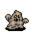

# { .sprite } Glowing mudfiend

<div class="infobox" markdown>

<p class="ib-img">{ .sprite }</p>

| | |
|---|---|
| **Monster ID** | `elm_fiend1` |
| **Type** | Enemy |
| **Class** | Construct |
| **HP** | 132 |
| **XP when killed** | 338 |
| **Found in** | elm5f_2, elm_2f_1, elm_3f |
| **Immune to crits** | Yes |
| **Introduced** | [v0.7.14](../versions/0.7.14.md) |

</div>

## Combat stats

| Stat | Value |
|---|---|
| HP | 132 |
| Damage | 0 to 21 |
| Attack chance | 100 |
| Block chance | 102 |
| Damage resistance | 9 |
| Max AP | 10 |
| Attack cost | 5 AP |
| Attacks per turn | 2 |
| Move cost | 8 AP |
| Critical skill | 0 |
| Critical multiplier | – |
| Crit chance | none (needs critical skill and a multiplier) |

!!! note "Immune to critical hits"
    Ghosts, constructs and demons can't be critically hit. Your crit build will have to sit this one out.

**On hit:** On target: Bleeding wound (magnitude 3, 3 rounds, 15% chance)

**When hit:** On target: Nausea (magnitude 3, 3 rounds, 20% chance)

**XP formula** (from the game's loader): ⌈(attacks per turn × attack chance × average damage × (1 + critical skill × multiplier) × 3 + HP × (1 + block chance) + 9 × damage resistance) × 0.7⌉, +50 if its hits inflict a condition. More Exp adds a percentage on top.

<p class="verified">Verified against v0.8.18 monster data and game code (`MonsterTypeParser.java`).</p>


## Drops

| Item | Chance | Qty |
|---|---|---|
| [Glass gem](../items/gem1.md) | 20% | 1 to 5 |
| [Azure gem](../items/gem6.md) | 6.66667% | 1 to 3 |
| [Ruby gem](../items/gem2.md) | 10% | 0 to 4 |
| [Polished gem](../items/gem3.md) | 10% | 0 to 4 |
| [Sharpened gem](../items/gem4.md) | 5% | 0 to 1 |
| [Gold coins](../items/gold.md) | 100% | 1 to 11 |
| [Mudfiend goo](../items/mudfiend.md) | 25% | 1 |
| [Wooden club](../items/club1.md) | 5.55556% | 1 |
| [Polished necklace](../items/junk_necklace1.md) | 11.1111% | 1 |
| [Blackwater rusted pickaxe](../items/bwm_pick.md) | 20% | 1 |

## Locations

| Map | Region | Up to | Notes |
|---|---|---|---|
| [elm5f_2](../maps/elm5f_2.md) | – | 2 | – |
| [elm_2f_1](../maps/elm_2f_1.md) | – | 14 | – |
| [elm_3f](../maps/elm_3f.md) | – | 2 | – |
| [elm_4f_1](../maps/elm_4f_1.md) | – | 2 | – |
| [elm_4f_2](../maps/elm_4f_2.md) | – | 4 | – |
| [elm_4f_3](../maps/elm_4f_3.md) | – | 3 | – |
| [elm_4f_5](../maps/elm_4f_5.md) | – | 3 | – |


## Version history

| Version | Change |
|---|---|
| [v0.7.14](../versions/0.7.14.md) | Added |

<p class="verified">Verified against v0.8.18 and every earlier release back to v0.7.0 (game data compared release by release).</p>


## Community notes

<small>Written by players, not generated from game data. **Observations**: what players notice in-game · **Lore**: the in-world story · **Trivia**: real-world facts, references, development history · **Theory / speculation**: unconfirmed ideas; may just be unfinished content</small>

### Observations

*Nothing here yet. Know something? [Add it](https://github.com/asdfghjkl628/Andor-s-Trail-Wikiiii/new/main/notes/monsters?filename=elm_fiend1.md&value=%23%23%20Observations%0A%0A%3C%21--%20what%20players%20notice%20in-game%20--%3E%0A%0A%23%23%20Lore%0A%0A%3C%21--%20the%20in-world%20story%20--%3E%0A%0A%23%23%20Trivia%0A%0A%3C%21--%20real-world%20facts%2C%20references%2C%20development%20history%20--%3E%0A%0A%23%23%20Theory%20/%20speculation%0A%0A%3C%21--%20unconfirmed%20ideas%3B%20may%20just%20be%20unfinished%20content%20--%3E%0A).*

### Lore

*Nothing here yet. Know something? [Add it](https://github.com/asdfghjkl628/Andor-s-Trail-Wikiiii/new/main/notes/monsters?filename=elm_fiend1.md&value=%23%23%20Observations%0A%0A%3C%21--%20what%20players%20notice%20in-game%20--%3E%0A%0A%23%23%20Lore%0A%0A%3C%21--%20the%20in-world%20story%20--%3E%0A%0A%23%23%20Trivia%0A%0A%3C%21--%20real-world%20facts%2C%20references%2C%20development%20history%20--%3E%0A%0A%23%23%20Theory%20/%20speculation%0A%0A%3C%21--%20unconfirmed%20ideas%3B%20may%20just%20be%20unfinished%20content%20--%3E%0A).*

### Trivia

*Nothing here yet. Know something? [Add it](https://github.com/asdfghjkl628/Andor-s-Trail-Wikiiii/new/main/notes/monsters?filename=elm_fiend1.md&value=%23%23%20Observations%0A%0A%3C%21--%20what%20players%20notice%20in-game%20--%3E%0A%0A%23%23%20Lore%0A%0A%3C%21--%20the%20in-world%20story%20--%3E%0A%0A%23%23%20Trivia%0A%0A%3C%21--%20real-world%20facts%2C%20references%2C%20development%20history%20--%3E%0A%0A%23%23%20Theory%20/%20speculation%0A%0A%3C%21--%20unconfirmed%20ideas%3B%20may%20just%20be%20unfinished%20content%20--%3E%0A).*

### Theory / speculation

*Nothing here yet. Know something? [Add it](https://github.com/asdfghjkl628/Andor-s-Trail-Wikiiii/new/main/notes/monsters?filename=elm_fiend1.md&value=%23%23%20Observations%0A%0A%3C%21--%20what%20players%20notice%20in-game%20--%3E%0A%0A%23%23%20Lore%0A%0A%3C%21--%20the%20in-world%20story%20--%3E%0A%0A%23%23%20Trivia%0A%0A%3C%21--%20real-world%20facts%2C%20references%2C%20development%20history%20--%3E%0A%0A%23%23%20Theory%20/%20speculation%0A%0A%3C%21--%20unconfirmed%20ideas%3B%20may%20just%20be%20unfinished%20content%20--%3E%0A).*


??? info "Technical information"

    | | |
    |---|---|
    | Monster ID | `elm_fiend1` |
    | Spawn group | `elm_mine2` |
    | Loot table | `elm_fiend` |
    | Conversation | – |
    | Faction | – |
    | Movement | none |
    | Icon | `monsters_omi2:18` |
    | Defined in | `res/raw/monsterlist_omi2.json` |

    Raw data:

    ```json
    {
     "id": "elm_fiend1",
     "name": "Glowing mudfiend",
     "iconID": "monsters_omi2:18",
     "maxHP": 132,
     "moveCost": 8,
     "monsterClass": "construct",
     "movementAggressionType": "none",
     "attackDamage": {
      "min": 0,
      "max": 21
     },
     "spawnGroup": "elm_mine2",
     "droplistID": "elm_fiend",
     "attackCost": 5,
     "attackChance": 100,
     "blockChance": 102,
     "damageResistance": 9,
     "hitEffect": {
      "conditionsTarget": [
       {
        "condition": "bleeding_wound",
        "magnitude": 3,
        "duration": 3,
        "chance": "15"
       }
      ]
     },
     "hitReceivedEffect": {
      "conditionsTarget": [
       {
        "condition": "nausea",
        "magnitude": 3,
        "duration": 3,
        "chance": "20"
       }
      ]
     }
    }
    ```


<small>Data from v0.8.18</small>
