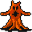

# { .sprite } Kazarite golem

| Stat | Value |
|---|---|
| Class | giant |
| HP | 198 |
| Max AP | 10 |
| Attack cost | 7 |
| Move cost | 8 |
| Damage | 9 to 36 |
| Attack chance | 81 |
| Block chance | 99 |
| Damage resistance | 5 |
| Critical skill | 0 |
| Critical multiplier | 0 |

## On hit

- **Heal HP:** 1 to 3
- **On target:** Bleeding wound (magnitude 7, 2 rounds, 10% chance)

## Drops

| Item | Chance | Qty |
|---|---|---|
| [Ruby gem](../items/gem2.md) | 100% | 1 to 5 |
| [Small rock](../items/rock.md) | 20% | 0 to 9 |
| [Gold coins](../items/gold.md) | 33.3333% | 3 to 9 |
| [Gold coins](../items/gold.md) | 1% | 45 to 90 |
| [Large rock](../items/rock2.md) | 10% | 1 |
| [Blackwater rusted pickaxe](../items/bwm_pick.md) | 1% | 0 to 1 |
| [Dented bronze plate](../items/armor6.md) | 1% | 1 |

## Found on

- [elm5f_1](../maps/elm5f_1.md)
- [elm5f_2](../maps/elm5f_2.md)
- [elm_3f](../maps/elm_3f.md)
- [elm_4f_1](../maps/elm_4f_1.md)
- [elm_4f_2](../maps/elm_4f_2.md)
- [elm_4f_3](../maps/elm_4f_3.md)
- [elm_4f_4](../maps/elm_4f_4.md)

<small>Monster ID: `elm_golem1` · Data from v0.8.18</small>
