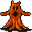

# { .sprite } Kazarite golem

**Found in:** [elm5f_1](../maps/elm5f_1.md), [elm5f_2](../maps/elm5f_2.md), [elm_3f](../maps/elm_3f.md), [elm_4f_1](../maps/elm_4f_1.md) (+3 more)

<div class="infobox" markdown>

<p class="ib-img">{ .sprite }</p>

| | |
|---|---|
| **Type** | Enemy (hostile on sight) |
| **Found in** | elm5f_1, elm5f_2, elm_3f |
| **Class** | Giant |
| **HP** | 198 |
| **XP when defeated** | 396 |
| **Entry ID** | `elm_golem1` |
| **Introduced** | [v0.7.14](../versions/0.7.14.md) |

</div>

## Combat statistics

| Statistic | Value |
|---|---|
| Class | Giant |
| HP | 198 |
| XP when defeated | 396 |
| Damage | 9 to 36 |
| Attack chance | 81 |
| Block chance | 99 |
| Damage resistance | 5 |
| Max AP | 10 |
| Attack cost | 7 AP |
| Attacks per turn | 1 |
| Move cost | 8 AP |
| Critical skill | 0 |
| Critical multiplier | – |
| Critical hit chance | None (requires both critical skill and a critical multiplier) |

**On hit:** Heal HP: 1 to 3; On target: Bleeding wound (magnitude 7, 2 rounds, 10% chance)

**When hit:** On target: Nausea (magnitude 3, 5 rounds, 15% chance)

**On death:** Heal HP: -15 to 0


<p class="verified">Verified against v0.8.18 monster data and game code (`MonsterTypeParser.java`).</p>

## Drops

| Item | Chance | Qty |
|---|---|---|
| [Ruby gem](../items/gem2.md) | 100% | 1 to 5 |
| [Small rock](../items/rock.md) | 20% | 0 to 9 |
| [Gold coins](../items/gold.md) | 33.3333% | 3 to 9 |
| [Gold coins](../items/gold.md) | 1% | 45 to 90 |
| [Large rock](../items/rock2.md) | 10% | 1 |
| [Blackwater rusted pickaxe](../items/bwm_pick.md) | 1% | 0 to 1 |
| [Dented bronze plate](../items/armor6.md) | 1% | 1 |

## Locations

| Map | Region | Up to | Notes |
|---|---|---|---|
| [elm5f_1](../maps/elm5f_1.md) | – | 2 | – |
| [elm5f_2](../maps/elm5f_2.md) | – | 3 | – |
| [elm_3f](../maps/elm_3f.md) | – | 6 | – |
| [elm_4f_1](../maps/elm_4f_1.md) | – | 4 | – |
| [elm_4f_2](../maps/elm_4f_2.md) | – | 6 | – |
| [elm_4f_3](../maps/elm_4f_3.md) | – | 3 | – |
| [elm_4f_4](../maps/elm_4f_4.md) | – | 8 | – |


## Version history

| Version | Change |
|---|---|
| [v0.7.14](../versions/0.7.14.md) | Added |
| [v0.8.8](../versions/0.8.8.md) | deathEffect: {"increaseCurrentHP": {"max": 0, "min":… → {"increaseCurrentHP": {"max": 0, "min":… |

<p class="verified">Verified against v0.8.18 and every earlier release back to v0.7.0 (game data compared release by release).</p>


??? info "Technical information"

    | | |
    |---|---|
    | Entry ID | `elm_golem1` |
    | Spawn group | `elm_mine3` |
    | Loot table | `elm_golem` |
    | Conversation | – |
    | Faction | – |
    | Movement | none |
    | Icon | `monsters_tometik10:33` |
    | Defined in | `res/raw/monsterlist_omi2.json` |

    Raw data:

    ```json
    {
     "id": "elm_golem1",
     "name": "Kazarite golem",
     "iconID": "monsters_tometik10:33",
     "maxHP": 198,
     "moveCost": 8,
     "monsterClass": "giant",
     "movementAggressionType": "none",
     "attackDamage": {
      "min": 9,
      "max": 36
     },
     "spawnGroup": "elm_mine3",
     "droplistID": "elm_golem",
     "attackCost": 7,
     "attackChance": 81,
     "blockChance": 99,
     "damageResistance": 5,
     "hitEffect": {
      "increaseCurrentHP": {
       "min": 1,
       "max": 3
      },
      "conditionsTarget": [
       {
        "condition": "bleeding_wound",
        "magnitude": 7,
        "duration": 2,
        "chance": "10"
       }
      ]
     },
     "hitReceivedEffect": {
      "conditionsTarget": [
       {
        "condition": "nausea",
        "magnitude": 3,
        "duration": 5,
        "chance": "15"
       }
      ]
     },
     "deathEffect": {
      "increaseCurrentHP": {
       "min": -15,
       "max": 0
      }
     }
    }
    ```


??? info "How the XP value is calculated"

    The game computes each enemy's experience value when it loads the data (`MonsterTypeParser.java`):

    XP = ⌈(attacks per turn × attack chance × average damage × (1 + critical skill × critical multiplier) × 3 + HP × (1 + block chance) + 9 × damage resistance) × 0.7⌉

    Percentages are used as fractions (e.g. 60% = 0.6). Enemies whose attacks inflict a condition are worth 50 XP more. The More Exp skill adds a percentage on top.


## Community notes

<small>Written by players, not generated from game data. **Observations**: what players notice in-game · **Lore**: the in-world story · **Trivia**: real-world facts, references, development history · **Theory / speculation**: unconfirmed ideas; may just be unfinished content</small>

### Observations

*No notes yet. Contributions are welcome: [add a note](https://github.com/asdfghjkl628/Andor-s-Trail-Wikiiii/new/main/notes/monsters?filename=elm_golem1.md&value=%23%23%20Observations%0A%0A%3C%21--%20what%20players%20notice%20in-game%20--%3E%0A%0A%23%23%20Lore%0A%0A%3C%21--%20the%20in-world%20story%20--%3E%0A%0A%23%23%20Trivia%0A%0A%3C%21--%20real-world%20facts%2C%20references%2C%20development%20history%20--%3E%0A%0A%23%23%20Theory%20/%20speculation%0A%0A%3C%21--%20unconfirmed%20ideas%3B%20may%20just%20be%20unfinished%20content%20--%3E%0A).*

### Lore

*No notes yet. Contributions are welcome: [add a note](https://github.com/asdfghjkl628/Andor-s-Trail-Wikiiii/new/main/notes/monsters?filename=elm_golem1.md&value=%23%23%20Observations%0A%0A%3C%21--%20what%20players%20notice%20in-game%20--%3E%0A%0A%23%23%20Lore%0A%0A%3C%21--%20the%20in-world%20story%20--%3E%0A%0A%23%23%20Trivia%0A%0A%3C%21--%20real-world%20facts%2C%20references%2C%20development%20history%20--%3E%0A%0A%23%23%20Theory%20/%20speculation%0A%0A%3C%21--%20unconfirmed%20ideas%3B%20may%20just%20be%20unfinished%20content%20--%3E%0A).*

### Trivia

*No notes yet. Contributions are welcome: [add a note](https://github.com/asdfghjkl628/Andor-s-Trail-Wikiiii/new/main/notes/monsters?filename=elm_golem1.md&value=%23%23%20Observations%0A%0A%3C%21--%20what%20players%20notice%20in-game%20--%3E%0A%0A%23%23%20Lore%0A%0A%3C%21--%20the%20in-world%20story%20--%3E%0A%0A%23%23%20Trivia%0A%0A%3C%21--%20real-world%20facts%2C%20references%2C%20development%20history%20--%3E%0A%0A%23%23%20Theory%20/%20speculation%0A%0A%3C%21--%20unconfirmed%20ideas%3B%20may%20just%20be%20unfinished%20content%20--%3E%0A).*

### Theory / speculation

*No notes yet. Contributions are welcome: [add a note](https://github.com/asdfghjkl628/Andor-s-Trail-Wikiiii/new/main/notes/monsters?filename=elm_golem1.md&value=%23%23%20Observations%0A%0A%3C%21--%20what%20players%20notice%20in-game%20--%3E%0A%0A%23%23%20Lore%0A%0A%3C%21--%20the%20in-world%20story%20--%3E%0A%0A%23%23%20Trivia%0A%0A%3C%21--%20real-world%20facts%2C%20references%2C%20development%20history%20--%3E%0A%0A%23%23%20Theory%20/%20speculation%0A%0A%3C%21--%20unconfirmed%20ideas%3B%20may%20just%20be%20unfinished%20content%20--%3E%0A).*


<small>Data from v0.8.18</small>
