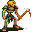

# { .sprite } Contaminated miner's skeleton

**Found in:** [Elm 5f 1](../maps/elm5f_1.md), [Elm 5f 2](../maps/elm5f_2.md), [Elm 4f 1](../maps/elm_4f_1.md), [Elm 4f 3](../maps/elm_4f_3.md) (+1 more)

<div class="infobox" markdown>

<p class="ib-img"></p>

| | |
|---|---|
| **Type** | Enemy (hostile on sight) |
| **Found in** | Elm 5f 1, Elm 5f 2, Elm 4f 1 |
| **Class** | Undead |
| **HP** | 101 |
| **XP when defeated** | 383 |
| **Introduced** | [v0.7.14](../versions/0.7.14.md) |

</div>

## Combat

| | |
|---|---|
| Class | Undead |
| HP | 101 |
| XP when defeated | 383 |
| Damage | 10 to 15 |
| AC | 169 |
| BC | 135 |
| DR | 6 |
| Attacks per turn | 2 (4 AP each, 10 AP) |
| Crit chance | 12% (×3.0) |

**Its hits:** Heal HP: 2 to 6; On target: [Bleeding wound](../conditions/bleeding_wound.md) (magnitude 4, 3 rounds, 20% chance)

**When you hit it:** On target: [Nausea](../conditions/nausea.md) (magnitude 4, 3 rounds, 20% chance)


<p class="verified">Verified against v0.8.18 monster data.</p>

## Drops

| Item | Chance | Qty |
|---|---|---|
| [Bone](../items/bone.md) | 16.6667% | 1 to 3 |
| [Human skull](../items/skull1.md) | 16.6667% | 1 |
| [Gold coins](../items/gold.md) | 100% | 8 to 21 |
| [Small empty vial](../items/vial_empty1.md) | 11.1111% | 1 |
| [Small vial of mountain water](../items/bwm_water0.md) | 5% | 1 |
| [Ring of surehit](../items/ring_atkch1.md) | 2.5% | 1 |
| [Pine spear](../items/spear1.md) | 0.8% | 1 |
| [Steel cuirass](../items/cuirass_steel.md) | 0.4% | 1 |
| [Blackwater rusted pickaxe](../items/bwm_pick.md) | 0.8% | 1 |

## Locations

| Map | Region | Up to | Notes |
|---|---|---|---|
| [Elm 5f 1](../maps/elm5f_1.md) | – | 8 | – |
| [Elm 5f 2](../maps/elm5f_2.md) | – | 7 | – |
| [Elm 4f 1](../maps/elm_4f_1.md) | – | 2 | – |
| [Elm 4f 3](../maps/elm_4f_3.md) | – | 2 | – |
| [Elm 4f 4](../maps/elm_4f_4.md) | – | 2 | – |


## Version history

| Version | Change |
|---|---|
| [v0.7.14](../versions/0.7.14.md) | Added |

<p class="verified">Verified against v0.8.18 and every earlier release back to v0.7.0 (game data compared release by release).</p>


## Behind the scenes

*How the game data handles this character. Not needed for playing.*

??? info "How the XP value is calculated"

    The game computes each enemy's experience value when it loads the data (`MonsterTypeParser.java`):

    XP = ⌈(attacks per turn × attack chance × average damage × (1 + critical skill × critical multiplier) × 3 + HP × (1 + block chance) + 9 × damage resistance) × 0.7⌉

    Percentages are used as fractions (e.g. 60% = 0.6). Enemies whose attacks inflict a condition are worth 50 XP more. The More Exp skill adds a percentage on top.

??? info "Technical information"

    | | |
    |---|---|
    | Entry ID | `elm_miner3` |
    | Type (wiki) | Enemy |
    | Spawn group | `elm_mine5` |
    | Loot table | `elm_miner2` |
    | Conversation | – |
    | Faction | – |
    | Movement | protectSpawn |
    | Icon | `monsters_omi2:17` |
    | Defined in | `res/raw/monsterlist_omi2.json` |

    Raw data:

    ```json
    {
     "id": "elm_miner3",
     "name": "Contaminated miner's skeleton",
     "iconID": "monsters_omi2:17",
     "maxHP": 101,
     "moveCost": 4,
     "monsterClass": "undead",
     "movementAggressionType": "protectSpawn",
     "attackDamage": {
      "min": 10,
      "max": 15
     },
     "spawnGroup": "elm_mine5",
     "droplistID": "elm_miner2",
     "attackCost": 4,
     "attackChance": 169,
     "criticalSkill": 15,
     "criticalMultiplier": 3.0,
     "blockChance": 135,
     "damageResistance": 6,
     "hitEffect": {
      "increaseCurrentHP": {
       "min": 2,
       "max": 6
      },
      "conditionsTarget": [
       {
        "condition": "bleeding_wound",
        "magnitude": 4,
        "duration": 3,
        "chance": "20"
       }
      ]
     },
     "hitReceivedEffect": {
      "conditionsTarget": [
       {
        "condition": "nausea",
        "magnitude": 4,
        "duration": 3,
        "chance": "20"
       }
      ]
     }
    }
    ```


## Community notes

<small>Written by players, not generated from game data. **Observations**: what players notice in-game · **Lore**: the in-world story · **Trivia**: real-world facts, references, development history · **Theory / speculation**: unconfirmed ideas; may just be unfinished content</small>

### Observations

*No notes yet. Contributions are welcome: [add a note](https://github.com/asdfghjkl628/Andor-s-Trail-Wikiiii/new/main/notes/monsters?filename=elm_miner3.md&value=%23%23%20Observations%0A%0A%3C%21--%20what%20players%20notice%20in-game%20--%3E%0A%0A%23%23%20Lore%0A%0A%3C%21--%20the%20in-world%20story%20--%3E%0A%0A%23%23%20Trivia%0A%0A%3C%21--%20real-world%20facts%2C%20references%2C%20development%20history%20--%3E%0A%0A%23%23%20Theory%20/%20speculation%0A%0A%3C%21--%20unconfirmed%20ideas%3B%20may%20just%20be%20unfinished%20content%20--%3E%0A).*

### Lore

*No notes yet. Contributions are welcome: [add a note](https://github.com/asdfghjkl628/Andor-s-Trail-Wikiiii/new/main/notes/monsters?filename=elm_miner3.md&value=%23%23%20Observations%0A%0A%3C%21--%20what%20players%20notice%20in-game%20--%3E%0A%0A%23%23%20Lore%0A%0A%3C%21--%20the%20in-world%20story%20--%3E%0A%0A%23%23%20Trivia%0A%0A%3C%21--%20real-world%20facts%2C%20references%2C%20development%20history%20--%3E%0A%0A%23%23%20Theory%20/%20speculation%0A%0A%3C%21--%20unconfirmed%20ideas%3B%20may%20just%20be%20unfinished%20content%20--%3E%0A).*

### Trivia

*No notes yet. Contributions are welcome: [add a note](https://github.com/asdfghjkl628/Andor-s-Trail-Wikiiii/new/main/notes/monsters?filename=elm_miner3.md&value=%23%23%20Observations%0A%0A%3C%21--%20what%20players%20notice%20in-game%20--%3E%0A%0A%23%23%20Lore%0A%0A%3C%21--%20the%20in-world%20story%20--%3E%0A%0A%23%23%20Trivia%0A%0A%3C%21--%20real-world%20facts%2C%20references%2C%20development%20history%20--%3E%0A%0A%23%23%20Theory%20/%20speculation%0A%0A%3C%21--%20unconfirmed%20ideas%3B%20may%20just%20be%20unfinished%20content%20--%3E%0A).*

### Theory / speculation

*No notes yet. Contributions are welcome: [add a note](https://github.com/asdfghjkl628/Andor-s-Trail-Wikiiii/new/main/notes/monsters?filename=elm_miner3.md&value=%23%23%20Observations%0A%0A%3C%21--%20what%20players%20notice%20in-game%20--%3E%0A%0A%23%23%20Lore%0A%0A%3C%21--%20the%20in-world%20story%20--%3E%0A%0A%23%23%20Trivia%0A%0A%3C%21--%20real-world%20facts%2C%20references%2C%20development%20history%20--%3E%0A%0A%23%23%20Theory%20/%20speculation%0A%0A%3C%21--%20unconfirmed%20ideas%3B%20may%20just%20be%20unfinished%20content%20--%3E%0A).*


<small>Data from v0.8.18</small>
