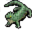

# { .sprite } Strong erumen lizard

| Stat | Value |
|---|---|
| Class | reptile |
| HP | 79 |
| Max AP | 10 |
| Attack cost | 3 |
| Move cost | 5 |
| Damage | 2 to 9 |
| Attack chance | 125 |
| Block chance | 80 |
| Damage resistance | 4 |
| Critical skill | 0 |
| Critical multiplier | 0 |

## Drops

| Item | Chance | Qty |
|---|---|---|
| [Gold coins](../items/gold.md) | 70% | 0 to 3 |
| [Glass gem](../items/gem1.md) | 10% | 1 |

## Found on

- [basiliskcave1_1_4](../maps/basiliskcave1_1_4.md)
- [basiliskcave1_1_5](../maps/basiliskcave1_1_5.md)
- [waterway11](../maps/waterway11.md)
- [waterway12](../maps/waterway12.md)
- [waterway13](../maps/waterway13.md)
- [waterway8](../maps/waterway8.md)
- [waterway9](../maps/waterway9.md)
- [waterway_forest1](../maps/waterway_forest1.md)
- [waterway_forest2](../maps/waterway_forest2.md)
- [waytobrightport21](../maps/waytobrightport21.md)
- [waytobrightport22](../maps/waytobrightport22.md)
- [waytobrightport23](../maps/waytobrightport23.md)
- [waytobrimhaven2](../maps/waytobrimhaven2.md)
- [waytobrimhaven3](../maps/waytobrimhaven3.md)
- [waytobrimhavencave0](../maps/waytobrimhavencave0.md)
- [waytobrimhavencave4](../maps/waytobrimhavencave4.md)

<small>Monster ID: `erumen_4` · Data from v0.8.18</small>
