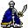

# { .sprite } Karth the Unbowed

**Where to find Karth the Unbowed:** Stoutford: [stoutford_castle_barrack1](../maps/stoutford_castle_barrack1.md#pin-npc-erwyn_commander)

<div class="infobox" markdown>

<p class="ib-img">{ .sprite }</p>

| | |
|---|---|
| **Type** | NPC/Enemy (can be spoken to, but can also be fought) |
| **Found in** | Stoutford |
| **Class** | Undead |
| **HP** | 90 |
| **XP when defeated** | 196 |
| **Entry ID** | `erwyn_commander` |
| **Introduced** | [v0.7.2](../versions/0.7.2.md) |

</div>

!!! warning "Can be fought"
    This entry can be talked to, but it can also become an opponent: a conversation with this character can end in combat (a dialogue branch leads to a fight).

## Combat statistics

| Statistic | Value |
|---|---|
| Class | Undead |
| HP | 90 |
| XP when defeated | 196 |
| Damage | 15 to 23 |
| Attack chance | 150 |
| Block chance | 75 |
| Damage resistance | 4 |
| Max AP | 10 |
| Attack cost | 10 AP |
| Attacks per turn | 1 |
| Move cost | 10 AP |
| Critical skill | 0 |
| Critical multiplier | – |
| Critical hit chance | None (requires both critical skill and a critical multiplier) |


<p class="verified">Verified against v0.8.18 monster data and game code (`MonsterTypeParser.java`).</p>

## Locations

| Map | Region | Up to | Notes |
|---|---|---|---|
| [stoutford_castle_barrack1](../maps/stoutford_castle_barrack1.md) | Stoutford | 1 | – |

## Quests that count defeats

- [Stoutford's old castle](../quests/stoutford_castle.md#stage-30) with [Yolgen](../monsters/yolgen.md) ([stoutford_church](../maps/stoutford_church.md)) checks that this enemy has been defeated.
- [stn_nondisplay (hidden flag)](../quests/stn_nondisplay.md#stage-47) with stepping on a trigger on [waytogalmore0](../maps/waytogalmore0.md), stepping on a trigger on [wild18](../maps/wild18.md) checks that this enemy has been defeated.

## Dialogue simulator

Set the quest stages, items and other conditions that apply to your game, then start the conversation with Karth the Unbowed. The simulator applies the game's own rules: it performs the same silent checks, offers only the options that would be shown in the game, and applies their effects (quest stages, items handed over, rewards) as the conversation proceeds.

<div class="dlg-sim" data-src="../../assets/dialogue/stoutford_castle_2.json" data-npc="Karth the Unbowed" markdown="0"><noscript>The simulator needs JavaScript. The full dialogue is listed below.</noscript></div>

<p class="verified">Rules verified against v0.8.18 game code (ConversationController.java) and dialogue data.</p>

??? quote "Dialogue (1 lines)"

    *What the dialogue says, exactly as in the game files. Lines are listed once; links jump to the line a choice leads to.*

    <span id="d-stoutford_castle_2"></span>**`stoutford_castle_2`** Karth the Unbowed: “I shall crush you little mortal!”

    - “For that you have to get me first, lazybones!” → *fight starts*


## Version history

| Version | Change |
|---|---|
| [v0.7.2](../versions/0.7.2.md) | Added<br>Dialogue: 1 line added |

<p class="verified">Verified against v0.8.18 and every earlier release back to v0.7.0 (game data compared release by release).</p>


??? info "Technical information"

    | | |
    |---|---|
    | Entry ID | `erwyn_commander` |
    | Spawn group | `erwyn_commander` |
    | Loot table | – |
    | Conversation | `stoutford_castle_2` |
    | Faction | – |
    | Movement | – |
    | Icon | `monsters_tometik8:45` |
    | Defined in | `res/raw/monsterlist_stoutford_combined.json` |

    Raw data:

    ```json
    {
     "id": "erwyn_commander",
     "name": "Karth the Unbowed",
     "iconID": "monsters_tometik8:45",
     "maxHP": 90,
     "unique": 1,
     "monsterClass": "undead",
     "attackDamage": {
      "min": 15,
      "max": 23
     },
     "spawnGroup": "erwyn_commander",
     "phraseID": "stoutford_castle_2",
     "attackChance": 150,
     "blockChance": 75,
     "damageResistance": 4
    }
    ```


??? info "How the XP value is calculated"

    The game computes each enemy's experience value when it loads the data (`MonsterTypeParser.java`):

    XP = ⌈(attacks per turn × attack chance × average damage × (1 + critical skill × critical multiplier) × 3 + HP × (1 + block chance) + 9 × damage resistance) × 0.7⌉

    Percentages are used as fractions (e.g. 60% = 0.6). Enemies whose attacks inflict a condition are worth 50 XP more. The More Exp skill adds a percentage on top.


## Community notes

<small>Written by players, not generated from game data. **Observations**: what players notice in-game · **Lore**: the in-world story · **Trivia**: real-world facts, references, development history · **Theory / speculation**: unconfirmed ideas; may just be unfinished content</small>

### Observations

*No notes yet. Contributions are welcome: [add a note](https://github.com/asdfghjkl628/Andor-s-Trail-Wikiiii/new/main/notes/monsters?filename=erwyn_commander.md&value=%23%23%20Observations%0A%0A%3C%21--%20what%20players%20notice%20in-game%20--%3E%0A%0A%23%23%20Lore%0A%0A%3C%21--%20the%20in-world%20story%20--%3E%0A%0A%23%23%20Trivia%0A%0A%3C%21--%20real-world%20facts%2C%20references%2C%20development%20history%20--%3E%0A%0A%23%23%20Theory%20/%20speculation%0A%0A%3C%21--%20unconfirmed%20ideas%3B%20may%20just%20be%20unfinished%20content%20--%3E%0A).*

### Lore

*No notes yet. Contributions are welcome: [add a note](https://github.com/asdfghjkl628/Andor-s-Trail-Wikiiii/new/main/notes/monsters?filename=erwyn_commander.md&value=%23%23%20Observations%0A%0A%3C%21--%20what%20players%20notice%20in-game%20--%3E%0A%0A%23%23%20Lore%0A%0A%3C%21--%20the%20in-world%20story%20--%3E%0A%0A%23%23%20Trivia%0A%0A%3C%21--%20real-world%20facts%2C%20references%2C%20development%20history%20--%3E%0A%0A%23%23%20Theory%20/%20speculation%0A%0A%3C%21--%20unconfirmed%20ideas%3B%20may%20just%20be%20unfinished%20content%20--%3E%0A).*

### Trivia

*No notes yet. Contributions are welcome: [add a note](https://github.com/asdfghjkl628/Andor-s-Trail-Wikiiii/new/main/notes/monsters?filename=erwyn_commander.md&value=%23%23%20Observations%0A%0A%3C%21--%20what%20players%20notice%20in-game%20--%3E%0A%0A%23%23%20Lore%0A%0A%3C%21--%20the%20in-world%20story%20--%3E%0A%0A%23%23%20Trivia%0A%0A%3C%21--%20real-world%20facts%2C%20references%2C%20development%20history%20--%3E%0A%0A%23%23%20Theory%20/%20speculation%0A%0A%3C%21--%20unconfirmed%20ideas%3B%20may%20just%20be%20unfinished%20content%20--%3E%0A).*

### Theory / speculation

*No notes yet. Contributions are welcome: [add a note](https://github.com/asdfghjkl628/Andor-s-Trail-Wikiiii/new/main/notes/monsters?filename=erwyn_commander.md&value=%23%23%20Observations%0A%0A%3C%21--%20what%20players%20notice%20in-game%20--%3E%0A%0A%23%23%20Lore%0A%0A%3C%21--%20the%20in-world%20story%20--%3E%0A%0A%23%23%20Trivia%0A%0A%3C%21--%20real-world%20facts%2C%20references%2C%20development%20history%20--%3E%0A%0A%23%23%20Theory%20/%20speculation%0A%0A%3C%21--%20unconfirmed%20ideas%3B%20may%20just%20be%20unfinished%20content%20--%3E%0A).*


<small>Data from v0.8.18</small>
