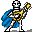

# { .sprite } Lutenist

<div class="infobox" markdown>

<p class="ib-img">{ .sprite }</p>

| | |
|---|---|
| **Type** | NPC (can be spoken to; cannot be attacked) |
| **Found in** | Flagstone Prison, Skeleton dance |
| **Entries in game data** | 4 |
| **Introduced** | [v0.7.8](../versions/0.7.8.md) |

</div>

!!! info "4 entries in the game data"
    The game data defines 4 separate characters named Lutenist. The game makes a new entry whenever a character needs different behaviour (another conversation later in a quest, another location, other stats). Some are the same person at different story points; others just share a generic name. Here the entries differ in: conversation, location, appearance. Each entry has its own section below.

| Entry | Type | Location | Role |
|---|---|---|---|
| [`erwyn_skel_lute`](#v-erwyn_skel_lute) | NPC | Flagstone Prison: [Stoutford castle shed](../maps/stoutford_castle_shed.md#pin-npc-erwyn_skel_lute) | – |
| [`ratdom_skel_lute`](#v-ratdom_skel_lute) | Scenery | Skeleton dance: [Ratdom maze 543d](../maps/ratdom_maze_543d.md) | – |
| [`ratdom_skel_lute1`](#v-ratdom_skel_lute1) | Scenery | Not on a map | – |
| [`ratdom_skel_lute2`](#v-ratdom_skel_lute2) | Scenery | Not on a map | – |

## Flagstone Prison, Stoutford castle shed (erwyn_skel_lute) { #v-erwyn_skel_lute }

**Entry ID:** `erwyn_skel_lute` · **Type:** NPC

**Location:** Flagstone Prison: [Stoutford castle shed](../maps/stoutford_castle_shed.md#pin-npc-erwyn_skel_lute)

### Dialogue simulator

Set your quest stages and items, then talk to Lutenist. Same rules as the game: same checks, same options, same effects.

<div class="dlg-sim" data-src="../../assets/dialogue/erwyn_skel_band.json" data-npc="Lutenist" markdown="0"><noscript>The simulator needs JavaScript. The full dialogue is listed below.</noscript></div>

<p class="verified">Rules verified against v0.8.18 game code (ConversationController.java) and dialogue data.</p>

??? quote "Dialogue (1 lines)"

    *Exactly as in the game files. Each line appears once; links jump to where a choice leads.*

    <span id="d-erwyn_skel_lute-erwyn_skel_band"></span>**`erwyn_skel_band`** Lutenist: “Please don't disturb. We have to practice.”


### Version history

| Version | Change |
|---|---|
| [v0.7.8](../versions/0.7.8.md) | Added<br>Dialogue: 1 line added |

<p class="verified">Verified against v0.8.18 and every earlier release back to v0.7.0 (game data compared release by release).</p>


??? info "Technical information (erwyn_skel_lute)"

    | | |
    |---|---|
    | Entry ID | `erwyn_skel_lute` |
    | Spawn group | `erwyn_skel_lute` |
    | Loot table | – |
    | Conversation | `erwyn_skel_band` |
    | Faction | – |
    | Movement | – |
    | Icon | `monsters_fatboy73:41` |
    | Defined in | `res/raw/monsterlist_stoutford_combined.json` |

    Raw data:

    ```json
    {
     "id": "erwyn_skel_lute",
     "name": "Lutenist",
     "iconID": "monsters_fatboy73:41",
     "monsterClass": "undead",
     "spawnGroup": "erwyn_skel_lute",
     "phraseID": "erwyn_skel_band"
    }
    ```


## Skeleton dance, Ratdom maze 543d (ratdom_skel_lute) { #v-ratdom_skel_lute }

**Entry ID:** `ratdom_skel_lute` · **Type:** Scenery

**Location:** Skeleton dance: [Ratdom maze 543d](../maps/ratdom_maze_543d.md)

!!! note "Scenery"
    No conversation and no combat statistics: a decoration, an animal or a figure in a scripted scene that also speaks lines in someone else's dialogue.


### Version history

| Version | Change |
|---|---|
| [v0.8.5](../versions/0.8.5.md) | Added |

<p class="verified">Verified against v0.8.18 and every earlier release back to v0.7.0 (game data compared release by release).</p>


??? info "Technical information (ratdom_skel_lute)"

    | | |
    |---|---|
    | Entry ID | `ratdom_skel_lute` |
    | Spawn group | `ratdom_skel_lute` |
    | Loot table | – |
    | Conversation | – |
    | Faction | – |
    | Movement | – |
    | Icon | `monsters_fatboy73:41` |
    | Defined in | `res/raw/monsterlist_ratdom.json` |

    Raw data:

    ```json
    {
     "id": "ratdom_skel_lute",
     "name": "Lutenist",
     "iconID": "monsters_fatboy73:41",
     "monsterClass": "undead",
     "spawnGroup": "ratdom_skel_lute"
    }
    ```


## Not placed on a map (ratdom_skel_lute1) { #v-ratdom_skel_lute1 }

**Entry ID:** `ratdom_skel_lute1` · **Type:** Scenery

**Location:** not placed on any map; this entry is added to the world by a quest or scripted event.

!!! note "Scenery"
    No conversation and no combat statistics: a decoration, an animal or a figure in a scripted scene.


### Version history

| Version | Change |
|---|---|
| [v0.8.5](../versions/0.8.5.md) | Added |

<p class="verified">Verified against v0.8.18 and every earlier release back to v0.7.0 (game data compared release by release).</p>


??? info "Technical information (ratdom_skel_lute1)"

    | | |
    |---|---|
    | Entry ID | `ratdom_skel_lute1` |
    | Spawn group | `ratdom_skel_lute1` |
    | Loot table | – |
    | Conversation | – |
    | Faction | – |
    | Movement | – |
    | Icon | `monsters_fatboy73:41` |
    | Defined in | `res/raw/monsterlist_ratdom.json` |

    Raw data:

    ```json
    {
     "id": "ratdom_skel_lute1",
     "name": "Lutenist",
     "iconID": "monsters_fatboy73:41",
     "monsterClass": "undead",
     "spawnGroup": "ratdom_skel_lute1"
    }
    ```


## Not placed on a map (ratdom_skel_lute2) { #v-ratdom_skel_lute2 }

**Entry ID:** `ratdom_skel_lute2` · **Type:** Scenery

**Location:** not placed on any map; this entry is added to the world by a quest or scripted event.

!!! note "Scenery"
    No conversation and no combat statistics: a decoration, an animal or a figure in a scripted scene.


### Version history

| Version | Change |
|---|---|
| [v0.8.5](../versions/0.8.5.md) | Added |

<p class="verified">Verified against v0.8.18 and every earlier release back to v0.7.0 (game data compared release by release).</p>


??? info "Technical information (ratdom_skel_lute2)"

    | | |
    |---|---|
    | Entry ID | `ratdom_skel_lute2` |
    | Spawn group | `ratdom_skel_lute2` |
    | Loot table | – |
    | Conversation | – |
    | Faction | – |
    | Movement | – |
    | Icon | `monsters_fatboy73:40` |
    | Defined in | `res/raw/monsterlist_ratdom.json` |

    Raw data:

    ```json
    {
     "id": "ratdom_skel_lute2",
     "name": "Lutenist",
     "iconID": "monsters_fatboy73:40",
     "monsterClass": "undead",
     "spawnGroup": "ratdom_skel_lute2"
    }
    ```


## Community notes

<small>Written by players, not generated from game data. **Observations**: what players notice in-game · **Lore**: the in-world story · **Trivia**: real-world facts, references, development history · **Theory / speculation**: unconfirmed ideas; may just be unfinished content</small>

### Observations

*No notes yet. Contributions are welcome: [add a note](https://github.com/asdfghjkl628/Andor-s-Trail-Wikiiii/new/main/notes/monsters?filename=erwyn_skel_lute.md&value=%23%23%20Observations%0A%0A%3C%21--%20what%20players%20notice%20in-game%20--%3E%0A%0A%23%23%20Lore%0A%0A%3C%21--%20the%20in-world%20story%20--%3E%0A%0A%23%23%20Trivia%0A%0A%3C%21--%20real-world%20facts%2C%20references%2C%20development%20history%20--%3E%0A%0A%23%23%20Theory%20/%20speculation%0A%0A%3C%21--%20unconfirmed%20ideas%3B%20may%20just%20be%20unfinished%20content%20--%3E%0A).*

### Lore

*No notes yet. Contributions are welcome: [add a note](https://github.com/asdfghjkl628/Andor-s-Trail-Wikiiii/new/main/notes/monsters?filename=erwyn_skel_lute.md&value=%23%23%20Observations%0A%0A%3C%21--%20what%20players%20notice%20in-game%20--%3E%0A%0A%23%23%20Lore%0A%0A%3C%21--%20the%20in-world%20story%20--%3E%0A%0A%23%23%20Trivia%0A%0A%3C%21--%20real-world%20facts%2C%20references%2C%20development%20history%20--%3E%0A%0A%23%23%20Theory%20/%20speculation%0A%0A%3C%21--%20unconfirmed%20ideas%3B%20may%20just%20be%20unfinished%20content%20--%3E%0A).*

### Trivia

*No notes yet. Contributions are welcome: [add a note](https://github.com/asdfghjkl628/Andor-s-Trail-Wikiiii/new/main/notes/monsters?filename=erwyn_skel_lute.md&value=%23%23%20Observations%0A%0A%3C%21--%20what%20players%20notice%20in-game%20--%3E%0A%0A%23%23%20Lore%0A%0A%3C%21--%20the%20in-world%20story%20--%3E%0A%0A%23%23%20Trivia%0A%0A%3C%21--%20real-world%20facts%2C%20references%2C%20development%20history%20--%3E%0A%0A%23%23%20Theory%20/%20speculation%0A%0A%3C%21--%20unconfirmed%20ideas%3B%20may%20just%20be%20unfinished%20content%20--%3E%0A).*

### Theory / speculation

*No notes yet. Contributions are welcome: [add a note](https://github.com/asdfghjkl628/Andor-s-Trail-Wikiiii/new/main/notes/monsters?filename=erwyn_skel_lute.md&value=%23%23%20Observations%0A%0A%3C%21--%20what%20players%20notice%20in-game%20--%3E%0A%0A%23%23%20Lore%0A%0A%3C%21--%20the%20in-world%20story%20--%3E%0A%0A%23%23%20Trivia%0A%0A%3C%21--%20real-world%20facts%2C%20references%2C%20development%20history%20--%3E%0A%0A%23%23%20Theory%20/%20speculation%0A%0A%3C%21--%20unconfirmed%20ideas%3B%20may%20just%20be%20unfinished%20content%20--%3E%0A).*


<small>Data from v0.8.18</small>
