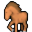

# { .sprite } Farm horse

<div class="infobox" markdown>

<p class="ib-img">{ .sprite }</p>

| | |
|---|---|
| **Type** | Enemy (hostile on sight) |
| **Found in** | Deebo's Orchard |
| **Class** | Animal |
| **HP** | 1 |
| **XP when defeated** | 1 |
| **Entries in game data** | 2 |
| **Introduced** | [v0.8.2](../versions/0.8.2.md) |

</div>

!!! info "2 entries in the game data"
    The game's data files define 2 separate characters named Farm horse. Andor's Trail stores a character as a new entry whenever it needs different behaviour, for example a different conversation at a later stage of a quest, a different location, or different combat statistics. Some entries represent the same person at different points in the story; others are different people who share a generic name. Here the entries differ in: appearance, movement. This page combines them; each entry is described in its own section below.

| Entry | Type | Location | Role | HP |
|---|---|---|---|---|
| [`farm_horse`](#v-farm_horse) | Enemy | Deebo's Orchard: [sullengard_apple_farm_east](../maps/sullengard_apple_farm_east.md) | – | 1 |
| [`farm_horse_right`](#v-farm_horse_right) | Enemy | Deebo's Orchard: [sullengard_apple_farm_east](../maps/sullengard_apple_farm_east.md) | – | 1 |

## Deebo's Orchard, Sullengard apple farm east (farm_horse) { #v-farm_horse }

**Entry ID:** `farm_horse` · **Type:** Enemy

**Location:** Deebo's Orchard: [sullengard_apple_farm_east](../maps/sullengard_apple_farm_east.md)

### Combat statistics

| Statistic | Value |
|---|---|
| Class | Animal |
| HP | 1 |
| XP when defeated | 1 |
| Damage | 0 |
| Attack chance | 0 |
| Block chance | 0 |
| Damage resistance | 0 |
| Max AP | 10 |
| Attack cost | 10 AP |
| Attacks per turn | 1 |
| Move cost | 10 AP |
| Critical skill | 0 |
| Critical multiplier | – |
| Critical hit chance | None (requires both critical skill and a critical multiplier) |


<p class="verified">Verified against v0.8.18 monster data and game code (`MonsterTypeParser.java`).</p>

### Locations

| Map | Region | Up to | Notes |
|---|---|---|---|
| [sullengard_apple_farm_east](../maps/sullengard_apple_farm_east.md) | Deebo's Orchard | 1 | – |


### Version history

| Version | Change |
|---|---|
| [v0.8.2](../versions/0.8.2.md) | Added |

<p class="verified">Verified against v0.8.18 and every earlier release back to v0.7.0 (game data compared release by release).</p>


??? info "Technical information (farm_horse)"

    | | |
    |---|---|
    | Entry ID | `farm_horse` |
    | Spawn group | `farm_horse_left` |
    | Loot table | – |
    | Conversation | – |
    | Faction | – |
    | Movement | none |
    | Icon | `monsters_ld2:67` |
    | Defined in | `res/raw/monsterlist_sullengard.json` |

    Raw data:

    ```json
    {
     "id": "farm_horse",
     "name": "Farm horse",
     "iconID": "monsters_ld2:67",
     "monsterClass": "animal",
     "movementAggressionType": "none",
     "spawnGroup": "farm_horse_left"
    }
    ```


## Deebo's Orchard, Sullengard apple farm east (farm_horse_right) { #v-farm_horse_right }

**Entry ID:** `farm_horse_right` · **Type:** Enemy

**Location:** Deebo's Orchard: [sullengard_apple_farm_east](../maps/sullengard_apple_farm_east.md)

### Combat statistics

| Statistic | Value |
|---|---|
| Class | Animal |
| HP | 1 |
| XP when defeated | 1 |
| Damage | 0 |
| Attack chance | 0 |
| Block chance | 0 |
| Damage resistance | 0 |
| Max AP | 10 |
| Attack cost | 10 AP |
| Attacks per turn | 1 |
| Move cost | 10 AP |
| Critical skill | 0 |
| Critical multiplier | – |
| Critical hit chance | None (requires both critical skill and a critical multiplier) |


<p class="verified">Verified against v0.8.18 monster data and game code (`MonsterTypeParser.java`).</p>

### Locations

| Map | Region | Up to | Notes |
|---|---|---|---|
| [sullengard_apple_farm_east](../maps/sullengard_apple_farm_east.md) | Deebo's Orchard | 1 | – |


### Version history

| Version | Change |
|---|---|
| [v0.8.2](../versions/0.8.2.md) | Added |

<p class="verified">Verified against v0.8.18 and every earlier release back to v0.7.0 (game data compared release by release).</p>


??? info "Technical information (farm_horse_right)"

    | | |
    |---|---|
    | Entry ID | `farm_horse_right` |
    | Spawn group | `farm_horse_right` |
    | Loot table | – |
    | Conversation | – |
    | Faction | – |
    | Movement | – |
    | Icon | `monsters_ld2:64` |
    | Defined in | `res/raw/monsterlist_sullengard.json` |

    Raw data:

    ```json
    {
     "id": "farm_horse_right",
     "name": "Farm horse",
     "iconID": "monsters_ld2:64",
     "monsterClass": "animal",
     "spawnGroup": "farm_horse_right"
    }
    ```


??? info "How the XP value is calculated"

    The game computes each enemy's experience value when it loads the data (`MonsterTypeParser.java`):

    XP = ⌈(attacks per turn × attack chance × average damage × (1 + critical skill × critical multiplier) × 3 + HP × (1 + block chance) + 9 × damage resistance) × 0.7⌉

    Percentages are used as fractions (e.g. 60% = 0.6). Enemies whose attacks inflict a condition are worth 50 XP more. The More Exp skill adds a percentage on top.


## Community notes

<small>Written by players, not generated from game data. **Observations**: what players notice in-game · **Lore**: the in-world story · **Trivia**: real-world facts, references, development history · **Theory / speculation**: unconfirmed ideas; may just be unfinished content</small>

### Observations

*No notes yet. Contributions are welcome: [add a note](https://github.com/asdfghjkl628/Andor-s-Trail-Wikiiii/new/main/notes/monsters?filename=farm_horse.md&value=%23%23%20Observations%0A%0A%3C%21--%20what%20players%20notice%20in-game%20--%3E%0A%0A%23%23%20Lore%0A%0A%3C%21--%20the%20in-world%20story%20--%3E%0A%0A%23%23%20Trivia%0A%0A%3C%21--%20real-world%20facts%2C%20references%2C%20development%20history%20--%3E%0A%0A%23%23%20Theory%20/%20speculation%0A%0A%3C%21--%20unconfirmed%20ideas%3B%20may%20just%20be%20unfinished%20content%20--%3E%0A).*

### Lore

*No notes yet. Contributions are welcome: [add a note](https://github.com/asdfghjkl628/Andor-s-Trail-Wikiiii/new/main/notes/monsters?filename=farm_horse.md&value=%23%23%20Observations%0A%0A%3C%21--%20what%20players%20notice%20in-game%20--%3E%0A%0A%23%23%20Lore%0A%0A%3C%21--%20the%20in-world%20story%20--%3E%0A%0A%23%23%20Trivia%0A%0A%3C%21--%20real-world%20facts%2C%20references%2C%20development%20history%20--%3E%0A%0A%23%23%20Theory%20/%20speculation%0A%0A%3C%21--%20unconfirmed%20ideas%3B%20may%20just%20be%20unfinished%20content%20--%3E%0A).*

### Trivia

*No notes yet. Contributions are welcome: [add a note](https://github.com/asdfghjkl628/Andor-s-Trail-Wikiiii/new/main/notes/monsters?filename=farm_horse.md&value=%23%23%20Observations%0A%0A%3C%21--%20what%20players%20notice%20in-game%20--%3E%0A%0A%23%23%20Lore%0A%0A%3C%21--%20the%20in-world%20story%20--%3E%0A%0A%23%23%20Trivia%0A%0A%3C%21--%20real-world%20facts%2C%20references%2C%20development%20history%20--%3E%0A%0A%23%23%20Theory%20/%20speculation%0A%0A%3C%21--%20unconfirmed%20ideas%3B%20may%20just%20be%20unfinished%20content%20--%3E%0A).*

### Theory / speculation

*No notes yet. Contributions are welcome: [add a note](https://github.com/asdfghjkl628/Andor-s-Trail-Wikiiii/new/main/notes/monsters?filename=farm_horse.md&value=%23%23%20Observations%0A%0A%3C%21--%20what%20players%20notice%20in-game%20--%3E%0A%0A%23%23%20Lore%0A%0A%3C%21--%20the%20in-world%20story%20--%3E%0A%0A%23%23%20Trivia%0A%0A%3C%21--%20real-world%20facts%2C%20references%2C%20development%20history%20--%3E%0A%0A%23%23%20Theory%20/%20speculation%0A%0A%3C%21--%20unconfirmed%20ideas%3B%20may%20just%20be%20unfinished%20content%20--%3E%0A).*


<small>Data from v0.8.18</small>
