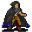

# { .sprite } Forenza

| Stat | Value |
|---|---|
| Class | humanoid |
| HP | 215 |
| Max AP | 10 |
| Attack cost | 4 |
| Move cost | 2 |
| Damage | 10 to 22 |
| Attack chance | 70 |
| Block chance | 50 |
| Damage resistance | 0 |
| Critical skill | 30 |
| Critical multiplier | 2.0 |

## Drops

| Item | Chance | Qty |
|---|---|---|
| [Forenza's key](../items/forenza_key.md) | 100% | 1 |
| [Necklace of strike](../items/necklace_strike.md) | 100% | 1 |
| [Azure gem](../items/gem6.md) | 15% | 1 |

## Found on

- [laerothbasement2](../maps/laerothbasement2.md)

## Quests

- [The odd coin collector](../quests/odd_coin_collector.md): stages 41, 42, 43, 44, 45, 46, 47, 48, 50
- [laeroth_nondisplay (hidden flag)](../quests/laeroth_nondisplay.md): stages 104

??? quote "Dialogue (32 lines)"

    *What the dialogue says, exactly as in the game files. Lines are listed once; links jump to the line a choice leads to.*

    **`forenza_island_selector`** *(silent check: the first matching branch below is taken)*

    - branch 1 *(if NOT reached stage 104 of [laeroth_nondisplay (hidden flag)](../quests/laeroth_nondisplay.md#stage-104))* → [forenza_island_injured](#d-forenza_island_injured)
    - branch 2 → [forenza_island_initial_phrase](#d-forenza_island_initial_phrase)

    **`forenza_island_injured`** Forenza: “Hey, you. I need your help!”

    - “What? Who are you? How did you get in here?” → [forenza_island_injured_need_help](#d-forenza_island_injured_need_help)
    - “What kind of help?” → [forenza_island_injured_explained](#d-forenza_island_injured_explained)

    **`forenza_island_initial_phrase`** Forenza: “What do you think you are doing here?”

    - “Returning to Gylew what is rightfully his.” *(if reached stage 45 of [The odd coin collector](../quests/odd_coin_collector.md#stage-45))* → *fight starts*
    - “I am working a job for a man name Gylew.” *(if NOT reached stage 45 of [The odd coin collector](../quests/odd_coin_collector.md#stage-45))* → [forenza_island_10](#d-forenza_island_10)
    - “Um...I am returning something to a man named Gylew.” *(if NOT reached stage 45 of [The odd coin collector](../quests/odd_coin_collector.md#stage-45))* → [forenza_island_10](#d-forenza_island_10)

    **`forenza_island_injured_need_help`** Forenza: “Nerver mind that now. I am injured and I need your help!”

    - “What kind of help?” → [forenza_island_injured_explained](#d-forenza_island_injured_explained)

    **`forenza_island_injured_explained`** Forenza: “Seriously?! Can't you see that I am bleeding and weak?” — **effects:** sets stage 41 of [The odd coin collector](../quests/odd_coin_collector.md#stage-41)

    - “Well, I have this ointment for stopping wounds. Take it.” *(if hand over 1× [Ointment of bleeding wounds](../items/pot_bleeding_ointment.md))* → [forenza_island_injured_ointment](#d-forenza_island_injured_ointment)
    - “What do you want? A healing potion maybe?” → [forenza_island_injured_help](#d-forenza_island_injured_help)

    **`forenza_island_10`** Forenza: “I don't think you want to do that.”

    - “And why is that?” → [forenza_island_20](#d-forenza_island_20)

    **`forenza_island_injured_ointment`** Forenza: “Oh, that's wonderful. Thank you.” — **effects:** sets stage 42 of [The odd coin collector](../quests/odd_coin_collector.md#stage-42), sets stage 104 of [laeroth_nondisplay (hidden flag)](../quests/laeroth_nondisplay.md#stage-104)

    - Next → [forenza_island_injured_help](#d-forenza_island_injured_help)

    **`forenza_island_injured_help`** Forenza: “Please. I'll take whatever you have that could heal me.”

    - “Well I have a bonemeal potion. It's yours now. Take it.” *(if hand over 1× [Bonemeal potion](../items/bonemeal_potion.md))* → [forenza_island_injured_help_bm](#d-forenza_island_injured_help_bm)
    - “Well I have a special bonemeal potion. It's yours now. Take it.” *(if hand over 1× [Lodar's bonemeal potion](../items/pot_bm_lodar.md))* → [forenza_island_injured_help_bm](#d-forenza_island_injured_help_bm)
    - “Here, take it. It's a really strong potion of healing.” *(if hand over 1× [Major potion of health](../items/health_major2.md))* → [forenza_island_injured_help_mph](#d-forenza_island_injured_help_mph)
    - “I have this really special potion of healing that I got from a very wise old man. Take it!” *(if hand over 1× [Lodar's potion of health](../items/pot_healthlodar.md))* → [forenza_island_injured_help_lph](#d-forenza_island_injured_help_lph)
    - “I have an ordinary potion of health for you. Take it!” *(if hand over 1× [Regular potion of health](../items/health.md))* → [forenza_island_injured_help_rph](#d-forenza_island_injured_help_rph)
    - “I have an little health potion for you. It's all I have. Take it!” *(if hand over 1× [Minor potion of health](../items/health_minor2.md))* → [forenza_island_injured_help_minor_ph](#d-forenza_island_injured_help_minor_ph)
    - “I'm so sorry, but I have nothing that can help you.” *(if NOT carry 1× [Bonemeal potion](../items/bonemeal_potion.md); NOT carry 1× [Lodar's bonemeal potion](../items/pot_bm_lodar.md); NOT carry 1× [Lodar's potion of health](../items/pot_healthlodar.md); NOT carry 1× [Major potion of health](../items/health_major2.md); NOT carry 1× [Regular potion of health](../items/health.md); NOT carry 1× [Minor potion of health](../items/health_minor2.md))* → [forenza_island_injured_help_not](#d-forenza_island_injured_help_not)

    **`forenza_island_20`** Forenza: “Well, for starters, that chest that you are carrying belongs to me.”

    - “How do you figure?” → [forenza_island_30](#d-forenza_island_30)

    **`forenza_island_injured_help_bm`** Forenza: “Oh, this stuff is great!” — **effects:** sets stage 43 of [The odd coin collector](../quests/odd_coin_collector.md#stage-43), sets stage 104 of [laeroth_nondisplay (hidden flag)](../quests/laeroth_nondisplay.md#stage-104)

    - Next → [forenza_island_initial_phrase](#d-forenza_island_initial_phrase)

    **`forenza_island_injured_help_mph`** Forenza: “This stuff tastes nasty, but I swear I can feel it helping already.” — **effects:** sets stage 44 of [The odd coin collector](../quests/odd_coin_collector.md#stage-44), sets stage 104 of [laeroth_nondisplay (hidden flag)](../quests/laeroth_nondisplay.md#stage-104)

    - Next → [forenza_island_initial_phrase](#d-forenza_island_initial_phrase)

    **`forenza_island_injured_help_lph`** Forenza: “Oh, now this stuff feels like its healing power will last just a little bit longer.” — **effects:** sets stage 46 of [The odd coin collector](../quests/odd_coin_collector.md#stage-46), sets stage 104 of [laeroth_nondisplay (hidden flag)](../quests/laeroth_nondisplay.md#stage-104)

    - Next → [forenza_island_initial_phrase](#d-forenza_island_initial_phrase)

    **`forenza_island_injured_help_rph`** Forenza: “Oh, this should help. Thank you.” — **effects:** sets stage 47 of [The odd coin collector](../quests/odd_coin_collector.md#stage-47), sets stage 104 of [laeroth_nondisplay (hidden flag)](../quests/laeroth_nondisplay.md#stage-104)

    - Next → [forenza_island_initial_phrase](#d-forenza_island_initial_phrase)

    **`forenza_island_injured_help_minor_ph`** Forenza: “Oh, this should help. I guess.” — **effects:** sets stage 48 of [The odd coin collector](../quests/odd_coin_collector.md#stage-48), sets stage 104 of [laeroth_nondisplay (hidden flag)](../quests/laeroth_nondisplay.md#stage-104)

    - Next → [forenza_island_initial_phrase](#d-forenza_island_initial_phrase)

    **`forenza_island_injured_help_not`** Forenza: “You are a disappointment. Anyways...” — **effects:** sets stage 104 of [laeroth_nondisplay (hidden flag)](../quests/laeroth_nondisplay.md#stage-104)

    - Next → [forenza_island_initial_phrase](#d-forenza_island_initial_phrase)

    **`forenza_island_30`** Forenza: “Because I said it does! Now give me that chest before you get hurt.”

    - “Don't make me laugh. You hurt me? Do you know who I am? Explain yourself now.” → [forenza_island_40](#d-forenza_island_40)
    - “Explain yourself now or Gylew gets his treasure.” → [forenza_island_40](#d-forenza_island_40)

    **`forenza_island_40`** Forenza: “The story starts many many years ago.”

    - “[You rudely interrupt] Oh great, please spare me the grandpa story.” → [forenza_island_50](#d-forenza_island_50)

    **`forenza_island_50`** Forenza: “Anyways...it was back when we were kids. You see, Gylew and I are half-brothers.”

    - Next → [forenza_island_60](#d-forenza_island_60)

    **`forenza_island_60`** Forenza: “We have the same father. After Gylew's mom died of the Great Plague, father traveled to Brightport in search of a new wife.”

    - Next → [forenza_island_70](#d-forenza_island_70)

    **`forenza_island_70`** Forenza: “To "spare you of the grandpa story" as you called it, I will skip details.”

    - “Thank you very much.” → [forenza_island_80](#d-forenza_island_80)

    **`forenza_island_80`** Forenza: “Eventually, they were married and I was soon born. Gylew and I were close in age and often got along great.”

    - Next → [forenza_island_90](#d-forenza_island_90)

    **`forenza_island_90`** Forenza: “But father always favored Gylew. They often took long trips in search of exotic and unique coins. I was left out of these adventures most of the time.”

    - Next → [forenza_island_100](#d-forenza_island_100)

    **`forenza_island_100`** Forenza: “I was only allowed to go after mother insisted to father that I go too.”

    - “What happened to skipping the details?” → [forenza_island_110](#d-forenza_island_110)
    - “Please continue.” → [forenza_island_110](#d-forenza_island_110)

    **`forenza_island_110`** Forenza: “OK...Gylew and father discovered this story of looted gold coins that were rumored to be hidden here in the Laeroth Manor. But neither was strong enough to dare try to retrieve it.”

    - Next → [forenza_island_120](#d-forenza_island_120)

    **`forenza_island_120`** Forenza: “For many years afterwards, this is all the family ever talked about. During this time, my father and I grew apart and eventually, my mother and I left him and returned to her hometown of Brightport.”

    - Next → [forenza_island_130](#d-forenza_island_130)

    **`forenza_island_130`** Forenza: “I was able to make it back to him shortly before his death in an attempt to repair our broken relationship.”

    - “What happened to skipping the details?” → [forenza_island_140](#d-forenza_island_140)
    - “Please, continue.” → [forenza_island_140](#d-forenza_island_140)

    **`forenza_island_140`** Forenza: “Angry with him, I was able to steal this key [Forenza shows you what you suspect is the key to the chest] from his estate before it was given to Gylew.”

    - Next → [forenza_island_150](#d-forenza_island_150)

    **`forenza_island_150`** Forenza: “A few years later I learned what this key opened and this is why I am here. To my disappointment, I quickly realized I was missing the second key.”

    - “Where do you think the other key is?” → [forenza_island_160](#d-forenza_island_160)
    - “[Sarcasm] I like the 'stories with Grandpa hour'. But seriously, skip the details and tell me where the other key is.” → [forenza_island_160](#d-forenza_island_160)

    **`forenza_island_160`** Forenza: “Isn't it obvious? Gylew must have it.”

    - “You have been wronged by your family and deserve this treasure. I can get Gylew's key for you.” → [forenza_island_170](#d-forenza_island_170)
    - “Gylew is the rightful owner of his father's estate and that key belongs to the estate.” → [forenza_island_170_attack](#d-forenza_island_170_attack)

    **`forenza_island_170`** Forenza: “You will do this for me?”

    - “Yes.” → [forenza_island_180](#d-forenza_island_180)
    - “On second thought...” → [forenza_island_170_attack](#d-forenza_island_170_attack)

    **`forenza_island_170_attack`** Forenza: “What are you going to do about it?” — **effects:** sets stage 45 of [The odd coin collector](../quests/odd_coin_collector.md#stage-45)

    - “Kill you and take that key!” → *fight starts*

    **`forenza_island_180`** Forenza: “Great. Go to Gylew and get his key. Then bring it and the chest to me. I will meet you outside of Brimhaven.” — **effects:** sets stage 50 of [The odd coin collector](../quests/odd_coin_collector.md#stage-50), removes monsters from laerothbasement2, spawns monsters on waytobrimhaven3

## Community notes

<small>Written by players, not generated from game data. **Observations**: what players notice in-game · **Lore**: the in-world story · **Trivia**: real-world facts, references, development history · **Theory / speculation**: unconfirmed ideas; may just be unfinished content</small>

### Observations

*Nothing here yet. Know something? [Add it](https://github.com/asdfghjkl628/Andor-s-Trail-Wikiiii/new/main/notes/monsters?filename=forenza.md&value=%23%23%20Observations%0A%0A%3C%21--%20what%20players%20notice%20in-game%20--%3E%0A%0A%23%23%20Lore%0A%0A%3C%21--%20the%20in-world%20story%20--%3E%0A%0A%23%23%20Trivia%0A%0A%3C%21--%20real-world%20facts%2C%20references%2C%20development%20history%20--%3E%0A%0A%23%23%20Theory%20/%20speculation%0A%0A%3C%21--%20unconfirmed%20ideas%3B%20may%20just%20be%20unfinished%20content%20--%3E%0A).*

### Lore

*Nothing here yet. Know something? [Add it](https://github.com/asdfghjkl628/Andor-s-Trail-Wikiiii/new/main/notes/monsters?filename=forenza.md&value=%23%23%20Observations%0A%0A%3C%21--%20what%20players%20notice%20in-game%20--%3E%0A%0A%23%23%20Lore%0A%0A%3C%21--%20the%20in-world%20story%20--%3E%0A%0A%23%23%20Trivia%0A%0A%3C%21--%20real-world%20facts%2C%20references%2C%20development%20history%20--%3E%0A%0A%23%23%20Theory%20/%20speculation%0A%0A%3C%21--%20unconfirmed%20ideas%3B%20may%20just%20be%20unfinished%20content%20--%3E%0A).*

### Trivia

*Nothing here yet. Know something? [Add it](https://github.com/asdfghjkl628/Andor-s-Trail-Wikiiii/new/main/notes/monsters?filename=forenza.md&value=%23%23%20Observations%0A%0A%3C%21--%20what%20players%20notice%20in-game%20--%3E%0A%0A%23%23%20Lore%0A%0A%3C%21--%20the%20in-world%20story%20--%3E%0A%0A%23%23%20Trivia%0A%0A%3C%21--%20real-world%20facts%2C%20references%2C%20development%20history%20--%3E%0A%0A%23%23%20Theory%20/%20speculation%0A%0A%3C%21--%20unconfirmed%20ideas%3B%20may%20just%20be%20unfinished%20content%20--%3E%0A).*

### Theory / speculation

*Nothing here yet. Know something? [Add it](https://github.com/asdfghjkl628/Andor-s-Trail-Wikiiii/new/main/notes/monsters?filename=forenza.md&value=%23%23%20Observations%0A%0A%3C%21--%20what%20players%20notice%20in-game%20--%3E%0A%0A%23%23%20Lore%0A%0A%3C%21--%20the%20in-world%20story%20--%3E%0A%0A%23%23%20Trivia%0A%0A%3C%21--%20real-world%20facts%2C%20references%2C%20development%20history%20--%3E%0A%0A%23%23%20Theory%20/%20speculation%0A%0A%3C%21--%20unconfirmed%20ideas%3B%20may%20just%20be%20unfinished%20content%20--%3E%0A).*

<small>Monster ID: `forenza` · Data from v0.8.18</small>
