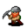

# { .sprite } Forgotten miner

| Stat | Value |
|---|---|
| Class | ghost |
| HP | 228 |
| Max AP | 12 |
| Attack cost | 4 |
| Move cost | 5 |
| Damage | 8 to 14 |
| Attack chance | 170 |
| Block chance | 166 |
| Damage resistance | 5 |
| Critical skill | 20 |
| Critical multiplier | 2.0 |

!!! note "Immune to critical hits"
    Monsters of this class cannot be critically hit.

## Drops

| Item | Chance | Qty |
|---|---|---|
| [Gold coins](../items/gold.md) | 25% | 5 to 25 |
| [Undertell diamond](../items/undertell_diamond.md) | 1% | 1 |
| [Raw sapphire](../items/raw_sapphire.md) | 1% | 1 |
| [Vein ruby](../items/vein_ruby.md) | 1% | 1 |
| [Amethyst](../items/amethyst.md) | 1% | 1 |

## Found on

- [undertell_05](../maps/undertell_05.md)
- [undertell_13](../maps/undertell_13.md)
- [undertell_14](../maps/undertell_14.md)
- [undertell_15](../maps/undertell_15.md)
- [undertell_23](../maps/undertell_23.md)
- [undertell_24](../maps/undertell_24.md)
- [undertell_3_00](../maps/undertell_3_00.md)
- [undertell_3_01](../maps/undertell_3_01.md)
- [undertell_3_02](../maps/undertell_3_02.md)
- [undertell_3_03](../maps/undertell_3_03.md)
- [undertell_3_11](../maps/undertell_3_11.md)
- [undertell_3_12](../maps/undertell_3_12.md)
- [undertell_3_13](../maps/undertell_3_13.md)

<small>Monster ID: `forgotten_miner` · Data from v0.8.18</small>
