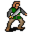

# { .sprite } Crackshot

| Stat | Value |
|---|---|
| Class | humanoid |
| HP | 133 |
| Max AP | 10 |
| Attack cost | 5 |
| Move cost | 5 |
| Damage | 5 to 11 |
| Attack chance | 110 |
| Block chance | 100 |
| Damage resistance | 4 |
| Critical skill | 20 |
| Critical multiplier | 3.0 |

## On hit

- **On self:** Combo (magnitude 1, 1 rounds, 25% chance)

## Drops

| Item | Chance | Qty |
|---|---|---|
| [Gold coins](../items/gold.md) | 100% | 10 to 125 |
| [Villain's leather armor](../items/armour_leather_villain.md) | 20% | 1 |
| [Yatagan](../items/sword_g03_crackshot.md) | 100% | 1 |
| [Key of Luthor](../items/g03_luthor.md) | 100% | 1 |

## Found on

- [crackshot_hideout3](../maps/crackshot_hideout3.md)

## Dialogue simulator

Set up your situation (quest stages, items, kills…), then talk to Crackshot. The simulator follows the game's own rules: it takes the same silent checks, offers only the options you'd really see, and applies their effects (quest stages, items handed over, rewards) as you go.

<noscript>The simulator needs JavaScript. The full dialogue is listed below.</noscript>

Rules verified against v0.8.18 game code (ConversationController.java) and dialogue data.

??? quote "Dialogue (5 lines)"

    *What the dialogue says, exactly as in the game files. Lines are listed once; links jump to the line a choice leads to.*

    **`guild03_crackshot_1`** [Crackshot](../monsters/g03_crackshot.md): “Oh ho! Welcome to my base, kid.”

    - “Hmm .... This is not the place where I would choose to live.” → [guild03_crackshot_2a](#d-guild03_crackshot_2a)
    - “You are under arrest for the crimes you've committed against Feygard!” → [guild03_crackshot_2b](#d-guild03_crackshot_2b)

    **`guild03_crackshot_2a`** Crackshot: “Haven't you realized yet? Your life is not going to be much longer.” — **effects:** faction “crackshot” set to -10

    - “Hah! Let's see if you're as strong as Umar has said.” → *fight starts*
    - “Prepare to die!” → *fight starts*

    **`guild03_crackshot_2b`** Crackshot: “*laugh* Are you serious?”

    - Next → [guild03_crackshot_3](#d-guild03_crackshot_3)

    **`guild03_crackshot_3`** Crackshot: “Do you really believe such words are worth anything here?”

    - Next → [guild03_crackshot_4](#d-guild03_crackshot_4)

    **`guild03_crackshot_4`** Crackshot: “Let's see if you can arrest me after I have finished with you!” — **effects:** faction “crackshot” set to -10

    - “The Feygard soldiers will be avenged!” → *fight starts*
    - “Your head will serve as proof!” → *fight starts*

## Version history

| Version | Change |
|---|---|
| [v0.7.8](../versions/0.7.8.md) | Added Dialogue: 5 lines added |
| [v0.7.9](../versions/0.7.9.md) | Dialogue: 1 line changed |

Verified against v0.8.18 and every earlier release back to v0.7.0 (game data compared release by release).

## Community notes

<small>Written by players, not generated from game data. **Observations**: what players notice in-game · **Lore**: the in-world story · **Trivia**: real-world facts, references, development history · **Theory / speculation**: unconfirmed ideas; may just be unfinished content</small>

### Observations

*Nothing here yet. Know something? [Add it](https://github.com/asdfghjkl628/Andor-s-Trail-Wikiiii/new/main/notes/monsters?filename=g03_crackshot.md&value=%23%23%20Observations%0A%0A%3C%21--%20what%20players%20notice%20in-game%20--%3E%0A%0A%23%23%20Lore%0A%0A%3C%21--%20the%20in-world%20story%20--%3E%0A%0A%23%23%20Trivia%0A%0A%3C%21--%20real-world%20facts%2C%20references%2C%20development%20history%20--%3E%0A%0A%23%23%20Theory%20/%20speculation%0A%0A%3C%21--%20unconfirmed%20ideas%3B%20may%20just%20be%20unfinished%20content%20--%3E%0A).*

### Lore

*Nothing here yet. Know something? [Add it](https://github.com/asdfghjkl628/Andor-s-Trail-Wikiiii/new/main/notes/monsters?filename=g03_crackshot.md&value=%23%23%20Observations%0A%0A%3C%21--%20what%20players%20notice%20in-game%20--%3E%0A%0A%23%23%20Lore%0A%0A%3C%21--%20the%20in-world%20story%20--%3E%0A%0A%23%23%20Trivia%0A%0A%3C%21--%20real-world%20facts%2C%20references%2C%20development%20history%20--%3E%0A%0A%23%23%20Theory%20/%20speculation%0A%0A%3C%21--%20unconfirmed%20ideas%3B%20may%20just%20be%20unfinished%20content%20--%3E%0A).*

### Trivia

*Nothing here yet. Know something? [Add it](https://github.com/asdfghjkl628/Andor-s-Trail-Wikiiii/new/main/notes/monsters?filename=g03_crackshot.md&value=%23%23%20Observations%0A%0A%3C%21--%20what%20players%20notice%20in-game%20--%3E%0A%0A%23%23%20Lore%0A%0A%3C%21--%20the%20in-world%20story%20--%3E%0A%0A%23%23%20Trivia%0A%0A%3C%21--%20real-world%20facts%2C%20references%2C%20development%20history%20--%3E%0A%0A%23%23%20Theory%20/%20speculation%0A%0A%3C%21--%20unconfirmed%20ideas%3B%20may%20just%20be%20unfinished%20content%20--%3E%0A).*

### Theory / speculation

*Nothing here yet. Know something? [Add it](https://github.com/asdfghjkl628/Andor-s-Trail-Wikiiii/new/main/notes/monsters?filename=g03_crackshot.md&value=%23%23%20Observations%0A%0A%3C%21--%20what%20players%20notice%20in-game%20--%3E%0A%0A%23%23%20Lore%0A%0A%3C%21--%20the%20in-world%20story%20--%3E%0A%0A%23%23%20Trivia%0A%0A%3C%21--%20real-world%20facts%2C%20references%2C%20development%20history%20--%3E%0A%0A%23%23%20Theory%20/%20speculation%0A%0A%3C%21--%20unconfirmed%20ideas%3B%20may%20just%20be%20unfinished%20content%20--%3E%0A).*

<small>Monster ID: `g03_crackshot` · Data from v0.8.18</small>
