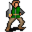

# { .sprite } Defy

<div class="infobox" markdown>

<p class="ib-img">{ .sprite }</p>

| | |
|---|---|
| **Type** | NPC/Enemy (can be spoken to, but can also be fought) |
| **Found in** | Sullengard, aidem_base_2, aidem_camp, Fallhaven, Blackwater Mountain |
| **Class** | Humanoid |
| **HP** | 359 |
| **XP when defeated** | 851 |
| **Entries in game data** | 5 |
| **Introduced** | [v0.8.2](../versions/0.8.2.md) |

</div>

!!! info "5 entries in the game data"
    The game's data files define 5 separate characters named Defy. Andor's Trail stores a character as a new entry whenever it needs different behaviour, for example a different conversation at a later stage of a quest, a different location, or different combat statistics. Some entries represent the same person at different points in the story; others are different people who share a generic name. Here the entries differ in: conversation, location, combat statistics, loot or shop stock, movement. This page combines them; each entry is described in its own section below.

| Entry | Type | Location | Role | HP |
|---|---|---|---|---|
| [`g04_defy`](#v-g04_defy) | NPC | Sullengard: [sullengard_tavern_basement](../maps/sullengard_tavern_basement.md#pin-npc-g04_defy) | – | – |
| [`aidem_base_defy`](#v-aidem_base_defy) | NPC/Enemy | [aidem_base_2](../maps/aidem_base_2.md#pin-npc-aidem_base_defy) | – | 359 |
| [`aidem_camp_defy`](#v-aidem_camp_defy) | NPC | [aidem_camp](../maps/aidem_camp.md#pin-npc-aidem_camp_defy) | – | – |
| [`aidem_jail_defy`](#v-aidem_jail_defy) | Enemy | Fallhaven: [guildbrig2](../maps/guildbrig2.md) | – | 1 |
| [`defy_wild6house`](#v-defy_wild6house) | NPC | Blackwater Mountain: [wild6_house](../maps/wild6_house.md#pin-npc-defy_wild6house) | – | – |

## Sullengard, Sullengard tavern basement (g04_defy) { #v-g04_defy }

**Entry ID:** `g04_defy` · **Type:** NPC

**Location:** Sullengard: [sullengard_tavern_basement](../maps/sullengard_tavern_basement.md#pin-npc-g04_defy)

### Quests

- [Another ruthless Crackshot](../quests/Thieves04.md): stage 20

### Dialogue simulator

Set the quest stages, items and other conditions that apply to your game, then start the conversation with Defy. The simulator applies the game's own rules: it performs the same silent checks, offers only the options that would be shown in the game, and applies their effects (quest stages, items handed over, rewards) as the conversation proceeds.

<div class="dlg-sim" data-src="../../assets/dialogue/guild04_defy.json" data-npc="Defy" markdown="0"><noscript>The simulator needs JavaScript. The full dialogue is listed below.</noscript></div>

<p class="verified">Rules verified against v0.8.18 game code (ConversationController.java) and dialogue data.</p>

??? quote "Dialogue (6 lines)"

    *What the dialogue says, exactly as in the game files. Lines are listed once; links jump to the line a choice leads to.*

    <span id="d-g04_defy-guild04_defy"></span>**`guild04_defy`** *(silent check: the first matching branch below is taken)*

    - branch 1 *(if latest stage of [Another ruthless Crackshot](../quests/Thieves04.md#stage-10) is 10)* → [guild04_defy_1](#d-g04_defy-guild04_defy_1)
    - branch 2 → [guild04_defy_5](#d-g04_defy-guild04_defy_5)

    <span id="d-g04_defy-guild04_defy_1"></span>**`guild04_defy_1`** Defy: “Andor, is that you? You grew weak and small. How was your visit to Nor City?”

    - “I'm $playername. Andor is my brother and I'm not weak.” → [guild04_defy_2](#d-g04_defy-guild04_defy_2)

    <span id="d-g04_defy-guild04_defy_5"></span>**`guild04_defy_5`** Defy: “Just mind your own business, kid. Now, get out of here or I'll kick you out.”

    - “You will be the one who's kicked out of here.” → *conversation ends*
    - “You will be the one to blame here.” *(if latest stage of [Another ruthless Crackshot](../quests/Thieves04.md#stage-20) is 20)* → *conversation ends*

    <span id="d-g04_defy-guild04_defy_2"></span>**`guild04_defy_2`** Defy: “Oh, yeah, but you do look a lot like him. I'm Defy.”

    - “So you know my brother as well?” → [guild04_defy_3](#d-g04_defy-guild04_defy_3)

    <span id="d-g04_defy-guild04_defy_3"></span>**`guild04_defy_3`** Defy: “Indeed. He always asks questions like a curious kid does. Tell me, what brings you here, $playername?”

    - “Umar told me that it is time to give their share to the bootleg brewers.” → [guild04_defy_4](#d-g04_defy-guild04_defy_4)
    - “Umar sent me for our business.” → [guild04_defy_4](#d-g04_defy-guild04_defy_4)

    <span id="d-g04_defy-guild04_defy_4"></span>**`guild04_defy_4`** Defy: “The time of sharing? If that's so, then tell him that there will be a delay.” — **effects:** sets stage 20 of [Another ruthless Crackshot](../quests/Thieves04.md#stage-20)

    - “Really?” → [guild04_defy_5](#d-g04_defy-guild04_defy_5)
    - “A delay of what?” → [guild04_defy_5](#d-g04_defy-guild04_defy_5)


### Version history

| Version | Change |
|---|---|
| [v0.8.2](../versions/0.8.2.md) | Added<br>Dialogue: 6 lines added |
| [v0.8.8](../versions/0.8.8.md) | attackChance removed; attackCost removed; attackDamage removed; blockChance removed; criticalMultiplier removed; criticalSkill removed (+7 more) |

<p class="verified">Verified against v0.8.18 and every earlier release back to v0.7.0 (game data compared release by release).</p>


??? info "Technical information (g04_defy)"

    | | |
    |---|---|
    | Entry ID | `g04_defy` |
    | Spawn group | `g04_defy` |
    | Loot table | – |
    | Conversation | `guild04_defy` |
    | Faction | – |
    | Movement | – |
    | Icon | `monsters_ld1:81` |
    | Defined in | `res/raw/monsterlist_sullengard.json` |

    Raw data:

    ```json
    {
     "id": "g04_defy",
     "name": "Defy",
     "iconID": "monsters_ld1:81",
     "unique": 1,
     "monsterClass": "humanoid",
     "spawnGroup": "g04_defy",
     "phraseID": "guild04_defy",
     "hitEffect": {},
     "hitReceivedEffect": {}
    }
    ```


## Aidem base 2 (aidem_base_defy) { #v-aidem_base_defy }

**Entry ID:** `aidem_base_defy` · **Type:** NPC/Enemy

**Location:** [aidem_base_2](../maps/aidem_base_2.md#pin-npc-aidem_base_defy)

!!! warning "Can be fought"
    This entry can be talked to, but it can also become an opponent: a conversation with this character can end in combat (a dialogue branch leads to a fight).

### Combat statistics

| Statistic | Value |
|---|---|
| Class | Humanoid |
| HP | 359 |
| XP when defeated | 851 |
| Damage | 10 to 18 |
| Attack chance | 170 |
| Block chance | 170 |
| Damage resistance | 0 |
| Max AP | 10 |
| Attack cost | 3 AP |
| Attacks per turn | 3 |
| Move cost | 3 AP |
| Critical skill | 5 |
| Critical multiplier | 3.0 |
| Critical hit chance | 5% |

**When hit:** On self: Concentration (magnitude 1, 2 rounds, 40% chance)


<p class="verified">Verified against v0.8.18 monster data and game code (`MonsterTypeParser.java`).</p>

### Drops

| Item | Chance | Qty |
|---|---|---|
| [Villain's ring](../items/ring_villain.md) | 100% | 1 |
| [Gold coins](../items/gold.md) | 100% | 3500 to 5000 |
| [Defy's ring](../items/defy_ring.md) | 100% | 1 |

### Locations

| Map | Region | Up to | Notes |
|---|---|---|---|
| [aidem_base_2](../maps/aidem_base_2.md) | – | 1 | Appears later, during a quest |

### Quests that count defeats

- [Wanted men](../quests/wanted_men.md#stage-76) with stepping on a trigger on [aidem_base_2](../maps/aidem_base_2.md) checks that this enemy has been defeated.

### Quests

- [Wanted men](../quests/wanted_men.md): stages 56, 60, 75

### Dialogue simulator

Set the quest stages, items and other conditions that apply to your game, then start the conversation with Defy. The simulator applies the game's own rules: it performs the same silent checks, offers only the options that would be shown in the game, and applies their effects (quest stages, items handed over, rewards) as the conversation proceeds.

<div class="dlg-sim" data-src="../../assets/dialogue/aidem_base_defy_selector.json" data-npc="Defy" markdown="0"><noscript>The simulator needs JavaScript. The full dialogue is listed below.</noscript></div>

<p class="verified">Rules verified against v0.8.18 game code (ConversationController.java) and dialogue data.</p>

??? quote "Dialogue (8 lines)"

    *What the dialogue says, exactly as in the game files. Lines are listed once; links jump to the line a choice leads to.*

    <span id="d-aidem_base_defy-aidem_base_defy_selector"></span>**`aidem_base_defy_selector`** *(silent check: the first matching branch below is taken)*

    - “Come and get it!” *(if latest stage of [Wanted men](../quests/wanted_men.md#stage-75) is 75)* → [aidem_base_fight](#d-aidem_base_defy-aidem_base_fight)
    - Next *(if reached stage 45 of [Wanted men](../quests/wanted_men.md#stage-45); NOT reached stage 60 of [Wanted men](../quests/wanted_men.md#stage-60))* → [aidem_base_defy_help_10](#d-aidem_base_defy-aidem_base_defy_help_10)
    - Next *(if NOT reached stage 56 of [Wanted men](../quests/wanted_men.md#stage-56))* → [aidem_base_dont_help_defy_10](#d-aidem_base_defy-aidem_base_dont_help_defy_10)
    - “What are you waiting for? Go take the fake key to Troublemaker.” *(if reached stage 60 of [Wanted men](../quests/wanted_men.md#stage-60))* → *conversation ends*

    <span id="d-aidem_base_defy-aidem_base_fight"></span>**`aidem_base_fight`** Defy: “You will regret this, kid!” — **effects:** removes monsters from aidem_base_2, spawns monsters on aidem_base_2, spawns monsters on aidem_base_2, spawns monsters on aidem_base_2, spawns monsters on aidem_base_2

    - “I hope not.” → *fight starts*

    <span id="d-aidem_base_defy-aidem_base_defy_help_10"></span>**`aidem_base_defy_help_10`** Defy: “Do you have the key? Hand it over.”

    - “Oops. I forgot to bring it with me. I'll be back soon.” *(if NOT carry 1× [Thieves' vault key](../items/thieves_vault_key.md))* → *conversation ends*
    - “Yes. Here it is.” *(if hand over 1× [Thieves' vault key](../items/thieves_vault_key.md))* → [aidem_base_defy_help_20](#d-aidem_base_defy-aidem_base_defy_help_20)
    - “Yes, but you are not having it. I will loot the vault myself and keep everything I find.” *(if carry 1× [Thieves' vault key](../items/thieves_vault_key.md))* → [aidem_base_defy_dont_help_10](#d-aidem_base_defy-aidem_base_defy_dont_help_10)

    <span id="d-aidem_base_defy-aidem_base_dont_help_defy_10"></span>**`aidem_base_dont_help_defy_10`** Defy: “Do you have the key? Hand it over.”

    - “Yes, Here it is. [Handing over the fake key]” *(if hand over 1× [Fake Thieve's Guild vault key](../items/thieves_vault_key_fake.md))* → [aidem_base_defy_help_tg_10](#d-aidem_base_defy-aidem_base_defy_help_tg_10)

    <span id="d-aidem_base_defy-aidem_base_defy_help_20"></span>**`aidem_base_defy_help_20`** Defy: “Thank you so much. Now take this fake key that Zachlanny's has made and return it to Troublemaker before he suspects anything. Then meet us at the vault to collect your share of the loot.” — **effects:** gives [Aidem fake vault key](../items/aidem_fake_vault_key.md), sets stage 60 of [Wanted men](../quests/wanted_men.md#stage-60)


    <span id="d-aidem_base_defy-aidem_base_defy_dont_help_10"></span>**`aidem_base_defy_dont_help_10`** Defy: “Come again?”

    - “I said, "here it is".” → [aidem_base_defy_help_20](#d-aidem_base_defy-aidem_base_defy_help_20)
    - “You heard me the first time. I'm keeping the key and looting the vault myself.” → [aidem_base_defy_dont_help_20](#d-aidem_base_defy-aidem_base_defy_dont_help_20)

    <span id="d-aidem_base_defy-aidem_base_defy_help_tg_10"></span>**`aidem_base_defy_help_tg_10`** Defy: “Thank you so much. Now take this fake key that Zachlanny's has made and return it to Troublemaker before he suspects anything. Then meet us at the vault to collect your share of the loot.” — **effects:** gives [Aidem fake vault key](../items/aidem_fake_vault_key.md), sets stage 56 of [Wanted men](../quests/wanted_men.md#stage-56), removes monsters from aidem_base_2, spawns monsters on wild6_house, removes monsters from aidem_base_2


    <span id="d-aidem_base_defy-aidem_base_defy_dont_help_20"></span>**`aidem_base_defy_dont_help_20`** Defy: “I will be taking that key now!” — **effects:** sets stage 75 of [Wanted men](../quests/wanted_men.md#stage-75)

    - “Come and try!” → [aidem_base_fight](#d-aidem_base_defy-aidem_base_fight)


### Version history

| Version | Change |
|---|---|
| [v0.8.8](../versions/0.8.8.md) | Added<br>Dialogue: 8 lines added |
| [v0.8.10](../versions/0.8.10.md) | Dialogue: 1 line changed |
| [v0.8.12.1](../versions/0.8.12.1.md) | Dialogue: 1 line changed |

<p class="verified">Verified against v0.8.18 and every earlier release back to v0.7.0 (game data compared release by release).</p>


??? info "Technical information (aidem_base_defy)"

    | | |
    |---|---|
    | Entry ID | `aidem_base_defy` |
    | Spawn group | `help_defy` |
    | Loot table | `aidem_base_defy_dl` |
    | Conversation | `aidem_base_defy_selector` |
    | Faction | – |
    | Movement | helpOthers |
    | Icon | `monsters_ld1:81` |
    | Defined in | `res/raw/monsterlist_mt_galmore.json` |

    Raw data:

    ```json
    {
     "id": "aidem_base_defy",
     "name": "Defy",
     "iconID": "monsters_ld1:81",
     "maxHP": 359,
     "moveCost": 3,
     "unique": 1,
     "monsterClass": "humanoid",
     "movementAggressionType": "helpOthers",
     "attackDamage": {
      "min": 10,
      "max": 18
     },
     "spawnGroup": "help_defy",
     "phraseID": "aidem_base_defy_selector",
     "droplistID": "aidem_base_defy_dl",
     "attackCost": 3,
     "attackChance": 170,
     "criticalSkill": 5,
     "criticalMultiplier": 3.0,
     "blockChance": 170,
     "hitReceivedEffect": {
      "conditionsSource": [
       {
        "condition": "g03_concentration",
        "magnitude": 1,
        "duration": 2,
        "chance": "40"
       }
      ]
     }
    }
    ```


## Aidem camp (aidem_camp_defy) { #v-aidem_camp_defy }

**Entry ID:** `aidem_camp_defy` · **Type:** NPC

**Location:** [aidem_camp](../maps/aidem_camp.md#pin-npc-aidem_camp_defy)

### Quests

- [Wanted men](../quests/wanted_men.md): stages 20, 25, 30, 35, 40

### Dialogue simulator

Set the quest stages, items and other conditions that apply to your game, then start the conversation with Defy. The simulator applies the game's own rules: it performs the same silent checks, offers only the options that would be shown in the game, and applies their effects (quest stages, items handed over, rewards) as the conversation proceeds.

<div class="dlg-sim" data-src="../../assets/dialogue/aidem_camp_defy_10.json" data-npc="Defy" markdown="0"><noscript>The simulator needs JavaScript. The full dialogue is listed below.</noscript></div>

<p class="verified">Rules verified against v0.8.18 game code (ConversationController.java) and dialogue data.</p>

??? quote "Dialogue (33 lines)"

    *What the dialogue says, exactly as in the game files. Lines are listed once; links jump to the line a choice leads to.*

    <span id="d-aidem_camp_defy-aidem_camp_defy_10"></span>**`aidem_camp_defy_10`** Defy: “Oh, how interesting your timing is.”

    - “Really? And why is that?” → [aidem_camp_defy_20](#d-aidem_camp_defy-aidem_camp_defy_20)

    <span id="d-aidem_camp_defy-aidem_camp_defy_20"></span>**`aidem_camp_defy_20`** Defy: “Well, you see, we are in kind of a predicament.”

    - “Oh, you are feeling guility for what you did to the great people of Sullengard and want to turn yourselves in, but…” → [aidem_camp_defy_30](#d-aidem_camp_defy-aidem_camp_defy_30)

    <span id="d-aidem_camp_defy-aidem_camp_defy_30"></span>**`aidem_camp_defy_30`** Defy: “Now that's funny. No! Now back to what I was trying to tell you...”

    - Next → [aidem_camp_defy_35](#d-aidem_camp_defy-aidem_camp_defy_35)

    <span id="d-aidem_camp_defy-aidem_camp_defy_35"></span>**`aidem_camp_defy_35`** Defy: “We are planning a heist, but we need your "skills" to pull it off.”

    - “Forget it!” → [aidem_camp_defy_40](#d-aidem_camp_defy-aidem_camp_defy_40)
    - “My "skills" are not for hire.” → [aidem_camp_defy_40](#d-aidem_camp_defy-aidem_camp_defy_40)

    <span id="d-aidem_camp_defy-aidem_camp_defy_40"></span>**`aidem_camp_defy_40`** Defy: “Please. Just hear me out.”

    - Next → [aidem_camp_defy_45](#d-aidem_camp_defy-aidem_camp_defy_45)

    <span id="d-aidem_camp_defy-aidem_camp_defy_45"></span>**`aidem_camp_defy_45`** Defy: “We have knowledge of this vast repository of gold and other treasures, but it is well secured under lock and key.”

    - “OK. You had me at "treasures". Please go on.” → [aidem_camp_defy_50](#d-aidem_camp_defy-aidem_camp_defy_50)
    - “And you want me to help you return it to its rightful owners?” → [aidem_camp_defy_46](#d-aidem_camp_defy-aidem_camp_defy_46)

    <span id="d-aidem_camp_defy-aidem_camp_defy_50"></span>**`aidem_camp_defy_50`** Defy: “The problem of needing the key is where your "skills" come in.”

    - “These "skills" that you keep mentioning, what are they?” → [aidem_camp_defy_55](#d-aidem_camp_defy-aidem_camp_defy_55)

    <span id="d-aidem_camp_defy-aidem_camp_defy_46"></span>**`aidem_camp_defy_46`** Defy: “[Laughing loudly]. Kid, you are certainly as funny as you are funny looking, I'll tell you that right now. Now, back on topic...”

    - Next → [aidem_camp_defy_50](#d-aidem_camp_defy-aidem_camp_defy_50)

    <span id="d-aidem_camp_defy-aidem_camp_defy_55"></span>**`aidem_camp_defy_55`** Defy: “I was just getting to that. If you would stop interrupting me, I could get to the plan quicker and how you play a major role in it.”

    - “A "major" role you said. So what, I get fifty percent of the loot?” → [aidem_camp_defy_56](#d-aidem_camp_defy-aidem_camp_defy_56)
    - “Oh, sorry. Please continue.” → [aidem_camp_defy_60](#d-aidem_camp_defy-aidem_camp_defy_60)

    <span id="d-aidem_camp_defy-aidem_camp_defy_56"></span>**`aidem_camp_defy_56`** Defy: “Again with the humor. No, you will not be getting fifty percent. Anyways...”

    - Next → [aidem_camp_defy_60](#d-aidem_camp_defy-aidem_camp_defy_60)

    <span id="d-aidem_camp_defy-aidem_camp_defy_60"></span>**`aidem_camp_defy_60`** Defy: “Well, before I get into any more details. Hey Alaric [the lost traveler's real name], do we trust this kid enough to tell him the details?”

    - Next → [aidem_camp_defy_alaric_10](#d-aidem_camp_defy-aidem_camp_defy_alaric_10)

    <span id="d-aidem_camp_defy-aidem_camp_defy_alaric_10"></span>**`aidem_camp_defy_alaric_10`** [Lost Traveler](../monsters/aidem_camp_lost_traveler.md): “Well Defy, $playername did let me go after discovering my crime.”

    - “[Keep quiet about the facts and agree, for now] That's true.” → [aidem_camp_defy_70](#d-aidem_camp_defy-aidem_camp_defy_70)

    <span id="d-aidem_camp_defy-aidem_camp_defy_70"></span>**`aidem_camp_defy_70`** [Defy](../monsters/g04_defy.md#v-aidem_camp_defy): “That's fair enough. Now let us move on to the details, shall we?”

    - “Yes, please. I'm getting bored here.” → [aidem_camp_defy_75](#d-aidem_camp_defy-aidem_camp_defy_75)

    <span id="d-aidem_camp_defy-aidem_camp_defy_75"></span>**`aidem_camp_defy_75`** Defy: “You see, we want to get back some of what is ours. What we helped to accumulate over the years. We want to hit them where it really hurts.”

    - “Who's that?” → [aidem_camp_defy_76a](#d-aidem_camp_defy-aidem_camp_defy_76a)
    - “Feygard? Nor City?” → [aidem_camp_defy_76](#d-aidem_camp_defy-aidem_camp_defy_76)
    - “The Thieves' Guild?” → [aidem_camp_defy_77](#d-aidem_camp_defy-aidem_camp_defy_77)

    <span id="d-aidem_camp_defy-aidem_camp_defy_76a"></span>**`aidem_camp_defy_76a`** Defy: “I'm talking about the Thieves' Guild.” — **effects:** sets stage 20 of [Wanted men](../quests/wanted_men.md#stage-20)

    - “Why would you want to do that?” → [aidem_camp_defy_78](#d-aidem_camp_defy-aidem_camp_defy_78)

    <span id="d-aidem_camp_defy-aidem_camp_defy_76"></span>**`aidem_camp_defy_76`** Defy: “Well, yes. But not right now. Those adventures are too big for us right now.”

    - Next → [aidem_camp_defy_76a](#d-aidem_camp_defy-aidem_camp_defy_76a)

    <span id="d-aidem_camp_defy-aidem_camp_defy_77"></span>**`aidem_camp_defy_77`** Defy: “Exactly!” — **effects:** sets stage 20 of [Wanted men](../quests/wanted_men.md#stage-20)

    - “Why is that?” → [aidem_camp_defy_78](#d-aidem_camp_defy-aidem_camp_defy_78)

    <span id="d-aidem_camp_defy-aidem_camp_defy_78"></span>**`aidem_camp_defy_78`** Defy: “Well, for starters, Umar and his sidekick brother have wronged us over and over again. Keeping all the wealth for themselves. And don't even get me started on the emotional stress and abuse we suffer from at their hands.”

    - “Um...what did they do?” → [aidem_camp_defy_80](#d-aidem_camp_defy-aidem_camp_defy_80)

    <span id="d-aidem_camp_defy-aidem_camp_defy_80"></span>**`aidem_camp_defy_80`** Defy: “You know what I am talking about, don't you?”

    - “I'm not so sure that I do.” → [aidem_camp_defy_81](#d-aidem_camp_defy-aidem_camp_defy_81)
    - “Actually, yeah, kind of. Well, at least that thought has crossed my mind once or twice recently.” → [aidem_camp_defy_82](#d-aidem_camp_defy-aidem_camp_defy_82)

    <span id="d-aidem_camp_defy-aidem_camp_defy_81"></span>**`aidem_camp_defy_81`** Defy: “Come on, $playername. Open you eyes. Think. Your are just a tool to him. Something for him to use to accomplish whatever his agenda is that day.”

    - “Actually, yeah, kind of. Well, at least that thought has crossed my mind once or twice recently.” → [aidem_camp_defy_82](#d-aidem_camp_defy-aidem_camp_defy_82)
    - “I'm not so sure, but please, get on with your plan.” → [aidem_camp_defy_82](#d-aidem_camp_defy-aidem_camp_defy_82)

    <span id="d-aidem_camp_defy-aidem_camp_defy_82"></span>**`aidem_camp_defy_82`** Defy: “Anyways... The Guild has a vault. A repository of treasures and wealth hidden and secure in a location just south of Fallhaven.”

    - “I've been all around the Fallhaven area a thousand times and I've never seen any vault.” → [aidem_camp_defy_83](#d-aidem_camp_defy-aidem_camp_defy_83)
    - “I don't believe you. I would have stumbled across it.” → [aidem_camp_defy_83](#d-aidem_camp_defy-aidem_camp_defy_83)

    <span id="d-aidem_camp_defy-aidem_camp_defy_83"></span>**`aidem_camp_defy_83`** Defy: “Oh, trust me, it's there all right.”

    - “Trust you? You want me to trust you? A dishonorable thief? Where is it then?” → [aidem_camp_defy_84](#d-aidem_camp_defy-aidem_camp_defy_84)
    - “Tell me. I want to know.” → [aidem_camp_defy_84](#d-aidem_camp_defy-aidem_camp_defy_84)

    <span id="d-aidem_camp_defy-aidem_camp_defy_84"></span>**`aidem_camp_defy_84`** Defy: “Are you familiar with that vacant house southwest of Fallhaven? The one next to the cliffside?”

    - “Of course I am.” → [aidem_camp_defy_85](#d-aidem_camp_defy-aidem_camp_defy_85)
    - “[Lie] Yes, yes I am.” → [aidem_camp_defy_85](#d-aidem_camp_defy-aidem_camp_defy_85)

    <span id="d-aidem_camp_defy-aidem_camp_defy_85"></span>**`aidem_camp_defy_85`** Defy: “The entrance to it is found inside that house. It's hidden and secured. You will need to find the passage that leads underground in order to gain access.” — **effects:** sets stage 25 of [Wanted men](../quests/wanted_men.md#stage-25)

    - “That sounds easy. I'll do it.” → [aidem_camp_defy_86](#d-aidem_camp_defy-aidem_camp_defy_86)
    - “I guess I can try and get in there.” → [aidem_camp_defy_86](#d-aidem_camp_defy-aidem_camp_defy_86)

    <span id="d-aidem_camp_defy-aidem_camp_defy_86"></span>**`aidem_camp_defy_86`** Defy: “You won't be doing it.”

    - “I won't be?” → [aidem_camp_defy_87](#d-aidem_camp_defy-aidem_camp_defy_87)

    <span id="d-aidem_camp_defy-aidem_camp_defy_87"></span>**`aidem_camp_defy_87`** Defy: “No. We will be doing that.”

    - “Then what do you need from me?” → [aidem_camp_defy_88](#d-aidem_camp_defy-aidem_camp_defy_88)

    <span id="d-aidem_camp_defy-aidem_camp_defy_88"></span>**`aidem_camp_defy_88`** Defy: “What I need from you is more of an inside job. I need you to get the key to the vault from Troublemaker without him suspecting any trickery. Do you think you can handle that?” — **effects:** sets stage 30 of [Wanted men](../quests/wanted_men.md#stage-30)

    - “Why should I help you? What do I get out of this?” → [aidem_camp_defy_89](#d-aidem_camp_defy-aidem_camp_defy_89)
    - “If I do this for you, then I expect to get paid!” → [aidem_camp_defy_89a](#d-aidem_camp_defy-aidem_camp_defy_89a)

    <span id="d-aidem_camp_defy-aidem_camp_defy_89"></span>**`aidem_camp_defy_89`** Defy: “Oh, you aren't as dumb as you are funny.”

    - Next → [aidem_camp_defy_89a](#d-aidem_camp_defy-aidem_camp_defy_89a)

    <span id="d-aidem_camp_defy-aidem_camp_defy_89a"></span>**`aidem_camp_defy_89a`** Defy: “How does 10 percent of the total treasure sound?”

    - “I want 50 percent” → [aidem_camp_defy_89a](#d-aidem_camp_defy-aidem_camp_defy_89a)
    - “How does 30 percent sound?” → [aidem_camp_defy_89a](#d-aidem_camp_defy-aidem_camp_defy_89a)
    - “Nope. I will go no lower than 25 percent” → [aidem_camp_defy_89a](#d-aidem_camp_defy-aidem_camp_defy_89a)
    - “I'll do it for twice that amount. 20 percent.” → [aidem_camp_defy_90](#d-aidem_camp_defy-aidem_camp_defy_90)

    <span id="d-aidem_camp_defy-aidem_camp_defy_90"></span>**`aidem_camp_defy_90`** Defy: “Fine! [Shh] I'll take it out of Greedy's portion. He'll never know the difference.” — **effects:** sets stage 35 of [Wanted men](../quests/wanted_men.md#stage-35)

    - Next → [aidem_camp_defy_95](#d-aidem_camp_defy-aidem_camp_defy_95)

    <span id="d-aidem_camp_defy-aidem_camp_defy_95"></span>**`aidem_camp_defy_95`** Defy: “We will be leaving this campsite in favor of our hideout. Meet up with me there and you can give me the key then.”

    - “Sounds good, but where is your hideout?” → [aidem_camp_defy_100](#d-aidem_camp_defy-aidem_camp_defy_100)

    <span id="d-aidem_camp_defy-aidem_camp_defy_100"></span>**`aidem_camp_defy_100`** Defy: “It's where the rail tracks end. West of the Sutdover River.” — **effects:** sets stage 40 of [Wanted men](../quests/wanted_men.md#stage-40), removes monsters from aidem_camp, spawns monsters on aidem_base_2, spawns monsters on aidem_base_2

    - “The Sutdover River? Where is it?” → [aidem_camp_defy_110](#d-aidem_camp_defy-aidem_camp_defy_110)

    <span id="d-aidem_camp_defy-aidem_camp_defy_110"></span>**`aidem_camp_defy_110`** Defy: “The Sutdover River flows between Sullengard and Stoutford.”


### Version history

| Version | Change |
|---|---|
| [v0.8.8](../versions/0.8.8.md) | Added<br>Dialogue: 33 lines added |
| [v0.8.13](../versions/0.8.13.md) | Dialogue: 2 lines changed<br>· text: “I'm talking about the Thieves Guild.” → “I'm talking about the Thieves' Guild.” |
| [v0.8.15](../versions/0.8.15.md) | Dialogue: 1 line changed<br>· text: “Come on, $playername. Open your eyes. Think. Your are just a tool to …” → “Come on, $playername. Open you eyes. Think. Your are just a tool to h…” |

<p class="verified">Verified against v0.8.18 and every earlier release back to v0.7.0 (game data compared release by release).</p>


??? info "Technical information (aidem_camp_defy)"

    | | |
    |---|---|
    | Entry ID | `aidem_camp_defy` |
    | Spawn group | `aidem_camp_defy` |
    | Loot table | – |
    | Conversation | `aidem_camp_defy_10` |
    | Faction | – |
    | Movement | – |
    | Icon | `monsters_ld1:81` |
    | Defined in | `res/raw/monsterlist_mt_galmore.json` |

    Raw data:

    ```json
    {
     "id": "aidem_camp_defy",
     "name": "Defy",
     "iconID": "monsters_ld1:81",
     "phraseID": "aidem_camp_defy_10"
    }
    ```


## Fallhaven, Guildbrig2 (aidem_jail_defy) { #v-aidem_jail_defy }

**Entry ID:** `aidem_jail_defy` · **Type:** Enemy

**Location:** Fallhaven: [guildbrig2](../maps/guildbrig2.md)

### Combat statistics

| Statistic | Value |
|---|---|
| Class | Humanoid |
| HP | 1 |
| XP when defeated | 1 |
| Damage | 0 |
| Attack chance | 0 |
| Block chance | 0 |
| Damage resistance | 0 |
| Max AP | 10 |
| Attack cost | 10 AP |
| Attacks per turn | 1 |
| Move cost | 10 AP |
| Critical skill | 0 |
| Critical multiplier | – |
| Critical hit chance | None (requires both critical skill and a critical multiplier) |


<p class="verified">Verified against v0.8.18 monster data and game code (`MonsterTypeParser.java`).</p>

### Locations

| Map | Region | Up to | Notes |
|---|---|---|---|
| [guildbrig2](../maps/guildbrig2.md) | Fallhaven | 1 | Appears later, during a quest |


### Version history

| Version | Change |
|---|---|
| [v0.8.8](../versions/0.8.8.md) | Added |

<p class="verified">Verified against v0.8.18 and every earlier release back to v0.7.0 (game data compared release by release).</p>


??? info "Technical information (aidem_jail_defy)"

    | | |
    |---|---|
    | Entry ID | `aidem_jail_defy` |
    | Spawn group | `aidem_jail_defy` |
    | Loot table | – |
    | Conversation | – |
    | Faction | – |
    | Movement | – |
    | Icon | `monsters_ld1:81` |
    | Defined in | `res/raw/monsterlist_mt_galmore.json` |

    Raw data:

    ```json
    {
     "id": "aidem_jail_defy",
     "name": "Defy",
     "iconID": "monsters_ld1:81",
     "monsterClass": "humanoid"
    }
    ```


## Blackwater Mountain, Wild6 house (defy_wild6house) { #v-defy_wild6house }

**Entry ID:** `defy_wild6house` · **Type:** NPC

**Location:** Blackwater Mountain: [wild6_house](../maps/wild6_house.md#pin-npc-defy_wild6house)

### Quests

- [Wanted men](../quests/wanted_men.md): stage 70

### Dialogue simulator

Set the quest stages, items and other conditions that apply to your game, then start the conversation with Defy. The simulator applies the game's own rules: it performs the same silent checks, offers only the options that would be shown in the game, and applies their effects (quest stages, items handed over, rewards) as the conversation proceeds.

<div class="dlg-sim" data-src="../../assets/dialogue/defy_wild6house_selector.json" data-npc="Defy" markdown="0"><noscript>The simulator needs JavaScript. The full dialogue is listed below.</noscript></div>

<p class="verified">Rules verified against v0.8.18 game code (ConversationController.java) and dialogue data.</p>

??? quote "Dialogue (3 lines)"

    *What the dialogue says, exactly as in the game files. Lines are listed once; links jump to the line a choice leads to.*

    <span id="d-defy_wild6house-defy_wild6house_selector"></span>**`defy_wild6house_selector`** *(silent check: the first matching branch below is taken)*

    - Next *(if reached stage 65 of [Wanted men](../quests/wanted_men.md#stage-65))* → [defy_wild6house_10](#d-defy_wild6house-defy_wild6house_10)
    - Next → [defy_wild6house_20](#d-defy_wild6house-defy_wild6house_20)

    <span id="d-defy_wild6house-defy_wild6house_10"></span>**`defy_wild6house_10`** Defy: “Here is your reward for your role in our success.” — **effects:** sets stage 70 of [Wanted men](../quests/wanted_men.md#stage-70), gives [Gold coins](../items/gold.md)

    - “It was nice doing business with you.” → [defy_wild6house_20](#d-defy_wild6house-defy_wild6house_20)

    <span id="d-defy_wild6house-defy_wild6house_20"></span>**`defy_wild6house_20`** Defy: “We are leaving now. Too close to Fallhaven for my liking.” — **effects:** removes monsters from wild6_house


### Version history

| Version | Change |
|---|---|
| [v0.8.8](../versions/0.8.8.md) | Added<br>Dialogue: 3 lines added |

<p class="verified">Verified against v0.8.18 and every earlier release back to v0.7.0 (game data compared release by release).</p>


??? info "Technical information (defy_wild6house)"

    | | |
    |---|---|
    | Entry ID | `defy_wild6house` |
    | Spawn group | `defy_wild6house` |
    | Loot table | – |
    | Conversation | `defy_wild6house_selector` |
    | Faction | – |
    | Movement | – |
    | Icon | `monsters_ld1:81` |
    | Defined in | `res/raw/monsterlist_mt_galmore.json` |

    Raw data:

    ```json
    {
     "id": "defy_wild6house",
     "name": "Defy",
     "iconID": "monsters_ld1:81",
     "phraseID": "defy_wild6house_selector"
    }
    ```


??? info "How the XP value is calculated"

    The game computes each enemy's experience value when it loads the data (`MonsterTypeParser.java`):

    XP = ⌈(attacks per turn × attack chance × average damage × (1 + critical skill × critical multiplier) × 3 + HP × (1 + block chance) + 9 × damage resistance) × 0.7⌉

    Percentages are used as fractions (e.g. 60% = 0.6). Enemies whose attacks inflict a condition are worth 50 XP more. The More Exp skill adds a percentage on top.


## Community notes

<small>Written by players, not generated from game data. **Observations**: what players notice in-game · **Lore**: the in-world story · **Trivia**: real-world facts, references, development history · **Theory / speculation**: unconfirmed ideas; may just be unfinished content</small>

### Observations

*No notes yet. Contributions are welcome: [add a note](https://github.com/asdfghjkl628/Andor-s-Trail-Wikiiii/new/main/notes/monsters?filename=g04_defy.md&value=%23%23%20Observations%0A%0A%3C%21--%20what%20players%20notice%20in-game%20--%3E%0A%0A%23%23%20Lore%0A%0A%3C%21--%20the%20in-world%20story%20--%3E%0A%0A%23%23%20Trivia%0A%0A%3C%21--%20real-world%20facts%2C%20references%2C%20development%20history%20--%3E%0A%0A%23%23%20Theory%20/%20speculation%0A%0A%3C%21--%20unconfirmed%20ideas%3B%20may%20just%20be%20unfinished%20content%20--%3E%0A).*

### Lore

*No notes yet. Contributions are welcome: [add a note](https://github.com/asdfghjkl628/Andor-s-Trail-Wikiiii/new/main/notes/monsters?filename=g04_defy.md&value=%23%23%20Observations%0A%0A%3C%21--%20what%20players%20notice%20in-game%20--%3E%0A%0A%23%23%20Lore%0A%0A%3C%21--%20the%20in-world%20story%20--%3E%0A%0A%23%23%20Trivia%0A%0A%3C%21--%20real-world%20facts%2C%20references%2C%20development%20history%20--%3E%0A%0A%23%23%20Theory%20/%20speculation%0A%0A%3C%21--%20unconfirmed%20ideas%3B%20may%20just%20be%20unfinished%20content%20--%3E%0A).*

### Trivia

*No notes yet. Contributions are welcome: [add a note](https://github.com/asdfghjkl628/Andor-s-Trail-Wikiiii/new/main/notes/monsters?filename=g04_defy.md&value=%23%23%20Observations%0A%0A%3C%21--%20what%20players%20notice%20in-game%20--%3E%0A%0A%23%23%20Lore%0A%0A%3C%21--%20the%20in-world%20story%20--%3E%0A%0A%23%23%20Trivia%0A%0A%3C%21--%20real-world%20facts%2C%20references%2C%20development%20history%20--%3E%0A%0A%23%23%20Theory%20/%20speculation%0A%0A%3C%21--%20unconfirmed%20ideas%3B%20may%20just%20be%20unfinished%20content%20--%3E%0A).*

### Theory / speculation

*No notes yet. Contributions are welcome: [add a note](https://github.com/asdfghjkl628/Andor-s-Trail-Wikiiii/new/main/notes/monsters?filename=g04_defy.md&value=%23%23%20Observations%0A%0A%3C%21--%20what%20players%20notice%20in-game%20--%3E%0A%0A%23%23%20Lore%0A%0A%3C%21--%20the%20in-world%20story%20--%3E%0A%0A%23%23%20Trivia%0A%0A%3C%21--%20real-world%20facts%2C%20references%2C%20development%20history%20--%3E%0A%0A%23%23%20Theory%20/%20speculation%0A%0A%3C%21--%20unconfirmed%20ideas%3B%20may%20just%20be%20unfinished%20content%20--%3E%0A).*


<small>Data from v0.8.18</small>
