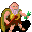

# { .sprite } Gison

| Stat | Value |
|---|---|
| Class | ? |
| HP | 0 |
| Max AP | 10 |
| Attack cost | 10 |
| Move cost | 10 |
| Damage | 0 |
| Attack chance | 0 |
| Block chance | 0 |
| Damage resistance | 0 |
| Critical skill | 0 |
| Critical multiplier | 0 |

## Found on

- [mywild20_houseleft](../maps/mywild20_houseleft.md)

## Quests

- [A raid for a cookbook](../quests/gison_cookbook.md): stages 10, 15, 20, 60, 62, 70
- [Delicious soup](../quests/gison_soup.md): stages 20, 22, 24, 26, 28, 40, 50, 60, 80, 100

??? quote "Dialogue (68 lines)"

    *What the dialogue says, exactly as in the game files. Lines are listed once; links jump to the line a choice leads to.*

    **`gison`** *(silent check: the first matching branch below is taken)*

    - branch 1 *(if reached stage 70 of [A raid for a cookbook](../quests/gison_cookbook.md#stage-70))* → [gison_p2_70](#d-gison_p2_70)
    - branch 2 *(if reached stage 62 of [A raid for a cookbook](../quests/gison_cookbook.md#stage-62))* → [gison_p2_62](#d-gison_p2_62)
    - branch 3 *(if reached stage 60 of [A raid for a cookbook](../quests/gison_cookbook.md#stage-60))* → [gison_p2_60](#d-gison_p2_60)
    - branch 4 *(if reached stage 40 of [A raid for a cookbook](../quests/gison_cookbook.md#stage-40))* → [gison_p2_40](#d-gison_p2_40)
    - branch 5 *(if reached stage 15 of [A raid for a cookbook](../quests/gison_cookbook.md#stage-15))* → [gison_p2_15](#d-gison_p2_15)
    - branch 6 *(if reached stage 50 of [Delicious soup](../quests/gison_soup.md#stage-50); killed 1× [Zuul'khan](../monsters/zuul_khan9.md))* → [gison_p1_50](#d-gison_p1_50)
    - branch 7 *(if reached stage 100 of [Delicious soup](../quests/gison_soup.md#stage-100); killed 1× [Zuul'khan](../monsters/zuul_khan9.md))* → [gison_p1_40](#d-gison_p1_40)
    - branch 8 *(if reached stage 110 of [Delicious soup](../quests/gison_soup.md#stage-110); killed 1× [Zuul'khan](../monsters/zuul_khan9.md))* → [gison_p1_40](#d-gison_p1_40)
    - branch 9 *(if reached stage 30 of [Delicious soup](../quests/gison_soup.md#stage-30))* → [gison_p1_30](#d-gison_p1_30)
    - branch 10 *(if reached stage 50 of [Delicious soup](../quests/gison_soup.md#stage-50))* → [gison_p1_fail](#d-gison_p1_fail)
    - branch 11 *(if reached stage 20 of [Delicious soup](../quests/gison_soup.md#stage-20))* → [gison_p1_20](#d-gison_p1_20)
    - branch 12 → [gison_firsttime](#d-gison_firsttime)

    **`gison_p2_70`** Gison: “Thank you for your help retrieving my precious cookbook. Would you like some soup as a small reward?”

    - “Oh yes.” → [gison_p2_70_10](#d-gison_p2_70_10)

    **`gison_p2_62`** Gison: “Well, you tried to help. Thank you.”

    - Next → [gison_p2_62_10](#d-gison_p2_62_10)

    **`gison_p2_60`** *(silent check: the first matching branch below is taken)*

    - branch 1 → [gison_p2_70](#d-gison_p2_70)

    **`gison_p2_40`** *(silent check: the first matching branch below is taken)*

    - branch 1 → [gison_p2_50](#d-gison_p2_50)

    **`gison_p2_15`** Gison: “The robbers came from the south. Maybe you should start your search in that direction. Take care!” — **effects:** sets stage 20 of [A raid for a cookbook](../quests/gison_cookbook.md#stage-20)

    - “I will. Thank you.” → *conversation ends*

    **`gison_p1_50`** *(silent check: the first matching branch below is taken)*

    - branch 1 → [gison_p1_40](#d-gison_p1_40)

    **`gison_p1_40`** Gison: “You have to help me.”

    - Next → [gison_p1_40_1](#d-gison_p1_40_1)

    **`gison_p1_30`** Gison: “Oh, you are back!”

    - “I want to return your bottle.” *(if reached stage 30 of [Delicious soup](../quests/gison_soup.md#stage-30); hand over 1× [Empty bottle](../items/bottle_empty.md))* → [gison_p1_30_1](#d-gison_p1_30_1)
    - “I just want to say hello.” *(if reached stage 100 of [Delicious soup](../quests/gison_soup.md#stage-100); killed 1× [Zuul'khan](../monsters/zuul_khan9.md))* → [gison_p1_40](#d-gison_p1_40)
    - “I just want to say hello.” *(if reached stage 110 of [Delicious soup](../quests/gison_soup.md#stage-110); killed 1× [Zuul'khan](../monsters/zuul_khan9.md))* → [gison_p1_40](#d-gison_p1_40)
    - “Alaun told me that your wife also makes very good soup.” *(if reached stage 35 of [Delicious soup](../quests/gison_soup.md#stage-35); NOT reached stage 100 of [Delicious soup](../quests/gison_soup.md#stage-100); NOT reached stage 110 of [Delicious soup](../quests/gison_soup.md#stage-110); reached stage 40 of [Delicious soup](../quests/gison_soup.md#stage-40))* → [gison_arg_10](#d-gison_arg_10)
    - “I wanted to ask you about something.” → [gison_talk_3](#d-gison_talk_3)

    **`gison_p1_fail`** Gison: “Oh, it's you. Alaun still hasn't come by for his soup. It's a pity that you couldn't help him.”

    **`gison_p1_20`** Gison: “Hello you. Did you take the soup to Alaun?”

    - “Yes, he was not able to bear it any longer.” *(if latest stage of [Delicious soup](../quests/gison_soup.md#stage-30) is 30)* → [gison_p1_20_2](#d-gison_p1_20_2)
    - “No, I still have it with me.” *(if carry 1× [Gison's mushroom soup](../items/gison_soup.md))* → [gison_p1_20_1](#d-gison_p1_20_1)
    - “No ... ehm ... Maybe you could give me some more?” *(if NOT carry 1× [Gison's mushroom soup](../items/gison_soup.md); NOT reached stage 30 of [Delicious soup](../quests/gison_soup.md#stage-30))* → [gison_p1_20_nosoup](#d-gison_p1_20_nosoup)
    - “Could you make it hot again?” *(if 10 rounds passed since timer “gison_soup”; carry 1× [Gison's mushroom soup](../items/gison_soup.md))* → [gison_p1_20_warmup](#d-gison_p1_20_warmup)

    **`gison_firsttime`** Gison: “Oh hello. What are you doing here? You got lost?”

    - Next → [gison_firsttime_1](#d-gison_firsttime_1)

    **`gison_p2_70_10`** Gison: “Give me 2 of Bogsten's mushrooms and an empty bottle, then I could sell you a portion for only 50 gold.” — **effects:** sets stage 70 of [A raid for a cookbook](../quests/gison_cookbook.md#stage-70)

    - “OK.” → [gison_catchsoup_eva](#d-gison_catchsoup_eva)

    **`gison_p2_62_10`** Gison: “It's a pity that I can't cook my delicious soup any more.”

    **`gison_p2_50`** Gison: “Did you find my precious cook book?”

    - “Yes I have. Look here.” *(if carry 1× [Fabulous cookings (copy)](../items/gison_cookbook_2.md))* → [gison_p2_50_1](#d-gison_p2_50_1)
    - “[Lie] I found the robbers, but they had destroyed the book.” *(if NOT killed 1× [Zuul'khan](../monsters/gison_thiefboss.md))* → [gison_p2_50_5](#d-gison_p2_50_5)
    - “Not yet.” → *conversation ends*

    **`gison_p1_40_1`** Gison: “Bandits raided my house. They even knocked me and Nimael unconscious.”

    - Next → [gison_p1_40_2](#d-gison_p1_40_2)

    **`gison_p1_30_1`** Gison: “Thank you.” — **effects:** sets stage 40 of [Delicious soup](../quests/gison_soup.md#stage-40)

    - “I have to go again. Bye.” → *conversation ends*
    - “Alaun said your wife also makes very good soup.” *(if reached stage 35 of [Delicious soup](../quests/gison_soup.md#stage-35); NOT reached stage 100 of [Delicious soup](../quests/gison_soup.md#stage-100); NOT reached stage 110 of [Delicious soup](../quests/gison_soup.md#stage-110))* → [gison_arg_10](#d-gison_arg_10)

    **`gison_arg_10`** Gison: “Yes, but it is not as good as mine.” — **effects:** sets stage 60 of [Delicious soup](../quests/gison_soup.md#stage-60)

    - “Your wife disagrees.” *(if reached stage 70 of [Delicious soup](../quests/gison_soup.md#stage-70))* → [gison_arg_20](#d-gison_arg_20)
    - “If you say so.” → *conversation ends*

    **`gison_talk_3`** Gison: “Well, all right. As you wish.”

    - Next → [gison_p1_10_0](#d-gison_p1_10_0)

    **`gison_p1_20_2`** Gison: “Good. Alaun will be very satisfied. You didn't perchance bring the empty bottle back, did you?”

    - “Yes I have. Here is it. [You give Gison the empty bottle.]” *(if hand over 1× [Empty bottle](../items/bottle_empty.md))* → [gison_p1_20_3](#d-gison_p1_20_3)
    - “No. I forgot it. I'm sorry.” *(if NOT carry 1× [Empty bottle](../items/bottle_empty.md))* → [gison_p1_20_nobottle](#d-gison_p1_20_nobottle)

    **`gison_p1_20_1`** Gison: “Then hurry up. A hungry Alaun is an angry Alaun.”

    - “I'm on the way.” → *conversation ends*
    - “Yes, yes. He'll get it soon.” → *conversation ends*

    **`gison_p1_20_nosoup`** Gison: “Ate it yourself, did you? Haha, I hope it tasted good.”

    - Next → [gison_p1_20_nosoup_eva](#d-gison_p1_20_nosoup_eva)

    **`gison_p1_20_warmup`** Gison: “I told you to not linger. But I can make it hot. Give me a moment. [Gison pours the soup back in the bowl and fills the bottle up again with hot soup.]”

    - Next → [gison_p1_20_warmup_1](#d-gison_p1_20_warmup_1)

    **`gison_firsttime_1`** Gison: “Just walk around the fence and head to the north. Soon you'll be in Fallhaven.”

    - “Okay. Thanks for the description.” → *conversation ends*
    - “Are you Gison?” *(if reached stage 10 of [Delicious soup](../quests/gison_soup.md#stage-10))* → [gison_p1_10](#d-gison_p1_10)

    **`gison_catchsoup_eva`** Gison: “I still have some of my delicious soup. How many bottles of soup do you want?”

    - “I need soup! At least ten bottles! Quick!!” *(if hand over 10× [Empty bottle](../items/bottle_empty.md); hand over 20× [Bogsten's mushroom](../items/mushroom_bogsten.md); pay 500 gold)* → [gison_catchsoup_10new](#d-gison_catchsoup_10new)
    - “Give me five bottles.” *(if hand over 5× [Empty bottle](../items/bottle_empty.md); hand over 10× [Bogsten's mushroom](../items/mushroom_bogsten.md); pay 250 gold)* → [gison_catchsoup_5new](#d-gison_catchsoup_5new)
    - “Just one, please.” *(if hand over 1× [Empty bottle](../items/bottle_empty.md); hand over 2× [Bogsten's mushroom](../items/mushroom_bogsten.md); pay 50 gold)* → [gison_catchsoup_new](#d-gison_catchsoup_new)
    - “I don't have an empty bottle.” *(if NOT carry 1× [Empty bottle](../items/bottle_empty.md))* → [gison_catchsoup_nonew](#d-gison_catchsoup_nonew)
    - “I have to get more of Bogsten's mushrooms.” *(if NOT carry 2× [Bogsten's mushroom](../items/mushroom_bogsten.md))* → [gison_catchsoup_nonew](#d-gison_catchsoup_nonew)
    - “I just noticed that my gold fund is low.” *(if NOT have 50 gold)* → [gison_catchsoup_nonew](#d-gison_catchsoup_nonew)

    **`gison_p2_50_1`** Gison: “Is it really true? I can't believe it!”

    - “A sorcerer named Zuul'khan was reciting dark words from it. You were right, the robbers wanted these strange written…” → [gison_p2_50_2](#d-gison_p2_50_2)

    **`gison_p2_50_5`** Gison: “Noo!” — **effects:** sets stage 62 of [A raid for a cookbook](../quests/gison_cookbook.md#stage-62), changes map mywildcave4

    - Next → [gison_p2_62](#d-gison_p2_62)

    **`gison_p1_40_2`** Gison: “Strangely they only took my old cookbook with them. Please help me get back my book, otherwise I cannot make my delicious mushroom soup.” — **effects:** sets stage 10 of [A raid for a cookbook](../quests/gison_cookbook.md#stage-10)

    - “A raid for an old cookbook?” → [gison_p2_10_3](#d-gison_p2_10_3)
    - “What's in it for me?” → [gison_p2_10_7](#d-gison_p2_10_7)
    - “Search on your own, old man.” → *conversation ends*

    **`gison_arg_20`** Gison: “Well, here is a small taste of mine, and a small taste of hers. I am sure you will agree with me.” — **effects:** sets stage 80 of [Delicious soup](../quests/gison_soup.md#stage-80)

    - “I think they are both good. One is not better than the other, just different. Different people have different tastes,…” → [gison_arg_30](#d-gison_arg_30)

    **`gison_p1_10_0`** Gison: “How can I help you?”

    - “What are you doing here?” → [gison_talk](#d-gison_talk)
    - “Alaun sent me to bring him some of your delicious soup.” *(if reached stage 10 of [Delicious soup](../quests/gison_soup.md#stage-10); NOT reached stage 20 of [Delicious soup](../quests/gison_soup.md#stage-20))* → [gison_p1_10_1](#d-gison_p1_10_1)
    - “I'm looking for my brother, Andor. He looks a bit like me. Have you seen him?” → [gison_andor](#d-gison_andor)
    - “Nevermind. I guess I need to be going.” → *conversation ends*

    **`gison_p1_20_3`** Gison: “Oh good. Thanks.” — **effects:** sets stage 40 of [Delicious soup](../quests/gison_soup.md#stage-40)

    - “With pleasure. Goodbye.” → *conversation ends*
    - “I won't do this whole stupid running around again just for an empty bottle. Bye.” → *conversation ends*
    - “Alaun said that your wife also makes very good soup.” *(if reached stage 35 of [Delicious soup](../quests/gison_soup.md#stage-35); NOT reached stage 100 of [Delicious soup](../quests/gison_soup.md#stage-100); NOT reached stage 110 of [Delicious soup](../quests/gison_soup.md#stage-110))* → [gison_arg_10](#d-gison_arg_10)

    **`gison_p1_20_nobottle`** Gison: “Oh no, too bad. Please bring me an empty bottle once you've found one.”

    - “I will do. Bye” → *conversation ends*

    **`gison_p1_20_nosoup_eva`** *(silent check: the first matching branch below is taken)*

    - branch 1 *(if reached stage 28 of [Delicious soup](../quests/gison_soup.md#stage-28))* → [gison_p1_20_nosoup_endquest](#d-gison_p1_20_nosoup_endquest)
    - branch 2 *(if reached stage 26 of [Delicious soup](../quests/gison_soup.md#stage-26))* → [gison_p1_20_nosoup_5000](#d-gison_p1_20_nosoup_5000)
    - branch 3 *(if reached stage 24 of [Delicious soup](../quests/gison_soup.md#stage-24))* → [gison_p1_20_nosoup_500](#d-gison_p1_20_nosoup_500)
    - branch 4 *(if reached stage 22 of [Delicious soup](../quests/gison_soup.md#stage-22))* → [gison_p1_20_nosoup_50](#d-gison_p1_20_nosoup_50)
    - branch 5 *(if reached stage 20 of [Delicious soup](../quests/gison_soup.md#stage-20))* → [gison_p1_20_nosoup_5](#d-gison_p1_20_nosoup_5)

    **`gison_p1_20_warmup_1`** Gison: “Here you go.” — **effects:** starts timer “gison_soup”

    - “Thanks.” → *conversation ends*

    **`gison_p1_10`** Gison: “Oh yes, I am Gison. I live in this wood with my wife Nimael. She's over there.”

    - Next → [gison_p1_10_0](#d-gison_p1_10_0)

    **`gison_catchsoup_10new`** Gison: “Whoah. You are hungry, aren't you? Here you go.” — **effects:** gives 10× [Gison's mushroom soup](../items/gison_soup.md)

    **`gison_catchsoup_5new`** Gison: “You brought all ingredients needed for 5 portions. Here you go.” — **effects:** gives 5× [Gison's mushroom soup](../items/gison_soup.md)

    - “Thanks a lot.” → [gison_catchsoup_eva](#d-gison_catchsoup_eva)

    **`gison_catchsoup_new`** Gison: “You brought an empty bottle, Bogsten's mushrooms and the 50 gold. Here it is.” — **effects:** gives 1× [Gison's mushroom soup](../items/gison_soup.md)

    - “Thank you.” → [gison_catchsoup_eva](#d-gison_catchsoup_eva)

    **`gison_catchsoup_nonew`** Gison: “You don't have the items I need for that exchange. Bring me an empty bottle, two of Bogsten's mushrooms and 50 gold for each portion.”

    - “I will be back with those.” → *conversation ends*

    **`gison_p2_50_2`** Gison: “But you have two similar looking books?”

    - “Yes, the robbers have made a complete copy of the book, just without the spell.” → [gison_p2_50_3](#d-gison_p2_50_3)

    **`gison_p2_10_3`** Gison: “I don't know why they only took the book. Maybe it's because of the one chapter... *brooding*”

    - “What about that chapter?” → [gison_p2_10_4](#d-gison_p2_10_4)
    - “You'll do that. Goodbye.” → *conversation ends*

    **`gison_p2_10_7`** Gison: “You want a reward?”

    - “Yes.” → [gison_p2_10_8](#d-gison_p2_10_8)
    - “No.” → [gison_p2_10_10](#d-gison_p2_10_10)

    **`gison_arg_30`** Gison: “For a kid, that's a very insightful comment. I will talk to my wife about how we can better sell both soups to the townsfolk in Fallhaven. Here are a couple of bottles of my soup as thanks.” — **effects:** sets stage 100 of [Delicious soup](../quests/gison_soup.md#stage-100), gives 2× [Gison's mushroom soup](../items/gison_soup.md), starts timer “del_soup”

    - “Glad I could help.” → *conversation ends*

    **`gison_talk`** Gison: “We live here from what the forest gives us. Surely we have to buy some things in Fallhaven, but I prefer the silence of these woods rather than the hectic life in a city.”

    - “What's in the woods here?” → [gison_talk_1](#d-gison_talk_1)

    **`gison_p1_10_1`** Gison: “Hahaha. Alaun the old swashbuckler. Could not get enough. I will fix something up for him. Wait here.”

    - Next → [gison_p1_10_2](#d-gison_p1_10_2)

    **`gison_andor`** Gison: “No, sorry. I have not seen anyone that looks like you. We get few visitors out here in the woods.”

    - “OK. Thanks anyway. Let's talk about something else.” → [gison_talk_3](#d-gison_talk_3)
    - “OK. I need to be going.” → *conversation ends*

    **`gison_p1_20_nosoup_endquest`** Gison: “I'm sorry for Alaun. I guess he has to get some himself.” — **effects:** sets stage 50 of [Delicious soup](../quests/gison_soup.md#stage-50)

    - “Oops.” → *conversation ends*

    **`gison_p1_20_nosoup_5000`** Gison: “No problem, I'll give you more. However, this time you'll have to pay 5,000 gold for it.”

    - “Let's adjourn it to another day, old man.” → *conversation ends*
    - “Yes, ok. Here are 5,000 gold pieces.” *(if pay 5,000 gold)* → [gison_p1_20_nosoup_5000go](#d-gison_p1_20_nosoup_5000go)

    **`gison_p1_20_nosoup_500`** Gison: “No problem, I'll give you more. However, this time you'll have to pay 500 gold for it.”

    - “Let's adjourn it to another day, old man.” → *conversation ends*
    - “Yes, ok. Here are 500 gold pieces.” *(if pay 500 gold)* → [gison_p1_20_nosoup_500go](#d-gison_p1_20_nosoup_500go)

    **`gison_p1_20_nosoup_50`** Gison: “No problem, I'll give you more. However, this time you'll have to pay 50 gold for it.”

    - “Let's adjourn it to another day, old man.” → *conversation ends*
    - “Yes, ok. Here are 50 gold pieces.” *(if pay 50 gold)* → [gison_p1_20_nosoup_50go](#d-gison_p1_20_nosoup_50go)

    **`gison_p1_20_nosoup_5`** Gison: “No problem, I'll give you more. However, this time you'll have to pay 5 gold for it.”

    - “Let's adjourn it to another day, old man.” → *conversation ends*
    - “Yes, ok. Here are 5 gold pieces.” *(if pay 5 gold)* → [gison_p1_20_nosoup_5go](#d-gison_p1_20_nosoup_5go)

    **`gison_p2_50_3`** Gison: “Then give me the copy. I don't want to be raided again.” — **effects:** sets stage 60 of [A raid for a cookbook](../quests/gison_cookbook.md#stage-60)

    - “OK. Then I'll take the version with the spell. I can't read the dark words, but that doesn't bother me.” *(if hand over 1× [Fabulous cookings (copy)](../items/gison_cookbook_2.md))* → [gison_p2_70](#d-gison_p2_70)

    **`gison_p2_10_4`** Gison: “What? Yes, yes, the chapter... It contained several pages with strange letters written between the recipes.”

    - Next → [gison_p2_10_5](#d-gison_p2_10_5)

    **`gison_p2_10_8`** Gison: “I don't have that much money. As a simple token of gratitude I can offer to make some soup for you. I don't own very much more.”

    - “I guess it's not worth the trouble. Time to go.” → *conversation ends*
    - “Sounds fair.” → [gison_p2_10_3](#d-gison_p2_10_3)

    **`gison_p2_10_10`** Gison: “Oh, well. I started to believe that I could not trust my knowledge of human nature anymore.”

    - Next → [gison_p2_10_3](#d-gison_p2_10_3)

    **`gison_talk_1`** Gison: “Herbs, animals and above all: Mushrooms. If you would like to know more about mushrooms, I suggest you go to Bogsten, east of here. He grows the best mushrooms you ever ate! But well, I don't want to give away any more secrets of my soup.”

    - Next → [gison_talk_2](#d-gison_talk_2)

    **`gison_p1_10_2`** [Dummy NPC](../monsters/none.md): “Gison goes to a big bowl, fills up some of the soup and returns to you.”

    - Next → [gison_p1_10_3](#d-gison_p1_10_3)

    **`gison_p1_20_nosoup_5000go`** Gison: “[Gison gives you a new bottle with hot soup.] Here you go. I can't give you more. Take this one to Alaun now, greedy lad!” — **effects:** gives 1× [Gison's mushroom soup](../items/gison_soup.md), sets stage 28 of [Delicious soup](../quests/gison_soup.md#stage-28), starts timer “gison_soup”

    - “Thanks. Goodbye.” → *conversation ends*
    - “Yum! More soup!” → *conversation ends*

    **`gison_p1_20_nosoup_500go`** Gison: “[Gison gives you a new bottle with hot soup.] Here you go.” — **effects:** gives 1× [Gison's mushroom soup](../items/gison_soup.md), sets stage 26 of [Delicious soup](../quests/gison_soup.md#stage-26), starts timer “gison_soup”

    - “Thanks. Goodbye.” → *conversation ends*
    - “Yum! More soup!” → *conversation ends*

    **`gison_p1_20_nosoup_50go`** Gison: “[Gison gives you a new bottle with hot soup.] Here you go.” — **effects:** gives 1× [Gison's mushroom soup](../items/gison_soup.md), sets stage 24 of [Delicious soup](../quests/gison_soup.md#stage-24), starts timer “gison_soup”

    - “Thanks. Goodbye.” → *conversation ends*
    - “Yum! More soup!” → *conversation ends*

    **`gison_p1_20_nosoup_5go`** Gison: “[Gison gives you a new bottle with hot soup.] Here you go.” — **effects:** gives 1× [Gison's mushroom soup](../items/gison_soup.md), sets stage 22 of [Delicious soup](../quests/gison_soup.md#stage-22), starts timer “gison_soup”

    - “Thanks. Goodbye.” → *conversation ends*
    - “Yum! More soup!” → *conversation ends*

    **`gison_p2_10_5`** Gison: “I obtained the book some years ago. It was a present from Bogsten - you know him? - and instantly I took a fancy for these fabulous recipes. Please find it and return it to me.”

    - “What's written in that chapter?” → [gison_p2_10_6](#d-gison_p2_10_6)

    **`gison_talk_2`** Gison: “Next to my passion for mushrooms, we build here and there on our house and try to keep the wild animals out.”

    - “I see. Let's talk about something else.” → [gison_talk_3](#d-gison_talk_3)

    **`gison_p1_10_3`** [Gison](../monsters/gison.md): “Here you go. [He gives you a container with the soup.]” — **effects:** sets stage 20 of [Delicious soup](../quests/gison_soup.md#stage-20), gives 1× [Gison's mushroom soup](../items/gison_soup.md), starts timer “gison_soup”

    - Next → [gison_p1_10_4](#d-gison_p1_10_4)

    **`gison_p2_10_6`** Gison: “That's a good question. I don't know that language, therefore I ignored the pages for ages. Maybe the robbers know what that chapter is about.”

    - Next → [gison_p2_10_9](#d-gison_p2_10_9)

    **`gison_p1_10_4`** Gison: “Give him my regards and hurry up. He likes his soup hot.”

    - “Alaun will get his soup soon enough.” → *conversation ends*
    - “Yes. I'm on my way.” → *conversation ends*

    **`gison_p2_10_9`** Gison: “Well, will you help me?”

    - “Sure thing. I'll search for your book.” → [gison_p2_10_11](#d-gison_p2_10_11)
    - “Find somebody else.” → *conversation ends*

    **`gison_p2_10_11`** Gison: “I really thank you.” — **effects:** sets stage 15 of [A raid for a cookbook](../quests/gison_cookbook.md#stage-15)

    - Next → [gison_p2_15](#d-gison_p2_15)

## Version history

| Version | Change |
|---|---|
| [v0.7.13](../versions/0.7.13.md) | Added Dialogue: 68 lines added |
| [v0.8.18](../versions/0.8.18.md) | Dialogue: 1 line changed · text: “No problem, I'll give you more. However, this time you'll have to pay…” → “No problem, I'll give you more. However, this time you'll have to pay…” |

Verified against v0.8.18 and every earlier release back to v0.7.0 (game data compared release by release).

## Community notes

<small>Written by players, not generated from game data. **Observations**: what players notice in-game · **Lore**: the in-world story · **Trivia**: real-world facts, references, development history · **Theory / speculation**: unconfirmed ideas; may just be unfinished content</small>

### Observations

*Nothing here yet. Know something? [Add it](https://github.com/asdfghjkl628/Andor-s-Trail-Wikiiii/new/main/notes/monsters?filename=gison.md&value=%23%23%20Observations%0A%0A%3C%21--%20what%20players%20notice%20in-game%20--%3E%0A%0A%23%23%20Lore%0A%0A%3C%21--%20the%20in-world%20story%20--%3E%0A%0A%23%23%20Trivia%0A%0A%3C%21--%20real-world%20facts%2C%20references%2C%20development%20history%20--%3E%0A%0A%23%23%20Theory%20/%20speculation%0A%0A%3C%21--%20unconfirmed%20ideas%3B%20may%20just%20be%20unfinished%20content%20--%3E%0A).*

### Lore

*Nothing here yet. Know something? [Add it](https://github.com/asdfghjkl628/Andor-s-Trail-Wikiiii/new/main/notes/monsters?filename=gison.md&value=%23%23%20Observations%0A%0A%3C%21--%20what%20players%20notice%20in-game%20--%3E%0A%0A%23%23%20Lore%0A%0A%3C%21--%20the%20in-world%20story%20--%3E%0A%0A%23%23%20Trivia%0A%0A%3C%21--%20real-world%20facts%2C%20references%2C%20development%20history%20--%3E%0A%0A%23%23%20Theory%20/%20speculation%0A%0A%3C%21--%20unconfirmed%20ideas%3B%20may%20just%20be%20unfinished%20content%20--%3E%0A).*

### Trivia

*Nothing here yet. Know something? [Add it](https://github.com/asdfghjkl628/Andor-s-Trail-Wikiiii/new/main/notes/monsters?filename=gison.md&value=%23%23%20Observations%0A%0A%3C%21--%20what%20players%20notice%20in-game%20--%3E%0A%0A%23%23%20Lore%0A%0A%3C%21--%20the%20in-world%20story%20--%3E%0A%0A%23%23%20Trivia%0A%0A%3C%21--%20real-world%20facts%2C%20references%2C%20development%20history%20--%3E%0A%0A%23%23%20Theory%20/%20speculation%0A%0A%3C%21--%20unconfirmed%20ideas%3B%20may%20just%20be%20unfinished%20content%20--%3E%0A).*

### Theory / speculation

*Nothing here yet. Know something? [Add it](https://github.com/asdfghjkl628/Andor-s-Trail-Wikiiii/new/main/notes/monsters?filename=gison.md&value=%23%23%20Observations%0A%0A%3C%21--%20what%20players%20notice%20in-game%20--%3E%0A%0A%23%23%20Lore%0A%0A%3C%21--%20the%20in-world%20story%20--%3E%0A%0A%23%23%20Trivia%0A%0A%3C%21--%20real-world%20facts%2C%20references%2C%20development%20history%20--%3E%0A%0A%23%23%20Theory%20/%20speculation%0A%0A%3C%21--%20unconfirmed%20ideas%3B%20may%20just%20be%20unfinished%20content%20--%3E%0A).*

<small>Monster ID: `gison` · Data from v0.8.18</small>
