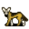

# { .sprite } Golden jackal

| Stat | Value |
|---|---|
| Class | animal |
| HP | 345 |
| Max AP | 10 |
| Attack cost | 3 |
| Move cost | 3 |
| Damage | 8 to 16 |
| Attack chance | 175 |
| Block chance | 100 |
| Damage resistance | 0 |
| Critical skill | 30 |
| Critical multiplier | 2.0 |

## On hit

- **On target:** Bleeding wound (magnitude 3, 3 rounds, 15% chance)

## Drops

| Item | Chance | Qty |
|---|---|---|
| [Golden jackal fur](../items/golden_jackal_fur.md) | 100% | 1 |
| [Meat](../items/meat.md) | 100% | 3 to 5 |
| [Bone](../items/bone.md) | 100% | 1 |
| [Pig's bone](../items/pig_bone.md) | 100% | 2 to 5 |

## Found on

- [sullengard_west_ravine](../maps/sullengard_west_ravine.md)
- [sullengard_woods12](../maps/sullengard_woods12.md)
- [sullengard_woods4](../maps/sullengard_woods4.md)
- [sullengard_woods_gj1](../maps/sullengard_woods_gj1.md)

<small>Monster ID: `golden_jackal` · Data from v0.8.18</small>
