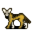

# { .sprite } Golden jackal

**Found in:** [sullengard_west_ravine](../maps/sullengard_west_ravine.md), [sullengard_woods12](../maps/sullengard_woods12.md), [sullengard_woods4](../maps/sullengard_woods4.md), [sullengard_woods_gj1](../maps/sullengard_woods_gj1.md)

<div class="infobox" markdown>

<p class="ib-img">{ .sprite }</p>

| | |
|---|---|
| **Type** | Enemy (hostile on sight) |
| **Found in** | sullengard_west_ravine, sullengard_woods12, sullengard_woods4 |
| **Class** | Animal |
| **HP** | 345 |
| **XP when defeated** | 745 |
| **Entry ID** | `golden_jackal` |
| **Introduced** | [v0.8.2](../versions/0.8.2.md) |

</div>

## Combat statistics

| Statistic | Value |
|---|---|
| Class | Animal |
| HP | 345 |
| XP when defeated | 745 |
| Damage | 8 to 16 |
| Attack chance | 175 |
| Block chance | 100 |
| Damage resistance | 0 |
| Max AP | 10 |
| Attack cost | 3 AP |
| Attacks per turn | 3 |
| Move cost | 3 AP |
| Critical skill | 30 |
| Critical multiplier | 2.0 |
| Critical hit chance | 19% |

**On hit:** On target: Bleeding wound (magnitude 3, 3 rounds, 15% chance)


<p class="verified">Verified against v0.8.18 monster data and game code (`MonsterTypeParser.java`).</p>

## Drops

| Item | Chance | Qty |
|---|---|---|
| [Golden jackal fur](../items/golden_jackal_fur.md) | 100% | 1 |
| [Meat](../items/meat.md) | 100% | 3 to 5 |
| [Bone](../items/bone.md) | 100% | 1 |
| [Pig's bone](../items/pig_bone.md) | 100% | 2 to 5 |

## Locations

| Map | Region | Up to | Notes |
|---|---|---|---|
| [sullengard_west_ravine](../maps/sullengard_west_ravine.md) | – | 1 | Appears later, during a quest |
| [sullengard_woods12](../maps/sullengard_woods12.md) | – | 1 | Appears later, during a quest |
| [sullengard_woods4](../maps/sullengard_woods4.md) | – | 1 | Appears later, during a quest |
| [sullengard_woods_gj1](../maps/sullengard_woods_gj1.md) | – | 1 | Appears later, during a quest |

## Quests that count defeats

- [Hunting the hunter](../quests/deebo_orchard_hth.md#stage-40) with stepping on a trigger on [sullengard_west_ravine](../maps/sullengard_west_ravine.md), stepping on a trigger on [sullengard_woods12](../maps/sullengard_woods12.md) checks that this enemy has been defeated.


## Version history

| Version | Change |
|---|---|
| [v0.8.2](../versions/0.8.2.md) | Added |

<p class="verified">Verified against v0.8.18 and every earlier release back to v0.7.0 (game data compared release by release).</p>


??? info "Technical information"

    | | |
    |---|---|
    | Entry ID | `golden_jackal` |
    | Spawn group | `golden_jackal` |
    | Loot table | `sullengard_gj_drop` |
    | Conversation | – |
    | Faction | – |
    | Movement | protectSpawn |
    | Icon | `monsters_rltiles4:2` |
    | Defined in | `res/raw/monsterlist_sullengard.json` |

    Raw data:

    ```json
    {
     "id": "golden_jackal",
     "name": "Golden jackal",
     "iconID": "monsters_rltiles4:2",
     "maxHP": 345,
     "moveCost": 3,
     "unique": 1,
     "monsterClass": "animal",
     "movementAggressionType": "protectSpawn",
     "attackDamage": {
      "min": 8,
      "max": 16
     },
     "spawnGroup": "golden_jackal",
     "droplistID": "sullengard_gj_drop",
     "attackCost": 3,
     "attackChance": 175,
     "criticalSkill": 30,
     "criticalMultiplier": 2.0,
     "blockChance": 100,
     "hitEffect": {
      "conditionsTarget": [
       {
        "condition": "bleeding_wound",
        "magnitude": 3,
        "duration": 3,
        "chance": "15"
       }
      ]
     }
    }
    ```


??? info "How the XP value is calculated"

    The game computes each enemy's experience value when it loads the data (`MonsterTypeParser.java`):

    XP = ⌈(attacks per turn × attack chance × average damage × (1 + critical skill × critical multiplier) × 3 + HP × (1 + block chance) + 9 × damage resistance) × 0.7⌉

    Percentages are used as fractions (e.g. 60% = 0.6). Enemies whose attacks inflict a condition are worth 50 XP more. The More Exp skill adds a percentage on top.


## Community notes

<small>Written by players, not generated from game data. **Observations**: what players notice in-game · **Lore**: the in-world story · **Trivia**: real-world facts, references, development history · **Theory / speculation**: unconfirmed ideas; may just be unfinished content</small>

### Observations

*No notes yet. Contributions are welcome: [add a note](https://github.com/asdfghjkl628/Andor-s-Trail-Wikiiii/new/main/notes/monsters?filename=golden_jackal.md&value=%23%23%20Observations%0A%0A%3C%21--%20what%20players%20notice%20in-game%20--%3E%0A%0A%23%23%20Lore%0A%0A%3C%21--%20the%20in-world%20story%20--%3E%0A%0A%23%23%20Trivia%0A%0A%3C%21--%20real-world%20facts%2C%20references%2C%20development%20history%20--%3E%0A%0A%23%23%20Theory%20/%20speculation%0A%0A%3C%21--%20unconfirmed%20ideas%3B%20may%20just%20be%20unfinished%20content%20--%3E%0A).*

### Lore

*No notes yet. Contributions are welcome: [add a note](https://github.com/asdfghjkl628/Andor-s-Trail-Wikiiii/new/main/notes/monsters?filename=golden_jackal.md&value=%23%23%20Observations%0A%0A%3C%21--%20what%20players%20notice%20in-game%20--%3E%0A%0A%23%23%20Lore%0A%0A%3C%21--%20the%20in-world%20story%20--%3E%0A%0A%23%23%20Trivia%0A%0A%3C%21--%20real-world%20facts%2C%20references%2C%20development%20history%20--%3E%0A%0A%23%23%20Theory%20/%20speculation%0A%0A%3C%21--%20unconfirmed%20ideas%3B%20may%20just%20be%20unfinished%20content%20--%3E%0A).*

### Trivia

*No notes yet. Contributions are welcome: [add a note](https://github.com/asdfghjkl628/Andor-s-Trail-Wikiiii/new/main/notes/monsters?filename=golden_jackal.md&value=%23%23%20Observations%0A%0A%3C%21--%20what%20players%20notice%20in-game%20--%3E%0A%0A%23%23%20Lore%0A%0A%3C%21--%20the%20in-world%20story%20--%3E%0A%0A%23%23%20Trivia%0A%0A%3C%21--%20real-world%20facts%2C%20references%2C%20development%20history%20--%3E%0A%0A%23%23%20Theory%20/%20speculation%0A%0A%3C%21--%20unconfirmed%20ideas%3B%20may%20just%20be%20unfinished%20content%20--%3E%0A).*

### Theory / speculation

*No notes yet. Contributions are welcome: [add a note](https://github.com/asdfghjkl628/Andor-s-Trail-Wikiiii/new/main/notes/monsters?filename=golden_jackal.md&value=%23%23%20Observations%0A%0A%3C%21--%20what%20players%20notice%20in-game%20--%3E%0A%0A%23%23%20Lore%0A%0A%3C%21--%20the%20in-world%20story%20--%3E%0A%0A%23%23%20Trivia%0A%0A%3C%21--%20real-world%20facts%2C%20references%2C%20development%20history%20--%3E%0A%0A%23%23%20Theory%20/%20speculation%0A%0A%3C%21--%20unconfirmed%20ideas%3B%20may%20just%20be%20unfinished%20content%20--%3E%0A).*


<small>Data from v0.8.18</small>
