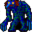

# { .sprite } Azurite Gornaud

**Found in:** [Arulircave 1](../maps/arulircave1.md), [Arulircave 2](../maps/arulircave2.md), [Arulircave 6](../maps/arulircave6.md), [Arulirmountain 1](../maps/arulirmountain1.md) (+1 more)

<div class="infobox" markdown>

<p class="ib-img"></p>

| | |
|---|---|
| **Type** | Enemy (hostile on sight) |
| **Found in** | Arulircave 1, Arulircave 2, Arulircave 6 |
| **Class** | Giant |
| **HP** | 390 |
| **XP when defeated** | 541 |
| **Introduced** | [v0.7.8](../versions/0.7.8.md) |

</div>

## Combat

| | |
|---|---|
| Class | Giant |
| HP | 390 |
| XP when defeated | 541 |
| Damage | 7 to 23 |
| AC | 120 |
| BC | 45 |
| DR | 9 |
| Attacks per turn | 1 (5 AP each, 5 AP) |
| Crit chance | none |

**Its hits:** On target: [Dazed](../conditions/dazed.md) (magnitude 1, 3 rounds, 25% chance)


<p class="verified">Verified against v0.8.18 monster data.</p>

## Drops

| Item | Chance | Qty |
|---|---|---|
| [Gold coins](../items/gold.md) | 70% | 5 to 80 |
| [Animal hair](../items/hair.md) | 10% | 1 |
| [Blue Crystals](../items/crystal_blue.md) | 5% | 1 |
| [Red Crystals](../items/crystal_red.md) | 5% | 1 |
| [Meat](../items/meat.md) | 5% | 1 to 2 |
| [Hunter's Sword](../items/hunters_sword.md) | 0.01% | 1 |

## Locations

| Map | Region | Up to | Notes |
|---|---|---|---|
| [Arulircave 1](../maps/arulircave1.md) | – | 2 | – |
| [Arulircave 2](../maps/arulircave2.md) | – | 1 | – |
| [Arulircave 6](../maps/arulircave6.md) | – | 3 | – |
| [Arulirmountain 1](../maps/arulirmountain1.md) | – | 1 | – |
| [Arulirmountain 2](../maps/arulirmountain2.md) | – | 1 | – |


## Version history

| Version | Change |
|---|---|
| [v0.7.8](../versions/0.7.8.md) | Added |

<p class="verified">Verified against v0.8.18 and every earlier release back to v0.7.0 (game data compared release by release).</p>


## Behind the scenes

*How the game data handles this character. Not needed for playing.*

??? info "How the XP value is calculated"

    The game computes each enemy's experience value when it loads the data (`MonsterTypeParser.java`):

    XP = ⌈(attacks per turn × attack chance × average damage × (1 + critical skill × critical multiplier) × 3 + HP × (1 + block chance) + 9 × damage resistance) × 0.7⌉

    Percentages are used as fractions (e.g. 60% = 0.6). Enemies whose attacks inflict a condition are worth 50 XP more. The More Exp skill adds a percentage on top.

??? info "Technical information"

    | | |
    |---|---|
    | Entry ID | `gornaud_4` |
    | Type (wiki) | Enemy |
    | Spawn group | `gornaud_4` |
    | Loot table | `arulir_gornaud` |
    | Conversation | – |
    | Faction | – |
    | Movement | – |
    | Icon | `monsters_rltiles2:28` |
    | Defined in | `res/raw/monsterlist_arulir_mountain.json` |

    Raw data:

    ```json
    {
     "id": "gornaud_4",
     "name": "Azurite Gornaud",
     "iconID": "monsters_rltiles2:28",
     "maxHP": 390,
     "maxAP": 5,
     "moveCost": 5,
     "monsterClass": "giant",
     "attackDamage": {
      "min": 7,
      "max": 23
     },
     "spawnGroup": "gornaud_4",
     "droplistID": "arulir_gornaud",
     "attackCost": 5,
     "attackChance": 120,
     "blockChance": 45,
     "damageResistance": 9,
     "hitEffect": {
      "conditionsTarget": [
       {
        "condition": "dazed",
        "magnitude": 1,
        "duration": 3,
        "chance": "25"
       }
      ]
     }
    }
    ```


## Community notes

<small>Written by players, not generated from game data. **Observations**: what players notice in-game · **Lore**: the in-world story · **Trivia**: real-world facts, references, development history · **Theory / speculation**: unconfirmed ideas; may just be unfinished content</small>

### Observations

*No notes yet. Contributions are welcome: [add a note](https://github.com/asdfghjkl628/Andor-s-Trail-Wikiiii/new/main/notes/monsters?filename=gornaud_4.md&value=%23%23%20Observations%0A%0A%3C%21--%20what%20players%20notice%20in-game%20--%3E%0A%0A%23%23%20Lore%0A%0A%3C%21--%20the%20in-world%20story%20--%3E%0A%0A%23%23%20Trivia%0A%0A%3C%21--%20real-world%20facts%2C%20references%2C%20development%20history%20--%3E%0A%0A%23%23%20Theory%20/%20speculation%0A%0A%3C%21--%20unconfirmed%20ideas%3B%20may%20just%20be%20unfinished%20content%20--%3E%0A).*

### Lore

*No notes yet. Contributions are welcome: [add a note](https://github.com/asdfghjkl628/Andor-s-Trail-Wikiiii/new/main/notes/monsters?filename=gornaud_4.md&value=%23%23%20Observations%0A%0A%3C%21--%20what%20players%20notice%20in-game%20--%3E%0A%0A%23%23%20Lore%0A%0A%3C%21--%20the%20in-world%20story%20--%3E%0A%0A%23%23%20Trivia%0A%0A%3C%21--%20real-world%20facts%2C%20references%2C%20development%20history%20--%3E%0A%0A%23%23%20Theory%20/%20speculation%0A%0A%3C%21--%20unconfirmed%20ideas%3B%20may%20just%20be%20unfinished%20content%20--%3E%0A).*

### Trivia

*No notes yet. Contributions are welcome: [add a note](https://github.com/asdfghjkl628/Andor-s-Trail-Wikiiii/new/main/notes/monsters?filename=gornaud_4.md&value=%23%23%20Observations%0A%0A%3C%21--%20what%20players%20notice%20in-game%20--%3E%0A%0A%23%23%20Lore%0A%0A%3C%21--%20the%20in-world%20story%20--%3E%0A%0A%23%23%20Trivia%0A%0A%3C%21--%20real-world%20facts%2C%20references%2C%20development%20history%20--%3E%0A%0A%23%23%20Theory%20/%20speculation%0A%0A%3C%21--%20unconfirmed%20ideas%3B%20may%20just%20be%20unfinished%20content%20--%3E%0A).*

### Theory / speculation

*No notes yet. Contributions are welcome: [add a note](https://github.com/asdfghjkl628/Andor-s-Trail-Wikiiii/new/main/notes/monsters?filename=gornaud_4.md&value=%23%23%20Observations%0A%0A%3C%21--%20what%20players%20notice%20in-game%20--%3E%0A%0A%23%23%20Lore%0A%0A%3C%21--%20the%20in-world%20story%20--%3E%0A%0A%23%23%20Trivia%0A%0A%3C%21--%20real-world%20facts%2C%20references%2C%20development%20history%20--%3E%0A%0A%23%23%20Theory%20/%20speculation%0A%0A%3C%21--%20unconfirmed%20ideas%3B%20may%20just%20be%20unfinished%20content%20--%3E%0A).*


<small>Data from v0.8.18</small>
