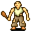

# { .sprite } Graverobber

| Stat | Value |
|---|---|
| Class | humanoid |
| HP | 62 |
| Max AP | 10 |
| Attack cost | 5 |
| Move cost | 5 |
| Damage | 2 to 6 |
| Attack chance | 120 |
| Block chance | 72 |
| Damage resistance | 1 |
| Critical skill | 0 |
| Critical multiplier | 0 |

## Drops

| Item | Chance | Qty |
|---|---|---|
| [Gold coins](../items/gold.md) | 100% | 10 to 50 |
| [Ruby gem](../items/gem2.md) | 100% | 1 |
| [Polished ring](../items/ring2.md) | 100% | 1 |
| [Leather gloves](../items/gloves1.md) | 100% | 1 |
| [Bjorgur's family dagger](../items/bjorgur_dagger.md) | 100% | 1 |

## Found on

- [blackwater_mountain35](../maps/blackwater_mountain35.md)

<small>Monster ID: `graverobber` · Data from v0.8.18</small>
