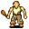

# { .sprite } Graverobber

**Where to find Graverobber:** [blackwater_mountain35](../maps/blackwater_mountain35.md#pin-npc-graverobber)

<div class="infobox" markdown>

<p class="ib-img">{ .sprite }</p>

| | |
|---|---|
| **Type** | NPC/Enemy (can be spoken to, but can also be fought) |
| **Found in** | blackwater_mountain35 |
| **Class** | Humanoid |
| **HP** | 62 |
| **XP when defeated** | 102 |
| **Entry ID** | `graverobber` |
| **Introduced** | v0.7.0 or earlier |

</div>

!!! warning "Can be fought"
    This entry can be talked to, but it can also become an opponent: a conversation with this character can end in combat (a dialogue branch leads to a fight).

## Combat statistics

| Statistic | Value |
|---|---|
| Class | Humanoid |
| HP | 62 |
| XP when defeated | 102 |
| Damage | 2 to 6 |
| Attack chance | 120 |
| Block chance | 72 |
| Damage resistance | 1 |
| Max AP | 10 |
| Attack cost | 5 AP |
| Attacks per turn | 2 |
| Move cost | 5 AP |
| Critical skill | 0 |
| Critical multiplier | – |
| Critical hit chance | None (requires both critical skill and a critical multiplier) |


<p class="verified">Verified against v0.8.18 monster data and game code (`MonsterTypeParser.java`).</p>

## Drops

| Item | Chance | Qty |
|---|---|---|
| [Gold coins](../items/gold.md) | 100% | 10 to 50 |
| [Ruby gem](../items/gem2.md) | 100% | 1 |
| [Polished ring](../items/ring2.md) | 100% | 1 |
| [Leather gloves](../items/gloves1.md) | 100% | 1 |
| [Bjorgur's family dagger](../items/bjorgur_dagger.md) | 100% | 1 |

## Locations

| Map | Region | Up to | Notes |
|---|---|---|---|
| [blackwater_mountain35](../maps/blackwater_mountain35.md) | – | 1 | – |

## Quests

- [Awoken from slumber](../quests/bjorgur_grave.md): stage 30

## Dialogue simulator

Set the quest stages, items and other conditions that apply to your game, then start the conversation with Graverobber. The simulator applies the game's own rules: it performs the same silent checks, offers only the options that would be shown in the game, and applies their effects (quest stages, items handed over, rewards) as the conversation proceeds.

<div class="dlg-sim" data-src="../../assets/dialogue/bjorgur_bandit.json" data-npc="Graverobber" markdown="0"><noscript>The simulator needs JavaScript. The full dialogue is listed below.</noscript></div>

<p class="verified">Rules verified against v0.8.18 game code (ConversationController.java) and dialogue data.</p>

??? quote "Dialogue (1 lines)"

    *What the dialogue says, exactly as in the game files. Lines are listed once; links jump to the line a choice leads to.*

    <span id="d-bjorgur_bandit"></span>**`bjorgur_bandit`** Graverobber: “Hey you! You shouldn't be here. This dagger is mine. Get out!” — **effects:** sets stage 30 of [Awoken from slumber](../quests/bjorgur_grave.md#stage-30)

    - “Fine. I will leave.” → *conversation ends*
    - “Hey, that's a nice looking dagger you have there.” → *fight starts*


## Version history

| Version | Change |
|---|---|
| [v0.7.0](../versions/0.7.0.md) | Present in v0.7.0 (earliest release tracked) |

<p class="verified">Verified against v0.8.18 and every earlier release back to v0.7.0 (game data compared release by release).</p>


??? info "Technical information"

    | | |
    |---|---|
    | Entry ID | `graverobber` |
    | Spawn group | `bjorgur_bandit` |
    | Loot table | `bjorgur_bandit` |
    | Conversation | `bjorgur_bandit` |
    | Faction | – |
    | Movement | – |
    | Icon | `monsters_karvis2:3` |
    | Defined in | `res/raw/monsterlist_v069_monsters.json` |

    Raw data:

    ```json
    {
     "id": "graverobber",
     "name": "Graverobber",
     "iconID": "monsters_karvis2:3",
     "maxHP": 62,
     "maxAP": 10,
     "moveCost": 5,
     "unique": 1,
     "monsterClass": "humanoid",
     "attackDamage": {
      "min": 2,
      "max": 6
     },
     "spawnGroup": "bjorgur_bandit",
     "phraseID": "bjorgur_bandit",
     "droplistID": "bjorgur_bandit",
     "attackCost": 5,
     "attackChance": 120,
     "blockChance": 72,
     "damageResistance": 1
    }
    ```


??? info "How the XP value is calculated"

    The game computes each enemy's experience value when it loads the data (`MonsterTypeParser.java`):

    XP = ⌈(attacks per turn × attack chance × average damage × (1 + critical skill × critical multiplier) × 3 + HP × (1 + block chance) + 9 × damage resistance) × 0.7⌉

    Percentages are used as fractions (e.g. 60% = 0.6). Enemies whose attacks inflict a condition are worth 50 XP more. The More Exp skill adds a percentage on top.


## Community notes

<small>Written by players, not generated from game data. **Observations**: what players notice in-game · **Lore**: the in-world story · **Trivia**: real-world facts, references, development history · **Theory / speculation**: unconfirmed ideas; may just be unfinished content</small>

### Observations

*No notes yet. Contributions are welcome: [add a note](https://github.com/asdfghjkl628/Andor-s-Trail-Wikiiii/new/main/notes/monsters?filename=graverobber.md&value=%23%23%20Observations%0A%0A%3C%21--%20what%20players%20notice%20in-game%20--%3E%0A%0A%23%23%20Lore%0A%0A%3C%21--%20the%20in-world%20story%20--%3E%0A%0A%23%23%20Trivia%0A%0A%3C%21--%20real-world%20facts%2C%20references%2C%20development%20history%20--%3E%0A%0A%23%23%20Theory%20/%20speculation%0A%0A%3C%21--%20unconfirmed%20ideas%3B%20may%20just%20be%20unfinished%20content%20--%3E%0A).*

### Lore

*No notes yet. Contributions are welcome: [add a note](https://github.com/asdfghjkl628/Andor-s-Trail-Wikiiii/new/main/notes/monsters?filename=graverobber.md&value=%23%23%20Observations%0A%0A%3C%21--%20what%20players%20notice%20in-game%20--%3E%0A%0A%23%23%20Lore%0A%0A%3C%21--%20the%20in-world%20story%20--%3E%0A%0A%23%23%20Trivia%0A%0A%3C%21--%20real-world%20facts%2C%20references%2C%20development%20history%20--%3E%0A%0A%23%23%20Theory%20/%20speculation%0A%0A%3C%21--%20unconfirmed%20ideas%3B%20may%20just%20be%20unfinished%20content%20--%3E%0A).*

### Trivia

*No notes yet. Contributions are welcome: [add a note](https://github.com/asdfghjkl628/Andor-s-Trail-Wikiiii/new/main/notes/monsters?filename=graverobber.md&value=%23%23%20Observations%0A%0A%3C%21--%20what%20players%20notice%20in-game%20--%3E%0A%0A%23%23%20Lore%0A%0A%3C%21--%20the%20in-world%20story%20--%3E%0A%0A%23%23%20Trivia%0A%0A%3C%21--%20real-world%20facts%2C%20references%2C%20development%20history%20--%3E%0A%0A%23%23%20Theory%20/%20speculation%0A%0A%3C%21--%20unconfirmed%20ideas%3B%20may%20just%20be%20unfinished%20content%20--%3E%0A).*

### Theory / speculation

*No notes yet. Contributions are welcome: [add a note](https://github.com/asdfghjkl628/Andor-s-Trail-Wikiiii/new/main/notes/monsters?filename=graverobber.md&value=%23%23%20Observations%0A%0A%3C%21--%20what%20players%20notice%20in-game%20--%3E%0A%0A%23%23%20Lore%0A%0A%3C%21--%20the%20in-world%20story%20--%3E%0A%0A%23%23%20Trivia%0A%0A%3C%21--%20real-world%20facts%2C%20references%2C%20development%20history%20--%3E%0A%0A%23%23%20Theory%20/%20speculation%0A%0A%3C%21--%20unconfirmed%20ideas%3B%20may%20just%20be%20unfinished%20content%20--%3E%0A).*


<small>Data from v0.8.18</small>
