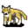

# { .sprite } Wild dog

<div class="infobox" markdown>

<p class="ib-img">{ .sprite }</p>

| | |
|---|---|
| **Type** | Enemy (hostile on sight) |
| **Found in** | Guynmart Castle |
| **Class** | Animal |
| **HP** | 40 |
| **XP when defeated** | 65–69 |
| **Entries in game data** | 2 |
| **Introduced** | [v0.7.2](../versions/0.7.2.md) |

</div>

!!! info "2 entries in the game data"
    The game data defines 2 separate characters named Wild dog. The game makes a new entry whenever a character needs different behaviour (another conversation later in a quest, another location, other stats). Some are the same person at different story points; others just share a generic name. Here the entries differ in: combat statistics. Each entry has its own section below.

| Entry | Type | Location | Role | HP |
|---|---|---|---|---|
| [`guynmart_dog2a`](#v-guynmart_dog2a) | Enemy | Guynmart Castle: [Guynmart wood 2](../maps/guynmart_wood_2.md) | – | 40 |
| [`guynmart_dog3a`](#v-guynmart_dog3a) | Enemy | Guynmart Castle: [Guynmart wood 2](../maps/guynmart_wood_2.md) | – | 40 |

## Guynmart Castle, Guynmart wood 2 (guynmart_dog2a) { #v-guynmart_dog2a }

**Entry ID:** `guynmart_dog2a` · **Type:** Enemy

**Location:** Guynmart Castle: [Guynmart wood 2](../maps/guynmart_wood_2.md)

### Combat statistics

| Statistic | Value |
|---|---|
| Class | Animal |
| HP | 40 |
| XP when defeated | 69 |
| Damage | 5 to 9 |
| Attack chance | 110 |
| Block chance | 30 |
| Damage resistance | 0 |
| Max AP | 10 |
| Attack cost | 5 AP |
| Attacks per turn | 2 |
| Move cost | 5 AP |
| Critical skill | 0 |
| Critical multiplier | – |
| Critical hit chance | None (requires both critical skill and a critical multiplier) |


<p class="verified">Verified against v0.8.18 monster data and game code (`MonsterTypeParser.java`).</p>

### Drops

| Item | Chance | Qty |
|---|---|---|
| [Gold coins](../items/gold.md) | 70% | 3 to 6 |
| [Glass gem](../items/gem1.md) | 5% | 1 |
| [Meat](../items/meat.md) | 30% | 1 |

### Locations

| Map | Region | Up to | Notes |
|---|---|---|---|
| [Guynmart wood 2](../maps/guynmart_wood_2.md) | Guynmart Castle | 9 | Appears later, during a quest |


### Version history

| Version | Change |
|---|---|
| [v0.7.2](../versions/0.7.2.md) | Added |

<p class="verified">Verified against v0.8.18 and every earlier release back to v0.7.0 (game data compared release by release).</p>


??? info "Technical information (guynmart_dog2a)"

    | | |
    |---|---|
    | Entry ID | `guynmart_dog2a` |
    | Spawn group | `guynmart_dog2a` |
    | Loot table | `canine` |
    | Conversation | – |
    | Faction | – |
    | Movement | wholeMap |
    | Icon | `monsters_dogs:3` |
    | Defined in | `res/raw/monsterlist_guynmart.json` |

    Raw data:

    ```json
    {
     "id": "guynmart_dog2a",
     "name": "Wild dog",
     "iconID": "monsters_dogs:3",
     "maxHP": 40,
     "maxAP": 10,
     "moveCost": 5,
     "unique": 1,
     "monsterClass": "animal",
     "movementAggressionType": "wholeMap",
     "attackDamage": {
      "min": 5,
      "max": 9
     },
     "droplistID": "canine",
     "attackCost": 5,
     "attackChance": 110,
     "blockChance": 30
    }
    ```


## Guynmart Castle, Guynmart wood 2 (guynmart_dog3a) { #v-guynmart_dog3a }

**Entry ID:** `guynmart_dog3a` · **Type:** Enemy

**Location:** Guynmart Castle: [Guynmart wood 2](../maps/guynmart_wood_2.md)

### Combat statistics

| Statistic | Value |
|---|---|
| Class | Animal |
| HP | 40 |
| XP when defeated | 65 |
| Damage | 3 to 9 |
| Attack chance | 110 |
| Block chance | 30 |
| Damage resistance | 0 |
| Max AP | 10 |
| Attack cost | 5 AP |
| Attacks per turn | 2 |
| Move cost | 5 AP |
| Critical skill | 0 |
| Critical multiplier | – |
| Critical hit chance | None (requires both critical skill and a critical multiplier) |


<p class="verified">Verified against v0.8.18 monster data and game code (`MonsterTypeParser.java`).</p>

### Drops

| Item | Chance | Qty |
|---|---|---|
| [Gold coins](../items/gold.md) | 70% | 3 to 6 |
| [Glass gem](../items/gem1.md) | 5% | 1 |
| [Meat](../items/meat.md) | 30% | 1 |

### Locations

| Map | Region | Up to | Notes |
|---|---|---|---|
| [Guynmart wood 2](../maps/guynmart_wood_2.md) | Guynmart Castle | 5 | Appears later, during a quest |


### Version history

| Version | Change |
|---|---|
| [v0.7.2](../versions/0.7.2.md) | Added |

<p class="verified">Verified against v0.8.18 and every earlier release back to v0.7.0 (game data compared release by release).</p>


??? info "Technical information (guynmart_dog3a)"

    | | |
    |---|---|
    | Entry ID | `guynmart_dog3a` |
    | Spawn group | `guynmart_dog3a` |
    | Loot table | `canine` |
    | Conversation | – |
    | Faction | – |
    | Movement | wholeMap |
    | Icon | `monsters_dogs:3` |
    | Defined in | `res/raw/monsterlist_guynmart.json` |

    Raw data:

    ```json
    {
     "id": "guynmart_dog3a",
     "name": "Wild dog",
     "iconID": "monsters_dogs:3",
     "maxHP": 40,
     "maxAP": 10,
     "moveCost": 5,
     "unique": 1,
     "monsterClass": "animal",
     "movementAggressionType": "wholeMap",
     "attackDamage": {
      "min": 3,
      "max": 9
     },
     "droplistID": "canine",
     "attackCost": 5,
     "attackChance": 110,
     "blockChance": 30
    }
    ```


??? info "How the XP value is calculated"

    The game computes each enemy's experience value when it loads the data (`MonsterTypeParser.java`):

    XP = ⌈(attacks per turn × attack chance × average damage × (1 + critical skill × critical multiplier) × 3 + HP × (1 + block chance) + 9 × damage resistance) × 0.7⌉

    Percentages are used as fractions (e.g. 60% = 0.6). Enemies whose attacks inflict a condition are worth 50 XP more. The More Exp skill adds a percentage on top.


## Community notes

<small>Written by players, not generated from game data. **Observations**: what players notice in-game · **Lore**: the in-world story · **Trivia**: real-world facts, references, development history · **Theory / speculation**: unconfirmed ideas; may just be unfinished content</small>

### Observations

*No notes yet. Contributions are welcome: [add a note](https://github.com/asdfghjkl628/Andor-s-Trail-Wikiiii/new/main/notes/monsters?filename=guynmart_dog2a.md&value=%23%23%20Observations%0A%0A%3C%21--%20what%20players%20notice%20in-game%20--%3E%0A%0A%23%23%20Lore%0A%0A%3C%21--%20the%20in-world%20story%20--%3E%0A%0A%23%23%20Trivia%0A%0A%3C%21--%20real-world%20facts%2C%20references%2C%20development%20history%20--%3E%0A%0A%23%23%20Theory%20/%20speculation%0A%0A%3C%21--%20unconfirmed%20ideas%3B%20may%20just%20be%20unfinished%20content%20--%3E%0A).*

### Lore

*No notes yet. Contributions are welcome: [add a note](https://github.com/asdfghjkl628/Andor-s-Trail-Wikiiii/new/main/notes/monsters?filename=guynmart_dog2a.md&value=%23%23%20Observations%0A%0A%3C%21--%20what%20players%20notice%20in-game%20--%3E%0A%0A%23%23%20Lore%0A%0A%3C%21--%20the%20in-world%20story%20--%3E%0A%0A%23%23%20Trivia%0A%0A%3C%21--%20real-world%20facts%2C%20references%2C%20development%20history%20--%3E%0A%0A%23%23%20Theory%20/%20speculation%0A%0A%3C%21--%20unconfirmed%20ideas%3B%20may%20just%20be%20unfinished%20content%20--%3E%0A).*

### Trivia

*No notes yet. Contributions are welcome: [add a note](https://github.com/asdfghjkl628/Andor-s-Trail-Wikiiii/new/main/notes/monsters?filename=guynmart_dog2a.md&value=%23%23%20Observations%0A%0A%3C%21--%20what%20players%20notice%20in-game%20--%3E%0A%0A%23%23%20Lore%0A%0A%3C%21--%20the%20in-world%20story%20--%3E%0A%0A%23%23%20Trivia%0A%0A%3C%21--%20real-world%20facts%2C%20references%2C%20development%20history%20--%3E%0A%0A%23%23%20Theory%20/%20speculation%0A%0A%3C%21--%20unconfirmed%20ideas%3B%20may%20just%20be%20unfinished%20content%20--%3E%0A).*

### Theory / speculation

*No notes yet. Contributions are welcome: [add a note](https://github.com/asdfghjkl628/Andor-s-Trail-Wikiiii/new/main/notes/monsters?filename=guynmart_dog2a.md&value=%23%23%20Observations%0A%0A%3C%21--%20what%20players%20notice%20in-game%20--%3E%0A%0A%23%23%20Lore%0A%0A%3C%21--%20the%20in-world%20story%20--%3E%0A%0A%23%23%20Trivia%0A%0A%3C%21--%20real-world%20facts%2C%20references%2C%20development%20history%20--%3E%0A%0A%23%23%20Theory%20/%20speculation%0A%0A%3C%21--%20unconfirmed%20ideas%3B%20may%20just%20be%20unfinished%20content%20--%3E%0A).*


<small>Data from v0.8.18</small>
