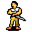

# { .sprite } Lovis

<div class="infobox" markdown>

<p class="ib-img">{ .sprite }</p>

| | |
|---|---|
| **Monster ID** | `guynmart_lovis2` |
| **Type** | NPC |
| **Class** | Humanoid |
| **HP** | 1 |
| **Found in** | Guynmart Castle |
| **Introduced** | [v0.7.2](../versions/0.7.2.md) |

</div>

## Combat stats

| Stat | Value |
|---|---|
| HP | 1 |
| Damage | 0 |
| Attack chance | 0 |
| Block chance | 0 |
| Damage resistance | 0 |
| Max AP | 10 |
| Attack cost | 10 AP |
| Attacks per turn | 1 |
| Move cost | 10 AP |
| Critical skill | 0 |
| Critical multiplier | – |
| Crit chance | none (needs critical skill and a multiplier) |

**XP formula** (from the game's loader): ⌈(attacks per turn × attack chance × average damage × (1 + critical skill × multiplier) × 3 + HP × (1 + block chance) + 9 × damage resistance) × 0.7⌉, +50 if its hits inflict a condition. More Exp adds a percentage on top.

<p class="verified">Verified against v0.8.18 monster data and game code (`MonsterTypeParser.java`).</p>


## Locations

| Map | Region | Up to | Notes |
|---|---|---|---|
| [guynmart_main_0](../maps/guynmart_main_0.md) | Guynmart Castle | 1 | appears later in a quest |
| [guynmart_main_1](../maps/guynmart_main_1.md) | Guynmart Castle | 1 | appears later in a quest |
| [guynmart_main_2](../maps/guynmart_main_2.md) | Guynmart Castle | 1 | appears later in a quest |


## Quests

- [Roses](../quests/guynmart.md): stages 190, 200, 210, 211
- [guynmart nondisplay (hidden flag)](../quests/guynmart_nondisplay.md): stages 33, 36

## Dialogue simulator

Set up your situation (quest stages, items, kills…), then talk to Lovis. The simulator follows the game's own rules: it takes the same silent checks, offers only the options you'd really see, and applies their effects (quest stages, items handed over, rewards) as you go.

<div class="dlg-sim" data-src="../../assets/dialogue/guynmart_lovis2_10.json" data-npc="Lovis" markdown="0"><noscript>The simulator needs JavaScript. The full dialogue is listed below.</noscript></div>

<p class="verified">Rules verified against v0.8.18 game code (ConversationController.java) and dialogue data.</p>

??? quote "Dialogue (58 lines)"

    *What the dialogue says, exactly as in the game files. Lines are listed once; links jump to the line a choice leads to.*

    <span id="d-guynmart_lovis2_10"></span>**`guynmart_lovis2_10`** *(silent check: the first matching branch below is taken)*

    - branch 1 *(if reached stage 210 of [Roses](../quests/guynmart.md#stage-210); reached stage 1 of [Ringmaker (hidden flag)](../quests/guynmart_quest_wizard.md#stage-1))* → [guynmart_lovis2_450](#d-guynmart_lovis2_450)
    - branch 2 *(if reached stage 210 of [Roses](../quests/guynmart.md#stage-210); NOT reached stage 200 of [Roses](../quests/guynmart.md#stage-200))* → [guynmart_lovis2_12](#d-guynmart_lovis2_12)
    - branch 3 *(if reached stage 210 of [Roses](../quests/guynmart.md#stage-210))* → [guynmart_lovis2_14](#d-guynmart_lovis2_14)
    - branch 4 *(if NOT reached stage 190 of [Roses](../quests/guynmart.md#stage-190))* → [guynmart_lovis2_20](#d-guynmart_lovis2_20)
    - branch 5 *(if reached stage 32 of [guynmart nondisplay (hidden flag)](../quests/guynmart_nondisplay.md#stage-32))* → [guynmart_lovis2_120](#d-guynmart_lovis2_120)
    - branch 6 → [guynmart_lovis2_30](#d-guynmart_lovis2_30)

    <span id="d-guynmart_lovis2_450"></span>**`guynmart_lovis2_450`** Lovis: “We have good news for you.”

    - Next → [guynmart_lovis2_452](#d-guynmart_lovis2_452)

    <span id="d-guynmart_lovis2_12"></span>**`guynmart_lovis2_12`** Lovis: “Hello $playername.”


    <span id="d-guynmart_lovis2_14"></span>**`guynmart_lovis2_14`** Lovis: “$playername - what a joy to see you again.”

    - “Oh yes, I'm happy too.” → *conversation ends*

    <span id="d-guynmart_lovis2_20"></span>**`guynmart_lovis2_20`** Lovis: “Welcome $playername - you helped us in our greatest needs. But let Lady Hannah speak first.”

    - Next → [guynmart_hannah2_30](#d-guynmart_hannah2_30)

    <span id="d-guynmart_lovis2_120"></span>**`guynmart_lovis2_120`** Lovis: “So you found something you like. Good.” — **effects:** spawns monsters on guynmart_main_1, removes monsters from guynmart_main_1

    - “Oh yes - I am overwhelmed by your generosity!” → [guynmart_lovis2_130](#d-guynmart_lovis2_130)

    <span id="d-guynmart_lovis2_30"></span>**`guynmart_lovis2_30`** [Lovis](../monsters/guynmart_lovis2.md): “We are deeply in your debt, indeed.”

    - Next → [guynmart_lovis2_40](#d-guynmart_lovis2_40)

    <span id="d-guynmart_lovis2_452"></span>**`guynmart_lovis2_452`** Lovis: “Rorthron, the ringmaker, was behaving rather strangely, and so we questioned him. It came to light that he seems to have damaged one of your rings.”

    - Next → [guynmart_lovis2_454](#d-guynmart_lovis2_454)

    <span id="d-guynmart_hannah2_30"></span>**`guynmart_hannah2_30`** [Hannah](../monsters/guynmart_hannah2.md): “Many things have happened. Norgothla came back and Unkorh flew, his men dead or scattered.”

    - Next → [guynmart_hannah2_32](#d-guynmart_hannah2_32)

    <span id="d-guynmart_lovis2_130"></span>**`guynmart_lovis2_130`** *(silent check: the first matching branch below is taken)* — **effects:** sets stage 36 of [guynmart nondisplay (hidden flag)](../quests/guynmart_nondisplay.md#stage-36)

    - branch 1 *(if reached stage 181 of [Roses](../quests/guynmart.md#stage-181))* → [guynmart_lovis2_141](#d-guynmart_lovis2_141)
    - branch 2 → [guynmart_lovis2_140](#d-guynmart_lovis2_140)

    <span id="d-guynmart_lovis2_40"></span>**`guynmart_lovis2_40`** *(silent check: the first matching branch below is taken)*

    - branch 1 *(if reached stage 1 of [Ringmaker (hidden flag)](../quests/guynmart_quest_wizard.md#stage-1))* → [guynmart_lovis2_50](#d-guynmart_lovis2_50)
    - branch 2 → [guynmart_lovis2_70](#d-guynmart_lovis2_70)

    <span id="d-guynmart_lovis2_454"></span>**`guynmart_lovis2_454`** Lovis: “He eventually admitted that he secretly exchanged your ring for a worthless ring.”

    - Next → [guynmart_lovis2_456](#d-guynmart_lovis2_456)

    <span id="d-guynmart_hannah2_32"></span>**`guynmart_hannah2_32`** [Hannah](../monsters/guynmart_hannah2.md): “We found Guynmart down in a cell, but it was too late - My beloved father died in my arms.”

    - Next → [guynmart_hannah2_34](#d-guynmart_hannah2_34)

    <span id="d-guynmart_lovis2_141"></span>**`guynmart_lovis2_141`** *(silent check: the first matching branch below is taken)* — **effects:** sets stage 211 of [Roses](../quests/guynmart.md#stage-211)

    - branch 1 → [guynmart_lovis2_151](#d-guynmart_lovis2_151)

    <span id="d-guynmart_lovis2_140"></span>**`guynmart_lovis2_140`** *(silent check: the first matching branch below is taken)* — **effects:** sets stage 210 of [Roses](../quests/guynmart.md#stage-210), spawns monsters on guynmart_wood_9

    - branch 1 → [guynmart_lovis2_150](#d-guynmart_lovis2_150)

    <span id="d-guynmart_lovis2_50"></span>**`guynmart_lovis2_50`** Lovis: “We also have good news for you.”

    - Next → [guynmart_lovis2_52](#d-guynmart_lovis2_52)

    <span id="d-guynmart_lovis2_70"></span>**`guynmart_lovis2_70`** *(silent check: the first matching branch below is taken)*

    - branch 1 *(if killed 1× [Sheep](../monsters/guynmart_sheep.md); NOT reached stage 33 of [guynmart nondisplay (hidden flag)](../quests/guynmart_nondisplay.md#stage-33))* → [guynmart_lovis2_200](#d-guynmart_lovis2_200)
    - branch 2 → [guynmart_lovis2_100](#d-guynmart_lovis2_100)

    <span id="d-guynmart_lovis2_456"></span>**`guynmart_lovis2_456`** Lovis: “He promised never to do such things again and handed the real ring over to us. We want to leave it at that.”

    - Next → [guynmart_lovis2_460](#d-guynmart_lovis2_460)

    <span id="d-guynmart_hannah2_34"></span>**`guynmart_hannah2_34`** [Hannah](../monsters/guynmart_hannah2.md): “And Lovis and I are finally married. In spite of the cruel events, or just to forget them a little, we celebrated a joyous feast.”

    - Next → [guynmart_hannah2_40](#d-guynmart_hannah2_40)

    <span id="d-guynmart_lovis2_151"></span>**`guynmart_lovis2_151`** Lovis: “At last we have to part. Farewell until we meet again! When you will find your brother, tell him that he is always welcome.”

    - “Goodbye.” → *conversation ends*

    <span id="d-guynmart_lovis2_150"></span>**`guynmart_lovis2_150`** Lovis: “We prepared a surprise for you. Go and look east of the castle near the sheep pasture. Farewell until we meet again!”

    - “Goodbye.” → *conversation ends*

    <span id="d-guynmart_lovis2_52"></span>**`guynmart_lovis2_52`** Lovis: “Rorthron, the ringmaker, was behaving rather strangely, and so we questioned him. It came to light that he seems to have damaged one of your rings.”

    - Next → [guynmart_lovis2_54](#d-guynmart_lovis2_54)

    <span id="d-guynmart_lovis2_200"></span>**`guynmart_lovis2_200`** Lovis: “Regrettably, we still have to sort out an unpleasant thing. Let our shepherd speak.” — **effects:** spawns monsters on guynmart_main_1

    - Next → [guynmart_lovis2_210](#d-guynmart_lovis2_210)

    <span id="d-guynmart_lovis2_100"></span>**`guynmart_lovis2_100`** Lovis: “You have earned your reward. Go now into our treasury.” — **effects:** sets stage 200 of [Roses](../quests/guynmart.md#stage-200), spawns monsters on guynmart_main_1, removes monsters from guynmart_main_1


    <span id="d-guynmart_lovis2_460"></span>**`guynmart_lovis2_460`** Lovis: “So here, take your precious ring back.” — **effects:** gives 1× [Ring of lesser Shadow](../items/ring_shadow0.md), clears stage 1 of [Ringmaker (hidden flag)](../quests/guynmart_quest_wizard.md#stage-1)

    - “Oh! I can't believe it! Is it really true?” → *conversation ends*

    <span id="d-guynmart_hannah2_40"></span>**`guynmart_hannah2_40`** [Hannah](../monsters/guynmart_hannah2.md): “If it wasn't for you, Guynmart castle would look different today: dark and gloomy and no place you would want to live.”

    - Next → [guynmart_hannah2_50](#d-guynmart_hannah2_50)

    <span id="d-guynmart_lovis2_54"></span>**`guynmart_lovis2_54`** Lovis: “He eventually admitted that he secretly exchanged your ring for a worthless ring.”

    - Next → [guynmart_lovis2_56](#d-guynmart_lovis2_56)

    <span id="d-guynmart_lovis2_210"></span>**`guynmart_lovis2_210`** [Shepherd](../monsters/guynmart_shephard2.md): “Grumble ... grumble...”

    - Next → [guynmart_lovis2_220](#d-guynmart_lovis2_220)

    <span id="d-guynmart_hannah2_50"></span>**`guynmart_hannah2_50`** Lovis: “Take this rose as a token of my deepest thanks. May its lovely fragrance last forever.” — **effects:** sets stage 190 of [Roses](../quests/guynmart.md#stage-190), gives 1× [Rose](../items/guynmart_rose.md)

    - “Thank you, Lady.” → [guynmart_hannah2_20](#d-guynmart_hannah2_20)

    <span id="d-guynmart_lovis2_56"></span>**`guynmart_lovis2_56`** Lovis: “He promised never to do such things again and handed the real ring over to us. We want to leave it at that.”

    - Next → [guynmart_lovis2_60](#d-guynmart_lovis2_60)

    <span id="d-guynmart_lovis2_220"></span>**`guynmart_lovis2_220`** *(silent check: the first matching branch below is taken)*

    - branch 1 *(if reached stage 181 of [Roses](../quests/guynmart.md#stage-181))* → [guynmart_lovis2_220b](#d-guynmart_lovis2_220b)
    - branch 2 → [guynmart_lovis2_220a](#d-guynmart_lovis2_220a)

    <span id="d-guynmart_hannah2_20"></span>**`guynmart_hannah2_20`** Lovis: “Now let us hear Lovis.”

    - Next → [guynmart_lovis2_30](#d-guynmart_lovis2_30)

    <span id="d-guynmart_lovis2_60"></span>**`guynmart_lovis2_60`** Lovis: “So here, take your precious ring back.” — **effects:** gives 1× [Ring of lesser Shadow](../items/ring_shadow0.md), clears stage 1 of [Ringmaker (hidden flag)](../quests/guynmart_quest_wizard.md#stage-1)

    - “Oh! I can't believe it! Is it really true?” → [guynmart_lovis2_70](#d-guynmart_lovis2_70)

    <span id="d-guynmart_lovis2_220b"></span>**`guynmart_lovis2_220b`** *(silent check: the first matching branch below is taken)*

    - branch 1 → [guynmart_lovis2_220c](#d-guynmart_lovis2_220c)

    <span id="d-guynmart_lovis2_220a"></span>**`guynmart_lovis2_220a`** *(silent check: the first matching branch below is taken)*

    - branch 1 → [guynmart_lovis2_220c](#d-guynmart_lovis2_220c)

    <span id="d-guynmart_lovis2_220c"></span>**`guynmart_lovis2_220c`** Lovis: “It seems sheep were killed by your hand. Our sheep, to be precise.”

    - Next → [guynmart_lovis2_221](#d-guynmart_lovis2_221)

    <span id="d-guynmart_lovis2_221"></span>**`guynmart_lovis2_221`** Lovis: “You will be fined 100 gold for each sheep you killed. Do you accept this judgment?”

    - “Yes, what I did was stupid.” → [guynmart_lovis2_300](#d-guynmart_lovis2_300)
    - “Lies! All lies!” → [guynmart_lovis2_222](#d-guynmart_lovis2_222)
    - “I can explain - it was an accident...” → [guynmart_lovis2_222](#d-guynmart_lovis2_222)

    <span id="d-guynmart_lovis2_300"></span>**`guynmart_lovis2_300`** *(silent check: the first matching branch below is taken)*

    - branch 1 *(if killed 25× [Sheep](../monsters/guynmart_sheep.md))* → [guynmart_lovis2_325](#d-guynmart_lovis2_325)
    - branch 2 *(if killed 20× [Sheep](../monsters/guynmart_sheep.md))* → [guynmart_lovis2_320](#d-guynmart_lovis2_320)
    - branch 3 *(if killed 15× [Sheep](../monsters/guynmart_sheep.md))* → [guynmart_lovis2_315](#d-guynmart_lovis2_315)
    - branch 4 *(if killed 10× [Sheep](../monsters/guynmart_sheep.md))* → [guynmart_lovis2_310](#d-guynmart_lovis2_310)
    - branch 5 *(if killed 9× [Sheep](../monsters/guynmart_sheep.md))* → [guynmart_lovis2_309](#d-guynmart_lovis2_309)
    - branch 6 *(if killed 8× [Sheep](../monsters/guynmart_sheep.md))* → [guynmart_lovis2_308](#d-guynmart_lovis2_308)
    - branch 7 *(if killed 7× [Sheep](../monsters/guynmart_sheep.md))* → [guynmart_lovis2_307](#d-guynmart_lovis2_307)
    - branch 8 *(if killed 6× [Sheep](../monsters/guynmart_sheep.md))* → [guynmart_lovis2_306](#d-guynmart_lovis2_306)
    - branch 9 *(if killed 5× [Sheep](../monsters/guynmart_sheep.md))* → [guynmart_lovis2_305](#d-guynmart_lovis2_305)
    - branch 10 *(if killed 4× [Sheep](../monsters/guynmart_sheep.md))* → [guynmart_lovis2_304](#d-guynmart_lovis2_304)
    - branch 11 *(if killed 3× [Sheep](../monsters/guynmart_sheep.md))* → [guynmart_lovis2_303](#d-guynmart_lovis2_303)
    - branch 12 *(if killed 2× [Sheep](../monsters/guynmart_sheep.md))* → [guynmart_lovis2_302](#d-guynmart_lovis2_302)
    - branch 13 *(if killed 1× [Sheep](../monsters/guynmart_sheep.md))* → [guynmart_lovis2_301](#d-guynmart_lovis2_301)

    <span id="d-guynmart_lovis2_222"></span>**`guynmart_lovis2_222`** *(silent check: the first matching branch below is taken)*

    - branch 1 *(if reached stage 181 of [Roses](../quests/guynmart.md#stage-181))* → [guynmart_lovis2_231](#d-guynmart_lovis2_231)
    - branch 2 → [guynmart_lovis2_230](#d-guynmart_lovis2_230)

    <span id="d-guynmart_lovis2_325"></span>**`guynmart_lovis2_325`** Lovis: “2,500 gold for 25 or perhaps even more killed sheep.”

    - “Here is the gold.” *(if pay 2,500 gold)* → [guynmart_lovis2_360](#d-guynmart_lovis2_360)
    - “I don't have enough gold.” → [guynmart_lovis2_350](#d-guynmart_lovis2_350)

    <span id="d-guynmart_lovis2_320"></span>**`guynmart_lovis2_320`** Lovis: “2,000 gold for 20 or perhaps even more killed sheep.”

    - “Here is the gold.” *(if pay 2,000 gold)* → [guynmart_lovis2_360](#d-guynmart_lovis2_360)
    - “I don't have enough gold.” → [guynmart_lovis2_350](#d-guynmart_lovis2_350)

    <span id="d-guynmart_lovis2_315"></span>**`guynmart_lovis2_315`** Lovis: “1,500 gold for 15 or perhaps even more killed sheep.”

    - “Here is the gold.” *(if pay 1,500 gold)* → [guynmart_lovis2_360](#d-guynmart_lovis2_360)
    - “I don't have enough gold.” → [guynmart_lovis2_350](#d-guynmart_lovis2_350)

    <span id="d-guynmart_lovis2_310"></span>**`guynmart_lovis2_310`** Lovis: “1,000 gold for 10 or perhaps even more killed sheep.”

    - “Here is the gold.” *(if pay 1,000 gold)* → [guynmart_lovis2_360](#d-guynmart_lovis2_360)
    - “I don't have enough gold.” → [guynmart_lovis2_350](#d-guynmart_lovis2_350)

    <span id="d-guynmart_lovis2_309"></span>**`guynmart_lovis2_309`** Lovis: “900 gold for 9 killed sheep.”

    - “Here is the gold.” *(if pay 900 gold)* → [guynmart_lovis2_360](#d-guynmart_lovis2_360)
    - “I don't have enough gold.” → [guynmart_lovis2_350](#d-guynmart_lovis2_350)

    <span id="d-guynmart_lovis2_308"></span>**`guynmart_lovis2_308`** Lovis: “800 gold for 8 killed sheep.”

    - “Here is the gold.” *(if pay 800 gold)* → [guynmart_lovis2_360](#d-guynmart_lovis2_360)
    - “I don't have enough gold.” → [guynmart_lovis2_350](#d-guynmart_lovis2_350)

    <span id="d-guynmart_lovis2_307"></span>**`guynmart_lovis2_307`** Lovis: “700 gold for 7 killed sheep.”

    - “Here is the gold.” *(if pay 700 gold)* → [guynmart_lovis2_360](#d-guynmart_lovis2_360)
    - “I don't have enough gold.” → [guynmart_lovis2_350](#d-guynmart_lovis2_350)

    <span id="d-guynmart_lovis2_306"></span>**`guynmart_lovis2_306`** Lovis: “600 gold for 6 killed sheep.”

    - “Here is the gold.” *(if pay 600 gold)* → [guynmart_lovis2_360](#d-guynmart_lovis2_360)
    - “I don't have enough gold.” → [guynmart_lovis2_350](#d-guynmart_lovis2_350)

    <span id="d-guynmart_lovis2_305"></span>**`guynmart_lovis2_305`** Lovis: “500 gold for 5 killed sheep.”

    - “Here is the gold.” *(if pay 500 gold)* → [guynmart_lovis2_360](#d-guynmart_lovis2_360)
    - “I don't have enough gold.” → [guynmart_lovis2_350](#d-guynmart_lovis2_350)

    <span id="d-guynmart_lovis2_304"></span>**`guynmart_lovis2_304`** Lovis: “400 gold for 4 killed sheep.”

    - “Here is the gold.” *(if pay 400 gold)* → [guynmart_lovis2_360](#d-guynmart_lovis2_360)
    - “I don't have enough gold.” → [guynmart_lovis2_350](#d-guynmart_lovis2_350)

    <span id="d-guynmart_lovis2_303"></span>**`guynmart_lovis2_303`** Lovis: “300 gold for 3 killed sheep.”

    - “Here is the gold.” *(if pay 300 gold)* → [guynmart_lovis2_360](#d-guynmart_lovis2_360)
    - “I don't have enough gold.” → [guynmart_lovis2_350](#d-guynmart_lovis2_350)

    <span id="d-guynmart_lovis2_302"></span>**`guynmart_lovis2_302`** Lovis: “200 gold for 2 killed sheep.”

    - “Here is the gold.” *(if pay 200 gold)* → [guynmart_lovis2_360](#d-guynmart_lovis2_360)
    - “I don't have enough gold.” → [guynmart_lovis2_350](#d-guynmart_lovis2_350)

    <span id="d-guynmart_lovis2_301"></span>**`guynmart_lovis2_301`** Lovis: “100 gold for the killed sheep.”

    - “Here is the gold.” *(if pay 100 gold)* → [guynmart_lovis2_360](#d-guynmart_lovis2_360)
    - “I don't have enough gold.” → [guynmart_lovis2_350](#d-guynmart_lovis2_350)

    <span id="d-guynmart_lovis2_231"></span>**`guynmart_lovis2_231`** Lovis: “As you wish. I am very disappointed with you - go now.”

    - “No, sorry, I didn't mean it.” → [guynmart_lovis2_220](#d-guynmart_lovis2_220)
    - “I will go. Bye.” → [guynmart_lovis2_241](#d-guynmart_lovis2_241)

    <span id="d-guynmart_lovis2_230"></span>**`guynmart_lovis2_230`** Lovis: “As you wish. I already regret that we prepared a surprise for you next to the sheep pastures. I am very disappointed in you. Go now.”

    - “No, sorry, I didn't mean it.” → [guynmart_lovis2_220](#d-guynmart_lovis2_220)
    - “I will go. Bye.” → [guynmart_lovis2_240](#d-guynmart_lovis2_240)

    <span id="d-guynmart_lovis2_360"></span>**`guynmart_lovis2_360`** Lovis: “[Gold taken] All the sheep you killed are paid for, so now we will forget the whole thing.” — **effects:** sets stage 33 of [guynmart nondisplay (hidden flag)](../quests/guynmart_nondisplay.md#stage-33), removes monsters from guynmart_main_1

    - “I am relieved.” → [guynmart_lovis2_100](#d-guynmart_lovis2_100)

    <span id="d-guynmart_lovis2_350"></span>**`guynmart_lovis2_350`** Lovis: “You will find a way to get the missing gold. Then come back and pay the rest.”

    - “OK.” → *conversation ends*

    <span id="d-guynmart_lovis2_241"></span>**`guynmart_lovis2_241`** *(silent check: the first matching branch below is taken)* — **effects:** sets stage 211 of [Roses](../quests/guynmart.md#stage-211), sets stage 36 of [guynmart nondisplay (hidden flag)](../quests/guynmart_nondisplay.md#stage-36), removes monsters from guynmart_main_1


    <span id="d-guynmart_lovis2_240"></span>**`guynmart_lovis2_240`** *(silent check: the first matching branch below is taken)* — **effects:** sets stage 210 of [Roses](../quests/guynmart.md#stage-210), sets stage 36 of [guynmart nondisplay (hidden flag)](../quests/guynmart_nondisplay.md#stage-36), removes monsters from guynmart_main_1, spawns monsters on guynmart_wood_9


## Version history

| Version | Change |
|---|---|
| [v0.7.2](../versions/0.7.2.md) | Added<br>Dialogue: 58 lines added |
| [v0.8.18](../versions/0.8.18.md) | Dialogue: 4 lines changed<br>· text: “2000 gold for 20 or perhaps even more killed sheep.” → “{2000} gold for 20 or perhaps even more killed sheep.”<br>· text: “1000 gold for 10 or perhaps even more killed sheep.” → “{1000} gold for 10 or perhaps even more killed sheep.” |

<p class="verified">Verified against v0.8.18 and every earlier release back to v0.7.0 (game data compared release by release).</p>


## Community notes

<small>Written by players, not generated from game data. **Observations**: what players notice in-game · **Lore**: the in-world story · **Trivia**: real-world facts, references, development history · **Theory / speculation**: unconfirmed ideas; may just be unfinished content</small>

### Observations

*Nothing here yet. Know something? [Add it](https://github.com/asdfghjkl628/Andor-s-Trail-Wikiiii/new/main/notes/monsters?filename=guynmart_lovis2.md&value=%23%23%20Observations%0A%0A%3C%21--%20what%20players%20notice%20in-game%20--%3E%0A%0A%23%23%20Lore%0A%0A%3C%21--%20the%20in-world%20story%20--%3E%0A%0A%23%23%20Trivia%0A%0A%3C%21--%20real-world%20facts%2C%20references%2C%20development%20history%20--%3E%0A%0A%23%23%20Theory%20/%20speculation%0A%0A%3C%21--%20unconfirmed%20ideas%3B%20may%20just%20be%20unfinished%20content%20--%3E%0A).*

### Lore

*Nothing here yet. Know something? [Add it](https://github.com/asdfghjkl628/Andor-s-Trail-Wikiiii/new/main/notes/monsters?filename=guynmart_lovis2.md&value=%23%23%20Observations%0A%0A%3C%21--%20what%20players%20notice%20in-game%20--%3E%0A%0A%23%23%20Lore%0A%0A%3C%21--%20the%20in-world%20story%20--%3E%0A%0A%23%23%20Trivia%0A%0A%3C%21--%20real-world%20facts%2C%20references%2C%20development%20history%20--%3E%0A%0A%23%23%20Theory%20/%20speculation%0A%0A%3C%21--%20unconfirmed%20ideas%3B%20may%20just%20be%20unfinished%20content%20--%3E%0A).*

### Trivia

*Nothing here yet. Know something? [Add it](https://github.com/asdfghjkl628/Andor-s-Trail-Wikiiii/new/main/notes/monsters?filename=guynmart_lovis2.md&value=%23%23%20Observations%0A%0A%3C%21--%20what%20players%20notice%20in-game%20--%3E%0A%0A%23%23%20Lore%0A%0A%3C%21--%20the%20in-world%20story%20--%3E%0A%0A%23%23%20Trivia%0A%0A%3C%21--%20real-world%20facts%2C%20references%2C%20development%20history%20--%3E%0A%0A%23%23%20Theory%20/%20speculation%0A%0A%3C%21--%20unconfirmed%20ideas%3B%20may%20just%20be%20unfinished%20content%20--%3E%0A).*

### Theory / speculation

*Nothing here yet. Know something? [Add it](https://github.com/asdfghjkl628/Andor-s-Trail-Wikiiii/new/main/notes/monsters?filename=guynmart_lovis2.md&value=%23%23%20Observations%0A%0A%3C%21--%20what%20players%20notice%20in-game%20--%3E%0A%0A%23%23%20Lore%0A%0A%3C%21--%20the%20in-world%20story%20--%3E%0A%0A%23%23%20Trivia%0A%0A%3C%21--%20real-world%20facts%2C%20references%2C%20development%20history%20--%3E%0A%0A%23%23%20Theory%20/%20speculation%0A%0A%3C%21--%20unconfirmed%20ideas%3B%20may%20just%20be%20unfinished%20content%20--%3E%0A).*


??? info "Technical information"

    | | |
    |---|---|
    | Monster ID | `guynmart_lovis2` |
    | Spawn group | `guynmart_lovis2` |
    | Loot table | – |
    | Conversation | `guynmart_lovis2_10` |
    | Faction | – |
    | Movement | – |
    | Icon | `monsters_karvis2:2` |
    | Defined in | `res/raw/monsterlist_guynmart.json` |

    Raw data:

    ```json
    {
     "id": "guynmart_lovis2",
     "name": "Lovis",
     "iconID": "monsters_karvis2:2",
     "unique": 1,
     "monsterClass": "humanoid",
     "phraseID": "guynmart_lovis2_10"
    }
    ```


<small>Data from v0.8.18</small>
