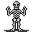

# { .sprite } Skeleton

| Stat | Value |
|---|---|
| Class | construct |
| HP | 60 |
| Max AP | 10 |
| Attack cost | 4 |
| Move cost | 10 |
| Damage | 5 to 20 |
| Attack chance | 40 |
| Block chance | 150 |
| Damage resistance | 6 |
| Critical skill | 0 |
| Critical multiplier | 0 |

!!! note "Immune to critical hits"
    Monsters of this class cannot be critically hit.

## Drops

| Item | Chance | Qty |
|---|---|---|
| [Bone](../items/bone.md) | 50% | 1 |
| [Gold coins](../items/gold.md) | 33% | 2 to 9 |

## Found on

- [guynmart_passage](../maps/guynmart_passage.md)

<small>Monster ID: `guynmart_skeleton` · Data from v0.8.18</small>
