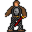

# { .sprite } Unkorh

<div class="infobox" markdown>

<p class="ib-img">{ .sprite }</p>

| | |
|---|---|
| **Monster ID** | `guynmart_steward3` |
| **Type** | NPC |
| **Class** | Humanoid |
| **HP** | 1 |
| **Found in** | Guynmart Castle |
| **Introduced** | [v0.7.2](../versions/0.7.2.md) |

</div>

## Combat stats

| Stat | Value |
|---|---|
| HP | 1 |
| Damage | 0 |
| Attack chance | 0 |
| Block chance | 0 |
| Damage resistance | 0 |
| Max AP | 10 |
| Attack cost | 10 AP |
| Attacks per turn | 1 |
| Move cost | 10 AP |
| Critical skill | 0 |
| Critical multiplier | – |
| Crit chance | none (needs critical skill and a multiplier) |

**XP formula** (from the game's loader): ⌈(attacks per turn × attack chance × average damage × (1 + critical skill × multiplier) × 3 + HP × (1 + block chance) + 9 × damage resistance) × 0.7⌉, +50 if its hits inflict a condition. More Exp adds a percentage on top.

<p class="verified">Verified against v0.8.18 monster data and game code (`MonsterTypeParser.java`).</p>


## Locations

| Map | Region | Up to | Notes |
|---|---|---|---|
| [guynmart](../maps/guynmart.md) | Guynmart Castle | 1 | appears later in a quest |


## Quests

- [Roses](../quests/guynmart.md): stages 80

## Dialogue simulator

Set up your situation (quest stages, items, kills…), then talk to Unkorh. The simulator follows the game's own rules: it takes the same silent checks, offers only the options you'd really see, and applies their effects (quest stages, items handed over, rewards) as you go.

<div class="dlg-sim" data-src="../../assets/dialogue/guynmart_steward3_10.json" data-npc="Unkorh" markdown="0"><noscript>The simulator needs JavaScript. The full dialogue is listed below.</noscript></div>

<p class="verified">Rules verified against v0.8.18 game code (ConversationController.java) and dialogue data.</p>

??? quote "Dialogue (6 lines)"

    *What the dialogue says, exactly as in the game files. Lines are listed once; links jump to the line a choice leads to.*

    <span id="d-guynmart_steward3_10"></span>**`guynmart_steward3_10`** *(silent check: the first matching branch below is taken)*

    - branch 1 → [guynmart_steward3_20](#d-guynmart_steward3_20)

    <span id="d-guynmart_steward3_20"></span>**`guynmart_steward3_20`** Unkorh: “You Dare To Speak To Me!”

    - “Hey, what did I do?” → [guynmart_steward3_22](#d-guynmart_steward3_22)

    <span id="d-guynmart_steward3_22"></span>**`guynmart_steward3_22`** Unkorh: “I Saw You On The Tower! What Were You Doing There?”

    - “I just talked to Lady Hannah.” → [guynmart_steward3_24](#d-guynmart_steward3_24)

    <span id="d-guynmart_steward3_24"></span>**`guynmart_steward3_24`** Unkorh: “Don't You Dare Defile Her Lovely Name By Using It!”

    - “But...” → [guynmart_steward3_50](#d-guynmart_steward3_50)

    <span id="d-guynmart_steward3_50"></span>**`guynmart_steward3_50`** Unkorh: “Olav! Come Here!” — **effects:** spawns monsters on guynmart

    - Next → [guynmart_steward3_52](#d-guynmart_steward3_52)

    <span id="d-guynmart_steward3_52"></span>**`guynmart_steward3_52`** Unkorh: “Show our - guest - the special exit.” — **effects:** sets stage 80 of [Roses](../quests/guynmart.md#stage-80), removes monsters from guynmart

    - “Special exit?” → *NPC leaves*


## Version history

| Version | Change |
|---|---|
| [v0.7.2](../versions/0.7.2.md) | Added<br>Dialogue: 6 lines added |
| [v0.7.5](../versions/0.7.5.md) | Dialogue: 2 lines changed |

<p class="verified">Verified against v0.8.18 and every earlier release back to v0.7.0 (game data compared release by release).</p>


## Community notes

<small>Written by players, not generated from game data. **Observations**: what players notice in-game · **Lore**: the in-world story · **Trivia**: real-world facts, references, development history · **Theory / speculation**: unconfirmed ideas; may just be unfinished content</small>

### Observations

*Nothing here yet. Know something? [Add it](https://github.com/asdfghjkl628/Andor-s-Trail-Wikiiii/new/main/notes/monsters?filename=guynmart_steward3.md&value=%23%23%20Observations%0A%0A%3C%21--%20what%20players%20notice%20in-game%20--%3E%0A%0A%23%23%20Lore%0A%0A%3C%21--%20the%20in-world%20story%20--%3E%0A%0A%23%23%20Trivia%0A%0A%3C%21--%20real-world%20facts%2C%20references%2C%20development%20history%20--%3E%0A%0A%23%23%20Theory%20/%20speculation%0A%0A%3C%21--%20unconfirmed%20ideas%3B%20may%20just%20be%20unfinished%20content%20--%3E%0A).*

### Lore

*Nothing here yet. Know something? [Add it](https://github.com/asdfghjkl628/Andor-s-Trail-Wikiiii/new/main/notes/monsters?filename=guynmart_steward3.md&value=%23%23%20Observations%0A%0A%3C%21--%20what%20players%20notice%20in-game%20--%3E%0A%0A%23%23%20Lore%0A%0A%3C%21--%20the%20in-world%20story%20--%3E%0A%0A%23%23%20Trivia%0A%0A%3C%21--%20real-world%20facts%2C%20references%2C%20development%20history%20--%3E%0A%0A%23%23%20Theory%20/%20speculation%0A%0A%3C%21--%20unconfirmed%20ideas%3B%20may%20just%20be%20unfinished%20content%20--%3E%0A).*

### Trivia

*Nothing here yet. Know something? [Add it](https://github.com/asdfghjkl628/Andor-s-Trail-Wikiiii/new/main/notes/monsters?filename=guynmart_steward3.md&value=%23%23%20Observations%0A%0A%3C%21--%20what%20players%20notice%20in-game%20--%3E%0A%0A%23%23%20Lore%0A%0A%3C%21--%20the%20in-world%20story%20--%3E%0A%0A%23%23%20Trivia%0A%0A%3C%21--%20real-world%20facts%2C%20references%2C%20development%20history%20--%3E%0A%0A%23%23%20Theory%20/%20speculation%0A%0A%3C%21--%20unconfirmed%20ideas%3B%20may%20just%20be%20unfinished%20content%20--%3E%0A).*

### Theory / speculation

*Nothing here yet. Know something? [Add it](https://github.com/asdfghjkl628/Andor-s-Trail-Wikiiii/new/main/notes/monsters?filename=guynmart_steward3.md&value=%23%23%20Observations%0A%0A%3C%21--%20what%20players%20notice%20in-game%20--%3E%0A%0A%23%23%20Lore%0A%0A%3C%21--%20the%20in-world%20story%20--%3E%0A%0A%23%23%20Trivia%0A%0A%3C%21--%20real-world%20facts%2C%20references%2C%20development%20history%20--%3E%0A%0A%23%23%20Theory%20/%20speculation%0A%0A%3C%21--%20unconfirmed%20ideas%3B%20may%20just%20be%20unfinished%20content%20--%3E%0A).*


??? info "Technical information"

    | | |
    |---|---|
    | Monster ID | `guynmart_steward3` |
    | Spawn group | `guynmart_steward3` |
    | Loot table | – |
    | Conversation | `guynmart_steward3_10` |
    | Faction | – |
    | Movement | – |
    | Icon | `monsters_ld1:11` |
    | Defined in | `res/raw/monsterlist_guynmart.json` |

    Raw data:

    ```json
    {
     "id": "guynmart_steward3",
     "name": "Unkorh",
     "iconID": "monsters_ld1:11",
     "unique": 1,
     "monsterClass": "humanoid",
     "phraseID": "guynmart_steward3_10"
    }
    ```


<small>Data from v0.8.18</small>
