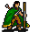

# { .sprite } Halvor

| Stat | Value |
|---|---|
| Class | ? |
| HP | 0 |
| Max AP | 10 |
| Attack cost | 10 |
| Move cost | 10 |
| Damage | 0 |
| Attack chance | 0 |
| Block chance | 0 |
| Damage resistance | 0 |
| Critical skill | 0 |
| Critical multiplier | 0 |

## Found on

- [blackwater_mountain4](../maps/blackwater_mountain4.md)
- [crossglen](../maps/crossglen.md)
- [mountainlake10a](../maps/mountainlake10a.md)
- [waytolostmine1](../maps/waytolostmine1.md)

## Quests

- [Surprise?](../quests/halvor_surprise.md): stages 10, 15, 20, 25, 30, 40, 50, 60, 65, 70, 75, 80, 90, 100, 110, 111, 112, 113, 114, 115, 120, 125, 130, 140, 150, 160, 165, 170, 175, 180

## Dialogue simulator

Set up your situation (quest stages, items, kills…), then talk to Halvor. The simulator follows the game's own rules: it takes the same silent checks, offers only the options you'd really see, and applies their effects (quest stages, items handed over, rewards) as you go.

<noscript>The simulator needs JavaScript. The full dialogue is listed below.</noscript>

Rules verified against v0.8.18 game code (ConversationController.java) and dialogue data.

??? quote "Dialogue (69 lines)"

    *What the dialogue says, exactly as in the game files. Lines are listed once; links jump to the line a choice leads to.*

    **`halvor_select_begin`** *(silent check: the first matching branch below is taken)*

    - Next *(if reached stage 175 of [Surprise?](../quests/halvor_surprise.md#stage-175))* → [halvor_chwood_11](#d-halvor_chwood_11)
    - Next *(if reached stage 170 of [Surprise?](../quests/halvor_surprise.md#stage-170))* → [halvor_chwood_9](#d-halvor_chwood_9)
    - Next *(if reached stage 165 of [Surprise?](../quests/halvor_surprise.md#stage-165))* → [halvor_chwood_6](#d-halvor_chwood_6)
    - Next *(if reached stage 160 of [Surprise?](../quests/halvor_surprise.md#stage-160))* → [halvor_chwood_4](#d-halvor_chwood_4)
    - Next *(if reached stage 150 of [Surprise?](../quests/halvor_surprise.md#stage-150))* → [halvor_chwood_2](#d-halvor_chwood_2)
    - Next *(if reached stage 140 of [Surprise?](../quests/halvor_surprise.md#stage-140))* → [halvor_chwood_0](#d-halvor_chwood_0)
    - Next *(if reached stage 130 of [Surprise?](../quests/halvor_surprise.md#stage-130))* → [halvor_mlake_12](#d-halvor_mlake_12)
    - Next *(if reached stage 125 of [Surprise?](../quests/halvor_surprise.md#stage-125))* → [halvor_mlake_10](#d-halvor_mlake_10)
    - Next *(if reached stage 120 of [Surprise?](../quests/halvor_surprise.md#stage-120))* → [halvor_mlake_7](#d-halvor_mlake_7)
    - Next *(if reached stage 114 of [Surprise?](../quests/halvor_surprise.md#stage-114))* → [halvor_mlake_5](#d-halvor_mlake_5)
    - Next *(if reached stage 113 of [Surprise?](../quests/halvor_surprise.md#stage-113))* → [halvor_mlake_5](#d-halvor_mlake_5)
    - Next *(if reached stage 112 of [Surprise?](../quests/halvor_surprise.md#stage-112))* → [halvor_mlake_5](#d-halvor_mlake_5)
    - Next *(if reached stage 111 of [Surprise?](../quests/halvor_surprise.md#stage-111))* → [halvor_mlake_5](#d-halvor_mlake_5)
    - Next *(if reached stage 110 of [Surprise?](../quests/halvor_surprise.md#stage-110))* → [halvor_mlake_2](#d-halvor_mlake_2)
    - Next *(if reached stage 90 of [Surprise?](../quests/halvor_surprise.md#stage-90))* → [halvor_mlake_0](#d-halvor_mlake_0)
    - Next *(if reached stage 80 of [Surprise?](../quests/halvor_surprise.md#stage-80))* → [halvor_bwmine_16](#d-halvor_bwmine_16)
    - Next *(if reached stage 75 of [Surprise?](../quests/halvor_surprise.md#stage-75))* → [halvor_bwmine_12](#d-halvor_bwmine_12)
    - Next *(if reached stage 70 of [Surprise?](../quests/halvor_surprise.md#stage-70))* → [halvor_bwmine_8](#d-halvor_bwmine_8)
    - Next *(if reached stage 65 of [Surprise?](../quests/halvor_surprise.md#stage-65))* → [halvor_bwmine_7](#d-halvor_bwmine_7)
    - Next *(if reached stage 60 of [Surprise?](../quests/halvor_surprise.md#stage-60))* → [halvor_bwmine_3](#d-halvor_bwmine_3)
    - Next *(if reached stage 40 of [Surprise?](../quests/halvor_surprise.md#stage-40))* → [halvor_bwmine_0](#d-halvor_bwmine_0)
    - Next *(if reached stage 20 of [Surprise?](../quests/halvor_surprise.md#stage-20))* → [halvor_crossglen_7](#d-halvor_crossglen_7)
    - Next *(if reached stage 15 of [Surprise?](../quests/halvor_surprise.md#stage-15))* → [halvor_crossglen_6](#d-halvor_crossglen_6)
    - Next *(if reached stage 10 of [Surprise?](../quests/halvor_surprise.md#stage-10))* → [halvor_crossglen_3](#d-halvor_crossglen_3)
    - Next → [halvor_crossglen_0](#d-halvor_crossglen_0)

    **`halvor_chwood_11`** Halvor: “I have finally gathered all the items I need! Kayla will be so thrilled.”

    - “Kayla?” → [halvor_chwood_12](#d-halvor_chwood_12)

    **`halvor_chwood_9`** Halvor: “Have you found the venomscale scales?”

    - “Not yet.” → *conversation ends*
    - “I have these.” *(if hand over 10× [Venomscale scales](../items/venomscale.md))* → [halvor_chwood_10](#d-halvor_chwood_10)

    **`halvor_chwood_6`** Halvor: “Now, I just need one last thing. I heard about some nasty snakes, called the venomscale.”

    - “Snakes? I hate snakes...” → [halvor_chwood_7](#d-halvor_chwood_7)
    - “Go ahead...” → [halvor_chwood_7](#d-halvor_chwood_7)

    **`halvor_chwood_4`** Halvor: “Have you found a long bone?”

    - “Not yet.” → *conversation ends*
    - “How about this one?” *(if hand over 1× [Bone](../items/bone.md))* → [halvor_chwood_5](#d-halvor_chwood_5)

    **`halvor_chwood_2`** Halvor: “So, would you bring me a bone now? A long one though!”

    - “Not now.” → *conversation ends*
    - “Only one long bone? I'm on it!” → [halvor_chwood_3](#d-halvor_chwood_3)
    - “I'll try...” → [halvor_chwood_3](#d-halvor_chwood_3)
    - “How about this one?” *(if hand over 1× [Bone](../items/bone.md))* → [halvor_chwood_5](#d-halvor_chwood_5)

    **`halvor_chwood_0`** Halvor: “The world is such a small place. We keep meeting in the most unusual places.”

    - Next → [halvor_chwood_1](#d-halvor_chwood_1)

    **`halvor_mlake_12`** Halvor: “Did you find some bones? I'm only interested in long ones though.”

    - “No. Not yet.” → *conversation ends*
    - “Yes. Look at these.” *(if hand over 2× [Bone](../items/bone.md))* → [halvor_mlake_13](#d-halvor_mlake_13)

    **`halvor_mlake_10`** Halvor: “Did you change your mind? Care to help me find a pair of bones? Remember that they must be long ones though.”

    - “Maybe later, OK?” → *conversation ends*
    - “Sure! It's not like I have more important things to do.” → [halvor_mlake_11](#d-halvor_mlake_11)
    - “I guess I can remember to look for bones if I have some spare time.” → [halvor_mlake_11](#d-halvor_mlake_11)
    - “Let me check ... I do have two bones here with me. Take them.” *(if hand over 2× [Bone](../items/bone.md))* → [halvor_mlake_13](#d-halvor_mlake_13)

    **`halvor_mlake_7`** Halvor: “Have you found really soft animal hair?”

    - “No. Not yet.” → *conversation ends*
    - “I think I do. Look at these.” *(if hand over 3× [Animal hair](../items/hair.md))* → [halvor_mlake_8](#d-halvor_mlake_8)

    **`halvor_mlake_5`** Halvor: “Back to business. I found awesome items on my way here, but I'm still looking for 3 handfuls of soft animal hair. Would you help me?” — **effects:** sets stage 115 of [Surprise?](../quests/halvor_surprise.md#stage-115)

    - “I don't feel like doing it right now.” → *conversation ends*
    - “I'll do it.” → [halvor_mlake_6](#d-halvor_mlake_6)
    - “I'll do it ... again...” → [halvor_mlake_6](#d-halvor_mlake_6)
    - “I happen to have some here. Take them.” *(if hand over 3× [Animal hair](../items/hair.md))* → [halvor_mlake_8](#d-halvor_mlake_8)

    **`halvor_mlake_2`** Halvor: “I could really use some healing. Do you happen to have a potion to spare?” — **effects:** sets stage 110 of [Surprise?](../quests/halvor_surprise.md#stage-110)

    - “No. I don't have any.” → [halvor_mlake_3](#d-halvor_mlake_3)
    - “Here, take this minor potion of health.” *(if hand over 1× [Minor potion of health](../items/health_minor2.md))* → [halvor_mlake_4_weak](#d-halvor_mlake_4_weak)
    - “Here, take this minor vial of health.” *(if hand over 1× [Minor vial of health](../items/health_minor.md))* → [halvor_mlake_4_weak](#d-halvor_mlake_4_weak)
    - “Here, take this regular potion of health.” *(if hand over 1× [Regular potion of health](../items/health.md))* → [halvor_mlake_4_regular](#d-halvor_mlake_4_regular)
    - “Here, take this major potion of health.” *(if hand over 1× [Major potion of health](../items/health_major2.md))* → [halvor_mlake_4_strong](#d-halvor_mlake_4_strong)
    - “Here, take this major flask of health.” *(if hand over 1× [Major flask of health](../items/health_major.md))* → [halvor_mlake_4_strong](#d-halvor_mlake_4_strong)
    - “Here, take this bonemeal potion.” *(if hand over 1× [Bonemeal potion](../items/bonemeal_potion.md))* → [halvor_mlake_4_strong](#d-halvor_mlake_4_strong)
    - “Here, take this Lodar's bonemeal potion.” *(if hand over 1× [Lodar's bonemeal potion](../items/pot_bm_lodar.md))* → [halvor_mlake_4_lodar](#d-halvor_mlake_4_lodar)
    - “Here, take this Lodar's potion of health.” *(if hand over 1× [Lodar's potion of health](../items/pot_healthlodar.md))* → [halvor_mlake_4_lodar](#d-halvor_mlake_4_lodar)

    **`halvor_mlake_0`** Halvor: “Hey! Long time no see. I'm happy to see a familiar face.” — **effects:** sets stage 100 of [Surprise?](../quests/halvor_surprise.md#stage-100)

    - “You seem lost...” → [halvor_mlake_1](#d-halvor_mlake_1)
    - “How are you doing?” → [halvor_mlake_1](#d-halvor_mlake_1)
    - “Oh no ... not you again.” → *conversation ends*

    **`halvor_bwmine_16`** Halvor: “Hello again. Have you found some soft animal hair?”

    - “No. Not yet.” → *conversation ends*
    - “I think so. Here's what I found.” *(if hand over 3× [Animal hair](../items/hair.md))* → [halvor_bwmine_15](#d-halvor_bwmine_15)

    **`halvor_bwmine_12`** Halvor: “Here you are again.”

    - Next → [halvor_bwmine_11](#d-halvor_bwmine_11)

    **`halvor_bwmine_8`** Halvor: “Have you found the animal hair I asked for?”

    - “No. Not yet.” → *conversation ends*
    - “Here. Take these.” *(if hand over 4× [Animal hair](../items/hair.md))* → [halvor_bwmine_9](#d-halvor_bwmine_9)

    **`halvor_bwmine_7`** Halvor: “Hello again. Would you agree to get me 4 handfuls of animal hair now?”

    - “No problem. I'll do it.” → [halvor_bwmine_6](#d-halvor_bwmine_6)
    - “I guess I have no choice...” → [halvor_bwmine_6](#d-halvor_bwmine_6)
    - “Maybe later...” → *conversation ends*
    - “I already have them right here. Take them.” *(if hand over 4× [Animal hair](../items/hair.md))* → [halvor_bwmine_9](#d-halvor_bwmine_9)

    **`halvor_bwmine_3`** Halvor: “Have you found more rat tails?”

    - “Yes. Here they are.” *(if hand over 5× [Rat tail](../items/rat_tail.md))* → [halvor_bwmine_4](#d-halvor_bwmine_4)
    - “No. Not yet.” → *conversation ends*

    **`halvor_bwmine_0`** Halvor: “Here we meet again. I'm surprised to see you this far from Crossglen!” — **effects:** sets stage 50 of [Surprise?](../quests/halvor_surprise.md#stage-50)

    - “I'm an adventurer now.” → [halvor_bwmine_1](#d-halvor_bwmine_1)
    - “You again?” → [halvor_bwmine_1](#d-halvor_bwmine_1)

    **`halvor_crossglen_7`** Halvor: “So. About those rat tails...”

    - “I don't have them.” → *conversation ends*
    - “Here you go.” *(if hand over 5× [Rat tail](../items/rat_tail.md))* → [halvor_crossglen_8](#d-halvor_crossglen_8)

    **`halvor_crossglen_6`** Halvor: “Well. Would you agree to bring me some rat tails now?”

    - “I have other things to do right now.” → *conversation ends*
    - “OK...” → [halvor_crossglen_5](#d-halvor_crossglen_5)
    - “I'm happy to help!” → [halvor_crossglen_5](#d-halvor_crossglen_5)

    **`halvor_crossglen_3`** Halvor: “Have you found the 5 insect wings I need?”

    - “No, not yet. I'll be back.” → *conversation ends*
    - “Yes. Here they are.” *(if hand over 5× [Insect wing](../items/insectwing.md))* → [halvor_crossglen_4](#d-halvor_crossglen_4)

    **`halvor_crossglen_0`** Halvor: “Hello young fellow. Would you be so kind as to help a wandering traveller?”

    - “No. I don't have the time.” → *conversation ends*
    - “Why not. What do you need?” → [halvor_crossglen_1](#d-halvor_crossglen_1)

    **`halvor_chwood_12`** Halvor: “Yes. She's a dear friend of mine. She lives in Stoutford.”

    - Next → [halvor_chwood_13](#d-halvor_chwood_13)

    **`halvor_chwood_10`** Halvor: “I can't believe it! You really found them! Take this gold. It's all I have left.” — **effects:** sets stage 175 of [Surprise?](../quests/halvor_surprise.md#stage-175), gives 1517× [Gold coins](../items/gold.md)

    - Next → [halvor_chwood_11](#d-halvor_chwood_11)

    **`halvor_chwood_7`** Halvor: “I'm really interested in their scales. Could you get me 10 of them?”

    - “Not now.” → *conversation ends*
    - “I hope this really is the last thing you need.” → [halvor_chwood_8](#d-halvor_chwood_8)
    - “Sounds easy.” → [halvor_chwood_8](#d-halvor_chwood_8)
    - “Like these 10?” *(if hand over 10× [Venomscale scales](../items/venomscale.md))* → [halvor_chwood_10](#d-halvor_chwood_10)

    **`halvor_chwood_5`** Halvor: “Awesome! Exactly what I was looking for.” — **effects:** sets stage 165 of [Surprise?](../quests/halvor_surprise.md#stage-165), gives 250× [Gold coins](../items/gold.md)

    - Next → [halvor_chwood_6](#d-halvor_chwood_6)

    **`halvor_chwood_3`** Halvor: “Thank you. I'll wait for you here.” — **effects:** sets stage 160 of [Surprise?](../quests/halvor_surprise.md#stage-160)

    **`halvor_chwood_1`** Halvor: “I found a bone that's long enough by myself since we last met. I just need another one. Could you try to find it for me?” — **effects:** sets stage 150 of [Surprise?](../quests/halvor_surprise.md#stage-150)

    - “Maybe later.” → *conversation ends*
    - “Only one long bone? I'm on it!” → [halvor_chwood_3](#d-halvor_chwood_3)
    - “I'll try...” → [halvor_chwood_3](#d-halvor_chwood_3)
    - “How about this one?” *(if hand over 0× [Bone](../items/bone.md))* → [halvor_chwood_5](#d-halvor_chwood_5)

    **`halvor_mlake_13`** Halvor: “Nope. That won't work. Could you find some longer ones?”

    - “No. I don't think I can.” → [halvor_mlake_15](#d-halvor_mlake_15)
    - “I'll look around.” → [halvor_mlake_14](#d-halvor_mlake_14)
    - “How about these two?” *(if hand over 2× [Bone](../items/bone.md))* → [halvor_mlake_13](#d-halvor_mlake_13)

    **`halvor_mlake_11`** Halvor: “Thanks. I will be here when you return.” — **effects:** sets stage 130 of [Surprise?](../quests/halvor_surprise.md#stage-130)

    **`halvor_mlake_8`** Halvor: “Beautiful! They're even better than what I expected. I love the shade too. You really deserve a reward, plus a bonus for healing me. Take it. No need to thank me.” — **effects:** sets stage 125 of [Surprise?](../quests/halvor_surprise.md#stage-125), gives 150× [Gold coins](../items/gold.md)

    - Next → [halvor_mlake_9](#d-halvor_mlake_9)

    **`halvor_mlake_6`** Halvor: “Thank you. I'll wait here.” — **effects:** sets stage 120 of [Surprise?](../quests/halvor_surprise.md#stage-120)

    **`halvor_mlake_3`** Halvor: “That's too bad. I will rest here until someone can heal me. If I can wait that long...”

    **`halvor_mlake_4_weak`** Halvor: “Thank you. I'm feeling a little better now. With some rest, I'll be able to continue my travels soon.” — **effects:** sets stage 111 of [Surprise?](../quests/halvor_surprise.md#stage-111)

    - Next → [halvor_mlake_5](#d-halvor_mlake_5)

    **`halvor_mlake_4_regular`** Halvor: “Thank you. I'm feeling way better already.” — **effects:** sets stage 112 of [Surprise?](../quests/halvor_surprise.md#stage-112)

    - Next → [halvor_mlake_5](#d-halvor_mlake_5)

    **`halvor_mlake_4_strong`** Halvor: “Wow. That was some serious healing potion.” — **effects:** sets stage 113 of [Surprise?](../quests/halvor_surprise.md#stage-113)

    - Next → [halvor_mlake_5](#d-halvor_mlake_5)

    **`halvor_mlake_4_lodar`** Halvor: “I'm feeling ... strange ... I'm feeling ... great! That was incredible. I never had such a potion. Take this hat I found on my way here.” — **effects:** sets stage 114 of [Surprise?](../quests/halvor_surprise.md#stage-114), gives 1× [Valugha's shimmering hat](../items/valugha_hat.md)

    - Next → [halvor_mlake_5](#d-halvor_mlake_5)

    **`halvor_mlake_1`** Halvor: “Travelling this far has exhausted me, and I'm running short of supplies. I'm glad I managed to reach this seemingly safe spot, but I don't think I can go further.”

    - Next → [halvor_mlake_2](#d-halvor_mlake_2)

    **`halvor_bwmine_15`** Halvor: “Thanks, but it's still not what I am looking for. Anyway, work must be rewarded. Take this gold.” — **effects:** gives 15× [Gold coins](../items/gold.md)

    - Next → [halvor_bwmine_11](#d-halvor_bwmine_11)

    **`halvor_bwmine_11`** Halvor: “Could you get me 3 more?”

    - “No way! I'm tired of your errands.” → [halvor_bwmine_17](#d-halvor_bwmine_17)
    - “More work means more money! I'll be back.” → [halvor_bwmine_13](#d-halvor_bwmine_13)
    - “Of course.” → [halvor_bwmine_13](#d-halvor_bwmine_13)
    - “I have these with me. Take them.” *(if hand over 3× [Animal hair](../items/hair.md))* → [halvor_bwmine_14](#d-halvor_bwmine_14)

    **`halvor_bwmine_9`** Halvor: “Good. Take this gold and let me see them.” — **effects:** sets stage 75 of [Surprise?](../quests/halvor_surprise.md#stage-75), gives 15× [Gold coins](../items/gold.md)

    - Next → [halvor_bwmine_10](#d-halvor_bwmine_10)

    **`halvor_bwmine_6`** Halvor: “Thanks a lot. I'll wait for you here.” — **effects:** sets stage 70 of [Surprise?](../quests/halvor_surprise.md#stage-70)

    **`halvor_bwmine_4`** Halvor: “Perfect! I can't believe you found such good rat tails. Take this.” — **effects:** gives 30× [Gold coins](../items/gold.md), sets stage 65 of [Surprise?](../quests/halvor_surprise.md#stage-65)

    - Next → [halvor_bwmine_5](#d-halvor_bwmine_5)

    **`halvor_bwmine_1`** Halvor: “Well, I'm still looking for 5 good rat tails. Would you help me now?”

    - “Alright, I hope there are rats around here, and that they have tails good enough for you.” → [halvor_bwmine_2](#d-halvor_bwmine_2)
    - “OK, but you'd better like them this time.” → [halvor_bwmine_2](#d-halvor_bwmine_2)
    - “Here, take these.” *(if hand over 5× [Rat tail](../items/rat_tail.md))* → [halvor_bwmine_4](#d-halvor_bwmine_4)
    - “I don't feel like doing this now. Sorry.” → *conversation ends*

    **`halvor_crossglen_8`** Halvor: “Thanks. Take this small compensation.” — **effects:** sets stage 25 of [Surprise?](../quests/halvor_surprise.md#stage-25), gives 12× [Gold coins](../items/gold.md)

    - Next → [halvor_crossglen_9](#d-halvor_crossglen_9)

    **`halvor_crossglen_5`** Halvor: “Thank you. Bring me 5 of them. I'll wait for you here.” — **effects:** sets stage 20 of [Surprise?](../quests/halvor_surprise.md#stage-20)

    - “I'm on my way.” → *conversation ends*
    - “I hope this is worth it...” → *conversation ends*
    - “I already possess 5 rat tails. You can take them.” *(if hand over 5× [Rat tail](../items/rat_tail.md))* → [halvor_crossglen_8](#d-halvor_crossglen_8)

    **`halvor_crossglen_4`** Halvor: “Great! Here, take this gold as a reward. Now I need some rat tails. Will you find them for me?” — **effects:** sets stage 15 of [Surprise?](../quests/halvor_surprise.md#stage-15), gives 10× [Gold coins](../items/gold.md)

    - “I have other things to do right now.” → *conversation ends*
    - “OK...” → [halvor_crossglen_5](#d-halvor_crossglen_5)
    - “I'm happy to help!” → [halvor_crossglen_5](#d-halvor_crossglen_5)

    **`halvor_crossglen_1`** Halvor: “I'd like to surprise a friend back home, when I return from my travels. I would need 5 insect wings. Could you bring them to me?”

    - “No way! I hate insects!” → *conversation ends*
    - “Sounds boring ... but I'll do it.” → [halvor_crossglen_2](#d-halvor_crossglen_2)
    - “Sure. I'll do it.” → [halvor_crossglen_2](#d-halvor_crossglen_2)
    - “I have these with me. Take them.” *(if hand over 5× [Insect wing](../items/insectwing.md))* → [halvor_crossglen_4](#d-halvor_crossglen_4)

    **`halvor_chwood_13`** Halvor: “She makes clothes and boots, and asked me to get her some of the finest items in the world for her work.”

    - Next → [halvor_chwood_14](#d-halvor_chwood_14)

    **`halvor_chwood_8`** Halvor: “Thank you. I'll wait here until you return.” — **effects:** sets stage 170 of [Surprise?](../quests/halvor_surprise.md#stage-170)

    **`halvor_mlake_15`** Halvor: “Really? You're giving up?”

    - “I'll look one last time.” → [halvor_mlake_11](#d-halvor_mlake_11)
    - “Yeah ... bones are too heavy to carry.” → [halvor_mlake_leaving](#d-halvor_mlake_leaving)

    **`halvor_mlake_14`** Halvor: “Thank you. You'll find me here when you return.” — **effects:** sets stage 130 of [Surprise?](../quests/halvor_surprise.md#stage-130)

    **`halvor_mlake_9`** Halvor: “I'm getting closer to the end of my list. I now have to find some bones. They must be long ones though. Would you look for them as well? I need only two.”

    - “Maybe later, OK?” → *conversation ends*
    - “Sure! It's not like I have more important things to do.” → [halvor_mlake_11](#d-halvor_mlake_11)
    - “I guess I can remember to look for bones if I have some spare time.” → [halvor_mlake_11](#d-halvor_mlake_11)
    - “I do have these here. Take them.” *(if hand over 2× [Bone](../items/bone.md))* → [halvor_mlake_13](#d-halvor_mlake_13)

    **`halvor_bwmine_17`** Halvor: “Are you sure? Won't you help me find the softest animal hair?”

    - “OK ... if you insist...” → [halvor_bwmine_13](#d-halvor_bwmine_13)
    - “No. I'm done.” → [halvor_bwmine_leaving](#d-halvor_bwmine_leaving)

    **`halvor_bwmine_13`** Halvor: “Thanks. I'll be right here when you return.” — **effects:** sets stage 80 of [Surprise?](../quests/halvor_surprise.md#stage-80)

    **`halvor_bwmine_14`** Halvor: “Really?” — **effects:** sets stage 80 of [Surprise?](../quests/halvor_surprise.md#stage-80)

    - Next → [halvor_bwmine_15](#d-halvor_bwmine_15)

    **`halvor_bwmine_10`** Halvor: “Hmm ... this one is nice! However, the other three won't do.”

    - Next → [halvor_bwmine_11](#d-halvor_bwmine_11)

    **`halvor_bwmine_5`** Halvor: “Next on my list is some animal hair. It has to be soft hair though. I think 4 handfuls should do. Would you find them for me?”

    - “No problem. I'll do it.” → [halvor_bwmine_6](#d-halvor_bwmine_6)
    - “I guess I have no choice...” → [halvor_bwmine_6](#d-halvor_bwmine_6)
    - “Maybe later...” → *conversation ends*
    - “I already have them right here. Take them.” *(if hand over 4× [Animal hair](../items/hair.md))* → [halvor_bwmine_9](#d-halvor_bwmine_9)

    **`halvor_bwmine_2`** Halvor: “Great. I'll wait for you here.” — **effects:** sets stage 60 of [Surprise?](../quests/halvor_surprise.md#stage-60)

    **`halvor_crossglen_9`** Halvor: “Hmm ... they're not as good as I hoped. Can you get me 5 more?”

    - “Not good enough for you? I'm tired of dealing with you.” → [halvor_crossglen_12](#d-halvor_crossglen_12)
    - “As long as you pay...” → [halvor_crossglen_10](#d-halvor_crossglen_10)
    - “As you wish. See you soon.” → [halvor_crossglen_10](#d-halvor_crossglen_10)
    - “Well, I do have these 5 other rat tails here.” *(if hand over 5× [Rat tail](../items/rat_tail.md))* → [halvor_crossglen_11](#d-halvor_crossglen_11)

    **`halvor_crossglen_2`** Halvor: “Thank you. I'll wait for you here.” — **effects:** sets stage 10 of [Surprise?](../quests/halvor_surprise.md#stage-10)

    **`halvor_chwood_14`** Halvor: “You should definitely pay her a visit when you are in Stoutford. I have to go now. Thank you for your help.” — **effects:** removes monsters from waytolostmine1, sets stage 180 of [Surprise?](../quests/halvor_surprise.md#stage-180)

    - “Good riddance...” → *NPC leaves*
    - “Glad to help. See you later.” → *NPC leaves*

    **`halvor_mlake_leaving`** Halvor: “OK. Never mind. I'll try to find long bones elsewhere.” — **effects:** sets stage 140 of [Surprise?](../quests/halvor_surprise.md#stage-140), spawns monsters on waytolostmine1, removes monsters from mountainlake10a

    - “Yeah. Go far. Very far.” → *NPC leaves*
    - “I have a feeling that we'll meet there, wherever that is.” → *NPC leaves*
    - “Good luck!” → *NPC leaves*

    **`halvor_bwmine_leaving`** Halvor: “Too bad. Thanks for helping me this far anyway.” — **effects:** sets stage 90 of [Surprise?](../quests/halvor_surprise.md#stage-90), spawns monsters on mountainlake10a, removes monsters from blackwater_mountain4

    - “Get lost.” → *NPC leaves*
    - “See you later.” → *NPC leaves*

    **`halvor_crossglen_12`** Halvor: “Please ... I really need 5 rat tails.”

    - “OK ... but it's the last time!” → [halvor_crossglen_10](#d-halvor_crossglen_10)
    - “No. No no no ... leave me alone.” → [halvor_crossglen_leaving](#d-halvor_crossglen_leaving)

    **`halvor_crossglen_10`** Halvor: “I'll wait for you here, as usual.” — **effects:** sets stage 30 of [Surprise?](../quests/halvor_surprise.md#stage-30)

    **`halvor_crossglen_11`** Halvor: “Really?” — **effects:** sets stage 30 of [Surprise?](../quests/halvor_surprise.md#stage-30)

    - Next → [halvor_crossglen_8](#d-halvor_crossglen_8)

    **`halvor_crossglen_leaving`** Halvor: “OK. I'll go look somewhere else. Goodbye.” — **effects:** sets stage 40 of [Surprise?](../quests/halvor_surprise.md#stage-40), spawns monsters on blackwater_mountain4, removes monsters from crossglen

    - “So long.” → *NPC leaves*

## Version history

| Version | Change |
|---|---|
| [v0.7.2](../versions/0.7.2.md) | Added Dialogue: 69 lines added |
| [v0.7.15](../versions/0.7.15.md) | Dialogue: 1 line changed |

Verified against v0.8.18 and every earlier release back to v0.7.0 (game data compared release by release).

## Community notes

<small>Written by players, not generated from game data. **Observations**: what players notice in-game · **Lore**: the in-world story · **Trivia**: real-world facts, references, development history · **Theory / speculation**: unconfirmed ideas; may just be unfinished content</small>

### Observations

*Nothing here yet. Know something? [Add it](https://github.com/asdfghjkl628/Andor-s-Trail-Wikiiii/new/main/notes/monsters?filename=halvor.md&value=%23%23%20Observations%0A%0A%3C%21--%20what%20players%20notice%20in-game%20--%3E%0A%0A%23%23%20Lore%0A%0A%3C%21--%20the%20in-world%20story%20--%3E%0A%0A%23%23%20Trivia%0A%0A%3C%21--%20real-world%20facts%2C%20references%2C%20development%20history%20--%3E%0A%0A%23%23%20Theory%20/%20speculation%0A%0A%3C%21--%20unconfirmed%20ideas%3B%20may%20just%20be%20unfinished%20content%20--%3E%0A).*

### Lore

*Nothing here yet. Know something? [Add it](https://github.com/asdfghjkl628/Andor-s-Trail-Wikiiii/new/main/notes/monsters?filename=halvor.md&value=%23%23%20Observations%0A%0A%3C%21--%20what%20players%20notice%20in-game%20--%3E%0A%0A%23%23%20Lore%0A%0A%3C%21--%20the%20in-world%20story%20--%3E%0A%0A%23%23%20Trivia%0A%0A%3C%21--%20real-world%20facts%2C%20references%2C%20development%20history%20--%3E%0A%0A%23%23%20Theory%20/%20speculation%0A%0A%3C%21--%20unconfirmed%20ideas%3B%20may%20just%20be%20unfinished%20content%20--%3E%0A).*

### Trivia

*Nothing here yet. Know something? [Add it](https://github.com/asdfghjkl628/Andor-s-Trail-Wikiiii/new/main/notes/monsters?filename=halvor.md&value=%23%23%20Observations%0A%0A%3C%21--%20what%20players%20notice%20in-game%20--%3E%0A%0A%23%23%20Lore%0A%0A%3C%21--%20the%20in-world%20story%20--%3E%0A%0A%23%23%20Trivia%0A%0A%3C%21--%20real-world%20facts%2C%20references%2C%20development%20history%20--%3E%0A%0A%23%23%20Theory%20/%20speculation%0A%0A%3C%21--%20unconfirmed%20ideas%3B%20may%20just%20be%20unfinished%20content%20--%3E%0A).*

### Theory / speculation

*Nothing here yet. Know something? [Add it](https://github.com/asdfghjkl628/Andor-s-Trail-Wikiiii/new/main/notes/monsters?filename=halvor.md&value=%23%23%20Observations%0A%0A%3C%21--%20what%20players%20notice%20in-game%20--%3E%0A%0A%23%23%20Lore%0A%0A%3C%21--%20the%20in-world%20story%20--%3E%0A%0A%23%23%20Trivia%0A%0A%3C%21--%20real-world%20facts%2C%20references%2C%20development%20history%20--%3E%0A%0A%23%23%20Theory%20/%20speculation%0A%0A%3C%21--%20unconfirmed%20ideas%3B%20may%20just%20be%20unfinished%20content%20--%3E%0A).*

<small>Monster ID: `halvor` · Data from v0.8.18</small>
