# Monsters

All 1907 monsters and NPCs, sorted by HP.

| | Name | Class | HP | Attack | AC | BC | DR | Crit |
|---|---|---|---|---|---|---|---|---|
| { .sprite } |  | humanoid | 0 | 0 | 0 | 0 | 0 | – |
| { .sprite } | [???](unknown.md) | ? | 0 | 0 | 0 | 0 | 0 | – |
| { .sprite } | [Aatash](atash.md) | humanoid | 0 | 0 | 0 | 0 | 0 | – |
| { .sprite } | [Acolyte](acolyte.md) | humanoid | 0 | 0 | 0 | 0 | 0 | – |
| { .sprite } | [Adakin](laeroth_last_lord.md) | ? | 0 | 0 | 0 | 0 | 0 | – |
| 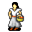{ .sprite } | [Aemens](aemens.md) | humanoid | 0 | 0 | 0 | 0 | 0 | – |
| { .sprite } | [Agent](agent1.md) | humanoid | 0 | 0 | 0 | 0 | 0 | – |
| { .sprite } | [Agent](agent2.md) | humanoid | 0 | 0 | 0 | 0 | 0 | – |
| { .sprite } | [Agent](agent3.md) | humanoid | 0 | 0 | 0 | 0 | 0 | – |
| { .sprite } | [Agent](agent4.md) | humanoid | 0 | 0 | 0 | 0 | 0 | – |
| { .sprite } | [Agent](agent5.md) | humanoid | 0 | 0 | 0 | 0 | 0 | – |
| { .sprite } | [Agent](agent6.md) | humanoid | 0 | 0 | 0 | 0 | 0 | – |
| { .sprite } | [Agnese](brightportstudent.md) | ? | 0 | 0 | 0 | 0 | 0 | – |
| { .sprite } | [Agthor](agthor.md) | ? | 0 | 0 | 0 | 0 | 0 | – |
| { .sprite } | [Agthor's guard](agthor_guard.md) | ? | 0 | 0 | 0 | 0 | 0 | – |
| { .sprite } | [Ailshara](ailshara.md) | humanoid | 0 | 0 | 0 | 0 | 0 | – |
| { .sprite } | [Ainsley](deebo_orchard_farmer_ainsley.md) | humanoid | 0 | 0 | 0 | 0 | 0 | – |
| 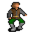{ .sprite } | [Alain](brightportitem.md) | ? | 0 | 0 | 0 | 0 | 0 | – |
| { .sprite } | [Alaric](alaric_wild6house.md) | ? | 0 | 0 | 0 | 0 | 0 | – |
| { .sprite } | [Alaric](aidem_jail_alaric.md) | humanoid | 0 | 0 | 0 | 0 | 0 | – |
| { .sprite } | [Alaun](alaun.md) | humanoid | 0 | 0 | 0 | 0 | 0 | – |
| 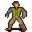{ .sprite } | [Alduan](brightport_orchardsupervisor.md) | ? | 0 | 0 | 0 | 0 | 0 | – |
| { .sprite } | [Algangror](lae_algangror1.md) | humanoid | 0 | 0 | 0 | 0 | 0 | – |
| { .sprite } | [Algangror](lae_algangror2.md) | humanoid | 0 | 0 | 0 | 0 | 0 | – |
| { .sprite } | [Alkapoan](brv_richman.md) | ? | 0 | 0 | 0 | 0 | 0 | – |
| 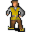{ .sprite } | [Allares](brightportstoragenpc.md) | humanoid | 0 | 0 | 0 | 0 | 0 | – |
| { .sprite } | [Almars](almars.md) | humanoid | 0 | 0 | 0 | 0 | 0 | – |
| { .sprite } | [Alynndir](alynndir.md) | humanoid | 0 | 0 | 0 | 0 | 0 | – |
| { .sprite } | [Ambelie](ambelie.md) | humanoid | 0 | 0 | 0 | 0 | 0 | – |
| { .sprite } | [Anakis](anakis.md) | ? | 0 | 0 | 0 | 0 | 0 | – |
| { .sprite } | [Anavrin](anavrin.md) | undead | 0 | 0 | 0 | 0 | 0 | – |
| { .sprite } | [Andor](dds_andor.md) | humanoid | 0 | 0 | 0 | 0 | 0 | – |
| { .sprite } | [Andor](lae_andor2.md) | humanoid | 0 | 0 | 0 | 0 | 0 | – |
| { .sprite } | [Andor](mg2_andor.md) | humanoid | 0 | 0 | 0 | 0 | 0 | – |
| { .sprite } | [Androni](brightport_chef.md) | ? | 0 | 0 | 0 | 0 | 0 | – |
| { .sprite } | [Arambold](arambold.md) | humanoid | 0 | 0 | 0 | 0 | 0 | – |
| { .sprite } | [Arcir](arcir.md) | humanoid | 0 | 0 | 0 | 0 | 0 | – |
| 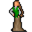{ .sprite } | [Arensia](arensia.md) | humanoid | 0 | 0 | 0 | 0 | 0 | – |
| { .sprite } | [Arghes](arghes.md) | humanoid | 0 | 0 | 0 | 0 | 0 | – |
| { .sprite } | [Arghest](arghest.md) | humanoid | 0 | 0 | 0 | 0 | 0 | – |
| { .sprite } | [Arlish](arlish.md) | humanoid | 0 | 0 | 0 | 0 | 0 | – |
| { .sprite } | [Armor](guynmart_reward3.md) | ? | 0 | 0 | 0 | 0 | 0 | – |
| { .sprite } | [Arnal](arnal.md) | humanoid | 0 | 0 | 0 | 0 | 0 | – |
| 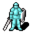{ .sprite } | [Arngyr](arngyr.md) | humanoid | 0 | 0 | 0 | 0 | 0 | – |
| { .sprite } | [Aryfora](stoutford_widow.md) | humanoid | 0 | 0 | 0 | 0 | 0 | – |
| { .sprite } | [Aryfora](stoutford_widow2.md) | humanoid | 0 | 0 | 0 | 0 | 0 | – |
| 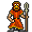{ .sprite } | [Ash fisher](ash_fisher.md) | humanoid | 0 | 0 | 0 | 0 | 0 | – |
| { .sprite } | [Askyl](askyl.md) | ? | 0 | 0 | 0 | 0 | 0 | – |
| { .sprite } | [Athamyr](athamyr.md) | humanoid | 0 | 0 | 0 | 0 | 0 | – |
| { .sprite } | [Audela](audela.md) | undead | 0 | 0 | 0 | 0 | 0 | – |
| { .sprite } | [Audir](audir.md) | humanoid | 0 | 0 | 0 | 0 | 0 | – |
| 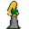{ .sprite } | [Aurelia](brightportstudent8.md) | ? | 0 | 0 | 0 | 0 | 0 | – |
| { .sprite } | [Ball](brv_ball.md) | ? | 0 | 0 | 0 | 0 | 0 | – |
| 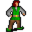{ .sprite } | [Baltimor](brightportnpc9.md) | ? | 0 | 0 | 0 | 0 | 0 | – |
| { .sprite } | [Barthold](brightportgoons1.md) | ? | 0 | 0 | 0 | 0 | 0 | – |
| { .sprite } | [Bearded citizen](bearded_citizen.md) | humanoid | 0 | 0 | 0 | 0 | 0 | – |
| 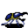{ .sprite } | [Beetle](guynmart_fighter1.md) | animal | 0 | 0 | 0 | 0 | 0 | – |
| { .sprite } | [Beetle](guynmart_fighter2.md) | animal | 0 | 0 | 0 | 0 | 0 | – |
| { .sprite } | [Bela](bela.md) | humanoid | 0 | 0 | 0 | 0 | 0 | – |
| { .sprite } | [Bela](bela_2.md) | humanoid | 0 | 0 | 0 | 0 | 0 | – |
| { .sprite } | [Beldric](boat0.md) | humanoid | 0 | 0 | 0 | 0 | 0 | – |
| 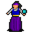{ .sprite } | [Beltina](sullengard_beltina.md) | humanoid | 0 | 0 | 0 | 0 | 0 | – |
| 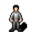{ .sprite } | [Benbyr](benbyr.md) | humanoid | 0 | 0 | 0 | 0 | 0 | – |
| { .sprite } | [Bernhar](bernhar.md) | humanoid | 0 | 0 | 0 | 0 | 0 | – |
| { .sprite } | [Bidro](brute_fisherman.md) | humanoid | 0 | 0 | 0 | 0 | 0 | – |
| { .sprite } | [Birgil](birgil.md) | humanoid | 0 | 0 | 0 | 0 | 0 | – |
| { .sprite } | [Bjorgur](bjorgur.md) | humanoid | 0 | 0 | 0 | 0 | 0 | – |
| { .sprite } | [Black cat](black_cat.md) | animal | 0 | 0 | 0 | 0 | 0 | – |
| { .sprite } | [Black fog](zuul_khan1_blocker.md) | animal | 0 | 0 | 0 | 0 | 0 | – |
| { .sprite } | [Black fog](zuul_khan2_blocker.md) | animal | 0 | 0 | 0 | 0 | 0 | – |
| { .sprite } | [Black fog](zuul_khan3_blocker.md) | animal | 0 | 0 | 0 | 0 | 0 | – |
| { .sprite } | [Black fog](zuul_khan4_blocker.md) | animal | 0 | 0 | 0 | 0 | 0 | – |
| { .sprite } | [Black fog](zuul_khan9_blocker.md) | animal | 0 | 0 | 0 | 0 | 0 | – |
| { .sprite } | [Blackwater cook](blackwater_cook.md) | humanoid | 0 | 0 | 0 | 0 | 0 | – |
| 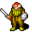{ .sprite } | [Blackwater fighter](blackwater_fighter.md) | humanoid | 0 | 0 | 0 | 0 | 0 | – |
| { .sprite } | [Blackwater mage](blackwater_mage.md) | humanoid | 0 | 0 | 0 | 0 | 0 | – |
| { .sprite } | [Blackwater priest](blackwater_priest.md) | humanoid | 0 | 0 | 0 | 0 | 0 | – |
| { .sprite } | [Blackwater pupil](blackwater_pupil.md) | humanoid | 0 | 0 | 0 | 0 | 0 | – |
| { .sprite } | [Blau ](brightportstudent11.md) | ? | 0 | 0 | 0 | 0 | 0 | – |
| { .sprite } | [Blond citizen](blond_citizen.md) | humanoid | 0 | 0 | 0 | 0 | 0 | – |
| { .sprite } | [Blornvale](stoutford_alchemist.md) | humanoid | 0 | 0 | 0 | 0 | 0 | – |
| { .sprite } | [Blornvale](stoutford_alchemist2.md) | humanoid | 0 | 0 | 0 | 0 | 0 | – |
| { .sprite } | [Blue fish](fish_school.md) | animal | 0 | 0 | 0 | 0 | 0 | – |
| { .sprite } | [Bogal](bogsten_gambler1.md) | humanoid | 0 | 0 | 0 | 0 | 0 | – |
| { .sprite } | [Bollo](bogsten_gambler3.md) | humanoid | 0 | 0 | 0 | 0 | 0 | – |
| { .sprite } | [Bonicksa](wicked_witch_third.md) | humanoid | 0 | 0 | 0 | 0 | 0 | – |
| { .sprite } | [Boralla](stn_boralla.md) | humanoid | 0 | 0 | 0 | 0 | 0 | – |
| { .sprite } | [Boralla](stn_boralla1.md) | humanoid | 0 | 0 | 0 | 0 | 0 | – |
| { .sprite } | [Boralla](stn_boralla2.md) | humanoid | 0 | 0 | 0 | 0 | 0 | – |
| { .sprite } | [Boralla](stn_boralla3.md) | humanoid | 0 | 0 | 0 | 0 | 0 | – |
| { .sprite } | [Boralla](stn_boralla4.md) | humanoid | 0 | 0 | 0 | 0 | 0 | – |
| { .sprite } | [Boralla](stn_boralla5.md) | humanoid | 0 | 0 | 0 | 0 | 0 | – |
| { .sprite } | [Boralla](stn_boralla6.md) | humanoid | 0 | 0 | 0 | 0 | 0 | – |
| { .sprite } | [Boralla](stn_boralla7.md) | humanoid | 0 | 0 | 0 | 0 | 0 | – |
| { .sprite } | [Borlag](stoutford_commander.md) | ? | 0 | 0 | 0 | 0 | 0 | – |
| { .sprite } | [Borvis](dds_borvis.md) | humanoid | 0 | 0 | 0 | 0 | 0 | – |
| { .sprite } | [Botisto](bogsten_gambler2.md) | humanoid | 0 | 0 | 0 | 0 | 0 | – |
| { .sprite } | [Bread golem](breadgolem.md) | construct | 0 | 0 | 0 | 0 | 0 | – |
| 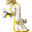{ .sprite } | [Brenor](brenor.md) | ? | 0 | 0 | 0 | 0 | 0 | – |
| { .sprite } | [Bridge lookout](remgard_bridge.md) | humanoid | 0 | 0 | 0 | 0 | 0 | – |
| { .sprite } | [Brightport commoner](brightportcitizen1.md) | ? | 0 | 0 | 0 | 0 | 0 | – |
| { .sprite } | [Brightport commoner](brightportcitizen.md) | ? | 0 | 0 | 0 | 0 | 0 | – |
| { .sprite } | [Brightport guard](brightport_guardgoons.md) | ? | 0 | 0 | 0 | 0 | 0 | – |
| { .sprite } | [Brightport guard](brightportguard.md) | ? | 0 | 0 | 0 | 0 | 0 | – |
| { .sprite } | [Brightport guard](brightport_jailguard.md) | ? | 0 | 0 | 0 | 0 | 0 | – |
| { .sprite } | [Brightport guard](brightport_guardbase.md) | ? | 0 | 0 | 0 | 0 | 0 | – |
| { .sprite } | [Brightport guard](brightportguard2.md) | ? | 0 | 0 | 0 | 0 | 0 | – |
| { .sprite } | [Brightport guard](brightport_guardcrate.md) | ? | 0 | 0 | 0 | 0 | 0 | – |
| { .sprite } | [Brightport guard](brightportnorthguard.md) | ? | 0 | 0 | 0 | 0 | 0 | – |
| { .sprite } | [Brightport student](brightportstudent5.md) | ? | 0 | 0 | 0 | 0 | 0 | – |
| { .sprite } | [Briwerra's family cat](sullengard_briwerra_cat.md) | animal | 0 | 0 | 0 | 0 | 0 | – |
| { .sprite } | [Brown cat](brown_cat.md) | animal | 0 | 0 | 0 | 0 | 0 | – |
| { .sprite } | [Bryma](brightportnpc7.md) | ? | 0 | 0 | 0 | 0 | 0 | – |
| { .sprite } | [Bucus](bucus.md) | humanoid | 0 | 0 | 0 | 0 | 0 | – |
| { .sprite } | [Builder](stoutford_builder.md) | ? | 0 | 0 | 0 | 0 | 0 | – |
| { .sprite } | [Burhczyd](burhczyd1.md) | humanoid | 0 | 0 | 0 | 0 | 0 | – |
| { .sprite } | [Burhczyd](burhczyd2.md) | humanoid | 0 | 0 | 0 | 0 | 0 | – |
| { .sprite } | [Burhczyd](burhczyd3.md) | humanoid | 0 | 0 | 0 | 0 | 0 | – |
| { .sprite } | [Burhczyd](burhczyd4.md) | humanoid | 0 | 0 | 0 | 0 | 0 | – |
| { .sprite } | [Burhczyd](burhczyd5.md) | humanoid | 0 | 0 | 0 | 0 | 0 | – |
| { .sprite } | [Burhczyd](burhczyd6.md) | humanoid | 0 | 0 | 0 | 0 | 0 | – |
| { .sprite } | [Burhczyd](burhczyd7.md) | humanoid | 0 | 0 | 0 | 0 | 0 | – |
| { .sprite } | [Burhczyd](burhczyd8.md) | humanoid | 0 | 0 | 0 | 0 | 0 | – |
| { .sprite } | [Burhczyd](burhczyd9.md) | humanoid | 0 | 0 | 0 | 0 | 0 | – |
| { .sprite } | [Burhczyd](burhczyd10.md) | humanoid | 0 | 0 | 0 | 0 | 0 | – |
| { .sprite } | [Burhczyd](burhczyd11.md) | humanoid | 0 | 0 | 0 | 0 | 0 | – |
| { .sprite } | [Burhczyd](burhczyd12.md) | humanoid | 0 | 0 | 0 | 0 | 0 | – |
| { .sprite } | [Burhczyd](burhczyd13.md) | humanoid | 0 | 0 | 0 | 0 | 0 | – |
| { .sprite } | [Burhczyd](burhczyd14.md) | humanoid | 0 | 0 | 0 | 0 | 0 | – |
| { .sprite } | [Burhczyd](burhczyd15.md) | humanoid | 0 | 0 | 0 | 0 | 0 | – |
| { .sprite } | [Burhczyd](burhczyd16.md) | humanoid | 0 | 0 | 0 | 0 | 0 | – |
| { .sprite } | [Burhczyd](burhczyd17.md) | humanoid | 0 | 0 | 0 | 0 | 0 | – |
| { .sprite } | [Burhczyd](burhczyd18.md) | humanoid | 0 | 0 | 0 | 0 | 0 | – |
| { .sprite } | [Burhczyd](burhczyd19.md) | humanoid | 0 | 0 | 0 | 0 | 0 | – |
| { .sprite } | [Burhczyd](burhczyd20.md) | humanoid | 0 | 0 | 0 | 0 | 0 | – |
| { .sprite } | [Burhczyd](burhczyd21.md) | humanoid | 0 | 0 | 0 | 0 | 0 | – |
| { .sprite } | [Burhczyd](burhczyd22.md) | humanoid | 0 | 0 | 0 | 0 | 0 | – |
| { .sprite } | [Burhczyd](stn_burhczyd1.md) | humanoid | 0 | 0 | 0 | 0 | 0 | – |
| { .sprite } | [Burhczyd](stn_burhczyd2.md) | humanoid | 0 | 0 | 0 | 0 | 0 | – |
| { .sprite } | [Burhczyd](stn_burhczyd3.md) | humanoid | 0 | 0 | 0 | 0 | 0 | – |
| { .sprite } | [Burhczyd](stn_burhczyd4.md) | humanoid | 0 | 0 | 0 | 0 | 0 | – |
| { .sprite } | [Burhczyd](stn_burhczyd5.md) | humanoid | 0 | 0 | 0 | 0 | 0 | – |
| { .sprite } | [Burhczyd](stn_burhczyd6.md) | humanoid | 0 | 0 | 0 | 0 | 0 | – |
| { .sprite } | [Burhczyd](stn_burhczyd7.md) | humanoid | 0 | 0 | 0 | 0 | 0 | – |
| { .sprite } | [Burhczyd](stn_burhczyd8.md) | humanoid | 0 | 0 | 0 | 0 | 0 | – |
| { .sprite } | [Burhczyd](stn_burhczyd9.md) | humanoid | 0 | 0 | 0 | 0 | 0 | – |
| { .sprite } | [Busy farmer](busy_farmer.md) | humanoid | 0 | 0 | 0 | 0 | 0 | – |
| { .sprite } | [Busy farmer](fallhaven_outdoor_farmer.md) | humanoid | 0 | 0 | 0 | 0 | 0 | – |
| { .sprite } | [Busy farmer](stoutford_farmer2.md) | humanoid | 0 | 0 | 0 | 0 | 0 | – |
| { .sprite } | [Butcher](brv_butcher.md) | ? | 0 | 0 | 0 | 0 | 0 | – |
| { .sprite } | [Cadoren](stoutford_cook.md) | humanoid | 0 | 0 | 0 | 0 | 0 | – |
| { .sprite } | [Caeda](caeda.md) | humanoid | 0 | 0 | 0 | 0 | 0 | – |
| 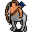{ .sprite } | [Callista, the centaur](lae_centaur2.md) | humanoid | 0 | 0 | 0 | 0 | 0 | – |
| { .sprite } | [Captain Burry](ll2_captain.md) | humanoid | 0 | 0 | 0 | 0 | 0 | – |
| { .sprite } | [Captain Burry](ll2_captain_0.md) | humanoid | 0 | 0 | 0 | 0 | 0 | – |
| { .sprite } | [Carthe](carthe.md) | humanoid | 0 | 0 | 0 | 0 | 0 | – |
| 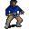{ .sprite } | [Casterod](bwm17_worker.md) | humanoid | 0 | 0 | 0 | 0 | 0 | – |
| 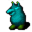{ .sprite } | [Cave mole](ratdom_maze_mole.md) | ? | 0 | 0 | 0 | 0 | 0 | – |
| { .sprite } | [Cavill](brightportstudent3.md) | ? | 0 | 0 | 0 | 0 | 0 | – |
| { .sprite } | [Cedric](brightportstudent6.md) | ? | 0 | 0 | 0 | 0 | 0 | – |
| { .sprite } | [Celdar](celdar.md) | humanoid | 0 | 0 | 0 | 0 | 0 | – |
| { .sprite } | [Centaur](lae_centaur.md) | humanoid | 0 | 0 | 0 | 0 | 0 | – |
| { .sprite } | [Chael](chael.md) | humanoid | 0 | 0 | 0 | 0 | 0 | – |
| { .sprite } | [Chandelier](brv_wh_item_44.md) | ? | 0 | 0 | 0 | 0 | 0 | – |
| { .sprite } | [Chapel guard](sullengard_church_guard.md) | ? | 0 | 0 | 0 | 0 | 0 | – |
| { .sprite } | [Chapel guard](loneford_chapelguard.md) | humanoid | 0 | 0 | 0 | 0 | 0 | – |
| { .sprite } | [Chapelgoer ](brightportchurch.md) | ? | 0 | 0 | 0 | 0 | 0 | – |
| { .sprite } | [Charybdis](ll2_whirl.md) | construct | 0 | 0 | 0 | 0 | 0 | – |
| { .sprite } | [Charybdis](ll2_whirl_return.md) | construct | 0 | 0 | 0 | 0 | 0 | – |
| 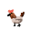{ .sprite } | [Chicken](chicken.md) | animal | 0 | 0 | 0 | 0 | 0 | – |
| 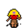{ .sprite } | [Child](brv_villager13.md) | ? | 0 | 0 | 0 | 0 | 0 | – |
| { .sprite } | [Church guard](brimhaven_church_guard.md) | humanoid | 0 | 0 | 0 | 0 | 0 | – |
| { .sprite } | [Churrie](churrie.md) | humanoid | 0 | 0 | 0 | 0 | 0 | – |
| { .sprite } | [Circe](circe.md) | humanoid | 0 | 0 | 0 | 0 | 0 | – |
| { .sprite } | [Cithurn](waterwayhermit.md) | humanoid | 0 | 0 | 0 | 0 | 0 | – |
| { .sprite } | [Cithurn's cat](cithurncat.md) | animal | 0 | 0 | 0 | 0 | 0 | – |
| { .sprite } | [Citizen](citizen.md) | humanoid | 0 | 0 | 0 | 0 | 0 | – |
| { .sprite } | [Clevred](ratdom_rat.md) | ? | 0 | 0 | 0 | 0 | 0 | – |
| { .sprite } | [Clevred](ratdom_rat_bwm1.md) | ? | 0 | 0 | 0 | 0 | 0 | – |
| { .sprite } | [Clevred](ratdom_rat_crossglen.md) | ? | 0 | 0 | 0 | 0 | 0 | – |
| { .sprite } | [Colonel Lutarc](stn_colonel.md) | humanoid | 0 | 0 | 0 | 0 | 0 | – |
| { .sprite } | [Commoner](brv_villager1.md) | humanoid | 0 | 0 | 0 | 0 | 0 | – |
| { .sprite } | [Commoner](brv_villager2.md) | humanoid | 0 | 0 | 0 | 0 | 0 | – |
| { .sprite } | [Commoner](brv_villager4.md) | humanoid | 0 | 0 | 0 | 0 | 0 | – |
| { .sprite } | [Commoner](brv_villager5.md) | humanoid | 0 | 0 | 0 | 0 | 0 | – |
| { .sprite } | [Commoner](brv_villager6.md) | humanoid | 0 | 0 | 0 | 0 | 0 | – |
| { .sprite } | [Commoner](brv_villager7.md) | humanoid | 0 | 0 | 0 | 0 | 0 | – |
| 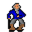{ .sprite } | [Commoner](brv_villager8.md) | humanoid | 0 | 0 | 0 | 0 | 0 | – |
| 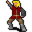{ .sprite } | [Commoner](brv_villager9.md) | humanoid | 0 | 0 | 0 | 0 | 0 | – |
| { .sprite } | [Commoner](brv_villager10.md) | humanoid | 0 | 0 | 0 | 0 | 0 | – |
| { .sprite } | [Commoner](brv_villager11.md) | ? | 0 | 0 | 0 | 0 | 0 | – |
| 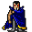{ .sprite } | [Commoner](brv_villager14.md) | ? | 0 | 0 | 0 | 0 | 0 | – |
| 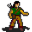{ .sprite } | [Commoner](brv_villager15.md) | ? | 0 | 0 | 0 | 0 | 0 | – |
| { .sprite } | [Commoner](stoutford_commoner.md) | ? | 0 | 0 | 0 | 0 | 0 | – |
| { .sprite } | [Commoner](stoutford_commoner2.md) | ? | 0 | 0 | 0 | 0 | 0 | – |
| { .sprite } | [Commoner](rg_villager1.md) | humanoid | 0 | 0 | 0 | 0 | 0 | – |
| { .sprite } | [Commoner](rg_villager2.md) | humanoid | 0 | 0 | 0 | 0 | 0 | – |
| { .sprite } | [Commoner](rg_villager3.md) | humanoid | 0 | 0 | 0 | 0 | 0 | – |
| { .sprite } | [Commoner](rg_villager4.md) | humanoid | 0 | 0 | 0 | 0 | 0 | – |
| { .sprite } | [Commoner](rg_villager5.md) | humanoid | 0 | 0 | 0 | 0 | 0 | – |
| { .sprite } | [Commoner](rg_villager6.md) | humanoid | 0 | 0 | 0 | 0 | 0 | – |
| { .sprite } | [Commoner](rg_villager7.md) | humanoid | 0 | 0 | 0 | 0 | 0 | – |
| { .sprite } | [Commoner](rg_villager8.md) | humanoid | 0 | 0 | 0 | 0 | 0 | – |
| { .sprite } | [Confused ghost](bogsten_ghost5.md) | humanoid | 0 | 0 | 0 | 0 | 0 | – |
| { .sprite } | [Conren](conren.md) | humanoid | 0 | 0 | 0 | 0 | 0 | – |
| 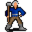{ .sprite } | [Cornith](stoutford_smith.md) | humanoid | 0 | 0 | 0 | 0 | 0 | – |
| { .sprite } | [Cottager](stoutford_cottager.md) | ? | 0 | 0 | 0 | 0 | 0 | – |
| { .sprite } | [Counterfeit](brightportthieves2.md) | ? | 0 | 0 | 0 | 0 | 0 | – |
| { .sprite } | [Crescenzio](brightport_chef2.md) | ? | 0 | 0 | 0 | 0 | 0 | – |
| { .sprite } | [Crew](ll2_circe_crew.md) | humanoid | 0 | 0 | 0 | 0 | 0 | – |
| { .sprite } | [Croaklear](stoutford_old_woman.md) | ? | 0 | 0 | 0 | 0 | 0 | – |
| { .sprite } | [Crystal globe](brv_wh_item_40.md) | ? | 0 | 0 | 0 | 0 | 0 | – |
| { .sprite } | [Cuned](cuned.md) | undead | 0 | 0 | 0 | 0 | 0 | – |
| { .sprite } | [Curwen](sullengard_courtyard_boy.md) | ? | 0 | 0 | 0 | 0 | 0 | – |
| { .sprite } | [Customer](brv_tavern1_guest.md) | humanoid | 0 | 0 | 0 | 0 | 0 | – |
| { .sprite } | [Customer](stoutford_drinker_1.md) | ? | 0 | 0 | 0 | 0 | 0 | – |
| { .sprite } | [Customer](stoutford_drinker_2.md) | ? | 0 | 0 | 0 | 0 | 0 | – |
| { .sprite } | [Cymbalist](ratdom_skel_cymb.md) | undead | 0 | 0 | 0 | 0 | 0 | – |
| { .sprite } | [Cymbalist](ratdom_skel_cymb1.md) | undead | 0 | 0 | 0 | 0 | 0 | – |
| 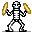{ .sprite } | [Cymbalist](ratdom_skel_cymb2.md) | undead | 0 | 0 | 0 | 0 | 0 | – |
| { .sprite } | [Cymbalist](erwyn_skel_cymbal.md) | undead | 0 | 0 | 0 | 0 | 0 | – |
| 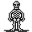{ .sprite } | [Dancing skeleton](ratdom_skel_dance1.md) | undead | 0 | 0 | 0 | 0 | 0 | – |
| { .sprite } | [Dancing skeleton](ratdom_skel_dance2.md) | undead | 0 | 0 | 0 | 0 | 0 | – |
| 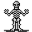{ .sprite } | [Dancing skeleton](ratdom_skel_dance3.md) | undead | 0 | 0 | 0 | 0 | 0 | – |
| { .sprite } | [Dancing skeleton](ratdom_skel_dance4.md) | undead | 0 | 0 | 0 | 0 | 0 | – |
| 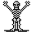{ .sprite } | [Dancing skeleton](ratdom_skel_dance5.md) | undead | 0 | 0 | 0 | 0 | 0 | – |
| 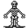{ .sprite } | [Dancing skeleton](ratdom_skel_dance6.md) | undead | 0 | 0 | 0 | 0 | 0 | – |
| { .sprite } | [Dancing skeleton](ratdom_skel_dance7.md) | undead | 0 | 0 | 0 | 0 | 0 | – |
| 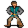{ .sprite } | [Dantran](sullengard_dantran.md) | humanoid | 0 | 0 | 0 | 0 | 0 | – |
| { .sprite } | [Dark priest](dds_dark_priest.md) | humanoid | 0 | 0 | 0 | 0 | 0 | – |
| { .sprite } | [Dark priest](dds_dark_priest2.md) | humanoid | 0 | 0 | 0 | 0 | 0 | – |
| { .sprite } | [Dark watch](lae_demon4_safe.md) | demon | 0 | 0 | 0 | 0 | 0 | – |
| { .sprite } | [Dark watch](lae_demon4b_safe.md) | demon | 0 | 0 | 0 | 0 | 0 | – |
| { .sprite } | [Dark watch](lae_demon5_safe.md) | demon | 0 | 0 | 0 | 0 | 0 | – |
| { .sprite } | [Dark watch](lae_demon7_safe.md) | demon | 0 | 0 | 0 | 0 | 0 | – |
| { .sprite } | [Dark watch](lae_demon9_safe.md) | demon | 0 | 0 | 0 | 0 | 0 | – |
| { .sprite } | [Dealer](brv_blackjack_dealer.md) | humanoid | 0 | 0 | 0 | 0 | 0 | – |
| { .sprite } | [Deebo](deebo_orchard_deebo.md) | humanoid | 0 | 0 | 0 | 0 | 0 | – |
| { .sprite } | [Defy](aidem_camp_defy.md) | ? | 0 | 0 | 0 | 0 | 0 | – |
| { .sprite } | [Defy](defy_wild6house.md) | ? | 0 | 0 | 0 | 0 | 0 | – |
| { .sprite } | [Defy](aidem_jail_defy.md) | humanoid | 0 | 0 | 0 | 0 | 0 | – |
| { .sprite } | [Defy](g04_defy.md) | humanoid | 0 | 0 | 0 | 0 | 0 | – |
| 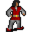{ .sprite } | [Delon](brightportnpc10.md) | ? | 0 | 0 | 0 | 0 | 0 | – |
| { .sprite } | [Dibella](brightportnpc3.md) | ? | 0 | 0 | 0 | 0 | 0 | – |
| 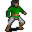{ .sprite } | [Dietrich](brightportstudent7.md) | ? | 0 | 0 | 0 | 0 | 0 | – |
| { .sprite } | [Digiani](brightportbakeryvisitor.md) | ? | 0 | 0 | 0 | 0 | 0 | – |
| { .sprite } | [Dog](guynmart_dog10.md) | animal | 0 | 0 | 0 | 0 | 0 | – |
| { .sprite } | [Dog](petdog.md) | animal | 0 | 0 | 0 | 0 | 0 | – |
| { .sprite } | [Drashad](drashad.md) | ? | 0 | 0 | 0 | 0 | 0 | – |
| { .sprite } | [Drendolas](brightport_studentghost1.md) | ? | 0 | 0 | 0 | 0 | 0 | – |
| { .sprite } | [Drinking brother](sullengard_drinking_brother.md) | humanoid | 0 | 0 | 0 | 0 | 0 | – |
| { .sprite } | [Drinking brother](sullengard_drinking_brother2.md) | humanoid | 0 | 0 | 0 | 0 | 0 | – |
| { .sprite } | [Drinking brother](sullengard_drinking_brother3.md) | humanoid | 0 | 0 | 0 | 0 | 0 | – |
| { .sprite } | [Drummer](ratdom_skel_drum.md) | undead | 0 | 0 | 0 | 0 | 0 | – |
| { .sprite } | [Drummer](ratdom_skel_drum1.md) | undead | 0 | 0 | 0 | 0 | 0 | – |
| 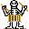{ .sprite } | [Drummer](ratdom_skel_drum2.md) | undead | 0 | 0 | 0 | 0 | 0 | – |
| { .sprite } | [Drummer](erwyn_skel_drum.md) | undead | 0 | 0 | 0 | 0 | 0 | – |
| { .sprite } | [Drunk](drunk.md) | humanoid | 0 | 0 | 0 | 0 | 0 | – |
| { .sprite } | [Drunkard](drunkard.md) | humanoid | 0 | 0 | 0 | 0 | 0 | – |
| { .sprite } | [Drunken Feygard patrol](ortholion_guard11.md) | humanoid | 0 | 0 | 0 | 0 | 0 | – |
| { .sprite } | [Drunken Feygard scout](ortholion_guard10.md) | humanoid | 0 | 0 | 0 | 0 | 0 | – |
| 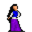{ .sprite } | [Duaina](duaina.md) | humanoid | 0 | 0 | 0 | 0 | 0 | – |
| { .sprite } | [Duleian mountain cat cub](brightport_cat.md) | animal | 0 | 0 | 0 | 0 | 0 | – |
| { .sprite } | [Duleian panther cub](brightport_cat3.md) | animal | 0 | 0 | 0 | 0 | 0 | – |
| { .sprite } | [Dummy NPC](none.md) | ? | 0 | 0 | 0 | 0 | 0 | – |
| { .sprite } | [Dunla](dunla.md) | humanoid | 0 | 0 | 0 | 0 | 0 | – |
| { .sprite } | [Durnan the Hollow](durnan.md) | humanoid | 0 | 0 | 0 | 0 | 0 | – |
| { .sprite } | [Dusty old book](brv_wh_item_49.md) | ? | 0 | 0 | 0 | 0 | 0 | – |
| { .sprite } | [Dying Crackshot](g03_crackshot_dying.md) | humanoid | 0 | 0 | 0 | 0 | 0 | – |
| { .sprite } | [Dying Patrol](g03_deadpatrol_2.md) | humanoid | 0 | 0 | 0 | 0 | 0 | – |
| { .sprite } | [Dying general's henchman](ortholion_guard8.md) | humanoid | 0 | 0 | 0 | 0 | 0 | – |
| { .sprite } | [Dying patrol](g03_deadpatrol_1.md) | humanoid | 0 | 0 | 0 | 0 | 0 | – |
| { .sprite } | [Dynes](brightportgoons.md) | ? | 0 | 0 | 0 | 0 | 0 | – |
| 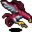{ .sprite } | [Eagle](brv_eagle.md) | ? | 0 | 0 | 0 | 0 | 0 | – |
| { .sprite } | [Easturlie](easturlie.md) | humanoid | 0 | 0 | 0 | 0 | 0 | – |
| { .sprite } | [Eatloni](brightportbakeryoutside.md) | ? | 0 | 0 | 0 | 0 | 0 | – |
| { .sprite } | [Edrin](brv_metalsmith.md) | humanoid | 0 | 0 | 0 | 0 | 0 | – |
| { .sprite } | [Eel](ll2_watersnake1.md) | animal | 0 | 0 | 0 | 0 | 0 | – |
| { .sprite } | [Effa](brightportbakery2.md) | ? | 0 | 0 | 0 | 0 | 0 | – |
| 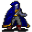{ .sprite } | [Ehrenfest](ehrenfest.md) | humanoid | 0 | 0 | 0 | 0 | 0 | – |
| { .sprite } | [Elfeyn](brightportstudent12.md) | ? | 0 | 0 | 0 | 0 | 0 | – |
| 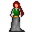{ .sprite } | [Elvira](brightportinn.md) | ? | 0 | 0 | 0 | 0 | 0 | – |
| { .sprite } | [Elwel](elwel.md) | humanoid | 0 | 0 | 0 | 0 | 0 | – |
| { .sprite } | [Elwyl](elwyl.md) | humanoid | 0 | 0 | 0 | 0 | 0 | – |
| { .sprite } | [Elynard](brightportinnvisitor1.md) | ? | 0 | 0 | 0 | 0 | 0 | – |
| { .sprite } | [Elysa](brightportthieves6.md) | ? | 0 | 0 | 0 | 0 | 0 | – |
| { .sprite } | [Elytharan cooker slave](elytharan_cook_slave.md) | ghost | 0 | 0 | 0 | 0 | 0 | – |
| { .sprite } | [Emerei](emerei.md) | humanoid | 0 | 0 | 0 | 0 | 0 | – |
| { .sprite } | [Emmeline](captive_girl.md) | humanoid | 0 | 0 | 0 | 0 | 0 | – |
| { .sprite } | [Eraepsekahs](eraepsekahs.md) | humanoid | 0 | 0 | 0 | 0 | 0 | – |
| { .sprite } | [Erelyn](brightport_studentghost.md) | ? | 0 | 0 | 0 | 0 | 0 | – |
| { .sprite } | [Erethori](erethori.md) | ? | 0 | 0 | 0 | 0 | 0 | – |
| { .sprite } | [Erinith](erinith.md) | humanoid | 0 | 0 | 0 | 0 | 0 | – |
| { .sprite } | [Erttu](erttu.md) | humanoid | 0 | 0 | 0 | 0 | 0 | – |
| 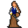{ .sprite } | [Ervelyn](ervelyn.md) | humanoid | 0 | 0 | 0 | 0 | 0 | – |
| { .sprite } | [Esfiume](esfiume.md) | ? | 0 | 0 | 0 | 0 | 0 | – |
| { .sprite } | [Especially sweet berries](wild_berry3.md) | animal | 0 | 0 | 0 | 0 | 0 | – |
| 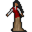{ .sprite } | [Evelina](brightportstudent9.md) | ? | 0 | 0 | 0 | 0 | 0 | – |
| { .sprite } | [Ewmondold](inspiring_snake_master.md) | humanoid | 0 | 0 | 0 | 0 | 0 | – |
| { .sprite } | [Eyvipa](eyvipa.md) | undead | 0 | 0 | 0 | 0 | 0 | – |
| { .sprite } | [Facutloni](brv_wh_boss.md) | humanoid | 0 | 0 | 0 | 0 | 0 | – |
| { .sprite } | [Falkour the Forge Dragon](wh_dragon.md) | animal | 0 | 0 | 0 | 0 | 0 | – |
| { .sprite } | [Falothen](falothen0.md) | ? | 0 | 0 | 0 | 0 | 0 | – |
| { .sprite } | [Falothen](falothen1.md) | ? | 0 | 0 | 0 | 0 | 0 | – |
| { .sprite } | [Fanamor](fanamor.md) | humanoid | 0 | 0 | 0 | 0 | 0 | – |
| { .sprite } | [Fangwurm](fangwurm.md) | ? | 0 | 0 | 0 | 0 | 0 | – |
| 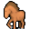{ .sprite } | [Farm horse](farm_horse.md) | animal | 0 | 0 | 0 | 0 | 0 | – |
| { .sprite } | [Farm horse](farm_horse_right.md) | animal | 0 | 0 | 0 | 0 | 0 | – |
| { .sprite } | [Farmer](farmer.md) | humanoid | 0 | 0 | 0 | 0 | 0 | – |
| { .sprite } | [Farmer](stouford_farmer2.md) | ? | 0 | 0 | 0 | 0 | 0 | – |
| { .sprite } | [Farmer](loneford_farmer0.md) | humanoid | 0 | 0 | 0 | 0 | 0 | – |
| { .sprite } | [Farmer](remgard_farmer1.md) | humanoid | 0 | 0 | 0 | 0 | 0 | – |
| { .sprite } | [Farmer](remgard_farmer2.md) | humanoid | 0 | 0 | 0 | 0 | 0 | – |
| { .sprite } | [Farrik](farrik.md) | humanoid | 0 | 0 | 0 | 0 | 0 | – |
| { .sprite } | [Favlon](dds_favlon.md) | humanoid | 0 | 0 | 0 | 0 | 0 | – |
| { .sprite } | [Fayvara](fayvara0.md) | ? | 0 | 0 | 0 | 0 | 0 | – |
| { .sprite } | [Fayvara](fayvara1.md) | ? | 0 | 0 | 0 | 0 | 0 | – |
| { .sprite } | [Feeding goat](sullengard_goat_feeding.md) | animal | 0 | 0 | 0 | 0 | 0 | – |
| { .sprite } | [Feygard barricade guard](Feygard_BG.md) | humanoid | 0 | 0 | 0 | 0 | 0 | – |
| { .sprite } | [Feygard bridge guard](feygard_bridgeguard.md) | humanoid | 0 | 0 | 0 | 0 | 0 | – |
| { .sprite } | [Feygard guard](lodar_fg1.md) | ? | 0 | 0 | 0 | 0 | 0 | – |
| 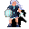{ .sprite } | [Feygard mountain scout](ortholion_guard5.md) | humanoid | 0 | 0 | 0 | 0 | 0 | – |
| { .sprite } | [Feygard patrol](feygard_patrol.md) | humanoid | 0 | 0 | 0 | 0 | 0 | – |
| { .sprite } | [Feygard patrol captain](feygard_patrol_captain.md) | humanoid | 0 | 0 | 0 | 0 | 0 | – |
| { .sprite } | [Feygard patrol guard](ortholion_guard3.md) | humanoid | 0 | 0 | 0 | 0 | 0 | – |
| { .sprite } | [Feygard patrol sergeant](g03_sergeant.md) | humanoid | 0 | 0 | 0 | 0 | 0 | – |
| { .sprite } | [Feygard road guard](guynmart_roadguard.md) | humanoid | 0 | 0 | 0 | 0 | 0 | – |
| { .sprite } | [Feygard scout](ortholion_guard2.md) | humanoid | 0 | 0 | 0 | 0 | 0 | – |
| { .sprite } | [Feygard scout](ortholion_guard6.md) | humanoid | 0 | 0 | 0 | 0 | 0 | – |
| { .sprite } | [Feygard soldier](patrol_roaming.md) | humanoid | 0 | 0 | 0 | 0 | 0 | – |
| { .sprite } | [Feygard soldier](patrol2_roaming.md) | humanoid | 0 | 0 | 0 | 0 | 0 | – |
| { .sprite } | [Feygard soldier](patrol2_captain.md) | humanoid | 0 | 0 | 0 | 0 | 0 | – |
| { .sprite } | [Fiamma](brightportsmith.md) | ? | 0 | 0 | 0 | 0 | 0 | – |
| { .sprite } | [Fish](brv_fish1.md) | animal | 0 | 0 | 0 | 0 | 0 | – |
| { .sprite } | [Fish](brv_fish2.md) | animal | 0 | 0 | 0 | 0 | 0 | – |
| { .sprite } | [Fish](guynmart_fish1.md) | animal | 0 | 0 | 0 | 0 | 0 | – |
| { .sprite } | [Fish](guynmart_fish2.md) | animal | 0 | 0 | 0 | 0 | 0 | – |
| { .sprite } | [Fish](ll2_fish1.md) | animal | 0 | 0 | 0 | 0 | 0 | – |
| { .sprite } | [Fish](ll2_fish2.md) | animal | 0 | 0 | 0 | 0 | 0 | – |
| { .sprite } | [Fish](ll2_fish3.md) | animal | 0 | 0 | 0 | 0 | 0 | – |
| { .sprite } | [Fish](ll2_fish4.md) | animal | 0 | 0 | 0 | 0 | 0 | – |
| { .sprite } | [Fish](ll2_fish5.md) | animal | 0 | 0 | 0 | 0 | 0 | – |
| { .sprite } | [Fish](ll2_fish6.md) | animal | 0 | 0 | 0 | 0 | 0 | – |
| { .sprite } | [Fish](ratdom_water_fish1.md) | ? | 0 | 0 | 0 | 0 | 0 | – |
| { .sprite } | [Fish](ratdom_water_fish2.md) | ? | 0 | 0 | 0 | 0 | 0 | – |
| 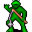{ .sprite } | [Fisherman](brv_fisher.md) | humanoid | 0 | 0 | 0 | 0 | 0 | – |
| 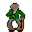{ .sprite } | [Fjoerkard](guynmart_drunkard1.md) | humanoid | 0 | 0 | 0 | 0 | 0 | – |
| { .sprite } | [Fjoerkard](guynmart_drunkard5.md) | humanoid | 0 | 0 | 0 | 0 | 0 | – |
| { .sprite } | [Flagstone sentry](flagstone_sentry.md) | humanoid | 0 | 0 | 0 | 0 | 0 | – |
| { .sprite } | [Flaming orb](ratdom_maze_boulder1.md) | ? | 0 | 0 | 0 | 0 | 0 | – |
| { .sprite } | [Flaming orb](ratdom_maze_boulder2.md) | ? | 0 | 0 | 0 | 0 | 0 | – |
| { .sprite } | [Flaming orb](ratdom_maze_boulder3.md) | ? | 0 | 0 | 0 | 0 | 0 | – |
| { .sprite } | [Flaming orb](ratdom_maze_boulder4.md) | ? | 0 | 0 | 0 | 0 | 0 | – |
| { .sprite } | [Flaming orb](ratdom_maze_boulder5.md) | ? | 0 | 0 | 0 | 0 | 0 | – |
| { .sprite } | [Florencia](brightportforenza1.md) | ? | 0 | 0 | 0 | 0 | 0 | – |
| { .sprite } | [Foaming Flask cook](foaming_flask_cook.md) | humanoid | 0 | 0 | 0 | 0 | 0 | – |
| { .sprite } | [Forenza](forenza_waytobrimhaven3.md) | humanoid | 0 | 0 | 0 | 0 | 0 | – |
| 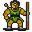{ .sprite } | [Forest guardian](lodar0_g.md) | ? | 0 | 0 | 0 | 0 | 0 | – |
| { .sprite } | [Forlin](brv_tavern1_guest2.md) | humanoid | 0 | 0 | 0 | 0 | 0 | – |
| { .sprite } | [Fraedro](ratdom_fraedro.md) | animal | 0 | 20 to 30 | 0 | 0 | 0 | – |
| { .sprite } | [Franz](brightportnpc4.md) | ? | 0 | 0 | 0 | 0 | 0 | – |
| { .sprite } | [Freen](freen.md) | humanoid | 0 | 0 | 0 | 0 | 0 | – |
| { .sprite } | [Freya](brightportarmor.md) | ? | 0 | 0 | 0 | 0 | 0 | – |
| { .sprite } | [Frosty](sullengard_cat.md) | ? | 0 | 0 | 0 | 0 | 0 | – |
| { .sprite } | [Fulus](fulus.md) | humanoid | 0 | 0 | 0 | 0 | 0 | – |
| { .sprite } | [Gabriel](gabriel.md) | ? | 0 | 0 | 0 | 0 | 0 | – |
| { .sprite } | [Gael](gael.md) | ? | 0 | 0 | 0 | 0 | 0 | – |
| { .sprite } | [Gaela](gaela.md) | humanoid | 0 | 0 | 0 | 0 | 0 | – |
| { .sprite } | [Gaelian](sullengard_gaelian.md) | humanoid | 0 | 0 | 0 | 0 | 0 | – |
| { .sprite } | [Gallain](gallain.md) | humanoid | 0 | 0 | 0 | 0 | 0 | – |
| { .sprite } | [Galmore sky hunter](eagle.md) | animal | 0 | 0 | 0 | 0 | 0 | – |
| { .sprite } | [Gambler](brv_blackjack_gambler1.md) | humanoid | 0 | 0 | 0 | 0 | 0 | – |
| { .sprite } | [Gambler](brv_blackjack_gambler2.md) | humanoid | 0 | 0 | 0 | 0 | 0 | – |
| { .sprite } | [Gamjee](gamjee_hidden.md) | ? | 0 | 0 | 0 | 0 | 0 | – |
| 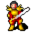{ .sprite } | [Gandoren](gandoren.md) | humanoid | 0 | 0 | 0 | 0 | 0 | – |
| { .sprite } | [Ganos](ganos.md) | humanoid | 0 | 0 | 0 | 0 | 0 | – |
| { .sprite } | [Garvhel](brightport_newcommander.md) | ? | 0 | 0 | 0 | 0 | 0 | – |
| { .sprite } | [Gauward](gauward.md) | humanoid | 0 | 0 | 0 | 0 | 0 | – |
| { .sprite } | [General Ortholion](ortholion.md) | humanoid | 0 | 0 | 0 | 0 | 0 | – |
| { .sprite } | [General Ortholion](ortholion_hidden.md) | humanoid | 0 | 0 | 0 | 0 | 0 | – |
| { .sprite } | [General's henchman](ortholion_guard_hidden.md) | humanoid | 0 | 0 | 0 | 0 | 0 | – |
| { .sprite } | [General's henchman](ortholion_guard1.md) | humanoid | 0 | 0 | 0 | 0 | 0 | – |
| 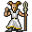{ .sprite } | [Ghost](ratdom_ghost.md) | ? | 0 | 0 | 0 | 0 | 0 | – |
| { .sprite } | [Ghost](ratdom_ghost1.md) | ? | 0 | 0 | 0 | 0 | 0 | – |
| { .sprite } | [Ghost](ratdom_ghost2.md) | ? | 0 | 0 | 0 | 0 | 0 | – |
| 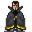{ .sprite } | [Ghost](ratdom_ghost3.md) | ? | 0 | 0 | 0 | 0 | 0 | – |
| { .sprite } | [Ghost](ratdom_ghost4.md) | ? | 0 | 0 | 0 | 0 | 0 | – |
| { .sprite } | [Gison](gison.md) | ? | 0 | 0 | 0 | 0 | 0 | – |
| { .sprite } | [Glade key](lakecave2_key.md) | ? | 0 | 0 | 0 | 0 | 0 | – |
| { .sprite } | [Glade key](lakecave2_key2.md) | ? | 0 | 0 | 0 | 0 | 0 | – |
| { .sprite } | [Glasforn](stoutford_innkeeper.md) | ? | 0 | 0 | 0 | 0 | 0 | – |
| { .sprite } | [Gnossath](brv_employer.md) | humanoid | 0 | 0 | 0 | 0 | 0 | – |
| { .sprite } | [Goat](goat_1.md) | ? | 0 | 0 | 0 | 0 | 0 | – |
| { .sprite } | [Goat](sullengard_goat_standing.md) | animal | 0 | 0 | 0 | 0 | 0 | – |
| { .sprite } | [Goat herder](sullengard_goat_herder.md) | humanoid | 0 | 0 | 0 | 0 | 0 | – |
| { .sprite } | [Godelieve](troll_hollow_godelieve.md) | humanoid | 0 | 0 | 0 | 0 | 0 | – |
| { .sprite } | [Godelieve](village_godelieve.md) | humanoid | 0 | 0 | 0 | 0 | 0 | – |
| { .sprite } | [Godelieve](village_godelieve_hidden.md) | humanoid | 0 | 0 | 0 | 0 | 0 | – |
| { .sprite } | [Godfrey](sullengard_innkeeper.md) | humanoid | 0 | 0 | 0 | 0 | 0 | – |
| { .sprite } | [Godoe](godoe1.md) | humanoid | 0 | 0 | 0 | 0 | 0 | – |
| { .sprite } | [Godoe](godoe2.md) | humanoid | 0 | 0 | 0 | 0 | 0 | – |
| { .sprite } | [Godwin](troll_hollow_godwin.md) | humanoid | 0 | 0 | 0 | 0 | 0 | – |
| { .sprite } | [Godwin](village_godwin.md) | humanoid | 0 | 0 | 0 | 0 | 0 | – |
|  | [Gold](guynmart_reward1.md) | ? | 0 | 0 | 0 | 0 | 0 | – |
| { .sprite } | [Golden marble](guynmart_marble4.md) | ? | 0 | 0 | 0 | 0 | 0 | – |
| 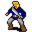{ .sprite } | [Gorwath](gorwath.md) | humanoid | 0 | 0 | 0 | 0 | 0 | – |
| { .sprite } | [Grabby](aidem_jail_grabby.md) | humanoid | 0 | 0 | 0 | 0 | 0 | – |
| { .sprite } | [Grabby comrade](guild04_rebcomrade_2.md) | humanoid | 0 | 0 | 0 | 0 | 0 | – |
| 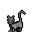{ .sprite } | [Gray cat](gray_cat.md) | animal | 0 | 0 | 0 | 0 | 0 | – |
| { .sprite } | [Grazia](sull_ravine_grazia.md) | humanoid | 0 | 0 | 0 | 0 | 0 | – |
| { .sprite } | [Grazia](sullengard_grazia.md) | humanoid | 0 | 0 | 0 | 0 | 0 | – |
| { .sprite } | [Grazing horse](graze_horse_left.md) | animal | 0 | 0 | 0 | 0 | 0 | – |
| { .sprite } | [Grazing horse](grazing_horse_right.md) | animal | 0 | 0 | 0 | 0 | 0 | – |
| { .sprite } | [Greedy](aidem_jail_greedy.md) | humanoid | 0 | 0 | 0 | 0 | 0 | – |
| { .sprite } | [Greedy comrade](guild04_rebcomrade_1.md) | humanoid | 0 | 0 | 0 | 0 | 0 | – |
| { .sprite } | [Green marble](guynmart_marble1.md) | ? | 0 | 0 | 0 | 0 | 0 | – |
| { .sprite } | [Grimion](grimion.md) | humanoid | 0 | 0 | 0 | 0 | 0 | – |
| { .sprite } | [Gruiik](ratdom_mikhail.md) | ? | 0 | 0 | 0 | 0 | 0 | – |
| { .sprite } | [Gruil](gruil.md) | humanoid | 0 | 0 | 0 | 0 | 0 | – |
| 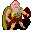{ .sprite } | [Grumpy Vilegard villager](grumpy_vilegard_villager.md) | humanoid | 0 | 0 | 0 | 0 | 0 | – |
| { .sprite } | [Grumpy citizen](grumpy_citizen.md) | humanoid | 0 | 0 | 0 | 0 | 0 | – |
| { .sprite } | [Guard](brv_tavern_west_guard.md) | humanoid | 0 | 0 | 0 | 0 | 0 | – |
| { .sprite } | [Guard](brv_exit_guard.md) | ? | 0 | 0 | 0 | 0 | 0 | – |
| { .sprite } | [Guard](brv_prison_guard.md) | ? | 0 | 0 | 0 | 0 | 0 | – |
| { .sprite } | [Guard](brv_shop_guard.md) | ? | 0 | 0 | 0 | 0 | 0 | – |
| { .sprite } | [Guard](guard_advent.md) | ? | 0 | 0 | 0 | 0 | 0 | – |
| { .sprite } | [Guard](guard.md) | humanoid | 0 | 0 | 0 | 0 | 0 | – |
| { .sprite } | [Guard](flagstone_guard.md) | ? | 0 | 0 | 0 | 0 | 0 | – |
| { .sprite } | [Guard](crossroads_backguard.md) | humanoid | 0 | 0 | 0 | 0 | 0 | – |
| { .sprite } | [Guard](crossroads_guard.md) | humanoid | 0 | 0 | 0 | 0 | 0 | – |
| { .sprite } | [Guard](crossroads_sleepguard.md) | humanoid | 0 | 0 | 0 | 0 | 0 | – |
| { .sprite } | [Guard](loneford_guard0.md) | humanoid | 0 | 0 | 0 | 0 | 0 | – |
| { .sprite } | [Guard](loneford_wellguard.md) | humanoid | 0 | 0 | 0 | 0 | 0 | – |
| { .sprite } | [Guard](remgard_g1.md) | humanoid | 0 | 0 | 0 | 0 | 0 | – |
| { .sprite } | [Guard](remgard_g2.md) | humanoid | 0 | 0 | 0 | 0 | 0 | – |
| { .sprite } | [Guard](remgard_g3.md) | humanoid | 0 | 0 | 0 | 0 | 0 | – |
| { .sprite } | [Guard](charwd_guard.md) | ? | 0 | 0 | 0 | 0 | 0 | – |
| { .sprite } | [Guard 1](brightportguardcrate1.md) | ? | 0 | 0 | 0 | 0 | 0 | – |
| { .sprite } | [Guard 2](brightportguardcrate2.md) | ? | 0 | 0 | 0 | 0 | 0 | – |
| { .sprite } | [Guard captain](warden.md) | humanoid | 0 | 0 | 0 | 0 | 0 | – |
| { .sprite } | [Guard dog](guard_dog.md) | animal | 0 | 0 | 0 | 0 | 0 | – |
| { .sprite } | [Guest](brv_tavern_west_guest.md) | humanoid | 0 | 0 | 0 | 0 | 0 | – |
| { .sprite } | [Guest](brv_inn_guest.md) | ? | 0 | 0 | 0 | 0 | 0 | – |
| { .sprite } | [Gunfryk](brightport_gunfrykstill.md) | ? | 0 | 0 | 0 | 0 | 0 | – |
| { .sprite } | [Gunther](brightportbakery3.md) | ? | 0 | 0 | 0 | 0 | 0 | – |
| { .sprite } | [Guynmart](guynmart.md) | humanoid | 0 | 0 | 0 | 0 | 0 | – |
| { .sprite } | [Guynmart elite guard](guynmart_pguard.md) | humanoid | 0 | 0 | 0 | 0 | 0 | – |
| { .sprite } | [Guynmart elite guard](guynmart_pguard2.md) | humanoid | 0 | 0 | 0 | 0 | 0 | – |
| { .sprite } | [Guynmart elite guard](guynmart_pguard3.md) | humanoid | 0 | 0 | 0 | 0 | 0 | – |
| { .sprite } | [Guynmart guard](guynmart_guard_guide.md) | humanoid | 0 | 0 | 0 | 0 | 0 | – |
| { .sprite } | [Guynmart guard](guynmart_gguard.md) | humanoid | 0 | 0 | 0 | 0 | 0 | – |
| { .sprite } | [Guynmart guard](guynmart_player.md) | humanoid | 0 | 0 | 0 | 0 | 0 | – |
| { .sprite } | [Guynmart guard](guynmart_mguard.md) | humanoid | 0 | 0 | 0 | 0 | 0 | – |
| { .sprite } | [Guynmart guard](guynmart_wguard.md) | humanoid | 0 | 0 | 0 | 0 | 0 | – |
| { .sprite } | [Guynmart guard](guynmart_guard_store.md) | humanoid | 0 | 0 | 0 | 0 | 0 | – |
| { .sprite } | [Guynmart guard](guynmart_guard_arms.md) | humanoid | 0 | 0 | 0 | 0 | 0 | – |
| { .sprite } | [Guynmart guard](guynmart_tguard.md) | humanoid | 0 | 0 | 0 | 0 | 0 | – |
| { .sprite } | [Guynmart guard](guynmart_tguard2.md) | humanoid | 0 | 0 | 0 | 0 | 0 | – |
| { .sprite } | [Gwendolyn](remgard_gwendolyn.md) | ? | 0 | 0 | 0 | 0 | 0 | – |
| { .sprite } | [Gwinnett](sullengard_courtyard_girl.md) | ? | 0 | 0 | 0 | 0 | 0 | – |
| { .sprite } | [Gyra](stn_gyra.md) | humanoid | 0 | 0 | 0 | 0 | 0 | – |
| { .sprite } | [Gyra](stn_gyra1.md) | humanoid | 0 | 0 | 0 | 0 | 0 | – |
| { .sprite } | [Gyra](stn_gyra2.md) | humanoid | 0 | 0 | 0 | 0 | 0 | – |
| { .sprite } | [Gyra](stn_gyra3.md) | humanoid | 0 | 0 | 0 | 0 | 0 | – |
| { .sprite } | [Gyra](stn_gyra4.md) | humanoid | 0 | 0 | 0 | 0 | 0 | – |
| { .sprite } | [Gyra](stn_gyra5.md) | humanoid | 0 | 0 | 0 | 0 | 0 | – |
| { .sprite } | [Gyra](stn_gyra6.md) | humanoid | 0 | 0 | 0 | 0 | 0 | – |
| { .sprite } | [Gyra](stn_gyra7.md) | humanoid | 0 | 0 | 0 | 0 | 0 | – |
| { .sprite } | [Gyra](stn_gyra8.md) | humanoid | 0 | 0 | 0 | 0 | 0 | – |
| { .sprite } | [Gyra](stn_gyra9.md) | humanoid | 0 | 0 | 0 | 0 | 0 | – |
| { .sprite } | [Gyra](stn_gyraA.md) | humanoid | 0 | 0 | 0 | 0 | 0 | – |
| { .sprite } | [Gyra](stn_gyraB.md) | humanoid | 0 | 0 | 0 | 0 | 0 | – |
| { .sprite } | [Gyra](stn_gyraC.md) | humanoid | 0 | 0 | 0 | 0 | 0 | – |
| { .sprite } | [Hadena](sullengard_cabin_wife.md) | humanoid | 0 | 0 | 0 | 0 | 0 | – |
| { .sprite } | [Hadracor](hadracor.md) | humanoid | 0 | 0 | 0 | 0 | 0 | – |
| { .sprite } | [Halvor](halvor.md) | ? | 0 | 0 | 0 | 0 | 0 | – |
| { .sprite } | [Hamerick](sullengard_hamerick.md) | humanoid | 0 | 0 | 0 | 0 | 0 | – |
| { .sprite } | [Hannah](guynmart_hannah.md) | humanoid | 0 | 0 | 0 | 0 | 0 | – |
| { .sprite } | [Hannah](guynmart_hannah2.md) | humanoid | 0 | 0 | 0 | 0 | 0 | – |
| { .sprite } | [Hannah](guynmart_hannah3.md) | humanoid | 0 | 0 | 0 | 0 | 0 | – |
| { .sprite } | [Herald](guynmart_herold.md) | humanoid | 0 | 0 | 0 | 0 | 0 | – |
| { .sprite } | [Herec](herec.md) | humanoid | 0 | 0 | 0 | 0 | 0 | – |
| { .sprite } | [Hettah](brv_employee_wife.md) | humanoid | 0 | 0 | 0 | 0 | 0 | – |
| { .sprite } | [Hettah](brv_employee_wife2.md) | humanoid | 0 | 0 | 0 | 0 | 0 | – |
| { .sprite } | [Hjaldar](hjaldar.md) | humanoid | 0 | 0 | 0 | 0 | 0 | – |
| { .sprite } | [Hofala](guynmart_cook.md) | humanoid | 0 | 0 | 0 | 0 | 0 | – |
| { .sprite } | [Honey bee](honey_bee.md) | ? | 0 | 0 | 0 | 0 | 0 | – |
| { .sprite } | [Horfael](ratdom_rat_pub_owner.md) | ? | 0 | 0 | 0 | 0 | 0 | – |
| { .sprite } | [Horn player](ratdom_skel_horn.md) | undead | 0 | 0 | 0 | 0 | 0 | – |
| { .sprite } | [Horn player](ratdom_skel_horn1.md) | undead | 0 | 0 | 0 | 0 | 0 | – |
| { .sprite } | [Horn player](ratdom_skel_horn2.md) | undead | 0 | 0 | 0 | 0 | 0 | – |
| { .sprite } | [Horn player](erwyn_skel_hornet.md) | undead | 0 | 0 | 0 | 0 | 0 | – |
| { .sprite } | [Horse](guynmart_horse.md) | animal | 0 | 0 | 0 | 0 | 0 | – |
| { .sprite } | [Horse](stn_horse.md) | animal | 0 | 0 | 0 | 0 | 0 | – |
| { .sprite } | [Hortensia](brightportbakery.md) | ? | 0 | 0 | 0 | 0 | 0 | – |
| { .sprite } | [Howkin](deebo_orchard_deebo_son.md) | humanoid | 0 | 0 | 0 | 0 | 0 | – |
| { .sprite } | [Ice berries](wild_berry2.md) | animal | 0 | 0 | 0 | 0 | 0 | – |
| { .sprite } | [Iducus](iducus.md) | humanoid | 0 | 0 | 0 | 0 | 0 | – |
| { .sprite } | [Ingeram](sullengard_ingeram.md) | humanoid | 0 | 0 | 0 | 0 | 0 | – |
| { .sprite } | [Ingus](ingus.md) | humanoid | 0 | 0 | 0 | 0 | 0 | – |
| { .sprite } | [Isobel](sutdover_fisherman.md) | humanoid | 0 | 0 | 0 | 0 | 0 | – |
| { .sprite } | [Isolated man](isolated_man.md) | humanoid | 0 | 0 | 0 | 0 | 0 | – |
| { .sprite } | [Ito](brv_guard_deputy.md) | humanoid | 0 | 0 | 0 | 0 | 0 | – |
| { .sprite } | [Jakrar](jakrar.md) | humanoid | 0 | 0 | 0 | 0 | 0 | – |
| { .sprite } | [Jalmor](brightportnpc11.md) | ? | 0 | 0 | 0 | 0 | 0 | – |
| { .sprite } | [Jan](jan.md) | humanoid | 0 | 0 | 0 | 0 | 0 | – |
| { .sprite } | [Jan](stoutford_farmer_jan.md) | ? | 0 | 0 | 0 | 0 | 0 | – |
| { .sprite } | [Janach](janach.md) | humanoid | 0 | 0 | 0 | 0 | 0 | – |
| { .sprite } | [Jannus](brightportbakery1.md) | ? | 0 | 0 | 0 | 0 | 0 | – |
| { .sprite } | [Janwick](brightportnpc8.md) | ? | 0 | 0 | 0 | 0 | 0 | – |
| { .sprite } | [Jellyfish](ll2_jelly1.md) | animal | 0 | 0 | 0 | 0 | 0 | – |
| { .sprite } | [Jen](stoutford_farmer_jen.md) | ? | 0 | 0 | 0 | 0 | 0 | – |
| { .sprite } | [Jerelin](jerelin.md) | undead | 0 | 0 | 0 | 0 | 0 | – |
| { .sprite } | [Jerelin](jerelin_b.md) | undead | 0 | 0 | 0 | 0 | 0 | – |
| { .sprite } | [Jern](prim_bar_regular.md) | humanoid | 0 | 0 | 0 | 0 | 0 | – |
| { .sprite } | [Jhaeld](lae_jhaeld1.md) | humanoid | 0 | 0 | 0 | 0 | 0 | – |
| { .sprite } | [Jhaeld](lae_jhaeld2.md) | humanoid | 0 | 0 | 0 | 0 | 0 | – |
| { .sprite } | [Jhaeld](jhaeld.md) | humanoid | 0 | 0 | 0 | 0 | 0 | – |
| { .sprite } | [Jolnor](jolnor.md) | humanoid | 0 | 0 | 0 | 0 | 0 | – |
| { .sprite } | [Jueth](jueth.md) | humanoid | 0 | 0 | 0 | 0 | 0 | – |
| { .sprite } | [Juttarka](juttarka.md) | ? | 0 | 0 | 0 | 0 | 0 | – |
| { .sprite } | [Kalypso](kalypso.md) | humanoid | 0 | 0 | 0 | 0 | 0 | – |
| { .sprite } | [Kantya](kantya.md) | ? | 0 | 0 | 0 | 0 | 0 | – |
| { .sprite } | [Kaori](kaori.md) | humanoid | 0 | 0 | 0 | 0 | 0 | – |
| { .sprite } | [Kayla](kayla.md) | humanoid | 0 | 0 | 0 | 0 | 0 | – |
| { .sprite } | [Kazaul acolyte](kazaul_acolyte.md) | ? | 0 | 0 | 0 | 0 | 0 | – |
| { .sprite } | [Kealwea](sullengard_priest.md) | humanoid | 0 | 0 | 0 | 0 | 0 | – |
| { .sprite } | [Kendelow](kendelow.md) | humanoid | 0 | 0 | 0 | 0 | 0 | – |
| { .sprite } | [Keneg](keneg.md) | humanoid | 0 | 0 | 0 | 0 | 0 | – |
| { .sprite } | [Kha'zaan Porter](porter.md) | undead | 0 | 0 | 0 | 0 | 0 | – |
| { .sprite } | [Khorailla](khorailla.md) | ? | 0 | 0 | 0 | 0 | 0 | – |
| { .sprite } | [Khorailla](khorailla_cheddar.md) | ? | 0 | 0 | 0 | 0 | 0 | – |
| { .sprite } | [Khorand](khorand.md) | humanoid | 0 | 0 | 0 | 0 | 0 | – |
| { .sprite } | [Kizzo](loneford_tavern_patron.md) | humanoid | 0 | 0 | 0 | 0 | 0 | – |
| { .sprite } | [Knight of Elythom](burhczyd1e.md) | humanoid | 0 | 0 | 0 | 0 | 0 | – |
| { .sprite } | [Knight of Elythom](burhczyd2e.md) | humanoid | 0 | 0 | 0 | 0 | 0 | – |
| { .sprite } | [Knight of Elythom](burhczyd3e.md) | humanoid | 0 | 0 | 0 | 0 | 0 | – |
| { .sprite } | [Knight of Elythom](burhczyd4e.md) | humanoid | 0 | 0 | 0 | 0 | 0 | – |
| { .sprite } | [Knight of Elythom](burhczyd5e.md) | humanoid | 0 | 0 | 0 | 0 | 0 | – |
| { .sprite } | [Knight of Elythom](burhczyd6e.md) | humanoid | 0 | 0 | 0 | 0 | 0 | – |
| { .sprite } | [Knight of Elythom](burhczyd7e.md) | humanoid | 0 | 0 | 0 | 0 | 0 | – |
| { .sprite } | [Knight of Elythom](burhczyd8e.md) | humanoid | 0 | 0 | 0 | 0 | 0 | – |
| { .sprite } | [Knight of Elythom](burhczyd9e.md) | humanoid | 0 | 0 | 0 | 0 | 0 | – |
| { .sprite } | [Knight of Elythom](burhczyd10e.md) | humanoid | 0 | 0 | 0 | 0 | 0 | – |
| { .sprite } | [Knight of Elythom](burhczyd11e.md) | humanoid | 0 | 0 | 0 | 0 | 0 | – |
| { .sprite } | [Knight of Elythom](burhczyd12e.md) | humanoid | 0 | 0 | 0 | 0 | 0 | – |
| { .sprite } | [Knight of Elythom](burhczyd13e.md) | humanoid | 0 | 0 | 0 | 0 | 0 | – |
| { .sprite } | [Knight of Elythom](burhczyd14e.md) | humanoid | 0 | 0 | 0 | 0 | 0 | – |
| { .sprite } | [Knight of Elythom](burhczyd15e.md) | humanoid | 0 | 0 | 0 | 0 | 0 | – |
| { .sprite } | [Knight of Elythom](burhczyd16e.md) | humanoid | 0 | 0 | 0 | 0 | 0 | – |
| { .sprite } | [Knight of Elythom](burhczyd17e.md) | humanoid | 0 | 0 | 0 | 0 | 0 | – |
| { .sprite } | [Knight of Elythom](burhczyd18e.md) | humanoid | 0 | 0 | 0 | 0 | 0 | – |
| { .sprite } | [Knight of Elythom](burhczyd19e.md) | humanoid | 0 | 0 | 0 | 0 | 0 | – |
| { .sprite } | [Knight of Elythom](burhczyd20e.md) | humanoid | 0 | 0 | 0 | 0 | 0 | – |
| { .sprite } | [Knight of Elythom](burhczyd21e.md) | humanoid | 0 | 0 | 0 | 0 | 0 | – |
| { .sprite } | [Knight of Elythom](burhczyd22e.md) | humanoid | 0 | 0 | 0 | 0 | 0 | – |
| { .sprite } | [Knight of Elythom](elythom_kn1.md) | humanoid | 0 | 0 | 0 | 0 | 0 | – |
| { .sprite } | [Knight of Elythom](elythom_kn2.md) | humanoid | 0 | 0 | 0 | 0 | 0 | – |
| { .sprite } | [Krell](krell.md) | humanoid | 0 | 0 | 0 | 0 | 0 | – |
| { .sprite } | [Kuldan](kuldan.md) | humanoid | 0 | 0 | 0 | 0 | 0 | – |
| { .sprite } | [Kuldan's guard](kuldan_guard.md) | humanoid | 0 | 0 | 0 | 0 | 0 | – |
| { .sprite } | [Laborer](brightportbakeryoutside2.md) | ? | 0 | 0 | 0 | 0 | 0 | – |
| { .sprite } | [Laecca](laecca.md) | humanoid | 0 | 0 | 0 | 0 | 0 | – |
| { .sprite } | [Laede](laede.md) | humanoid | 0 | 0 | 0 | 0 | 0 | – |
| { .sprite } | [Laeroth prisoner](lae_prisoner.md) | undead | 0 | 0 | 0 | 0 | 0 | – |
| { .sprite } | [Laeroth prisoner](lae_prisoner1.md) | undead | 0 | 0 | 0 | 0 | 0 | – |
| { .sprite } | [Laeroth prisoner](lae_prisoner2.md) | undead | 0 | 0 | 0 | 0 | 0 | – |
| { .sprite } | [Laeroth prisoner](lae_prisoner2a.md) | undead | 0 | 0 | 0 | 0 | 0 | – |
| { .sprite } | [Laeroth prisoner](lae_prisoner2i.md) | undead | 0 | 0 | 0 | 0 | 0 | – |
| { .sprite } | [Laeroth prisoner](lae_prisoner3.md) | undead | 0 | 0 | 0 | 0 | 0 | – |
| { .sprite } | [Laeroth prisoner](lae_prisoner3a.md) | undead | 0 | 0 | 0 | 0 | 0 | – |
| { .sprite } | [Laeroth prisoner](lae_prisoner3i.md) | undead | 0 | 0 | 0 | 0 | 0 | – |
| { .sprite } | [Laeroth prisoner](lae_prisoner4.md) | undead | 0 | 0 | 0 | 0 | 0 | – |
| { .sprite } | [Laeroth prisoner](lae_prisoner4a.md) | undead | 0 | 0 | 0 | 0 | 0 | – |
| { .sprite } | [Laeroth prisoner](lae_prisoner4i.md) | undead | 0 | 0 | 0 | 0 | 0 | – |
| { .sprite } | [Lamberta](sullengard_lamberta.md) | humanoid | 0 | 0 | 0 | 0 | 0 | – |
| { .sprite } | [Landa](landa.md) | humanoid | 0 | 0 | 0 | 0 | 0 | – |
| { .sprite } | [Larni](larni.md) | humanoid | 0 | 0 | 0 | 0 | 0 | – |
| { .sprite } | [Laurenz](brightportstudent10.md) | ? | 0 | 0 | 0 | 0 | 0 | – |
| { .sprite } | [Lediofa](fungi_rescued.md) | humanoid | 0 | 0 | 0 | 0 | 0 | – |
| { .sprite } | [Lediofa](fungi_rescued2.md) | humanoid | 0 | 0 | 0 | 0 | 0 | – |
| { .sprite } | [Leofric](leofric.md) | humanoid | 0 | 0 | 0 | 0 | 0 | – |
| { .sprite } | [Leofric](leofric_remgard.md) | humanoid | 0 | 0 | 0 | 0 | 0 | – |
| { .sprite } | [Leonid](leonid.md) | humanoid | 0 | 0 | 0 | 0 | 0 | – |
| { .sprite } | [Leorio](brightport_gunfrykassistant.md) | ? | 0 | 0 | 0 | 0 | 0 | – |
| { .sprite } | [Leta](leta.md) | humanoid | 0 | 0 | 0 | 0 | 0 | – |
| { .sprite } | [Leta's son](leta_child.md) | humanoid | 0 | 0 | 0 | 0 | 0 | – |
| { .sprite } | [Lethenlor](lethenlor.md) | ? | 0 | 0 | 0 | 0 | 0 | – |
| { .sprite } | [Lethgar miner ghost](lethgar_miner_ghost2.md) | humanoid | 0 | 0 | 0 | 0 | 0 | – |
| { .sprite } | [Lethgar miner ghost](lethgar_miner_ghost.md) | humanoid | 0 | 0 | 0 | 0 | 0 | – |
| { .sprite } | [Lethgar slave ghost](lethgar_female_ghost.md) | humanoid | 0 | 0 | 0 | 0 | 0 | – |
| { .sprite } | [Leukosia](sirene3.md) | humanoid | 0 | 0 | 0 | 0 | 0 | – |
| { .sprite } | [Liberated Elytharan ghost](elytharan_liberated_ghost.md) | ghost | 0 | 0 | 0 | 0 | 0 | – |
| { .sprite } | [Liberated Elytharan ghost](elytharan_liberated_ghost2.md) | ghost | 0 | 0 | 0 | 0 | 0 | – |
| { .sprite } | [Ligeia](sirene2.md) | humanoid | 0 | 0 | 0 | 0 | 0 | – |
| { .sprite } | [Lindauer](sullengard_cat_seeker.md) | ? | 0 | 0 | 0 | 0 | 0 | – |
| { .sprite } | [Little Hettar](hettar.md) | humanoid | 0 | 0 | 0 | 0 | 0 | – |
| { .sprite } | [Lleglaris](lleglaris.md) | ? | 0 | 0 | 0 | 0 | 0 | – |
| { .sprite } | [Local artist](stoutford_artist.md) | ? | 0 | 0 | 0 | 0 | 0 | – |
| { .sprite } | [Local citizen](sullengard_citizen.md) | ? | 0 | 0 | 0 | 0 | 0 | – |
| { .sprite } | [Lodar](lodar.md) | ? | 0 | 0 | 0 | 0 | 0 | – |
| { .sprite } | [Loirash](ratdom_bone_collector.md) | ? | 0 | 0 | 0 | 0 | 0 | – |
| { .sprite } | [Lord Berbane](berbane.md) | ? | 0 | 0 | 0 | 0 | 0 | – |
| { .sprite } | [Lost Traveler](aidem_camp_lost_traveler.md) | humanoid | 0 | 0 | 0 | 0 | 0 | – |
| { .sprite } | [Lost traveler](sullengard_inn_traveler.md) | humanoid | 0 | 0 | 0 | 0 | 0 | – |
| { .sprite } | [Loudmouth](brightportthieves.md) | ? | 0 | 0 | 0 | 0 | 0 | – |
| { .sprite } | [Lovis](guynmart_lovis.md) | humanoid | 0 | 0 | 0 | 0 | 0 | – |
| { .sprite } | [Lovis](guynmart_lovis2.md) | humanoid | 0 | 0 | 0 | 0 | 0 | – |
| { .sprite } | [Lowyna](lowyna.md) | ? | 0 | 0 | 0 | 0 | 0 | – |
| { .sprite } | [Lutenist](ratdom_skel_lute.md) | undead | 0 | 0 | 0 | 0 | 0 | – |
| { .sprite } | [Lutenist](ratdom_skel_lute1.md) | undead | 0 | 0 | 0 | 0 | 0 | – |
| { .sprite } | [Lutenist](ratdom_skel_lute2.md) | undead | 0 | 0 | 0 | 0 | 0 | – |
| { .sprite } | [Lutenist](erwyn_skel_lute.md) | undead | 0 | 0 | 0 | 0 | 0 | – |
| { .sprite } | [Lyra, the centaur](lae_centaur8.md) | humanoid | 0 | 0 | 0 | 0 | 0 | – |
| { .sprite } | [Lyre](brv_wh_item_42.md) | ? | 0 | 0 | 0 | 0 | 0 | – |
| { .sprite } | [Lytwing](lytwing_fallhaven.md) | humanoid | 0 | 0 | 0 | 0 | 0 | – |
| { .sprite } | [Madame Mim](swamp_witch_shop.md) | humanoid | 0 | 0 | 0 | 0 | 0 | – |
| { .sprite } | [Maddalena](sullengard_town_clerk.md) | ? | 0 | 0 | 0 | 0 | 0 | – |
| { .sprite } | [Maelf](maelf.md) | humanoid | 0 | 0 | 0 | 0 | 0 | – |
| { .sprite } | [Maevalia](maevalia.md) | ? | 0 | 0 | 0 | 0 | 0 | – |
| { .sprite } | [Maid](guynmart_maid.md) | humanoid | 0 | 0 | 0 | 0 | 0 | – |
| { .sprite } | [Mara](mara.md) | humanoid | 0 | 0 | 0 | 0 | 0 | – |
| { .sprite } | [Mariora](sullengard_mariora.md) | humanoid | 0 | 0 | 0 | 0 | 0 | – |
| { .sprite } | [Matpat](sullengard_matpat.md) | humanoid | 0 | 0 | 0 | 0 | 0 | – |
| { .sprite } | [Mayor Ale](sullengard_mayor.md) | humanoid | 0 | 0 | 0 | 0 | 0 | – |
| { .sprite } | [Mazeg](mazeg.md) | humanoid | 0 | 0 | 0 | 0 | 0 | – |
| { .sprite } | [Mean cat](rosmara_cat.md) | ? | 0 | 0 | 0 | 0 | 0 | – |
| { .sprite } | [Melona](melona.md) | ? | 0 | 0 | 0 | 0 | 0 | – |
| { .sprite } | [Mermaid](river_mermaid.md) | humanoid | 0 | 0 | 0 | 0 | 0 | – |
| { .sprite } | [Mienn](mienn.md) | humanoid | 0 | 0 | 0 | 0 | 0 | – |
| { .sprite } | [Mikhail](mikhail.md) | humanoid | 0 | 0 | 0 | 0 | 0 | – |
| { .sprite } | [Milena](brightportnpc1.md) | ? | 0 | 0 | 0 | 0 | 0 | – |
| { .sprite } | [Minarra](minarra.md) | humanoid | 0 | 0 | 0 | 0 | 0 | – |
| { .sprite } | [Miri](dds_miri.md) | humanoid | 0 | 0 | 0 | 0 | 0 | – |
| { .sprite } | [Mordred](brightport_huntingdog.md) | animal | 0 | 0 | 0 | 0 | 0 | – |
| { .sprite } | [Morgisia](morgisia.md) | humanoid | 0 | 0 | 0 | 0 | 0 | – |
| { .sprite } | [Moriath](moriath.md) | humanoid | 0 | 0 | 0 | 0 | 0 | – |
| { .sprite } | [Morvath](morvath.md) | undead | 0 | 0 | 0 | 0 | 0 | – |
| { .sprite } | [Mother](brv_villager12.md) | ? | 0 | 0 | 0 | 0 | 0 | – |
| { .sprite } | [Mourning woman](dds_mourning_woman.md) | humanoid | 0 | 0 | 0 | 0 | 0 | – |
| { .sprite } | [Mourning woman](chapelgoer.md) | humanoid | 0 | 0 | 0 | 0 | 0 | – |
| { .sprite } | [Moyra](moyra.md) | humanoid | 0 | 0 | 0 | 0 | 0 | – |
| { .sprite } | [Mustura](brv_guard_captain.md) | ? | 0 | 0 | 0 | 0 | 0 | – |
| { .sprite } | [Myrelis](mg_myrelis.md) | humanoid | 0 | 0 | 0 | 0 | 0 | – |
| { .sprite } | [Mysterious green something](brv_wh_item_45.md) | ? | 0 | 0 | 0 | 0 | 0 | – |
| { .sprite } | [Mysterious lizard creature](brightport_emyro.md) | ? | 0 | 0 | 0 | 0 | 0 | – |
| { .sprite } | [Nanath](nanath.md) | humanoid | 0 | 0 | 0 | 0 | 0 | – |
| { .sprite } | [Nanette](sullengard_nanette.md) | humanoid | 0 | 0 | 0 | 0 | 0 | – |
| { .sprite } | [Narael](narael.md) | humanoid | 0 | 0 | 0 | 0 | 0 | – |
| { .sprite } | [Nicolo](brightport_councilor.md) | ? | 0 | 0 | 0 | 0 | 0 | – |
| { .sprite } | [Nightmare](guynmart_mare0.md) | ? | 0 | 0 | 0 | 0 | 0 | – |
| { .sprite } | [Nimael](nimael.md) | ? | 0 | 0 | 0 | 0 | 0 | – |
| { .sprite } | [Nocmar](nocmar.md) | humanoid | 0 | 0 | 0 | 0 | 0 | – |
| { .sprite } | [Nor agent](brightport_agent.md) | ? | 0 | 0 | 0 | 0 | 0 | – |
| { .sprite } | [Norath](norath.md) | humanoid | 0 | 0 | 0 | 0 | 0 | – |
| { .sprite } | [Norgothla](guynmart_cguard.md) | humanoid | 0 | 0 | 0 | 0 | 0 | – |
| { .sprite } | [Norgothla](guynmart_cguard2.md) | humanoid | 0 | 0 | 0 | 0 | 0 | – |
| { .sprite } | [Nuik](guynmart_nuik.md) | humanoid | 0 | 0 | 0 | 0 | 0 | – |
| { .sprite } | [Oakleigh](sullengard_bartender.md) | humanoid | 0 | 0 | 0 | 0 | 0 | – |
| { .sprite } | [Odair](odair.md) | humanoid | 0 | 0 | 0 | 0 | 0 | – |
| { .sprite } | [Odilia](troll_hollow_odilia.md) | humanoid | 0 | 0 | 0 | 0 | 0 | – |
| { .sprite } | [Odilia](village_odilia.md) | humanoid | 0 | 0 | 0 | 0 | 0 | – |
| { .sprite } | [Odirath](stoutford_armorer.md) | humanoid | 0 | 0 | 0 | 0 | 0 | – |
| { .sprite } | [Oegyth crystal](mg2_cavea_home.md) | construct | 0 | 0 | 0 | 0 | 0 | – |
| { .sprite } | [Oegyth crystal](mg2_cavea_throdna.md) | construct | 0 | 0 | 0 | 0 | 0 | – |
| { .sprite } | [Ogam](ogam.md) | humanoid | 0 | 0 | 0 | 0 | 0 | – |
| { .sprite } | [Ogea](brv_villager3.md) | humanoid | 0 | 0 | 0 | 0 | 0 | – |
| { .sprite } | [Olav](guynmart_olav.md) | humanoid | 0 | 0 | 0 | 0 | 0 | – |
| { .sprite } | [Old Blue](blue_cat.md) | animal | 0 | 0 | 0 | 0 | 0 | – |
| { .sprite } | [Old Leta](old_leta.md) | humanoid | 0 | 0 | 0 | 0 | 0 | – |
| { .sprite } | [Old Oromir](old_oromir.md) | humanoid | 0 | 0 | 0 | 0 | 0 | – |
| { .sprite } | [Old Vilegard villager](old_vilegard_villager.md) | humanoid | 0 | 0 | 0 | 0 | 0 | – |
| { .sprite } | [Old citizen](old_citizen.md) | humanoid | 0 | 0 | 0 | 0 | 0 | – |
| { .sprite } | [Old farmer](old_farmer.md) | humanoid | 0 | 0 | 0 | 0 | 0 | – |
| { .sprite } | [Old farmer](stoutford_farmer3.md) | humanoid | 0 | 0 | 0 | 0 | 0 | – |
| { .sprite } | [Old hermit](dds_oldhermit.md) | humanoid | 0 | 0 | 0 | 0 | 0 | – |
| { .sprite } | [Old man](old_man.md) | humanoid | 0 | 0 | 0 | 0 | 0 | – |
| { .sprite } | [Old man](guynmart_wise.md) | humanoid | 0 | 0 | 0 | 0 | 0 | – |
| { .sprite } | [Old woman](stoutford_commoner4.md) | humanoid | 0 | 0 | 0 | 0 | 0 | – |
| { .sprite } | [Old, worn cape](brv_wh_item_46.md) | ? | 0 | 0 | 0 | 0 | 0 | – |
| { .sprite } | [Ollie](sullengard_newborn_baby.md) | humanoid | 0 | 0 | 0 | 0 | 0 | – |
| { .sprite } | [Oluag](oluag.md) | humanoid | 0 | 0 | 0 | 0 | 0 | – |
| { .sprite } | [Orange cat](orange_cat.md) | animal | 0 | 0 | 0 | 0 | 0 | – |
| { .sprite } | [Orion, the centaur](lae_centaur1.md) | humanoid | 0 | 0 | 0 | 0 | 0 | – |
| { .sprite } | [Oromir](oromir_behind_inn_help.md) | ? | 0 | 0 | 0 | 0 | 0 | – |
| { .sprite } | [Oromir](oromir_behind_haystack_help.md) | humanoid | 0 | 0 | 0 | 0 | 0 | – |
| { .sprite } | [Oromir](oromir_basement_help.md) | humanoid | 0 | 0 | 0 | 0 | 0 | – |
| { .sprite } | [Oromir](oromir_behind_inn.md) | humanoid | 0 | 0 | 0 | 0 | 0 | – |
| { .sprite } | [Oromir](oromir_behind_haystack.md) | humanoid | 0 | 0 | 0 | 0 | 0 | – |
| { .sprite } | [Oromir](oromir_basement.md) | humanoid | 0 | 0 | 0 | 0 | 0 | – |
| { .sprite } | [Oromir](oromir.md) | humanoid | 0 | 0 | 0 | 0 | 0 | – |
| { .sprite } | [Ortholion's henchman](ortholion_guard9.md) | ? | 0 | 0 | 0 | 0 | 0 | – |
| { .sprite } | [Os](brute_creator.md) | ? | 0 | 0 | 0 | 0 | 0 | – |
| { .sprite } | [Oseanpry](Brightportthieves5.md) | ? | 0 | 0 | 0 | 0 | 0 | – |
| { .sprite } | [Osric](troll_hollow_osric.md) | humanoid | 0 | 0 | 0 | 0 | 0 | – |
| { .sprite } | [Osric](wexlow_osric.md) | humanoid | 0 | 0 | 0 | 0 | 0 | – |
| { .sprite } | [Oswald](brightportnpc6.md) | ? | 0 | 0 | 0 | 0 | 0 | – |
| { .sprite } | [Othinus](brightportpriest.md) | ? | 0 | 0 | 0 | 0 | 0 | – |
| { .sprite } | [Outcast](smuggler1.md) | ? | 0 | 0 | 0 | 0 | 0 | – |
| { .sprite } | [Outcast](smuggler2.md) | ? | 0 | 0 | 0 | 0 | 0 | – |
| { .sprite } | [Outcast](smuggler4.md) | ? | 0 | 0 | 0 | 0 | 0 | – |
| { .sprite } | [Outcast](smuggler5.md) | ? | 0 | 0 | 0 | 0 | 0 | – |
| { .sprite } | [Outcast](smuggler6.md) | ? | 0 | 0 | 0 | 0 | 0 | – |
| { .sprite } | [Outcast](smuggler7.md) | ? | 0 | 0 | 0 | 0 | 0 | – |
| { .sprite } | [Overworked farmer](deebo_orchard_farmer.md) | humanoid | 0 | 0 | 0 | 0 | 0 | – |
| { .sprite } | [Pangitain](brv_fortune_teller.md) | ? | 0 | 0 | 0 | 0 | 0 | – |
| { .sprite } | [Parthenope](sirene1.md) | humanoid | 0 | 0 | 0 | 0 | 0 | – |
| { .sprite } | [Pearl white marble](guynmart_marble5.md) | ? | 0 | 0 | 0 | 0 | 0 | – |
| { .sprite } | [Peasant](brv_farmer.md) | ? | 0 | 0 | 0 | 0 | 0 | – |
| { .sprite } | [Peasant girl](brv_farmer_girl.md) | ? | 0 | 0 | 0 | 0 | 0 | – |
| { .sprite } | [Peasant grandfather](brv_old_farmer.md) | ? | 0 | 0 | 0 | 0 | 0 | – |
| { .sprite } | [Percival](troll_hollow_percival.md) | humanoid | 0 | 0 | 0 | 0 | 0 | – |
| { .sprite } | [Percival](village_percival.md) | humanoid | 0 | 0 | 0 | 0 | 0 | – |
| { .sprite } | [Perester](perester.md) | humanoid | 0 | 0 | 0 | 0 | 0 | – |
| { .sprite } | [Perlynn](perlynn.md) | humanoid | 0 | 0 | 0 | 0 | 0 | – |
| { .sprite } | [Philippa](troll_hollow_philippa.md) | humanoid | 0 | 0 | 0 | 0 | 0 | – |
| { .sprite } | [Philippa](village_philippa.md) | humanoid | 0 | 0 | 0 | 0 | 0 | – |
| { .sprite } | [Pickpocket](pickpocket.md) | humanoid | 0 | 0 | 0 | 0 | 0 | – |
| { .sprite } | [Pig](ll2_circe_pig.md) | animal | 0 | 0 | 0 | 0 | 0 | – |
| { .sprite } | [Pig](pig.md) | animal | 0 | 0 | 0 | 0 | 0 | – |
| { .sprite } | [Pink marble](guynmart_marble3.md) | ? | 0 | 0 | 0 | 0 | 0 | – |
| { .sprite } | [Pixtumn](quiet_thief.md) | humanoid | 0 | 0 | 0 | 0 | 0 | – |
| { .sprite } | [Pixtumn](quiet_thief_1.md) | humanoid | 0 | 0 | 0 | 0 | 0 | – |
| { .sprite } | [Pixtumn](quiet_thief_2.md) | humanoid | 0 | 0 | 0 | 0 | 0 | – |
| { .sprite } | [Pixtumn](quiet_thief_3.md) | humanoid | 0 | 0 | 0 | 0 | 0 | – |
| { .sprite } | [Playing child](brv_playing_child2.md) | ? | 0 | 0 | 0 | 0 | 0 | – |
| { .sprite } | [Playing child](brv_playing_child3.md) | ? | 0 | 0 | 0 | 0 | 0 | – |
| { .sprite } | [Playing child](brv_playing_child4.md) | ? | 0 | 0 | 0 | 0 | 0 | – |
| { .sprite } | [Playing children](brv_playing_child1.md) | ? | 0 | 0 | 0 | 0 | 0 | – |
| { .sprite } | [Playing kid](witch_playing_kid.md) | humanoid | 0 | 0 | 0 | 0 | 0 | – |
| { .sprite } | [Plush pillow](brv_wh_item_41.md) | ? | 0 | 0 | 0 | 0 | 0 | – |
| { .sprite } | [Polyphem](polyphem.md) | humanoid | 0 | 0 | 0 | 0 | 0 | – |
| { .sprite } | [Polyphem](polyphem_bed.md) | humanoid | 0 | 0 | 0 | 0 | 0 | – |
| { .sprite } | [Polyphem](polyphem_door.md) | humanoid | 0 | 0 | 0 | 0 | 0 | – |
| { .sprite } | [Pond fish](pond_fish.md) | ? | 0 | 0 | 0 | 0 | 0 | – |
| { .sprite } | [Potion merchant](potion_merchant.md) | humanoid | 0 | 0 | 0 | 0 | 0 | – |
| { .sprite } | [Praying woman](brightportchurch1.md) | ? | 0 | 0 | 0 | 0 | 0 | – |
| { .sprite } | [Praying woman](stoutford_worshiper.md) | ? | 0 | 0 | 0 | 0 | 0 | – |
| { .sprite } | [Pretty porcelain figure](brv_wh_item_47.md) | ? | 0 | 0 | 0 | 0 | 0 | – |
| { .sprite } | [Preying bird](preying_bird.md) | animal | 0 | 0 | 0 | 0 | 0 | – |
| { .sprite } | [Prim armorer](prim_armorer.md) | humanoid | 0 | 0 | 0 | 0 | 0 | – |
| { .sprite } | [Prim bar guest](prim_bar_guest.md) | humanoid | 0 | 0 | 0 | 0 | 0 | – |
| { .sprite } | [Prim citizen](prim_citizen.md) | humanoid | 0 | 0 | 0 | 0 | 0 | – |
| { .sprite } | [Prim commoner](prim_commoner.md) | humanoid | 0 | 0 | 0 | 0 | 0 | – |
| { .sprite } | [Prim cook](prim_cook.md) | humanoid | 0 | 0 | 0 | 0 | 0 | – |
| { .sprite } | [Prim evoker](prim_evoker.md) | humanoid | 0 | 0 | 0 | 0 | 0 | – |
| { .sprite } | [Prim guard](prim_guard6.md) | humanoid | 0 | 0 | 0 | 0 | 0 | – |
| { .sprite } | [Prim guard captain](prim_guard5.md) | humanoid | 0 | 0 | 0 | 0 | 0 | – |
| { .sprite } | [Prim priestly acolyte](prim_priestly_acolyte.md) | humanoid | 0 | 0 | 0 | 0 | 0 | – |
| { .sprite } | [Prim prisoner](prim_prisoner.md) | humanoid | 0 | 0 | 0 | 0 | 0 | – |
| { .sprite } | [Prim pupil](prim_pupil.md) | humanoid | 0 | 0 | 0 | 0 | 0 | – |
| { .sprite } | [Prim resident](prim_resident.md) | humanoid | 0 | 0 | 0 | 0 | 0 | – |
| { .sprite } | [Prim tavern guest](prim_tavern_guest.md) | humanoid | 0 | 0 | 0 | 0 | 0 | – |
| { .sprite } | [Prim tavern regular](prim_tavern_regular.md) | humanoid | 0 | 0 | 0 | 0 | 0 | – |
| { .sprite } | [Prim visitor](prim_visitor.md) | humanoid | 0 | 0 | 0 | 0 | 0 | – |
| { .sprite } | [Prison guard](remgard_pg.md) | humanoid | 0 | 0 | 0 | 0 | 0 | – |
| { .sprite } | [Prowling Arantxa](sullengard_arantxa.md) | humanoid | 0 | 0 | 0 | 0 | 0 | – |
| { .sprite } | [Pupil](brv_pupil1.md) | humanoid | 0 | 0 | 0 | 0 | 0 | – |
| { .sprite } | [Pupil](brv_pupil2.md) | humanoid | 0 | 0 | 0 | 0 | 0 | – |
| { .sprite } | [Pupil](brv_pupil3.md) | humanoid | 0 | 0 | 0 | 0 | 0 | – |
| { .sprite } | [Pupil](brv_pupil4.md) | humanoid | 0 | 0 | 0 | 0 | 0 | – |
| { .sprite } | [Pupil](brv_pupil5.md) | humanoid | 0 | 0 | 0 | 0 | 0 | – |
| { .sprite } | [Pupil](brv_pupil6.md) | humanoid | 0 | 0 | 0 | 0 | 0 | – |
| { .sprite } | [Pupil](brv_pupil7.md) | humanoid | 0 | 0 | 0 | 0 | 0 | – |
| { .sprite } | [Pupil](brv_pupil8.md) | humanoid | 0 | 0 | 0 | 0 | 0 | – |
| { .sprite } | [Quasi](hunchback.md) | humanoid | 0 | 0 | 0 | 0 | 0 | – |
| { .sprite } | [Quiet thief](stoutford_thief.md) | humanoid | 0 | 0 | 0 | 0 | 0 | – |
| { .sprite } | [Rain](rain.md) | humanoid | 0 | 0 | 0 | 0 | 0 | – |
| { .sprite } | [Rambling Feygard guard](lodar_fg2.md) | ? | 0 | 0 | 0 | 0 | 0 | – |
| { .sprite } | [Rancent](iqhan_greeter.md) | humanoid | 0 | 0 | 0 | 0 | 0 | – |
| { .sprite } | [Rat](vermin0.md) | animal | 0 | 0 to 1 | 10 | 5 | 0 | – |
| { .sprite } | [Rat](vermin1.md) | animal | 0 | 0 to 1 | 10 | 5 | 0 | – |
| { .sprite } | [Ravynne](sullengard_ravynne.md) | humanoid | 0 | 0 | 0 | 0 | 0 | – |
| { .sprite } | [Reading Prim pupil](reading_prim_pupil.md) | humanoid | 0 | 0 | 0 | 0 | 0 | – |
| { .sprite } | [Red marble](guynmart_marble2.md) | ? | 0 | 0 | 0 | 0 | 0 | – |
| { .sprite } | [Regnal](brightportstudent4.md) | ? | 0 | 0 | 0 | 0 | 0 | – |
| { .sprite } | [Reinkarr](reinkarr.md) | humanoid | 0 | 0 | 0 | 0 | 0 | – |
| { .sprite } | [Rennik](wild6_house_thief.md) | humanoid | 0 | 0 | 0 | 0 | 0 | – |
| { .sprite } | [Rhodita](guynmart_farmer.md) | humanoid | 0 | 0 | 0 | 0 | 0 | – |
| { .sprite } | [Richimor](brightportnpc2.md) | ? | 0 | 0 | 0 | 0 | 0 | – |
| { .sprite } | [Rigmor](rigmor.md) | humanoid | 0 | 0 | 0 | 0 | 0 | – |
| { .sprite } | [Rik](brv_tavern1_landlord.md) | humanoid | 0 | 0 | 0 | 0 | 0 | – |
| { .sprite } | [Roach](vermin2.md) | insect | 0 | 0 to 1 | 10 | 5 | 0 | – |
| { .sprite } | [Road rondel](road_rondel.md) | humanoid | 0 | 0 | 0 | 0 | 0 | – |
| { .sprite } | [Rob](guynmart_rob.md) | humanoid | 0 | 0 | 0 | 0 | 0 | – |
| { .sprite } | [Rob](guynmart_rob2.md) | humanoid | 0 | 0 | 0 | 0 | 0 | – |
| { .sprite } | [Rob](guynmart_rob3.md) | humanoid | 0 | 0 | 0 | 0 | 0 | – |
| { .sprite } | [Rob](guynmart_rob4.md) | humanoid | 0 | 0 | 0 | 0 | 0 | – |
| { .sprite } | [Rob](guynmart_rob5.md) | humanoid | 0 | 0 | 0 | 0 | 0 | – |
| { .sprite } | [Rob](guynmart_rob6.md) | humanoid | 0 | 0 | 0 | 0 | 0 | – |
| { .sprite } | [Rolwynn](rolwynn.md) | humanoid | 0 | 0 | 0 | 0 | 0 | – |
| { .sprite } | [Room service](brv_cleaning.md) | ? | 0 | 0 | 0 | 0 | 0 | – |
| { .sprite } | [Rooster](rooster.md) | animal | 0 | 0 | 0 | 0 | 0 | – |
| { .sprite } | [Rorthron](guynmart_wizard.md) | humanoid | 0 | 0 | 0 | 0 | 0 | – |
| { .sprite } | [Rosmara](rosmara.md) | humanoid | 0 | 0 | 0 | 0 | 0 | – |
| { .sprite } | [Rothses](rothses.md) | humanoid | 0 | 0 | 0 | 0 | 0 | – |
| { .sprite } | [Rowdy thief](brightportthieves3.md) | ? | 0 | 0 | 0 | 0 | 0 | – |
| { .sprite } | [Rubiano](brightport_mayor.md) | ? | 0 | 0 | 0 | 0 | 0 | – |
| { .sprite } | [Samar](samar.md) | humanoid | 0 | 0 | 0 | 0 | 0 | – |
| { .sprite } | [Seire](brightport_blockernpc.md) | ? | 0 | 0 | 0 | 0 | 0 | – |
| { .sprite } | [Servant](guynmart_servant.md) | humanoid | 0 | 0 | 0 | 0 | 0 | – |
| { .sprite } | [Seviron](brv_churchman.md) | humanoid | 0 | 0 | 0 | 0 | 0 | – |
| { .sprite } | [Shannal](shannal.md) | humanoid | 0 | 0 | 0 | 0 | 0 | – |
| { .sprite } | [Sheep](cithurnsheep.md) | animal | 0 | 0 | 0 | 0 | 0 | – |
| { .sprite } | [Sheep](ll2_cyclops_sheep2.md) | animal | 0 | 0 | 0 | 0 | 0 | – |
| { .sprite } | [Sheep](ll2_cyclops_sheep1.md) | animal | 0 | 0 | 0 | 0 | 0 | – |
| { .sprite } | [Shepherd](guynmart_shephard.md) | humanoid | 0 | 0 | 0 | 0 | 0 | – |
| { .sprite } | [Shepherd](guynmart_shephard2.md) | humanoid | 0 | 0 | 0 | 0 | 0 | – |
| { .sprite } | [Shepherd's dog](guynmart_dog1.md) | animal | 0 | 0 | 0 | 0 | 0 | – |
| { .sprite } | [Shepherd's dog](guynmart_dog2.md) | animal | 0 | 0 | 0 | 0 | 0 | – |
| { .sprite } | [Shop Owner](brv_shop_owner.md) | ? | 0 | 0 | 0 | 0 | 0 | – |
| { .sprite } | [Shy Cora](shy_cora.md) | ghost | 0 | 0 | 0 | 0 | 0 | – |
| { .sprite } | [Sienn](sienn.md) | humanoid | 0 | 0 | 0 | 0 | 0 | – |
| { .sprite } | [Sienn's pet](sienn_pet.md) | reptile | 0 | 0 | 0 | 0 | 0 | – |
| { .sprite } | [Silvanus, the centaur](lae_centaur3.md) | humanoid | 0 | 0 | 0 | 0 | 0 | – |
| { .sprite } | [Silvear](brightportthieves1.md) | ? | 0 | 0 | 0 | 0 | 0 | – |
| { .sprite } | [Siola](siola.md) | humanoid | 0 | 0 | 0 | 0 | 0 | – |
| { .sprite } | [Skeleton mage](ratdom_skel_mage.md) | undead | 0 | 0 | 0 | 0 | 0 | – |
| { .sprite } | [Skylenar](skylenar.md) | humanoid | 0 | 0 | 0 | 0 | 0 | – |
| { .sprite } | [Sly Seraphina](thief_seraphina.md) | humanoid | 0 | 0 | 0 | 0 | 0 | – |
| { .sprite } | [Sly Seraphina](tt_seraphina.md) | humanoid | 0 | 0 | 0 | 0 | 0 | – |
| { .sprite } | [Sly Seraphina](tt_seraphina2.md) | humanoid | 0 | 0 | 0 | 0 | 0 | – |
| { .sprite } | [Sly Seraphina](tt_seraphina3.md) | humanoid | 0 | 0 | 0 | 0 | 0 | – |
| { .sprite } | [Sly Seraphina](tt_seraphina3b.md) | humanoid | 0 | 0 | 0 | 0 | 0 | – |
| { .sprite } | [Sly Seraphina](tt_seraphina4.md) | humanoid | 0 | 0 | 0 | 0 | 0 | – |
| { .sprite } | [Sly Seraphina](tt_seraphina5.md) | humanoid | 0 | 0 | 0 | 0 | 0 | – |
| { .sprite } | [Smug looking thief](smug_looking_thief.md) | humanoid | 0 | 0 | 0 | 0 | 0 | – |
| { .sprite } | [Spectator](guynmart_spectator1a.md) | humanoid | 0 | 0 | 0 | 0 | 0 | – |
| { .sprite } | [Spectator](guynmart_spectator1b.md) | humanoid | 0 | 0 | 0 | 0 | 0 | – |
| { .sprite } | [Spectator](guynmart_spectator2.md) | humanoid | 0 | 0 | 0 | 0 | 0 | – |
| { .sprite } | [Squid](ll2_squid1.md) | animal | 0 | 0 | 0 | 0 | 0 | – |
| { .sprite } | [Stanwick](brightportnpc.md) | humanoid | 0 | 0 | 0 | 0 | 0 | – |
| { .sprite } | [Stebbarik](brv_employee.md) | humanoid | 0 | 0 | 0 | 0 | 0 | – |
| { .sprite } | [Stebbarik](brv_employee2.md) | humanoid | 0 | 0 | 0 | 0 | 0 | – |
| { .sprite } | [Stephanie](sullengard_stephanie.md) | humanoid | 0 | 0 | 0 | 0 | 0 | – |
| { .sprite } | [Stiyl](brightportpriest1.md) | ? | 0 | 0 | 0 | 0 | 0 | – |
| { .sprite } | [Stoutford guard](stoutford_gateguard.md) | ? | 0 | 0 | 0 | 0 | 0 | – |
| { .sprite } | [Stoutford guard](stoutford_guard1.md) | ? | 0 | 0 | 0 | 0 | 0 | – |
| { .sprite } | [Stoutford guard](stoutford_guard1_b.md) | ? | 0 | 0 | 0 | 0 | 0 | – |
| { .sprite } | [Stoutford guard](stoutford_guard1_c.md) | ? | 0 | 0 | 0 | 0 | 0 | – |
| { .sprite } | [Stoutford guard](stoutford_guard1a.md) | ? | 0 | 0 | 0 | 0 | 0 | – |
| { .sprite } | [Stoutford guard](stoutford_guard1b.md) | ? | 0 | 0 | 0 | 0 | 0 | – |
| { .sprite } | [Stoutford guard](stoutford_guard1c.md) | ? | 0 | 0 | 0 | 0 | 0 | – |
| { .sprite } | [Stoutford guard](stoutford_guard2.md) | humanoid | 0 | 0 | 0 | 0 | 0 | – |
| { .sprite } | [Stoutford guard](stoutford_guard3.md) | humanoid | 0 | 0 | 0 | 0 | 0 | – |
| { .sprite } | [Stoutford guard](stoutford_guard4.md) | humanoid | 0 | 0 | 0 | 0 | 0 | – |
| { .sprite } | [Stoutford guard](stoutford_guard_wild21a.md) | humanoid | 0 | 0 | 0 | 0 | 0 | – |
| { .sprite } | [Striped hammer](brv_wh_item_48.md) | ? | 0 | 0 | 0 | 0 | 0 | – |
| { .sprite } | [Studying Blackwater priest](studying_blackwater_priest.md) | humanoid | 0 | 0 | 0 | 0 | 0 | – |
| { .sprite } | [Studying Prim pupil](studying_prim_pupil.md) | humanoid | 0 | 0 | 0 | 0 | 0 | – |
| { .sprite } | [Stuephant](guynmart_child.md) | humanoid | 0 | 0 | 0 | 0 | 0 | – |
| { .sprite } | [Sylvester](brightportforenza.md) | ? | 0 | 0 | 0 | 0 | 0 | – |
| { .sprite } | [Syrra](about_a_girl_final.md) | ghost | 0 | 0 | 0 | 0 | 0 | – |
| { .sprite } | [Taevinn](taevinn.md) | humanoid | 0 | 0 | 0 | 0 | 0 | – |
| { .sprite } | [Tahalendor](tahalendor.md) | ? | 0 | 0 | 0 | 0 | 0 | – |
| { .sprite } | [Tahalendor](tahalendor2.md) | ? | 0 | 0 | 0 | 0 | 0 | – |
| { .sprite } | [Tailor](tailor.md) | humanoid | 0 | 0 | 0 | 0 | 0 | – |
| { .sprite } | [Talion](talion.md) | humanoid | 0 | 0 | 0 | 0 | 0 | – |
| { .sprite } | [Tamarukh](tamarukh.md) | humanoid | 0 | 0 | 0 | 0 | 0 | – |
| { .sprite } | [Taret](taret.md) | humanoid | 0 | 0 | 0 | 0 | 0 | – |
| { .sprite } | [Tavern guest](remgard_d1.md) | humanoid | 0 | 0 | 0 | 0 | 0 | – |
| { .sprite } | [Tavern guest](remgard_d2.md) | humanoid | 0 | 0 | 0 | 0 | 0 | – |
| { .sprite } | [Tavern guest](tavern_guest.md) | humanoid | 0 | 0 | 0 | 0 | 0 | – |
| { .sprite } | [Taylin](taylin.md) | humanoid | 0 | 0 | 0 | 0 | 0 | – |
| { .sprite } | [Teccow](mg2_starwatcher.md) | humanoid | 0 | 0 | 0 | 0 | 0 | – |
| { .sprite } | [Teksin](teksin.md) | humanoid | 0 | 0 | 0 | 0 | 0 | – |
| { .sprite } | [Telund](telund.md) | humanoid | 0 | 0 | 0 | 0 | 0 | – |
| { .sprite } | [Tember](remgard_prison_thief.md) | ? | 0 | 0 | 0 | 0 | 0 | – |
| { .sprite } | [Temple Guard](brv_temple_entrance_guard.md) | humanoid | 0 | 0 | 0 | 0 | 0 | – |
| { .sprite } | [Terrified teenager](about_a_girl1.md) | ghost | 0 | 0 | 0 | 0 | 0 | – |
| { .sprite } | [Terrified teenager](about_a_girl_flee.md) | ghost | 0 | 0 | 0 | 0 | 0 | – |
| { .sprite } | [Terrified teenager](about_a_girl_hidden.md) | ghost | 0 | 0 | 0 | 0 | 0 | – |
| { .sprite } | [Thaddeus](brightportstudent1.md) | ? | 0 | 0 | 0 | 0 | 0 | – |
| { .sprite } | [Thalos, the centaur](lae_centaur9.md) | humanoid | 0 | 0 | 0 | 0 | 0 | – |
| { .sprite } | [Tharal](tharal.md) | humanoid | 0 | 0 | 0 | 0 | 0 | – |
| { .sprite } | [Tharwyn](tharwyn.md) | humanoid | 0 | 0 | 0 | 0 | 0 | – |
| { .sprite } | [Thelry](thelry.md) | humanoid | 0 | 0 | 0 | 0 | 0 | – |
| { .sprite } | [Theobald](troll_hollow_theobald.md) | humanoid | 0 | 0 | 0 | 0 | 0 | – |
| { .sprite } | [Theobald](village_theobald.md) | humanoid | 0 | 0 | 0 | 0 | 0 | – |
| { .sprite } | [Theodora](troll_hollow_theodora.md) | humanoid | 0 | 0 | 0 | 0 | 0 | – |
| { .sprite } | [Theodora](village_theodora.md) | humanoid | 0 | 0 | 0 | 0 | 0 | – |
| { .sprite } | [Thieves guild cook](thieves_guild_cook.md) | humanoid | 0 | 0 | 0 | 0 | 0 | – |
| { .sprite } | [Thorin](thorin.md) | humanoid | 0 | 0 | 0 | 0 | 0 | – |
| { .sprite } | [Thoronir](thoronir.md) | humanoid | 0 | 0 | 0 | 0 | 0 | – |
| { .sprite } | [Throdna](throdna.md) | humanoid | 0 | 0 | 0 | 0 | 0 | – |
| { .sprite } | [Throdna's guard](throdnas_guard.md) | humanoid | 0 | 0 | 0 | 0 | 0 | – |
| { .sprite } | [Throthaus](throthaus.md) | humanoid | 0 | 0 | 0 | 0 | 0 | – |
| { .sprite } | [Thyrope Splathershed](ll2_mapmaker.md) | humanoid | 0 | 0 | 0 | 0 | 0 | – |
| { .sprite } | [Tiger cat](striped_cat.md) | animal | 0 | 0 | 0 | 0 | 0 | – |
| { .sprite } | [Tinlyn](tinlyn.md) | humanoid | 0 | 0 | 0 | 0 | 0 | – |
| { .sprite } | [Tiny rat](brute_origin1a.md) | animal | 0 | 0 | 0 | 0 | 0 | – |
| { .sprite } | [Tired citizen](tired_citizen.md) | humanoid | 0 | 0 | 0 | 0 | 0 | – |
| { .sprite } | [Tired farmer](tired_farmer.md) | humanoid | 0 | 0 | 0 | 0 | 0 | – |
| { .sprite } | [Tjure](tjure.md) | humanoid | 0 | 0 | 0 | 0 | 0 | – |
| { .sprite } | [Tobby](tobby.md) | humanoid | 0 | 0 | 0 | 0 | 0 | – |
| { .sprite } | [Tobby](tobby2.md) | humanoid | 0 | 0 | 0 | 0 | 0 | – |
| { .sprite } | [Tobby](tobby3.md) | humanoid | 0 | 0 | 0 | 0 | 0 | – |
| { .sprite } | [Tobby](tobby4a.md) | humanoid | 0 | 0 | 0 | 0 | 0 | – |
| { .sprite } | [Tobby](tobby4b.md) | humanoid | 0 | 0 | 0 | 0 | 0 | – |
| { .sprite } | [Tobby](tobby5.md) | humanoid | 0 | 0 | 0 | 0 | 0 | – |
| { .sprite } | [Tobby](tobby6.md) | humanoid | 0 | 0 | 0 | 0 | 0 | – |
| { .sprite } | [Tocsin](tocsin.md) | animal | 0 | 0 | 0 | 0 | 0 | – |
| { .sprite } | [Tonis](tonis.md) | humanoid | 0 | 0 | 0 | 0 | 0 | – |
| { .sprite } | [Torilo](torilo.md) | humanoid | 0 | 0 | 0 | 0 | 0 | – |
| { .sprite } | [Trauerquol](brightportinnvisitor.md) | ? | 0 | 0 | 0 | 0 | 0 | – |
| { .sprite } | [Troublemaker](troublemaker.md) | humanoid | 0 | 0 | 0 | 0 | 0 | – |
| { .sprite } | [Truric](truric.md) | humanoid | 0 | 0 | 0 | 0 | 0 | – |
| { .sprite } | [Tunlon](tunlon.md) | humanoid | 0 | 0 | 0 | 0 | 0 | – |
| { .sprite } | [Turtle](ll2_turtle1.md) | animal | 0 | 0 | 0 | 0 | 0 | – |
| { .sprite } | [Two-teeth](twoteeth.md) | ? | 0 | 0 | 0 | 0 | 0 | – |
| { .sprite } | [Umar](umar.md) | humanoid | 0 | 0 | 0 | 0 | 0 | – |
| { .sprite } | [Undead child](erwyn_child.md) | ? | 0 | 0 | 0 | 0 | 0 | – |
| { .sprite } | [Undina Bogsten](bogsten_granny.md) | humanoid | 0 | 0 | 0 | 0 | 0 | – |
| { .sprite } | [Undina Bogsten](bogsten_granny1.md) | humanoid | 0 | 0 | 0 | 0 | 0 | – |
| { .sprite } | [Ungorm](ungorm.md) | humanoid | 0 | 0 | 0 | 0 | 0 | – |
| { .sprite } | [Unknown female voice](gamjee_well_unknown_female_voice.md) | ? | 0 | 0 | 0 | 0 | 0 | – |
| { .sprite } | [Unknown male voice](gamjee_well_unknown_male_voice.md) | ? | 0 | 0 | 0 | 0 | 0 | – |
| { .sprite } | [Unknown well voice](well_voice.md) | humanoid | 0 | 0 | 0 | 0 | 0 | – |
| { .sprite } | [Unkorh](guynmart_steward.md) | humanoid | 0 | 0 | 0 | 0 | 0 | – |
| { .sprite } | [Unkorh](guynmart_steward2.md) | humanoid | 0 | 0 | 0 | 0 | 0 | – |
| { .sprite } | [Unkorh](guynmart_steward3.md) | humanoid | 0 | 0 | 0 | 0 | 0 | – |
| { .sprite } | [Unkorh](guynmart_steward4.md) | humanoid | 0 | 0 | 0 | 0 | 0 | – |
| { .sprite } | [Unkorh](guynmart_steward5.md) | humanoid | 0 | 0 | 0 | 0 | 0 | – |
| { .sprite } | [Unnmir](unnmir.md) | humanoid | 0 | 0 | 0 | 0 | 0 | – |
| { .sprite } | [Vaelric](vaelric.md) | humanoid | 0 | 0 | 0 | 0 | 0 | – |
| { .sprite } | [Vaelzahr](vaelzahr.md) | undead | 0 | 0 | 0 | 0 | 0 | – |
| { .sprite } | [Valentina](sullengard_valentina.md) | humanoid | 0 | 0 | 0 | 0 | 0 | – |
| { .sprite } | [Valentina](crossglen_valentina.md) | humanoid | 0 | 0 | 0 | 0 | 0 | – |
| { .sprite } | [Valeria](sullengard_valeria.md) | humanoid | 0 | 0 | 0 | 0 | 0 | – |
| { .sprite } | [Valhorn](sullengard_valhorn.md) | humanoid | 0 | 0 | 0 | 0 | 0 | – |
| { .sprite } | [Venanra](brv_laundry_boss.md) | ? | 0 | 0 | 0 | 0 | 0 | – |
| { .sprite } | [Venomfang](venomfang_1.md) | ? | 0 | 0 | 0 | 0 | 0 | – |
| { .sprite } | [Verigil](verigil.md) | undead | 0 | 0 | 0 | 0 | 0 | – |
| { .sprite } | [Vilegard armorer](vilegard_armorer.md) | humanoid | 0 | 0 | 0 | 0 | 0 | – |
| { .sprite } | [Vilegard citizen](vilegard_citizen.md) | humanoid | 0 | 0 | 0 | 0 | 0 | – |
| { .sprite } | [Vilegard resident](vilegard_resident.md) | humanoid | 0 | 0 | 0 | 0 | 0 | – |
| { .sprite } | [Vilegard smith](vilegard_smith.md) | humanoid | 0 | 0 | 0 | 0 | 0 | – |
| { .sprite } | [Vilegard woman](vilegard_woman.md) | humanoid | 0 | 0 | 0 | 0 | 0 | – |
| { .sprite } | [Villager](loneford_villager0.md) | humanoid | 0 | 0 | 0 | 0 | 0 | – |
| { .sprite } | [Villager](loneford_villager1.md) | humanoid | 0 | 0 | 0 | 0 | 0 | – |
| { .sprite } | [Villager](loneford_villager2.md) | humanoid | 0 | 0 | 0 | 0 | 0 | – |
| { .sprite } | [Villager](loneford_villager3.md) | humanoid | 0 | 0 | 0 | 0 | 0 | – |
| { .sprite } | [Villager](loneford_villager4.md) | humanoid | 0 | 0 | 0 | 0 | 0 | – |
| { .sprite } | [Visitor](crossroads_guest.md) | humanoid | 0 | 0 | 0 | 0 | 0 | – |
| { .sprite } | [Voice of Shannal](voice_shannal.md) | humanoid | 0 | 0 | 0 | 0 | 0 | – |
| { .sprite } | [Waeges](waeges.md) | humanoid | 0 | 0 | 0 | 0 | 0 | – |
| { .sprite } | [Waitress](brv_tavern_west_waitress.md) | humanoid | 0 | 0 | 0 | 0 | 0 | – |
| { .sprite } | [Wallach](wallach.md) | humanoid | 0 | 0 | 0 | 0 | 0 | – |
| { .sprite } | [Warehouse worker](brv_wh_worker.md) | humanoid | 0 | 0 | 0 | 0 | 0 | – |
| { .sprite } | [Warehouse worker](brv_wh_worker2.md) | humanoid | 0 | 0 | 0 | 0 | 0 | – |
| { .sprite } | [Warehouse worker](brv_wh_worker3.md) | humanoid | 0 | 0 | 0 | 0 | 0 | – |
| { .sprite } | [Wart](ratdom_rat_warden.md) | ? | 0 | 0 | 0 | 0 | 0 | – |
| { .sprite } | [Wart](ratdom_rat_warden2.md) | ? | 0 | 0 | 0 | 0 | 0 | – |
| { .sprite } | [Watchdog](brightportthieves4.md) | ? | 0 | 0 | 0 | 0 | 0 | – |
| { .sprite } | [Watchdog](brv_brother1_watchdog.md) | ? | 0 | 0 | 0 | 0 | 0 | – |
| { .sprite } | [Watchman](guard_pathway.md) | ? | 0 | 0 | 0 | 0 | 0 | – |
| { .sprite } | [Waterway traveler](graveyard_traveler.md) | humanoid | 0 | 0 | 0 | 0 | 0 | – |
| { .sprite } | [Whootibarfag](whootibarfag.md) | ? | 0 | 0 | 0 | 0 | 0 | – |
| { .sprite } | [Wild berries](wild_berry.md) | animal | 0 | 0 | 0 | 0 | 0 | – |
| { .sprite } | [Wild flower](wild_flower.md) | animal | 0 | 0 | 0 | 0 | 0 | – |
| { .sprite } | [Winona](sullengard_winona.md) | humanoid | 0 | 0 | 0 | 0 | 0 | – |
| { .sprite } | [Wisdom](guynmart_reward2.md) | ? | 0 | 0 | 0 | 0 | 0 | – |
| { .sprite } | [Wise of the wells](ratdom_well_wise0.md) | ? | 0 | 0 | 0 | 0 | 0 | – |
| { .sprite } | [Wise of the wells](ratdom_well_wise1.md) | ? | 0 | 0 | 0 | 0 | 0 | – |
| { .sprite } | [Wise of the wells](ratdom_well_wise2.md) | ? | 0 | 0 | 0 | 0 | 0 | – |
| { .sprite } | [Wise of the wells](ratdom_well_wise3.md) | ? | 0 | 0 | 0 | 0 | 0 | – |
| { .sprite } | [Wolfhound](hettar_dog.md) | animal | 0 | 0 | 0 | 0 | 0 | – |
| { .sprite } | [Wolfhound](hettar_dog2.md) | animal | 0 | 0 | 0 | 0 | 0 | – |
| { .sprite } | [Wood craftsman](brv_woodcraftsman.md) | ? | 0 | 0 | 0 | 0 | 0 | – |
| { .sprite } | [Woodcutter](brv_woodcutter.md) | ? | 0 | 0 | 0 | 0 | 0 | – |
| { .sprite } | [Woodcutter](woodcutter_0.md) | humanoid | 0 | 0 | 0 | 0 | 0 | – |
| { .sprite } | [Woodcutter](woodcutter_2.md) | humanoid | 0 | 0 | 0 | 0 | 0 | – |
| { .sprite } | [Woodcutter](woodcutter_3.md) | humanoid | 0 | 0 | 0 | 0 | 0 | – |
| { .sprite } | [Woodcutter](woodcutter_4.md) | humanoid | 0 | 0 | 0 | 0 | 0 | – |
| { .sprite } | [Woodcutter](woodcutter_5.md) | humanoid | 0 | 0 | 0 | 0 | 0 | – |
| { .sprite } | [Worker](brv_laundry_worker.md) | ? | 0 | 0 | 0 | 0 | 0 | – |
| { .sprite } | [Wounded Feygard mountain scout](ortholion_guard_wounded.md) | humanoid | 0 | 0 | 0 | 0 | 0 | – |
| { .sprite } | [Wounded Prim guard](prim_guard7.md) | humanoid | 0 | 0 | 0 | 0 | 0 | – |
| { .sprite } | [Writhing bread](breadgolem1.md) | ? | 0 | 0 | 0 | 0 | 0 | – |
| { .sprite } | [Wrye](wrye.md) | humanoid | 0 | 0 | 0 | 0 | 0 | – |
| { .sprite } | [Wulfric](wulfric.md) | humanoid | 0 | 0 | 0 | 0 | 0 | – |
| { .sprite } | [Yolgen](yolgen.md) | humanoid | 0 | 0 | 0 | 0 | 0 | – |
| { .sprite } | [Young herding dog](sull_herding_dog.md) | animal | 0 | 0 | 0 | 0 | 0 | – |
| { .sprite } | [Young man](stoutford_commoner5.md) | ? | 0 | 0 | 0 | 0 | 0 | – |
| { .sprite } | [Ysolde](brightportstudent2.md) | ? | 0 | 0 | 0 | 0 | 0 | – |
| { .sprite } | [Ysrine](ysrine.md) | ? | 0 | 0 | 0 | 0 | 0 | – |
| { .sprite } | [Zaccheria](sullengard_zaccheria.md) | humanoid | 0 | 0 | 0 | 0 | 0 | – |
| { .sprite } | [Zachlanny](aidem_jail_zachlanny.md) | humanoid | 0 | 0 | 0 | 0 | 0 | – |
| { .sprite } | [Zachlanny](guild04_rebcomrade_3.md) | humanoid | 0 | 0 | 0 | 0 | 0 | – |
| { .sprite } | [Zaroth](zaroth.md) | undead | 0 | 0 | 0 | 0 | 0 | – |
| { .sprite } | [Zimsko](zimsko.md) | ? | 0 | 0 | 0 | 0 | 0 | – |
| { .sprite } | [Zorvan](brv_undertaker.md) | humanoid | 0 | 0 | 0 | 0 | 0 | – |
| { .sprite } | [brv_wh_item_00](brv_wh_item_00.md) | humanoid | 0 | 0 | 0 | 0 | 0 | – |
| { .sprite } | [brv_wh_item_01](brv_wh_item_01.md) | humanoid | 0 | 0 | 0 | 0 | 0 | – |
| { .sprite } | [brv_wh_item_02](brv_wh_item_02.md) | humanoid | 0 | 0 | 0 | 0 | 0 | – |
| { .sprite } | [brv_wh_item_03](brv_wh_item_03.md) | humanoid | 0 | 0 | 0 | 0 | 0 | – |
| { .sprite } | [brv_wh_item_04](brv_wh_item_04.md) | humanoid | 0 | 0 | 0 | 0 | 0 | – |
| { .sprite } | [brv_wh_item_05](brv_wh_item_05.md) | humanoid | 0 | 0 | 0 | 0 | 0 | – |
| { .sprite } | [brv_wh_item_06](brv_wh_item_06.md) | humanoid | 0 | 0 | 0 | 0 | 0 | – |
| { .sprite } | [brv_wh_item_07](brv_wh_item_07.md) | humanoid | 0 | 0 | 0 | 0 | 0 | – |
| { .sprite } | [brv_wh_item_08](brv_wh_item_08.md) | humanoid | 0 | 0 | 0 | 0 | 0 | – |
| { .sprite } | [brv_wh_item_09](brv_wh_item_09.md) | humanoid | 0 | 0 | 0 | 0 | 0 | – |
| { .sprite } | [brv_wh_item_20](brv_wh_item_20.md) | humanoid | 0 | 0 | 0 | 0 | 0 | – |
| { .sprite } | [brv_wh_item_21](brv_wh_item_21.md) | humanoid | 0 | 0 | 0 | 0 | 0 | – |
| { .sprite } | [brv_wh_item_22](brv_wh_item_22.md) | humanoid | 0 | 0 | 0 | 0 | 0 | – |
| { .sprite } | [brv_wh_item_23](brv_wh_item_23.md) | humanoid | 0 | 0 | 0 | 0 | 0 | – |
| { .sprite } | [brv_wh_item_24](brv_wh_item_24.md) | humanoid | 0 | 0 | 0 | 0 | 0 | – |
| { .sprite } | [brv_wh_item_25](brv_wh_item_25.md) | humanoid | 0 | 0 | 0 | 0 | 0 | – |
| { .sprite } | [brv_wh_item_26](brv_wh_item_26.md) | humanoid | 0 | 0 | 0 | 0 | 0 | – |
| { .sprite } | [brv_wh_item_27](brv_wh_item_27.md) | humanoid | 0 | 0 | 0 | 0 | 0 | – |
| { .sprite } | [brv_wh_item_28](brv_wh_item_28.md) | humanoid | 0 | 0 | 0 | 0 | 0 | – |
| { .sprite } | [brv_wh_item_29](brv_wh_item_29.md) | humanoid | 0 | 0 | 0 | 0 | 0 | – |
| { .sprite } | [yellow boot](brv_wh_item_43.md) | ? | 0 | 0 | 0 | 0 | 0 | – |
| { .sprite } | [Alaric](aidem_base_alaric.md) | humanoid | 1 | 0 | 0 | 0 | 0 | – |
| { .sprite } | [Grabby](aidem_camp_grabby.md) | humanoid | 1 | 0 | 0 | 0 | 0 | – |
| { .sprite } | [Greedy](aidem_camp_greedy.md) | humanoid | 1 | 0 | 0 | 0 | 0 | – |
| { .sprite } | [Prisoner](prisoner.md) | humanoid | 1 | 0 | 0 | 0 | 0 | – |
| { .sprite } | [Thalen](thalen.md) | undead | 1 | 0 | 0 | 0 | 0 | – |
| { .sprite } | [Zachlanny](aidem_camp_zachlanny.md) | humanoid | 1 | 0 | 0 | 0 | 0 | – |
| { .sprite } | [Tiny rat](tiny_rat.md) | animal | 2 | 1 | 50 | 0 | 0 | – |
| { .sprite } | [Tiny rat](tobby_trainingrat.md) | animal | 2 | 1 | 50 | 0 | 0 | – |
| { .sprite } | [Tiny rat](brute_origin1.md) | animal | 2 | 1 | 50 | 0 | 0 | – |
| { .sprite } | [Tiny rat](ratdom_maze_rat1.md) | animal | 2 | 1 | 50 | 0 | 0 | – |
| { .sprite } | [Black ant](black_ant.md) | insect | 3 | 1 to 2 | 70 | 0 | 0 | – |
| { .sprite } | [Beetle](beetle.md) | insect | 4 | 3 | 70 | 0 | 0 | – |
| { .sprite } | [Forest ant](forest_ant.md) | insect | 4 | 1 to 2 | 90 | 10 | 0 | – |
| { .sprite } | [Small wasp](small_wasp.md) | insect | 4 | 1 to 2 | 70 | 0 | 0 | – |
| { .sprite } | [Cave rat](cave_rat.md) | animal | 5 | 2 | 90 | 0 | 0 | – |
| { .sprite } | [Cave rat](ratdom_maze_rat2.md) | animal | 5 | 2 | 90 | 0 | 0 | – |
| { .sprite } | [Cave rat](puny_caverat.md) | animal | 5 | 1 | 50 | 30 | 0 | – |
| { .sprite } | [Mouse](brv_churchmouse.md) | animal | 5 | 1 | 50 | 30 | 0 | – |
| { .sprite } | [Rat](crossroads_rat.md) | animal | 5 | 1 | 50 | 30 | 0 | – |
| { .sprite } | [Reindeer](reindeer.md) | animal | 5 | 0 | 1 | 999 | 0 | – |
| { .sprite } | [Sheep](guynmart_sheep.md) | animal | 5 | 0 to 1 | 10 | 5 | 0 | – |
| { .sprite } | [Sheep](lostsheep1.md) | animal | 5 | 0 to 1 | 10 | 5 | 0 | – |
| { .sprite } | [Sheep](lostsheep2.md) | animal | 5 | 0 to 1 | 10 | 5 | 0 | – |
| { .sprite } | [Sheep](lostsheep3.md) | animal | 5 | 0 to 1 | 10 | 5 | 0 | – |
| { .sprite } | [Sheep](lostsheep4.md) | animal | 5 | 0 to 1 | 10 | 5 | 0 | – |
| { .sprite } | [Sheep](sheep1.md) | animal | 5 | 0 to 1 | 10 | 5 | 0 | – |
| { .sprite } | [Slime](ratdom_maze_slime.md) | animal | 5 | 8 to 18 | 130 | 40 | 0 | – |
| { .sprite } | [Tough cave rat](tough_cave_rat.md) | animal | 5 | 3 | 90 | 0 | 0 | – |
| { .sprite } | [Tough cave rat](tough_cave_rat3.md) | animal | 5 | 3 | 90 | 0 | 0 | – |
| { .sprite } | [Warehouse rat](puny_warehouserat.md) | animal | 5 | 1 | 50 | 30 | 0 | – |
| { .sprite } | [Yellow forest ant](yellow_forest_ant.md) | insect | 5 | 2 | 100 | 15 | 0 | – |
| { .sprite } | [Cute dog puppy](guynmart_dog_puppy.md) | animal | 6 | 2 | 90 | 0 | 0 | – |
| { .sprite } | [Forest wasp](forest_wasp.md) | insect | 6 | 1 to 2 | 70 | 0 | 0 | – |
| { .sprite } | [Guardian of the catacombs](guardian_of_the_catacombs.md) | ghost | 6 | 1 to 6 | 10 | 10 | 3 | – |
| { .sprite } | [Small rabid dog](small_rabid_dog.md) | animal | 6 | 2 | 90 | 0 | 0 | – |
| { .sprite } | [Forest snake](forest_snake.md) | reptile | 7 | 1 to 2 | 110 | 10 | 0 | – |
| { .sprite } | [Young cave snake](young_cave_snake.md) | reptile | 8 | 2 | 110 | 10 | 0 | 10 / x2.0 |
| { .sprite } | [Blackwater inhabitant](blackwater_inhabitant.md) | humanoid | 10 | 0 | 0 | 0 | 0 | – |
| { .sprite } | [Starving prisoner](starving_prisoner.md) | humanoid | 10 | 3 to 5 | 60 | 60 | 0 | – |
| { .sprite } | [Cave snake](cave_snake.md) | reptile | 12 | 2 | 110 | 15 | 0 | 20 / x2.0 |
| { .sprite } | [Forest beetle](forest_beetle.md) | insect | 14 | 2 to 4 | 150 | 60 | 2 | – |
| { .sprite } | [Catacomb rat](catacomb_rat.md) | animal | 15 | 1 | 60 | 40 | 0 | – |
| { .sprite } | [Escaped prisoner](escaped_prisoner.md) | humanoid | 15 | 3 to 7 | 50 | 20 | 0 | – |
| { .sprite } | [Lost soul](lost_soul.md) | ghost | 15 | 1 to 2 | 50 | 10 | 4 | – |
| { .sprite } | [Lost spirit](lost_spirit.md) | ghost | 15 | 1 to 2 | 50 | 10 | 3 | – |
| { .sprite } | [River frog](frog_1.md) | reptile | 15 | 0 to 5 | 150 | 45 | 0 | – |
| { .sprite } | [Skeletal reaper](skeletal_reaper.md) | construct | 15 | 0 to 9 | 150 | 110 | 0 | 20 / x2.0 |
| { .sprite } | [Spectre](spectre.md) | ghost | 15 | 1 to 5 | 50 | 60 | 2 | – |
| { .sprite } | [Stinging wasp](stinging_wasp.md) | insect | 15 | 1 to 2 | 150 | 60 | 0 | – |
| { .sprite } | [Venomous cave snake](venomous_cave_snake.md) | reptile | 15 | 2 | 110 | 10 | 0 | 40 / x2.0 |
| { .sprite } | [Young teeth critter](young_teeth_critter.md) | reptile | 15 | 1 | 50 | 70 | 0 | – |
| { .sprite } | [Ghostly visage](ghostly_visage.md) | ghost | 16 | 1 to 4 | 20 | 20 | 2 | – |
| { .sprite } | [Giant dungfly](dungfly1.md) | insect | 16 | 4 to 5 | 55 | 20 | 1 | 25 / x2.0 |
| { .sprite } | [Shade](shade.md) | ghost | 16 | 1 to 4 | 20 | 20 | 3 | – |
| { .sprite } | [Apparition](apparition.md) | ghost | 17 | 1 to 5 | 0 | 70 | 2 | – |
| { .sprite } | [Small stone worm](small_stone_worm.md) | reptile | 17 | 2 to 4 | 97 | 80 | 1 | – |
| { .sprite } | [Tough river frog](frog_2.md) | reptile | 17 | 0 to 5 | 160 | 49 | 0 | – |
| { .sprite } | [Young cave serpent](young_cave_serpent.md) | reptile | 18 | 2 to 4 | 100 | 25 | 0 | 5 / x2.0 |
| { .sprite } | [Angry weak fungi](weak_fungi_1.md) | animal | 20 | 1 to 2 | 70 | 8 | 0 | – |
| { .sprite } | [Blackwater dinner guest](blackwater_dinner_guest.md) | humanoid | 20 | 0 | 0 | 0 | 0 | – |
| { .sprite } | [Dungeon rat](guynmart_rat.md) | animal | 20 | 2 to 4 | 100 | 10 | 0 | – |
| { .sprite } | [Forest serpent](forest_serpent.md) | reptile | 20 | 2 to 3 | 150 | 60 | 0 | 30 / x2.0 |
| { .sprite } | [Olive ooze](jelly1.md) | construct | 20 | 5 to 9 | 120 | 35 | 4 | 10 / x2.0 |
| { .sprite } | [Rabid boar](rabid_boar.md) | animal | 20 | 3 | 110 | 30 | 0 | – |
| { .sprite } | [Strong cave rat](strong_cave_rat.md) | animal | 20 | 2 to 4 | 100 | 10 | 0 | – |
| { .sprite } | [Weak fungi](weak_fungi.md) | animal | 20 | 1 to 2 | 110 | 10 | 0 | – |
| { .sprite } | [Wild boar](wild_boar.md) | animal | 20 | 3 | 110 | 30 | 0 | – |
| { .sprite } | [Yellow cave ant](yellow_cave_ant.md) | insect | 20 | 1 | 30 | 80 | 0 | – |
| { .sprite } | [Large catacomb rat](large_catacomb_rat.md) | animal | 21 | 1 to 2 | 60 | 40 | 0 | 10 / x2.0 |
| { .sprite } | [Large cave rat](large_cave_rat.md) | animal | 21 | 3 to 4 | 60 | 40 | 0 | 10 / x2.0 |
| { .sprite } | [Poisonous river frog](frog_3.md) | reptile | 21 | 0 to 5 | 165 | 55 | 0 | – |
| { .sprite } | [Tough cave snake](tough_cave_snake.md) | reptile | 21 | 2 | 110 | 15 | 0 | 20 / x2.0 |
| { .sprite } | [Aggressive dungfly](dungfly2.md) | insect | 23 | 5 to 7 | 60 | 35 | 3 | 10 / x2.0 |
| { .sprite } | [Cave serpent](cave_serpent.md) | reptile | 24 | 2 to 5 | 100 | 35 | 0 | 7 / x2.0 |
| { .sprite } | [Fungi](mid_fungi.md) | animal | 25 | 2 to 3 | 110 | 20 | 0 | – |
| { .sprite } | [Gambler](brv_blackjack_gambler1_evil.md) | humanoid | 25 | 1 to 3 | 70 | 40 | 0 | 10 / x2.0 |
| { .sprite } | [Gambler](brv_blackjack_gambler2_evil.md) | humanoid | 25 | 1 to 5 | 80 | 80 | 1 | – |
| { .sprite } | [Hardshell beetle](hardshell_beetle.md) | insect | 25 | 0 to 5 | 50 | 40 | 9 | – |
| { .sprite } | [Hunting dog](hunting_dog.md) | animal | 25 | 2 to 5 | 60 | 50 | 0 | – |
| { .sprite } | [Rabid fox](rabid_fox.md) | animal | 25 | 3 | 100 | 50 | 0 | – |
| { .sprite } | [Restless dead](bwm_dead.md) | ghost | 25 | 0 to 3 | 50 | 140 | 3 | 80 / x2.0 |
| { .sprite } | [Restless dead](restless_dead.md) | ghost | 25 | 0 to 3 | 50 | 140 | 3 | 80 / x2.0 |
| { .sprite } | [Teeth critter](teeth_critter.md) | reptile | 25 | 1 | 60 | 70 | 0 | 10 / x3.0 |
| { .sprite } | [Wild fox](wild_fox.md) | animal | 25 | 4 to 5 | 100 | 40 | 0 | – |
| { .sprite } | [Rancid zombie](zombie1.md) | undead | 26 | 4 to 7 | 83 | 47 | 3 | 20 / x3.0 |
| { .sprite } | [Stone worm](stone_worm_2.md) | reptile | 26 | 3 to 4 | 100 | 100 | 2 | – |
| { .sprite } | [Vicious forest serpent](vicious_forest_serpent.md) | reptile | 27 | 3 to 4 | 150 | 50 | 0 | 30 / x2.0 |
| { .sprite } | [Gray cave bat](cavebat1.md) | animal | 28 | 3 to 5 | 56 | 32 | 0 | 75 / x3.0 |
| { .sprite } | [Frantic forest wasp](fieldwasp_0.md) | insect | 29 | 2 to 6 | 70 | 95 | 0 | 60 / x3.0 |
| { .sprite } | [Grasslands ant](grass_ant.md) | insect | 29 | 0 to 4 | 120 | 80 | 0 | – |
| { .sprite } | [Restless apparition](restless_apparition.md) | ghost | 29 | 2 to 6 | 90 | 10 | 1 | 60 / x3.0 |
| { .sprite } | [Tough grasslands ant](grass_ant2.md) | insect | 29 | 1 to 5 | 125 | 80 | 0 | – |
| { .sprite } | [Angry cave worm](ratdom_m11b.md) | reptile | 30 | 5 | 110 | 20 | 0 | 40 / x2.0 |
| { .sprite } | [Biting caterpillar](ratdom_m10b.md) | reptile | 30 | 5 | 110 | 20 | 0 | 40 / x2.0 |
| { .sprite } | [Cave jelly](cave_jelly.md) | animal | 30 | 4 to 9 | 125 | 70 | 0 | – |
| { .sprite } | [Cave scorpion](cave_scorpion_0.md) | insect | 30 | 3 to 6 | 80 | 100 | 1 | – |
| { .sprite } | [Cave teckel](ratdom_m9b.md) | animal | 30 | 5 | 110 | 20 | 0 | 40 / x2.0 |
| { .sprite } | [Cave wolf](ratdom_m9c.md) | animal | 30 | 5 | 110 | 20 | 0 | 40 / x2.0 |
| { .sprite } | [Curious roundling](ratdom_m13b.md) | animal | 30 | 5 | 110 | 20 | 0 | 40 / x2.0 |
| { .sprite } | [Dangerous elvedridge](ratdom_m8b.md) | animal | 30 | 5 | 110 | 20 | 0 | 40 / x2.0 |
| { .sprite } | [Dealer](brv_blackjack_dealer_evil.md) | humanoid | 30 | 2 to 4 | 80 | 30 | 1 | 50 / x2.0 |
| { .sprite } | [Elvedridge](ratdom_m8a.md) | animal | 30 | 5 | 110 | 20 | 0 | 40 / x2.0 |
| { .sprite } | [Fierce cave lizard](ratdom_m7a.md) | reptile | 30 | 5 | 110 | 20 | 0 | 40 / x2.0 |
| { .sprite } | [Giant hornbat](ratdom_m9a.md) | animal | 30 | 5 | 110 | 20 | 0 | 40 / x2.0 |
| { .sprite } | [Great dark wolf](blornvale_wolf.md) | animal | 30 | 1 to 3 | 50 | 20 | 0 | – |
| { .sprite } | [Larval cave burrower](burrower_1.md) | insect | 30 | 1 to 25 | 95 | 80 | 2 | – |
| { .sprite } | [Lazy snail](ratdom_m5a.md) | reptile | 30 | 5 | 110 | 20 | 0 | 40 / x2.0 |
| { .sprite } | [Lombric ball](lombric_ball.md) | animal | 30 | 1 to 15 | 50 | 60 | 0 | – |
| { .sprite } | [Lombric beast](lombric_beast.md) | animal | 30 | 3 to 10 | 70 | 30 | 0 | – |
| { .sprite } | [Malicious cave snake](ratdom_m2b.md) | reptile | 30 | 5 | 110 | 20 | 0 | 40 / x2.0 |
| { .sprite } | [Malignant cave snake](ratdom_m3a.md) | reptile | 30 | 5 | 110 | 20 | 0 | 40 / x2.0 |
| { .sprite } | [Mountain Sheep](bwm_sheep1.md) | animal | 30 | 1 to 5 | 60 | 20 | 0 | – |
| { .sprite } | [Nasty cave snake](cavesnake5.md) | reptile | 30 | 5 | 110 | 20 | 0 | 40 / x2.0 |
| { .sprite } | [Nasty cave snake](ratdom_m3b.md) | reptile | 30 | 5 | 110 | 20 | 0 | 40 / x2.0 |
| { .sprite } | [Nasty viper](ratdom_m12b.md) | reptile | 30 | 5 | 110 | 20 | 0 | 40 / x2.0 |
| { .sprite } | [Old cave worm](ratdom_m11c.md) | reptile | 30 | 5 | 110 | 20 | 0 | 40 / x2.0 |
| { .sprite } | [Pernicious cave snake](ratdom_m4a.md) | reptile | 30 | 5 | 110 | 20 | 0 | 40 / x2.0 |
| { .sprite } | [Poisenous snail](ratdom_m5b.md) | reptile | 30 | 5 | 110 | 20 | 0 | 40 / x2.0 |
| { .sprite } | [Poisonous caterpillar](ratdom_m10a.md) | reptile | 30 | 5 | 110 | 20 | 0 | 40 / x2.0 |
| { .sprite } | [Puny cave scorpion](cave_scorpion_2.md) | insect | 30 | 2 to 5 | 80 | 85 | 0 | – |
| { .sprite } | [Quick lombric ball](lombric_ball3.md) | animal | 30 | 3 to 20 | 60 | 65 | 0 | – |
| { .sprite } | [Quick viper](ratdom_m12a.md) | reptile | 30 | 5 | 110 | 20 | 0 | 40 / x2.0 |
| { .sprite } | [Servant](erwyn_servant.md) | undead | 30 | 1 to 3 | 50 | 20 | 0 | – |
| { .sprite } | [Snappy cave lizard](ratdom_m7b.md) | reptile | 30 | 5 | 110 | 20 | 0 | 40 / x2.0 |
| { .sprite } | [Tough cave scorpion](cave_scorpion_3.md) | insect | 30 | 3 to 6 | 80 | 100 | 2 | – |
| { .sprite } | [Venomous cave serpent](venomous_cave_serpent.md) | reptile | 30 | 3 to 7 | 100 | 45 | 0 | 14 / x2.0 |
| { .sprite } | [Vicious cave snake](ratdom_m2a.md) | reptile | 30 | 5 | 110 | 20 | 0 | 40 / x2.0 |
| { .sprite } | [Virulent cave snake](ratdom_m4b.md) | reptile | 30 | 5 | 110 | 20 | 0 | 40 / x2.0 |
| { .sprite } | [Wolf](wolf.md) | animal | 30 | 3 to 6 | 110 | 30 | 0 | – |
| { .sprite } | [Young cave worm](ratdom_m11a.md) | reptile | 30 | 5 | 110 | 20 | 0 | 40 / x2.0 |
| { .sprite } | [Young larval burrower](young_larval_burrower.md) | insect | 30 | 1 to 6 | 120 | 25 | 0 | 35 / x3.0 |
| { .sprite } | [Young roundling](ratdom_m13a.md) | animal | 30 | 5 | 110 | 20 | 0 | 40 / x2.0 |
| { .sprite } | [Anklebiter](anklebiter.md) | animal | 31 | 3 to 9 | 150 | 60 | 3 | – |
| { .sprite } | [Haunting](haunting.md) | ghost | 31 | 1 to 5 | 120 | 30 | 1 | 20 / x2.0 |
| { .sprite } | [Nutritious cave snake](ratdom_maze_mole_food.md) | reptile | 31 | 12 | 110 | 30 | 0 | 30 / x2.0 |
| { .sprite } | [Puny yellowjacket](yjacket1.md) | insect | 31 | 3 to 4 | 74 | 53 | 0 | 20 / x3.0 |
| { .sprite } | [Vicious hound](vicious_hound.md) | animal | 31 | 3 to 9 | 150 | 60 | 3 | – |
| { .sprite } | [Young forest fox](forestfox2.md) | animal | 31 | 0 to 5 | 72 | 46 | 4 | 45 / x3.0 |
| { .sprite } | [Black cave bat](cavebat2.md) | animal | 32 | 2 to 6 | 59 | 35 | 0 | 75 / x3.0 |
| { .sprite } | [Bone warrior](bone_warrior.md) | construct | 32 | 3 to 9 | 120 | 60 | 2 | – |
| { .sprite } | [Frantic forest wasp](fieldwasp_1.md) | insect | 32 | 2 to 6 | 70 | 125 | 0 | 70 / x3.0 |
| { .sprite } | [Rotting zombie](zombie2.md) | undead | 32 | 5 to 8 | 90 | 54 | 3 | 20 / x3.0 |
| { .sprite } | [Young scaradon](scaradon_1.md) | insect | 32 | 0 to 4 | 50 | 30 | 15 | – |
| { .sprite } | [Grasslands beetle](grass_beetle.md) | insect | 34 | 0 to 5 | 120 | 80 | 3 | – |
| { .sprite } | [Vicious dungfly](dungfly3.md) | insect | 34 | 7 to 8 | 75 | 45 | 3 | 10 / x2.0 |
| { .sprite } | [Aggressive cave scorpion](cave_scorpion_1.md) | insect | 35 | 4 to 7 | 100 | 100 | 1 | – |
| { .sprite } | [Ancient wolf](lonely_wolf.md) | animal | 35 | 3 to 6 | 110 | 30 | 0 | – |
| { .sprite } | [Angry fungi](mid_fungi_1.md) | animal | 35 | 3 to 6 | 80 | 8 | 0 | – |
| { .sprite } | [Armored cave scorpion](cave_scorpion_4.md) | insect | 35 | 4 to 8 | 100 | 120 | 4 | – |
| { .sprite } | [Bogsten](bogsten.md) | humanoid | 35 | 3 to 6 | 110 | 30 | 0 | – |
| { .sprite } | [Cave dwelling boar](cave_dwelling_boar.md) | animal | 35 | 3 to 8 | 70 | 60 | 3 | – |
| { .sprite } | [Cook](erwyn_cook.md) | undead | 35 | 2 to 3 | 50 | 20 | 0 | – |
| { .sprite } | [Emerald jelly](jelly2.md) | construct | 35 | 7 to 8 | 95 | 45 | 0 | 15 / x2.0 |
| { .sprite } | [Fierce cave scorpion](cave_scorpion_5.md) | insect | 35 | 5 to 10 | 130 | 100 | 3 | – |
| { .sprite } | [Fledgling gargoyle](fledgling_gargoyle.md) | construct | 35 | 3 to 6 | 110 | 60 | 2 | – |
| { .sprite } | [Forest fox](forestfox3.md) | animal | 35 | 0 to 5 | 75 | 49 | 4 | 45 / x3.0 |
| { .sprite } | [Frantic forest wasp](fieldwasp_2.md) | insect | 35 | 2 to 6 | 70 | 130 | 0 | 75 / x3.0 |
| { .sprite } | [Larval burrower](larval_burrower.md) | insect | 35 | 1 to 6 | 120 | 25 | 0 | 35 / x3.0 |
| { .sprite } | [Scaled venomfang](scaled_venomfang.md) | reptile | 35 | 2 to 4 | 150 | 90 | 2 | – |
| { .sprite } | [Scaradon](scaradon_3.md) | insect | 35 | 0 to 4 | 50 | 30 | 17 | – |
| { .sprite } | [Shadow gargoyle master](shadow_gargoyle_master.md) | undead | 35 | 3 to 6 | 125 | 90 | 5 | 12 / x3.0 |
| { .sprite } | [Shadow gargoyle trainer](shadow_gargoyle_trainer.md) | undead | 35 | 3 to 6 | 90 | 90 | 5 | 12 / x3.0 |
| { .sprite } | [Skeleton](skeleton.md) | construct | 35 | 1 to 4 | 60 | 40 | 0 | – |
| { .sprite } | [Slithering venomfang](slithering_venomfang.md) | reptile | 35 | 1 to 2 | 120 | 90 | 2 | – |
| { .sprite } | [Small scaradon](scaradon_2.md) | insect | 35 | 1 to 4 | 50 | 30 | 15 | – |
| { .sprite } | [Snake servant](snake_servant.md) | undead | 35 | 2 to 3 | 80 | 10 | 1 | 40 / x3.0 |
| { .sprite } | [Strong larval burrower](larval_boss.md) | insect | 35 | 1 to 6 | 120 | 25 | 0 | 35 / x3.0 |
| { .sprite } | [Tough grasslands beetle](grass_beetle2.md) | insect | 35 | 1 to 6 | 125 | 80 | 4 | – |
| { .sprite } | [Young gargoyle](young_gargoyle.md) | construct | 35 | 2 to 5 | 110 | 70 | 1 | 10 / x2.0 |
| { .sprite } | [Young shadow gargoyle](young_shadow_gargoyle.md) | construct | 35 | 3 to 9 | 65 | 75 | 3 | 8 / x3.0 |
| { .sprite } | [Young wolf](young_wolf.md) | animal | 35 | 2 to 5 | 60 | 30 | 2 | – |
| { .sprite } | [Brown cave bat](cavebat3.md) | animal | 36 | 1 to 7 | 62 | 25 | 0 | 80 / x3.0 |
| { .sprite } | [Fledgling shadow gargoyle](fledgling_shadow_gargoyle.md) | construct | 36 | 3 to 9 | 65 | 75 | 3 | 8 / x3.0 |
| { .sprite } | [Grasslands snake](grass_snake.md) | reptile | 36 | 0 to 6 | 120 | 80 | 0 | – |
| { .sprite } | [Old stone worm](old_stone_worm.md) | reptile | 36 | 3 to 4 | 102 | 110 | 3 | – |
| { .sprite } | [Cave burrower](burrower_2.md) | insect | 37 | 1 to 25 | 95 | 80 | 2 | – |
| { .sprite } | [Mudfiend](mudfiend1.md) | construct | 37 | 4 to 6 | 75 | 42 | 0 | 45 / x4.0 |
| { .sprite } | [Shadow gargoyle](shadow_gargoyle.md) | construct | 37 | 4 to 10 | 70 | 85 | 3 | 8 / x3.0 |
| { .sprite } | [Small yellowjacket](yjacket2.md) | insect | 37 | 3 to 4 | 79 | 57 | 0 | 20 / x3.0 |
| { .sprite } | [Tough scaradon](scaradon_4.md) | insect | 37 | 1 to 4 | 50 | 30 | 17 | – |
| { .sprite } | [Tough shadow gargoyle](tough_shadow_gargoyle.md) | construct | 37 | 4 to 10 | 70 | 85 | 4 | 8 / x3.0 |
| { .sprite } | [Hardshell scaradon](scaradon_5.md) | insect | 38 | 1 to 5 | 50 | 30 | 18 | – |
| { .sprite } | [Slippery Venomfang](slippery_venomfang.md) | reptile | 38 | 3 to 6 | 140 | 100 | 3 | – |
| { .sprite } | [Small horned anklebiter](anklebiter2.md) | animal | 38 | 3 to 7 | 96 | 53 | 1 | – |
| { .sprite } | [Tough grasslands snake](grass_snake2.md) | reptile | 38 | 1 to 7 | 125 | 80 | 0 | – |
| { .sprite } | [Cave bat](cavebat4.md) | animal | 39 | 1 to 7 | 64 | 27 | 0 | 80 / x3.0 |
| { .sprite } | [Tough redfoot beast](redft0.md) | animal | 39 | 0 to 5 | 78 | 52 | 4 | 50 / x3.0 |
| { .sprite } | [Aggressive caterpillar](waterwayacaterpillar.md) | insect | 40 | 3 to 6 | 80 | 60 | 1 | 10 / x2.0 |
| { .sprite } | [Angry stone worm](angry_stoneworm.md) | reptile | 40 | 3 to 6 | 112 | 100 | 2 | – |
| { .sprite } | [Basilisk](basilisk.md) | reptile | 40 | 3 to 9 | 40 | 50 | 2 | – |
| { .sprite } | [Rabid hound](rabid_hound.md) | animal | 40 | 3 to 9 | 110 | 30 | 0 | – |
| { .sprite } | [Stoutford guard](stoutford_guard_camp1.md) | humanoid | 40 | 1 to 6 | 50 | 100 | 0 | – |
| { .sprite } | [Stoutford guard](stoutford_guard_camp2.md) | humanoid | 40 | 1 to 6 | 50 | 100 | 0 | – |
| { .sprite } | [Tough cave serpent](tough_cave_serpent.md) | reptile | 40 | 3 to 9 | 100 | 55 | 2 | 10 / x2.0 |
| { .sprite } | [Wild dog](guynmart_dog2a.md) | animal | 40 | 5 to 9 | 110 | 30 | 0 | – |
| { .sprite } | [Wild dog](guynmart_dog3a.md) | animal | 40 | 3 to 9 | 110 | 30 | 0 | – |
| { .sprite } | [Wolfhound](hettar_dog3.md) | animal | 40 | 1 to 8 | 80 | 150 | 5 | – |
| { .sprite } | [Young izthiel](izthiel_1.md) | reptile | 40 | 2 to 7 | 70 | 57 | 5 | – |
| { .sprite } | [Aggressive cave bat](cavebat5.md) | animal | 41 | 1 to 7 | 69 | 32 | 0 | 80 / x3.0 |
| { .sprite } | [Hatchling white wyrm](hatchling_white_wyrm.md) | reptile | 41 | 4 to 10 | 75 | 130 | 5 | – |
| { .sprite } | [Tough mudfiend](mudfiend2.md) | construct | 41 | 5 to 6 | 78 | 45 | 0 | 45 / x4.0 |
| { .sprite } | [Tough venomfang](tough_venomfang.md) | reptile | 41 | 2 to 5 | 150 | 90 | 2 | – |
| { .sprite } | [Ancient stone worm](ancient_stone_worm.md) | reptile | 42 | 3 to 4 | 103 | 120 | 4 | – |
| { .sprite } | [Corrupted zombie](zombie5.md) | undead | 42 | 2 to 9 | 127 | 56 | 4 | – |
| { .sprite } | [Fledgling wolf](fledgling_wolf.md) | animal | 42 | 2 to 5 | 70 | 50 | 3 | – |
| { .sprite } | [Puny venomscale](vscale1.md) | reptile | 42 | 2 to 4 | 83 | 103 | 2 | 100 / x4.0 |
| { .sprite } | [Rabid wolf](rabid_wolf.md) | animal | 42 | 2 to 6 | 90 | 50 | 3 | – |
| { .sprite } | [Swarming yellowjacket](yjacket3.md) | insect | 42 | 3 to 4 | 85 | 63 | 0 | 20 / x3.0 |
| { .sprite } | [Strong redfoot beast](redft1.md) | animal | 43 | 0 to 5 | 81 | 56 | 4 | 50 / x3.0 |
| { .sprite } | [Noxious venomfang](noxious_venomfang.md) | reptile | 44 | 3 to 6 | 155 | 85 | 4 | – |
| { .sprite } | [Strong larval burrower](burrower_3.md) | insect | 44 | 1 to 25 | 95 | 80 | 2 | – |
| { .sprite } | [Angry dangerous fungi](dangerous_fungi_1.md) | animal | 45 | 3 to 6 | 90 | 10 | 0 | – |
| { .sprite } | [Black grasslands lizard](grass_lizard2.md) | reptile | 45 | 2 to 9 | 125 | 80 | 4 | – |
| { .sprite } | [Erumen lizard](erumen_3.md) | reptile | 45 | 2 to 9 | 125 | 80 | 4 | – |
| { .sprite } | [Grasslands lizard](grass_lizard.md) | reptile | 45 | 0 to 8 | 120 | 80 | 3 | – |
| { .sprite } | [Grave spawn](bwm_grave_spawn.md) | demon | 45 | 2 to 5 | 110 | 35 | 3 | 40 / x2.0 |
| { .sprite } | [Grave spawn](grave_spawn.md) | demon | 45 | 2 to 5 | 110 | 35 | 3 | 40 / x2.0 |
| { .sprite } | [Izthiel](izthiel_2.md) | reptile | 45 | 2 to 7 | 90 | 58 | 6 | – |
| { .sprite } | [Kazaul imp](kazaul_imp.md) | demon | 45 | 3 to 7 | 70 | 105 | 1 | 40 / x2.0 |
| { .sprite } | [Kazaul spawn](kazaul_spawn.md) | demon | 45 | 3 to 5 | 70 | 90 | 1 | 50 / x2.0 |
| { .sprite } | [Mountain wolf pup](mwolf_1.md) | animal | 45 | 2 to 7 | 80 | 40 | 3 | 10 / x2.0 |
| { .sprite } | [Pack hunter](pack_hunter.md) | animal | 45 | 2 to 7 | 90 | 40 | 3 | 10 / x2.0 |
| { .sprite } | [Poisonous ooze](jelly3.md) | construct | 45 | 5 to 9 | 140 | 20 | 3 | 15 / x3.0 |
| { .sprite } | [Shady bandit](shady_bandit.md) | humanoid | 45 | 3 to 9 | 70 | 50 | 2 | 30 / x3.0 |
| { .sprite } | [Spotted erumen lizard](erumen_2.md) | reptile | 45 | 2 to 9 | 125 | 80 | 4 | – |
| { .sprite } | [Young carrion beetle](cbeetle_1.md) | insect | 45 | 0 to 5 | 65 | 30 | 9 | – |
| { .sprite } | [Young erumen lizard](erumen_1.md) | reptile | 45 | 2 to 9 | 125 | 80 | 4 | – |
| { .sprite } | [Young minotaur](young_minotaur.md) | giant | 45 | 4 | 20 | 50 | 2 | 40 / x3.0 |
| { .sprite } | [Young horned anklebiter](anklebiter3.md) | animal | 46 | 5 to 7 | 112 | 61 | 2 | 5 / x2.0 |
| { .sprite } | [Young venomscale](vscale2.md) | reptile | 46 | 3 to 5 | 88 | 109 | 2 | 100 / x3.0 |
| { .sprite } | [Bloodthirsty redfoot beast](redft2.md) | animal | 47 | 0 to 5 | 84 | 75 | 4 | 65 / x3.0 |
| { .sprite } | [Gargoyle](gargoyle.md) | construct | 47 | 3 to 7 | 110 | 70 | 2 | 10 / x2.0 |
| { .sprite } | [Khakin spawn](khakin1.md) | reptile | 47 | 7 to 9 | 204 | 69 | 6 | 15 / x3.0 |
| { .sprite } | [Young white wyrm](young_white_wyrm.md) | reptile | 47 | 4 to 10 | 75 | 130 | 5 | – |
| { .sprite } | [Aggressive khakin beast](khakin2.md) | reptile | 48 | 7 to 9 | 207 | 73 | 6 | 15 / x3.0 |
| { .sprite } | [Burrowing glow worm](burrowing_glow_worm.md) | reptile | 48 | 4 to 7 | 101 | 109 | 7 | 80 / x2.0 |
| { .sprite } | [Gray venomscale](vscale3.md) | reptile | 48 | 3 to 6 | 95 | 115 | 2 | 100 / x3.0 |
| { .sprite } | [Stinging yellowjacket](yjacket4.md) | insect | 48 | 3 to 4 | 92 | 69 | 0 | 20 / x3.0 |
| { .sprite } | [Blighted zombie](zombie3.md) | undead | 49 | 7 to 10 | 98 | 57 | 2 | 20 / x2.0 |
| { .sprite } | [Bone champion](bone_champion.md) | construct | 49 | 4 to 9 | 130 | 60 | 2 | – |
| { .sprite } | [Mountain wolf](mountain_wolf.md) | animal | 49 | 3 to 9 | 150 | 60 | 3 | – |
| { .sprite } | [Tough khakin beast](khakin3.md) | reptile | 49 | 7 to 9 | 211 | 77 | 6 | 15 / x3.0 |
| { .sprite } | [Alpha fox](alpha_fox.md) | animal | 50 | 4 to 7 | 130 | 35 | 0 | – |
| { .sprite } | [Big cave snake](cavesnake4.md) | reptile | 50 | 2 to 10 | 110 | 10 | 0 | 40 / x2.0 |
| { .sprite } | [Cat](brv_churchcat.md) | animal | 50 | 3 to 5 | 80 | 50 | 0 | – |
| { .sprite } | [Dead worms](dead_worms.md) | construct | 50 | 5 to 15 | 100 | 50 | 5 | – |
| { .sprite } | [Korvan the leader of the wolves](wolf_leader.md) | animal | 50 | 4 to 7 | 130 | 35 | 0 | – |
| { .sprite } | [Lizard](stn_lizard.md) | reptile | 50 | 4 to 7 | 40 | 120 | 5 | – |
| { .sprite } | [Mature lombric ball](lombric_ball2.md) | animal | 50 | 5 to 20 | 70 | 65 | 0 | – |
| { .sprite } | [Ochre jelly](jelly4.md) | construct | 50 | 10 to 14 | 85 | 45 | 5 | – |
| { .sprite } | [Ruetmaple](ruetmaple.md) | humanoid | 50 | 10 to 15 | 150 | 50 | 5 | – |
| { .sprite } | [Strong khakin beast](khakin4.md) | reptile | 50 | 7 to 9 | 215 | 81 | 6 | 15 / x3.0 |
| { .sprite } | [Young spitting serpent](spit_serpent_2.md) | reptile | 50 | 1 to 7 | 100 | 60 | 0 | – |
| { .sprite } | [Carrion beetle](cbeetle_2.md) | insect | 51 | 0 to 5 | 75 | 30 | 9 | – |
| { .sprite } | [Larcal](larcal.md) | humanoid | 51 | 1 to 2 | 25 | 50 | 0 | – |
| { .sprite } | [Aggressive venomscale](vscale4.md) | reptile | 52 | 4 to 6 | 99 | 119 | 2 | 100 / x3.0 |
| { .sprite } | [Fast horned anklebiter](anklebiter4.md) | animal | 52 | 1 to 9 | 129 | 68 | 3 | 10 / x2.0 |
| { .sprite } | [Luthor's skeleton guard](tt_monster1.md) | construct | 52 | 1 to 3 | 60 | 40 | 1 | – |
| { .sprite } | [Luthor's skeleton guard](tt_monster2.md) | construct | 52 | 1 to 3 | 60 | 40 | 1 | – |
| { .sprite } | [Luthor's skeleton guard](tt_monster3.md) | construct | 52 | 1 to 3 | 60 | 40 | 1 | – |
| { .sprite } | [Seraphina's bodyguard](tt_guys.md) | humanoid | 52 | 8 to 15 | 90 | 40 | 1 | – |
| { .sprite } | [Skeletal master](skeletal_master.md) | construct | 52 | 1 to 3 | 70 | 30 | 2 | – |
| { .sprite } | [Skeletal warrior](skeletal_warrior.md) | construct | 52 | 1 to 3 | 60 | 40 | 1 | – |
| { .sprite } | [Strong izthiel](izthiel_3.md) | reptile | 52 | 2 to 7 | 80 | 60 | 8 | – |
| { .sprite } | [Young mountain wolf](mwolf_2.md) | animal | 52 | 3 to 7 | 80 | 44 | 3 | 10 / x2.0 |
| { .sprite } | [Puny Charwood goblin](charwdg1.md) | ? | 53 | 5 to 7 | 95 | 75 | 4 | 15 / x2.0 |
| { .sprite } | [Quick yellowjacket](yjacket5.md) | insect | 53 | 3 to 4 | 101 | 74 | 0 | 20 / x3.0 |
| { .sprite } | [Strong minotaur](strong_minotaur.md) | giant | 53 | 5 | 40 | 50 | 2 | 50 / x3.0 |
| { .sprite } | [Bloodthirsty zombie](zombie6.md) | undead | 54 | 2 to 9 | 134 | 70 | 4 | – |
| { .sprite } | [Carrion centipede](ccentip0.md) | insect | 54 | 6 to 14 | 48 | 132 | 0 | – |
| { .sprite } | [Hardershell beetle](hardershell_beetle.md) | insect | 54 | 1 to 7 | 60 | 70 | 14 | – |
| { .sprite } | [Highwayman](highwayman.md) | humanoid | 54 | 2 to 4 | 90 | 30 | 2 | 50 / x2.0 |
| { .sprite } | [Izthiel guardian](izthiel_4.md) | reptile | 54 | 3 to 7 | 120 | 60 | 11 | – |
| { .sprite } | [Village ant](village_ant.md) | insect | 54 | 1 to 4 | 60 | 109 | 9 | – |
| { .sprite } | [Dangerous fungi](dangerous_fungi.md) | animal | 55 | 2 to 5 | 35 | 35 | 0 | – |
| { .sprite } | [Iqhan worker thrall](iqhan_1a.md) | humanoid | 55 | 2 to 9 | 110 | 70 | 0 | – |
| { .sprite } | [Maelveon](maelveon.md) | undead | 55 | 0 to 12 | 80 | 90 | 5 | 15 / x3.0 |
| { .sprite } | [Puny plaguecrawler](plaguesp_1.md) | insect | 55 | 1 to 6 | 80 | 140 | 0 | 60 / x3.0 |
| { .sprite } | [Snake master](snake_master.md) | undead | 55 | 1 to 4 | 60 | 10 | 4 | 200 / x3.0 |
| { .sprite } | [White wyrm](white_wyrm.md) | reptile | 55 | 4 to 10 | 75 | 130 | 5 | – |
| { .sprite } | [Charwood goblin scout](charwdg2.md) | ? | 56 | 6 to 9 | 139 | 77 | 4 | 20 / x3.0 |
| { .sprite } | [Quick venomscale](vscale5.md) | reptile | 56 | 5 to 6 | 104 | 121 | 2 | 100 / x3.0 |
| { .sprite } | [Ravenous carrion centipede](ccentip1.md) | insect | 56 | 7 to 14 | 53 | 132 | 0 | – |
| { .sprite } | [Young mountain fox](mwolf_3.md) | animal | 56 | 3 to 7 | 80 | 48 | 4 | 10 / x2.0 |
| { .sprite } | [Branchtender](brtender1.md) | ? | 57 | 5 to 8 | 135 | 75 | 5 | – |
| { .sprite } | [Iqhan thrall servant](iqhan_1b.md) | humanoid | 57 | 2 to 9 | 120 | 70 | 0 | 15 / x2.0 |
| { .sprite } | [Irdegh spawn](irdegh_sp_1.md) | reptile | 57 | 0 to 6 | 120 | 80 | 0 | – |
| { .sprite } | [Plaguecrawler](plaguesp_2.md) | insect | 57 | 1 to 6 | 80 | 140 | 0 | 60 / x3.0 |
| { .sprite } | [Undead warden](undead_warden.md) | undead | 57 | 4 to 8 | 120 | 60 | 1 | 20 / x2.0 |
| { .sprite } | [Young poisonous cave burrower](caveburr1.md) | insect | 57 | 0 to 5 | 54 | 126 | 0 | – |
| { .sprite } | [Aggressive yellowjacket](yjacket6.md) | insect | 58 | 3 to 4 | 112 | 81 | 0 | 20 / x3.0 |
| { .sprite } | [Rebelled rogue](g03_thief_3.md) | humanoid | 58 | 3 to 6 | 120 | 88 | 0 | 20 / x2.0 |
| { .sprite } | [Bloated carrion centipede](ccentip2.md) | insect | 59 | 8 to 14 | 55 | 132 | 0 | – |
| { .sprite } | [Iqhan guard thrall](iqhan_2a.md) | humanoid | 59 | 2 to 9 | 130 | 70 | 0 | 15 / x2.0 |
| { .sprite } | [Tough plaguecrawler](plaguesp_3.md) | insect | 59 | 1 to 6 | 80 | 140 | 0 | 60 / x3.0 |
| { .sprite } | [Unzel](unzel.md) | humanoid | 59 | 5 to 9 | 80 | 40 | 2 | 30 / x3.0 |
| { .sprite } | [Vicious venomscale](vscale6.md) | reptile | 59 | 6 | 108 | 124 | 2 | 100 / x3.0 |
| { .sprite } | [Alvies](brv_alvies.md) | humanoid | 60 | 2 to 12 | 80 | 40 | 2 | – |
| { .sprite } | [Blackwater border patrol](blackwater_border_patrol.md) | humanoid | 60 | 3 to 6 | 60 | 70 | 3 | – |
| { .sprite } | [Blackwater chamber guard](blackwater_chamber_guard.md) | humanoid | 60 | 3 to 6 | 60 | 70 | 3 | – |
| { .sprite } | [Blackwater entrance guard](blackwater_entrance_guard.md) | humanoid | 60 | 3 to 6 | 60 | 70 | 3 | – |
| { .sprite } | [Blackwater guard](blackwater_guard.md) | humanoid | 60 | 3 to 6 | 60 | 70 | 3 | – |
| { .sprite } | [Blooming amoeba](brightport_amoeba.md) | insect | 60 | 4 to 10 | 100 | 50 | 6 | – |
| { .sprite } | [Cave gnome](ratdom_m6a.md) | humanoid | 60 | 5 to 15 | 130 | 20 | 0 | 40 / x2.0 |
| { .sprite } | [Guthbered's bodyguard](guthbereds_bodyguard.md) | humanoid | 60 | 3 to 6 | 60 | 70 | 3 | – |
| { .sprite } | [Harlenn's bodyguard](harlenns_bodyguard.md) | humanoid | 60 | 3 to 6 | 60 | 70 | 3 | – |
| { .sprite } | [Librarian](ratdom_librarian.md) | humanoid | 60 | 10 to 30 | 0 | 0 | 0 | – |
| { .sprite } | [Mountain fox](mwolf_4.md) | animal | 60 | 3 to 8 | 85 | 52 | 4 | 10 / x2.0 |
| { .sprite } | [Prim guard](prim_guard.md) | humanoid | 60 | 3 to 6 | 60 | 70 | 3 | – |
| { .sprite } | [Prim sentry](prim_sentry.md) | humanoid | 60 | 3 to 6 | 60 | 70 | 3 | – |
| { .sprite } | [Prim treasury guard](prim_treasury_guard.md) | humanoid | 60 | 3 to 6 | 60 | 70 | 3 | – |
| { .sprite } | [Prim weapon guard](prim_weapon_guard.md) | humanoid | 60 | 3 to 6 | 60 | 70 | 3 | – |
| { .sprite } | [Rebelled thief](guild03_rebthief_1.md) | humanoid | 60 | 3 to 8 | 105 | 85 | 1 | 10 / x2.0 |
| { .sprite } | [Skeleton](guynmart_skeleton.md) | construct | 60 | 5 to 20 | 40 | 150 | 6 | – |
| { .sprite } | [Skeleton](guynmart_skeleton2.md) | construct | 60 | 5 to 20 | 40 | 150 | 6 | – |
| { .sprite } | [Skeleton](ratdom_skeleton1.md) | construct | 60 | 10 to 20 | 100 | 0 | 2 | – |
| { .sprite } | [Skeleton](ratdom_skeleton2.md) | construct | 60 | 10 to 20 | 100 | 0 | 2 | – |
| { .sprite } | [Spitting serpent](spit_serpent_1.md) | reptile | 60 | 2 to 7 | 120 | 65 | 0 | – |
| { .sprite } | [Thief](gison_thief1.md) | humanoid | 60 | 3 to 8 | 105 | 85 | 1 | 10 / x2.0 |
| { .sprite } | [Thief](gison_thief2.md) | humanoid | 60 | 3 to 8 | 105 | 85 | 1 | 10 / x2.0 |
| { .sprite } | [Thief](gison_thief3.md) | humanoid | 60 | 3 to 8 | 105 | 85 | 1 | 10 / x2.0 |
| { .sprite } | [Tired Prim guard](tired_prim_guard.md) | humanoid | 60 | 3 to 6 | 60 | 70 | 3 | – |
| { .sprite } | [Black plaguecrawler](plaguesp_4.md) | insect | 61 | 1 to 6 | 80 | 150 | 0 | 60 / x3.0 |
| { .sprite } | [Cave guardian](cave_guardian.md) | demon | 61 | 4 to 10 | 150 | 90 | 2 | 10 / x3.0 |
| { .sprite } | [Dun olm](bwm_olm1.md) | animal | 61 | 5 to 10 | 110 | 130 | 6 | 10 / x1.5 |
| { .sprite } | [Irogotu](irogotu.md) | undead | 61 | 2 to 5 | 50 | 70 | 4 | 40 / x3.0 |
| { .sprite } | [Trained mountain wolf](mountain_wolf_2.md) | animal | 61 | 5 to 11 | 155 | 75 | 3 | – |
| { .sprite } | [Graverobber](graverobber.md) | humanoid | 62 | 2 to 6 | 120 | 72 | 1 | – |
| { .sprite } | [Infected larval cave burrower](caveburr2.md) | insect | 62 | 0 to 6 | 57 | 129 | 0 | – |
| { .sprite } | [Iqhan thrall](iqhan_2b.md) | humanoid | 62 | 2 to 10 | 130 | 70 | 0 | 15 / x2.0 |
| { .sprite } | [Plaguestrider](plaguesp_5.md) | insect | 62 | 2 to 6 | 80 | 150 | 0 | 60 / x3.0 |
| { .sprite } | [Hardshell plaguestrider](plaguesp_6.md) | insect | 63 | 2 to 6 | 80 | 150 | 0 | 60 / x3.0 |
| { .sprite } | [Strong venomscale](vscale7.md) | reptile | 63 | 6 | 112 | 128 | 2 | 100 / x3.0 |
| { .sprite } | [Ferocious mountain fox](mwolf_5.md) | animal | 64 | 3 to 8 | 85 | 54 | 5 | 10 / x2.0 |
| { .sprite } | [Starving Charwood goblin](charwdg3.md) | ? | 64 | 6 to 9 | 142 | 79 | 4 | 20 / x3.0 |
| { .sprite } | [Tough horned anklebiter](anklebiter5.md) | animal | 64 | 3 to 9 | 137 | 76 | 3 | 10 / x2.0 |
| { .sprite } | [Tough plaguestrider](plaguesp_7.md) | insect | 64 | 2 to 6 | 80 | 155 | 0 | 70 / x3.0 |
| { .sprite } | [Aggressive spitting serpent](spit_serpent_3.md) | reptile | 65 | 3 to 9 | 150 | 75 | 0 | 10 / x1.5 |
| { .sprite } | [Creeping fungus](waterwayamushroom.md) | construct | 65 | 3 to 7 | 115 | 70 | 0 | 10 / x2.0 |
| { .sprite } | [Crimson jelly](jelly5.md) | construct | 65 | 8 to 12 | 115 | 70 | 4 | 10 / x2.0 |
| { .sprite } | [Erwyn's soldier](erwyn_soldier.md) | undead | 65 | 4 to 5 | 90 | 60 | 0 | – |
| { .sprite } | [Erwyn's soldier](erwyn_soldier2.md) | humanoid | 65 | 4 to 5 | 90 | 60 | 0 | – |
| { .sprite } | [Erwyn's soldier](erwyn_soldier3.md) | humanoid | 65 | 4 to 5 | 90 | 60 | 0 | – |
| { .sprite } | [Iqhan warrior thrall](iqhan_3a.md) | humanoid | 65 | 2 to 11 | 140 | 70 | 0 | 15 / x2.0 |
| { .sprite } | [Pack leader](pack_leader.md) | animal | 65 | 2 to 10 | 90 | 40 | 4 | 20 / x2.0 |
| { .sprite } | [Plaguestrider master](plaguesp_13.md) | undead | 65 | 2 to 8 | 85 | 175 | 2 | 120 / x3.0 |
| { .sprite } | [Plaguestrider servant](plaguesp_12.md) | undead | 65 | 2 to 7 | 85 | 165 | 0 | 120 / x3.0 |
| { .sprite } | [Poisonous cave burrower](caveburr3.md) | insect | 65 | 0 to 6 | 60 | 131 | 0 | – |
| { .sprite } | [Wooly plaguestrider](plaguesp_8.md) | insect | 65 | 2 to 6 | 80 | 155 | 0 | 70 / x3.0 |
| { .sprite } | [Albino olm](bwm_olm2.md) | animal | 66 | 7 to 10 | 117 | 133 | 8 | 10 / x1.5 |
| { .sprite } | [Enraged yellowjacket](yjacket7.md) | insect | 66 | 3 to 4 | 118 | 87 | 0 | 20 / x3.0 |
| { .sprite } | [Resurrected miner's skeleton](elm_miner1.md) | undead | 66 | 8 to 10 | 159 | 144 | 5 | 20 / x2.25 |
| { .sprite } | [Tough wooly plaguestrider](plaguesp_9.md) | insect | 66 | 2 to 7 | 80 | 160 | 0 | 70 / x3.0 |
| { .sprite } | [Iqhan master](iqhan_3b.md) | humanoid | 67 | 2 to 12 | 140 | 60 | 0 | 20 / x2.0 |
| { .sprite } | [Rabid mountain wolf](mwolf_6.md) | animal | 67 | 3 to 9 | 90 | 56 | 5 | 10 / x2.0 |
| { .sprite } | [Strong poisonous cave burrower](caveburr4.md) | insect | 67 | 0 to 6 | 64 | 134 | 0 | – |
| { .sprite } | [Tough venomscale](vscale8.md) | reptile | 67 | 6 | 116 | 132 | 2 | 100 / x3.0 |
| { .sprite } | [Vile plaguestrider](plaguesp_10.md) | insect | 67 | 2 to 7 | 85 | 160 | 0 | 70 / x3.0 |
| { .sprite } | [Hard-skinned olm](bwm_olm3.md) | animal | 68 | 5 to 10 | 103 | 140 | 9 | 10 / x1.5 |
| { .sprite } | [Irdegh spawn](irdegh_sp_2.md) | reptile | 68 | 0 to 6 | 120 | 80 | 0 | – |
| { .sprite } | [Nesting plaguestrider](plaguesp_11.md) | insect | 68 | 2 to 7 | 85 | 165 | 0 | 70 / x3.0 |
| { .sprite } | [Reckless mountain wolf](mountain_wolf_4.md) | animal | 68 | 6 to 14 | 175 | 60 | 2 | – |
| { .sprite } | [Thief warden](g03_thief_2.md) | humanoid | 68 | 4 to 9 | 100 | 95 | 2 | 15 / x2.0 |
| { .sprite } | [Giant poisonous cave burrower](caveburr5.md) | insect | 69 | 0 to 6 | 67 | 136 | 0 | – |
| { .sprite } | [Iqhan master](iqhan_4a.md) | humanoid | 69 | 2 to 13 | 140 | 60 | 0 | 20 / x2.0 |
| { .sprite } | [Wyrm apprentice](wyrm_apprentice.md) | undead | 69 | 2 to 9 | 140 | 90 | 4 | – |
| { .sprite } | [Wyrm trainer](wyrm_trainer.md) | undead | 69 | 2 to 9 | 90 | 90 | 4 | – |
| { .sprite } | [Ancient kobold](kobold3.md) | humanoid | 70 | 1 to 10 | 140 | 80 | 12 | 10 / x2.0 |
| { .sprite } | [Animated debris](elm_debris.md) | construct | 70 | 1 to 9 | 91 | 149 | 21 | 10 / x3.0 |
| { .sprite } | [Cave gargoyle](waterwaycavebeast.md) | construct | 70 | 5 to 7 | 100 | 50 | 4 | 40 / x2.0 |
| { .sprite } | [Cave mole](ratdom_maze_mole2.md) | animal | 70 | 8 to 15 | 120 | 0 | 0 | – |
| { .sprite } | [Ewmondold](ewmondold_snake_master.md) | humanoid | 70 | 2 to 5 | 67 | 13 | 4 | 200 / x3.0 |
| { .sprite } | [Frantic forest wasp](fieldwasp_unique.md) | insect | 70 | 2 to 6 | 70 | 150 | 0 | 200 / x3.0 |
| { .sprite } | [Gold hunter](ratdom_goldhunter.md) | humanoid | 70 | 3 to 10 | 60 | 40 | 0 | – |
| { .sprite } | [Graveyard corpse](graveyard_corpse.md) | undead | 70 | 5 to 15 | 160 | 135 | 9 | 5 / x2.0 |
| { .sprite } | [Island lizard](island_lizard.md) | reptile | 70 | 5 to 9 | 150 | 90 | 2 | – |
| { .sprite } | [Kobold](kobold2.md) | humanoid | 70 | 1 to 10 | 140 | 80 | 10 | 10 / x2.0 |
| { .sprite } | [Quick kobold](kobold1.md) | humanoid | 70 | 1 to 10 | 140 | 80 | 10 | 10 / x2.0 |
| { .sprite } | [Venomous beach crawler](beach_crawler_1.md) | animal | 70 | 2 to 8 | 70 | 35 | 0 | – |
| { .sprite } | [Young gornaud](young_gornaud.md) | giant | 70 | 0 to 15 | 70 | 50 | 0 | – |
| { .sprite } | [Iqhan master](iqhan_4b.md) | humanoid | 71 | 2 to 15 | 140 | 60 | 0 | 20 / x2.0 |
| { .sprite } | [Rotting corpse](rotting_corpse.md) | undead | 71 | 2 to 5 | 30 | 30 | 2 | 50 / x2.0 |
| { .sprite } | [Frantic branchtender](brtender2.md) | ? | 72 | 7 to 11 | 155 | 90 | 7 | – |
| { .sprite } | [Vacor](vacor.md) | humanoid | 72 | 4 to 8 | 110 | 40 | 2 | – |
| { .sprite } | [Charwood goblin](charwdg4.md) | ? | 73 | 7 to 9 | 144 | 63 | 4 | 25 / x3.0 |
| { .sprite } | [Hirathil spawn](hirathil0.md) | ghost | 73 | 6 to 7 | 193 | 74 | 14 | 25 / x3.0 |
| { .sprite } | [Iqhan chaos evoker](iqhan_ch_1a.md) | humanoid | 73 | 2 to 15 | 140 | 60 | 0 | 20 / x2.0 |
| { .sprite } | [Strong mountain wolf](mountain_wolf_3.md) | animal | 73 | 9 to 17 | 160 | 80 | 4 | – |
| { .sprite } | [Strong mountain wolf](mwolf_7.md) | animal | 73 | 3 to 9 | 90 | 57 | 6 | 10 / x2.0 |
| { .sprite } | [Tunlon](tunlon2.md) | humanoid | 73 | 9 to 17 | 200 | 90 | 10 | 10 / x2.0 |
| { .sprite } | [Giant yellowjacket](yjacket8.md) | insect | 74 | 3 to 4 | 126 | 93 | 0 | 20 / x3.0 |
| { .sprite } | [Aggressive hirathil ghost](hirathil1.md) | ghost | 75 | 6 to 7 | 199 | 75 | 14 | 25 / x3.0 |
| { .sprite } | [Blackened olm](bwm_olm4.md) | animal | 75 | 8 to 11 | 120 | 135 | 7 | 20 / x1.5 |
| { .sprite } | [Buceth](buceth.md) | humanoid | 75 | 3 to 9 | 80 | 120 | 4 | 200 / x2.0 |
| { .sprite } | [Erwyn's knight](erwyn_knight.md) | undead | 75 | 4 to 6 | 100 | 70 | 0 | – |
| { .sprite } | [Giant larval burrower](burrower_4.md) | insect | 75 | 1 to 25 | 95 | 80 | 2 | – |
| { .sprite } | [Iqhan chaos evoker](iqhan_ch_1b.md) | humanoid | 75 | 2 to 14 | 150 | 60 | 0 | 20 / x2.0 |
| { .sprite } | [Weeping ash spectre](ashs1.md) | ghost | 75 | 5 to 15 | 175 | 138 | 0 | – |
| { .sprite } | [Contaminated woodworm](elm_woodworm.md) | animal | 76 | 6 to 9 | 90 | 144 | 7 | 10 / x2.0 |
| { .sprite } | [Strong horned anklebiter](anklebiter6.md) | animal | 76 | 1 to 13 | 151 | 85 | 3 | 10 / x2.0 |
| { .sprite } | [Duleian buzzer](duleian_hornet.md) | insect | 77 | 4 to 5 | 89 | 175 | 9 | – |
| { .sprite } | [Hirathil ghost](hirathil2.md) | ghost | 77 | 6 to 7 | 202 | 78 | 14 | 25 / x3.0 |
| { .sprite } | [Pup rat](young_church_rat.md) | animal | 77 | 5 to 7 | 71 | 81 | 0 | – |
| { .sprite } | [Ferocious mountain wolf](mwolf_8.md) | animal | 78 | 3 to 10 | 90 | 59 | 6 | 10 / x2.0 |
| { .sprite } | [Iqhan chaos servant](iqhan_ch_2a.md) | humanoid | 78 | 2 to 14 | 150 | 60 | 0 | 20 / x2.0 |
| { .sprite } | [Basement rat](lonelyhouse_sp.md) | animal | 79 | 2 to 9 | 125 | 180 | 4 | – |
| { .sprite } | [Ferocious hirathil ghost](hirathil3.md) | ghost | 79 | 6 to 7 | 205 | 80 | 14 | 25 / x3.0 |
| { .sprite } | [Grass spider](grass_spider.md) | insect | 79 | 4 to 6 | 100 | 170 | 12 | – |
| { .sprite } | [Iqhan chaos servant](iqhan_ch_2b.md) | humanoid | 79 | 2 to 13 | 150 | 75 | 0 | 25 / x2.0 |
| { .sprite } | [Strong erumen lizard](erumen_4.md) | reptile | 79 | 2 to 9 | 125 | 80 | 4 | – |
| { .sprite } | [Aggresive woodworm](elm_woodworm2.md) | animal | 80 | 7 to 10 | 94 | 139 | 7 | 10 / x2.0 |
| { .sprite } | [Angry skeleton](ratdom_skel_dance21.md) | undead | 80 | 10 to 20 | 80 | 0 | 0 | – |
| { .sprite } | [Angry skeleton](ratdom_skel_dance22.md) | undead | 80 | 10 to 20 | 80 | 0 | 0 | – |
| { .sprite } | [Angry skeleton](ratdom_skel_dance23.md) | undead | 80 | 10 to 20 | 80 | 0 | 0 | – |
| { .sprite } | [Angry skeleton](ratdom_skel_dance24.md) | undead | 80 | 10 to 20 | 80 | 0 | 0 | – |
| { .sprite } | [Angry skeleton](ratdom_skel_dance25.md) | undead | 80 | 10 to 20 | 80 | 0 | 0 | – |
| { .sprite } | [Angry skeleton](ratdom_skel_dance26.md) | undead | 80 | 10 to 30 | 100 | 0 | 0 | – |
| { .sprite } | [Angry skeleton](ratdom_skel_dance27.md) | undead | 80 | 10 to 30 | 100 | 0 | 0 | – |
| { .sprite } | [Cave worm](cave_worm.md) | reptile | 80 | 1 to 11 | 80 | 75 | 0 | – |
| { .sprite } | [Feygard patrol watch](ratdom_ff_guard.md) | humanoid | 80 | 12 to 17 | 170 | 180 | 3 | – |
| { .sprite } | [Feygard patrol watch](feygard_patrol_watch.md) | humanoid | 80 | 2 to 7 | 70 | 80 | 3 | – |
| { .sprite } | [Golin](golin.md) | humanoid | 80 | 1 to 4 | 40 | 120 | 5 | – |
| { .sprite } | [Guthbered](guthbered.md) | humanoid | 80 | 4 to 9 | 70 | 80 | 4 | – |
| { .sprite } | [Harlenn](harlenn.md) | humanoid | 80 | 4 to 9 | 70 | 80 | 4 | – |
| { .sprite } | [Plump cave gnome](ratdom_m6b.md) | humanoid | 80 | 10 to 25 | 110 | 20 | 0 | 40 / x2.0 |
| { .sprite } | [Rock fiend](waterwaycaverockmonster.md) | construct | 80 | 6 to 8 | 60 | 80 | 3 | 10 / x2.0 |
| { .sprite } | [Young ViridToxin dartmaw](young_virid_toxin.md) | reptile | 80 | 4 to 12 | 150 | 60 | 0 | 6 / x2.0 |
| { .sprite } | [Young ash spawn](ash5.md) | demon | 80 | 0 to 5 | 138 | 81 | 0 | 15 / x4.0 |
| { .sprite } | [Charwood goblin](charwdgg.md) | ? | 81 | 7 to 9 | 147 | 65 | 4 | 25 / x3.0 |
| { .sprite } | [Charwood goblin fighter](charwdg5.md) | ? | 81 | 7 to 9 | 147 | 65 | 4 | 25 / x3.0 |
| { .sprite } | [Dirt spider](dirt_spider.md) | insect | 82 | 5 to 7 | 107 | 175 | 13 | – |
| { .sprite } | [Fast mountain brute](mbrute_6.md) | giant | 82 | 0 to 14 | 80 | 60 | 4 | 20 / x2.5 |
| { .sprite } | [Foul miner's skeleton](elm_miner2.md) | undead | 82 | 6 to 12 | 151 | 137 | 4 | 15 / x1.5 |
| { .sprite } | [Winged demon](winged_demon.md) | demon | 82 | 4 to 12 | 90 | 70 | 5 | 10 / x2.0 |
| { .sprite } | [Ash spawn](ash6.md) | demon | 83 | 0 to 5 | 141 | 86 | 0 | 15 / x4.0 |
| { .sprite } | [Feygard scout](feygard_scout.md) | humanoid | 83 | 6 to 11 | 110 | 95 | 5 | 25 / x2.5 |
| { .sprite } | [Iqhan chaos master](iqhan_ch_3a.md) | humanoid | 83 | 2 to 13 | 170 | 75 | 0 | 25 / x2.0 |
| { .sprite } | [Restless hirathil ghost](hirathil4.md) | ghost | 83 | 7 to 16 | 136 | 152 | 10 | 35 / x3.0 |
| { .sprite } | [Attohead](brv_attohead.md) | humanoid | 85 | 4 to 9 | 79 | 44 | 1 | – |
| { .sprite } | [Iqhan chaos master](iqhan_ch_3b.md) | humanoid | 85 | 2 to 13 | 170 | 75 | 0 | 25 / x2.0 |
| { .sprite } | [Brown church rat](brown_church_rat.md) | animal | 86 | 7 to 9 | 79 | 86 | 0 | – |
| { .sprite } | [Ghost of Luthor](ghost_of_luthor.md) | ghost | 86 | 2 to 5 | 120 | 50 | 3 | 15 / x2.0 |
| { .sprite } | [Hirathil servant](hirathil5.md) | ghost | 87 | 7 to 16 | 139 | 154 | 10 | 35 / x3.0 |
| { .sprite } | [Tainted zombie](zombie7.md) | undead | 87 | 3 to 9 | 137 | 77 | 5 | – |
| { .sprite } | [Tough ash spawn](ash7.md) | demon | 87 | 0 to 5 | 146 | 89 | 0 | 15 / x4.0 |
| { .sprite } | [Wailing ash spectre](ashs2.md) | ghost | 87 | 5 to 15 | 181 | 146 | 0 | – |
| { .sprite } | [Yellowjacket queen](yjacket9.md) | insect | 87 | 5 to 7 | 147 | 125 | 4 | 35 / x3.0 |
| { .sprite } | [Hirathil master](hirathil6.md) | ghost | 89 | 7 to 16 | 142 | 156 | 10 | 35 / x3.0 |
| { .sprite } | [Vile erumen lizard](erumen_5.md) | reptile | 89 | 2 to 9 | 150 | 80 | 4 | – |
| { .sprite } | [Andor's statue](ratdom_rat_statue.md) | humanoid | 90 | 1 to 4 | 60 | 40 | 0 | – |
| { .sprite } | [Angry graveyard corpse](graveyard_corpse2.md) | undead | 90 | 6 to 19 | 170 | 165 | 11 | 10 / x2.0 |
| { .sprite } | [Angry graveyard corpse](graveyard_corpse3.md) | undead | 90 | 6 to 19 | 170 | 165 | 11 | 10 / x2.0 |
| { .sprite } | [Basement spider](laerothbasement_spider.md) | insect | 90 | 6 to 14 | 100 | 170 | 0 | 90 / x1.0 |
| { .sprite } | [Contaminated olm](bwm_olm5.md) | animal | 90 | 6 to 14 | 133 | 146 | 8 | 25 / x1.5 |
| { .sprite } | [Forest hunter](forest_hunter.md) | insect | 90 | 12 to 21 | 150 | 160 | 6 | – |
| { .sprite } | [Giant centipede](centipede.md) | insect | 90 | 3 to 9 | 70 | 90 | 1 | – |
| { .sprite } | [Karth the Unbowed](erwyn_commander.md) | undead | 90 | 15 to 23 | 150 | 75 | 4 | – |
| { .sprite } | [Keknazar](keknazar.md) | reptile | 90 | 3 to 9 | 50 | 70 | 8 | 20 / x3.0 |
| { .sprite } | [Mara](ratdom_mara.md) | humanoid | 90 | 1 to 4 | 60 | 40 | 0 | – |
| { .sprite } | [Poisonous vine](poison_vine_top.md) | construct | 90 | 1 to 3 | 350 | 50 | 2 | – |
| { .sprite } | [Poisonous vine](poison_vine_bottom.md) | construct | 90 | 1 to 3 | 350 | 50 | 2 | – |
| { .sprite } | [Vicious cave worm](cave_worm_vicious.md) | reptile | 90 | 3 to 12 | 90 | 110 | 0 | – |
| { .sprite } | [Walking corpse](walking_corpse.md) | undead | 90 | 2 to 4 | 30 | 30 | 2 | 40 / x2.0 |
| { .sprite } | [Young allaceph](allaceph_1.md) | demon | 90 | 3 to 7 | 80 | 105 | 1 | 40 / x2.0 |
| { .sprite } | [Glowing abcess](fire1.md) | construct | 91 | 0 to 8 | 149 | 92 | 4 | 15 / x4.0 |
| { .sprite } | [Tough erumen lizard](erumen_6.md) | reptile | 91 | 2 to 9 | 125 | 90 | 8 | – |
| { .sprite } | [Ancient hirathil ghost](hirathil7.md) | ghost | 92 | 7 to 16 | 145 | 157 | 10 | 35 / x3.0 |
| { .sprite } | [Tough Charwood goblin](charwdg6.md) | ? | 92 | 8 to 9 | 143 | 67 | 4 | 25 / x3.0 |
| { .sprite } | [Young erumen forest lizard](erumen_8.md) | reptile | 92 | 4 to 7 | 124 | 59 | 0 | 10 / x3.0 |
| { .sprite } | [Hardened erumen lizard](erumen_7.md) | reptile | 93 | 2 to 9 | 125 | 90 | 12 | – |
| { .sprite } | [Quick mountain brute](mbrute_7.md) | giant | 93 | 0 to 15 | 80 | 60 | 4 | 20 / x2.5 |
| { .sprite } | [ViridToxin dartmaw](virid_toxin.md) | reptile | 93 | 6 to 14 | 160 | 77 | 0 | 9 / x2.0 |
| { .sprite } | [Young church dweller](young_church_dweller.md) | insect | 93 | 8 to 11 | 81 | 89 | 2 | – |
| { .sprite } | [Allaceph](allaceph_2.md) | demon | 94 | 3 to 7 | 80 | 105 | 1 | 40 / x2.0 |
| { .sprite } | [Blazing abcess](fire2.md) | construct | 95 | 0 to 8 | 152 | 96 | 4 | 15 / x2.0 |
| { .sprite } | [Dread zombie](oldcaveboss.md) | undead | 95 | 2 to 5 | 184 | 102 | 0 | 20 / x3.0 |
| { .sprite } | [Gornaud](gornaud.md) | giant | 95 | 0 to 15 | 70 | 50 | 4 | – |
| { .sprite } | [Kazaul guardian](kazaul_guardian.md) | demon | 95 | 3 to 8 | 70 | 90 | 3 | 40 / x2.0 |
| { .sprite } | [Strong gornaud](strong_gornaud.md) | giant | 95 | 0 to 15 | 70 | 50 | 5 | – |
| { .sprite } | [Ash spectre](ashs3.md) | ghost | 97 | 5 to 15 | 187 | 151 | 0 | – |
| { .sprite } | [Duleian mountain cat](duleian_mountain_cat.md) | animal | 97 | 7 to 19 | 225 | 101 | 0 | 15 / x2.5 |
| { .sprite } | [Poisonous jitterfly](poisonous_jitterfly.md) | insect | 97 | 6 to 8 | 118 | 215 | 0 | – |
| { .sprite } | [Church dweller](church_dweller.md) | insect | 98 | 9 to 12 | 84 | 92 | 3 | – |
| { .sprite } | [Shadowfang](shadowfang1.md) | demon | 98 | 3 to 21 | 130 | 110 | 9 | 10 / x2.0 |
| { .sprite } | [Swamp hornet](swamp_hornet.md) | insect | 99 | 12 to 15 | 170 | 225 | 5 | 10 / x2.0 |
| { .sprite } | [ Moonwalker tree stump](brightport_tree.md) | construct | 100 | 3 to 12 | 90 | 80 | 8 | – |
| { .sprite } | [Aggressive giant centipede](centipede_aggressive.md) | insect | 100 | 5 to 11 | 80 | 100 | 2 | – |
| { .sprite } | [Aphem](ll2_cyclops2.md) | humanoid | 100 | 8 to 16 | 100 | 50 | 10 | – |
| { .sprite } | [Bloskelt](ratdom_skeleton_boss2.md) | construct | 100 | 15 to 30 | 100 | 0 | 5 | – |
| { .sprite } | [Bully](stn_colonel_mons5.md) | humanoid | 100 | 5 to 10 | 60 | 120 | 8 | – |
| { .sprite } | [Giant serpent](stn_colonel_mons4.md) | reptile | 100 | 1 to 4 | 40 | 120 | 5 | – |
| { .sprite } | [Lizard](stn_colonel_mons1.md) | humanoid | 100 | 1 to 4 | 40 | 120 | 5 | – |
| { .sprite } | [Mikhail](stn_colonel_mons3.md) | humanoid | 100 | 1 to 4 | 40 | 120 | 5 | – |
| { .sprite } | [Mikhail](stn_colonel_mons3b.md) | humanoid | 100 | 1 to 4 | 40 | 120 | 5 | – |
| { .sprite } | [Molykros](molykros.md) | humanoid | 100 | 10 to 20 | 100 | 50 | 5 | – |
| { .sprite } | [Muskrat](brightport_squirrel.md) | animal | 100 | 6 to 15 | 120 | 80 | 2 | 15 / x0.5 |
| { .sprite } | [Polyasem](ll2_cyclops1.md) | humanoid | 100 | 8 to 16 | 100 | 50 | 10 | – |
| { .sprite } | [Revenant servant](revenant_servant.md) | undead | 100 | 2 to 6 | 100 | 110 | 1 | – |
| { .sprite } | [River snapper](sutdover_snapper.md) | reptile | 100 | 11 to 25 | 140 | 250 | 25 | 20 / x2.5 |
| { .sprite } | [Roskelt](ratdom_skeleton_boss1.md) | construct | 100 | 15 to 30 | 100 | 0 | 5 | – |
| { .sprite } | [Skeleton](stn_colonel_mons2.md) | construct | 100 | 1 to 4 | 40 | 120 | 5 | – |
| { .sprite } | [Sullengard snapper](sullengard_snapper.md) | reptile | 100 | 11 to 15 | 130 | 200 | 10 | 20 / x2.5 |
| { .sprite } | [Contaminated miner's skeleton](elm_miner3.md) | undead | 101 | 10 to 15 | 169 | 135 | 6 | 15 / x3.0 |
| { .sprite } | [Strong allaceph](allaceph_3.md) | demon | 101 | 3 to 7 | 80 | 105 | 2 | 40 / x2.0 |
| { .sprite } | [Swamp beetle](swamp_bettle.md) | insect | 101 | 7 to 12 | 150 | 175 | 20 | – |
| { .sprite } | [Adult church dweller](adult_church_dweller.md) | insect | 102 | 11 to 14 | 87 | 91 | 5 | – |
| { .sprite } | [Lava spawn](fire3.md) | construct | 102 | 0 to 9 | 145 | 86 | 6 | 20 / x2.0 |
| { .sprite } | [Aggressive Charwood goblin](charwdg7.md) | ? | 103 | 8 to 9 | 146 | 64 | 4 | 30 / x3.0 |
| { .sprite } | [Aggressive mountain brute](mbrute_8.md) | giant | 104 | 1 to 15 | 80 | 60 | 4 | 20 / x2.5 |
| { .sprite } | [Giant spider](spider_massive.md) | insect | 104 | 8 to 15 | 120 | 145 | 4 | 60 / x2.0 |
| { .sprite } | [Prim guard skeleton](elm_miner4.md) | undead | 104 | 12 to 16 | 172 | 144 | 7 | 10 / x2.5 |
| { .sprite } | [Young aulaeth](young_aulaeth.md) | giant | 105 | 0 to 4 | 40 | 30 | 5 | – |
| { .sprite } | [Giant mosquito](giant_mosquito.md) | insect | 106 | 10 to 12 | 190 | 250 | 0 | 5 / x2.0 |
| { .sprite } | [Spitfire bug](spitfire_bug.md) | insect | 106 | 11 to 12 | 190 | 260 | 0 | 5 / x2.0 |
| { .sprite } | [Young spitfire bug](young_spitfire_bug.md) | insect | 106 | 9 to 11 | 190 | 245 | 0 | 5 / x2.0 |
| { .sprite } | [Erumen forest lizard](erumen_9.md) | reptile | 107 | 6 to 7 | 146 | 65 | 0 | 10 / x3.0 |
| { .sprite } | [Tough lava spawn](fire4.md) | construct | 107 | 0 to 9 | 149 | 89 | 6 | 25 / x2.0 |
| { .sprite } | [Hillside vine](hill_vine_bottom.md) | construct | 108 | 4 | 350 | 50 | 10 | – |
| { .sprite } | [Three-eyed bat](three_eyed_bat.md) | animal | 108 | 16 to 17 | 165 | 189 | 0 | 10 / x2.0 |
| { .sprite } | [Preabola fly](preabola_fly.md) | insect | 109 | 9 to 11 | 170 | 205 | 8 | – |
| { .sprite } | [Young ash gargoyle](ash1.md) | construct | 109 | 3 to 10 | 90 | 99 | 5 | – |
| { .sprite } | [Lord Erwyn](erwyn.md) | undead | 110 | 13 to 22 | 130 | 80 | 5 | 20 / x3.0 |
| { .sprite } | [Lord Erwyn](erwyn2.md) | undead | 110 | 13 to 22 | 130 | 80 | 5 | 20 / x3.0 |
| { .sprite } | [Ravenous glowing mudfiend](elm_fiend2.md) | construct | 111 | 7 to 21 | 109 | 93 | 8 | – |
| { .sprite } | [Tough allaceph](allaceph_4.md) | demon | 111 | 3 to 7 | 80 | 110 | 2 | 40 / x2.0 |
| { .sprite } | [Glowing flame](fire5.md) | construct | 112 | 0 to 9 | 153 | 94 | 6 | 15 / x2.5 |
| { .sprite } | [Strong Charwood goblin](charwdg8.md) | ? | 112 | 9 to 11 | 147 | 73 | 4 | 35 / x2.0 |
| { .sprite } | [Erumen forest lizard matriarch](erumen_10.md) | reptile | 114 | 7 to 8 | 166 | 73 | 9 | 15 / x3.0 |
| { .sprite } | [Snapmaw](snapmaw.md) | reptile | 114 | 13 to 25 | 140 | 250 | 25 | 20 / x2.0 |
| { .sprite } | [Irdegh](irdegh_1.md) | reptile | 115 | 3 to 7 | 120 | 60 | 10 | – |
| { .sprite } | [Revenant](revenant.md) | undead | 115 | 3 to 8 | 130 | 120 | 1 | – |
| { .sprite } | [Strong mountain brute](mbrute_9.md) | giant | 115 | 1 to 15 | 80 | 60 | 4 | 20 / x2.5 |
| { .sprite } | [Ash gargoyle](ash2.md) | construct | 116 | 3 to 10 | 94 | 103 | 5 | – |
| { .sprite } | [Young murkcrawler](young_murkcrawler.md) | animal | 117 | 7 to 11 | 159 | 83 | 6 | 8 / x2.0 |
| { .sprite } | [Flying tree ant](flying_tree_ant.md) | insect | 119 | 9 to 15 | 144 | 207 | 9 | 20 / x3.0 |
| { .sprite } | [Ancient basilisk](old_basilisk.md) | reptile | 120 | 5 to 8 | 80 | 130 | 8 | 20 / x2.0 |
| { .sprite } | [Assistant torturer](guynmart_tort2.md) | humanoid | 120 | 5 to 20 | 40 | 150 | 6 | – |
| { .sprite } | [Aulaeth](aulaeth.md) | giant | 120 | 0 to 5 | 40 | 40 | 6 | – |
| { .sprite } | [Bridge guard](guynmart_robber1.md) | humanoid | 120 | 1 to 4 | 40 | 150 | 5 | – |
| { .sprite } | [Brightport guard](brightportchapelguard.md) | humanoid | 120 | 0 | 160 | 130 | 0 | – |
| { .sprite } | [Brightport guard](brightport_guardfight.md) | humanoid | 120 | 10 to 25 | 140 | 130 | 3 | – |
| { .sprite } | [Forest fawn](brightport_sickfawn.md) | animal | 120 | 3 to 13 | 165 | 144 | 4 | 10 / x1.0 |
| { .sprite } | [Frederich](brightportnpc5.md) | ? | 120 | 0 | 0 | 0 | 0 | – |
| { .sprite } | [Guynmart guard](guynmart_wguard1.md) | humanoid | 120 | 5 to 20 | 40 | 150 | 6 | – |
| { .sprite } | [Guynmart guard](guynmart_wguard9a.md) | humanoid | 120 | 5 to 20 | 40 | 150 | 6 | – |
| { .sprite } | [Guynmart guard](guynmart_guard_storea.md) | humanoid | 120 | 5 to 20 | 40 | 150 | 6 | – |
| { .sprite } | [Guynmart guard](guynmart_guard_storea2.md) | humanoid | 120 | 5 to 20 | 40 | 150 | 6 | – |
| { .sprite } | [Guynmart guard](guynmart_gateguard.md) | humanoid | 120 | 5 to 20 | 40 | 150 | 6 | – |
| { .sprite } | [Iqhan chaos enslaver](iqhan_boss.md) | undead | 120 | 2 to 13 | 170 | 75 | 2 | 30 / x2.0 |
| { .sprite } | [Nightmare](guynmart_mare.md) | ? | 120 | 8 to 25 | 90 | 500 | 200 | – |
| { .sprite } | [Road rondel](road_rondel_blocker.md) | humanoid | 120 | 2 to 4 | 60 | 200 | 8 | – |
| { .sprite } | [Robber](guynmart_robber2.md) | humanoid | 120 | 1 to 4 | 40 | 120 | 5 | – |
| { .sprite } | [Torturer](guynmart_tort1.md) | humanoid | 120 | 5 to 20 | 40 | 150 | 6 | – |
| { .sprite } | [Venomous irdegh](irdegh_2.md) | reptile | 120 | 3 to 7 | 120 | 60 | 11 | – |
| { .sprite } | [Bog eel](bog_eel.md) | reptile | 121 | 8 to 13 | 191 | 209 | 9 | 14 / x2.5 |
| { .sprite } | [Bog eel](bog_eel_leech.md) | reptile | 121 | 8 to 13 | 191 | 209 | 9 | 14 / x2.5 |
| { .sprite } | [Yellow tooth slitherer](yellow_tooth.md) | reptile | 121 | 10 to 16 | 215 | 92 | 3 | 10 / x2.5 |
| { .sprite } | [Iqhan chaos beast](iqhan_chb_1a.md) | construct | 122 | 0 to 15 | 150 | 45 | 9 | 10 / x3.0 |
| { .sprite } | [Murkcrawler](murkcrawler.md) | animal | 122 | 9 to 11 | 159 | 89 | 7 | 9 / x2.0 |
| { .sprite } | [Radiant allaceph](allaceph_5.md) | demon | 124 | 3 to 7 | 80 | 110 | 3 | 40 / x2.0 |
| { .sprite } | [Steelhide horned anklebiter](anklebiter7.md) | animal | 124 | 4 to 11 | 162 | 92 | 7 | 10 / x2.0 |
| { .sprite } | [Piercing irdegh](irdegh_3.md) | reptile | 125 | 3 to 7 | 120 | 60 | 11 | 10 / x2.0 |
| { .sprite } | [Tough mountain brute](mbrute_10.md) | giant | 126 | 2 to 15 | 80 | 60 | 4 | 30 / x3.0 |
| { .sprite } | [Flame spawn](fire6.md) | construct | 127 | 0 to 10 | 152 | 72 | 7 | 20 / x2.5 |
| { .sprite } | [Mazarth beast](mazarth1.md) | giant | 129 | 0 to 17 | 75 | 60 | 12 | 20 / x3.0 |
| { .sprite } | [Ancient piercing irdegh](irdegh_4.md) | reptile | 130 | 3 to 7 | 120 | 60 | 14 | 30 / x2.0 |
| { .sprite } | [Crocodilian behemoth](crocodilian_behemoth.md) | reptile | 130 | 15 to 25 | 200 | 149 | 2 | 9 / x2.75 |
| { .sprite } | [Lesser wight](wight_lesser.md) | undead | 130 | 1 to 13 | 65 | 70 | 0 | – |
| { .sprite } | [Lesser wight](wight_lesser5.md) | undead | 130 | 1 to 13 | 65 | 70 | 0 | – |
| { .sprite } | [Lesser wight](wight_lesser5b.md) | undead | 130 | 1 to 13 | 65 | 70 | 0 | – |
| { .sprite } | [Rogorn's henchman](rogorn_henchman.md) | humanoid | 130 | 5 to 8 | 80 | 120 | 4 | – |
| { .sprite } | [Swamp lizard](swamp_lizard.md) | reptile | 130 | 10 to 15 | 191 | 176 | 9 | 14 / x2.5 |
| { .sprite } | [Swamp lizard](swamp_lizard_leech.md) | reptile | 130 | 10 to 15 | 191 | 176 | 9 | 14 / x2.5 |
| { .sprite } | [Emerald ooze](jelly6.md) | construct | 131 | 8 to 12 | 115 | 70 | 7 | 10 / x2.0 |
| { .sprite } | [Hardened ash gargoyle](ash4.md) | construct | 131 | 3 to 13 | 134 | 115 | 9 | – |
| { .sprite } | [Red tree ant](red_tree_ant.md) | insect | 131 | 12 to 15 | 151 | 211 | 14 | 17 / x3.0 |
| { .sprite } | [Strong ash gargoyle](ash3.md) | construct | 131 | 3 to 13 | 134 | 109 | 6 | – |
| { .sprite } | [Walking flame](fire7.md) | construct | 131 | 0 to 10 | 157 | 75 | 7 | 20 / x2.5 |
| { .sprite } | [Glowing mudfiend](elm_fiend1.md) | construct | 132 | 0 to 21 | 100 | 102 | 9 | – |
| { .sprite } | [Ancient allaceph](allaceph_6.md) | demon | 133 | 3 to 7 | 80 | 115 | 3 | 40 / x2.0 |
| { .sprite } | [Crackshot](g03_crackshot.md) | humanoid | 133 | 5 to 11 | 110 | 100 | 4 | 20 / x3.0 |
| { .sprite } | [Ancient walking inferno](fire9.md) | construct | 135 | 0 to 10 | 160 | 77 | 7 | 20 / x2.5 |
| { .sprite } | [Eliszylae](stoutford_lich.md) | undead | 135 | 1 to 6 | 80 | 90 | 2 | 40 / x2.0 |
| { .sprite } | [Queen spider](spider_queen.md) | insect | 135 | 8 to 19 | 135 | 150 | 5 | 70 / x2.0 |
| { .sprite } | [Strong aulaeth](strong_aulaeth.md) | giant | 135 | 0 to 5 | 40 | 35 | 6 | – |
| { .sprite } | [Walking inferno](fire8.md) | construct | 135 | 0 to 10 | 161 | 78 | 7 | 20 / x2.5 |
| { .sprite } | [Fearless mountain brute](mbrute_11.md) | giant | 137 | 2 to 15 | 80 | 60 | 4 | 30 / x3.0 |
| { .sprite } | [Gravewing](undertell_bat.md) | animal | 138 | 16 to 17 | 165 | 205 | 0 | 13 / x2.0 |
| { .sprite } | [Iqhan chaos beast](iqhan_chb_1b.md) | construct | 140 | 0 to 15 | 150 | 45 | 9 | 10 / x3.0 |
| { .sprite } | [Rash Muskrat](brightport_squirrel2.md) | animal | 140 | 6 to 19 | 205 | 120 | 2 | 15 / x0.5 |
| { .sprite } | [Drakthorn](drakthorn.md) | reptile | 143 | 8 to 20 | 93 | 84 | 2 | 2 / x1.7 |
| { .sprite } | [Thorny vine](thorny_vine_bottom.md) | construct | 144 | 7 | 350 | 70 | 15 | – |
| { .sprite } | [Virulent forest fawn](brightport_fawn.md) | animal | 144 | 7 to 14 | 176 | 182 | 4 | 10 / x1.0 |
| { .sprite } | [Morkin lookout](morkin1.md) | ? | 145 | 0 to 3 | 53 | 134 | 0 | – |
| { .sprite } | [Rogorn](rogorn.md) | humanoid | 145 | 5 to 9 | 90 | 120 | 5 | – |
| { .sprite } | [Tiqui](tiqui.md) | ? | 145 | 0 to 9 | 90 | 120 | 9 | – |
| { .sprite } | [Drakthorn warrior](drakthorn_warrior.md) | reptile | 146 | 10 to 22 | 97 | 88 | 3 | 2 / x1.8 |
| { .sprite } | [Enraged mountain brute](mbrute_12.md) | giant | 148 | 2 to 16 | 80 | 60 | 4 | 40 / x3.0 |
| { .sprite } | [Sullengard forest snake](sullengard_venom_snake.md) | reptile | 148 | 15 to 22 | 220 | 108 | 5 | 10 / x3.0 |
| { .sprite } | [Tough mazarth beast](mazarth2.md) | giant | 148 | 0 to 20 | 79 | 67 | 12 | 20 / x3.0 |
| { .sprite } | [Young mountain brute](mbrute_1.md) | giant | 148 | 0 to 14 | 70 | 60 | 4 | 20 / x2.5 |
| { .sprite } | [Plague groundberry](plague_groundberry.md) | construct | 149 | 10 to 12 | 178 | 243 | 9 | – |
| { .sprite } | [Vaeregh](vaeregh_1.md) | demon | 149 | 2 to 7 | 80 | 120 | 4 | 40 / x2.0 |
| { .sprite } | [Cave scorpion](brightport_scorpion.md) | insect | 150 | 16 to 30 | 230 | 150 | 4 | 15 / x1.0 |
| { .sprite } | [Greater wight](wight_greater.md) | undead | 150 | 2 to 17 | 70 | 65 | 1 | 10 / x1.3 |
| { .sprite } | [Hagale](algore.md) | humanoid | 150 | 10 to 15 | 120 | 90 | 3 | 20 / x2.0 |
| { .sprite } | [Spotted tentaslime](spotted_tentaslime.md) | construct | 150 | 8 to 14 | 107 | 85 | 5 | 7 / x2.0 |
| { .sprite } | [Teacher](brv_teacher.md) | humanoid | 150 | 3 to 7 | 40 | 130 | 5 | – |
| { .sprite } | [Wraith](brightport_wraith.md) | undead | 150 | 16 to 31 | 240 | 140 | 3 | – |
| { .sprite } | [Morkin scout](morkin2.md) | ? | 152 | 0 to 3 | 59 | 139 | 0 | – |
| { .sprite } | [Drakthorn warrior captain](drakthorn_warrior_captain.md) | reptile | 154 | 12 to 25 | 108 | 99 | 3 | 2 / x1.8 |
| { .sprite } | [Highwayman](highwayman1.md) | humanoid | 154 | 2 to 7 | 160 | 70 | 4 | – |
| { .sprite } | [Aroughcun kit](aroughcun_kit.md) | animal | 155 | 10 to 15 | 191 | 176 | 9 | 9 / x1.5 |
| { .sprite } | [Weak mountain brute](mbrute_2.md) | giant | 157 | 0 to 14 | 70 | 60 | 4 | 20 / x2.5 |
| { .sprite } | [Agitated ghost](brightport_ghost.md) | undead | 159 | 10 to 15 | 80 | 90 | 3 | – |
| { .sprite } | [Morkin fighter](morkin3.md) | ? | 159 | 0 to 3 | 65 | 145 | 0 | – |
| { .sprite } | [Green-claw-emyro](brightport_lizard.md) | reptile | 160 | 14 to 36 | 180 | 160 | 4 | – |
| { .sprite } | [Gruil](ratdom_gruil.md) | humanoid | 160 | 2 to 5 | 0 | 0 | 0 | – |
| { .sprite } | [King Rah](ratdom_king_rah.md) | animal | 160 | 20 to 30 | 60 | 40 | 0 | – |
| { .sprite } | [Kriih](ratdom_kriih.md) | animal | 160 | 20 to 30 | 40 | 20 | 0 | – |
| { .sprite } | [Long-tail-dominio](brightport_lizardpriest.md) | reptile | 160 | 8 to 15 | 180 | 160 | 4 | – |
| { .sprite } | [Mushroom guardian](guardian_mushroom.md) | animal | 160 | 3 to 8 | 120 | 60 | 0 | 18 / x2.0 |
| { .sprite } | [Pixie Cort](sull_forest_tree_fungus.md) | construct | 160 | 12 to 15 | 155 | 250 | 11 | 20 / x4.0 |
| { .sprite } | [Strong Prim treasury guard](prim_treasury_guard2.md) | humanoid | 160 | 25 to 40 | 160 | 170 | 13 | – |
| { .sprite } | [Tail-swing-tyliad](brightport_lizardadvisor.md) | reptile | 160 | 8 to 15 | 180 | 190 | 4 | – |
| { .sprite } | [Tharal](ratdom_tharal.md) | humanoid | 160 | 1 to 3 | 0 | 0 | 0 | – |
| { .sprite } | [Thin mist of the crypt](cryptmist1.md) | ghost | 162 | 1 to 7 | 64 | 87 | 10 | – |
| { .sprite } | [Gornaud leader](gornaud_boss.md) | giant | 165 | 10 to 30 | 100 | 70 | 5 | – |
| { .sprite } | [Morkin guard](morkin4.md) | ? | 165 | 0 to 3 | 69 | 150 | 0 | – |
| { .sprite } | [Clear mist of the crypt](cryptmist2.md) | ghost | 166 | 1 to 7 | 68 | 91 | 10 | – |
| { .sprite } | [Whitefur mountain brute](mbrute_3.md) | giant | 166 | 0 to 14 | 70 | 60 | 4 | 20 / x2.5 |
| { .sprite } | [Agile aroughcun](aroughcun_agile.md) | animal | 168 | 10 to 15 | 191 | 170 | 9 | 12 / x1.5 |
| { .sprite } | [Graveyard gatekeeper](graveyard_gatekeeper.md) | undead | 169 | 15 to 21 | 183 | 107 | 15 | 5 / x2.0 |
| { .sprite } | [Mist of the crypt](cryptmist3.md) | ghost | 170 | 1 to 7 | 72 | 95 | 10 | – |
| { .sprite } | [Scardy aroughcun](scardy_aroughcun.md) | animal | 170 | 12 to 17 | 191 | 176 | 9 | 11 / x1.75 |
| { .sprite } | [Morkin berserker](morkin5.md) | ? | 171 | 0 to 3 | 74 | 155 | 0 | – |
| { .sprite } | [Zortak scout](zortak1.md) | giant | 173 | 4 to 12 | 134 | 51 | 4 | 20 / x3.0 |
| { .sprite } | [Thick mist of the crypt](cryptmist4.md) | ghost | 174 | 1 to 7 | 76 | 99 | 10 | – |
| { .sprite } | [Giant larval burrower](burrower_cr.md) | insect | 175 | 1 to 25 | 95 | 80 | 2 | – |
| { .sprite } | [Great fungi](boss_fungi.md) | animal | 175 | 3 to 6 | 120 | 60 | 1 | 20 / x2.0 |
| { .sprite } | [Morkin leader](morkin6.md) | ? | 175 | 0 to 3 | 79 | 163 | 0 | – |
| { .sprite } | [Mountain brute](mbrute_4.md) | giant | 175 | 0 to 14 | 70 | 60 | 4 | 20 / x2.5 |
| { .sprite } | [Sow aroughcun](aroughcun_sow.md) | animal | 175 | 12 to 17 | 191 | 176 | 9 | 13 / x2.5 |
| { .sprite } | [Sullengard red forest snake](sull_red_forest_snake.md) | reptile | 175 | 18 to 25 | 245 | 115 | 5 | 10 / x2.75 |
| { .sprite } | [Zuul'khan](zuul_khan.md) | humanoid | 175 | 3 to 6 | 110 | 40 | 0 | – |
| { .sprite } | [Zuul'khan](zuul_khan2.md) | humanoid | 175 | 3 to 6 | 110 | 40 | 0 | – |
| { .sprite } | [Zuul'khan](zuul_khan3.md) | humanoid | 175 | 3 to 6 | 110 | 40 | 0 | – |
| { .sprite } | [Zuul'khan](zuul_khan4.md) | humanoid | 175 | 3 to 6 | 110 | 40 | 0 | – |
| { .sprite } | [Zuul'khan](zuul_khan9.md) | humanoid | 175 | 3 to 6 | 110 | 40 | 0 | – |
| { .sprite } | [Zuul'khan](gison_thiefboss.md) | humanoid | 175 | 3 to 6 | 120 | 60 | 1 | 20 / x2.0 |
| { .sprite } | [Bright mist of the crypt](cryptmist5.md) | ghost | 176 | 1 to 7 | 80 | 103 | 10 | – |
| { .sprite } | [Kamelio](kamelio.md) | demon | 177 | 17 to 20 | 171 | 123 | 12 | – |
| { .sprite } | [Musty prowler](musty_prowler.md) | ghost | 177 | 13 to 18 | 134 | 180 | 7 | – |
| { .sprite } | [Death cob](deathcob.md) | undead | 179 | 9 to 23 | 90 | 90 | 11 | 10 / x2.0 |
| { .sprite } | [Beholder](beholder.md) | demon | 180 | 3 to 20 | 90 | 75 | 2 | 15 / x1.5 |
| { .sprite } | [Cavern snake](brightport_snake.md) | reptile | 180 | 18 to 28 | 230 | 160 | 6 | 5 / x1.0 |
| { .sprite } | [Dark watch](lae_demon4.md) | demon | 180 | 3 to 20 | 90 | 75 | 2 | 15 / x1.5 |
| { .sprite } | [Dark watch](lae_demon4b.md) | demon | 180 | 3 to 20 | 90 | 75 | 2 | 15 / x1.5 |
| { .sprite } | [Dark watch](lae_demon5.md) | demon | 180 | 3 to 20 | 90 | 75 | 2 | 15 / x1.5 |
| { .sprite } | [Dark watch](lae_demon7.md) | demon | 180 | 3 to 20 | 90 | 75 | 2 | 15 / x1.5 |
| { .sprite } | [Dark watch](lae_demon9.md) | demon | 180 | 3 to 20 | 90 | 75 | 2 | 15 / x1.5 |
| { .sprite } | [Demon](mg2_demon.md) | demon | 180 | 3 to 20 | 90 | 75 | 2 | 15 / x1.5 |
| { .sprite } | [Enraged Scylla](scylla_c1.md) | animal | 180 | 1 to 15 | 500 | 5000 | 100 | 10 / x1.1 |
| { .sprite } | [Furious Scylla](scylla_b1.md) | animal | 180 | 1 to 15 | 250 | 600 | 150 | 10 / x1.2 |
| { .sprite } | [Furious Scylla](scylla_b2.md) | animal | 180 | 1 to 15 | 250 | 600 | 150 | 10 / x1.2 |
| { .sprite } | [Gylew](gylew.md) | humanoid | 180 | 10 to 22 | 60 | 40 | 0 | 20 / x2.0 |
| { .sprite } | [Kotheses](kotheses.md) | undead | 180 | 3 to 20 | 90 | 75 | 2 | 15 / x1.5 |
| { .sprite } | [Ridgehowler](ridgehowler.md) | animal | 180 | 19 | 150 | 205 | 0 | 14 / x2.0 |
| { .sprite } | [Scylla](scylla_1.md) | animal | 180 | 1 | 250 | 500 | 100 | – |
| { .sprite } | [Scylla](scylla_2.md) | animal | 180 | 1 | 250 | 500 | 100 | – |
| { .sprite } | [Sleepless taint](sleepless_taint.md) | ghost | 180 | 11 to 12 | 185 | 265 | 9 | 5 / x2.0 |
| { .sprite } | [Taurophag](taurophag.md) | animal | 180 | 20 to 40 | 150 | 100 | 10 | – |
| { .sprite } | [Dried kazarite golem](elm_golem2.md) | giant | 183 | 9 to 33 | 93 | 101 | 0 | – |
| { .sprite } | [Large mountain brute](mbrute_5.md) | giant | 184 | 0 to 14 | 70 | 60 | 4 | 20 / x2.5 |
| { .sprite } | [Vahram the butcher](vahram.md) | ghost | 185 | 5 to 14 | 120 | 160 | 2 | – |
| { .sprite } | [Galmore wolf's pup](mg2_wolves_pup.md) | animal | 187 | 10 to 13 | 156 | 187 | 0 | 5 / x2.0 |
| { .sprite } | [Orphaned warg pup](orphaned_warg_pup.md) | animal | 187 | 10 to 13 | 156 | 187 | 0 | 5 / x2.0 |
| { .sprite } | [Warg pup](warg_pup.md) | animal | 187 | 10 to 13 | 156 | 187 | 0 | 5 / x2.0 |
| { .sprite } | [Grieveless dead](grieveless_dead.md) | ghost | 189 | 14 to 21 | 137 | 177 | 11 | – |
| { .sprite } | [Zortak fighter](zortak2.md) | giant | 189 | 4 to 9 | 144 | 63 | 4 | 20 / x3.0 |
| { .sprite } | [Subdued Feygard mountain scout](ortholion_subdued.md) | humanoid | 191 | 2 to 5 | 150 | 95 | 5 | 20 / x3.0 |
| { .sprite } | [Thukuzun](thukuzun.md) | undead | 193 | 6 to 25 | 136 | 140 | 9 | – |
| { .sprite } | [Aulowenn](aulowenn.md) | humanoid | 194 | 0 to 9 | 120 | 90 | 5 | – |
| { .sprite } | [Nightfur rat](nightfur_rat.md) | animal | 194 | 8 to 12 | 98 | 185 | 5 | – |
| { .sprite } | [Zortak guard](zortak3.md) | giant | 195 | 2 to 10 | 165 | 73 | 5 | 20 / x3.0 |
| { .sprite } | [Breeder of venomscale](vscaleb1.md) | ? | 197 | 0 to 17 | 156 | 57 | 4 | – |
| { .sprite } | [Harrowback](harrowback.md) | animal | 197 | 10 to 11 | 201 | 125 | 0 | – |
| { .sprite } | [Mutated harrowback](mutated_harrowback.md) | animal | 197 | 10 to 13 | 201 | 135 | 0 | – |
| { .sprite } | [Angel of death](angel_death.md) | undead | 198 | 18 to 21 | 170 | 140 | 8 | 8 / x2.0 |
| { .sprite } | [Kazarite golem](elm_golem1.md) | giant | 198 | 9 to 36 | 81 | 99 | 5 | – |
| { .sprite } | [Algangror](lae_algangror3.md) | humanoid | 200 | 10 to 22 | 70 | 50 | 0 | – |
| { .sprite } | [Andor](lae_andor3.md) | humanoid | 200 | 10 to 22 | 70 | 50 | 0 | – |
| { .sprite } | [Dread guardian](tesrekan_guardian.md) | demon | 200 | 6 to 11 | 120 | 150 | 3 | – |
| { .sprite } | [Gylew's henchman](gylew_henchman.md) | humanoid | 200 | 11 to 22 | 70 | 60 | 0 | – |
| { .sprite } | [Highwayman](sullengard_highwayman.md) | humanoid | 200 | 10 to 20 | 200 | 150 | 3 | 50 / x2.0 |
| { .sprite } | [Jhaeld](lae_jhaeld3.md) | humanoid | 200 | 10 to 22 | 70 | 50 | 0 | – |
| { .sprite } | [Roundling](ratdom_roundling.md) | humanoid | 200 | 10 to 20 | 120 | 0 | 0 | – |
| { .sprite } | [Roundling](ratdom_roundling2.md) | humanoid | 200 | 10 to 30 | 120 | 0 | 0 | – |
| { .sprite } | [Roundling](ratdom_roundling3.md) | humanoid | 200 | 10 to 30 | 120 | 0 | 0 | – |
| { .sprite } | [River wretch](river_wretch.md) | humanoid | 201 | 9 to 13 | 199 | 176 | 9 | 13 / x2.0 |
| { .sprite } | [River wretch](river_wretch2.md) | humanoid | 201 | 9 to 13 | 199 | 176 | 9 | 13 / x2.0 |
| { .sprite } | [Young glacibite](young_glacibite.md) | humanoid | 201 | 7 to 10 | 199 | 176 | 9 | 12 / x1.5 |
| { .sprite } | [Deadwalker](dead_walker.md) | undead | 203 | 15 to 17 | 199 | 97 | 0 | 5 / x2.0 |
| { .sprite } | [Aroughcun](aroughcun.md) | animal | 204 | 13 to 18 | 191 | 176 | 9 | 13 / x2.75 |
| { .sprite } | [Venomscale master](vscaleb2.md) | ? | 205 | 0 to 17 | 160 | 61 | 4 | – |
| { .sprite } | [King Sullengard forest snake](sullengard_venom_snake_king.md) | reptile | 207 | 20 to 25 | 247 | 128 | 7 | 10 / x3.0 |
| { .sprite } | [Ny'Ratees](nyratees.md) | animal | 207 | 10 to 15 | 103 | 200 | 3 | – |
| { .sprite } | [Queen Sullengard forest snake](sullengard_venom_snake_queen.md) | reptile | 207 | 20 to 25 | 247 | 128 | 7 | 10 / x3.0 |
| { .sprite } | [Toszylae](toszylae.md) | undead | 207 | 2 to 7 | 80 | 120 | 4 | 40 / x2.0 |
| { .sprite } | [Zortak barbarian](zortak4.md) | giant | 207 | 3 to 11 | 178 | 79 | 5 | 25 / x3.0 |
| { .sprite } | [King yellow tooth slitherer](yellow_tooth_king.md) | reptile | 208 | 16 to 23 | 235 | 128 | 6 | 10 / x2.0 |
| { .sprite } | [Ancient death cob](deathcobboss.md) | undead | 210 | 11 to 26 | 110 | 110 | 13 | 15 / x2.5 |
| { .sprite } | [River troll](rivertroll.md) | giant | 210 | 2 to 9 | 120 | 65 | 7 | 30 / x4.0 |
| { .sprite } | [Confused Feygard soldier](ortholion_guard7.md) | humanoid | 211 | 2 to 18 | 91 | 110 | 2 | – |
| { .sprite } | [Steelthorn hexileg](steelthorn_hexileg.md) | insect | 211 | 4 to 6 | 120 | 167 | 5 | – |
| { .sprite } | [Afflicted Feygard guard](lodar_fg3.md) | humanoid | 212 | 1 to 11 | 75 | 90 | 3 | 20 / x3.0 |
| { .sprite } | [Drybone lich](drybone_lich.md) | undead | 212 | 8 to 10 | 198 | 185 | 8 | 10 / x2.0 |
| { .sprite } | [Drybone lich](drybone_lich_help_liches.md) | undead | 212 | 8 to 10 | 198 | 185 | 8 | 10 / x2.0 |
| { .sprite } | [Forest deer](brightport_sickdeer.md) | animal | 212 | 6 to 16 | 168 | 148 | 6 | 10 / x1.0 |
| { .sprite } | [Glacibite](glacibite.md) | humanoid | 212 | 9 to 11 | 202 | 176 | 9 | 13 / x2.0 |
| { .sprite } | [Insane Feygard guard](lodar_fg4.md) | humanoid | 212 | 1 to 11 | 75 | 90 | 3 | 20 / x3.0 |
| { .sprite } | [Guardian of the bridge](lbridge.md) | giant | 213 | 5 to 15 | 127 | 153 | 9 | 35 / x2.0 |
| { .sprite } | [Forenza](forenza.md) | humanoid | 215 | 10 to 22 | 70 | 50 | 0 | 30 / x2.0 |
| { .sprite } | [Gylew's henchman](gylew_henchman_aggresive.md) | humanoid | 219 | 14 to 19 | 85 | 55 | 2 | 25 / x2.5 |
| { .sprite } | [Dense foggerlump](feygard_fogmonster5.md) | demon | 220 | 8 to 20 | 140 | 150 | 10 | – |
| { .sprite } | [Dizzy foggerlump](feygard_fogmonster4.md) | demon | 220 | 8 to 20 | 140 | 150 | 10 | – |
| { .sprite } | [Duleian panther](brightport_cat2.md) | animal | 220 | 14 to 25 | 203 | 180 | 4 | 15 / x2.0 |
| { .sprite } | [Honor Guard](feygard_offering_guard.md) | humanoid | 220 | 5 to 20 | 140 | 150 | 6 | – |
| { .sprite } | [Icy foggerlump](feygard_fogmonster2.md) | demon | 220 | 8 to 20 | 140 | 150 | 10 | – |
| { .sprite } | [Madame Mim](swamp_witch.md) | humanoid | 220 | 5 to 10 | 200 | 200 | 15 | 10 / x5.0 |
| { .sprite } | [Shiny Foggerlump](feygard_fogmonster9.md) | demon | 220 | 8 to 20 | 140 | 150 | 10 | – |
| { .sprite } | [Speak-funny-vyro](brightport_lizard6.md) | reptile | 220 | 8 to 15 | 220 | 180 | 4 | 10 / x1.5 |
| { .sprite } | [Wet foggerlump](feygard_fogmonster3.md) | demon | 220 | 8 to 20 | 140 | 150 | 10 | – |
| { .sprite } | [Wobbling foggerlump](feygard_fogmonster1.md) | demon | 220 | 8 to 20 | 140 | 150 | 10 | – |
| { .sprite } | [Bridge bogling](bridge_bogling.md) | humanoid | 222 | 5 to 25 | 165 | 150 | 8 | – |
| { .sprite } | [Broxwood](broxwood.md) | construct | 225 | 20 to 25 | 170 | 229 | 10 | 10 / x3.0 |
| { .sprite } | [Skeletal raider](skeletal_raider.md) | undead | 227 | 15 to 19 | 199 | 84 | 0 | – |
| { .sprite } | [Verdant cyclopea creeper](verdant_cyclopea_creeper.md) | reptile | 227 | 3 to 6 | 139 | 178 | 0 | 10 / x2.0 |
| { .sprite } | [Forgotten miner](forgotten_miner.md) | ghost | 228 | 8 to 14 | 170 | 166 | 5 | 20 / x2.0 |
| { .sprite } | [Hexapede crawler](hexapede_crawler.md) | insect | 228 | 5 to 7 | 135 | 185 | 8 | – |
| { .sprite } | [Bonicksa](wicked_witch_first.md) | humanoid | 229 | 13 to 15 | 187 | 152 | 0 | – |
| { .sprite } | [Cave troll](cave_troll_1.md) | giant | 230 | 1 to 15 | 60 | 40 | 0 | – |
| { .sprite } | [Cave troll](cave_troll_7.md) | giant | 230 | 1 to 15 | 60 | 40 | 0 | – |
| { .sprite } | [Lizardman corsair](brightport_redlizard.md) | reptile | 230 | 20 to 25 | 213 | 170 | 8 | 15 / x2.0 |
| { .sprite } | [Lizardman fencer](brightport_redlizard2.md) | reptile | 230 | 15 to 32 | 230 | 180 | 12 | 15 / x2.5 |
| { .sprite } | [Ogre](ratdom_uglybrute.md) | giant | 230 | 1 to 30 | 90 | 70 | 0 | – |
| { .sprite } | [Stoneclaw prowler](stoneclaw_prowler.md) | animal | 230 | 8 to 9 | 130 | 170 | 1 | 10 / x1.25 |
| { .sprite } | [Weak ogre](ratdom_troll_2.md) | giant | 230 | 1 to 12 | 55 | 35 | 0 | – |
| { .sprite } | [Young ogre](ratdom_troll_1.md) | giant | 230 | 1 to 10 | 50 | 30 | 0 | – |
| { .sprite } | [Yczorah](elm_yzczorah2.md) | demon | 231 | 6 to 7 | 78 | 155 | 7 | 5 / x2.0 |
| { .sprite } | [Bone-Marshal lich](bone_marshal_lich.md) | undead | 232 | 9 to 11 | 202 | 195 | 9 | 13 / x2.0 |
| { .sprite } | [Bone-Marshal lich](bone_marshal_lich_help_plague.md) | undead | 232 | 9 to 11 | 202 | 195 | 9 | 13 / x2.0 |
| { .sprite } | [Bone-Marshal lich](bone_marshal_lich_help_liches.md) | undead | 232 | 9 to 11 | 202 | 195 | 9 | 13 / x2.0 |
| { .sprite } | [Bone-Marshal lich](bone_marshal_lich_help_others.md) | undead | 232 | 9 to 11 | 202 | 195 | 9 | 13 / x2.0 |
| { .sprite } | [Bone-Marshal lich](bone_marshal_lich_pearl.md) | undead | 232 | 9 to 11 | 202 | 195 | 9 | 13 / x2.0 |
| { .sprite } | [Mountain bridge bogling](mt_bridge_bogling.md) | humanoid | 232 | 12 to 19 | 170 | 155 | 8 | – |
| { .sprite } | [Dreadmane](dreadmane.md) | animal | 235 | 15 to 21 | 187 | 166 | 2 | 11 / x2.0 |
| { .sprite } | [Gilded dust](gilded_dust.md) | construct | 235 | 6 | 190 | 196 | 11 | – |
| { .sprite } | [Molten pyreling](molten_pyreling.md) | construct | 236 | 15 to 21 | 130 | 214 | 8 | – |
| { .sprite } | [Spearborn thrall](spearborn_thrall.md) | humanoid | 236 | 12 to 13 | 175 | 165 | 8 | 10 / x1.5 |
| { .sprite } | [Young spearborn thrall](young_spearborn_thrall.md) | humanoid | 236 | 10 to 11 | 170 | 165 | 8 | 7 / x1.5 |
| { .sprite } | [Flamejaw tunnelbeast](flamejaw_tunnelbeast.md) | reptile | 237 | 7 to 10 | 150 | 131 | 5 | 20 / x2.15 |
| { .sprite } | [Spiked cyclopea creeper](spiked_cyclopea_creeper.md) | reptile | 238 | 4 to 6 | 140 | 183 | 0 | 12 / x2.0 |
| { .sprite } | [Virulent forest deer](brightport_deer.md) | animal | 240 | 8 to 19 | 182 | 154 | 8 | 15 / x1.0 |
| { .sprite } | [Algangror](algangror.md) | humanoid | 241 | 3 to 9 | 80 | 120 | 4 | 200 / x2.0 |
| { .sprite } | [Crimoculus Cyclopea creeper](agg_cyclopea_creeper.md) | reptile | 245 | 6 | 155 | 191 | 0 | 12 / x2.5 |
| { .sprite } | [Cyclopea creeper](cyclopea_creeper.md) | reptile | 245 | 5 to 7 | 145 | 188 | 0 | 12 / x2.5 |
| { .sprite } | [Erupting pyreling](erupting_pyreling.md) | construct | 246 | 19 to 26 | 150 | 214 | 8 | – |
| { .sprite } | [Dark spirit minion](dark_spirit_minion.md) | demon | 247 | 8 to 12 | 82 | 148 | 8 | 5 / x1.2 |
| { .sprite } | [Giant snake](giant_snake.md) | animal | 250 | 8 to 22 | 150 | 60 | 12 | 40 / x3.0 |
| { .sprite } | [Green-blade-remio](brightport_lizard3.md) | reptile | 250 | 13 to 22 | 220 | 180 | 4 | 10 / x1.5 |
| { .sprite } | [Green-fang-tylmio](brightport_lizard4.md) | reptile | 250 | 13 to 22 | 220 | 180 | 4 | 10 / x1.5 |
| { .sprite } | [Lizard warrior](brightport_lizard00.md) | reptile | 250 | 13 to 22 | 220 | 180 | 4 | 15 / x1.5 |
| { .sprite } | [Strong cave troll](cave_troll_2.md) | giant | 250 | 5 to 15 | 65 | 40 | 0 | – |
| { .sprite } | [Three-head-arminio](brightport_lizard1.md) | reptile | 250 | 13 to 22 | 220 | 180 | 4 | 10 / x1.5 |
| { .sprite } | [Tough-scale-artorio](brightport_lizard5.md) | reptile | 250 | 13 to 22 | 220 | 180 | 4 | 10 / x1.5 |
| { .sprite } | [Galmore wolf](mg2_wolves.md) | animal | 251 | 15 to 20 | 177 | 153 | 0 | 10 / x2.0 |
| { .sprite } | [Warg](warg.md) | animal | 251 | 15 to 20 | 177 | 153 | 0 | 10 / x2.0 |
| { .sprite } | [Ancient branchtender](brtender_cr.md) | ? | 253 | 7 to 11 | 155 | 90 | 7 | – |
| { .sprite } | [Death wrecker](death_wrecker.md) | undead | 253 | 21 to 24 | 227 | 111 | 0 | 3 / x2.0 |
| { .sprite } | [Egrinda](egrinda.md) | humanoid | 255 | 8 to 16 | 270 | 130 | 19 | – |
| { .sprite } | [Maonit troll](maonit_1.md) | giant | 255 | 1 to 20 | 65 | 20 | 4 | 10 / x3.0 |
| { .sprite } | [Sinister wraith](sinister_wraith.md) | ghost | 255 | 12 to 18 | 199 | 279 | 15 | 30 / x3.0 |
| { .sprite } | [Yczorah marauder](elm_yczorah1.md) | demon | 256 | 6 to 7 | 81 | 161 | 7 | 5 / x2.0 |
| { .sprite } | [Hira'zinn](hirazinn.md) | demon | 263 | 3 to 6 | 129 | 132 | 21 | 10 / x2.0 |
| { .sprite } | [Kazaul Hex-Binder lich](hexbinder.md) | undead | 263 | 8 to 10 | 198 | 180 | 9 | 11 / x2.0 |
| { .sprite } | [Kazaul Hex-Binder lich](hexbinder_help_liches.md) | undead | 263 | 8 to 10 | 198 | 180 | 9 | 11 / x2.0 |
| { .sprite } | [Plague-Lich](plague_lich.md) | undead | 263 | 9 to 11 | 202 | 176 | 10 | 13 / x2.0 |
| { .sprite } | [Huckleberreaper](huckleber_reaper.md) | construct | 265 | 30 | 190 | 240 | 10 | 10 / x1.2 |
| { .sprite } | [Embergeist](embergeist.md) | construct | 266 | 21 to 22 | 150 | 219 | 9 | – |
| { .sprite } | [Pyreling](pyreling.md) | construct | 266 | 20 to 28 | 150 | 219 | 9 | – |
| { .sprite } | [Giant maonit troll](maonit_2.md) | giant | 270 | 1 to 20 | 65 | 20 | 4 | 10 / x3.0 |
| { .sprite } | [Mindless disgrace](mindless_disgrace.md) | undead | 275 | 13 to 17 | 180 | 143 | 0 | 10 / x2.0 |
| { .sprite } | [Bonicksa](wicked_witch_second.md) | humanoid | 277 | 14 to 17 | 207 | 166 | 0 | – |
| { .sprite } | [Zortak leader](zortakb.md) | giant | 279 | 9 | 185 | 125 | 0 | 30 / x3.0 |
| { .sprite } | [Charwood goblin hogrider](brightport_goblin.md) | animal | 280 | 15 to 27 | 200 | 110 | 4 | 5 / x1.0 |
| { .sprite } | [Dreadstaff lich](dreadblade.md) | undead | 285 | 10 to 13 | 210 | 185 | 11 | 15 / x2.1 |
| { .sprite } | [Dreadstaff lich](dreadstaff_help_plague.md) | undead | 285 | 10 to 13 | 210 | 185 | 11 | 15 / x2.1 |
| { .sprite } | [Dreadstaff lich](dreadstaff_help_liches.md) | undead | 285 | 10 to 13 | 210 | 185 | 11 | 15 / x2.1 |
| { .sprite } | [Strong maonit troll](maonit_3.md) | giant | 285 | 1 to 20 | 65 | 20 | 5 | 20 / x3.0 |
| { .sprite } | [Eryndor](mg_eryndor.md) | ghost | 287 | 4 to 14 | 185 | 291 | 25 | 10 / x3.0 |
| { .sprite } | [Ulirfendor](ulirfendor.md) | humanoid | 288 | 1 to 16 | 70 | 60 | 6 | 30 / x2.0 |
| { .sprite } | [Lava entity](lava_entity.md) | construct | 290 | 30 to 35 | 150 | 240 | 14 | – |
| { .sprite } | [Maonit brute](maonit_4.md) | giant | 290 | 1 to 20 | 65 | 20 | 5 | 20 / x3.0 |
| { .sprite } | [Tough cave troll](cave_troll_3.md) | giant | 290 | 5 to 15 | 65 | 50 | 0 | – |
| { .sprite } | [Benzimos](haunted_benzimos.md) | demon | 291 | 19 to 20 | 219 | 198 | 0 | 10 / x2.0 |
| { .sprite } | [Elder deer](brightport_elderdeer.md) | animal | 293 | 8 to 22 | 192 | 229 | 8 | 15 / x1.5 |
| { .sprite } | [Rubycrest strider](rubycrest_strider.md) | animal | 293 | 6 to 18 | 175 | 280 | 10 | 15 / x2.0 |
| { .sprite } | [Kazaul seer lich](kazaul_seer_lich.md) | undead | 295 | 10 to 12 | 208 | 190 | 11 | 14 / x2.0 |
| { .sprite } | [Kazaul seer lich](kazaul_seer_lich_help_plague.md) | undead | 295 | 10 to 12 | 208 | 190 | 11 | 14 / x2.0 |
| { .sprite } | [Kazaul seer lich](kazaul_seer_lich_help_liches.md) | undead | 295 | 10 to 12 | 208 | 190 | 11 | 14 / x2.0 |
| { .sprite } | [Kazaul seer lich](kazaul_seer_lich_help_others.md) | undead | 295 | 10 to 12 | 208 | 190 | 11 | 14 / x2.0 |
| { .sprite } | [Aggressive bear](cave_bear.md) | animal | 297 | 14 to 20 | 165 | 127 | 0 | 3 / x3.0 |
| { .sprite } | [Dorhantarh](lae_island_boss.md) | animal | 297 | 24 to 50 | 165 | 127 | 0 | 3 / x3.0 |
| { .sprite } | [Cave troll shaman](cave_troll_4.md) | giant | 300 | 1 to 15 | 60 | 40 | 0 | – |
| { .sprite } | [Graveyard king](graveyardking.md) | undead | 300 | 8 to 25 | 175 | 170 | 12 | 10 / x2.0 |
| { .sprite } | [Gunfryk](brightportguardcaptain.md) | ? | 300 | 12 to 30 | 140 | 150 | 5 | – |
| { .sprite } | [Laska blizz](laska_blizz.md) | giant | 300 | 25 to 27 | 130 | 200 | 11 | 8 / x2.0 |
| { .sprite } | [Leonid](ratdom_leonid.md) | humanoid | 300 | 3 to 8 | 0 | 0 | 0 | – |
| { .sprite } | [Tough kobold](kobold4.md) | humanoid | 300 | 1 to 10 | 140 | 120 | 12 | – |
| { .sprite } | [Venomous swamp creature](venomous_swamp_creature.md) | giant | 301 | 28 to 33 | 130 | 301 | 18 | – |
| { .sprite } | [Hungry pig](hungry_pig.md) | animal | 303 | 2 to 3 | 80 | 90 | 9 | – |
| { .sprite } | [Young rock eater](young_rock_eater.md) | construct | 303 | 8 to 10 | 228 | 165 | 11 | 17 / x1.8 |
| { .sprite } | [Undead Kamelio](kamelio2.md) | undead | 304 | 12 to 18 | 181 | 140 | 12 | 20 / x2.0 |
| { .sprite } | [Kazaul crimson arbiter lich](kazaul_crimson_arbiter_lich.md) | undead | 305 | 11 to 13 | 210 | 190 | 12 | 15 / x2.0 |
| { .sprite } | [Charwood hobgoblin](brightport_goblin2.md) | humanoid | 310 | 13 to 22 | 220 | 120 | 5 | – |
| { .sprite } | [Tough maonit brute](maonit_5.md) | giant | 310 | 1 to 20 | 65 | 20 | 6 | 30 / x3.0 |
| { .sprite } | [Mulgrith](mulgrith.md) | humanoid | 315 | 18 to 20 | 125 | 220 | 0 | – |
| { .sprite } | [Kaverin](kaverin.md) | giant | 320 | 1 to 20 | 65 | 90 | 6 | 30 / x3.0 |
| { .sprite } | [Radiant guardian](toszylae_guard.md) | demon | 320 | 2 to 7 | 80 | 120 | 4 | 40 / x2.0 |
| { .sprite } | [Statue](brv_school_statue.md) | humanoid | 320 | 5 to 14 | 60 | 150 | 8 | – |
| { .sprite } | [Statue](brv_school_statue2.md) | humanoid | 320 | 5 to 14 | 60 | 150 | 8 | – |
| { .sprite } | [Strong maonit brute](maonit_6.md) | giant | 320 | 1 to 20 | 65 | 20 | 6 | 30 / x3.0 |
| { .sprite } | [Arulir](arulir_1.md) | giant | 325 | 1 to 20 | 70 | 20 | 8 | 30 / x3.0 |
| { .sprite } | [Alaric](aidem_base_alaric_aggressive.md) | humanoid | 329 | 7 to 9 | 158 | 170 | 0 | 3 / x2.0 |
| { .sprite } | [Grabby](aidem_base_grabby_aggressive.md) | humanoid | 329 | 7 to 9 | 158 | 170 | 0 | 3 / x2.0 |
| { .sprite } | [Greedy](aidem_base_greedy_aggressive.md) | humanoid | 329 | 7 to 9 | 158 | 170 | 0 | 3 / x2.0 |
| { .sprite } | [Zachlanny](aidem_base_zachlanny_aggressive.md) | humanoid | 329 | 7 to 9 | 158 | 170 | 0 | 3 / x2.0 |
| { .sprite } | [Angry ogre](ratdom_troll_3.md) | giant | 330 | 10 to 15 | 60 | 40 | 0 | – |
| { .sprite } | [Dark priest](dds_dark_priest_monster.md) | demon | 330 | 18 to 30 | 301 | 138 | 5 | 40 / x2.0 |
| { .sprite } | [Giant arulir](arulir_2.md) | giant | 330 | 1 to 20 | 70 | 20 | 8 | 30 / x3.0 |
| { .sprite } | [Mad ogre](ratdom_troll_4.md) | giant | 330 | 10 to 20 | 90 | 70 | 0 | – |
| { .sprite } | [Ancient allaceph](allaceph_cr.md) | demon | 333 | 3 to 7 | 80 | 115 | 3 | 40 / x2.0 |
| { .sprite } | [Darkness beast](brightport_beast.md) | demon | 333 | 19 to 27 | 220 | 230 | 12 | 15 / x3.0 |
| { .sprite } | [Golden jackal](golden_jackal.md) | animal | 345 | 8 to 16 | 175 | 100 | 0 | 30 / x2.0 |
| { .sprite } | [Vicious redfoot beast](redft_cr.md) | animal | 347 | 0 to 9 | 84 | 75 | 4 | 65 / x3.0 |
| { .sprite } | [Tesrekan](tesrekan.md) | undead | 350 | 8 to 16 | 180 | 140 | 8 | 10 / x2.0 |
| { .sprite } | [Izthiel guardian](izthiel_cr.md) | reptile | 354 | 3 to 7 | 120 | 60 | 11 | – |
| { .sprite } | [Defy](aidem_base_defy.md) | humanoid | 359 | 10 to 18 | 170 | 170 | 0 | 5 / x3.0 |
| { .sprite } | [Pyreling behemoth](Pyreling_behemoth.md) | construct | 360 | 28 to 20 | 170 | 229 | 13 | – |
| { .sprite } | [Prim guard skeleton](elm_miner4a.md) | undead | 364 | 12 to 16 | 182 | 154 | 10 | 10 / x2.5 |
| { .sprite } | [Cave Arulir](arulir_3.md) | giant | 365 | 3 to 22 | 80 | 28 | 8 | 44 / x3.0 |
| { .sprite } | [Plaguestrider master](plaguesp_cr.md) | undead | 365 | 2 to 8 | 85 | 175 | 2 | 160 / x3.0 |
| { .sprite } | [Grimmthorn marauder](grimmthorn_marauder.md) | humanoid | 369 | 8 to 9 | 173 | 65 | 9 | 12 / x2.25 |
| { .sprite } | [Cave troll shaman](cave_troll_6.md) | giant | 370 | 7 to 18 | 90 | 70 | 4 | – |
| { .sprite } | [Dirty grimmthorn marauder](dirty_grimmthorn_marauder.md) | humanoid | 370 | 9 | 189 | 77 | 9 | 12 / x2.25 |
| { .sprite } | [Morkin elder](morkin_cr.md) | ? | 375 | 0 to 5 | 139 | 163 | 0 | – |
| { .sprite } | [Dangerous ogre](ratdom_troll_5.md) | giant | 380 | 15 to 30 | 60 | 70 | 0 | – |
| { .sprite } | [Giant Cave Arulir](arulir_4.md) | giant | 380 | 3 to 22 | 80 | 28 | 10 | 44 / x3.0 |
| { .sprite } | [Garnet Gornaud](gornaud_5.md) | giant | 385 | 7 to 23 | 120 | 45 | 9 | – |
| { .sprite } | [Azurite Gornaud](gornaud_4.md) | giant | 390 | 7 to 23 | 120 | 45 | 9 | – |
| { .sprite } | [Nephrite Gornaud](gornaud_6.md) | giant | 395 | 7 to 23 | 120 | 45 | 9 | – |
| { .sprite } | [Three-fang-elyzard](brightport_lizardking.md) | reptile | 400 | 20 to 35 | 230 | 200 | 8 | 25 / x2.0 |
| { .sprite } | [Golden Arulir](arulir_5.md) | giant | 403 | 4 to 25 | 110 | 28 | 12 | 50 / x3.0 |
| { .sprite } | [Cave troll leader](cave_troll_5.md) | giant | 410 | 5 to 20 | 70 | 50 | 0 | – |
| { .sprite } | [Gamjee](gamjee.md) | giant | 417 | 10 to 13 | 70 | 101 | 13 | 15 / x2.0 |
| { .sprite } | [Gamjee](gamjee_oc.md) | giant | 417 | 10 to 13 | 70 | 101 | 13 | 15 / x2.0 |
| { .sprite } | [Charwood troll](brightport_troll.md) | giant | 420 | 13 to 24 | 223 | 240 | 14 | – |
| { .sprite } | [Ancient ogre](ratdom_troll_6.md) | giant | 430 | 15 to 30 | 90 | 70 | 0 | – |
| { .sprite } | [Evil shade](evil_shade.md) | ghost | 431 | 5 to 7 | 205 | 250 | 9 | – |
| { .sprite } | [Forsaken shade](shade1.md) | ghost | 431 | 6 to 8 | 230 | 250 | 9 | – |
| { .sprite } | [Forsaken shade](shade2.md) | ghost | 431 | 5 to 7 | 230 | 250 | 9 | – |
| { .sprite } | [Forsaken shade](shade3.md) | ghost | 431 | 5 to 7 | 230 | 250 | 9 | – |
| { .sprite } | [Forsaken shade](shade4.md) | ghost | 431 | 5 to 7 | 230 | 250 | 9 | – |
| { .sprite } | [Forsaken shade](shade5.md) | ghost | 431 | 5 to 7 | 230 | 250 | 9 | – |
| { .sprite } | [Forsaken shade](shade6.md) | ghost | 431 | 5 to 7 | 230 | 250 | 9 | – |
| { .sprite } | [Forsaken shade](shade7.md) | ghost | 431 | 5 to 7 | 230 | 250 | 9 | – |
| { .sprite } | [Forsaken shade](shade8.md) | ghost | 431 | 5 to 7 | 230 | 250 | 9 | – |
| { .sprite } | [Forsaken shade](shade9.md) | ghost | 431 | 5 to 7 | 230 | 250 | 9 | – |
| { .sprite } | [Forsaken shade](shade10.md) | ghost | 431 | 5 to 7 | 230 | 250 | 9 | – |
| { .sprite } | [Forsaken shade](shade11.md) | ghost | 431 | 5 to 7 | 230 | 250 | 9 | – |
| { .sprite } | [Dark spirit](crossglen_dark_spirit.md) | demon | 470 | 7 to 10 | 135 | 130 | 3 | 2 / x2.0 |
| { .sprite } | [Kazaul statue](dds_kazaul_statue.md) | demon | 478 | 10 to 14 | 254 | 130 | 23 | 23 / x2.0 |
| { .sprite } | [Queen lava entity](lava_queen_entity.md) | construct | 490 | 35 to 45 | 170 | 270 | 16 | – |
| { .sprite } | [Saki](saki.md) | ghost | 498 | 5 to 7 | 230 | 233 | 14 | – |
| { .sprite } | [Rock eater](rock_eater.md) | construct | 500 | 12 to 14 | 254 | 180 | 20 | 23 / x2.2 |
| { .sprite } | [Giant Golden Arulir](arulir_6.md) | giant | 501 | 4 to 27 | 110 | 29 | 13 | 50 / x3.0 |
| { .sprite } | [Dark spirit](undertell_dark_spirit.md) | demon | 509 | 9 to 10 | 155 | 142 | 6 | 3 / x2.0 |
| { .sprite } | [Anoa](anoa.md) | ghost | 545 | 8 to 10 | 235 | 517 | 0 | 10 / x1.5 |
| { .sprite } | [Giant ogre](ratdom_troll_9.md) | giant | 590 | 20 to 60 | 90 | 90 | 15 | – |
| { .sprite } | [Sleepy giant ogre](mg2_troll.md) | giant | 590 | 20 to 60 | 90 | 90 | 15 | – |
| { .sprite } | [Strong maonit brute](maonit_cr.md) | giant | 620 | 1 to 20 | 65 | 20 | 6 | 30 / x3.0 |
| { .sprite } | [Demonic Arulir](arulir_8.md) | giant | 750 | 4 to 20 | 110 | 32 | 14 | 50 / x3.0 |
| { .sprite } | [Arulir Pack Leader](arulir_leader.md) | giant | 1000 | 10 to 20 | 125 | 35 | 15 | 55 / x3.0 |
