# Monsters & NPCs

619 enemies, 151 NPCs you can also end up fighting, 563 NPCs who are safe to talk to ~~and safe to ignore~~, and 51 bits of scenery. Entries that share a name in the game data are combined on one page.

- **Enemy:** hostile on sight.
- **NPC/Enemy:** talks first, may fight later (a dialogue choice, a faction turning hostile, or a hostile version of the same character).
- **NPC:** can't be attacked, so no combat stats.
- **Scenery:** animals, objects and cutscene figures with no conversation and no stats.

**Jump to:** [Enemies](#enemies) · [NPCs](#npcs) · [Scenery](#scenery)

## Enemies

Grouped by class, then sorted by HP, weakest first ~~the ones at the bottom are there for a reason~~. Ranges mean several entries share the name. Abbreviations: [glossary](../glossary.md).

**Classes:** [Animal](#enemies-animal) (140) · [Humanoid](#enemies-humanoid) (138) · [Reptile](#enemies-reptile) (130) · [Insect](#enemies-insect) (93) · [Giant](#enemies-giant) (68) · [Construct](#enemies-construct) (64) · [Undead](#enemies-undead) (61) · [Ghost](#enemies-ghost) (38) · [Demon](#enemies-demon) (38)

<h3 id="enemies-animal">Animal (140)</h3>

| | Name | Type | HP | XP | Damage | AC | BC | DR |
|---|---|---|---|---|---|---|---|---|
| { .sprite } | [Fraedro](ratdom_fraedro.md) | NPC/Enemy | 1 | 1 | 20 to 30 | 0 | 0 | 0 |
| { .sprite } | [Rat](vermin0.md) | Enemy | 1–5 | 1–7 | 0 to 1 | 10–50 | 5–30 | 0 |
| { .sprite } | [Tiny rat](tiny_rat.md) | NPC/Enemy | 2 | 3 | 1 | 50 | 0 | 0 |
| { .sprite } | [Cave rat](cave_rat.md) | Enemy | 5 | 7–8 | 1 to 2 | 50–90 | 0–30 | 0 |
| { .sprite } | [Reindeer](reindeer.md) | Enemy | 5 | 39 | 0 | 1 | 999 | 0 |
| { .sprite } | [Sheep](sheep1.md) | NPC/Enemy | 5 | 4 | 0 to 1 | 10 | 5 | 0 |
| { .sprite } | [Slime](ratdom_maze_slime.md) | Enemy | 5 | 126 | 8 to 18 | 130 | 40 | 0 |
| { .sprite } | [Tough cave rat](tough_cave_rat.md) | Enemy | 5 | 15 | 3 | 90 | 0 | 0 |
| { .sprite } | [Warehouse rat](puny_warehouserat.md) | Enemy | 5 | 7 | 1 | 50 | 30 | 0 |
| 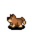{ .sprite } | [Cute dog puppy](guynmart_dog_puppy.md) | Enemy | 6 | 8 | 2 | 90 | 0 | 0 |
| { .sprite } | [Small rabid dog](small_rabid_dog.md) | Enemy | 6 | 8 | 2 | 90 | 0 | 0 |
| { .sprite } | [Catacomb rat](catacomb_rat.md) | Enemy | 15 | 19 | 1 | 60 | 40 | 0 |
| { .sprite } | [Angry weak fungi](weak_fungi_1.md) | Enemy | 20 | 20 | 1 to 2 | 70 | 8 | 0 |
| { .sprite } | [Dungeon rat](guynmart_rat.md) | Enemy | 20 | 28 | 2 to 4 | 100 | 10 | 0 |
| { .sprite } | [Rabid boar](rabid_boar.md) | Enemy | 20 | 33 | 3 | 110 | 30 | 0 |
| { .sprite } | [Strong cave rat](strong_cave_rat.md) | Enemy | 20 | 28 | 2 to 4 | 100 | 10 | 0 |
| { .sprite } | [Weak fungi](weak_fungi.md) | Enemy | 20 | 23 | 1 to 2 | 110 | 10 | 0 |
| { .sprite } | [Wild boar](wild_boar.md) | Enemy | 20 | 33 | 3 | 110 | 30 | 0 |
| { .sprite } | [Large catacomb rat](large_catacomb_rat.md) | Enemy | 21 | 28 | 1 to 2 | 60 | 40 | 0 |
| { .sprite } | [Large cave rat](large_cave_rat.md) | Enemy | 21 | 37 | 3 to 4 | 60 | 40 | 0 |
| { .sprite } | [Fungi](mid_fungi.md) | Enemy | 25 | 83 | 2 to 3 | 110 | 20 | 0 |
| { .sprite } | [Hunting dog](hunting_dog.md) | Enemy | 25 | 36 | 2 to 5 | 60 | 50 | 0 |
| { .sprite } | [Rabid fox](rabid_fox.md) | Enemy | 25 | 39 | 3 | 100 | 50 | 0 |
| { .sprite } | [Wild fox](wild_fox.md) | Enemy | 25 | 44 | 4 to 5 | 100 | 40 | 0 |
| 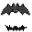{ .sprite } | [Gray cave bat](cavebat1.md) | Enemy | 28 | 103 | 3 to 5 | 56 | 32 | 0 |
| { .sprite } | [Cave jelly](cave_jelly.md) | Enemy | 30 | 137 | 4 to 9 | 125 | 70 | 0 |
| 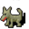{ .sprite } | [Cave teckel](ratdom_m9b.md) | Enemy | 30 | 67 | 5 | 110 | 20 | 0 |
| { .sprite } | [Cave wolf](ratdom_m9c.md) | Enemy | 30 | 67 | 5 | 110 | 20 | 0 |
| { .sprite } | [Curious roundling](ratdom_m13b.md) | Enemy | 30 | 67 | 5 | 110 | 20 | 0 |
| { .sprite } | [Dangerous elvedridge](ratdom_m8b.md) | Enemy | 30 | 67 | 5 | 110 | 20 | 0 |
| 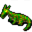{ .sprite } | [Elvedridge](ratdom_m8a.md) | Enemy | 30 | 67 | 5 | 110 | 20 | 0 |
| { .sprite } | [Giant hornbat](ratdom_m9a.md) | Enemy | 30 | 67 | 5 | 110 | 20 | 0 |
| { .sprite } | [Great dark wolf](blornvale_wolf.md) | Enemy | 30 | 30 | 1 to 3 | 50 | 20 | 0 |
| { .sprite } | [Lombric ball](lombric_ball.md) | Enemy | 30 | 42 | 1 to 15 | 50 | 60 | 0 |
| { .sprite } | [Lombric beast](lombric_beast.md) | Enemy | 30 | 47 | 3 to 10 | 70 | 30 | 0 |
| { .sprite } | [Mountain Sheep](bwm_sheep1.md) | NPC/Enemy | 30 | 33 | 1 to 5 | 60 | 20 | 0 |
| { .sprite } | [Quick lombric ball](lombric_ball3.md) | Enemy | 30 | 64 | 3 to 20 | 60 | 65 | 0 |
| { .sprite } | [Wolf](wolf.md) | Enemy | 30 | 49 | 3 to 6 | 110 | 30 | 0 |
| { .sprite } | [Young roundling](ratdom_m13a.md) | Enemy | 30 | 67 | 5 | 110 | 20 | 0 |
| { .sprite } | [Anklebiter](anklebiter.md) | Enemy | 31 | 92 | 3 to 9 | 150 | 60 | 3 |
| { .sprite } | [Vicious hound](vicious_hound.md) | Enemy | 31 | 92 | 3 to 9 | 150 | 60 | 3 |
| { .sprite } | [Young forest fox](forestfox2.md) | Enemy | 31 | 84 | 0 to 5 | 72 | 46 | 4 |
| { .sprite } | [Black cave bat](cavebat2.md) | Enemy | 32 | 111 | 2 to 6 | 59 | 35 | 0 |
| { .sprite } | [Ancient wolf](lonely_wolf.md) | Enemy | 35 | 53 | 3 to 6 | 110 | 30 | 0 |
| { .sprite } | [Angry fungi](mid_fungi_1.md) | Enemy | 35 | 92 | 3 to 6 | 80 | 8 | 0 |
| { .sprite } | [Cave dwelling boar](cave_dwelling_boar.md) | Enemy | 35 | 75 | 3 to 8 | 70 | 60 | 3 |
| { .sprite } | [Forest fox](forestfox3.md) | Enemy | 35 | 90 | 0 to 5 | 75 | 49 | 4 |
| { .sprite } | [Young wolf](young_wolf.md) | Enemy | 35 | 58 | 2 to 5 | 60 | 30 | 2 |
| { .sprite } | [Brown cave bat](cavebat3.md) | Enemy | 36 | 121 | 1 to 7 | 62 | 25 | 0 |
| 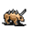{ .sprite } | [Small horned anklebiter](anklebiter2.md) | Enemy | 38 | 78 | 3 to 7 | 96 | 53 | 1 |
| { .sprite } | [Cave bat](cavebat4.md) | Enemy | 39 | 127 | 1 to 7 | 64 | 27 | 0 |
| { .sprite } | [Tough redfoot beast](redft0.md) | Enemy | 39 | 98 | 0 to 5 | 78 | 52 | 4 |
| 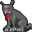{ .sprite } | [Rabid hound](rabid_hound.md) | Enemy | 40 | 65 | 3 to 9 | 110 | 30 | 0 |
| { .sprite } | [Wild dog](guynmart_dog2a.md) | Enemy | 40 | 65–69 | 3 to 9 | 110 | 30 | 0 |
| { .sprite } | [Wolfhound](hettar_dog.md) | NPC/Enemy | 40 | 117 | 1 to 8 | 80 | 150 | 5 |
| { .sprite } | [Aggressive cave bat](cavebat5.md) | Enemy | 41 | 137 | 1 to 7 | 69 | 32 | 0 |
| { .sprite } | [Fledgling wolf](fledgling_wolf.md) | Enemy | 42 | 79 | 2 to 5 | 70 | 50 | 3 |
| { .sprite } | [Rabid wolf](rabid_wolf.md) | Enemy | 42 | 79 | 2 to 6 | 90 | 50 | 3 |
| { .sprite } | [Strong redfoot beast](redft1.md) | Enemy | 43 | 105 | 0 to 5 | 81 | 56 | 4 |
| { .sprite } | [Angry dangerous fungi](dangerous_fungi_1.md) | Enemy | 45 | 102 | 3 to 6 | 90 | 10 | 0 |
| { .sprite } | [Mountain wolf pup](mwolf_1.md) | Enemy | 45 | 82 | 2 to 7 | 80 | 40 | 3 |
| { .sprite } | [Pack hunter](pack_hunter.md) | Enemy | 45 | 84 | 2 to 7 | 90 | 40 | 3 |
| 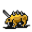{ .sprite } | [Young horned anklebiter](anklebiter3.md) | Enemy | 46 | 112 | 5 to 7 | 112 | 61 | 2 |
| { .sprite } | [Bloodthirsty redfoot beast](redft2.md) | Enemy | 47 | 122 | 0 to 5 | 84 | 75 | 4 |
| { .sprite } | [Mountain wolf](mountain_wolf.md) | Enemy | 49 | 112 | 3 to 9 | 150 | 60 | 3 |
| { .sprite } | [Alpha fox](alpha_fox.md) | Enemy | 50 | 78 | 4 to 7 | 130 | 35 | 0 |
| { .sprite } | [Korvan the leader of the wolves](wolf_leader.md) | Enemy | 50 | 78 | 4 to 7 | 130 | 35 | 0 |
| { .sprite } | [Mature lombric ball](lombric_ball2.md) | Enemy | 50 | 77 | 5 to 20 | 70 | 65 | 0 |
| { .sprite } | [Fast horned anklebiter](anklebiter4.md) | Enemy | 52 | 129 | 1 to 9 | 129 | 68 | 3 |
| { .sprite } | [Young mountain wolf](mwolf_2.md) | Enemy | 52 | 92 | 3 to 7 | 80 | 44 | 3 |
| { .sprite } | [Dangerous fungi](dangerous_fungi.md) | Enemy | 55 | 108 | 2 to 5 | 35 | 35 | 0 |
| { .sprite } | [Young mountain fox](mwolf_3.md) | Enemy | 56 | 104 | 3 to 7 | 80 | 48 | 4 |
| { .sprite } | [Mountain fox](mwolf_4.md) | Enemy | 60 | 113 | 3 to 8 | 85 | 52 | 4 |
| { .sprite } | [Dun olm](bwm_olm1.md) | Enemy | 61 | 196 | 5 to 10 | 110 | 130 | 6 |
| { .sprite } | [Trained mountain wolf](mountain_wolf_2.md) | Enemy | 61 | 146 | 5 to 11 | 155 | 75 | 3 |
| { .sprite } | [Ferocious mountain fox](mwolf_5.md) | Enemy | 64 | 136 | 3 to 8 | 85 | 54 | 5 |
| { .sprite } | [Tough horned anklebiter](anklebiter5.md) | Enemy | 64 | 160 | 3 to 9 | 137 | 76 | 3 |
| { .sprite } | [Pack leader](pack_leader.md) | Enemy | 65 | 121 | 2 to 10 | 90 | 40 | 4 |
| { .sprite } | [Albino olm](bwm_olm2.md) | Enemy | 66 | 231 | 7 to 10 | 117 | 133 | 8 |
| { .sprite } | [Rabid mountain wolf](mwolf_6.md) | Enemy | 67 | 146 | 3 to 9 | 90 | 56 | 5 |
| 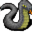{ .sprite } | [Hard-skinned olm](bwm_olm3.md) | Enemy | 68 | 227 | 5 to 10 | 103 | 140 | 9 |
| { .sprite } | [Reckless mountain wolf](mountain_wolf_4.md) | Enemy | 68 | 200 | 6 to 14 | 175 | 60 | 2 |
| 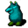{ .sprite } | [Cave mole](ratdom_maze_mole.md) | NPC/Enemy | 70 | 157 | 8 to 15 | 120 | 0 | 0 |
| { .sprite } | [Venomous beach crawler](beach_crawler_1.md) | Enemy | 70 | 131 | 2 to 8 | 70 | 35 | 0 |
| { .sprite } | [Strong mountain wolf](mwolf_7.md) | Enemy | 73 | 159–205 | 3 to 17 | 90–160 | 57–80 | 4–6 |
| 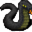{ .sprite } | [Blackened olm](bwm_olm4.md) | Enemy | 75 | 261 | 8 to 11 | 120 | 135 | 7 |
| { .sprite } | [Contaminated woodworm](elm_woodworm.md) | Enemy | 76 | 292 | 6 to 9 | 90 | 144 | 7 |
| { .sprite } | [Strong horned anklebiter](anklebiter6.md) | Enemy | 76 | 198 | 1 to 13 | 151 | 85 | 3 |
| 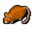{ .sprite } | [Pup rat](young_church_rat.md) | Enemy | 77 | 125 | 5 to 7 | 71 | 81 | 0 |
| { .sprite } | [Ferocious mountain wolf](mwolf_8.md) | Enemy | 78 | 169 | 3 to 10 | 90 | 59 | 6 |
| { .sprite } | [Basement rat](lonelyhouse_sp.md) | Enemy | 79 | 224 | 2 to 9 | 125 | 180 | 4 |
| { .sprite } | [Aggresive woodworm](elm_woodworm2.md) | Enemy | 80 | 309 | 7 to 10 | 94 | 139 | 7 |
| { .sprite } | [Brown church rat](brown_church_rat.md) | Enemy | 86 | 152 | 7 to 9 | 79 | 86 | 0 |
| { .sprite } | [Contaminated olm](bwm_olm5.md) | Enemy | 90 | 294 | 6 to 14 | 133 | 146 | 8 |
| { .sprite } | [Duleian mountain cat](duleian_mountain_cat.md) | Enemy | 97 | 390 | 7 to 19 | 225 | 101 | 0 |
| { .sprite } | [Muskrat](brightport_squirrel.md) | Enemy | 100 | 224 | 6 to 15 | 120 | 80 | 2 |
| { .sprite } | [Three-eyed bat](three_eyed_bat.md) | Enemy | 108 | 356 | 16 to 17 | 165 | 189 | 0 |
| { .sprite } | [Young murkcrawler](young_murkcrawler.md) | Enemy | 117 | 293 | 7 to 11 | 159 | 83 | 6 |
| { .sprite } | [Forest fawn](brightport_sickfawn.md) | Enemy | 120 | 261 | 3 to 13 | 165 | 144 | 4 |
| 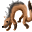{ .sprite } | [Murkcrawler](murkcrawler.md) | Enemy | 122 | 324 | 9 to 11 | 159 | 89 | 7 |
| { .sprite } | [Steelhide horned anklebiter](anklebiter7.md) | Enemy | 124 | 303 | 4 to 11 | 162 | 92 | 7 |
| { .sprite } | [Gravewing](undertell_bat.md) | Enemy | 138 | 561 | 16 to 17 | 165 | 205 | 0 |
| { .sprite } | [Rash Muskrat](brightport_squirrel2.md) | Enemy | 140 | 402 | 6 to 19 | 205 | 120 | 2 |
| { .sprite } | [Virulent forest fawn](brightport_fawn.md) | Enemy | 144 | 403 | 7 to 14 | 176 | 182 | 4 |
| { .sprite } | [Aroughcun kit](aroughcun_kit.md) | Enemy | 155 | 527 | 10 to 15 | 191 | 176 | 9 |
| 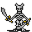{ .sprite } | [King Rah](ratdom_king_rah.md) | Enemy | 160 | 252 | 20 to 30 | 60 | 40 | 0 |
| 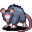{ .sprite } | [Kriih](ratdom_kriih.md) | NPC/Enemy | 160 | 198 | 20 to 30 | 40 | 20 | 0 |
| { .sprite } | [Mushroom guardian](guardian_mushroom.md) | NPC/Enemy | 160 | 286 | 3 to 8 | 120 | 60 | 0 |
| 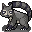{ .sprite } | [Agile aroughcun](aroughcun_agile.md) | Enemy | 168 | 661 | 10 to 15 | 191 | 170 | 9 |
| { .sprite } | [Scardy aroughcun](scardy_aroughcun.md) | Enemy | 170 | 574 | 12 to 17 | 191 | 176 | 9 |
| { .sprite } | [Great fungi](boss_fungi.md) | Enemy | 175 | 316 | 3 to 6 | 120 | 60 | 1 |
| { .sprite } | [Sow aroughcun](aroughcun_sow.md) | Enemy | 175 | 599 | 12 to 17 | 191 | 176 | 9 |
| 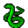{ .sprite } | [Enraged Scylla](scylla_c1.md) | Enemy | 180 | 7,573 | 1 to 15 | 500 | 5000 | 100 |
| { .sprite } | [Furious Scylla](scylla_b1.md) | Enemy | 180 | 1,972 | 1 to 15 | 250 | 600 | 150 |
| { .sprite } | [Ridgehowler](ridgehowler.md) | Enemy | 180 | 538 | 19 | 150 | 205 | 0 |
| { .sprite } | [Scylla](scylla_1.md) | Enemy | 180 | 1,442 | 1 | 250 | 500 | 100 |
| { .sprite } | [Taurophag](taurophag.md) | Enemy | 180 | 410 | 20 to 40 | 150 | 100 | 10 |
| { .sprite } | [Galmore wolf's pup](mg2_wolves_pup.md) | NPC/Enemy | 187 | 459 | 10 to 13 | 156 | 187 | 0 |
| { .sprite } | [Orphaned warg pup](orphaned_warg_pup.md) | Enemy | 187 | 459 | 10 to 13 | 156 | 187 | 0 |
| { .sprite } | [Warg pup](warg_pup.md) | Enemy | 187 | 459 | 10 to 13 | 156 | 187 | 0 |
| 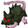{ .sprite } | [Nightfur rat](nightfur_rat.md) | Enemy | 194 | 531 | 8 to 12 | 98 | 185 | 5 |
| { .sprite } | [Harrowback](harrowback.md) | Enemy | 197 | 488 | 10 to 11 | 201 | 125 | 0 |
| { .sprite } | [Mutated harrowback](mutated_harrowback.md) | Enemy | 197 | 519 | 10 to 13 | 201 | 135 | 0 |
| { .sprite } | [Aroughcun](aroughcun.md) | Enemy | 204 | 670 | 13 to 18 | 191 | 176 | 9 |
| { .sprite } | [Ny'Ratees](nyratees.md) | Enemy | 207 | 585 | 10 to 15 | 103 | 200 | 3 |
| { .sprite } | [Forest deer](brightport_sickdeer.md) | Enemy | 212 | 449 | 6 to 16 | 168 | 148 | 6 |
| { .sprite } | [Duleian panther](brightport_cat2.md) | Enemy | 220 | 781 | 14 to 25 | 203 | 180 | 4 |
| { .sprite } | [Stoneclaw prowler](stoneclaw_prowler.md) | Enemy | 230 | 596 | 8 to 9 | 130 | 170 | 1 |
| { .sprite } | [Dreadmane](dreadmane.md) | Enemy | 235 | 709 | 15 to 21 | 187 | 166 | 2 |
| 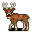{ .sprite } | [Virulent forest deer](brightport_deer.md) | Enemy | 240 | 587 | 8 to 19 | 182 | 154 | 8 |
| { .sprite } | [Giant snake](giant_snake.md) | Enemy | 250 | 510 | 8 to 22 | 150 | 60 | 12 |
| { .sprite } | [Galmore wolf](mg2_wolves.md) | NPC/Enemy | 251 | 679 | 15 to 20 | 177 | 153 | 0 |
| { .sprite } | [Warg](warg.md) | Enemy | 251 | 679 | 15 to 20 | 177 | 153 | 0 |
| { .sprite } | [Charwood goblin hogrider](brightport_goblin.md) | Enemy | 280 | 623 | 15 to 27 | 200 | 110 | 4 |
| { .sprite } | [Elder deer](brightport_elderdeer.md) | Enemy | 293 | 800 | 8 to 22 | 192 | 229 | 8 |
| { .sprite } | [Rubycrest strider](rubycrest_strider.md) | Enemy | 293 | 1,065 | 6 to 18 | 175 | 280 | 10 |
| 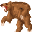{ .sprite } | [Aggressive bear](cave_bear.md) | Enemy | 297 | 601 | 14 to 20 | 165 | 127 | 0 |
| 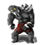{ .sprite } | [Dorhantarh](lae_island_boss.md) | NPC/Enemy | 297 | 752 | 24 to 50 | 165 | 127 | 0 |
| { .sprite } | [Golden jackal](golden_jackal.md) | Enemy | 345 | 745 | 8 to 16 | 175 | 100 | 0 |
| { .sprite } | [Vicious redfoot beast](redft_cr.md) | Enemy | 347 | 521 | 0 to 9 | 84 | 75 | 4 |

<h3 id="enemies-humanoid">Humanoid (138)</h3>

| | Name | Type | HP | XP | Damage | AC | BC | DR |
|---|---|---|---|---|---|---|---|---|
| { .sprite } | [Prisoner](prisoner.md) | Enemy | 1 | 1 | 0 | 0 | 0 | 0 |
| { .sprite } | [Starving prisoner](starving_prisoner.md) | NPC/Enemy | 10 | 27 | 3 to 5 | 60 | 60 | 0 |
| { .sprite } | [Escaped prisoner](escaped_prisoner.md) | NPC/Enemy | 15 | 18 | 3 to 7 | 50 | 20 | 0 |
| { .sprite } | [Gambler](brv_blackjack_gambler1.md) | NPC/Enemy | 25 | 36–48 | 1 to 5 | 70–80 | 40–80 | 0–1 |
| { .sprite } | [Dealer](brv_blackjack_dealer.md) | NPC/Enemy | 30 | 84 | 2 to 4 | 80 | 30 | 1 |
| { .sprite } | [Bogsten](bogsten.md) | NPC/Enemy | 35 | 53 | 3 to 6 | 110 | 30 | 0 |
| { .sprite } | [Stoutford guard](stoutford_guard1.md) | NPC/Enemy | 40 | 64 | 1 to 6 | 50 | 100 | 0 |
| { .sprite } | [Shady bandit](shady_bandit.md) | NPC/Enemy | 45 | 94 | 3 to 9 | 70 | 50 | 2 |
| { .sprite } | [Ruetmaple](ruetmaple.md) | NPC/Enemy | 50 | 163 | 10 to 15 | 150 | 50 | 5 |
| { .sprite } | [Larcal](larcal.md) | NPC/Enemy | 51 | 55 | 1 to 2 | 25 | 50 | 0 |
| { .sprite } | [Seraphina's bodyguard](tt_guys.md) | Enemy | 52 | 101 | 8 to 15 | 90 | 40 | 1 |
| 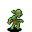{ .sprite } | [Puny Charwood goblin](charwdg1.md) | Enemy | 53 | 122 | 5 to 7 | 95 | 75 | 4 |
| { .sprite } | [Highwayman](highwayman.md) | NPC/Enemy | 54–200 | 85–621 | 2 to 20 | 90–200 | 30–150 | 2–4 |
| { .sprite } | [Iqhan worker thrall](iqhan_1a.md) | Enemy | 55 | 104 | 2 to 9 | 110 | 70 | 0 |
| { .sprite } | [Charwood goblin scout](charwdg2.md) | Enemy | 56 | 130 | 6 to 9 | 139 | 77 | 4 |
| { .sprite } | [Branchtender](brtender1.md) | Enemy | 57 | 139 | 5 to 8 | 135 | 75 | 5 |
| { .sprite } | [Iqhan thrall servant](iqhan_1b.md) | Enemy | 57 | 122 | 2 to 9 | 120 | 70 | 0 |
| { .sprite } | [Rebelled rogue](g03_thief_3.md) | Enemy | 58 | 124 | 3 to 6 | 120 | 88 | 0 |
| { .sprite } | [Iqhan guard thrall](iqhan_2a.md) | Enemy | 59 | 129 | 2 to 9 | 130 | 70 | 0 |
| { .sprite } | [Unzel](unzel.md) | NPC/Enemy | 59 | 93 | 5 to 9 | 80 | 40 | 2 |
| { .sprite } | [Alvies](brv_alvies.md) | NPC/Enemy | 60 | 95 | 2 to 12 | 80 | 40 | 2 |
| { .sprite } | [Blackwater border patrol](blackwater_border_patrol.md) | NPC/Enemy | 60 | 102 | 3 to 6 | 60 | 70 | 3 |
| { .sprite } | [Blackwater entrance guard](blackwater_entrance_guard.md) | NPC/Enemy | 60 | 102 | 3 to 6 | 60 | 70 | 3 |
| { .sprite } | [Blackwater guard](blackwater_guard.md) | NPC/Enemy | 60 | 102 | 3 to 6 | 60 | 70 | 3 |
| { .sprite } | [Cave gnome](ratdom_m6a.md) | Enemy | 60 | 149 | 5 to 15 | 130 | 20 | 0 |
| { .sprite } | [Guthbered's bodyguard](guthbereds_bodyguard.md) | NPC/Enemy | 60 | 102 | 3 to 6 | 60 | 70 | 3 |
| { .sprite } | [Harlenn's bodyguard](harlenns_bodyguard.md) | NPC/Enemy | 60 | 102 | 3 to 6 | 60 | 70 | 3 |
| { .sprite } | [Librarian](ratdom_librarian.md) | NPC/Enemy | 60 | 42 | 10 to 30 | 0 | 0 | 0 |
| { .sprite } | [Prim guard](prim_guard.md) | NPC/Enemy | 60 | 102 | 3 to 6 | 60 | 70 | 3 |
| { .sprite } | [Prim sentry](prim_sentry.md) | NPC/Enemy | 60 | 102 | 3 to 6 | 60 | 70 | 3 |
| { .sprite } | [Prim treasury guard](prim_treasury_guard.md) | NPC/Enemy | 60 | 102 | 3 to 6 | 60 | 70 | 3 |
| { .sprite } | [Prim weapon guard](prim_weapon_guard.md) | NPC/Enemy | 60 | 102 | 3 to 6 | 60 | 70 | 3 |
| { .sprite } | [Rebelled thief](guild03_rebthief_1.md) | NPC/Enemy | 60 | 114 | 3 to 8 | 105 | 85 | 1 |
| { .sprite } | [Thief](gison_thief1.md) | NPC/Enemy | 60 | 114 | 3 to 8 | 105 | 85 | 1 |
| { .sprite } | [Tired Prim guard](tired_prim_guard.md) | NPC/Enemy | 60 | 102 | 3 to 6 | 60 | 70 | 3 |
| { .sprite } | [Graverobber](graverobber.md) | NPC/Enemy | 62 | 102 | 2 to 6 | 120 | 72 | 1 |
| { .sprite } | [Iqhan thrall](iqhan_2b.md) | Enemy | 62 | 138 | 2 to 10 | 130 | 70 | 0 |
| { .sprite } | [Starving Charwood goblin](charwdg3.md) | Enemy | 64 | 142 | 6 to 9 | 142 | 79 | 4 |
| { .sprite } | [Erwyn's soldier](erwyn_soldier.md) | NPC/Enemy | 65 | 99 | 4 to 5 | 90 | 60 | 0 |
| { .sprite } | [Iqhan warrior thrall](iqhan_3a.md) | Enemy | 65 | 152 | 2 to 11 | 140 | 70 | 0 |
| { .sprite } | [Iqhan master](iqhan_3b.md) | Enemy | 67–71 | 162–185 | 2 to 15 | 140 | 60 | 0 |
| { .sprite } | [Thief warden](g03_thief_2.md) | NPC/Enemy | 68 | 141 | 4 to 9 | 100 | 95 | 2 |
| { .sprite } | [Ancient kobold](kobold3.md) | Enemy | 70 | 273 | 1 to 10 | 140 | 80 | 12 |
| { .sprite } | [Ewmondold](ewmondold_snake_master.md) | NPC/Enemy | 70 | 150 | 2 to 5 | 67 | 13 | 4 |
| { .sprite } | [Gold hunter](ratdom_goldhunter.md) | Enemy | 70 | 85 | 3 to 10 | 60 | 40 | 0 |
| { .sprite } | [Kobold](kobold2.md) | Enemy | 70 | 299 | 1 to 10 | 140 | 80 | 10 |
| { .sprite } | [Quick kobold](kobold1.md) | Enemy | 70 | 299 | 1 to 10 | 140 | 80 | 10 |
| { .sprite } | [Frantic branchtender](brtender2.md) | Enemy | 72 | 249 | 7 to 11 | 155 | 90 | 7 |
| { .sprite } | [Vacor](vacor.md) | NPC/Enemy | 72 | 111 | 4 to 8 | 110 | 40 | 2 |
| { .sprite } | [Charwood goblin](charwdg4.md) | NPC/Enemy | 73–81 | 151–162 | 7 to 9 | 144–147 | 63–65 | 4 |
| 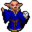{ .sprite } | [Iqhan chaos evoker](iqhan_ch_1a.md) | Enemy | 73–75 | 237–240 | 2 to 15 | 140–150 | 60 | 0 |
| { .sprite } | [Tunlon](tunlon.md) | NPC/Enemy | 73 | 292 | 9 to 17 | 200 | 90 | 10 |
| { .sprite } | [Buceth](buceth.md) | NPC/Enemy | 75 | 292 | 3 to 9 | 80 | 120 | 4 |
| { .sprite } | [Iqhan chaos servant](iqhan_ch_2a.md) | Enemy | 78–79 | 244–254 | 2 to 14 | 150 | 60–75 | 0 |
| { .sprite } | [Feygard patrol watch](feygard_patrol_watch.md) | NPC/Enemy | 80 | 133–280 | 2 to 17 | 70–170 | 80–180 | 3 |
| 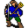{ .sprite } | [Golin](golin.md) | NPC/Enemy | 80 | 159 | 1 to 4 | 40 | 120 | 5 |
| { .sprite } | [Guthbered](guthbered.md) | NPC/Enemy | 80 | 146 | 4 to 9 | 70 | 80 | 4 |
| { .sprite } | [Harlenn](harlenn.md) | NPC/Enemy | 80 | 146 | 4 to 9 | 70 | 80 | 4 |
| 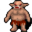{ .sprite } | [Plump cave gnome](ratdom_m6b.md) | Enemy | 80 | 213 | 10 to 25 | 110 | 20 | 0 |
| { .sprite } | [Charwood goblin fighter](charwdg5.md) | Enemy | 81 | 162 | 7 to 9 | 147 | 65 | 4 |
| { .sprite } | [Feygard scout](feygard_scout.md) | NPC/Enemy | 83 | 209 | 6 to 11 | 110 | 95 | 5 |
| { .sprite } | [Iqhan chaos master](iqhan_ch_3a.md) | Enemy | 83–85 | 273–275 | 2 to 13 | 170 | 75 | 0 |
| { .sprite } | [Attohead](brv_attohead.md) | NPC/Enemy | 85 | 114 | 4 to 9 | 79 | 44 | 1 |
| { .sprite } | [Andor's statue](ratdom_rat_statue.md) | NPC/Enemy | 90 | 89 | 1 to 4 | 60 | 40 | 0 |
| { .sprite } | [Mara](mara.md) | NPC/Enemy | 90 | 95 | 1 to 4 | 60 | 40 | 0 |
| { .sprite } | [Tough Charwood goblin](charwdg6.md) | Enemy | 92 | 178 | 8 to 9 | 143 | 67 | 4 |
| { .sprite } | [Aphem](ll2_cyclops2.md) | NPC/Enemy | 100 | 194 | 8 to 16 | 100 | 50 | 10 |
| 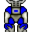{ .sprite } | [Bully](stn_colonel_mons5.md) | Enemy | 100 | 214 | 5 to 10 | 60 | 120 | 8 |
| { .sprite } | [Mikhail](mikhail.md) | NPC/Enemy | 100 | 190 | 1 to 4 | 40 | 120 | 5 |
| { .sprite } | [Molykros](molykros.md) | Enemy | 100 | 200 | 10 to 20 | 100 | 50 | 5 |
| 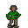{ .sprite } | [Polyasem](ll2_cyclops1.md) | NPC/Enemy | 100 | 194 | 8 to 16 | 100 | 50 | 10 |
| 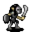{ .sprite } | [Aggressive Charwood goblin](charwdg7.md) | Enemy | 103 | 193 | 8 to 9 | 146 | 64 | 4 |
| { .sprite } | [Strong Charwood goblin](charwdg8.md) | Enemy | 112 | 214 | 9 to 11 | 147 | 73 | 4 |
| { .sprite } | [Assistant torturer](guynmart_tort2.md) | Enemy | 120 | 269 | 5 to 20 | 40 | 150 | 6 |
| { .sprite } | [Bridge guard](guynmart_robber1.md) | NPC/Enemy | 120 | 246 | 1 to 4 | 40 | 150 | 5 |
| { .sprite } | [Brightport guard](brightportguard.md) | NPC/Enemy | 120 | 315 | 10 to 25 | 140 | 130 | 3 |
| { .sprite } | [Guynmart guard](guynmart_gguard.md) | NPC/Enemy | 120 | 269 | 5 to 20 | 40 | 150 | 6 |
| { .sprite } | [Nightmare](guynmart_mare.md) | Enemy | 120 | 1,827 | 8 to 25 | 90 | 500 | 200 |
| { .sprite } | [Road rondel](road_rondel.md) | NPC/Enemy | 120 | 310 | 2 to 4 | 60 | 200 | 8 |
| { .sprite } | [Robber](guynmart_robber2.md) | Enemy | 120 | 221 | 1 to 4 | 40 | 120 | 5 |
| { .sprite } | [Torturer](guynmart_tort1.md) | Enemy | 120 | 269 | 5 to 20 | 40 | 150 | 6 |
| { .sprite } | [Rogorn's henchman](rogorn_henchman.md) | NPC/Enemy | 130 | 259 | 5 to 8 | 80 | 120 | 4 |
| { .sprite } | [Crackshot](g03_crackshot.md) | NPC/Enemy | 133 | 271 | 5 to 11 | 110 | 100 | 4 |
| { .sprite } | [Morkin lookout](morkin1.md) | Enemy | 145 | 241 | 0 to 3 | 53 | 134 | 0 |
| { .sprite } | [Rogorn](rogorn.md) | NPC/Enemy | 145 | 295 | 5 to 9 | 90 | 120 | 5 |
| { .sprite } | [Tiqui](tiqui.md) | NPC/Enemy | 145 | 306 | 0 to 9 | 90 | 120 | 9 |
| { .sprite } | [Hagale](algore.md) | NPC/Enemy | 150 | 439 | 10 to 15 | 120 | 90 | 3 |
| { .sprite } | [Teacher](brv_teacher.md) | NPC/Enemy | 150 | 282 | 3 to 7 | 40 | 130 | 5 |
| { .sprite } | [Morkin scout](morkin2.md) | Enemy | 152 | 259 | 0 to 3 | 59 | 139 | 0 |
| { .sprite } | [Morkin fighter](morkin3.md) | Enemy | 159 | 277 | 0 to 3 | 65 | 145 | 0 |
| { .sprite } | [Gruil](gruil.md) | NPC/Enemy | 160 | 112 | 2 to 5 | 0 | 0 | 0 |
| { .sprite } | [Strong Prim treasury guard](prim_treasury_guard2.md) | NPC/Enemy | 160 | 603 | 25 to 40 | 160 | 170 | 13 |
| { .sprite } | [Tharal](tharal.md) | NPC/Enemy | 160 | 112 | 1 to 3 | 0 | 0 | 0 |
| { .sprite } | [Morkin guard](morkin4.md) | Enemy | 165 | 294 | 0 to 3 | 69 | 150 | 0 |
| { .sprite } | [Morkin berserker](morkin5.md) | Enemy | 171 | 310 | 0 to 3 | 74 | 155 | 0 |
| 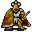{ .sprite } | [Morkin leader](morkin6.md) | Enemy | 175 | 328 | 0 to 3 | 79 | 163 | 0 |
| { .sprite } | [Zuul'khan](zuul_khan.md) | NPC/Enemy | 175 | 214–266 | 3 to 6 | 110–120 | 40–60 | 0–1 |
| { .sprite } | [Gylew](gylew.md) | NPC/Enemy | 180 | 233 | 10 to 22 | 60 | 40 | 0 |
| { .sprite } | [Subdued Feygard mountain scout](ortholion_subdued.md) | NPC/Enemy | 191 | 396 | 2 to 5 | 150 | 95 | 5 |
| { .sprite } | [Aulowenn](aulowenn.md) | NPC/Enemy | 194 | 324 | 0 to 9 | 120 | 90 | 5 |
| 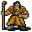{ .sprite } | [Breeder of venomscale](vscaleb1.md) | Enemy | 197 | 376 | 0 to 17 | 156 | 57 | 4 |
| { .sprite } | [Algangror](algangror.md) | NPC/Enemy | 200–241 | 258–548 | 3 to 22 | 70–80 | 50–120 | 0–4 |
| { .sprite } | [Andor](dds_andor.md) | NPC/Enemy | 200 | 258 | 10 to 22 | 70 | 50 | 0 |
| { .sprite } | [Jhaeld](jhaeld.md) | NPC/Enemy | 200 | 258 | 10 to 22 | 70 | 50 | 0 |
| { .sprite } | [Roundling](ratdom_roundling.md) | NPC/Enemy | 200 | 216–241 | 10 to 30 | 120 | 0 | 0 |
| { .sprite } | [River wretch](river_wretch.md) | Enemy | 201 | 561–611 | 9 to 13 | 199 | 176 | 9 |
| { .sprite } | [Young glacibite](young_glacibite.md) | Enemy | 201 | 579 | 7 to 10 | 199 | 176 | 9 |
| { .sprite } | [Venomscale master](vscaleb2.md) | Enemy | 205 | 392 | 0 to 17 | 160 | 61 | 4 |
| { .sprite } | [Confused Feygard soldier](ortholion_guard7.md) | NPC/Enemy | 211 | 342 | 2 to 18 | 91 | 110 | 2 |
| { .sprite } | [Afflicted Feygard guard](lodar_fg3.md) | NPC/Enemy | 212 | 347 | 1 to 11 | 75 | 90 | 3 |
| { .sprite } | [Glacibite](glacibite.md) | Enemy | 212 | 624 | 9 to 11 | 202 | 176 | 9 |
| { .sprite } | [Insane Feygard guard](lodar_fg4.md) | NPC/Enemy | 212 | 347 | 1 to 11 | 75 | 90 | 3 |
| { .sprite } | [Forenza](forenza.md) | NPC/Enemy | 215 | 302 | 10 to 22 | 70 | 50 | 0 |
| { .sprite } | [Gylew's henchman](gylew_henchman.md) | NPC/Enemy | 219 | 394 | 14 to 19 | 85 | 55 | 2 |
| 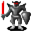{ .sprite } | [Honor Guard](feygard_offering_guard.md) | Enemy | 220 | 497 | 5 to 20 | 140 | 150 | 6 |
| { .sprite } | [Madame Mim](swamp_witch.md) | NPC/Enemy | 220 | 654 | 5 to 10 | 200 | 200 | 15 |
| { .sprite } | [Bridge bogling](bridge_bogling.md) | Enemy | 222 | 595 | 5 to 25 | 165 | 150 | 8 |
| { .sprite } | [Bonicksa](wicked_witch_first.md) | NPC/Enemy | 229–277 | 619–768 | 13 to 17 | 187–207 | 152–166 | 0 |
| 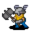{ .sprite } | [Mountain bridge bogling](mt_bridge_bogling.md) | Enemy | 232 | 631 | 12 to 19 | 170 | 155 | 8 |
| { .sprite } | [Spearborn thrall](spearborn_thrall.md) | Enemy | 236 | 647 | 12 to 13 | 175 | 165 | 8 |
| { .sprite } | [Young spearborn thrall](young_spearborn_thrall.md) | Enemy | 236 | 572 | 10 to 11 | 170 | 165 | 8 |
| { .sprite } | [Ancient branchtender](brtender_cr.md) | Enemy | 253 | 490 | 7 to 11 | 155 | 90 | 7 |
| { .sprite } | [Egrinda](egrinda.md) | NPC/Enemy | 255 | 989 | 8 to 16 | 270 | 130 | 19 |
| { .sprite } | [Ulirfendor](ulirfendor.md) | NPC/Enemy | 288 | 421 | 1 to 16 | 70 | 60 | 6 |
| 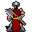{ .sprite } | [Gunfryk](brightportguardcaptain.md) | NPC/Enemy | 300 | 680 | 12 to 30 | 140 | 150 | 5 |
| { .sprite } | [Leonid](leonid.md) | NPC/Enemy | 300 | 210 | 3 to 8 | 0 | 0 | 0 |
| { .sprite } | [Tough kobold](kobold4.md) | Enemy | 300 | 570 | 1 to 10 | 140 | 120 | 12 |
| { .sprite } | [Charwood hobgoblin](brightport_goblin2.md) | Enemy | 310 | 590 | 13 to 22 | 220 | 120 | 5 |
| 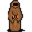{ .sprite } | [Mulgrith](mulgrith.md) | Enemy | 315 | 756 | 18 to 20 | 125 | 220 | 0 |
| { .sprite } | [Statue](brv_school_statue.md) | NPC/Enemy | 320 | 635 | 5 to 14 | 60 | 150 | 8 |
| { .sprite } | [Alaric](aidem_base_alaric.md) | NPC/Enemy | 329 | 707 | 7 to 9 | 158 | 170 | 0 |
| { .sprite } | [Grabby](aidem_camp_grabby.md) | NPC/Enemy | 329 | 707 | 7 to 9 | 158 | 170 | 0 |
| { .sprite } | [Greedy](aidem_camp_greedy.md) | NPC/Enemy | 329 | 707 | 7 to 9 | 158 | 170 | 0 |
| { .sprite } | [Zachlanny](aidem_camp_zachlanny.md) | NPC/Enemy | 329 | 707 | 7 to 9 | 158 | 170 | 0 |
| { .sprite } | [Defy](g04_defy.md) | NPC/Enemy | 359 | 851 | 10 to 18 | 170 | 170 | 0 |
| { .sprite } | [Grimmthorn marauder](grimmthorn_marauder.md) | Enemy | 369 | 562 | 8 to 9 | 173 | 65 | 9 |
| { .sprite } | [Dirty grimmthorn marauder](dirty_grimmthorn_marauder.md) | NPC/Enemy | 370 | 606 | 9 | 189 | 77 | 9 |
| { .sprite } | [Morkin elder](morkin_cr.md) | Enemy | 375 | 755 | 0 to 5 | 139 | 163 | 0 |

<h3 id="enemies-reptile">Reptile (130)</h3>

| | Name | Type | HP | XP | Damage | AC | BC | DR |
|---|---|---|---|---|---|---|---|---|
| { .sprite } | [Forest snake](forest_snake.md) | Enemy | 7 | 9 | 1 to 2 | 110 | 10 | 0 |
| { .sprite } | [Young cave snake](young_cave_snake.md) | Enemy | 8 | 18 | 2 | 110 | 10 | 0 |
| { .sprite } | [Cave snake](cave_snake.md) | Enemy | 12 | 23 | 2 | 110 | 15 | 0 |
| { .sprite } | [River frog](frog_1.md) | Enemy | 15 | 55 | 0 to 5 | 150 | 45 | 0 |
| { .sprite } | [Venomous cave snake](venomous_cave_snake.md) | Enemy | 15 | 79 | 2 | 110 | 10 | 0 |
| 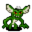{ .sprite } | [Young teeth critter](young_teeth_critter.md) | Enemy | 15 | 24 | 1 | 50 | 70 | 0 |
| { .sprite } | [Small stone worm](small_stone_worm.md) | Enemy | 17 | 47 | 2 to 4 | 97 | 80 | 1 |
| { .sprite } | [Tough river frog](frog_2.md) | Enemy | 17 | 60 | 0 to 5 | 160 | 49 | 0 |
| { .sprite } | [Young cave serpent](young_cave_serpent.md) | Enemy | 18 | 80 | 2 to 4 | 100 | 25 | 0 |
| { .sprite } | [Forest serpent](forest_serpent.md) | Enemy | 20 | 61 | 2 to 3 | 150 | 60 | 0 |
| { .sprite } | [Poisonous river frog](frog_3.md) | Enemy | 21 | 117 | 0 to 5 | 165 | 55 | 0 |
| { .sprite } | [Tough cave snake](tough_cave_snake.md) | Enemy | 21 | 30 | 2 | 110 | 15 | 0 |
| { .sprite } | [Cave serpent](cave_serpent.md) | Enemy | 24 | 90 | 2 to 5 | 100 | 35 | 0 |
| { .sprite } | [Teeth critter](teeth_critter.md) | Enemy | 25 | 38 | 1 | 60 | 70 | 0 |
| 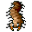{ .sprite } | [Stone worm](stone_worm_2.md) | Enemy | 26 | 122 | 3 to 4 | 100 | 100 | 2 |
| { .sprite } | [Vicious forest serpent](vicious_forest_serpent.md) | Enemy | 27 | 82 | 3 to 4 | 150 | 50 | 0 |
| 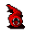{ .sprite } | [Angry cave worm](ratdom_m11b.md) | Enemy | 30 | 117 | 5 | 110 | 20 | 0 |
| { .sprite } | [Biting caterpillar](ratdom_m10b.md) | Enemy | 30 | 117 | 5 | 110 | 20 | 0 |
| { .sprite } | [Fierce cave lizard](ratdom_m7a.md) | Enemy | 30 | 117 | 5 | 110 | 20 | 0 |
| { .sprite } | [Lazy snail](ratdom_m5a.md) | Enemy | 30 | 117 | 5 | 110 | 20 | 0 |
| { .sprite } | [Malicious cave snake](ratdom_m2b.md) | Enemy | 30 | 117 | 5 | 110 | 20 | 0 |
| { .sprite } | [Malignant cave snake](ratdom_m3a.md) | Enemy | 30 | 117 | 5 | 110 | 20 | 0 |
| { .sprite } | [Nasty cave snake](cavesnake5.md) | Enemy | 30 | 117 | 5 | 110 | 20 | 0 |
| { .sprite } | [Nasty viper](ratdom_m12b.md) | Enemy | 30 | 117 | 5 | 110 | 20 | 0 |
| 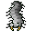{ .sprite } | [Old cave worm](ratdom_m11c.md) | Enemy | 30 | 117 | 5 | 110 | 20 | 0 |
| { .sprite } | [Pernicious cave snake](ratdom_m4a.md) | Enemy | 30 | 117 | 5 | 110 | 20 | 0 |
| { .sprite } | [Poisenous snail](ratdom_m5b.md) | Enemy | 30 | 117 | 5 | 110 | 20 | 0 |
| { .sprite } | [Poisonous caterpillar](ratdom_m10a.md) | Enemy | 30 | 117 | 5 | 110 | 20 | 0 |
| { .sprite } | [Quick viper](ratdom_m12a.md) | Enemy | 30 | 117 | 5 | 110 | 20 | 0 |
| { .sprite } | [Snappy cave lizard](ratdom_m7b.md) | Enemy | 30 | 117 | 5 | 110 | 20 | 0 |
| { .sprite } | [Venomous cave serpent](venomous_cave_serpent.md) | Enemy | 30 | 108 | 3 to 7 | 100 | 45 | 0 |
| { .sprite } | [Vicious cave snake](ratdom_m2a.md) | Enemy | 30 | 117 | 5 | 110 | 20 | 0 |
| { .sprite } | [Virulent cave snake](ratdom_m4b.md) | Enemy | 30 | 117 | 5 | 110 | 20 | 0 |
| 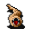{ .sprite } | [Young cave worm](ratdom_m11a.md) | Enemy | 30 | 117 | 5 | 110 | 20 | 0 |
| { .sprite } | [Nutritious cave snake](ratdom_maze_mole_food.md) | Enemy | 31 | 73 | 12 | 110 | 30 | 0 |
| { .sprite } | [Scaled venomfang](scaled_venomfang.md) | Enemy | 35 | 138 | 2 to 4 | 150 | 90 | 2 |
| { .sprite } | [Slithering venomfang](slithering_venomfang.md) | Enemy | 35 | 121 | 1 to 2 | 120 | 90 | 2 |
| { .sprite } | [Grasslands snake](grass_snake.md) | Enemy | 36 | 69 | 0 to 6 | 120 | 80 | 0 |
| { .sprite } | [Old stone worm](old_stone_worm.md) | Enemy | 36 | 145 | 3 to 4 | 102 | 110 | 3 |
| { .sprite } | [Slippery Venomfang](slippery_venomfang.md) | Enemy | 38 | 162 | 3 to 6 | 140 | 100 | 3 |
| { .sprite } | [Tough grasslands snake](grass_snake2.md) | Enemy | 38 | 80 | 1 to 7 | 125 | 80 | 0 |
| { .sprite } | [Angry stone worm](angry_stoneworm.md) | Enemy | 40 | 151 | 3 to 6 | 112 | 100 | 2 |
| 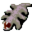{ .sprite } | [Basilisk](basilisk.md) | Enemy | 40 | 60 | 3 to 9 | 40 | 50 | 2 |
| { .sprite } | [Tough cave serpent](tough_cave_serpent.md) | Enemy | 40 | 137 | 3 to 9 | 100 | 55 | 2 |
| 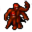{ .sprite } | [Young izthiel](izthiel_1.md) | Enemy | 40 | 96 | 2 to 7 | 70 | 57 | 5 |
| { .sprite } | [Hatchling white wyrm](hatchling_white_wyrm.md) | Enemy | 41 | 170 | 4 to 10 | 75 | 130 | 5 |
| { .sprite } | [Tough venomfang](tough_venomfang.md) | Enemy | 41 | 151 | 2 to 5 | 150 | 90 | 2 |
| 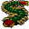{ .sprite } | [Ancient stone worm](ancient_stone_worm.md) | Enemy | 42 | 163 | 3 to 4 | 103 | 120 | 4 |
| { .sprite } | [Puny venomscale](vscale1.md) | Enemy | 42 | 201 | 2 to 4 | 83 | 103 | 2 |
| { .sprite } | [Noxious venomfang](noxious_venomfang.md) | Enemy | 44 | 177 | 3 to 6 | 155 | 85 | 4 |
| { .sprite } | [Black grasslands lizard](grass_lizard2.md) | Enemy | 45 | 126 | 2 to 9 | 125 | 80 | 4 |
| { .sprite } | [Erumen lizard](erumen_3.md) | Enemy | 45 | 126 | 2 to 9 | 125 | 80 | 4 |
| { .sprite } | [Grasslands lizard](grass_lizard.md) | Enemy | 45 | 106 | 0 to 8 | 120 | 80 | 3 |
| { .sprite } | [Izthiel](izthiel_2.md) | Enemy | 45 | 114 | 2 to 7 | 90 | 58 | 6 |
| { .sprite } | [Spotted erumen lizard](erumen_2.md) | Enemy | 45 | 126 | 2 to 9 | 125 | 80 | 4 |
| { .sprite } | [Young erumen lizard](erumen_1.md) | Enemy | 45 | 126 | 2 to 9 | 125 | 80 | 4 |
| { .sprite } | [Young venomscale](vscale2.md) | Enemy | 46 | 219 | 3 to 5 | 88 | 109 | 2 |
| { .sprite } | [Khakin spawn](khakin1.md) | Enemy | 47 | 243 | 7 to 9 | 204 | 69 | 6 |
| { .sprite } | [Young white wyrm](young_white_wyrm.md) | Enemy | 47 | 180 | 4 to 10 | 75 | 130 | 5 |
| { .sprite } | [Aggressive khakin beast](khakin2.md) | Enemy | 48 | 248 | 7 to 9 | 207 | 73 | 6 |
| { .sprite } | [Burrowing glow worm](burrowing_glow_worm.md) | Enemy | 48 | 256 | 4 to 7 | 101 | 109 | 7 |
| { .sprite } | [Gray venomscale](vscale3.md) | Enemy | 48 | 243 | 3 to 6 | 95 | 115 | 2 |
| { .sprite } | [Tough khakin beast](khakin3.md) | Enemy | 49 | 253 | 7 to 9 | 211 | 77 | 6 |
| { .sprite } | [Big cave snake](cavesnake4.md) | Enemy | 50 | 139 | 2 to 10 | 110 | 10 | 0 |
| 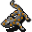{ .sprite } | [Lizard](stn_lizard.md) | Enemy | 50–100 | 118–190 | 1 to 7 | 40 | 120 | 5 |
| { .sprite } | [Strong khakin beast](khakin4.md) | Enemy | 50 | 259 | 7 to 9 | 215 | 81 | 6 |
| 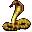{ .sprite } | [Young spitting serpent](spit_serpent_2.md) | Enemy | 50 | 123 | 1 to 7 | 100 | 60 | 0 |
| { .sprite } | [Aggressive venomscale](vscale4.md) | Enemy | 52 | 268 | 4 to 6 | 99 | 119 | 2 |
| { .sprite } | [Strong izthiel](izthiel_3.md) | Enemy | 52 | 182 | 2 to 7 | 80 | 60 | 8 |
| { .sprite } | [Izthiel guardian](izthiel_4.md) | Enemy | 54–354 | 218–554 | 3 to 7 | 120 | 60 | 11 |
| { .sprite } | [White wyrm](white_wyrm.md) | Enemy | 55 | 204 | 4 to 10 | 75 | 130 | 5 |
| { .sprite } | [Quick venomscale](vscale5.md) | Enemy | 56 | 294 | 5 to 6 | 104 | 121 | 2 |
| { .sprite } | [Irdegh spawn](irdegh_sp_1.md) | Enemy | 57–68 | 153–166 | 0 to 6 | 120 | 80 | 0 |
| { .sprite } | [Vicious venomscale](vscale6.md) | Enemy | 59 | 319 | 6 | 108 | 124 | 2 |
| { .sprite } | [Spitting serpent](spit_serpent_1.md) | Enemy | 60 | 154 | 2 to 7 | 120 | 65 | 0 |
| { .sprite } | [Strong venomscale](vscale7.md) | Enemy | 63 | 333 | 6 | 112 | 128 | 2 |
| { .sprite } | [Aggressive spitting serpent](spit_serpent_3.md) | Enemy | 65 | 217 | 3 to 9 | 150 | 75 | 0 |
| { .sprite } | [Tough venomscale](vscale8.md) | Enemy | 67 | 347 | 6 | 116 | 132 | 2 |
| { .sprite } | [Island lizard](island_lizard.md) | Enemy | 70 | 150 | 5 to 9 | 150 | 90 | 2 |
| 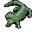{ .sprite } | [Strong erumen lizard](erumen_4.md) | Enemy | 79 | 169 | 2 to 9 | 125 | 80 | 4 |
| { .sprite } | [Cave worm](cave_worm.md) | Enemy | 80 | 119 | 1 to 11 | 80 | 75 | 0 |
| { .sprite } | [Young ViridToxin dartmaw](young_virid_toxin.md) | Enemy | 80 | 225 | 4 to 12 | 150 | 60 | 0 |
| { .sprite } | [Vile erumen lizard](erumen_5.md) | Enemy | 89 | 190 | 2 to 9 | 150 | 80 | 4 |
| 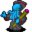{ .sprite } | [Keknazar](keknazar.md) | NPC/Enemy | 90 | 178 | 3 to 9 | 50 | 70 | 8 |
| { .sprite } | [Vicious cave worm](cave_worm_vicious.md) | Enemy | 90 | 161 | 3 to 12 | 90 | 110 | 0 |
| { .sprite } | [Tough erumen lizard](erumen_6.md) | Enemy | 91 | 215 | 2 to 9 | 125 | 90 | 8 |
| { .sprite } | [Young erumen forest lizard](erumen_8.md) | Enemy | 92 | 140 | 4 to 7 | 124 | 59 | 0 |
| { .sprite } | [Hardened erumen lizard](erumen_7.md) | Enemy | 93 | 243 | 2 to 9 | 125 | 90 | 12 |
| { .sprite } | [ViridToxin dartmaw](virid_toxin.md) | Enemy | 93 | 285 | 6 to 14 | 160 | 77 | 0 |
| { .sprite } | [Giant serpent](stn_colonel_mons4.md) | Enemy | 100 | 190 | 1 to 4 | 40 | 120 | 5 |
| { .sprite } | [River snapper](sutdover_snapper.md) | Enemy | 100 | 482 | 11 to 25 | 140 | 250 | 25 |
| { .sprite } | [Sullengard snapper](sullengard_snapper.md) | NPC/Enemy | 100 | 327 | 11 to 15 | 130 | 200 | 10 |
| { .sprite } | [Erumen forest lizard](erumen_9.md) | Enemy | 107 | 176 | 6 to 7 | 146 | 65 | 0 |
| { .sprite } | [Erumen forest lizard matriarch](erumen_10.md) | Enemy | 114 | 309 | 7 to 8 | 166 | 73 | 9 |
| { .sprite } | [Snapmaw](snapmaw.md) | Enemy | 114 | 516 | 13 to 25 | 140 | 250 | 25 |
| { .sprite } | [Irdegh](irdegh_1.md) | Enemy | 115 | 280 | 3 to 7 | 120 | 60 | 10 |
| { .sprite } | [Ancient basilisk](old_basilisk.md) | Enemy | 120 | 290 | 5 to 8 | 80 | 130 | 8 |
| { .sprite } | [Venomous irdegh](irdegh_2.md) | Enemy | 120 | 292 | 3 to 7 | 120 | 60 | 11 |
| { .sprite } | [Bog eel](bog_eel.md) | Enemy | 121 | 489 | 8 to 13 | 191 | 209 | 9 |
| { .sprite } | [Yellow tooth slitherer](yellow_tooth.md) | Enemy | 121 | 452 | 10 to 16 | 215 | 92 | 3 |
| { .sprite } | [Piercing irdegh](irdegh_3.md) | Enemy | 125 | 305 | 3 to 7 | 120 | 60 | 11 |
| { .sprite } | [Ancient piercing irdegh](irdegh_4.md) | Enemy | 130 | 345 | 3 to 7 | 120 | 60 | 14 |
| { .sprite } | [Crocodilian behemoth](crocodilian_behemoth.md) | Enemy | 130 | 554 | 15 to 25 | 200 | 149 | 2 |
| { .sprite } | [Swamp lizard](swamp_lizard.md) | Enemy | 130 | 511 | 10 to 15 | 191 | 176 | 9 |
| { .sprite } | [Drakthorn](drakthorn.md) | Enemy | 143 | 254 | 8 to 20 | 93 | 84 | 2 |
| { .sprite } | [Drakthorn warrior](drakthorn_warrior.md) | Enemy | 146 | 279 | 10 to 22 | 97 | 88 | 3 |
| { .sprite } | [Sullengard forest snake](sullengard_venom_snake.md) | Enemy | 148 | 631 | 15 to 22 | 220 | 108 | 5 |
| { .sprite } | [Drakthorn warrior captain](drakthorn_warrior_captain.md) | Enemy | 154 | 321 | 12 to 25 | 108 | 99 | 3 |
| { .sprite } | [Green-claw-emyro](brightport_lizard.md) | NPC/Enemy | 160 | 600 | 14 to 36 | 180 | 160 | 4 |
| { .sprite } | [Long-tail-dominio](brightport_lizardpriest.md) | NPC/Enemy | 160 | 404 | 8 to 15 | 180 | 160 | 4 |
| { .sprite } | [Tail-swing-tyliad](brightport_lizardadvisor.md) | NPC/Enemy | 160 | 437 | 8 to 15 | 180 | 190 | 4 |
| { .sprite } | [Sullengard red forest snake](sull_red_forest_snake.md) | Enemy | 175 | 768 | 18 to 25 | 245 | 115 | 5 |
| { .sprite } | [Cavern snake](brightport_snake.md) | Enemy | 180 | 716 | 18 to 28 | 230 | 160 | 6 |
| { .sprite } | [King Sullengard forest snake](sullengard_venom_snake_king.md) | Enemy | 207 | 880 | 20 to 25 | 247 | 128 | 7 |
| { .sprite } | [Queen Sullengard forest snake](sullengard_venom_snake_queen.md) | Enemy | 207 | 880 | 20 to 25 | 247 | 128 | 7 |
| { .sprite } | [King yellow tooth slitherer](yellow_tooth_king.md) | Enemy | 208 | 767 | 16 to 23 | 235 | 128 | 6 |
| { .sprite } | [Speak-funny-vyro](brightport_lizard6.md) | NPC/Enemy | 220 | 579 | 8 to 15 | 220 | 180 | 4 |
| { .sprite } | [Verdant cyclopea creeper](verdant_cyclopea_creeper.md) | Enemy | 227 | 524 | 3 to 6 | 139 | 178 | 0 |
| { .sprite } | [Lizardman corsair](brightport_redlizard.md) | Enemy | 230 | 747 | 20 to 25 | 213 | 170 | 8 |
| { .sprite } | [Lizardman fencer](brightport_redlizard2.md) | Enemy | 230 | 995 | 15 to 32 | 230 | 180 | 12 |
| { .sprite } | [Flamejaw tunnelbeast](flamejaw_tunnelbeast.md) | Enemy | 237 | 530 | 7 to 10 | 150 | 131 | 5 |
| { .sprite } | [Spiked cyclopea creeper](spiked_cyclopea_creeper.md) | Enemy | 238 | 558 | 4 to 6 | 140 | 183 | 0 |
| 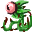{ .sprite } | [Crimoculus Cyclopea creeper](agg_cyclopea_creeper.md) | Enemy | 245 | 626 | 6 | 155 | 191 | 0 |
| 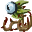{ .sprite } | [Cyclopea creeper](cyclopea_creeper.md) | Enemy | 245 | 592 | 5 to 7 | 145 | 188 | 0 |
| { .sprite } | [Green-blade-remio](brightport_lizard3.md) | NPC/Enemy | 250 | 702 | 13 to 22 | 220 | 180 | 4 |
| { .sprite } | [Green-fang-tylmio](brightport_lizard4.md) | NPC/Enemy | 250 | 702 | 13 to 22 | 220 | 180 | 4 |
| { .sprite } | [Lizard warrior](brightport_lizard00.md) | Enemy | 250 | 714 | 13 to 22 | 220 | 180 | 4 |
| { .sprite } | [Three-head-arminio](brightport_lizard1.md) | NPC/Enemy | 250 | 702 | 13 to 22 | 220 | 180 | 4 |
| { .sprite } | [Tough-scale-artorio](brightport_lizard5.md) | NPC/Enemy | 250 | 702 | 13 to 22 | 220 | 180 | 4 |
| { .sprite } | [Three-fang-elyzard](brightport_lizardking.md) | NPC/Enemy | 400 | 1,489 | 20 to 35 | 230 | 200 | 8 |

<h3 id="enemies-insect">Insect (93)</h3>

| | Name | Type | HP | XP | Damage | AC | BC | DR |
|---|---|---|---|---|---|---|---|---|
| { .sprite } | [Roach](vermin2.md) | Enemy | 1 | 1 | 0 to 1 | 10 | 5 | 0 |
| { .sprite } | [Black ant](black_ant.md) | Enemy | 3 | 5 | 1 to 2 | 70 | 0 | 0 |
| { .sprite } | [Beetle](beetle.md) | Enemy | 4 | 8 | 3 | 70 | 0 | 0 |
| { .sprite } | [Forest ant](forest_ant.md) | Enemy | 4 | 6 | 1 to 2 | 90 | 10 | 0 |
| { .sprite } | [Small wasp](small_wasp.md) | Enemy | 4 | 6 | 1 to 2 | 70 | 0 | 0 |
| { .sprite } | [Yellow forest ant](yellow_forest_ant.md) | Enemy | 5 | 9 | 2 | 100 | 15 | 0 |
| { .sprite } | [Forest wasp](forest_wasp.md) | Enemy | 6 | 7 | 1 to 2 | 70 | 0 | 0 |
| { .sprite } | [Forest beetle](forest_beetle.md) | Enemy | 14 | 38 | 2 to 4 | 150 | 60 | 2 |
| { .sprite } | [Stinging wasp](stinging_wasp.md) | Enemy | 15 | 22 | 1 to 2 | 150 | 60 | 0 |
| 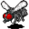{ .sprite } | [Giant dungfly](dungfly1.md) | Enemy | 16 | 44 | 4 to 5 | 55 | 20 | 1 |
| { .sprite } | [Yellow cave ant](yellow_cave_ant.md) | Enemy | 20 | 28 | 1 | 30 | 80 | 0 |
| { .sprite } | [Aggressive dungfly](dungfly2.md) | Enemy | 23 | 68 | 5 to 7 | 60 | 35 | 3 |
| { .sprite } | [Hardshell beetle](hardshell_beetle.md) | Enemy | 25 | 87 | 0 to 5 | 50 | 40 | 9 |
| { .sprite } | [Frantic forest wasp](fieldwasp_0.md) | Enemy | 29–70 | 89–246 | 2 to 6 | 70 | 95–150 | 0 |
| { .sprite } | [Grasslands ant](grass_ant.md) | Enemy | 29 | 52 | 0 to 4 | 120 | 80 | 0 |
| { .sprite } | [Tough grasslands ant](grass_ant2.md) | Enemy | 29 | 61 | 1 to 5 | 125 | 80 | 0 |
| { .sprite } | [Cave scorpion](cave_scorpion_0.md) | Enemy | 30–150 | 121–544 | 3 to 30 | 80–230 | 100–150 | 1–4 |
| { .sprite } | [Larval cave burrower](burrower_1.md) | Enemy | 30 | 103 | 1 to 25 | 95 | 80 | 2 |
| { .sprite } | [Puny cave scorpion](cave_scorpion_2.md) | Enemy | 30 | 107 | 2 to 5 | 80 | 85 | 0 |
| { .sprite } | [Tough cave scorpion](cave_scorpion_3.md) | Enemy | 30 | 128 | 3 to 6 | 80 | 100 | 2 |
| { .sprite } | [Young larval burrower](young_larval_burrower.md) | Enemy | 30 | 63 | 1 to 6 | 120 | 25 | 0 |
| { .sprite } | [Puny yellowjacket](yjacket1.md) | Enemy | 31 | 110 | 3 to 4 | 74 | 53 | 0 |
| { .sprite } | [Young scaradon](scaradon_1.md) | Enemy | 32 | 130 | 0 to 4 | 50 | 30 | 15 |
| { .sprite } | [Grasslands beetle](grass_beetle.md) | Enemy | 34 | 75 | 0 to 5 | 120 | 80 | 3 |
| { .sprite } | [Vicious dungfly](dungfly3.md) | Enemy | 34 | 96 | 7 to 8 | 75 | 45 | 3 |
| 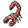{ .sprite } | [Aggressive cave scorpion](cave_scorpion_1.md) | Enemy | 35 | 140 | 4 to 7 | 100 | 100 | 1 |
| { .sprite } | [Armored cave scorpion](cave_scorpion_4.md) | Enemy | 35 | 167 | 4 to 8 | 100 | 120 | 4 |
| { .sprite } | [Fierce cave scorpion](cave_scorpion_5.md) | Enemy | 35 | 180 | 5 to 10 | 130 | 100 | 3 |
| { .sprite } | [Larval burrower](larval_burrower.md) | Enemy | 35 | 67 | 1 to 6 | 120 | 25 | 0 |
| { .sprite } | [Scaradon](scaradon_3.md) | Enemy | 35 | 146 | 0 to 4 | 50 | 30 | 17 |
| { .sprite } | [Small scaradon](scaradon_2.md) | Enemy | 35 | 135 | 1 to 4 | 50 | 30 | 15 |
| { .sprite } | [Strong larval burrower](burrower_3.md) | Enemy | 35–44 | 67–120 | 1 to 25 | 95–120 | 25–80 | 0–2 |
| { .sprite } | [Tough grasslands beetle](grass_beetle2.md) | Enemy | 35 | 88 | 1 to 6 | 125 | 80 | 4 |
| { .sprite } | [Cave burrower](burrower_2.md) | Enemy | 37 | 112 | 1 to 25 | 95 | 80 | 2 |
| { .sprite } | [Small yellowjacket](yjacket2.md) | Enemy | 37 | 119 | 3 to 4 | 79 | 57 | 0 |
| { .sprite } | [Tough scaradon](scaradon_4.md) | Enemy | 37 | 149 | 1 to 4 | 50 | 30 | 17 |
| { .sprite } | [Hardshell scaradon](scaradon_5.md) | Enemy | 38 | 158 | 1 to 5 | 50 | 30 | 18 |
| { .sprite } | [Aggressive caterpillar](waterwayacaterpillar.md) | Enemy | 40 | 70 | 3 to 6 | 80 | 60 | 1 |
| { .sprite } | [Swarming yellowjacket](yjacket3.md) | Enemy | 42 | 128 | 3 to 4 | 85 | 63 | 0 |
| { .sprite } | [Young carrion beetle](cbeetle_1.md) | Enemy | 45 | 105 | 0 to 5 | 65 | 30 | 9 |
| { .sprite } | [Stinging yellowjacket](yjacket4.md) | Enemy | 48 | 140 | 3 to 4 | 92 | 69 | 0 |
| { .sprite } | [Carrion beetle](cbeetle_2.md) | Enemy | 51 | 111 | 0 to 5 | 75 | 30 | 9 |
| { .sprite } | [Quick yellowjacket](yjacket5.md) | Enemy | 53 | 151 | 3 to 4 | 101 | 74 | 0 |
| { .sprite } | [Carrion centipede](ccentip0.md) | Enemy | 54 | 158 | 6 to 14 | 48 | 132 | 0 |
| { .sprite } | [Hardershell beetle](hardershell_beetle.md) | Enemy | 54 | 163 | 1 to 7 | 60 | 70 | 14 |
| { .sprite } | [Village ant](village_ant.md) | Enemy | 54 | 146 | 1 to 4 | 60 | 109 | 9 |
| { .sprite } | [Puny plaguecrawler](plaguesp_1.md) | Enemy | 55 | 192 | 1 to 6 | 80 | 140 | 0 |
| { .sprite } | [Ravenous carrion centipede](ccentip1.md) | Enemy | 56 | 165 | 7 to 14 | 53 | 132 | 0 |
| { .sprite } | [Plaguecrawler](plaguesp_2.md) | Enemy | 57 | 196 | 1 to 6 | 80 | 140 | 0 |
| { .sprite } | [Young poisonous cave burrower](caveburr1.md) | Enemy | 57 | 99 | 0 to 5 | 54 | 126 | 0 |
| { .sprite } | [Aggressive yellowjacket](yjacket6.md) | Enemy | 58 | 163 | 3 to 4 | 112 | 81 | 0 |
| { .sprite } | [Bloated carrion centipede](ccentip2.md) | Enemy | 59 | 172 | 8 to 14 | 55 | 132 | 0 |
| { .sprite } | [Tough plaguecrawler](plaguesp_3.md) | Enemy | 59 | 199 | 1 to 6 | 80 | 140 | 0 |
| 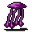{ .sprite } | [Blooming amoeba](brightport_amoeba.md) | Enemy | 60 | 175 | 4 to 10 | 100 | 50 | 6 |
| { .sprite } | [Black plaguecrawler](plaguesp_4.md) | Enemy | 61 | 207 | 1 to 6 | 80 | 150 | 0 |
| { .sprite } | [Infected larval cave burrower](caveburr2.md) | Enemy | 62 | 111 | 0 to 6 | 57 | 129 | 0 |
| { .sprite } | [Plaguestrider](plaguesp_5.md) | Enemy | 62 | 215 | 2 to 6 | 80 | 150 | 0 |
| { .sprite } | [Hardshell plaguestrider](plaguesp_6.md) | Enemy | 63 | 217 | 2 to 6 | 80 | 150 | 0 |
| { .sprite } | [Tough plaguestrider](plaguesp_7.md) | Enemy | 64 | 227 | 2 to 6 | 80 | 155 | 0 |
| { .sprite } | [Poisonous cave burrower](caveburr3.md) | Enemy | 65 | 167 | 0 to 6 | 60 | 131 | 0 |
| { .sprite } | [Wooly plaguestrider](plaguesp_8.md) | Enemy | 65 | 229 | 2 to 6 | 80 | 155 | 0 |
| { .sprite } | [Enraged yellowjacket](yjacket7.md) | Enemy | 66 | 179 | 3 to 4 | 118 | 87 | 0 |
| { .sprite } | [Tough wooly plaguestrider](plaguesp_9.md) | Enemy | 66 | 241 | 2 to 7 | 80 | 160 | 0 |
| { .sprite } | [Strong poisonous cave burrower](caveburr4.md) | Enemy | 67 | 172 | 0 to 6 | 64 | 134 | 0 |
| { .sprite } | [Vile plaguestrider](plaguesp_10.md) | Enemy | 67 | 247 | 2 to 7 | 85 | 160 | 0 |
| { .sprite } | [Nesting plaguestrider](plaguesp_11.md) | Enemy | 68 | 251 | 2 to 7 | 85 | 165 | 0 |
| { .sprite } | [Giant poisonous cave burrower](caveburr5.md) | Enemy | 69 | 177 | 0 to 6 | 67 | 136 | 0 |
| { .sprite } | [Giant yellowjacket](yjacket8.md) | Enemy | 74 | 180 | 3 to 4 | 126 | 93 | 0 |
| { .sprite } | [Giant larval burrower](burrower_4.md) | Enemy | 75–175 | 159–285 | 1 to 25 | 95 | 80 | 2 |
| { .sprite } | [Duleian buzzer](duleian_hornet.md) | Enemy | 77 | 281 | 4 to 5 | 89 | 175 | 9 |
| { .sprite } | [Grass spider](grass_spider.md) | Enemy | 79 | 307 | 4 to 6 | 100 | 170 | 12 |
| 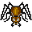{ .sprite } | [Dirt spider](dirt_spider.md) | Enemy | 82 | 331 | 5 to 7 | 107 | 175 | 13 |
| 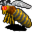{ .sprite } | [Yellowjacket queen](yjacket9.md) | Enemy | 87 | 277 | 5 to 7 | 147 | 125 | 4 |
| { .sprite } | [Basement spider](laerothbasement_spider.md) | Enemy | 90 | 340 | 6 to 14 | 100 | 170 | 0 |
| { .sprite } | [Forest hunter](forest_hunter.md) | Enemy | 90 | 356 | 12 to 21 | 150 | 160 | 6 |
| { .sprite } | [Giant centipede](centipede.md) | Enemy | 90 | 203 | 3 to 9 | 70 | 90 | 1 |
| { .sprite } | [Young church dweller](young_church_dweller.md) | Enemy | 93 | 168 | 8 to 11 | 81 | 89 | 2 |
| { .sprite } | [Poisonous jitterfly](poisonous_jitterfly.md) | Enemy | 97 | 316 | 6 to 8 | 118 | 215 | 0 |
| 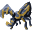{ .sprite } | [Church dweller](church_dweller.md) | Enemy | 98 | 188 | 9 to 12 | 84 | 92 | 3 |
| { .sprite } | [Swamp hornet](swamp_hornet.md) | Enemy | 99 | 481 | 12 to 15 | 170 | 225 | 5 |
| 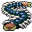{ .sprite } | [Aggressive giant centipede](centipede_aggressive.md) | Enemy | 100 | 243 | 5 to 11 | 80 | 100 | 2 |
| 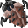{ .sprite } | [Swamp beetle](swamp_bettle.md) | Enemy | 101 | 461 | 7 to 12 | 150 | 175 | 20 |
| 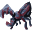{ .sprite } | [Adult church dweller](adult_church_dweller.md) | Enemy | 102 | 214 | 11 to 14 | 87 | 91 | 5 |
| { .sprite } | [Giant spider](spider_massive.md) | Enemy | 104 | 382 | 8 to 15 | 120 | 145 | 4 |
| { .sprite } | [Giant mosquito](giant_mosquito.md) | Enemy | 106 | 503 | 10 to 12 | 190 | 250 | 0 |
| { .sprite } | [Spitfire bug](spitfire_bug.md) | Enemy | 106 | 520 | 11 to 12 | 190 | 260 | 0 |
| 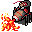{ .sprite } | [Young spitfire bug](young_spitfire_bug.md) | Enemy | 106 | 482 | 9 to 11 | 190 | 245 | 0 |
| { .sprite } | [Preabola fly](preabola_fly.md) | Enemy | 109 | 405 | 9 to 11 | 170 | 205 | 8 |
| { .sprite } | [Flying tree ant](flying_tree_ant.md) | Enemy | 119 | 479 | 9 to 15 | 144 | 207 | 9 |
| { .sprite } | [Red tree ant](red_tree_ant.md) | Enemy | 131 | 618 | 12 to 15 | 151 | 211 | 14 |
| 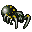{ .sprite } | [Queen spider](spider_queen.md) | Enemy | 135 | 502 | 8 to 19 | 135 | 150 | 5 |
| 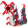{ .sprite } | [Steelthorn hexileg](steelthorn_hexileg.md) | Enemy | 211 | 514 | 4 to 6 | 120 | 167 | 5 |
| { .sprite } | [Hexapede crawler](hexapede_crawler.md) | Enemy | 228 | 557 | 5 to 7 | 135 | 185 | 8 |

<h3 id="enemies-giant">Giant (68)</h3>

| | Name | Type | HP | XP | Damage | AC | BC | DR |
|---|---|---|---|---|---|---|---|---|
| { .sprite } | [Young minotaur](young_minotaur.md) | Enemy | 45 | 64 | 4 | 20 | 50 | 2 |
| { .sprite } | [Strong minotaur](strong_minotaur.md) | Enemy | 53 | 79 | 5 | 40 | 50 | 2 |
| { .sprite } | [Young gornaud](young_gornaud.md) | Enemy | 70 | 146 | 0 to 15 | 70 | 50 | 0 |
| { .sprite } | [Fast mountain brute](mbrute_6.md) | Enemy | 82 | 188 | 0 to 14 | 80 | 60 | 4 |
| { .sprite } | [Quick mountain brute](mbrute_7.md) | Enemy | 93 | 205 | 0 to 15 | 80 | 60 | 4 |
| { .sprite } | [Gornaud](gornaud.md) | Enemy | 95 | 197 | 0 to 15 | 70 | 50 | 4 |
| { .sprite } | [Strong gornaud](strong_gornaud.md) | Enemy | 95 | 204 | 0 to 15 | 70 | 50 | 5 |
| { .sprite } | [Aggressive mountain brute](mbrute_8.md) | Enemy | 104 | 223 | 1 to 15 | 80 | 60 | 4 |
| { .sprite } | [Young aulaeth](young_aulaeth.md) | Enemy | 105 | 131 | 0 to 4 | 40 | 30 | 5 |
| { .sprite } | [Strong mountain brute](mbrute_9.md) | Enemy | 115 | 215 | 1 to 15 | 80 | 60 | 4 |
| { .sprite } | [Aulaeth](aulaeth.md) | Enemy | 120 | 160 | 0 to 5 | 40 | 40 | 6 |
| { .sprite } | [Tough mountain brute](mbrute_10.md) | Enemy | 126 | 248 | 2 to 15 | 80 | 60 | 4 |
| 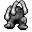{ .sprite } | [Mazarth beast](mazarth1.md) | Enemy | 129 | 263 | 0 to 17 | 75 | 60 | 12 |
| { .sprite } | [Strong aulaeth](strong_aulaeth.md) | Enemy | 135 | 170 | 0 to 5 | 40 | 35 | 6 |
| { .sprite } | [Fearless mountain brute](mbrute_11.md) | Enemy | 137 | 261 | 2 to 15 | 80 | 60 | 4 |
| { .sprite } | [Enraged mountain brute](mbrute_12.md) | Enemy | 148 | 291 | 2 to 16 | 80 | 60 | 4 |
| { .sprite } | [Tough mazarth beast](mazarth2.md) | Enemy | 148 | 302 | 0 to 20 | 79 | 67 | 12 |
| 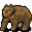{ .sprite } | [Young mountain brute](mbrute_1.md) | Enemy | 148 | 222 | 0 to 14 | 70 | 60 | 4 |
| { .sprite } | [Weak mountain brute](mbrute_2.md) | Enemy | 157 | 232 | 0 to 14 | 70 | 60 | 4 |
| { .sprite } | [Gornaud leader](gornaud_boss.md) | Enemy | 165 | 362 | 10 to 30 | 100 | 70 | 5 |
| 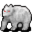{ .sprite } | [Whitefur mountain brute](mbrute_3.md) | Enemy | 166 | 242 | 0 to 14 | 70 | 60 | 4 |
| { .sprite } | [Zortak scout](zortak1.md) | Enemy | 173 | 245 | 4 to 12 | 134 | 51 | 4 |
| { .sprite } | [Mountain brute](mbrute_4.md) | Enemy | 175 | 253 | 0 to 14 | 70 | 60 | 4 |
| 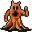{ .sprite } | [Dried kazarite golem](elm_golem2.md) | Enemy | 183 | 349 | 9 to 33 | 93 | 101 | 0 |
| { .sprite } | [Large mountain brute](mbrute_5.md) | Enemy | 184 | 263 | 0 to 14 | 70 | 60 | 4 |
| { .sprite } | [Zortak fighter](zortak2.md) | Enemy | 189 | 273 | 4 to 9 | 144 | 63 | 4 |
| { .sprite } | [Zortak guard](zortak3.md) | Enemy | 195 | 301 | 2 to 10 | 165 | 73 | 5 |
| { .sprite } | [Kazarite golem](elm_golem1.md) | Enemy | 198 | 396 | 9 to 36 | 81 | 99 | 5 |
| { .sprite } | [Zortak barbarian](zortak4.md) | Enemy | 207 | 337 | 3 to 11 | 178 | 79 | 5 |
| { .sprite } | [River troll](rivertroll.md) | Enemy | 210 | 348 | 2 to 9 | 120 | 65 | 7 |
| { .sprite } | [Guardian of the bridge](lbridge.md) | NPC/Enemy | 213 | 575 | 5 to 15 | 127 | 153 | 9 |
| { .sprite } | [Cave troll](cave_troll_1.md) | Enemy | 230 | 296 | 1 to 15 | 60 | 40 | 0 |
| { .sprite } | [Ogre](ratdom_uglybrute.md) | Enemy | 230 | 383 | 1 to 30 | 90 | 70 | 0 |
| { .sprite } | [Weak ogre](ratdom_troll_2.md) | Enemy | 230 | 290 | 1 to 12 | 55 | 35 | 0 |
| { .sprite } | [Young ogre](ratdom_troll_1.md) | Enemy | 230 | 271 | 1 to 10 | 50 | 30 | 0 |
| 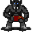{ .sprite } | [Strong cave troll](cave_troll_2.md) | Enemy | 250 | 323 | 5 to 15 | 65 | 40 | 0 |
| { .sprite } | [Maonit troll](maonit_1.md) | Enemy | 255 | 259 | 1 to 20 | 65 | 20 | 4 |
| { .sprite } | [Giant maonit troll](maonit_2.md) | Enemy | 270 | 271 | 1 to 20 | 65 | 20 | 4 |
| { .sprite } | [Zortak leader](zortakb.md) | NPC/Enemy | 279 | 623 | 9 | 185 | 125 | 0 |
| { .sprite } | [Strong maonit troll](maonit_3.md) | Enemy | 285 | 294 | 1 to 20 | 65 | 20 | 5 |
| { .sprite } | [Maonit brute](maonit_4.md) | Enemy | 290 | 299 | 1 to 20 | 65 | 20 | 5 |
| { .sprite } | [Tough cave troll](cave_troll_3.md) | Enemy | 290 | 382 | 5 to 15 | 65 | 50 | 0 |
| { .sprite } | [Cave troll shaman](cave_troll_4.md) | Enemy | 300–370 | 365–563 | 1 to 18 | 60–90 | 40–70 | 0–4 |
| { .sprite } | [Laska blizz](laska_blizz.md) | Enemy | 300 | 832 | 25 to 27 | 130 | 200 | 11 |
| { .sprite } | [Venomous swamp creature](venomous_swamp_creature.md) | Enemy | 301 | 1,175 | 28 to 33 | 130 | 301 | 18 |
| { .sprite } | [Tough maonit brute](maonit_5.md) | Enemy | 310 | 376 | 1 to 20 | 65 | 20 | 6 |
| 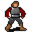{ .sprite } | [Kaverin](kaverin.md) | NPC/Enemy | 320 | 491 | 1 to 20 | 65 | 90 | 6 |
| { .sprite } | [Strong maonit brute](maonit_6.md) | Enemy | 320–620 | 384–636 | 1 to 20 | 65 | 20 | 6 |
| { .sprite } | [Arulir](arulir_1.md) | Enemy | 325 | 403 | 1 to 20 | 70 | 20 | 8 |
| { .sprite } | [Angry ogre](ratdom_troll_3.md) | Enemy | 330 | 405 | 10 to 15 | 60 | 40 | 0 |
| { .sprite } | [Giant arulir](arulir_2.md) | Enemy | 330 | 407 | 1 to 20 | 70 | 20 | 8 |
| { .sprite } | [Mad ogre](ratdom_troll_4.md) | Enemy | 330 | 500 | 10 to 20 | 90 | 70 | 0 |
| { .sprite } | [Cave Arulir](arulir_3.md) | Enemy | 365 | 477 | 3 to 22 | 80 | 28 | 8 |
| { .sprite } | [Dangerous ogre](ratdom_troll_5.md) | Enemy | 380 | 559 | 15 to 30 | 60 | 70 | 0 |
| { .sprite } | [Giant Cave Arulir](arulir_4.md) | Enemy | 380 | 503 | 3 to 22 | 80 | 28 | 10 |
| { .sprite } | [Garnet Gornaud](gornaud_5.md) | Enemy | 385 | 536 | 7 to 23 | 120 | 45 | 9 |
| { .sprite } | [Azurite Gornaud](gornaud_4.md) | Enemy | 390 | 541 | 7 to 23 | 120 | 45 | 9 |
| { .sprite } | [Nephrite Gornaud](gornaud_6.md) | Enemy | 395 | 546 | 7 to 23 | 120 | 45 | 9 |
| 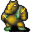{ .sprite } | [Golden Arulir](arulir_5.md) | Enemy | 403 | 571 | 4 to 25 | 110 | 28 | 12 |
| { .sprite } | [Cave troll leader](cave_troll_5.md) | NPC/Enemy | 410 | 518 | 5 to 20 | 70 | 50 | 0 |
| { .sprite } | [Gamjee](gamjee.md) | NPC/Enemy | 417 | 741 | 10 to 13 | 70 | 101 | 13 |
| 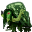{ .sprite } | [Charwood troll](brightport_troll.md) | Enemy | 420 | 1,262 | 13 to 24 | 223 | 240 | 14 |
| { .sprite } | [Ancient ogre](ratdom_troll_6.md) | Enemy | 430 | 647 | 15 to 30 | 90 | 70 | 0 |
| 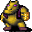{ .sprite } | [Giant Golden Arulir](arulir_6.md) | Enemy | 501 | 674 | 4 to 27 | 110 | 29 | 13 |
| { .sprite } | [Giant ogre](ratdom_troll_9.md) | Enemy | 590 | 1,005 | 20 to 60 | 90 | 90 | 15 |
| { .sprite } | [Sleepy giant ogre](mg2_troll.md) | NPC/Enemy | 590 | 1,005 | 20 to 60 | 90 | 90 | 15 |
| { .sprite } | [Demonic Arulir](arulir_8.md) | Enemy | 750 | 970 | 4 to 20 | 110 | 32 | 14 |
| { .sprite } | [Arulir Pack Leader](arulir_leader.md) | Enemy | 1000 | 1,299 | 10 to 20 | 125 | 35 | 15 |

<h3 id="enemies-construct">Construct (64)</h3>

| | Name | Type | HP | XP | Damage | AC | BC | DR |
|---|---|---|---|---|---|---|---|---|
| { .sprite } | [Skeletal reaper](skeletal_reaper.md) | Enemy | 15 | 62 | 0 to 9 | 150 | 110 | 0 |
| { .sprite } | [Olive ooze](jelly1.md) | Enemy | 20 | 137 | 5 to 9 | 120 | 35 | 4 |
| { .sprite } | [Bone warrior](bone_warrior.md) | Enemy | 32 | 79 | 3 to 9 | 120 | 60 | 2 |
| { .sprite } | [Emerald jelly](jelly2.md) | Enemy | 35 | 144 | 7 to 8 | 95 | 45 | 0 |
| { .sprite } | [Fledgling gargoyle](fledgling_gargoyle.md) | Enemy | 35 | 63 | 3 to 6 | 110 | 60 | 2 |
| { .sprite } | [Skeleton](skeleton.md) | NPC/Enemy | 35–100 | 38–190 | 1 to 20 | 40–100 | 0–150 | 0–6 |
| { .sprite } | [Young gargoyle](young_gargoyle.md) | Enemy | 35 | 58 | 2 to 5 | 110 | 70 | 1 |
| { .sprite } | [Young shadow gargoyle](young_shadow_gargoyle.md) | Enemy | 35 | 83 | 3 to 9 | 65 | 75 | 3 |
| { .sprite } | [Fledgling shadow gargoyle](fledgling_shadow_gargoyle.md) | Enemy | 36 | 84 | 3 to 9 | 65 | 75 | 3 |
| { .sprite } | [Mudfiend](mudfiend1.md) | Enemy | 37 | 81 | 4 to 6 | 75 | 42 | 0 |
| { .sprite } | [Shadow gargoyle](shadow_gargoyle.md) | Enemy | 37 | 93 | 4 to 10 | 70 | 85 | 3 |
| { .sprite } | [Tough shadow gargoyle](tough_shadow_gargoyle.md) | Enemy | 37 | 99 | 4 to 10 | 70 | 85 | 4 |
| { .sprite } | [Tough mudfiend](mudfiend2.md) | Enemy | 41 | 93 | 5 to 6 | 78 | 45 | 0 |
| 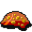{ .sprite } | [Poisonous ooze](jelly3.md) | Enemy | 45 | 167 | 5 to 9 | 140 | 20 | 3 |
| { .sprite } | [Gargoyle](gargoyle.md) | Enemy | 47 | 83 | 3 to 7 | 110 | 70 | 2 |
| { .sprite } | [Bone champion](bone_champion.md) | Enemy | 49 | 103 | 4 to 9 | 130 | 60 | 2 |
| { .sprite } | [Dead worms](dead_worms.md) | Enemy | 50 | 126 | 5 to 15 | 100 | 50 | 5 |
| { .sprite } | [Ochre jelly](jelly4.md) | Enemy | 50 | 197 | 10 to 14 | 85 | 45 | 5 |
| { .sprite } | [Luthor's skeleton guard](tt_monster1.md) | Enemy | 52 | 63 | 1 to 3 | 60 | 40 | 1 |
| { .sprite } | [Skeletal master](skeletal_master.md) | Enemy | 52 | 66 | 1 to 3 | 70 | 30 | 2 |
| { .sprite } | [Skeletal warrior](skeletal_warrior.md) | Enemy | 52 | 63 | 1 to 3 | 60 | 40 | 1 |
| { .sprite } | [Creeping fungus](waterwayamushroom.md) | Enemy | 65 | 157 | 3 to 7 | 115 | 70 | 0 |
| { .sprite } | [Crimson jelly](jelly5.md) | Enemy | 65 | 211 | 8 to 12 | 115 | 70 | 4 |
| { .sprite } | [Animated debris](elm_debris.md) | Enemy | 70 | 317 | 1 to 9 | 91 | 149 | 21 |
| { .sprite } | [Cave gargoyle](waterwaycavebeast.md) | Enemy | 70 | 217 | 5 to 7 | 100 | 50 | 4 |
| { .sprite } | [Rock fiend](waterwaycaverockmonster.md) | Enemy | 80 | 202 | 6 to 8 | 60 | 80 | 3 |
| { .sprite } | [Poisonous vine](poison_vine_top.md) | Enemy | 90 | 187 | 1 to 3 | 350 | 50 | 2 |
| { .sprite } | [Glowing abcess](fire1.md) | Enemy | 91 | 258 | 0 to 8 | 149 | 92 | 4 |
| { .sprite } | [Blazing abcess](fire2.md) | Enemy | 95 | 256 | 0 to 8 | 152 | 96 | 4 |
| { .sprite } | [Bloskelt](ratdom_skeleton_boss2.md) | NPC/Enemy | 100 | 196 | 15 to 30 | 100 | 0 | 5 |
| { .sprite } | [Moonwalker tree stump](brightport_tree.md) | Enemy | 100 | 191 | 3 to 12 | 90 | 80 | 8 |
| 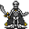{ .sprite } | [Roskelt](ratdom_skeleton_boss1.md) | NPC/Enemy | 100 | 196 | 15 to 30 | 100 | 0 | 5 |
| { .sprite } | [Lava spawn](fire3.md) | Enemy | 102 | 279 | 0 to 9 | 145 | 86 | 6 |
| { .sprite } | [Tough lava spawn](fire4.md) | Enemy | 107 | 293 | 0 to 9 | 149 | 89 | 6 |
| { .sprite } | [Hillside vine](hill_vine_bottom.md) | Enemy | 108 | 286 | 4 | 350 | 50 | 10 |
| { .sprite } | [Young ash gargoyle](ash1.md) | Enemy | 109 | 208 | 3 to 10 | 90 | 99 | 5 |
| { .sprite } | [Ravenous glowing mudfiend](elm_fiend2.md) | Enemy | 111 | 315 | 7 to 21 | 109 | 93 | 8 |
| { .sprite } | [Glowing flame](fire5.md) | Enemy | 112 | 300 | 0 to 9 | 153 | 94 | 6 |
| { .sprite } | [Ash gargoyle](ash2.md) | Enemy | 116 | 222 | 3 to 10 | 94 | 103 | 5 |
| { .sprite } | [Iqhan chaos beast](iqhan_chb_1a.md) | Enemy | 122–140 | 262–280 | 0 to 15 | 150 | 45 | 9 |
| { .sprite } | [Flame spawn](fire6.md) | Enemy | 127 | 319 | 0 to 10 | 152 | 72 | 7 |
| { .sprite } | [Emerald ooze](jelly6.md) | Enemy | 131 | 308 | 8 to 12 | 115 | 70 | 7 |
| { .sprite } | [Hardened ash gargoyle](ash4.md) | Enemy | 131 | 322 | 3 to 13 | 134 | 115 | 9 |
| { .sprite } | [Strong ash gargoyle](ash3.md) | Enemy | 131 | 297 | 3 to 13 | 134 | 109 | 6 |
| { .sprite } | [Walking flame](fire7.md) | Enemy | 131 | 329 | 0 to 10 | 157 | 75 | 7 |
| { .sprite } | [Glowing mudfiend](elm_fiend1.md) | Enemy | 132 | 338 | 0 to 21 | 100 | 102 | 9 |
| { .sprite } | [Ancient walking inferno](fire9.md) | Enemy | 135 | 337 | 0 to 10 | 160 | 77 | 7 |
| { .sprite } | [Walking inferno](fire8.md) | Enemy | 135 | 339 | 0 to 10 | 161 | 78 | 7 |
| { .sprite } | [Thorny vine](thorny_vine_bottom.md) | Enemy | 144 | 419 | 7 | 350 | 70 | 15 |
| { .sprite } | [Plague groundberry](plague_groundberry.md) | Enemy | 149 | 588 | 10 to 12 | 178 | 243 | 9 |
| { .sprite } | [Spotted tentaslime](spotted_tentaslime.md) | Enemy | 150 | 333 | 8 to 14 | 107 | 85 | 5 |
| { .sprite } | [Pixie Cort](sull_forest_tree_fungus.md) | Enemy | 160 | 620 | 12 to 15 | 155 | 250 | 11 |
| { .sprite } | [Broxwood](broxwood.md) | Enemy | 225 | 791 | 20 to 25 | 170 | 229 | 10 |
| { .sprite } | [Gilded dust](gilded_dust.md) | Enemy | 235 | 655 | 6 | 190 | 196 | 11 |
| 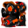{ .sprite } | [Molten pyreling](molten_pyreling.md) | Enemy | 236 | 619 | 15 to 21 | 130 | 214 | 8 |
| { .sprite } | [Erupting pyreling](erupting_pyreling.md) | Enemy | 246 | 662 | 19 to 26 | 150 | 214 | 8 |
| { .sprite } | [Huckleberreaper](huckleber_reaper.md) | Enemy | 265 | 962 | 30 | 190 | 240 | 10 |
| { .sprite } | [Embergeist](embergeist.md) | Enemy | 266 | 787 | 21 to 22 | 150 | 219 | 9 |
| { .sprite } | [Pyreling](pyreling.md) | Enemy | 266 | 727 | 20 to 28 | 150 | 219 | 9 |
| { .sprite } | [Lava entity](lava_entity.md) | Enemy | 290 | 881 | 30 to 35 | 150 | 240 | 14 |
| { .sprite } | [Young rock eater](young_rock_eater.md) | Enemy | 303 | 744 | 8 to 10 | 228 | 165 | 11 |
| { .sprite } | [Pyreling behemoth](Pyreling_behemoth.md) | Enemy | 360 | 997 | 28 to 20 | 170 | 229 | 13 |
| { .sprite } | [Queen lava entity](lava_queen_entity.md) | Enemy | 490 | 1,513 | 35 to 45 | 170 | 270 | 16 |
| 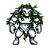{ .sprite } | [Rock eater](rock_eater.md) | NPC/Enemy | 500 | 1,315 | 12 to 14 | 254 | 180 | 20 |

<h3 id="enemies-undead">Undead (61)</h3>

| | Name | Type | HP | XP | Damage | AC | BC | DR |
|---|---|---|---|---|---|---|---|---|
| { .sprite } | [Rancid zombie](zombie1.md) | Enemy | 26 | 92 | 4 to 7 | 83 | 47 | 3 |
| { .sprite } | [Servant](erwyn_servant.md) | NPC/Enemy | 30 | 30 | 1 to 3 | 50 | 20 | 0 |
| { .sprite } | [Rotting zombie](zombie2.md) | Enemy | 32 | 113 | 5 to 8 | 90 | 54 | 3 |
| { .sprite } | [Cook](erwyn_cook.md) | Enemy | 35 | 35 | 2 to 3 | 50 | 20 | 0 |
| 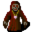{ .sprite } | [Shadow gargoyle master](shadow_gargoyle_master.md) | Enemy | 35 | 111 | 3 to 6 | 125 | 90 | 5 |
| { .sprite } | [Shadow gargoyle trainer](shadow_gargoyle_trainer.md) | Enemy | 35 | 102 | 3 to 6 | 90 | 90 | 5 |
| { .sprite } | [Snake servant](snake_servant.md) | Enemy | 35 | 52 | 2 to 3 | 80 | 10 | 1 |
| { .sprite } | [Corrupted zombie](zombie5.md) | Enemy | 42 | 101 | 2 to 9 | 127 | 56 | 4 |
| { .sprite } | [Blighted zombie](zombie3.md) | Enemy | 49 | 140 | 7 to 10 | 98 | 57 | 2 |
| { .sprite } | [Bloodthirsty zombie](zombie6.md) | Enemy | 54 | 121 | 2 to 9 | 134 | 70 | 4 |
| { .sprite } | [Maelveon](maelveon.md) | NPC/Enemy | 55 | 149 | 0 to 12 | 80 | 90 | 5 |
| { .sprite } | [Snake master](snake_master.md) | NPC/Enemy | 55 | 112 | 1 to 4 | 60 | 10 | 4 |
| { .sprite } | [Undead warden](undead_warden.md) | NPC/Enemy | 57 | 113 | 4 to 8 | 120 | 60 | 1 |
| { .sprite } | [Irogotu](irogotu.md) | NPC/Enemy | 61 | 123 | 2 to 5 | 50 | 70 | 4 |
| { .sprite } | [Plaguestrider master](plaguesp_13.md) | Enemy | 65–365 | 311–921 | 2 to 8 | 85 | 175 | 2 |
| { .sprite } | [Plaguestrider servant](plaguesp_12.md) | Enemy | 65 | 282 | 2 to 7 | 85 | 165 | 0 |
| 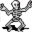{ .sprite } | [Resurrected miner's skeleton](elm_miner1.md) | Enemy | 66 | 325 | 8 to 10 | 159 | 144 | 5 |
| { .sprite } | [Wyrm apprentice](wyrm_apprentice.md) | Enemy | 69 | 200 | 2 to 9 | 140 | 90 | 4 |
| { .sprite } | [Wyrm trainer](wyrm_trainer.md) | Enemy | 69 | 199 | 2 to 9 | 90 | 90 | 4 |
| { .sprite } | [Graveyard corpse](graveyard_corpse.md) | Enemy | 70 | 333 | 5 to 15 | 160 | 135 | 9 |
| { .sprite } | [Rotting corpse](rotting_corpse.md) | NPC/Enemy | 71 | 82 | 2 to 5 | 30 | 30 | 2 |
| { .sprite } | [Erwyn's knight](erwyn_knight.md) | NPC/Enemy | 75 | 121 | 4 to 6 | 100 | 70 | 0 |
| { .sprite } | [Angry skeleton](ratdom_skel_dance21.md) | Enemy | 80 | 107–140 | 10 to 30 | 80–100 | 0 | 0 |
| { .sprite } | [Foul miner's skeleton](elm_miner2.md) | Enemy | 82 | 282 | 6 to 12 | 151 | 137 | 4 |
| { .sprite } | [Tainted zombie](zombie7.md) | Enemy | 87 | 174 | 3 to 9 | 137 | 77 | 5 |
| { .sprite } | [Angry graveyard corpse](graveyard_corpse2.md) | NPC/Enemy | 90 | 447 | 6 to 19 | 170 | 165 | 11 |
| { .sprite } | [Karth the Unbowed](erwyn_commander.md) | NPC/Enemy | 90 | 196 | 15 to 23 | 150 | 75 | 4 |
| { .sprite } | [Walking corpse](walking_corpse.md) | Enemy | 90 | 98 | 2 to 4 | 30 | 30 | 2 |
| 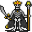{ .sprite } | [Dread zombie](oldcaveboss.md) | Enemy | 95 | 228 | 2 to 5 | 184 | 102 | 0 |
| { .sprite } | [Revenant servant](revenant_servant.md) | Enemy | 100 | 221 | 2 to 6 | 100 | 110 | 1 |
| { .sprite } | [Contaminated miner's skeleton](elm_miner3.md) | Enemy | 101 | 383 | 10 to 15 | 169 | 135 | 6 |
| { .sprite } | [Prim guard skeleton](elm_miner4.md) | Enemy | 104–364 | 399–894 | 12 to 16 | 172–182 | 144–154 | 7–10 |
| { .sprite } | [Lord Erwyn](erwyn.md) | NPC/Enemy | 110 | 373 | 13 to 22 | 130 | 80 | 5 |
| { .sprite } | [Revenant](revenant.md) | Enemy | 115 | 279 | 3 to 8 | 130 | 120 | 1 |
| 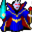{ .sprite } | [Iqhan chaos enslaver](iqhan_boss.md) | NPC/Enemy | 120 | 339 | 2 to 13 | 170 | 75 | 2 |
| 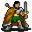{ .sprite } | [Lesser wight](wight_lesser.md) | Enemy | 130 | 174 | 1 to 13 | 65 | 70 | 0 |
| { .sprite } | [Eliszylae](stoutford_lich.md) | Enemy | 135 | 296 | 1 to 6 | 80 | 90 | 2 |
| { .sprite } | [Greater wight](wight_greater.md) | Enemy | 150 | 227 | 2 to 17 | 70 | 65 | 1 |
| { .sprite } | [Wraith](brightport_wraith.md) | Enemy | 150 | 508 | 16 to 31 | 240 | 140 | 3 |
| { .sprite } | [Agitated ghost](brightport_ghost.md) | NPC/Enemy | 159 | 252 | 10 to 15 | 80 | 90 | 3 |
| { .sprite } | [Graveyard gatekeeper](graveyard_gatekeeper.md) | Enemy | 169 | 492 | 15 to 21 | 183 | 107 | 15 |
| { .sprite } | [Death cob](deathcob.md) | Enemy | 179 | 417 | 9 to 23 | 90 | 90 | 11 |
| { .sprite } | [Kotheses](kotheses.md) | NPC/Enemy | 180 | 313 | 3 to 20 | 90 | 75 | 2 |
| { .sprite } | [Thukuzun](thukuzun.md) | NPC/Enemy | 193 | 564 | 6 to 25 | 136 | 140 | 9 |
| 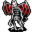{ .sprite } | [Angel of death](angel_death.md) | Enemy | 198 | 595 | 18 to 21 | 170 | 140 | 8 |
| { .sprite } | [Deadwalker](dead_walker.md) | Enemy | 203 | 428 | 15 to 17 | 199 | 97 | 0 |
| { .sprite } | [Toszylae](toszylae.md) | NPC/Enemy | 207 | 449 | 2 to 7 | 80 | 120 | 4 |
| 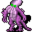{ .sprite } | [Ancient death cob](deathcobboss.md) | Enemy | 210 | 567 | 11 to 26 | 110 | 110 | 13 |
| { .sprite } | [Drybone lich](drybone_lich.md) | Enemy | 212 | 614 | 8 to 10 | 198 | 185 | 8 |
| { .sprite } | [Skeletal raider](skeletal_raider.md) | Enemy | 227 | 506 | 15 to 19 | 199 | 84 | 0 |
| { .sprite } | [Bone-Marshal lich](bone_marshal_lich.md) | Enemy | 232 | 693 | 9 to 11 | 202 | 195 | 9 |
| { .sprite } | [Death wrecker](death_wrecker.md) | Enemy | 253 | 652 | 21 to 24 | 227 | 111 | 0 |
| { .sprite } | [Kazaul Hex-Binder lich](hexbinder.md) | Enemy | 263 | 760 | 8 to 10 | 198 | 180 | 9 |
| 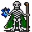{ .sprite } | [Plague-Lich](plague_lich.md) | Enemy | 263 | 729 | 9 to 11 | 202 | 176 | 10 |
| { .sprite } | [Mindless disgrace](mindless_disgrace.md) | Enemy | 275 | 740 | 13 to 17 | 180 | 143 | 0 |
| { .sprite } | [Dreadstaff lich](dreadblade.md) | Enemy | 285 | 822 | 10 to 13 | 210 | 185 | 11 |
| { .sprite } | [Kazaul seer lich](kazaul_seer_lich.md) | Enemy | 295 | 842 | 10 to 12 | 208 | 190 | 11 |
| { .sprite } | [Graveyard king](graveyardking.md) | NPC/Enemy | 300 | 984 | 8 to 25 | 175 | 170 | 12 |
| 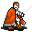{ .sprite } | [Undead Kamelio](kamelio2.md) | Enemy | 304 | 796 | 12 to 18 | 181 | 140 | 12 |
| { .sprite } | [Kazaul crimson arbiter lich](kazaul_crimson_arbiter_lich.md) | Enemy | 305 | 883 | 11 to 13 | 210 | 190 | 12 |
| 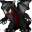{ .sprite } | [Tesrekan](tesrekan.md) | NPC/Enemy | 350 | 852 | 8 to 16 | 180 | 140 | 8 |

<h3 id="enemies-ghost">Ghost (38)</h3>

| | Name | Type | HP | XP | Damage | AC | BC | DR |
|---|---|---|---|---|---|---|---|---|
| { .sprite } | [Guardian of the catacombs](guardian_of_the_catacombs.md) | NPC/Enemy | 6 | 25 | 1 to 6 | 10 | 10 | 3 |
| { .sprite } | [Lost soul](lost_soul.md) | Enemy | 15 | 39 | 1 to 2 | 50 | 10 | 4 |
| { .sprite } | [Lost spirit](lost_spirit.md) | NPC/Enemy | 15 | 33 | 1 to 2 | 50 | 10 | 3 |
| { .sprite } | [Spectre](spectre.md) | Enemy | 15 | 39 | 1 to 5 | 50 | 60 | 2 |
| { .sprite } | [Ghostly visage](ghostly_visage.md) | Enemy | 16 | 29 | 1 to 4 | 20 | 20 | 2 |
| { .sprite } | [Shade](shade.md) | Enemy | 16 | 35 | 1 to 4 | 20 | 20 | 3 |
| { .sprite } | [Apparition](apparition.md) | Enemy | 17 | 33 | 1 to 5 | 0 | 70 | 2 |
| { .sprite } | [Restless dead](restless_dead.md) | Enemy | 25 | 70 | 0 to 3 | 50 | 140 | 3 |
| { .sprite } | [Restless apparition](restless_apparition.md) | Enemy | 29 | 93 | 2 to 6 | 90 | 10 | 1 |
| { .sprite } | [Haunting](haunting.md) | Enemy | 31 | 56 | 1 to 5 | 120 | 30 | 1 |
| { .sprite } | [Hirathil spawn](hirathil0.md) | Enemy | 73 | 316 | 6 to 7 | 193 | 74 | 14 |
| { .sprite } | [Aggressive hirathil ghost](hirathil1.md) | Enemy | 75 | 323 | 6 to 7 | 199 | 75 | 14 |
| { .sprite } | [Weeping ash spectre](ashs1.md) | Enemy | 75 | 199 | 5 to 15 | 175 | 138 | 0 |
| { .sprite } | [Hirathil ghost](hirathil2.md) | Enemy | 77 | 329 | 6 to 7 | 202 | 78 | 14 |
| { .sprite } | [Ferocious hirathil ghost](hirathil3.md) | Enemy | 79 | 335 | 6 to 7 | 205 | 80 | 14 |
| { .sprite } | [Restless hirathil ghost](hirathil4.md) | Enemy | 83 | 345 | 7 to 16 | 136 | 152 | 10 |
| { .sprite } | [Ghost of Luthor](ghost_of_luthor.md) | NPC/Enemy | 86 | 133 | 2 to 5 | 120 | 50 | 3 |
| { .sprite } | [Hirathil servant](hirathil5.md) | Enemy | 87 | 356 | 7 to 16 | 139 | 154 | 10 |
| { .sprite } | [Wailing ash spectre](ashs2.md) | Enemy | 87 | 226 | 5 to 15 | 181 | 146 | 0 |
| { .sprite } | [Hirathil master](hirathil6.md) | Enemy | 89 | 364 | 7 to 16 | 142 | 156 | 10 |
| { .sprite } | [Ancient hirathil ghost](hirathil7.md) | Enemy | 92 | 373 | 7 to 16 | 145 | 157 | 10 |
| { .sprite } | [Ash spectre](ashs3.md) | Enemy | 97 | 249 | 5 to 15 | 187 | 151 | 0 |
| { .sprite } | [Thin mist of the crypt](cryptmist1.md) | Enemy | 162 | 302 | 1 to 7 | 64 | 87 | 10 |
| { .sprite } | [Clear mist of the crypt](cryptmist2.md) | Enemy | 166 | 314 | 1 to 7 | 68 | 91 | 10 |
| { .sprite } | [Mist of the crypt](cryptmist3.md) | Enemy | 170 | 326 | 1 to 7 | 72 | 95 | 10 |
| { .sprite } | [Thick mist of the crypt](cryptmist4.md) | Enemy | 174 | 338 | 1 to 7 | 76 | 99 | 10 |
| { .sprite } | [Bright mist of the crypt](cryptmist5.md) | Enemy | 176 | 347 | 1 to 7 | 80 | 103 | 10 |
| { .sprite } | [Musty prowler](musty_prowler.md) | Enemy | 177 | 522 | 13 to 18 | 134 | 180 | 7 |
| { .sprite } | [Sleepless taint](sleepless_taint.md) | Enemy | 180 | 715 | 11 to 12 | 185 | 265 | 9 |
| { .sprite } | [Vahram the butcher](vahram.md) | Enemy | 185 | 422 | 5 to 14 | 120 | 160 | 2 |
| { .sprite } | [Grieveless dead](grieveless_dead.md) | Enemy | 189 | 587 | 14 to 21 | 137 | 177 | 11 |
| { .sprite } | [Forgotten miner](forgotten_miner.md) | Enemy | 228 | 621 | 8 to 14 | 170 | 166 | 5 |
| { .sprite } | [Sinister wraith](sinister_wraith.md) | Enemy | 255 | 1,010 | 12 to 18 | 199 | 279 | 15 |
| { .sprite } | [Eryndor](mg_eryndor.md) | NPC/Enemy | 287 | 989 | 4 to 14 | 185 | 291 | 25 |
| { .sprite } | [Evil shade](evil_shade.md) | Enemy | 431 | 1,215 | 5 to 7 | 205 | 250 | 9 |
| { .sprite } | [Forsaken shade](shade1.md) | NPC/Enemy | 431 | 1,221–1,231 | 5 to 8 | 230 | 250 | 9 |
| { .sprite } | [Saki](saki.md) | NPC/Enemy | 498 | 1,386 | 5 to 7 | 230 | 233 | 14 |
| { .sprite } | [Anoa](anoa.md) | NPC/Enemy | 545 | 2,455 | 8 to 10 | 235 | 517 | 0 |

<h3 id="enemies-demon">Demon (38)</h3>

| | Name | Type | HP | XP | Damage | AC | BC | DR |
|---|---|---|---|---|---|---|---|---|
| { .sprite } | [Grave spawn](grave_spawn.md) | Enemy | 45 | 91 | 2 to 5 | 110 | 35 | 3 |
| { .sprite } | [Kazaul imp](kazaul_imp.md) | Enemy | 45 | 111 | 3 to 7 | 70 | 105 | 1 |
| 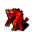{ .sprite } | [Kazaul spawn](kazaul_spawn.md) | Enemy | 45 | 102 | 3 to 5 | 70 | 90 | 1 |
| { .sprite } | [Cave guardian](cave_guardian.md) | NPC/Enemy | 61 | 152 | 4 to 10 | 150 | 90 | 2 |
| { .sprite } | [Young ash spawn](ash5.md) | Enemy | 80 | 137 | 0 to 5 | 138 | 81 | 0 |
| { .sprite } | [Winged demon](winged_demon.md) | NPC/Enemy | 82 | 166 | 4 to 12 | 90 | 70 | 5 |
| { .sprite } | [Ash spawn](ash6.md) | Enemy | 83 | 144 | 0 to 5 | 141 | 86 | 0 |
| { .sprite } | [Tough ash spawn](ash7.md) | Enemy | 87 | 152 | 0 to 5 | 146 | 89 | 0 |
| { .sprite } | [Young allaceph](allaceph_1.md) | Enemy | 90 | 231 | 3 to 7 | 80 | 105 | 1 |
| { .sprite } | [Allaceph](allaceph_2.md) | Enemy | 94 | 237 | 3 to 7 | 80 | 105 | 1 |
| { .sprite } | [Kazaul guardian](kazaul_guardian.md) | NPC/Enemy | 95 | 175 | 3 to 8 | 70 | 90 | 3 |
| { .sprite } | [Shadowfang](shadowfang1.md) | NPC/Enemy | 98 | 330 | 3 to 21 | 130 | 110 | 9 |
| { .sprite } | [Strong allaceph](allaceph_3.md) | Enemy | 101 | 253 | 3 to 7 | 80 | 105 | 2 |
| { .sprite } | [Tough allaceph](allaceph_4.md) | Enemy | 111 | 272 | 3 to 7 | 80 | 110 | 2 |
| { .sprite } | [Radiant allaceph](allaceph_5.md) | Enemy | 124 | 297 | 3 to 7 | 80 | 110 | 3 |
| { .sprite } | [Ancient allaceph](allaceph_6.md) | Enemy | 133–333 | 315–616 | 3 to 7 | 80 | 115 | 3 |
| { .sprite } | [Vaeregh](vaeregh_1.md) | Enemy | 149 | 346 | 2 to 7 | 80 | 120 | 4 |
| { .sprite } | [Kamelio](kamelio.md) | NPC/Enemy | 177 | 602 | 17 to 20 | 171 | 123 | 12 |
| 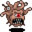{ .sprite } | [Beholder](beholder.md) | Enemy | 180 | 367 | 3 to 20 | 90 | 75 | 2 |
| { .sprite } | [Dark watch](lae_demon4.md) | NPC/Enemy | 180 | 313 | 3 to 20 | 90 | 75 | 2 |
| { .sprite } | [Demon](mg2_demon.md) | Enemy | 180 | 313 | 3 to 20 | 90 | 75 | 2 |
| 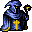{ .sprite } | [Dread guardian](tesrekan_guardian.md) | NPC/Enemy | 200 | 484 | 6 to 11 | 120 | 150 | 3 |
| { .sprite } | [Dense foggerlump](feygard_fogmonster5.md) | Enemy | 220 | 540 | 8 to 20 | 140 | 150 | 10 |
| { .sprite } | [Dizzy foggerlump](feygard_fogmonster4.md) | Enemy | 220 | 540 | 8 to 20 | 140 | 150 | 10 |
| { .sprite } | [Icy foggerlump](feygard_fogmonster2.md) | Enemy | 220 | 540 | 8 to 20 | 140 | 150 | 10 |
| { .sprite } | [Shiny Foggerlump](feygard_fogmonster9.md) | NPC/Enemy | 220 | 540 | 8 to 20 | 140 | 150 | 10 |
| { .sprite } | [Wet foggerlump](feygard_fogmonster3.md) | Enemy | 220 | 540 | 8 to 20 | 140 | 150 | 10 |
| { .sprite } | [Wobbling foggerlump](feygard_fogmonster1.md) | Enemy | 220 | 540 | 8 to 20 | 140 | 150 | 10 |
| { .sprite } | [Yczorah](elm_yzczorah2.md) | Enemy | 231 | 542 | 6 to 7 | 78 | 155 | 7 |
| { .sprite } | [Dark spirit minion](dark_spirit_minion.md) | Enemy | 247 | 553 | 8 to 12 | 82 | 148 | 8 |
| { .sprite } | [Yczorah marauder](elm_yczorah1.md) | Enemy | 256 | 599 | 6 to 7 | 81 | 161 | 7 |
| { .sprite } | [Hira'zinn](hirazinn.md) | NPC/Enemy | 263 | 683 | 3 to 6 | 129 | 132 | 21 |
| 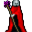{ .sprite } | [Benzimos](haunted_benzimos.md) | Enemy | 291 | 980 | 19 to 20 | 219 | 198 | 0 |
| { .sprite } | [Radiant guardian](toszylae_guard.md) | NPC/Enemy | 320 | 609 | 2 to 7 | 80 | 120 | 4 |
| { .sprite } | [Dark priest](dds_dark_priest.md) | NPC/Enemy | 330 | 1,128 | 18 to 30 | 301 | 138 | 5 |
| { .sprite } | [Darkness beast](brightport_beast.md) | Enemy | 333 | 1,153 | 19 to 27 | 220 | 230 | 12 |
| { .sprite } | [Dark spirit](crossglen_dark_spirit.md) | NPC/Enemy | 470–509 | 851–999 | 7 to 10 | 135–155 | 130–142 | 3–6 |
| { .sprite } | [Kazaul statue](dds_kazaul_statue.md) | Enemy | 478 | 1,102 | 10 to 14 | 254 | 130 | 23 |

## NPCs

Can't be attacked. Grouped by class, alphabetical; [Where is…?](../where.md) lists them by place.

**Classes:** [Humanoid](#npcs-humanoid) (514) · [Animal](#npcs-animal) (24) · [Undead](#npcs-undead) (17) · [Ghost](#npcs-ghost) (4) · [Construct](#npcs-construct) (3) · [Reptile](#npcs-reptile) (1)

<h3 id="npcs-humanoid">Humanoid (514)</h3>

| | Name | Role | Found in |
|---|---|---|---|
| 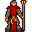{ .sprite } | [Aatash](atash.md) | – | Remgard |
| { .sprite } | [Acolyte](acolyte.md) | – | Fallhaven, Vilegard |
| { .sprite } | [Aemens](aemens.md) | – | Loneford |
| { .sprite } | [Agent](agent1.md) | starts [The agent and the beast](../quests/bwm_agent.md) | Blackwater mountain 5, Prim, Blackwater Mountain |
| 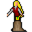{ .sprite } | [Agnese](brightportstudent.md) | – | Brightport |
| { .sprite } | [Agthor](agthor.md) | shopkeeper | Fallhaven |
| { .sprite } | [Agthor's guard](agthor_guard.md) | – | Fallhaven |
| { .sprite } | [Ailshara](ailshara.md) | shopkeeper | Crossroads Guardhouse |
| { .sprite } | [Ainsley](deebo_orchard_farmer_ainsley.md) | – | Deebo's Orchard |
| { .sprite } | [Alain](brightportitem.md) | shopkeeper | Brightport |
| { .sprite } | [Alaun](alaun.md) | starts [Delicious soup](../quests/gison_soup.md) | Fallhaven |
| { .sprite } | [Alduan](brightport_orchardsupervisor.md) | – | Deebo's Orchard |
| { .sprite } | [Alkapoan](brv_richman.md) | – | Brimhaven house 1 |
| { .sprite } | [Allares](brightportstoragenpc.md) | starts [Bread and circus](../quests/brightport_bakery.md) | Brightport |
| { .sprite } | [Almars](almars.md) | – | Remgard |
| { .sprite } | [Alynndir](alynndir.md) | shopkeeper | Road 5 house |
| { .sprite } | [Ambelie](ambelie.md) | – | Foaming Flask Tavern |
| { .sprite } | [Anakis](anakis.md) | starts [A quick glance](../quests/quick_glance.md) | Brimhaven |
| { .sprite } | [Androni](brightport_chef.md) | – | Brightport |
| { .sprite } | [Arambold](arambold.md) | shopkeeper | – |
| { .sprite } | [Arcir](arcir.md) | – | – |
| 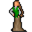{ .sprite } | [Arensia](arensia.md) | starts [It's knot funny](../quests/fallhaven_lytwings.md) | Fallhaven |
| { .sprite } | [Arghes](arghes.md) | shopkeeper | Remgard |
| { .sprite } | [Arghest](arghest.md) | – | Prim |
| { .sprite } | [Arlish](arlish.md) | shopkeeper | Brimhaven |
| { .sprite } | [Armor](guynmart_reward3.md) | – | Guynmart Castle |
| { .sprite } | [Arnal](arnal.md) | shopkeeper | Remgard |
| { .sprite } | [Arngyr](arngyr.md) | – | Loneford |
| { .sprite } | [Aryfora](stoutford_widow.md) | starts [The roots of love](../quests/roots_love.md), [The thorns of vengeance](../quests/thorns_vengeance.md); shopkeeper | Stoutford |
| 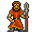{ .sprite } | [Ash fisher](ash_fisher.md) | – | Mountainlake sub |
| { .sprite } | [Askyl](askyl.md) | – | Foaming Flask Tavern |
| { .sprite } | [Athamyr](athamyr.md) | – | – |
| { .sprite } | [Audir](audir.md) | shopkeeper | – |
| { .sprite } | [Ball](brv_ball.md) | – | Brimhaven |
| { .sprite } | [Barthold](brightportgoons1.md) | starts [Priceful vengeance](../quests/brightport_goons.md) | Brightport |
| { .sprite } | [Bearded citizen](bearded_citizen.md) | – | Fallhaven |
| { .sprite } | [Bela](bela.md) | shopkeeper; starts [A Wicked witch](../quests/wicked_witch.md), [A giant snake](../quests/bela_gsnake.md); shopkeeper | – |
| { .sprite } | [Beldric](boat0.md) | – | Fallhaven |
| { .sprite } | [Beltina](sullengard_beltina.md) | – | Sullengard |
| { .sprite } | [Benbyr](benbyr.md) | starts [Cheap cuts](../quests/benbyr.md) | Crossroads Guardhouse |
| { .sprite } | [Bernhar](bernhar.md) | shopkeeper | Arulirmountain 1 |
| { .sprite } | [Bidro](brute_fisherman.md) | starts [Brutes](../quests/brute_creator.md) | Mountainlake 11 |
| { .sprite } | [Birgil](birgil.md) | shopkeeper | Prim |
| { .sprite } | [Bjorgur](bjorgur.md) | starts [Awoken from slumber](../quests/bjorgur_grave.md) | Prim |
| { .sprite } | [Blackwater chamber guard](blackwater_chamber_guard.md) | – | Prim |
| { .sprite } | [Blackwater cook](blackwater_cook.md) | – | Blackwater mountain 43 |
| { .sprite } | [Blackwater dinner guest](blackwater_dinner_guest.md) | – | Blackwater mountain 43 |
| { .sprite } | [Blackwater fighter](blackwater_fighter.md) | – | Blackwater mountain 43 |
| { .sprite } | [Blackwater inhabitant](blackwater_inhabitant.md) | – | Blackwater mountain 43 |
| 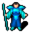{ .sprite } | [Blackwater mage](blackwater_mage.md) | – | Prim |
| { .sprite } | [Blackwater priest](blackwater_priest.md) | – | Blackwater mountain 44 |
| { .sprite } | [Blackwater pupil](blackwater_pupil.md) | – | Blackwater mountain 43, Blackwater mountain 44 |
| { .sprite } | [Blau](brightportstudent11.md) | – | Brightport |
| { .sprite } | [Blond citizen](blond_citizen.md) | – | Fallhaven |
| { .sprite } | [Blornvale](stoutford_alchemist.md) | shopkeeper | Stoutford |
| { .sprite } | [Bogal](bogsten_gambler1.md) | – | Mushroom m 2 4b |
| { .sprite } | [Bollo](bogsten_gambler3.md) | – | Mushroom m 2 4b |
| { .sprite } | [Boralla](stn_boralla.md) | – | Stoutford |
| { .sprite } | [Borlag](stoutford_commander.md) | – | Stoutford |
| { .sprite } | [Borvis](dds_borvis.md) | starts [Shadows](../quests/shadows.md) | Mt. Galmore |
| { .sprite } | [Botisto](bogsten_gambler2.md) | – | Mushroom m 2 4b |
| 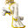{ .sprite } | [Brenor](brenor.md) | – | Undertell 1 0 |
| { .sprite } | [Bridge lookout](remgard_bridge.md) | starts [Everything in order](../quests/remgard.md) | Remgard |
| { .sprite } | [Brightport commoner](brightportcitizen.md) | – | Brightport |
| { .sprite } | [Bryma](brightportnpc7.md) | – | Brightport forest |
| { .sprite } | [Bucus](bucus.md) | starts [Key of Luthor](../quests/bucus.md) | – |
| { .sprite } | [Builder](stoutford_builder.md) | – | Stoutford |
| { .sprite } | [Burhczyd](burhczyd1.md) | starts [Young merchant](../quests/quest_burhczyd.md) | Crossglen, Fallhaven, Loneford, Vilegard, Stoutford, Blackwater mountain 43, Remgard, Prim, Brimhaven, Sullengard, Crossroads Guardhouse, Foaming Flask Tavern, Brightport |
| { .sprite } | [Busy farmer](busy_farmer.md) | – | Fallhaven, Stoutford |
| { .sprite } | [Butcher](brv_butcher.md) | – | Brimhaven |
| { .sprite } | [Cadoren](stoutford_cook.md) | shopkeeper | Stoutford |
| { .sprite } | [Caeda](caeda.md) | starts [A secret garden](../quests/secret_garden.md) | Remgard |
| { .sprite } | [Callista, the centaur](lae_centaur2.md) | starts [Not Pony Island](../quests/lae_centaurs.md) | Island 2 |
| { .sprite } | [Captain Burry](ll2_captain.md) | – | Remgard, Lake Laeroth, Mountainlake circe |
| { .sprite } | [Carthe](carthe.md) | – | Remgard |
| { .sprite } | [Casterod](bwm17_worker.md) | – | Blackwater Mountain |
| { .sprite } | [Cavill](brightportstudent3.md) | – | Brightport |
| { .sprite } | [Celdar](celdar.md) | – | Crossroads Guardhouse |
| { .sprite } | [Centaur](lae_centaur.md) | – | Island 1, Island 2, Island 3 |
| { .sprite } | [Chael](chael.md) | – | Remgard |
| { .sprite } | [Chapel guard](loneford_chapelguard.md) | – | Loneford, Sullengard |
| { .sprite } | [Chapelgoer](brightportchurch.md) | – | Brightport |
| { .sprite } | [Child](brv_villager13.md) | – | Brimhaven |
| { .sprite } | [Church guard](brimhaven_church_guard.md) | – | Brimhaven |
| { .sprite } | [Churrie](churrie.md) | – | Loneford |
| { .sprite } | [Circe](circe.md) | – | Mountainlake circe |
| { .sprite } | [Cithurn](waterwayhermit.md) | starts [Just the beginning](../quests/waterwayacave.md) | Waterwaybhouse |
| { .sprite } | [Citizen](citizen.md) | – | Fallhaven |
| { .sprite } | [Clevred](ratdom_rat.md) | starts [Yellow is it](../quests/ratdom_quest.md) | Blackwater Mountain, Crossglen, Entry, Blackwater Mountain, Crossglen |
| { .sprite } | [Colonel Lutarc](stn_colonel.md) | starts [Colonel Lutarc](../quests/stn_colonel.md) | Flagstone Prison |
| { .sprite } | [Commoner](rg_villager1.md) | – | Remgard, Brimhaven, Stoutford |
| { .sprite } | [Confused ghost](bogsten_ghost5.md) | – | Mushroom m 2 4b |
| { .sprite } | [Conren](conren.md) | – | Loneford |
| 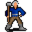{ .sprite } | [Cornith](stoutford_smith.md) | shopkeeper | Stoutford |
| { .sprite } | [Cottager](stoutford_cottager.md) | – | Stoutford |
| { .sprite } | [Counterfeit](brightportthieves2.md) | – | Brightport |
| { .sprite } | [Crescenzio](brightport_chef2.md) | – | Brightport |
| { .sprite } | [Crew](ll2_circe_crew.md) | – | – |
| { .sprite } | [Croaklear](stoutford_old_woman.md) | – | Stoutford |
| { .sprite } | [Curwen](sullengard_courtyard_boy.md) | – | Sullengard |
| 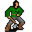{ .sprite } | [Customer](brv_tavern1_guest.md) | – | Brimhaven, Stoutford |
| { .sprite } | [Dantran](sullengard_dantran.md) | – | Sullengard |
| { .sprite } | [Deebo](deebo_orchard_deebo.md) | shopkeeper; starts [Hunting the hunter](../quests/deebo_orchard_hth.md) | Deebo's Orchard |
| { .sprite } | [Delon](brightportnpc10.md) | – | Brightport |
| { .sprite } | [Dibella](brightportnpc3.md) | starts [No rest for the wicked](../quests/Stanwickquest.md) | Brightport |
| { .sprite } | [Digiani](brightportbakeryvisitor.md) | – | Brightport |
| { .sprite } | [Drashad](drashad.md) | – | Prim |
| { .sprite } | [Drendolas](brightport_studentghost1.md) | – | Brightport |
| { .sprite } | [Drinking brother](sullengard_drinking_brother.md) | – | Sullengard |
| { .sprite } | [Drunk](drunk.md) | – | Crossglen, Fallhaven, Loneford |
| { .sprite } | [Drunkard](drunkard.md) | starts [Drunken tale](../quests/fallhavendrunk.md) | Fallhaven |
| { .sprite } | [Drunken Feygard patrol](ortholion_guard11.md) | – | Elm mine 1 |
| { .sprite } | [Drunken Feygard scout](ortholion_guard10.md) | – | Elm mine 1 |
| 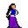{ .sprite } | [Duaina](duaina.md) | – | Remgard |
| { .sprite } | [Dunla](dunla.md) | shopkeeper | Vilegard |
| { .sprite } | [Durnan the Hollow](durnan.md) | – | Undertell 1 0 |
| { .sprite } | [Dying general's henchman](ortholion_guard8.md) | – | Elm mine 5 |
| { .sprite } | [Dying patrol](g03_deadpatrol_1.md) | – | Crackshot hideout 2 |
| { .sprite } | [Dying Patrol](g03_deadpatrol_2.md) | – | Crackshot hideout 2 |
| { .sprite } | [Dynes](brightportgoons.md) | – | Brightport |
| { .sprite } | [Eagle](brv_eagle.md) | – | Brimhaven |
| { .sprite } | [Easturlie](easturlie.md) | – | Remgard |
| { .sprite } | [Eatloni](brightportbakeryoutside.md) | – | Brightport |
| { .sprite } | [Edrin](brv_metalsmith.md) | shopkeeper; starts [A strange looking dagger](../quests/brv_dagger.md) | Brimhaven |
| { .sprite } | [Effa](brightportbakery2.md) | shopkeeper | Brightport |
| { .sprite } | [Ehrenfest](ehrenfest.md) | – | Prim |
| { .sprite } | [Elfeyn](brightportstudent12.md) | – | Brightport |
| { .sprite } | [Elvira](brightportinn.md) | – | Brightport |
| { .sprite } | [Elwel](elwel.md) | – | Remgard |
| { .sprite } | [Elwyl](elwyl.md) | – | Remgard |
| { .sprite } | [Elynard](brightportinnvisitor1.md) | – | Brightport |
| { .sprite } | [Elysa](brightportthieves6.md) | starts [Boxed in](../quests/brightport_thieves.md) | Brightport |
| { .sprite } | [Emerei](emerei.md) | – | Remgard |
| { .sprite } | [Emmeline](captive_girl.md) | – | Flagstone Prison |
| { .sprite } | [Eraepsekahs](eraepsekahs.md) | – | Remgard |
| { .sprite } | [Erelyn](brightport_studentghost.md) | – | Brightport |
| { .sprite } | [Erethori](erethori.md) | – | Foaming Flask Tavern |
| { .sprite } | [Erinith](erinith.md) | starts [Deep wound](../quests/erinith.md) | Crossroads Guardhouse |
| { .sprite } | [Erttu](erttu.md) | – | Vilegard |
| { .sprite } | [Ervelyn](ervelyn.md) | shopkeeper | Remgard |
| { .sprite } | [Esfiume](esfiume.md) | – | Foaming Flask Tavern |
| 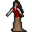{ .sprite } | [Evelina](brightportstudent9.md) | – | Brightport |
| 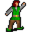{ .sprite } | [Facutloni](brv_wh_boss.md) | starts [Delivery](../quests/brv_wh_delivery.md), [Inventory](../quests/brv_wh.md) | Brimhaven |
| { .sprite } | [Falothen](falothen0.md) | teaches [One-handed sword proficiency](../skills/weaponProficiency1hsword.md), [Two-handed sword proficiency](../skills/weaponProficiency2hsword.md), [Axe proficiency](../skills/weaponProficiencyAxe.md), [Blunt weapon proficiency](../skills/weaponProficiencyBlunt.md), [Dagger proficiency](../skills/weaponProficiencyDagger.md), [Pole weapon proficiency](../skills/weaponProficiencyPole.md), [Unarmed fighting](../skills/weaponProficiencyUnarmed.md) | Charwood, Tradehouse 0a |
| { .sprite } | [Fanamor](fanamor.md) | – | Crossroads Guardhouse, Fallhaven |
| { .sprite } | [Fangwurm](fangwurm.md) | – | Brimhaven |
| { .sprite } | [Farmer](farmer.md) | starts [Flows through the veins](../quests/loneford.md) | Crossglen, Crossroads Guardhouse, Remgard, Stoutford |
| { .sprite } | [Farrik](farrik.md) | starts [Night visit](../quests/farrik.md) | Fallhaven |
| { .sprite } | [Favlon](dds_favlon.md) | – | Nw sullengard 1 |
| 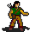{ .sprite } | [Fayvara](fayvara0.md) | teaches [Heavy armor proficiency](../skills/armorProficiencyHeavy.md), [Light armor proficiency](../skills/armorProficiencyLight.md), [Shield proficiency](../skills/armorProficiencyShield.md), [Unarmored fighting](../skills/armorProficiencyUnarmored.md) | Charwood, Tradehouse 0a |
| { .sprite } | [Feygard barricade guard](Feygard_BG.md) | – | Foaming Flask Tavern |
| { .sprite } | [Feygard bridge guard](feygard_bridgeguard.md) | – | – |
| { .sprite } | [Feygard guard](lodar_fg1.md) | – | Loneford |
| { .sprite } | [Feygard mountain scout](ortholion_guard5.md) | – | Prim |
| { .sprite } | [Feygard patrol](feygard_patrol.md) | – | Foaming Flask Tavern |
| { .sprite } | [Feygard patrol captain](feygard_patrol_captain.md) | starts [Beer Bootlegging](../quests/beer_bootlegging.md) | Foaming Flask Tavern |
| { .sprite } | [Feygard patrol guard](ortholion_guard3.md) | – | Prim |
| { .sprite } | [Feygard patrol sergeant](g03_sergeant.md) | – | Crackshot hideout 3 |
| { .sprite } | [Feygard road guard](guynmart_roadguard.md) | – | Guynmart Castle |
| { .sprite } | [Feygard soldier](patrol_roaming.md) | – | Brimhaven, Crossroads Guardhouse, Remgard, Remgard |
| 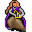{ .sprite } | [Fiamma](brightportsmith.md) | shopkeeper; starts [Too hot to handle](../quests/brightport_fiamma.md) | Brightport |
| { .sprite } | [Fisherman](brv_fisher.md) | – | Brimhaven |
| { .sprite } | [Fjoerkard](guynmart_drunkard1.md) | – | Guynmart Castle |
| { .sprite } | [Flagstone sentry](flagstone_sentry.md) | – | Flagstone Prison |
| { .sprite } | [Flaming orb](ratdom_maze_boulder1.md) | – | Ratdom maze 551 |
| { .sprite } | [Florencia](brightportforenza1.md) | – | Brightport |
| { .sprite } | [Foaming Flask cook](foaming_flask_cook.md) | – | Foaming Flask Tavern |
| { .sprite } | [Forest guardian](lodar0_g.md) | – | Loneford |
| { .sprite } | [Forlin](brv_tavern1_guest2.md) | – | Brimhaven |
| { .sprite } | [Franz](brightportnpc4.md) | – | Brightport |
| { .sprite } | [Frederich](brightportnpc5.md) | – | Brightport |
| { .sprite } | [Freen](freen.md) | – | Remgard |
| { .sprite } | [Freya](brightportarmor.md) | shopkeeper | Brightport |
| 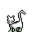{ .sprite } | [Frosty](sullengard_cat.md) | – | Sullengard |
| { .sprite } | [Fulus](fulus.md) | – | Prim |
| { .sprite } | [Gabriel](gabriel.md) | starts [The Dead are Walking](../quests/dead_walking.md) | Vilegard |
| { .sprite } | [Gael](gael.md) | – | Fallhaven |
| { .sprite } | [Gaela](gaela.md) | – | – |
| { .sprite } | [Gaelian](sullengard_gaelian.md) | – | Sullengard |
| { .sprite } | [Gallain](gallain.md) | shopkeeper | Crossroads Guardhouse |
| { .sprite } | [Gandoren](gandoren.md) | starts [Feygard errands](../quests/feygard_shipment.md), [Flows through the veins](../quests/loneford.md) | – |
| { .sprite } | [Ganos](ganos.md) | shopkeeper | – |
| { .sprite } | [Garvhel](brightport_newcommander.md) | – | Brightport |
| { .sprite } | [Gauward](gauward.md) | – | Waterwayhouse |
| { .sprite } | [General Ortholion](ortholion.md) | – | Prim |
| { .sprite } | [General's henchman](ortholion_guard1.md) | shopkeeper | Prim |
| { .sprite } | [Gison](gison.md) | starts [A raid for a cookbook](../quests/gison_cookbook.md) | Fallhaven |
| { .sprite } | [Glade key](lakecave2_key.md) | – | – |
| 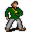{ .sprite } | [Glasforn](stoutford_innkeeper.md) | – | Stoutford |
| { .sprite } | [Gnossath](brv_employer.md) | – | Brimhaven |
| { .sprite } | [Goat](goat_1.md) | – | Mt. Galmore, Stoutford, Way to sullengard east 11 |
| { .sprite } | [Goat herder](sullengard_goat_herder.md) | – | Way to sullengard east 11 |
| { .sprite } | [Godelieve](village_godelieve.md) | – | Wexlow Village, Gamjee well jail cells |
| { .sprite } | [Godfrey](sullengard_innkeeper.md) | shopkeeper | Sullengard |
| { .sprite } | [Godoe](godoe1.md) | – | Guynmart wood 18 |
| { .sprite } | [Godwin](village_godwin.md) | – | Wexlow Village, Gamjee well jail cells |
|  | [Gold](guynmart_reward1.md) | – | Guynmart Castle |
| { .sprite } | [Golden marble](guynmart_marble4.md) | – | Guynmart Castle |
| 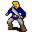{ .sprite } | [Gorwath](gorwath.md) | starts [You're the postman](../quests/postman.md) | Crossglen |
| { .sprite } | [Grabby comrade](guild04_rebcomrade_2.md) | – | Sullengard |
| { .sprite } | [Grazia](sullengard_grazia.md) | – | Sullengard, Way to sullengard east 4 bridge |
| { .sprite } | [Greedy comrade](guild04_rebcomrade_1.md) | – | Sullengard |
| { .sprite } | [Green marble](guynmart_marble1.md) | – | Guynmart Castle |
| { .sprite } | [Grimion](grimion.md) | shopkeeper | Loneford |
| { .sprite } | [Gruiik](ratdom_mikhail.md) | starts [More rats!](../quests/ratdom_mikhail.md) | Crossglen |
| { .sprite } | [Grumpy citizen](grumpy_citizen.md) | – | Fallhaven |
| { .sprite } | [Grumpy Vilegard villager](grumpy_vilegard_villager.md) | starts [Trusting an outsider](../quests/vilegard.md) | Vilegard |
| { .sprite } | [Guard](guard.md) | starts [Fair play?](../quests/brv_blackjack.md) | Fallhaven, Brimhaven, Foaming Flask Tavern, Crossroads Guardhouse, Flagstone Prison, Loneford, Remgard |
| { .sprite } | [Guard captain](warden.md) | – | Fallhaven |
| { .sprite } | [Guest](brv_inn_guest.md) | – | Brimhaven |
| { .sprite } | [Gunther](brightportbakery3.md) | shopkeeper | Brightport |
| { .sprite } | [Guynmart](guynmart.md) | – | Guynmart Castle |
| { .sprite } | [Guynmart elite guard](guynmart_pguard.md) | – | Guynmart Castle |
| { .sprite } | [guynmart_hero](guynmart_hero.md) | – | Guynmart Castle |
| { .sprite } | [Gwendolyn](remgard_gwendolyn.md) | – | Remgard |
| { .sprite } | [Gwinnett](sullengard_courtyard_girl.md) | – | Sullengard |
| { .sprite } | [Gyra](stn_gyra.md) | – | Stoutford castle 1, Flagstone Prison, Stoutford, Prim, Flagstone Prison, Stoutford, Flagstone Prison |
| { .sprite } | [Hadena](sullengard_cabin_wife.md) | starts [Getting home on time](../quests/deebo_orchard_ght.md) | Sullengard ravine cabin |
| { .sprite } | [Hadracor](hadracor.md) | shopkeeper; starts [Devastated land](../quests/hadracor.md) | Crossroads Guardhouse |
| { .sprite } | [Halvor](halvor.md) | starts [Surprise?](../quests/halvor_surprise.md) | Crossglen, Lake Laeroth, Charwood |
| { .sprite } | [Hamerick](sullengard_hamerick.md) | – | Sullengard |
| { .sprite } | [Hannah](guynmart_hannah.md) | – | Guynmart Castle |
| { .sprite } | [Herald](guynmart_herold.md) | – | Guynmart Castle |
| { .sprite } | [Herec](herec.md) | shopkeeper; starts [No weakness](../quests/bwm_wyrms.md) | Blackwater mountain 44 |
| { .sprite } | [Hettah](brv_employee_wife.md) | – | Brimhaven |
| { .sprite } | [Hjaldar](hjaldar.md) | shopkeeper | Remgard |
| { .sprite } | [Hofala](guynmart_cook.md) | shopkeeper | Guynmart Castle |
| 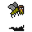{ .sprite } | [Honey bee](honey_bee.md) | – | Foaming Flask Tavern |
| { .sprite } | [Horfael](ratdom_rat_pub_owner.md) | shopkeeper | Pub |
| { .sprite } | [Hortensia](brightportbakery.md) | – | Brightport |
| { .sprite } | [Howkin](deebo_orchard_deebo_son.md) | – | Deebo's Orchard |
| { .sprite } | [Iducus](iducus.md) | shopkeeper | Blackwater mountain 44 |
| { .sprite } | [Ingeram](sullengard_ingeram.md) | – | Sullengard |
| { .sprite } | [Ingus](ingus.md) | starts [A difference of opinion](../quests/sisterfight.md) | Remgard |
| { .sprite } | [Isolated man](isolated_man.md) | – | Brightport |
| { .sprite } | [Ito](brv_guard_deputy.md) | – | Brimhaven |
| { .sprite } | [Jakrar](jakrar.md) | shopkeeper | Fallhaven |
| { .sprite } | [Jalmor](brightportnpc11.md) | – | Brightport |
| { .sprite } | [Jan](jan.md) | starts [Fallen friends](../quests/jan.md) | Stoutford |
| { .sprite } | [Janach](janach.md) | – | Remgard |
| { .sprite } | [Jannus](brightportbakery1.md) | – | Brightport |
| { .sprite } | [Janwick](brightportnpc8.md) | – | Brightport |
| { .sprite } | [Jen](stoutford_farmer_jen.md) | – | Stoutford |
| { .sprite } | [Jern](prim_bar_regular.md) | – | Prim |
| { .sprite } | [Jolnor](jolnor.md) | shopkeeper; starts [Kaori's errands](../quests/kaori.md), [Spies in the foam](../quests/jolnor.md), [Uncertain cause](../quests/wrye.md) | Vilegard |
| { .sprite } | [Jueth](jueth.md) | – | Prim |
| { .sprite } | [Juttarka](juttarka.md) | – | Brimhaven |
| { .sprite } | [Kalypso](kalypso.md) | – | Remgard |
| { .sprite } | [Kantya](kantya.md) | starts [Trial by fire](../quests/charwood2.md) | Prim |
| { .sprite } | [Kaori](kaori.md) | starts [Trusting an outsider](../quests/vilegard.md) | Vilegard |
| { .sprite } | [Kayla](kayla.md) | shopkeeper | Stoutford |
| { .sprite } | [Kazaul acolyte](kazaul_acolyte.md) | – | Undertell 5 |
| { .sprite } | [Kealwea](sullengard_priest.md) | shopkeeper | Sullengard |
| { .sprite } | [Kendelow](kendelow.md) | shopkeeper | Remgard |
| { .sprite } | [Keneg](keneg.md) | – | Blackwater mountain 43 |
| { .sprite } | [Khorailla](khorailla.md) | shopkeeper | Prim |
| { .sprite } | [Khorand](khorand.md) | – | Fallhaven |
| { .sprite } | [Kizzo](loneford_tavern_patron.md) | – | Loneford |
| { .sprite } | [Knight of Elythom](burhczyd1e.md) | starts [Young merchant](../quests/quest_burhczyd.md) | Crossglen, Fallhaven, Loneford, Vilegard, Stoutford, Blackwater mountain 43, Remgard, Prim, Brimhaven, Sullengard, Crossroads Guardhouse, Foaming Flask Tavern, Brightport |
| { .sprite } | [Krell](krell.md) | – | Remgard |
| { .sprite } | [Kuldan](kuldan.md) | – | Loneford |
| { .sprite } | [Kuldan's guard](kuldan_guard.md) | – | Loneford |
| { .sprite } | [Laborer](brightportbakeryoutside2.md) | – | Brightport |
| { .sprite } | [Laecca](laecca.md) | – | Prim |
| { .sprite } | [Laede](laede.md) | – | Blackwater mountain 44 |
| { .sprite } | [Lamberta](sullengard_lamberta.md) | shopkeeper | Sullengard |
| { .sprite } | [Landa](landa.md) | – | Loneford |
| { .sprite } | [Larni](larni.md) | – | Remgard |
| { .sprite } | [Laurenz](brightportstudent10.md) | – | Brightport |
| { .sprite } | [Lediofa](fungi_rescued.md) | – | Mushroom m 3 2, Fallhaven |
| { .sprite } | [Leofric](leofric.md) | shopkeeper | Foaming Flask Tavern, Remgard |
| { .sprite } | [Leorio](brightport_gunfrykassistant.md) | – | Brightport |
| { .sprite } | [Leta](leta.md) | starts [Missing husband](../quests/leta.md) | – |
| { .sprite } | [Leta's son](leta_child.md) | – | Crossglen |
| { .sprite } | [Lethenlor](lethenlor.md) | starts [Destined for great things](../quests/charwood1.md) | Foaming Flask Tavern |
| { .sprite } | [Lethgar miner ghost](lethgar_miner_ghost.md) | – | Undertell 1 1 |
| { .sprite } | [Lethgar slave ghost](lethgar_female_ghost.md) | – | Undertell 1 1 |
| { .sprite } | [Leukosia](sirene3.md) | – | Lake Laeroth |
| { .sprite } | [Ligeia](sirene2.md) | – | Lake Laeroth |
| { .sprite } | [Lindauer](sullengard_cat_seeker.md) | – | Sullengard |
| { .sprite } | [Little Hettar](hettar.md) | starts [Where is Norry?](../quests/hettar_dog.md) | Blackwater Mountain |
| { .sprite } | [Lleglaris](lleglaris.md) | shopkeeper; starts [Long lost memories](../quests/lleglaris.md) | Foaming Flask Tavern |
| { .sprite } | [Local artist](stoutford_artist.md) | – | Stoutford |
| { .sprite } | [Local citizen](sullengard_citizen.md) | – | Sullengard |
| { .sprite } | [Lodar](lodar.md) | shopkeeper; starts [A creeping fear](../quests/xulviir.md), [Lodar's potions](../quests/lodar_pots.md), [Searching for madness](../quests/lodar2.md), [The way out is through](../quests/shortcut_lodar.md) | Prim |
| { .sprite } | [Loirash](ratdom_bone_collector.md) | – | Instrument maker, Museum |
| { .sprite } | [Lord Berbane](berbane.md) | – | Stoutford |
| { .sprite } | [Lost traveler](sullengard_inn_traveler.md) | – | Sullengard |
| { .sprite } | [Lost Traveler](aidem_camp_lost_traveler.md) | – | Aidem camp |
| { .sprite } | [Loudmouth](brightportthieves.md) | – | Brightport |
| { .sprite } | [Lovis](guynmart_lovis.md) | – | Guynmart Castle |
| { .sprite } | [Lowyna](lowyna.md) | shopkeeper | Fallhaven |
| { .sprite } | [Lyra, the centaur](lae_centaur8.md) | – | Island 4 |
| 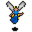{ .sprite } | [Lytwing](lytwing_fallhaven.md) | – | Fallhaven |
| { .sprite } | [Maddalena](sullengard_town_clerk.md) | – | Sullengard |
| { .sprite } | [Maelf](maelf.md) | – | Remgard |
| { .sprite } | [Maevalia](maevalia.md) | – | Prim |
| { .sprite } | [Maid](guynmart_maid.md) | – | Guynmart Castle |
| { .sprite } | [Mariora](sullengard_mariora.md) | – | Sullengard |
| { .sprite } | [Matpat](sullengard_matpat.md) | – | Sullengard |
| { .sprite } | [Mayor Ale](sullengard_mayor.md) | – | Sullengard |
| { .sprite } | [Mazeg](mazeg.md) | shopkeeper | Blackwater mountain 43 |
| { .sprite } | [Mean cat](rosmara_cat.md) | – | Wayto feygard duleian 2 |
| { .sprite } | [Melona](melona.md) | shopkeeper | Brimhaven |
| { .sprite } | [Mienn](mienn.md) | – | – |
| { .sprite } | [Milena](brightportnpc1.md) | – | Brightport |
| { .sprite } | [Minarra](minarra.md) | shopkeeper; starts [Flows through the veins](../quests/loneford.md), [The path is clear to me](../quests/rogorn.md) | Houseatcrossroads 4 |
| { .sprite } | [Miri](dds_miri.md) | starts [Darkness in the Daylight](../quests/darkness_in_daylight.md) | Mt. Galmore, Crossroads Guardhouse |
| 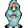{ .sprite } | [Morgisia](morgisia.md) | – | Remgard |
| { .sprite } | [Moriath](moriath.md) | starts [Take care of the caretaker](../quests/laeroth_caretaker.md) | Lake Laeroth |
| { .sprite } | [Mother](brv_villager12.md) | – | Brimhaven |
| { .sprite } | [Mourning woman](chapelgoer.md) | – | Brimhaven, Fallhaven, Loneford, Mt. Galmore, Loneford |
| { .sprite } | [Moyra](moyra.md) | – | Prim |
| { .sprite } | [Mustura](brv_guard_captain.md) | – | Brimhaven |
| { .sprite } | [Myrelis](mg_myrelis.md) | starts [You shall pass](../quests/undertell_barricades.md) | Mt. Galmore |
| { .sprite } | [Mysterious lizard creature](brightport_emyro.md) | starts [The balance of scales](../quests/brightport_lizard.md) | Burial cave |
| { .sprite } | [Nanath](nanath.md) | starts [Troubling times](../quests/troubling_times.md) | Fallhaven |
| 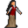{ .sprite } | [Nanette](sullengard_nanette.md) | starts [Pond safety](../quests/sullengard_pond_safety.md) | Sullengard |
| { .sprite } | [Narael](narael.md) | – | Flagstone 4 |
| { .sprite } | [Nicolo](brightport_councilor.md) | – | Brightport |
| { .sprite } | [Nimael](nimael.md) | – | Fallhaven |
| { .sprite } | [Nocmar](nocmar.md) | shopkeeper; starts [A place to forge](../quests/place_to_forge.md) | – |
| { .sprite } | [Nor agent](brightport_agent.md) | – | Brightport |
| 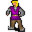{ .sprite } | [Norath](norath.md) | – | Remgard |
| { .sprite } | [Norgothla](guynmart_cguard.md) | – | Guynmart Castle |
| { .sprite } | [Nuik](guynmart_nuik.md) | – | Guynmart Castle |
| { .sprite } | [Oakleigh](sullengard_bartender.md) | – | Sullengard |
| { .sprite } | [Odair](odair.md) | starts [Rat infestation](../quests/odair.md) | Crossglen |
| { .sprite } | [Odilia](village_odilia.md) | – | Wexlow Village, Gamjee well jail cells |
| { .sprite } | [Odirath](stoutford_armorer.md) | shopkeeper | Stoutford |
| { .sprite } | [Ogam](ogam.md) | – | Vilegard |
| { .sprite } | [Ogea](brv_villager3.md) | – | Brimhaven |
| { .sprite } | [Olav](guynmart_olav.md) | – | Guynmart Castle |
| { .sprite } | [Old citizen](old_citizen.md) | – | Fallhaven |
| { .sprite } | [Old farmer](old_farmer.md) | – | Remgard, Stoutford |
| { .sprite } | [Old hermit](dds_oldhermit.md) | – | Waytolake 12 |
| { .sprite } | [Old Leta](old_leta.md) | – | Crossglen |
| { .sprite } | [Old man](old_man.md) | starts [Calomyran secrets](../quests/calomyran.md); starts [Rare delicacies](../quests/guynmart_wise.md) | Fallhaven, Guynmart Castle |
| { .sprite } | [Old Oromir](old_oromir.md) | – | Crossglen |
| { .sprite } | [Old Vilegard villager](old_vilegard_villager.md) | – | Vilegard |
| 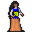{ .sprite } | [Old woman](stoutford_commoner4.md) | – | Stoutford |
| { .sprite } | [Ollie](sullengard_newborn_baby.md) | – | Sullengard |
| { .sprite } | [Oluag](oluag.md) | – | Wild 14 clearing |
| { .sprite } | [Orion, the centaur](lae_centaur1.md) | starts [Not Pony Island](../quests/lae_centaurs.md) | Island 1 |
| { .sprite } | [Oromir](oromir.md) | – | Crossglen |
| { .sprite } | [Ortholion's henchman](ortholion_guard9.md) | – | Elm 3f |
| { .sprite } | [Os](brute_creator.md) | – | Mountainlake 8 cave |
| { .sprite } | [Oseanpry](Brightportthieves5.md) | shopkeeper | Brightport |
| { .sprite } | [Osric](wexlow_osric.md) | – | Wexlow Village, Gamjee well jail cells |
| { .sprite } | [Oswald](brightportnpc6.md) | – | Brightport |
| { .sprite } | [Othinus](brightportpriest.md) | – | Brightport |
| { .sprite } | [Outcast](smuggler1.md) | – | Fallhaven, Woodhouse 3 |
| { .sprite } | [Overworked farmer](deebo_orchard_farmer.md) | – | Deebo's Orchard |
| { .sprite } | [Pangitain](brv_fortune_teller.md) | teaches [Merchant](../skills/barter.md), [Cleave](../skills/cleave.md), [Treasure Hunter](../skills/coinfinder.md), [Dodge](../skills/dodge.md), [Increased Fortitude](../skills/fortitude.md), [Magic Finder](../skills/magicfinder.md), [Weapon Accuracy](../skills/weaponChance.md) | Brimhaven |
| { .sprite } | [Parthenope](sirene1.md) | – | Lake Laeroth |
| { .sprite } | [Pearl white marble](guynmart_marble5.md) | – | Guynmart Castle |
| { .sprite } | [Peasant](brv_farmer.md) | – | Brimhaven |
| { .sprite } | [Peasant girl](brv_farmer_girl.md) | – | Brimhaven |
| { .sprite } | [Peasant grandfather](brv_old_farmer.md) | shopkeeper | Brimhaven |
| 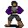{ .sprite } | [Percival](village_percival.md) | – | Wexlow Village, Gamjee well 4 1, Gamjee well jail cells |
| { .sprite } | [Perester](perester.md) | – | Remgard |
| { .sprite } | [Perlynn](perlynn.md) | – | Remgard |
| { .sprite } | [Philippa](village_philippa.md) | starts [A Feygard delicacy](../quests/feygard_delicacy.md) | Wexlow Village, Gamjee well jail cells |
| { .sprite } | [Pickpocket](pickpocket.md) | – | Fallhaven |
| { .sprite } | [Pink marble](guynmart_marble3.md) | – | Guynmart Castle |
| { .sprite } | [Pixtumn](quiet_thief.md) | shopkeeper | Brimhaven |
| 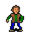{ .sprite } | [Playing child](brv_playing_child2.md) | – | Brimhaven |
| { .sprite } | [Playing children](brv_playing_child1.md) | – | Brimhaven |
| { .sprite } | [Playing kid](witch_playing_kid.md) | – | Flagstone Prison |
| { .sprite } | [Polyphem](polyphem.md) | – | Ll 2 cyclops cave |
| { .sprite } | [Potion merchant](potion_merchant.md) | shopkeeper | Fallhaven |
| { .sprite } | [Praying woman](brightportchurch1.md) | – | Brightport, Stoutford |
| { .sprite } | [Prim armorer](prim_armorer.md) | shopkeeper | Prim |
| { .sprite } | [Prim bar guest](prim_bar_guest.md) | – | Prim |
| { .sprite } | [Prim citizen](prim_citizen.md) | – | Prim |
| { .sprite } | [Prim commoner](prim_commoner.md) | – | Prim |
| { .sprite } | [Prim cook](prim_cook.md) | starts [Well rested](../quests/prim_innquest.md) | Prim |
| { .sprite } | [Prim evoker](prim_evoker.md) | – | Prim |
| { .sprite } | [Prim guard captain](prim_guard5.md) | – | Prim |
| { .sprite } | [Prim priestly acolyte](prim_priestly_acolyte.md) | – | Prim |
| { .sprite } | [Prim prisoner](prim_prisoner.md) | – | Prim |
| { .sprite } | [Prim pupil](prim_pupil.md) | – | Prim |
| { .sprite } | [Prim resident](prim_resident.md) | – | Prim |
| { .sprite } | [Prim tavern guest](prim_tavern_guest.md) | – | Prim |
| { .sprite } | [Prim tavern regular](prim_tavern_regular.md) | – | Prim |
| { .sprite } | [Prim visitor](prim_visitor.md) | – | Prim |
| { .sprite } | [Prison guard](remgard_pg.md) | – | Remgard |
| { .sprite } | [Prowling Arantxa](sullengard_arantxa.md) | shopkeeper | Sullengard |
| { .sprite } | [Pupil](brv_pupil1.md) | – | Brimhaven |
| { .sprite } | [Quasi](hunchback.md) | – | Brimhaven church basement |
| { .sprite } | [Quiet thief](stoutford_thief.md) | shopkeeper | Stoutford |
| { .sprite } | [Rain](rain.md) | – | Fallhaven |
| { .sprite } | [Rambling Feygard guard](lodar_fg2.md) | – | Loneford |
| { .sprite } | [Rancent](iqhan_greeter.md) | – | Pwcave 0 |
| { .sprite } | [Ravynne](sullengard_ravynne.md) | – | Sullengard |
| { .sprite } | [Reading Prim pupil](reading_prim_pupil.md) | – | Prim |
| { .sprite } | [Red marble](guynmart_marble2.md) | – | Guynmart Castle |
| { .sprite } | [Reinkarr](reinkarr.md) | – | Remgard |
| { .sprite } | [Rennik](wild6_house_thief.md) | – | Blackwater Mountain |
| { .sprite } | [Rhodita](guynmart_farmer.md) | starts [Roses](../quests/guynmart.md) | Guynmart Castle |
| { .sprite } | [Richimor](brightportnpc2.md) | – | Brightport |
| { .sprite } | [Rigmor](rigmor.md) | – | – |
| { .sprite } | [Rik](brv_tavern1_landlord.md) | – | Brimhaven |
| 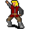{ .sprite } | [Rob](guynmart_rob.md) | – | Guynmart Castle |
| { .sprite } | [Rolwynn](rolwynn.md) | starts [Flows through the veins](../quests/loneford.md) | Crossroads Guardhouse |
| { .sprite } | [Room service](brv_cleaning.md) | – | Brimhaven |
| { .sprite } | [Rorthron](guynmart_wizard.md) | shopkeeper | Guynmart Castle |
| { .sprite } | [Rosmara](rosmara.md) | shopkeeper | Wayto feygard duleian 2 |
| { .sprite } | [Rothses](rothses.md) | shopkeeper | Remgard |
| { .sprite } | [Rowdy thief](brightportthieves3.md) | – | Brightport |
| { .sprite } | [Rubiano](brightport_mayor.md) | – | Brightport |
| { .sprite } | [Samar](samar.md) | shopkeeper | Prim |
| { .sprite } | [Seire](brightport_blockernpc.md) | – | Brightportwild 10 |
| { .sprite } | [Seviron](brv_churchman.md) | starts [A cat and mouse game](../quests/cat_and_mouse.md) | Brimhaven |
| { .sprite } | [Shannal](shannal.md) | – | Mt. Galmore |
| { .sprite } | [Shepherd](guynmart_shephard.md) | – | Guynmart Castle |
| { .sprite } | [Shop Owner](brv_shop_owner.md) | shopkeeper; starts [Honor your parents](../quests/brv_present.md) | Brimhaven |
| { .sprite } | [Sienn](sienn.md) | – | Loneford |
| { .sprite } | [Silvanus, the centaur](lae_centaur3.md) | starts [Not Pony Island](../quests/lae_centaurs.md) | Island 3 |
| { .sprite } | [Silvear](brightportthieves1.md) | – | Brightport |
| { .sprite } | [Siola](siola.md) | shopkeeper | – |
| { .sprite } | [Skylenar](skylenar.md) | shopkeeper | Remgard |
| { .sprite } | [Sly Seraphina](tt_seraphina.md) | shopkeeper | Prim, Vilegard, Brimhaven, Lake shore road 9, Crackshot hideout 3, Crackshot hideout 4 |
| { .sprite } | [Smug looking thief](smug_looking_thief.md) | – | Fallhaven |
| { .sprite } | [Spectator](guynmart_spectator2.md) | – | Guynmart Castle |
| { .sprite } | [Stanwick](brightportnpc.md) | – | Brightport |
| { .sprite } | [Stebbarik](brv_employee.md) | starts [Work for debts](../quests/brv_employee.md) | Brimhaven |
| { .sprite } | [Stephanie](sullengard_stephanie.md) | – | Sullengard |
| { .sprite } | [Stiyl](brightportpriest1.md) | shopkeeper | Brightport |
| { .sprite } | [Studying Blackwater priest](studying_blackwater_priest.md) | – | Blackwater mountain 43, Blackwater mountain 44 |
| { .sprite } | [Studying Prim pupil](studying_prim_pupil.md) | – | Prim |
| { .sprite } | [Stuephant](guynmart_child.md) | starts [Marble hunting](../quests/guynmart_marbles.md) | Guynmart Castle |
| { .sprite } | [Sylvester](brightportforenza.md) | – | Brightport |
| { .sprite } | [Taevinn](taevinn.md) | starts [Flows through the veins](../quests/loneford.md) | Loneford |
| { .sprite } | [Tahalendor](tahalendor.md) | starts [Rumblings](../quests/rumblings.md) | Stoutford |
| { .sprite } | [Tailor](tailor.md) | shopkeeper | Fallhaven |
| { .sprite } | [Talion](talion.md) | shopkeeper | – |
| 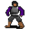{ .sprite } | [Tamarukh](tamarukh.md) | – | Loneford |
| { .sprite } | [Taret](taret.md) | – | Loneford |
| { .sprite } | [Tavern guest](tavern_guest.md) | – | Vilegard, Remgard |
| { .sprite } | [Taylin](taylin.md) | – | Remgard |
| { .sprite } | [Teccow](mg2_starwatcher.md) | starts [The exploded star](../quests/mg2_exploded_star.md) | Stoutford |
| 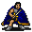{ .sprite } | [Teksin](teksin.md) | shopkeeper | Waytolake 11 |
| { .sprite } | [Telund](telund.md) | – | Loneford |
| { .sprite } | [Tember](remgard_prison_thief.md) | – | Remgard |
| 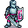{ .sprite } | [Temple Guard](brv_temple_entrance_guard.md) | – | Brimhaven |
| { .sprite } | [Thalos, the centaur](lae_centaur9.md) | – | Island 2 |
| { .sprite } | [Tharwyn](tharwyn.md) | shopkeeper; starts [Trusting an outsider](../quests/vilegard.md) | Vilegard |
| { .sprite } | [Thelry](thelry.md) | shopkeeper | Brimhaven |
| 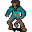{ .sprite } | [Theobald](village_theobald.md) | – | Wexlow Village, Gamjee well jail cells |
| { .sprite } | [Theodora](village_theodora.md) | – | Wexlow Village, Gamjee well jail cells |
| { .sprite } | [Thieves guild cook](thieves_guild_cook.md) | shopkeeper | Fallhaven |
| { .sprite } | [Thorin](thorin.md) | shopkeeper; starts [Bits and pieces](../quests/thorin.md) | Mountaincave 3 |
| { .sprite } | [Thoronir](thoronir.md) | shopkeeper | Fallhaven |
| { .sprite } | [Throdna](throdna.md) | starts [Lights in the dark](../quests/kazaul.md) | Prim |
| { .sprite } | [Throdna's guard](throdnas_guard.md) | – | Prim |
| { .sprite } | [Throthaus](throthaus.md) | – | Loneford |
| { .sprite } | [Thyrope Splathershed](ll2_mapmaker.md) | starts [A map of the Great Lake Laeroth](../quests/lake_map.md) | Remgard |
| { .sprite } | [Tinlyn](tinlyn.md) | starts [Lost sheep](../quests/tinlyn.md) | Crossroads Guardhouse |
| { .sprite } | [Tired citizen](tired_citizen.md) | – | Fallhaven |
| { .sprite } | [Tired farmer](tired_farmer.md) | – | Crossglen |
| { .sprite } | [Tjure](tjure.md) | starts [The silver scale](../quests/mermaid_scale.md) | Blackwater Mountain |
| { .sprite } | [Tobby](tobby.md) | starts [Sobby's Trail](../quests/tobby.md) | Guynmart wood 19, Guynmart wood 18, Guynmart wood 17b, Guynmart wood 17, Fallhaven |
| { .sprite } | [Tonis](tonis.md) | starts [Clouded intent](../quests/prim_hunt.md) | Prim |
| { .sprite } | [Torilo](torilo.md) | shopkeeper | Foaming Flask Tavern |
| 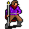{ .sprite } | [Trauerquol](brightportinnvisitor.md) | – | Brightport |
| { .sprite } | [Troublemaker](troublemaker.md) | shopkeeper | Fallhaven |
| 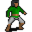{ .sprite } | [Truric](truric.md) | shopkeeper | Brimhaven |
| { .sprite } | [Two-teeth](twoteeth.md) | starts [Sweet sweet rat poison](../quests/lowyna.md) | Fallhaven |
| { .sprite } | [Umar](umar.md) | starts [A lost potion](../quests/lodar.md), [Another ruthless Crackshot](../quests/Thieves04.md), [Immaculate kidnapping](../quests/Thieves02.md), [The ruthless Crackshot](../quests/Thieves03.md) +2 | Fallhaven |
| { .sprite } | [Undead child](erwyn_child.md) | – | Flagstone Prison |
| { .sprite } | [Undina Bogsten](bogsten_granny.md) | – | Mushroom m 2 4 |
| { .sprite } | [Ungorm](ungorm.md) | – | Blackwater mountain 43 |
| { .sprite } | [Unkorh](guynmart_steward.md) | – | Guynmart Castle |
| { .sprite } | [Unnmir](unnmir.md) | starts [Lost treasures](../quests/nocmar.md) | – |
| { .sprite } | [Vaelric](vaelric.md) | shopkeeper; starts [The swamp healer](../quests/swamp_healer.md) | Galmore 17 house |
| { .sprite } | [Valentina](crossglen_valentina.md) | – | Crossglen, Sullengard |
| 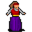{ .sprite } | [Valeria](sullengard_valeria.md) | – | Sullengard |
| { .sprite } | [Valhorn](sullengard_valhorn.md) | – | Sullengard |
| { .sprite } | [Venanra](brv_laundry_boss.md) | shopkeeper | Brimhaven |
| { .sprite } | [Vilegard armorer](vilegard_armorer.md) | shopkeeper; starts [Trusting an outsider](../quests/vilegard.md) | Vilegard |
| { .sprite } | [Vilegard citizen](vilegard_citizen.md) | – | Vilegard |
| { .sprite } | [Vilegard resident](vilegard_resident.md) | – | Vilegard |
| { .sprite } | [Vilegard smith](vilegard_smith.md) | shopkeeper; starts [Trusting an outsider](../quests/vilegard.md) | Vilegard |
| { .sprite } | [Vilegard woman](vilegard_woman.md) | starts [Trusting an outsider](../quests/vilegard.md) | Vilegard |
| { .sprite } | [Villager](loneford_villager0.md) | starts [Flows through the veins](../quests/loneford.md) | Loneford |
| { .sprite } | [Visitor](crossroads_guest.md) | – | Crossroads Guardhouse |
| { .sprite } | [Waeges](waeges.md) | shopkeeper | Blackwater mountain 43 |
| { .sprite } | [Waitress](brv_tavern_west_waitress.md) | shopkeeper | Brimhaven |
| { .sprite } | [Wallach](wallach.md) | – | Loneford |
| { .sprite } | [Warehouse storage spot](brv_wh_item_00.md) | – | Brimhaven |
| { .sprite } | [Warehouse worker](brv_wh_worker.md) | – | Brimhaven |
| { .sprite } | [Wart](ratdom_rat_warden.md) | shopkeeper | Museum |
| { .sprite } | [Watchdog](brightportthieves4.md) | – | Brightport, Brimhaven |
| { .sprite } | [Watchman](guard_pathway.md) | starts [A path to the Duleian Road](../quests/pathway_fallhaven.md) | Fallhaven |
| { .sprite } | [Waterway traveler](graveyard_traveler.md) | – | Graveyard 0 |
| { .sprite } | [Whootibarfag](whootibarfag.md) | shopkeeper; teaches [Evasion](../skills/evasion.md) | Blackwater Mountain |
| { .sprite } | [Winona](sullengard_winona.md) | – | Sullengard |
| { .sprite } | [Wisdom](guynmart_reward2.md) | – | Guynmart Castle |
| { .sprite } | [Wise of the wells](ratdom_well_wise0.md) | – | 4 wells |
| { .sprite } | [Wood craftsman](brv_woodcraftsman.md) | shopkeeper | Brimhaven |
| { .sprite } | [Woodcutter](woodcutter_0.md) | – | Crossroads Guardhouse, Brimhaven |
| 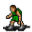{ .sprite } | [Worker](brv_laundry_worker.md) | – | Brimhaven |
| { .sprite } | [Wounded Feygard mountain scout](ortholion_guard_wounded.md) | – | Blackwater Mountain |
| { .sprite } | [Wounded Prim guard](prim_guard7.md) | – | Prim |
| { .sprite } | [Writhing bread](breadgolem1.md) | – | Brightport forest |
| { .sprite } | [Wrye](wrye.md) | – | Vilegard |
| { .sprite } | [Wulfric](wulfric.md) | – | Wexlow Village |
| { .sprite } | [Yolgen](yolgen.md) | shopkeeper; starts [Ancient secrets](../quests/flagstone.md) | Stoutford |
| { .sprite } | [Young man](stoutford_commoner5.md) | – | Stoutford |
| { .sprite } | [Ysrine](ysrine.md) | starts [Dominion](../quests/dominion.md) | Undertell 1 1 |
| { .sprite } | [Zaccheria](sullengard_zaccheria.md) | shopkeeper; starts [Recovering stolen property](../quests/sullengard_recover_items.md) | Sullengard |
| { .sprite } | [Zimsko](zimsko.md) | – | Brimhaven |
| { .sprite } | [Zorvan](brv_undertaker.md) | – | Brimhaven church basement |

<h3 id="npcs-animal">Animal (24)</h3>

| | Name | Role | Found in |
|---|---|---|---|
| { .sprite } | [Black cat](black_cat.md) | – | Flagstone Prison |
| { .sprite } | [Black fog](zuul_khan1_blocker.md) | – | Bogsten 4, Mushroom m 2 3, Mushroom m 2 6, Mushroom m 2 8, Mushroom m 3 1, Mywildcave 4 |
| { .sprite } | [Brown cat](brown_cat.md) | – | Flagstone Prison |
| { .sprite } | [Cat](brv_churchcat.md) | – | Brimhaven church upstairs |
| { .sprite } | [Cithurn's cat](cithurncat.md) | – | Waterwaybhouse |
| { .sprite } | [Dog](petdog.md) | – | Remgard, Guynmart Castle |
| { .sprite } | [Especially sweet berries](wild_berry3.md) | – | Deebo's Orchard |
| 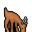{ .sprite } | [Feeding goat](sullengard_goat_feeding.md) | – | Way to sullengard east 11 |
| { .sprite } | [Gray cat](gray_cat.md) | – | Flagstone Prison |
| 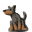{ .sprite } | [Guard dog](guard_dog.md) | – | Brightport |
| { .sprite } | [Horse](stn_horse.md) | – | Flagstone Prison, Guynmart Castle |
| { .sprite } | [Hungry pig](hungry_pig.md) | – | Fallhaven |
| { .sprite } | [Ice berries](wild_berry2.md) | – | Blackwater Mountain |
| { .sprite } | [Mordred](brightport_huntingdog.md) | – | Brightport |
| { .sprite } | [Mouse](brv_churchmouse.md) | – | Brimhaven church upstairs |
| { .sprite } | [Old Blue](blue_cat.md) | – | Flagstone Prison |
| { .sprite } | [Orange cat](orange_cat.md) | – | Flagstone Prison |
| { .sprite } | [Pig](pig.md) | – | Loneford, Sullengard, Deebo's Orchard, Mountainlake circe |
| { .sprite } | [Shepherd's dog](guynmart_dog1.md) | – | Guynmart Castle |
| 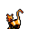{ .sprite } | [Tiger cat](striped_cat.md) | – | Flagstone Prison |
| { .sprite } | [Tocsin](tocsin.md) | – | Undertell 4 00 |
| { .sprite } | [Wild berries](wild_berry.md) | – | Fallhaven, Guynmart Castle, Deebo's Orchard |
| { .sprite } | [Wild flower](wild_flower.md) | – | Fallhaven |
| { .sprite } | [Young herding dog](sull_herding_dog.md) | – | Way to sullengard east 11 |

<h3 id="npcs-undead">Undead (17)</h3>

| | Name | Role | Found in |
|---|---|---|---|
| { .sprite } | [Anavrin](anavrin.md) | – | Undertell 5 |
| { .sprite } | [Audela](audela.md) | – | Lake Laeroth |
| { .sprite } | [Cuned](cuned.md) | – | Lake Laeroth |
| { .sprite } | [Cymbalist](ratdom_skel_cymb.md) | – | Skeleton dance, Flagstone Prison |
| { .sprite } | [Dancing skeleton](ratdom_skel_dance1.md) | – | Skeleton dance |
| { .sprite } | [Drummer](erwyn_skel_drum.md) | – | Flagstone Prison, Skeleton dance |
| { .sprite } | [Horn player](ratdom_skel_horn.md) | – | Skeleton dance, Flagstone Prison |
| { .sprite } | [Jerelin](jerelin.md) | – | Lake Laeroth |
| { .sprite } | [Kha'zaan Porter](porter.md) | – | Undertell 4 00 |
| { .sprite } | [Laeroth prisoner](lae_prisoner.md) | starts [Shadow of the torturer](../quests/lae_torturer.md) | Laerothprison 4 |
| { .sprite } | [Lutenist](erwyn_skel_lute.md) | – | Flagstone Prison, Skeleton dance |
| { .sprite } | [Morvath](morvath.md) | starts [The fifth master](../quests/fifth_master.md) | Undertell 00 |
| { .sprite } | [Skeleton mage](ratdom_skel_mage.md) | – | Skeleton dance |
| { .sprite } | [Thalen](thalen.md) | starts [The fifth master](../quests/fifth_master.md) | Undertell 3 lava 00 |
| { .sprite } | [Vaelzahr](vaelzahr.md) | starts [The fifth master](../quests/fifth_master.md) | Undertell 7 00 |
| { .sprite } | [Verigil](verigil.md) | – | Lake Laeroth |
| { .sprite } | [Zaroth](zaroth.md) | starts [The fifth master](../quests/fifth_master.md) | Undertell 4 00 |

<h3 id="npcs-ghost">Ghost (4)</h3>

| | Name | Role | Found in |
|---|---|---|---|
| { .sprite } | [Elytharan cooker slave](elytharan_cook_slave.md) | – | Undertell 1 1 |
| { .sprite } | [Liberated Elytharan ghost](elytharan_liberated_ghost.md) | starts [About a girl](../quests/about_a_girl.md) | Undertell 3 00 |
| { .sprite } | [Shy Cora](shy_cora.md) | shopkeeper | Undertell 01, Undertell 1 1 |
| { .sprite } | [Terrified teenager](about_a_girl1.md) | – | Undertell 3 12 |

<h3 id="npcs-construct">Construct (3)</h3>

| | Name | Role | Found in |
|---|---|---|---|
| { .sprite } | [Bread golem](breadgolem.md) | – | Brightportwild 8 |
| { .sprite } | [Charybdis](ll2_whirl.md) | – | Lake Laeroth, Mountainlake sub |
| { .sprite } | [Oegyth crystal](mg2_cavea_home.md) | – | Mt. Galmore |

<h3 id="npcs-reptile">Reptile (1)</h3>

| | Name | Role | Found in |
|---|---|---|---|
| { .sprite } | [Sienn's pet](sienn_pet.md) | – | Loneford |

## Scenery

Decorations, animals, cutscene figures and dialogue props (such as the items in Brimhaven's warehouse delivery quest). They exist in the character data so they can appear on maps or speak in dialogue ~~but you can't loot the chandelier~~.

| | Name | Kind | Found in |
|---|---|---|---|
| { .sprite } | [???](unknown.md) | dialogue prop | Crossroads Guardhouse |
| { .sprite } | [Adakin](laeroth_last_lord.md) | scenery | – |
| { .sprite } | [Aurelia](brightportstudent8.md) | scenery | Brightport |
| { .sprite } | [Baltimor](brightportnpc9.md) | scenery | – |
| { .sprite } | [Blue fish](fish_school.md) | scenery | Flagstone Prison |
| { .sprite } | [Brightport student](brightportstudent5.md) | scenery | Brightport |
| { .sprite } | [Briwerra's family cat](sullengard_briwerra_cat.md) | scenery | Sullengard |
| { .sprite } | [Cedric](brightportstudent6.md) | scenery | Brightport |
| 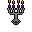{ .sprite } | [Chandelier](brv_wh_item_44.md) | dialogue prop | Brimhaven |
| { .sprite } | [Chicken](chicken.md) | scenery | Brightport |
| { .sprite } | [Crystal globe](brv_wh_item_40.md) | dialogue prop | Brimhaven |
| { .sprite } | [Dietrich](brightportstudent7.md) | scenery | Brightport |
| { .sprite } | [Duleian mountain cat cub](brightport_cat.md) | scenery | Brightportwild 2 |
| { .sprite } | [Duleian panther cub](brightport_cat3.md) | scenery | Buried citadel |
| { .sprite } | [Dummy NPC](none.md) | dialogue prop | – |
| { .sprite } | [Dusty old book](brv_wh_item_49.md) | dialogue prop | Brimhaven |
| { .sprite } | [Dying Crackshot](g03_crackshot_dying.md) | dialogue prop | Crackshot hideout 3 |
| { .sprite } | [Eel](ll2_watersnake1.md) | scenery | Remgard, Lake Laeroth |
| { .sprite } | [Eyvipa](eyvipa.md) | dialogue prop | Lake Laeroth |
| 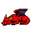{ .sprite } | [Falkour the Forge Dragon](wh_dragon.md) | dialogue prop | Fallhaven |
| { .sprite } | [Farm horse](farm_horse.md) | scenery | Deebo's Orchard |
| { .sprite } | [Fish](brv_fish1.md) | scenery | Brimhaven, Guynmart Castle, Guynmart Castle, Lake Laeroth, Remgard, Lake Laeroth, Waterway |
| { .sprite } | [Galmore sky hunter](eagle.md) | scenery | Mt. Galmore |
| { .sprite } | [Ghost](ratdom_ghost.md) | scenery | Labyrinth |
| { .sprite } | [Grazing horse](graze_horse_left.md) | scenery | Deebo's Orchard |
| { .sprite } | [Guard 1](brightportguardcrate1.md) | dialogue prop | Brightport chimney, Brightport crate 1, Brightport crate 2 |
| { .sprite } | [Guard 2](brightportguardcrate2.md) | dialogue prop | Brightport chimney, Brightport crate 1, Brightport crate 2 |
| { .sprite } | [Isobel](sutdover_fisherman.md) | dialogue prop | Lake shore road 3 |
| { .sprite } | [Jellyfish](ll2_jelly1.md) | scenery | Remgard, Lake Laeroth |
| { .sprite } | [Lyre](brv_wh_item_42.md) | dialogue prop | Brimhaven |
| { .sprite } | [Mermaid](river_mermaid.md) | scenery | Crossroads Guardhouse |
| { .sprite } | [Mysterious green something](brv_wh_item_45.md) | dialogue prop | Brimhaven |
| 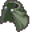{ .sprite } | [Old, worn cape](brv_wh_item_46.md) | dialogue prop | Brimhaven |
| { .sprite } | [Plush pillow](brv_wh_item_41.md) | dialogue prop | Brimhaven |
| { .sprite } | [Pond fish](pond_fish.md) | scenery | Mt. Galmore, Lake Laeroth, Flagstone Prison |
| { .sprite } | [Pretty porcelain figure](brv_wh_item_47.md) | dialogue prop | Brimhaven |
| 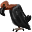{ .sprite } | [Preying bird](preying_bird.md) | scenery | Way to sullengard west 2 |
| { .sprite } | [Regnal](brightportstudent4.md) | dialogue prop | Brightport |
| { .sprite } | [Rooster](rooster.md) | scenery | Brightport |
| { .sprite } | [Squid](ll2_squid1.md) | scenery | Remgard, Lake Laeroth |
| { .sprite } | [Striped hammer](brv_wh_item_48.md) | dialogue prop | Brimhaven |
| { .sprite } | [Syrra](about_a_girl_final.md) | dialogue prop | Undertell 3 00 |
| { .sprite } | [Thaddeus](brightportstudent1.md) | scenery | Brightport |
| { .sprite } | [Turtle](ll2_turtle1.md) | scenery | Remgard, Lake Laeroth |
| { .sprite } | [Unknown female voice](gamjee_well_unknown_female_voice.md) | dialogue prop | Gamjee well 2 1 |
| { .sprite } | [Unknown male voice](gamjee_well_unknown_male_voice.md) | dialogue prop | Gamjee well 2 1 |
| { .sprite } | [Unknown well voice](well_voice.md) | dialogue prop | Wexlow Village |
| { .sprite } | [Venomfang](venomfang_1.md) | scenery | Stoutford |
| { .sprite } | [Voice of Shannal](voice_shannal.md) | dialogue prop | Mt. Galmore |
| { .sprite } | [yellow boot](brv_wh_item_43.md) | dialogue prop | Brimhaven |
| { .sprite } | [Ysolde](brightportstudent2.md) | scenery | Brightport |
