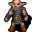

# { .sprite } Iqhan master

| Stat | Value |
|---|---|
| Class | humanoid |
| HP | 69 |
| Max AP | 10 |
| Attack cost | 3 |
| Move cost | 5 |
| Damage | 2 to 13 |
| Attack chance | 140 |
| Block chance | 60 |
| Damage resistance | 0 |
| Critical skill | 20 |
| Critical multiplier | 2.0 |

## Drops

| Item | Chance | Qty |
|---|---|---|
| [Gold coins](../items/gold.md) | 70% | 1 to 5 |
| [Iqhan pendant](../items/iqhan_pendant.md) | 1% | 1 |
| [Torn shirt](../items/shirt_torn.md) | 5% | 1 |
| [Iron dagger](../items/dagger0.md) | 5% | 1 |

## Found on

- [pwcave2](../maps/pwcave2.md)
- [pwcave2a](../maps/pwcave2a.md)
- [pwcave3](../maps/pwcave3.md)
- [pwcave4](../maps/pwcave4.md)

<small>Monster ID: `iqhan_4a` · Data from v0.8.18</small>
