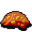

# { .sprite } Poisonous ooze

| Stat | Value |
|---|---|
| Class | construct |
| HP | 45 |
| Max AP | 10 |
| Attack cost | 5 |
| Move cost | 5 |
| Damage | 5 to 9 |
| Attack chance | 140 |
| Block chance | 20 |
| Damage resistance | 3 |
| Critical skill | 15 |
| Critical multiplier | 3.0 |

!!! note "Immune to critical hits"
    Monsters of this class cannot be critically hit.

## On hit

- **On target:** Corrosive slime (magnitude 1, 5 rounds, 40% chance)

## Drops

| Item | Chance | Qty |
|---|---|---|
| [Gold coins](../items/gold.md) | 20% | 0 to 2 |
| [Mundane ring](../items/ring1.md) | 5% | 1 |
| [Polished ring](../items/ring2.md) | 5% | 1 |
| [Mundane necklace](../items/junk_necklace0.md) | 5% | 1 |
| [Polished necklace](../items/junk_necklace1.md) | 5% | 1 |

## Found on

- [roadcave0](../maps/roadcave0.md)
- [roadcave1](../maps/roadcave1.md)

<small>Monster ID: `jelly3` · Data from v0.8.18</small>
