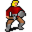

# { .sprite } Kantya

| Stat | Value |
|---|---|
| Class | ? |
| HP | 0 |
| Max AP | 10 |
| Attack cost | 10 |
| Move cost | 10 |
| Damage | 0 |
| Attack chance | 0 |
| Block chance | 0 |
| Damage resistance | 0 |
| Critical skill | 0 |
| Critical multiplier | 0 |

## Found on

- [tradehouse0](../maps/tradehouse0.md)

## Quests

- [Destined for great things](../quests/charwood1.md): stages 19
- [Trial by fire](../quests/charwood2.md): stages 10

## Dialogue simulator

Set up your situation (quest stages, items, kills…), then talk to Kantya. The simulator follows the game's own rules: it takes the same silent checks, offers only the options you'd really see, and applies their effects (quest stages, items handed over, rewards) as you go.

<noscript>The simulator needs JavaScript. The full dialogue is listed below.</noscript>

Rules verified against v0.8.18 game code (ConversationController.java) and dialogue data.

??? quote "Dialogue (25 lines)"

    *What the dialogue says, exactly as in the game files. Lines are listed once; links jump to the line a choice leads to.*

    **`kantya`** *(silent check: the first matching branch below is taken)* — **effects:** sets stage 19 of [Destined for great things](../quests/charwood1.md#stage-19)

    - branch 1 *(if reached stage 50 of [Destined for great things](../quests/charwood1.md#stage-50))* → [kantya1](#d-kantya1)
    - branch 2 → [kantya0](#d-kantya0)

    **`kantya1`** Kantya: “Thank you for finding our missing people!”

    - “You're welcome.” → *conversation ends*
    - “What do you think caused the monsters to appear?” → [kantya2](#d-kantya2)

    **`kantya0`** Kantya: “What will happen to us?”

    **`kantya2`** Kantya: “I told them we shouldn't be digging deeper!”

    - Next → [kantya3](#d-kantya3)

    **`kantya3`** Kantya: “But they did anyway. Now, look what it got us.”

    - “What happened?” → [kantya4](#d-kantya4)

    **`kantya4`** Kantya: “It all started with a few of the miners coming back from their shift. They reported having found some sort of markings on the ground.”

    - Next → [kantya5](#d-kantya5)

    **`kantya5`** Kantya: “Strange markings. Unnatural. Nothing like we've seen before.”

    - “What did the markings say?” → [kantya6](#d-kantya6)

    **`kantya6`** Kantya: “We don't know. No one could make any sense of them, not even Morenavia. I told them all that we should just leave it be.”

    - Next → [kantya7](#d-kantya7)

    **`kantya7`** Kantya: “But they didn't listen.”

    - Next → [kantya8](#d-kantya8)

    **`kantya8`** Kantya: “Then some people started hearing strange noises coming from below the ground around those markings. Almost like there was something below - a cavern or something.”

    - Next → [kantya9](#d-kantya9)

    **`kantya9`** Kantya: “Strange noises filled the whole mine, loud rumbles and shrieking noises from within the rock.”

    - “What happened then?” → [kantya10](#d-kantya10)

    **`kantya10`** Kantya: “They wanted to find out what was below those markings.”

    - Next → [kantya11](#d-kantya11)

    **`kantya11`** Kantya: “So they started breaking through further down.”

    - Next → [kantya12](#d-kantya12)

    **`kantya12`** Kantya: “I wasn't there myself, but I heard from some of the miners. As they broke through, there was a rush of air and a clattering noise, almost like claws, coming from the dark hole beneath.”

    - Next → [kantya13](#d-kantya13)

    **`kantya13`** Kantya: “Below the ground with the markings, there was a cavern, just as they had suspected.”

    - Next → [kantya14](#d-kantya14)

    **`kantya14`** Kantya: “A foul sulfurous smell crept into the mine, most likely coming from that cavern.”

    - Next → [kantya15](#d-kantya15)

    **`kantya15`** Kantya: “They started hearing chattering in strange voices from inside the opening.”

    - “What happened then?” → [kantya16](#d-kantya16)

    **`kantya16`** Kantya: “Then they saw it. As I've heard it, it all started as a small flame from within the dark cavern.”

    - Next → [kantya17](#d-kantya17)

    **`kantya17`** Kantya: “The flame grew stronger, and more lights appeared.”

    - Next → [kantya18](#d-kantya18)

    **`kantya18`** Kantya: “Out of the dark, they came. Out from the depths of the mine.”

    - Next → [kantya19](#d-kantya19)

    **`kantya19`** Kantya: “Those foul smelling things.”

    - Next → [kantya20](#d-kantya20)

    **`kantya20`** Kantya: “I told everyone that we shouldn't have breached that deep. We should have stopped when we first saw those markings on the ground.”

    - Next → [kantya21](#d-kantya21)

    **`kantya21`** Kantya: “Those markings must have been some sort of warning.”

    - “Is that how this all started?” → [kantya22](#d-kantya22)

    **`kantya22`** Kantya: “Yes. Whatever was in that cavern, we should not have let it out. Maybe that way, Morenavia and Ayell would still be alive.”

    - “Is there anything I can do?” → [kantya23](#d-kantya23)

    **`kantya23`** Kantya: “You've helped us this far. Talk to Maevalia again, she might have something else for you.” — **effects:** sets stage 10 of [Trial by fire](../quests/charwood2.md#stage-10)

    - “OK, I'll go talk to Maevalia again.” → [kantya0](#d-kantya0)

## Version history

| Version | Change |
|---|---|
| [v0.7.0](../versions/0.7.0.md) | Present in v0.7.0 (earliest release tracked) |
| [v0.7.1](../versions/0.7.1.md) | Dialogue: 1 line changed · text: “Strange noises filled the whole mine, lour rumbles and shrieking nois…” → “Strange noises filled the whole mine, loud rumbles and shrieking nois…” |
| [v0.7.2](../versions/0.7.2.md) | Dialogue: 2 lines changed |

Verified against v0.8.18 and every earlier release back to v0.7.0 (game data compared release by release).

## Community notes

<small>Written by players, not generated from game data. **Observations**: what players notice in-game · **Lore**: the in-world story · **Trivia**: real-world facts, references, development history · **Theory / speculation**: unconfirmed ideas; may just be unfinished content</small>

### Observations

*Nothing here yet. Know something? [Add it](https://github.com/asdfghjkl628/Andor-s-Trail-Wikiiii/new/main/notes/monsters?filename=kantya.md&value=%23%23%20Observations%0A%0A%3C%21--%20what%20players%20notice%20in-game%20--%3E%0A%0A%23%23%20Lore%0A%0A%3C%21--%20the%20in-world%20story%20--%3E%0A%0A%23%23%20Trivia%0A%0A%3C%21--%20real-world%20facts%2C%20references%2C%20development%20history%20--%3E%0A%0A%23%23%20Theory%20/%20speculation%0A%0A%3C%21--%20unconfirmed%20ideas%3B%20may%20just%20be%20unfinished%20content%20--%3E%0A).*

### Lore

*Nothing here yet. Know something? [Add it](https://github.com/asdfghjkl628/Andor-s-Trail-Wikiiii/new/main/notes/monsters?filename=kantya.md&value=%23%23%20Observations%0A%0A%3C%21--%20what%20players%20notice%20in-game%20--%3E%0A%0A%23%23%20Lore%0A%0A%3C%21--%20the%20in-world%20story%20--%3E%0A%0A%23%23%20Trivia%0A%0A%3C%21--%20real-world%20facts%2C%20references%2C%20development%20history%20--%3E%0A%0A%23%23%20Theory%20/%20speculation%0A%0A%3C%21--%20unconfirmed%20ideas%3B%20may%20just%20be%20unfinished%20content%20--%3E%0A).*

### Trivia

*Nothing here yet. Know something? [Add it](https://github.com/asdfghjkl628/Andor-s-Trail-Wikiiii/new/main/notes/monsters?filename=kantya.md&value=%23%23%20Observations%0A%0A%3C%21--%20what%20players%20notice%20in-game%20--%3E%0A%0A%23%23%20Lore%0A%0A%3C%21--%20the%20in-world%20story%20--%3E%0A%0A%23%23%20Trivia%0A%0A%3C%21--%20real-world%20facts%2C%20references%2C%20development%20history%20--%3E%0A%0A%23%23%20Theory%20/%20speculation%0A%0A%3C%21--%20unconfirmed%20ideas%3B%20may%20just%20be%20unfinished%20content%20--%3E%0A).*

### Theory / speculation

*Nothing here yet. Know something? [Add it](https://github.com/asdfghjkl628/Andor-s-Trail-Wikiiii/new/main/notes/monsters?filename=kantya.md&value=%23%23%20Observations%0A%0A%3C%21--%20what%20players%20notice%20in-game%20--%3E%0A%0A%23%23%20Lore%0A%0A%3C%21--%20the%20in-world%20story%20--%3E%0A%0A%23%23%20Trivia%0A%0A%3C%21--%20real-world%20facts%2C%20references%2C%20development%20history%20--%3E%0A%0A%23%23%20Theory%20/%20speculation%0A%0A%3C%21--%20unconfirmed%20ideas%3B%20may%20just%20be%20unfinished%20content%20--%3E%0A).*

<small>Monster ID: `kantya` · Data from v0.8.18</small>
