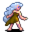

# { .sprite } Kayla

**Where to find Kayla:** Stoutford: [Stoutford cottage 2](../maps/stoutford_cottage2.md#pin-npc-kayla)

<div class="infobox" markdown>

<p class="ib-img">{ .sprite }</p>

| | |
|---|---|
| **Type** | NPC (can be spoken to; cannot be attacked) |
| **Role** | Shopkeeper |
| **Found in** | Stoutford |
| **Entry ID** | `kayla` |
| **Introduced** | [v0.7.2](../versions/0.7.2.md) |

</div>

## Shop stock

| Item | Chance | Qty |
|---|---|---|
| [Robe of the Sublimate](../items/robe_sublime.md) | 100% | 1 |
| [Feline shoes](../items/feline_shoes.md) | 100% | 1 |
| [Feline gloves](../items/feline_gloves.md) | 100% | 1 |
| [Handsewn leather gloves](../items/handsewn_gloves2.md) | 100% | 3 |
| [Handsewn snakeskin gloves](../items/handsewn_gloves4.md) | 100% | 2 |
| [Goatskin gloves](../items/gloves_goatskin.md) | 100% | 1 |
| [Goatskin hat](../items/hat_goatskin.md) | 100% | 1 |
| [Snakeskin tunic](../items/tunic_snakeskin.md) | 100% | 1 |
| [Goatskin boots](../items/boots_goatskin.md) | 100% | 1 |
| [Handsewn leather boots](../items/handsewn_boots2.md) | 100% | 1 |

## Quests

- [Surprise?](../quests/halvor_surprise.md): stage 190

## Dialogue simulator

Set your quest stages and items, then talk to Kayla. Same rules as the game: same checks, same options, same effects.

<div class="dlg-sim" data-src="../../assets/dialogue/kayla_0.json" data-npc="Kayla" markdown="0"><noscript>The simulator needs JavaScript. The full dialogue is listed below.</noscript></div>

<p class="verified">Rules verified against v0.8.18 game code (ConversationController.java) and dialogue data.</p>

??? quote "Dialogue (12 lines)"

    *Exactly as in the game files. Each line appears once; links jump to where a choice leads.*

    <span id="d-kayla_0"></span>**`kayla_0`** *(silent check: the first matching branch below is taken)*

    - Next → [kayla_1](#d-kayla_1)

    <span id="d-kayla_1"></span>**`kayla_1`** Kayla: “Hello.”

    - “Who are you?” → [kayla_2](#d-kayla_2)
    - “Have you seen my brother Andor?” → [kayla_3](#d-kayla_3)
    - “Are you a friend of Halvor?” *(if reached stage 180 of [Surprise?](../quests/halvor_surprise.md#stage-180); NOT reached stage 190 of [Surprise?](../quests/halvor_surprise.md#stage-190))* → [kayla_halvor_0](#d-kayla_halvor_0)

    <span id="d-kayla_2"></span>**`kayla_2`** Kayla: “I'm Kayla. I love making clothes, shoes and boots.”

    - Next → [kayla_4](#d-kayla_4)

    <span id="d-kayla_3"></span>**`kayla_3`** Kayla: “No. Sorry.”


    <span id="d-kayla_halvor_0"></span>**`kayla_halvor_0`** Kayla: “Halvor? Yes! He's so nice! Do you know him?”

    - “I hate the guy. He's nothing but trouble...” → [kayla_halvor_1](#d-kayla_halvor_1)
    - “Sure, we keep meeting around the world in the most unusual places. I even helped him gather some items.” → [kayla_halvor_2](#d-kayla_halvor_2)

    <span id="d-kayla_4"></span>**`kayla_4`** Kayla: “Do you want to trade?”

    - “Sure.” → *shop opens*
    - “Not now.” → *conversation ends*

    <span id="d-kayla_halvor_1"></span>**`kayla_halvor_1`** Kayla: “He's always been good to me. If you don't like him, I don't like you!”


    <span id="d-kayla_halvor_2"></span>**`kayla_halvor_2`** Kayla: “So that's you! He told me about you.”

    - Next → [kayla_halvor_3](#d-kayla_halvor_3)

    <span id="d-kayla_halvor_3"></span>**`kayla_halvor_3`** Kayla: “He told me you were of great help.”

    - “It was a pleasure.” → [kayla_halvor_4](#d-kayla_halvor_4)
    - “I just did my part.” → [kayla_halvor_4](#d-kayla_halvor_4)
    - “Well, he paid good money.” → [kayla_halvor_4](#d-kayla_halvor_4)

    <span id="d-kayla_halvor_4"></span>**`kayla_halvor_4`** Kayla: “Anyway. I made these boots with the items he brought me.”

    - Next → [kayla_halvor_5](#d-kayla_halvor_5)

    <span id="d-kayla_halvor_5"></span>**`kayla_halvor_5`** Kayla: “I'm really proud of the result. They are light, but sturdy, thanks to the bones and insect wings. They are comfortable but tough thanks to the animal hair and venomscale scales. They are stiff when adjusted, thanks to the rat tails.”

    - Next → [kayla_halvor_6](#d-kayla_halvor_6)

    <span id="d-kayla_halvor_6"></span>**`kayla_halvor_6`** Kayla: “Here. Take these. I've given one pair to Halvor, and I'll keep the last one for myself.” — **effects:** sets stage 190 of [Surprise?](../quests/halvor_surprise.md#stage-190), gives 1× [Boots of the Globetrotter](../items/globetrotter_boots.md)

    - “Thank you.” → [kayla_4](#d-kayla_4)
    - “Wow. I have to try these. Goodbye.” → *conversation ends*


## Version history

| Version | Change |
|---|---|
| [v0.7.2](../versions/0.7.2.md) | Added<br>Dialogue: 12 lines added |
| [v0.7.4](../versions/0.7.4.md) | Dialogue: 1 line changed |

<p class="verified">Verified against v0.8.18 and every earlier release back to v0.7.0 (game data compared release by release).</p>


??? info "Technical information"

    | | |
    |---|---|
    | Entry ID | `kayla` |
    | Spawn group | `kayla` |
    | Loot table | `kayla_shop` |
    | Conversation | `kayla_0` |
    | Faction | – |
    | Movement | – |
    | Icon | `monsters_rltiles4:29` |
    | Defined in | `res/raw/monsterlist_stoutford.json` |

    Raw data:

    ```json
    {
     "id": "kayla",
     "name": "Kayla",
     "iconID": "monsters_rltiles4:29",
     "unique": 1,
     "monsterClass": "humanoid",
     "spawnGroup": "kayla",
     "phraseID": "kayla_0",
     "droplistID": "kayla_shop"
    }
    ```


## Community notes

<small>Written by players, not generated from game data. **Observations**: what players notice in-game · **Lore**: the in-world story · **Trivia**: real-world facts, references, development history · **Theory / speculation**: unconfirmed ideas; may just be unfinished content</small>

### Observations

*No notes yet. Contributions are welcome: [add a note](https://github.com/asdfghjkl628/Andor-s-Trail-Wikiiii/new/main/notes/monsters?filename=kayla.md&value=%23%23%20Observations%0A%0A%3C%21--%20what%20players%20notice%20in-game%20--%3E%0A%0A%23%23%20Lore%0A%0A%3C%21--%20the%20in-world%20story%20--%3E%0A%0A%23%23%20Trivia%0A%0A%3C%21--%20real-world%20facts%2C%20references%2C%20development%20history%20--%3E%0A%0A%23%23%20Theory%20/%20speculation%0A%0A%3C%21--%20unconfirmed%20ideas%3B%20may%20just%20be%20unfinished%20content%20--%3E%0A).*

### Lore

*No notes yet. Contributions are welcome: [add a note](https://github.com/asdfghjkl628/Andor-s-Trail-Wikiiii/new/main/notes/monsters?filename=kayla.md&value=%23%23%20Observations%0A%0A%3C%21--%20what%20players%20notice%20in-game%20--%3E%0A%0A%23%23%20Lore%0A%0A%3C%21--%20the%20in-world%20story%20--%3E%0A%0A%23%23%20Trivia%0A%0A%3C%21--%20real-world%20facts%2C%20references%2C%20development%20history%20--%3E%0A%0A%23%23%20Theory%20/%20speculation%0A%0A%3C%21--%20unconfirmed%20ideas%3B%20may%20just%20be%20unfinished%20content%20--%3E%0A).*

### Trivia

*No notes yet. Contributions are welcome: [add a note](https://github.com/asdfghjkl628/Andor-s-Trail-Wikiiii/new/main/notes/monsters?filename=kayla.md&value=%23%23%20Observations%0A%0A%3C%21--%20what%20players%20notice%20in-game%20--%3E%0A%0A%23%23%20Lore%0A%0A%3C%21--%20the%20in-world%20story%20--%3E%0A%0A%23%23%20Trivia%0A%0A%3C%21--%20real-world%20facts%2C%20references%2C%20development%20history%20--%3E%0A%0A%23%23%20Theory%20/%20speculation%0A%0A%3C%21--%20unconfirmed%20ideas%3B%20may%20just%20be%20unfinished%20content%20--%3E%0A).*

### Theory / speculation

*No notes yet. Contributions are welcome: [add a note](https://github.com/asdfghjkl628/Andor-s-Trail-Wikiiii/new/main/notes/monsters?filename=kayla.md&value=%23%23%20Observations%0A%0A%3C%21--%20what%20players%20notice%20in-game%20--%3E%0A%0A%23%23%20Lore%0A%0A%3C%21--%20the%20in-world%20story%20--%3E%0A%0A%23%23%20Trivia%0A%0A%3C%21--%20real-world%20facts%2C%20references%2C%20development%20history%20--%3E%0A%0A%23%23%20Theory%20/%20speculation%0A%0A%3C%21--%20unconfirmed%20ideas%3B%20may%20just%20be%20unfinished%20content%20--%3E%0A).*


<small>Data from v0.8.18</small>
