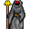

# { .sprite } Kazaul acolyte

| Stat | Value |
|---|---|
| Class | ? |
| HP | 0 |
| Max AP | 10 |
| Attack cost | 10 |
| Move cost | 10 |
| Damage | 0 |
| Attack chance | 0 |
| Block chance | 0 |
| Damage resistance | 0 |
| Critical skill | 0 |
| Critical multiplier | 0 |

## Found on

- [undertell_5](../maps/undertell_5.md)

## Quests

- [The fifth master](../quests/fifth_master.md): stages 85

??? quote "Dialogue (7 lines)"

    *What the dialogue says, exactly as in the game files. Lines are listed once; links jump to the line a choice leads to.*

    **`anavrin_resurrection_narrator_10`** [Dummy NPC](../monsters/none.md): “The Kazaul acolyte stands before Anavrin's shrine, its hands trembling as it unrolls the aged parchment. The air grows colder, shadows stretching across the floor.”

    - “[Wait for the ritual to begin.]” → [anavrin_resurrection_narrator_15](#d-anavrin_resurrection_narrator_15)

    **`anavrin_resurrection_narrator_15`** [Dummy NPC](../monsters/none.md): “The acolyte begins to read from the pages, the syllables harsh and alien.”

    - “[Wait for the ritual to begin.]” → [anavrin_resurrection_10](#d-anavrin_resurrection_10)

    **`anavrin_resurrection_10`** [Kazaul acolyte](../monsters/kazaul_acolyte.md): “Kazaul'te varmun iktel urul. Klatam ur turum Anavrin. Kazaul'thra mor'gul ven'taar. Uruk tharum vel Kazaul'ten mor. Kazaul hamat urul. Kazaul'the vurmor Anavrin urthaal!”

    - “[Keep listening.]” → [anavrin_resurrection_narrator_20](#d-anavrin_resurrection_narrator_20)

    **`anavrin_resurrection_narrator_20`** [Kazaul acolyte](../monsters/kazaul_acolyte.md): “Kulauil hamar urum Kazaul'te...Kazaul hamat urul...Klaatu ur turum Kazaul'te!”

    - Next → [anavrin_resurrection_narrator_30](#d-anavrin_resurrection_narrator_30)

    **`anavrin_resurrection_narrator_30`** [Dummy NPC](../monsters/none.md): “The parchment disintegrates in its grasp. The acolyte trembles violently, energy surging around the shrine.”

    - “[Watch what happens.]” → [anavrin_resurrection_20](#d-anavrin_resurrection_20)

    **`anavrin_resurrection_20`** [Dummy NPC](../monsters/none.md): “The acolyte exhales, its voice fading to a whisper. The silence...broken...Its body turns to dust, carried away by unseen breath as the air shudders with awakening power. So...the Fifth Master breathes once more.” — **effects:** spawns monsters on undertell_5, removes monsters from undertell_5

    - “What...what have I done?” → [anavrin_resurrection_30](#d-anavrin_resurrection_30)

    **`anavrin_resurrection_30`** [Anavrin](../monsters/anavrin.md): “You have undone silence itself, mortal. The rift shall open again, and through it we will see our dominion restored.” — **effects:** sets stage 85 of [The fifth master](../quests/fifth_master.md#stage-85)

    - “[Try to comprehend the revelation.]” → *conversation ends*

## Community notes

<small>Written by players, not generated from game data. **Observations**: what players notice in-game · **Lore**: the in-world story · **Trivia**: real-world facts, references, development history · **Theory / speculation**: unconfirmed ideas; may just be unfinished content</small>

### Observations

*Nothing here yet. Know something? [Add it](https://github.com/asdfghjkl628/Andor-s-Trail-Wikiiii/new/main/notes/monsters?filename=kazaul_acolyte.md&value=%23%23%20Observations%0A%0A%3C%21--%20what%20players%20notice%20in-game%20--%3E%0A%0A%23%23%20Lore%0A%0A%3C%21--%20the%20in-world%20story%20--%3E%0A%0A%23%23%20Trivia%0A%0A%3C%21--%20real-world%20facts%2C%20references%2C%20development%20history%20--%3E%0A%0A%23%23%20Theory%20/%20speculation%0A%0A%3C%21--%20unconfirmed%20ideas%3B%20may%20just%20be%20unfinished%20content%20--%3E%0A).*

### Lore

*Nothing here yet. Know something? [Add it](https://github.com/asdfghjkl628/Andor-s-Trail-Wikiiii/new/main/notes/monsters?filename=kazaul_acolyte.md&value=%23%23%20Observations%0A%0A%3C%21--%20what%20players%20notice%20in-game%20--%3E%0A%0A%23%23%20Lore%0A%0A%3C%21--%20the%20in-world%20story%20--%3E%0A%0A%23%23%20Trivia%0A%0A%3C%21--%20real-world%20facts%2C%20references%2C%20development%20history%20--%3E%0A%0A%23%23%20Theory%20/%20speculation%0A%0A%3C%21--%20unconfirmed%20ideas%3B%20may%20just%20be%20unfinished%20content%20--%3E%0A).*

### Trivia

*Nothing here yet. Know something? [Add it](https://github.com/asdfghjkl628/Andor-s-Trail-Wikiiii/new/main/notes/monsters?filename=kazaul_acolyte.md&value=%23%23%20Observations%0A%0A%3C%21--%20what%20players%20notice%20in-game%20--%3E%0A%0A%23%23%20Lore%0A%0A%3C%21--%20the%20in-world%20story%20--%3E%0A%0A%23%23%20Trivia%0A%0A%3C%21--%20real-world%20facts%2C%20references%2C%20development%20history%20--%3E%0A%0A%23%23%20Theory%20/%20speculation%0A%0A%3C%21--%20unconfirmed%20ideas%3B%20may%20just%20be%20unfinished%20content%20--%3E%0A).*

### Theory / speculation

*Nothing here yet. Know something? [Add it](https://github.com/asdfghjkl628/Andor-s-Trail-Wikiiii/new/main/notes/monsters?filename=kazaul_acolyte.md&value=%23%23%20Observations%0A%0A%3C%21--%20what%20players%20notice%20in-game%20--%3E%0A%0A%23%23%20Lore%0A%0A%3C%21--%20the%20in-world%20story%20--%3E%0A%0A%23%23%20Trivia%0A%0A%3C%21--%20real-world%20facts%2C%20references%2C%20development%20history%20--%3E%0A%0A%23%23%20Theory%20/%20speculation%0A%0A%3C%21--%20unconfirmed%20ideas%3B%20may%20just%20be%20unfinished%20content%20--%3E%0A).*

<small>Monster ID: `kazaul_acolyte` · Data from v0.8.18</small>
