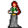

# { .sprite } Khorailla

| Stat | Value |
|---|---|
| Class | ? |
| HP | 0 |
| Max AP | 10 |
| Attack cost | 10 |
| Move cost | 10 |
| Damage | 0 |
| Attack chance | 0 |
| Block chance | 0 |
| Damage resistance | 0 |
| Critical skill | 0 |
| Critical multiplier | 0 |

## Shop stock

| Item | Chance | Qty |
|---|---|---|
| [Carrots](../items/carrots.md) | 100% | 5 to 12 |
| [Cheese](../items/cheese.md) | 100% | 5 to 12 |
| [Raw perch](../items/rawperch.md) | 100% | 5 to 12 |
| [Cooked perch](../items/cookperch.md) | 100% | 5 to 12 |
| [Cooked chicken leg](../items/chkn_leg.md) | 100% | 5 to 12 |
| [Sap of the charwood tree](../items/drink_charwood1.md) | 100% | 5 to 12 |
| [Concentrated charwood sap](../items/drink_charwood2.md) | 100% | 5 to 12 |

## Found on

- [tradehouse0](../maps/tradehouse0.md)

<small>Monster ID: `khorailla` · Data from v0.8.18</small>
