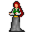

# { .sprite } Khorailla

**Where to find Khorailla:** [Prim, Tradehouse 0](#v-khorailla), [Prim, Tradehouse 0](#v-khorailla_cheddar)

<div class="infobox" markdown>

<p class="ib-img">{ .sprite }</p>

| | |
|---|---|
| **Type** | NPC (talk only; never fought) |
| **Role** | Shopkeeper |
| **Found in** | Prim |
| **Introduced** | v0.7.0 or earlier |

</div>

## Prim, Tradehouse 0 { #v-khorailla }

**Where:** Prim: [Tradehouse 0](../maps/tradehouse0.md#pin-npc-khorailla) · **Role:** Shopkeeper

### Shop stock

| Item | Chance | Qty |
|---|---|---|
| [Carrots](../items/carrots.md) | 100% | 5 to 12 |
| [Cheese](../items/cheese.md) | 100% | 5 to 12 |
| [Raw perch](../items/rawperch.md) | 100% | 5 to 12 |
| [Cooked perch](../items/cookperch.md) | 100% | 5 to 12 |
| [Cooked chicken leg](../items/chkn_leg.md) | 100% | 5 to 12 |
| [Sap of the charwood tree](../items/drink_charwood1.md) | 100% | 5 to 12 |
| [Concentrated charwood sap](../items/drink_charwood2.md) | 100% | 5 to 12 |

### Quests

- [Destined for great things](../quests/charwood1.md): stage 19

### Dialogue simulator

Set your quest stages and items, then talk to Khorailla. Same rules as the game: same checks, same options, same effects.

<div class="dlg-sim" data-src="../../assets/dialogue/khorailla.json" data-npc="Khorailla" markdown="0"><noscript>The simulator needs JavaScript. The full dialogue is listed below.</noscript></div>

<p class="verified">Rules verified against v0.8.18 game code (ConversationController.java) and dialogue data.</p>

??? quote "Dialogue (7 lines)"

    *Exactly as in the game files. Each line appears once; links jump to where a choice leads.*

    <span id="d-khorailla-khorailla"></span>**`khorailla`** *(silent check: the first matching branch below is taken)* — **effects:** sets stage 19 of [Destined for great things](../quests/charwood1.md#stage-19)

    - branch 1 *(if reached stage 50 of [Destined for great things](../quests/charwood1.md#stage-50))* → [khorailla1](#d-khorailla-khorailla1)
    - branch 2 → [khorailla3](#d-khorailla-khorailla3)

    <span id="d-khorailla-khorailla1"></span>**`khorailla1`** Khorailla: “Thank you so much for finding our missing people!”

    - “Do you have anything to trade?” → [khorailla2](#d-khorailla-khorailla2)
    - “Please sell me some of your famous Cheddar cheese.” *(if reached stage 30 of [Rare delicacies](../quests/guynmart_wise.md#stage-30))* → [khorailla_cheddar](#d-khorailla-khorailla_cheddar)
    - “You're welcome.” → *conversation ends*

    <span id="d-khorailla-khorailla3"></span>**`khorailla3`** Khorailla: “What ever will we do? Poor Ayell and Fayvara, I sure hope they're alright.”

    - “Do you have anything to trade?” → [khorailla5](#d-khorailla-khorailla5)
    - “What happened to them?” → [khorailla4](#d-khorailla-khorailla4)

    <span id="d-khorailla-khorailla2"></span>**`khorailla2`** Khorailla: “It's not much, but I have some food if you'd like.”

    - “Sure, let me see what you have.” → *shop opens*

    <span id="d-khorailla-khorailla_cheddar"></span>**`khorailla_cheddar`** [Khorailla](../monsters/khorailla.md#v-khorailla_cheddar): “Ah, you really know what's good.”

    - “I hope so. It was a long way to come.” → *shop opens*

    <span id="d-khorailla-khorailla5"></span>**`khorailla5`** Khorailla: “I'm sorry, I'm too distracted to help you right now.”

    - Next → [khorailla4](#d-khorailla-khorailla4)

    <span id="d-khorailla-khorailla4"></span>**`khorailla4`** Khorailla: “You should talk to Maevalia over there.”


### Version history

| Version | Change |
|---|---|
| [v0.7.0](../versions/0.7.0.md) | Present in v0.7.0 (earliest release tracked) |
| [v0.7.2](../versions/0.7.2.md) | Dialogue: 1 line added, 2 lines changed |

<p class="verified">Verified against v0.8.18 and every earlier release back to v0.7.0 (game data compared release by release).</p>


## Prim, Tradehouse 0 (2) { #v-khorailla_cheddar }

**Where:** Prim: [Tradehouse 0](../maps/tradehouse0.md)


### Version history

| Version | Change |
|---|---|
| [v0.7.2](../versions/0.7.2.md) | Added |

<p class="verified">Verified against v0.8.18 and every earlier release back to v0.7.0 (game data compared release by release).</p>


## Behind the scenes

*How the game data handles this character. Not needed for playing.*

**2 entries.** The game data defines 2 separate characters named Khorailla. The game makes a new entry whenever a character needs different behaviour (another conversation later in a quest, another place, other stats). Some are the same person at different points in the story; others just share a generic name. Here they differ in: conversation, loot or shop stock.

| Entry | Type | Section |
|---|---|---|
| `khorailla` | NPC | [Prim, Tradehouse 0](#v-khorailla) |
| `khorailla_cheddar` | Scenery | [Prim, Tradehouse 0](#v-khorailla_cheddar) |

- `khorailla_cheddar` has no conversation and no combat statistics. Other conversations use it as their speaker (the `switchToNPC` field), which is how its name and picture appear in dialogue. The game data also places it on Prim: [Tradehouse 0](../maps/tradehouse0.md).

??? info "Technical information: khorailla"

    | | |
    |---|---|
    | Entry ID | `khorailla` |
    | Type (wiki) | NPC |
    | Spawn group | `khorailla` |
    | Loot table | `shop_khorailla` |
    | Conversation | `khorailla` |
    | Faction | – |
    | Movement | – |
    | Icon | `monsters_ld1:221` |
    | Defined in | `res/raw/monsterlist_v070_npcs.json` |

    Raw data:

    ```json
    {
     "id": "khorailla",
     "name": "Khorailla",
     "iconID": "monsters_ld1:221",
     "phraseID": "khorailla",
     "droplistID": "shop_khorailla"
    }
    ```

??? info "Technical information: khorailla_cheddar"

    | | |
    |---|---|
    | Entry ID | `khorailla_cheddar` |
    | Type (wiki) | Scenery |
    | Spawn group | `khorailla_cheddar` |
    | Loot table | `shop_khorailla_cheddar` |
    | Conversation | – |
    | Faction | – |
    | Movement | – |
    | Icon | `monsters_ld1:221` |
    | Defined in | `res/raw/monsterlist_v070_npcs.json` |

    Raw data:

    ```json
    {
     "id": "khorailla_cheddar",
     "name": "Khorailla",
     "iconID": "monsters_ld1:221",
     "droplistID": "shop_khorailla_cheddar"
    }
    ```


## Community notes

<small>Written by players, not generated from game data. **Observations**: what players notice in-game · **Lore**: the in-world story · **Trivia**: real-world facts, references, development history · **Theory / speculation**: unconfirmed ideas; may just be unfinished content</small>

### Observations

*No notes yet. Contributions are welcome: [add a note](https://github.com/asdfghjkl628/Andor-s-Trail-Wikiiii/new/main/notes/monsters?filename=khorailla.md&value=%23%23%20Observations%0A%0A%3C%21--%20what%20players%20notice%20in-game%20--%3E%0A%0A%23%23%20Lore%0A%0A%3C%21--%20the%20in-world%20story%20--%3E%0A%0A%23%23%20Trivia%0A%0A%3C%21--%20real-world%20facts%2C%20references%2C%20development%20history%20--%3E%0A%0A%23%23%20Theory%20/%20speculation%0A%0A%3C%21--%20unconfirmed%20ideas%3B%20may%20just%20be%20unfinished%20content%20--%3E%0A).*

### Lore

*No notes yet. Contributions are welcome: [add a note](https://github.com/asdfghjkl628/Andor-s-Trail-Wikiiii/new/main/notes/monsters?filename=khorailla.md&value=%23%23%20Observations%0A%0A%3C%21--%20what%20players%20notice%20in-game%20--%3E%0A%0A%23%23%20Lore%0A%0A%3C%21--%20the%20in-world%20story%20--%3E%0A%0A%23%23%20Trivia%0A%0A%3C%21--%20real-world%20facts%2C%20references%2C%20development%20history%20--%3E%0A%0A%23%23%20Theory%20/%20speculation%0A%0A%3C%21--%20unconfirmed%20ideas%3B%20may%20just%20be%20unfinished%20content%20--%3E%0A).*

### Trivia

*No notes yet. Contributions are welcome: [add a note](https://github.com/asdfghjkl628/Andor-s-Trail-Wikiiii/new/main/notes/monsters?filename=khorailla.md&value=%23%23%20Observations%0A%0A%3C%21--%20what%20players%20notice%20in-game%20--%3E%0A%0A%23%23%20Lore%0A%0A%3C%21--%20the%20in-world%20story%20--%3E%0A%0A%23%23%20Trivia%0A%0A%3C%21--%20real-world%20facts%2C%20references%2C%20development%20history%20--%3E%0A%0A%23%23%20Theory%20/%20speculation%0A%0A%3C%21--%20unconfirmed%20ideas%3B%20may%20just%20be%20unfinished%20content%20--%3E%0A).*

### Theory / speculation

*No notes yet. Contributions are welcome: [add a note](https://github.com/asdfghjkl628/Andor-s-Trail-Wikiiii/new/main/notes/monsters?filename=khorailla.md&value=%23%23%20Observations%0A%0A%3C%21--%20what%20players%20notice%20in-game%20--%3E%0A%0A%23%23%20Lore%0A%0A%3C%21--%20the%20in-world%20story%20--%3E%0A%0A%23%23%20Trivia%0A%0A%3C%21--%20real-world%20facts%2C%20references%2C%20development%20history%20--%3E%0A%0A%23%23%20Theory%20/%20speculation%0A%0A%3C%21--%20unconfirmed%20ideas%3B%20may%20just%20be%20unfinished%20content%20--%3E%0A).*


<small>Data from v0.8.18</small>
