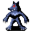

# { .sprite } Ancient kobold

| Stat | Value |
|---|---|
| Class | humanoid |
| HP | 70 |
| Max AP | 10 |
| Attack cost | 3 |
| Move cost | 5 |
| Damage | 1 to 10 |
| Attack chance | 140 |
| Block chance | 80 |
| Damage resistance | 12 |
| Critical skill | 10 |
| Critical multiplier | 2.0 |

## On hit

- **On target:** Confusion (magnitude 1, 3 rounds, 5% chance); Confusion (magnitude 1, 6 rounds, 1% chance)

## Drops

| Item | Chance | Qty |
|---|---|---|
| [Gold coins](../items/gold.md) | 5% | 1 to 5 |

## Found on

- [guynmart_wood_18](../maps/guynmart_wood_18.md)
- [guynmart_wood_18b](../maps/guynmart_wood_18b.md)

<small>Monster ID: `kobold3` · Data from v0.8.18</small>
