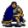

# { .sprite } Kotheses

| Stat | Value |
|---|---|
| Class | undead |
| HP | 180 |
| Max AP | 10 |
| Attack cost | 3 |
| Move cost | 5 |
| Damage | 3 to 20 |
| Attack chance | 90 |
| Block chance | 75 |
| Damage resistance | 2 |
| Critical skill | 15 |
| Critical multiplier | 1.5 |

## On hit

- **Heal HP:** 2

## Drops

| Item | Chance | Qty |
|---|---|---|
| [Gold coins](../items/gold.md) | 100% | 10 to 20 |
| [Obsidian dagger](../items/obsidian_dagger.md) | 100% | 1 |
| [Bone](../items/bone.md) | 80% | 1 to 2 |
| [Oegyth crystal](../items/oegyth.md) | 100% | 1 |

## Found on

- [laerothprison7](../maps/laerothprison7.md)

<small>Monster ID: `kotheses` · Data from v0.8.18</small>
