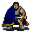

# { .sprite } Kotheses

**Where to find Kotheses:** [Laerothprison 7](../maps/laerothprison7.md#pin-npc-kotheses)

<div class="infobox" markdown>

<p class="ib-img">{ .sprite }</p>

| | |
|---|---|
| **Type** | NPC/Enemy (can be spoken to, but can also be fought) |
| **Found in** | Laerothprison 7 |
| **Class** | Undead |
| **HP** | 180 |
| **XP when defeated** | 313 |
| **Entry ID** | `kotheses` |
| **Introduced** | [v0.8.11](../versions/0.8.11.md) |

</div>

!!! warning "Can be fought"
    This entry can be talked to, but it can also become an opponent: a conversation with this character can end in combat (a dialogue branch leads to a fight).

## Combat statistics

| Statistic | Value |
|---|---|
| Class | Undead |
| HP | 180 |
| XP when defeated | 313 |
| Damage | 3 to 20 |
| Attack chance | 90 |
| Block chance | 75 |
| Damage resistance | 2 |
| Max AP | 10 |
| Attack cost | 3 AP |
| Attacks per turn | 3 |
| Move cost | 5 AP |
| Critical skill | 15 |
| Critical multiplier | 1.5 |
| Critical hit chance | 12% |

**On hit:** Heal HP: 2

**When hit:** Heal HP: 2; increaseAttackerCurrentHP: -2


<p class="verified">Verified against v0.8.18 monster data and game code (`MonsterTypeParser.java`).</p>

## Drops

| Item | Chance | Qty |
|---|---|---|
| [Gold coins](../items/gold.md) | 100% | 10 to 20 |
| [Obsidian dagger](../items/obsidian_dagger.md) | 100% | 1 |
| [Bone](../items/bone.md) | 80% | 1 to 2 |
| [Oegyth crystal](../items/oegyth.md) | 100% | 1 |

## Locations

| Map | Region | Up to | Notes |
|---|---|---|---|
| [Laerothprison 7](../maps/laerothprison7.md) | – | 1 | – |

## Quests that count defeats

- A conversation with [Laeroth prisoner](../monsters/lae_prisoner.md#v-lae_prisoner4) ([Laerothprison 4](../maps/laerothprison4.md)), [Laeroth prisoner](../monsters/lae_prisoner.md#v-lae_prisoner4a) checks that this enemy has been defeated.
- [Shadow of the torturer](../quests/lae_torturer.md#stage-80) with [Laeroth prisoner](../monsters/lae_prisoner.md#v-lae_prisoner4) ([Laerothprison 4](../maps/laerothprison4.md)), [Laeroth prisoner](../monsters/lae_prisoner.md#v-lae_prisoner4a) checks that this enemy has been defeated.

## Quests

- [Search for Andor](../quests/andor.md): stage 120
- [Shadow of the torturer](../quests/lae_torturer.md): stages 25, 30, 35, 40, 50, 60, 120

## Dialogue simulator

Set your quest stages and items, then talk to Kotheses. Same rules as the game: same checks, same options, same effects.

<div class="dlg-sim" data-src="../../assets/dialogue/lae_torturer.json" data-npc="Kotheses" markdown="0"><noscript>The simulator needs JavaScript. The full dialogue is listed below.</noscript></div>

<p class="verified">Rules verified against v0.8.18 game code (ConversationController.java) and dialogue data.</p>

??? quote "Dialogue (40 lines)"

    *Exactly as in the game files. Each line appears once; links jump to where a choice leads.*

    <span id="d-lae_torturer"></span>**`lae_torturer`** *(silent check: the first matching branch below is taken)*

    - branch 1 *(if NOT killed 1× [Dark watch](../monsters/lae_demon4.md#v-lae_demon9); NOT killed 1× [Dark watch](../monsters/lae_demon4.md#v-lae_demon7); NOT killed 1× [Dark watch](../monsters/lae_demon4.md#v-lae_demon5); NOT killed 1× [Dark watch](../monsters/lae_demon4.md))* → [lae_torturer_5](#d-lae_torturer_5)
    - branch 2 *(if reached stage 50 of [Shadow of the torturer](../quests/lae_torturer.md#stage-50))* → [lae_torturer_5](#d-lae_torturer_5)
    - branch 3 *(if NOT reached stage 30 of [Shadow of the torturer](../quests/lae_torturer.md#stage-30))* → [lae_torturer_5](#d-lae_torturer_5)
    - branch 4 → [lae_torturer_2](#d-lae_torturer_2)

    <span id="d-lae_torturer_5"></span>**`lae_torturer_5`** *(silent check: the first matching branch below is taken)*

    - branch 1 *(if reached stage 110 of [Shadow of the torturer](../quests/lae_torturer.md#stage-110))* → [lae_torturer_110](#d-lae_torturer_110)
    - branch 2 *(if reached stage 100 of [Shadow of the torturer](../quests/lae_torturer.md#stage-100))* → [lae_torturer_100](#d-lae_torturer_100)
    - branch 3 → [lae_torturer_10](#d-lae_torturer_10)

    <span id="d-lae_torturer_2"></span>**`lae_torturer_2`** Kotheses: “Why do you kill my precious demons?! I told you to stay here beside me!” — **effects:** sets stage 50 of [Shadow of the torturer](../quests/lae_torturer.md#stage-50)

    - “They have attacked me!” → [lae_torturer_5](#d-lae_torturer_5)

    <span id="d-lae_torturer_110"></span>**`lae_torturer_110`** Kotheses: “I see it in your eyes - you want to leave too. Like your brother.” — **effects:** sets stage 120 of [Shadow of the torturer](../quests/lae_torturer.md#stage-120)

    - “Yes. Thank you for your lessons.” → *conversation ends*

    <span id="d-lae_torturer_100"></span>**`lae_torturer_100`** Kotheses: “Now you can talk to the demons. To all of them. Tell them what they have to do.”

    - “All of them?” *(if reached stage 50 of [Shadow of the torturer](../quests/lae_torturer.md#stage-50))* → [lae_torturer_101](#d-lae_torturer_101)
    - “OK.” *(if NOT reached stage 50 of [Shadow of the torturer](../quests/lae_torturer.md#stage-50))* → [lae_torturer_102](#d-lae_torturer_102)

    <span id="d-lae_torturer_10"></span>**`lae_torturer_10`** Kotheses: “Hello, child.”

    - Next → [lae_torturer_10a](#d-lae_torturer_10a)

    <span id="d-lae_torturer_101"></span>**`lae_torturer_101`** Kotheses: “To all of those that you have left alive. But please, stay close to me this time.”


    <span id="d-lae_torturer_102"></span>**`lae_torturer_102`** Kotheses: “But stay close to me.”


    <span id="d-lae_torturer_10a"></span>**`lae_torturer_10a`** Kotheses: “Would you like to learn the trade of a torturer?” — **effects:** sets stage 25 of [Shadow of the torturer](../quests/lae_torturer.md#stage-25), removes monsters from laerothprison4, removes monsters from laerothprison4, removes monsters from laerothprison4, spawns monsters on laerothprison4, spawns monsters on laerothprison4

    - “Tell me more about it.” *(if NOT reached stage 60 of [Shadow of the torturer](../quests/lae_torturer.md#stage-60))* → [lae_torturer_11](#d-lae_torturer_11)
    - “I'm sorry, I don't have time for that. I have to look for my brother. Do you perhaps know where he is? He looks…” → [lae_torturer_12](#d-lae_torturer_12)
    - “You stole the life force of your captives.” → [lae_torturer_18](#d-lae_torturer_18)
    - “Very gladly. I always like to learn new things.” *(if NOT reached stage 60 of [Shadow of the torturer](../quests/lae_torturer.md#stage-60))* → [lae_torturer_30](#d-lae_torturer_30)

    <span id="d-lae_torturer_11"></span>**`lae_torturer_11`** Kotheses: “I seek a young apprentice to train in our essential duties.”

    - Next → [lae_torturer_11a](#d-lae_torturer_11a)

    <span id="d-lae_torturer_12"></span>**`lae_torturer_12`** Kotheses: “No, I don't know where Andor is now.”

    - “Oh, how do you know his name?” → [lae_torturer_14](#d-lae_torturer_14)

    <span id="d-lae_torturer_18"></span>**`lae_torturer_18`** Kotheses: “Yes. So?”

    - “Nothing.” → [lae_torturer_20](#d-lae_torturer_20)

    <span id="d-lae_torturer_30"></span>**`lae_torturer_30`** Kotheses: “OK, then let's get started. This is a very important job, you know?” — **effects:** sets stage 30 of [Shadow of the torturer](../quests/lae_torturer.md#stage-30)

    - “Why?” → [lae_torturer_32](#d-lae_torturer_32)

    <span id="d-lae_torturer_11a"></span>**`lae_torturer_11a`** Kotheses: “You will start by observing and assisting me during interrogations, learning the delicate balance of inflicting pain.”

    - Next → [lae_torturer_11b](#d-lae_torturer_11b)

    <span id="d-lae_torturer_14"></span>**`lae_torturer_14`** Kotheses: “Well, he was here a while ago and was shown a few tricks.”

    - “So he was here too?” → [lae_torturer_16](#d-lae_torturer_16)

    <span id="d-lae_torturer_20"></span>**`lae_torturer_20`** Kotheses: “You are sure you don't want to learn the art of a torturer?”

    - “That is no job for me.” *(if NOT reached stage 30 of [Shadow of the torturer](../quests/lae_torturer.md#stage-30))* → [lae_torturer_60](#d-lae_torturer_60)
    - “Well, I could try at least.” *(if NOT reached stage 60 of [Shadow of the torturer](../quests/lae_torturer.md#stage-60))* → [lae_torturer_30](#d-lae_torturer_30)

    <span id="d-lae_torturer_32"></span>**`lae_torturer_32`** Kotheses: “You get people to tell you the truth you want to hear.”

    - “Oh, OK.” → [lae_torturer_34](#d-lae_torturer_34)

    <span id="d-lae_torturer_11b"></span>**`lae_torturer_11b`** Kotheses: “While keeping the prisoner alive, of course.”

    - “Oh, makes sense.” → [lae_torturer_11c](#d-lae_torturer_11c)

    <span id="d-lae_torturer_16"></span>**`lae_torturer_16`** Kotheses: “Andor was a very eager student. It's a shame he didn't stay.” — **effects:** sets stage 120 of [Search for Andor](../quests/andor.md#stage-120)

    - Next → [lae_torturer_20](#d-lae_torturer_20)

    <span id="d-lae_torturer_60"></span>**`lae_torturer_60`** Kotheses: “What a pity. At least let me warn you about the prisoners above.” — **effects:** sets stage 60 of [Shadow of the torturer](../quests/lae_torturer.md#stage-60)

    - “What is with them?” → [lae_torturer_62](#d-lae_torturer_62)

    <span id="d-lae_torturer_34"></span>**`lae_torturer_34`** Kotheses: “Like these dangerous captives in the cells above. They all confessed. Luckily they are in safe custody.”

    - “Eh ...” → [lae_torturer_36](#d-lae_torturer_36)

    <span id="d-lae_torturer_11c"></span>**`lae_torturer_11c`** Kotheses: “Your education will include mastering various torture devices and understanding their effects.”

    - Next → [lae_torturer_11d](#d-lae_torturer_11d)

    <span id="d-lae_torturer_62"></span>**`lae_torturer_62`** Kotheses: “They are devious. They are highly dangerous.”

    - Next → [lae_torturer_64](#d-lae_torturer_64)

    <span id="d-lae_torturer_36"></span>**`lae_torturer_36`** Kotheses: “What?”

    - “I opened the cells and released them.” → [lae_torturer_40](#d-lae_torturer_40)

    <span id="d-lae_torturer_11d"></span>**`lae_torturer_11d`** Kotheses: “Over the years, you will gradually take on more responsibility, eventually conducting interrogations on your own once you have proven your skill and steadiness.”

    - “Interrogations you call it?” → [lae_torturer_11e](#d-lae_torturer_11e)

    <span id="d-lae_torturer_64"></span>**`lae_torturer_64`** Kotheses: “They must be imprisoned for all reasons.”

    - “Why?” → [lae_torturer_66](#d-lae_torturer_66)

    <span id="d-lae_torturer_40"></span>**`lae_torturer_40`** Kotheses: “Not again! You need to wake up the Demon Guard and send them upstairs. That way you will quickly get the problem under control.”

    - “Demons? That doesn't sound safe.” → [lae_torturer_42](#d-lae_torturer_42)

    <span id="d-lae_torturer_11e"></span>**`lae_torturer_11e`** Kotheses: “Sure. We only want the truth. Nothing more. It is a very prestigious work.”

    - “If you say so.” → [lae_torturer_10a](#d-lae_torturer_10a)
    - “Then why do you wear a mask at public executions?” → [lae_torturer_11f](#d-lae_torturer_11f)

    <span id="d-lae_torturer_66"></span>**`lae_torturer_66`** Kotheses: “Their lies influence you to have mercy. But turn your back to them they pierce you cruelly.”

    - Next → [lae_torturer_70](#d-lae_torturer_70)

    <span id="d-lae_torturer_42"></span>**`lae_torturer_42`** Kotheses: “You screwed up, you have to fix it.”

    - “Sigh.” *(if NOT reached stage 35 of [Shadow of the torturer](../quests/lae_torturer.md#stage-35))* → [lae_torturer_44](#d-lae_torturer_44)
    - “Sigh. I know.” *(if reached stage 35 of [Shadow of the torturer](../quests/lae_torturer.md#stage-35))* → [lae_torturer_45](#d-lae_torturer_45)

    <span id="d-lae_torturer_11f"></span>**`lae_torturer_11f`** Kotheses: “Enough questions.”

    - Next → [lae_torturer_10a](#d-lae_torturer_10a)

    <span id="d-lae_torturer_70"></span>**`lae_torturer_70`** Kotheses: “Believe it or not.”

    - “Not.” → [lae_torturer_74](#d-lae_torturer_74)

    <span id="d-lae_torturer_44"></span>**`lae_torturer_44`** Kotheses: “Here take this Oegyth crystal.” — **effects:** gives 1× [Oegyth crystal](../items/oegyth.md), sets stage 35 of [Shadow of the torturer](../quests/lae_torturer.md#stage-35)

    - Next → [lae_torturer_45](#d-lae_torturer_45)

    <span id="d-lae_torturer_45"></span>**`lae_torturer_45`** Kotheses: “Take this precious Oegyth crystal to that small room to the south and continue through the corridor.”

    - Next → [lae_torturer_46](#d-lae_torturer_46)

    <span id="d-lae_torturer_74"></span>**`lae_torturer_74`** Kotheses: “At least I play fair. I do not come from ambush, but rather announce my attack.”

    - “OK ...” → [lae_torturer_76](#d-lae_torturer_76)

    <span id="d-lae_torturer_46"></span>**`lae_torturer_46`** Kotheses: “Then throw the crystal with all your might into the dark abyss.”

    - “What?!” → [lae_torturer_48](#d-lae_torturer_48)

    <span id="d-lae_torturer_76"></span>**`lae_torturer_76`** Kotheses: “... which is now!” — **effects:** faction “lae_torturer” set to -100

    - “How gross.” → *fight starts*

    <span id="d-lae_torturer_48"></span>**`lae_torturer_48`** Kotheses: “Do it. Then run for your life back to me so that I can protect you from them.” — **effects:** sets stage 40 of [Shadow of the torturer](../quests/lae_torturer.md#stage-40)

    - Next → [lae_torturer_50](#d-lae_torturer_50)

    <span id="d-lae_torturer_50"></span>**`lae_torturer_50`** Kotheses: “You hear me? Don't wait for the demons. They are deadly.”

    - Next → [lae_torturer_52](#d-lae_torturer_52)

    <span id="d-lae_torturer_52"></span>**`lae_torturer_52`** Kotheses: “Now. Move.”


## Version history

| Version | Change |
|---|---|
| [v0.8.11](../versions/0.8.11.md) | Added<br>Dialogue: 40 lines added |
| [v0.8.12.1](../versions/0.8.12.1.md) | Dialogue: 2 lines changed<br>· text: “Okay, then let's get started. This is a very important job, you know?” → “OK, then let's get started. This is a very important job, you know?”<br>· text: “Sure. We only want want the thruth. Nothing more. It is a very presti…” → “Sure. We only want the truth. Nothing more. It is a very prestigious …” |

<p class="verified">Verified against v0.8.18 and every earlier release back to v0.7.0 (game data compared release by release).</p>


??? info "Technical information"

    | | |
    |---|---|
    | Entry ID | `kotheses` |
    | Spawn group | `kotheses` |
    | Loot table | `kotheses` |
    | Conversation | `lae_torturer` |
    | Faction | `lae_torturer` |
    | Movement | – |
    | Icon | `monsters_tometik7:6` |
    | Defined in | `res/raw/monsterlist_laeroth.json` |

    Raw data:

    ```json
    {
     "id": "kotheses",
     "name": "Kotheses",
     "iconID": "monsters_tometik7:6",
     "maxHP": 180,
     "moveCost": 5,
     "unique": 1,
     "monsterClass": "undead",
     "attackDamage": {
      "min": 3,
      "max": 20
     },
     "faction": "lae_torturer",
     "phraseID": "lae_torturer",
     "droplistID": "kotheses",
     "attackCost": 3,
     "attackChance": 90,
     "criticalSkill": 15,
     "criticalMultiplier": 1.5,
     "blockChance": 75,
     "damageResistance": 2,
     "hitEffect": {
      "increaseCurrentHP": {
       "min": 2,
       "max": 2
      }
     },
     "hitReceivedEffect": {
      "increaseCurrentHP": {
       "min": 2,
       "max": 2
      },
      "increaseAttackerCurrentHP": {
       "min": -2,
       "max": -2
      }
     }
    }
    ```


??? info "How the XP value is calculated"

    The game computes each enemy's experience value when it loads the data (`MonsterTypeParser.java`):

    XP = ⌈(attacks per turn × attack chance × average damage × (1 + critical skill × critical multiplier) × 3 + HP × (1 + block chance) + 9 × damage resistance) × 0.7⌉

    Percentages are used as fractions (e.g. 60% = 0.6). Enemies whose attacks inflict a condition are worth 50 XP more. The More Exp skill adds a percentage on top.


## Community notes

<small>Written by players, not generated from game data. **Observations**: what players notice in-game · **Lore**: the in-world story · **Trivia**: real-world facts, references, development history · **Theory / speculation**: unconfirmed ideas; may just be unfinished content</small>

### Observations

*No notes yet. Contributions are welcome: [add a note](https://github.com/asdfghjkl628/Andor-s-Trail-Wikiiii/new/main/notes/monsters?filename=kotheses.md&value=%23%23%20Observations%0A%0A%3C%21--%20what%20players%20notice%20in-game%20--%3E%0A%0A%23%23%20Lore%0A%0A%3C%21--%20the%20in-world%20story%20--%3E%0A%0A%23%23%20Trivia%0A%0A%3C%21--%20real-world%20facts%2C%20references%2C%20development%20history%20--%3E%0A%0A%23%23%20Theory%20/%20speculation%0A%0A%3C%21--%20unconfirmed%20ideas%3B%20may%20just%20be%20unfinished%20content%20--%3E%0A).*

### Lore

*No notes yet. Contributions are welcome: [add a note](https://github.com/asdfghjkl628/Andor-s-Trail-Wikiiii/new/main/notes/monsters?filename=kotheses.md&value=%23%23%20Observations%0A%0A%3C%21--%20what%20players%20notice%20in-game%20--%3E%0A%0A%23%23%20Lore%0A%0A%3C%21--%20the%20in-world%20story%20--%3E%0A%0A%23%23%20Trivia%0A%0A%3C%21--%20real-world%20facts%2C%20references%2C%20development%20history%20--%3E%0A%0A%23%23%20Theory%20/%20speculation%0A%0A%3C%21--%20unconfirmed%20ideas%3B%20may%20just%20be%20unfinished%20content%20--%3E%0A).*

### Trivia

*No notes yet. Contributions are welcome: [add a note](https://github.com/asdfghjkl628/Andor-s-Trail-Wikiiii/new/main/notes/monsters?filename=kotheses.md&value=%23%23%20Observations%0A%0A%3C%21--%20what%20players%20notice%20in-game%20--%3E%0A%0A%23%23%20Lore%0A%0A%3C%21--%20the%20in-world%20story%20--%3E%0A%0A%23%23%20Trivia%0A%0A%3C%21--%20real-world%20facts%2C%20references%2C%20development%20history%20--%3E%0A%0A%23%23%20Theory%20/%20speculation%0A%0A%3C%21--%20unconfirmed%20ideas%3B%20may%20just%20be%20unfinished%20content%20--%3E%0A).*

### Theory / speculation

*No notes yet. Contributions are welcome: [add a note](https://github.com/asdfghjkl628/Andor-s-Trail-Wikiiii/new/main/notes/monsters?filename=kotheses.md&value=%23%23%20Observations%0A%0A%3C%21--%20what%20players%20notice%20in-game%20--%3E%0A%0A%23%23%20Lore%0A%0A%3C%21--%20the%20in-world%20story%20--%3E%0A%0A%23%23%20Trivia%0A%0A%3C%21--%20real-world%20facts%2C%20references%2C%20development%20history%20--%3E%0A%0A%23%23%20Theory%20/%20speculation%0A%0A%3C%21--%20unconfirmed%20ideas%3B%20may%20just%20be%20unfinished%20content%20--%3E%0A).*


<small>Data from v0.8.18</small>
