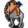

# { .sprite } Orion, the centaur

**Where to find Orion, the centaur:** [Island 1](../maps/island1.md#pin-npc-lae_centaur1)

<div class="infobox" markdown>

<p class="ib-img">{ .sprite }</p>

| | |
|---|---|
| **Type** | NPC (talk only; never fought) |
| **Role** | Starts [Not Pony Island](../quests/lae_centaurs.md) |
| **Found in** | Island 1 |
| **Introduced** | [v0.8.11](../versions/0.8.11.md) |

</div>

## Quests

- [Not Pony Island](../quests/lae_centaurs.md): stage 10
- [Laeroth story flags (hidden flag)](../quests/laeroth_nondisplay.md): stage 211

## Dialogue simulator

Set your quest stages and items, then talk to Orion, the centaur. Same rules as the game: same checks, same options, same effects.

<div class="dlg-sim" data-src="../../assets/dialogue/lae_centaur1.json" data-npc="Orion, the centaur" markdown="0"><noscript>The simulator needs JavaScript. The full dialogue is listed below.</noscript></div>

<p class="verified">Rules verified against v0.8.18 game code (ConversationController.java) and dialogue data.</p>

??? quote "Dialogue (13 lines)"

    *Exactly as in the game files. Each line appears once; links jump to where a choice leads.*

    <span id="d-lae_centaur1"></span>**`lae_centaur1`** *(silent check: the first matching branch below is taken)*

    - branch 1 *(if reached stage 30 of [Not Pony Island](../quests/lae_centaurs.md#stage-30))* → [lae_centaur](#d-lae_centaur)
    - branch 2 *(if reached stage 211 of [Laeroth story flags (hidden flag)](../quests/laeroth_nondisplay.md#stage-211))* → [lae_centaur1_20](#d-lae_centaur1_20)
    - branch 3 → [lae_centaur1_1](#d-lae_centaur1_1)

    <span id="d-lae_centaur"></span>**`lae_centaur`** *(silent check: the first matching branch below is taken)*

    - branch 1 *(if reached stage 300 of [Not Pony Island](../quests/lae_centaurs.md#stage-300))* → [lae_centaur8](#d-lae_centaur8)
    - branch 2 *(if reached stage 30 of [Not Pony Island](../quests/lae_centaurs.md#stage-30))* → [lae_centaur_20](#d-lae_centaur_20)
    - branch 3 → [lae_centaur_10](#d-lae_centaur_10)

    <span id="d-lae_centaur1_20"></span>**`lae_centaur1_20`** Orion, the centaur: “You are not wanted here.”


    <span id="d-lae_centaur1_1"></span>**`lae_centaur1_1`** Orion, the centaur: “You there, human.”

    - “What do you want?” → [lae_centaur1_2](#d-lae_centaur1_2)

    <span id="d-lae_centaur8"></span>**`lae_centaur8`** Orion, the centaur: “The stars are bright tonight.”


    <span id="d-lae_centaur_20"></span>**`lae_centaur_20`** Orion, the centaur: “We have an eye on you.”


    <span id="d-lae_centaur_10"></span>**`lae_centaur_10`** Orion, the centaur: “You are not wanted here.”


    <span id="d-lae_centaur1_2"></span>**`lae_centaur1_2`** Orion, the centaur: “Our leader wants to see you. Now.”

    - “Why?” → [lae_centaur1_3](#d-lae_centaur1_3)
    - “Who is your leader?” → [lae_centaur1_3](#d-lae_centaur1_3)

    <span id="d-lae_centaur1_3"></span>**`lae_centaur1_3`** Orion, the centaur: “Don't ask questions. Just do as you're told.”

    - “Fine. Lead the way.” → [lae_centaur1_5](#d-lae_centaur1_5)
    - “And if I refuse?” → [lae_centaur1_4](#d-lae_centaur1_4)

    <span id="d-lae_centaur1_5"></span>**`lae_centaur1_5`** Orion, the centaur: “I have better things to do than play tour guide to useless intruders.”

    - “Then just tell me where he is.” → [lae_centaur1_8](#d-lae_centaur1_8)

    <span id="d-lae_centaur1_4"></span>**`lae_centaur1_4`** Orion, the centaur: “Then you'll regret it. Trust me, you don't want to anger our leader.”

    - “It's okay, calm down. Where is this leader?” → [lae_centaur1_8](#d-lae_centaur1_8)

    <span id="d-lae_centaur1_8"></span>**`lae_centaur1_8`** Orion, the centaur: “Thalos, our wise guide, is currently in the northeast of the island.” — **effects:** sets stage 10 of [Not Pony Island](../quests/lae_centaurs.md#stage-10), sets stage 211 of [Laeroth story flags (hidden flag)](../quests/laeroth_nondisplay.md#stage-211)

    - “Fine, I'll go see him.” → [lae_centaur1_10](#d-lae_centaur1_10)
    - “Hopefully this Thalos will be a little more accommodating.” → [lae_centaur1_10](#d-lae_centaur1_10)

    <span id="d-lae_centaur1_10"></span>**`lae_centaur1_10`** Orion, the centaur: “Hurry up now. And don't try anything stupid.”


## Version history

| Version | Change |
|---|---|
| [v0.8.11](../versions/0.8.11.md) | Added<br>Dialogue: 13 lines added |

<p class="verified">Verified against v0.8.18 and every earlier release back to v0.7.0 (game data compared release by release).</p>


## Behind the scenes

*How the game data handles this character. Not needed for playing.*

??? info "Technical information"

    | | |
    |---|---|
    | Entry ID | `lae_centaur1` |
    | Type (wiki) | NPC |
    | Spawn group | `lae_centaur1` |
    | Loot table | – |
    | Conversation | `lae_centaur1` |
    | Faction | – |
    | Movement | – |
    | Icon | `monsters_ld1:42` |
    | Defined in | `res/raw/monsterlist_laeroth.json` |

    Raw data:

    ```json
    {
     "id": "lae_centaur1",
     "name": "Orion, the centaur",
     "iconID": "monsters_ld1:42",
     "monsterClass": "humanoid",
     "phraseID": "lae_centaur1"
    }
    ```


## Community notes

<small>Written by players, not generated from game data. **Observations**: what players notice in-game · **Lore**: the in-world story · **Trivia**: real-world facts, references, development history · **Theory / speculation**: unconfirmed ideas; may just be unfinished content</small>

### Observations

*No notes yet. Contributions are welcome: [add a note](https://github.com/asdfghjkl628/Andor-s-Trail-Wikiiii/new/main/notes/monsters?filename=lae_centaur1.md&value=%23%23%20Observations%0A%0A%3C%21--%20what%20players%20notice%20in-game%20--%3E%0A%0A%23%23%20Lore%0A%0A%3C%21--%20the%20in-world%20story%20--%3E%0A%0A%23%23%20Trivia%0A%0A%3C%21--%20real-world%20facts%2C%20references%2C%20development%20history%20--%3E%0A%0A%23%23%20Theory%20/%20speculation%0A%0A%3C%21--%20unconfirmed%20ideas%3B%20may%20just%20be%20unfinished%20content%20--%3E%0A).*

### Lore

*No notes yet. Contributions are welcome: [add a note](https://github.com/asdfghjkl628/Andor-s-Trail-Wikiiii/new/main/notes/monsters?filename=lae_centaur1.md&value=%23%23%20Observations%0A%0A%3C%21--%20what%20players%20notice%20in-game%20--%3E%0A%0A%23%23%20Lore%0A%0A%3C%21--%20the%20in-world%20story%20--%3E%0A%0A%23%23%20Trivia%0A%0A%3C%21--%20real-world%20facts%2C%20references%2C%20development%20history%20--%3E%0A%0A%23%23%20Theory%20/%20speculation%0A%0A%3C%21--%20unconfirmed%20ideas%3B%20may%20just%20be%20unfinished%20content%20--%3E%0A).*

### Trivia

*No notes yet. Contributions are welcome: [add a note](https://github.com/asdfghjkl628/Andor-s-Trail-Wikiiii/new/main/notes/monsters?filename=lae_centaur1.md&value=%23%23%20Observations%0A%0A%3C%21--%20what%20players%20notice%20in-game%20--%3E%0A%0A%23%23%20Lore%0A%0A%3C%21--%20the%20in-world%20story%20--%3E%0A%0A%23%23%20Trivia%0A%0A%3C%21--%20real-world%20facts%2C%20references%2C%20development%20history%20--%3E%0A%0A%23%23%20Theory%20/%20speculation%0A%0A%3C%21--%20unconfirmed%20ideas%3B%20may%20just%20be%20unfinished%20content%20--%3E%0A).*

### Theory / speculation

*No notes yet. Contributions are welcome: [add a note](https://github.com/asdfghjkl628/Andor-s-Trail-Wikiiii/new/main/notes/monsters?filename=lae_centaur1.md&value=%23%23%20Observations%0A%0A%3C%21--%20what%20players%20notice%20in-game%20--%3E%0A%0A%23%23%20Lore%0A%0A%3C%21--%20the%20in-world%20story%20--%3E%0A%0A%23%23%20Trivia%0A%0A%3C%21--%20real-world%20facts%2C%20references%2C%20development%20history%20--%3E%0A%0A%23%23%20Theory%20/%20speculation%0A%0A%3C%21--%20unconfirmed%20ideas%3B%20may%20just%20be%20unfinished%20content%20--%3E%0A).*


<small>Data from v0.8.18</small>
