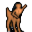

# { .sprite } Thalos, the centaur

**Where to find Thalos, the centaur:** [Island 2](../maps/island2.md#pin-npc-lae_centaur9)

<div class="infobox" markdown>

<p class="ib-img"></p>

| | |
|---|---|
| **Type** | NPC (talk only; never fought) |
| **Found in** | Island 2 |
| **Introduced** | [v0.8.11](../versions/0.8.11.md) |

</div>

## Quests

- [Not Pony Island](../quests/lae_centaurs.md): stages 20, 30, 300, 310

## Dialogue simulator

Talk to Thalos, the centaur as you would in the game. When the conversation depends on your progress (a quest, an item, a dice roll…), the simulator asks you. Try another answer with **Undo**.

<div class="dlg-sim" data-src="../../assets/dialogue/lae_centaur9.json" data-npc="Thalos, the centaur" markdown="0"><noscript>The simulator needs JavaScript. The full dialogue is listed below.</noscript></div>

<p class="verified">Follows the game's own conversation rules (v0.8.18).</p>

??? quote "Dialogue (30 lines)"

    *Exactly as in the game files. Each line appears once; links jump to where a choice leads.*

    <span id="d-lae_centaur9"></span>**`lae_centaur9`** *(silent check: the first matching branch below is taken)*

    - branch 1 *(if reached stage 310 of [Not Pony Island](../quests/lae_centaurs.md#stage-310))* → [lae_centaur9_310](#d-lae_centaur9_310)
    - branch 2 *(if reached stage 300 of [Not Pony Island](../quests/lae_centaurs.md#stage-300))* → [lae_centaur9_302](#d-lae_centaur9_302)
    - branch 3 *(if reached stage 12 of [Final cave (hidden flag)](../quests/final_cave.md#stage-12))* → [lae_centaur9_100](#d-lae_centaur9_100)
    - branch 4 *(if reached stage 30 of [Not Pony Island](../quests/lae_centaurs.md#stage-30))* → [lae_centaur9_30](#d-lae_centaur9_30)
    - branch 5 → [lae_centaur9_1](#d-lae_centaur9_1)

    <span id="d-lae_centaur9_310"></span>**`lae_centaur9_310`** Thalos, the centaur: “You have proven yourself to be more than just another ignorant human.” — **effects:** sets stage 310 of [Not Pony Island](../quests/lae_centaurs.md#stage-310)

    - “Very good.” → [lae_centaur9_390](#d-lae_centaur9_390)
    - “At last.” → [lae_centaur9_390](#d-lae_centaur9_390)

    <span id="d-lae_centaur9_302"></span>**`lae_centaur9_302`** Thalos, the centaur: “That foul creature is no more. A great burden is lifted from my heart.” — **effects:** sets stage 300 of [Not Pony Island](../quests/lae_centaurs.md#stage-300)

    - Next → [lae_centaur9_310](#d-lae_centaur9_310)

    <span id="d-lae_centaur9_100"></span>**`lae_centaur9_100`** Thalos, the centaur: “What news do you bring?”

    - “I met acquaintances in the entrance to the cave.” *(if NOT reached stage 130 of [Not Pony Island](../quests/lae_centaurs.md#stage-130); reached stage 120 of [Not Pony Island](../quests/lae_centaurs.md#stage-120))* → [lae_centaur9_110](#d-lae_centaur9_110)
    - “I have found my brother Andor, locked in a room down in that cave.” *(if NOT reached stage 200 of [Not Pony Island](../quests/lae_centaurs.md#stage-200); reached stage 130 of [Not Pony Island](../quests/lae_centaurs.md#stage-130))* → [lae_centaur9_130](#d-lae_centaur9_130)
    - “The creature has been slain. Your island is safe once more.” *(if killed 1× [Dorhantarh](../monsters/lae_island_boss.md))* → [lae_centaur9_300](#d-lae_centaur9_300)
    - “I am still searching.” → [lae_centaur9_34](#d-lae_centaur9_34)

    <span id="d-lae_centaur9_30"></span>**`lae_centaur9_30`** Thalos, the centaur: “Go and slay this beast. Then I will reconsider your intentions.” — **effects:** sets stage 30 of [Not Pony Island](../quests/lae_centaurs.md#stage-30), removes monsters from island4

    - Next → [lae_centaur9_32](#d-lae_centaur9_32)

    <span id="d-lae_centaur9_1"></span>**`lae_centaur9_1`** Thalos, the centaur: “I am Thalos. Human, you are not welcome here.” — **effects:** sets stage 20 of [Not Pony Island](../quests/lae_centaurs.md#stage-20)

    - “I know by now.” → [lae_centaur9_1a](#d-lae_centaur9_1a)
    - “I am just looking for my brother, Andor. Have you perhaps seen him?” → [lae_centaur9_2](#d-lae_centaur9_2)
    - “I mean no harm. I come in peace, seeking to understand your ways.” → [lae_centaur9_1b](#d-lae_centaur9_1b)
    - “May I try riding one of your centaurs?” → [lae_centaur9_1z](#d-lae_centaur9_1z)

    <span id="d-lae_centaur9_390"></span>**`lae_centaur9_390`** Thalos, the centaur: “Alas, you have earned our gratitude.”

    - Next → [lae_centaur9_392](#d-lae_centaur9_392)

    <span id="d-lae_centaur9_110"></span>**`lae_centaur9_110`** Thalos, the centaur: “Even more people. Terrible - does it never end?”

    - “I'll continue looking for the monster” → [lae_centaur9_112](#d-lae_centaur9_112)

    <span id="d-lae_centaur9_130"></span>**`lae_centaur9_130`** Thalos, the centaur: “Is that so?”

    - “Yes. I'll go free him now.” → [lae_centaur9_132](#d-lae_centaur9_132)

    <span id="d-lae_centaur9_300"></span>**`lae_centaur9_300`** Thalos, the centaur: “Impressive, human. Yes, I can feel it.”

    - “And this heart does prove it.” *(if hand over 1× [Dorhantarh's heart](../items/lae_island_boss_heart.md))* → [lae_centaur9_302](#d-lae_centaur9_302)
    - “I wanted to prove it with the monster's heart, but I seem to have lost it. Just a minute ...” *(if NOT carry 1× [Dorhantarh's heart](../items/lae_island_boss_heart.md))* → *conversation ends*

    <span id="d-lae_centaur9_34"></span>**`lae_centaur9_34`** Thalos, the centaur: “Here you humans are exceptionally advantageous.”

    - Next → [lae_centaur9_35](#d-lae_centaur9_35)

    <span id="d-lae_centaur9_32"></span>**`lae_centaur9_32`** Thalos, the centaur: “We centaurs have difficulty walking up stairs and fighting monsters in caves.”

    - Next → [lae_centaur9_34](#d-lae_centaur9_34)

    <span id="d-lae_centaur9_1a"></span>**`lae_centaur9_1a`** Thalos, the centaur: “What business do you have on our island?”

    - “I am just looking for my brother, Andor. Have you perhaps seen him?” → [lae_centaur9_2](#d-lae_centaur9_2)
    - “I mean no harm. I come in peace, seeking to understand your ways.” → [lae_centaur9_1b](#d-lae_centaur9_1b)
    - “May I try riding one of your centaurs?” → [lae_centaur9_1z](#d-lae_centaur9_1z)

    <span id="d-lae_centaur9_2"></span>**`lae_centaur9_2`** Thalos, the centaur: “This Andor, does he look a bit like you?”

    - “Yes, yes. Have you seen him? Where is he? When?” → [lae_centaur9_2a](#d-lae_centaur9_2a)

    <span id="d-lae_centaur9_1b"></span>**`lae_centaur9_1b`** Thalos, the centaur: “Understand our ways? Humans have never cared to understand us. They see us as nothing more than beasts of burden.”

    - “Half breads you mean.” → [lae_centaur9_1z](#d-lae_centaur9_1z)
    - “I'm not like other humans. I respect your kind and wish to prove it.” → [lae_centaur9_8](#d-lae_centaur9_8)

    <span id="d-lae_centaur9_1z"></span>**`lae_centaur9_1z`** Thalos, the centaur: “You better leave now.”


    <span id="d-lae_centaur9_392"></span>**`lae_centaur9_392`** Thalos, the centaur: “You are free to roam our island as you please. And know that you will always have a friend in the centaurs.”


    <span id="d-lae_centaur9_112"></span>**`lae_centaur9_112`** Thalos, the centaur: “Do that”


    <span id="d-lae_centaur9_132"></span>**`lae_centaur9_132`** Thalos, the centaur: “Do that if you must. Although I am not glad with even more humans on our island.”

    - Next → [lae_centaur9_134](#d-lae_centaur9_134)

    <span id="d-lae_centaur9_35"></span>**`lae_centaur9_35`** Thalos, the centaur: “Go and free us from the bane of all centaurs.”

    - “Consider it done. I will rid your island of this threat.” → [lae_centaur9_36](#d-lae_centaur9_36)

    <span id="d-lae_centaur9_2a"></span>**`lae_centaur9_2a`** Thalos, the centaur: “Who can be sure?”

    - “What?” → [lae_centaur9_2b](#d-lae_centaur9_2b)

    <span id="d-lae_centaur9_8"></span>**`lae_centaur9_8`** Thalos, the centaur: “Words are cheap. Actions speak louder.”

    - Next → [lae_centaur9_10](#d-lae_centaur9_10)

    <span id="d-lae_centaur9_134"></span>**`lae_centaur9_134`** Thalos, the centaur: “After all, humans are a useless nuisance to centaur society.”


    <span id="d-lae_centaur9_36"></span>**`lae_centaur9_36`** Thalos, the centaur: “Do not underestimate the danger, human. This creature is formidable.”

    - Next → [lae_centaur9_38](#d-lae_centaur9_38)

    <span id="d-lae_centaur9_2b"></span>**`lae_centaur9_2b`** Thalos, the centaur: “The stars are bright tonight.”

    - “Never, ever try to elicit a straight answer from a centaur.” → *conversation ends*

    <span id="d-lae_centaur9_10"></span>**`lae_centaur9_10`** Thalos, the centaur: “If you truly wish to prove yourself, you must complete a task for us.”

    - “What task do you require of me?” → [lae_centaur9_12](#d-lae_centaur9_12)
    - “I won't clean out your stable.” → [lae_centaur9_1z](#d-lae_centaur9_1z)

    <span id="d-lae_centaur9_38"></span>**`lae_centaur9_38`** Thalos, the centaur: “But if you succeed, your efforts will be rewarded.”


    <span id="d-lae_centaur9_12"></span>**`lae_centaur9_12`** Thalos, the centaur: “There is a foul creature that lurks in the cave to the west. It resembles a human but is far more savage.”

    - Next → [lae_centaur9_12a](#d-lae_centaur9_12a)

    <span id="d-lae_centaur9_12a"></span>**`lae_centaur9_12a`** Thalos, the centaur: “It attacks my people and threatens our way of life.”

    - Next → [lae_centaur9_12b](#d-lae_centaur9_12b)

    <span id="d-lae_centaur9_12b"></span>**`lae_centaur9_12b`** Thalos, the centaur: “[with ominous voice] It is deadly.”

    - “It is deadly? Then I'll make sure it's dead.” → [lae_centaur9_30](#d-lae_centaur9_30)
    - “Nice.” → [lae_centaur9_30](#d-lae_centaur9_30)
    - “Eh, well - I'm out.” → [lae_centaur9_1z](#d-lae_centaur9_1z)


## Version history

| Version | Change |
|---|---|
| [v0.8.11](../versions/0.8.11.md) | Added<br>Dialogue: 30 lines added |
| [v0.8.12.1](../versions/0.8.12.1.md) | Dialogue: 1 line changed<br>· text: “There is a foul creature that lurks in the cave to the east. It resem…” → “There is a foul creature that lurks in the cave to the west. It resem…” |

<p class="verified">Verified against v0.8.18 and every earlier release back to v0.7.0 (game data compared release by release).</p>


## Behind the scenes

*How the game data handles this character. Not needed for playing.*

??? info "Technical information"

    | | |
    |---|---|
    | Entry ID | `lae_centaur9` |
    | Type (wiki) | NPC |
    | Spawn group | `lae_centaur9` |
    | Loot table | – |
    | Conversation | `lae_centaur9` |
    | Faction | – |
    | Movement | – |
    | Icon | `monsters_ld2:194` |
    | Defined in | `res/raw/monsterlist_laeroth.json` |

    Raw data:

    ```json
    {
     "id": "lae_centaur9",
     "name": "Thalos, the centaur",
     "iconID": "monsters_ld2:194",
     "monsterClass": "humanoid",
     "phraseID": "lae_centaur9"
    }
    ```


## Community notes

<small>Written by players, not generated from game data. **Observations**: what players notice in-game · **Lore**: the in-world story · **Trivia**: real-world facts, references, development history · **Theory / speculation**: unconfirmed ideas; may just be unfinished content</small>

### Observations

*No notes yet. Contributions are welcome: [add a note](https://github.com/asdfghjkl628/Andor-s-Trail-Wikiiii/new/main/notes/monsters?filename=lae_centaur9.md&value=%23%23%20Observations%0A%0A%3C%21--%20what%20players%20notice%20in-game%20--%3E%0A%0A%23%23%20Lore%0A%0A%3C%21--%20the%20in-world%20story%20--%3E%0A%0A%23%23%20Trivia%0A%0A%3C%21--%20real-world%20facts%2C%20references%2C%20development%20history%20--%3E%0A%0A%23%23%20Theory%20/%20speculation%0A%0A%3C%21--%20unconfirmed%20ideas%3B%20may%20just%20be%20unfinished%20content%20--%3E%0A).*

### Lore

*No notes yet. Contributions are welcome: [add a note](https://github.com/asdfghjkl628/Andor-s-Trail-Wikiiii/new/main/notes/monsters?filename=lae_centaur9.md&value=%23%23%20Observations%0A%0A%3C%21--%20what%20players%20notice%20in-game%20--%3E%0A%0A%23%23%20Lore%0A%0A%3C%21--%20the%20in-world%20story%20--%3E%0A%0A%23%23%20Trivia%0A%0A%3C%21--%20real-world%20facts%2C%20references%2C%20development%20history%20--%3E%0A%0A%23%23%20Theory%20/%20speculation%0A%0A%3C%21--%20unconfirmed%20ideas%3B%20may%20just%20be%20unfinished%20content%20--%3E%0A).*

### Trivia

*No notes yet. Contributions are welcome: [add a note](https://github.com/asdfghjkl628/Andor-s-Trail-Wikiiii/new/main/notes/monsters?filename=lae_centaur9.md&value=%23%23%20Observations%0A%0A%3C%21--%20what%20players%20notice%20in-game%20--%3E%0A%0A%23%23%20Lore%0A%0A%3C%21--%20the%20in-world%20story%20--%3E%0A%0A%23%23%20Trivia%0A%0A%3C%21--%20real-world%20facts%2C%20references%2C%20development%20history%20--%3E%0A%0A%23%23%20Theory%20/%20speculation%0A%0A%3C%21--%20unconfirmed%20ideas%3B%20may%20just%20be%20unfinished%20content%20--%3E%0A).*

### Theory / speculation

*No notes yet. Contributions are welcome: [add a note](https://github.com/asdfghjkl628/Andor-s-Trail-Wikiiii/new/main/notes/monsters?filename=lae_centaur9.md&value=%23%23%20Observations%0A%0A%3C%21--%20what%20players%20notice%20in-game%20--%3E%0A%0A%23%23%20Lore%0A%0A%3C%21--%20the%20in-world%20story%20--%3E%0A%0A%23%23%20Trivia%0A%0A%3C%21--%20real-world%20facts%2C%20references%2C%20development%20history%20--%3E%0A%0A%23%23%20Theory%20/%20speculation%0A%0A%3C%21--%20unconfirmed%20ideas%3B%20may%20just%20be%20unfinished%20content%20--%3E%0A).*


<small>Data from v0.8.18</small>
