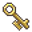

# { .sprite } Glade key

**Where to find Glade key:** [Appears during a quest or event](#v-lakecave2_key), [Appears during a quest or event](#v-lakecave2_key2)

<div class="infobox" markdown>

<p class="ib-img"></p>

| | |
|---|---|
| **Type** | NPC (talk only; never fought) |
| **Introduced** | [v0.7.2](../versions/0.7.2.md) |

</div>

## Appears during a quest or event { #v-lakecave2_key }

**Where:** appears during a quest or scripted event.

### Quests

- [Stoutford story flags (hidden flag)](../quests/stn_nondisplay.md): stages 210, 211

### Dialogue simulator

Talk to Glade key as you would in the game. When the conversation depends on your progress (a quest, an item, a dice roll…), the simulator asks you. Try another answer with **Undo**.

<div class="dlg-sim" data-src="../../assets/dialogue/lakecave2_key_check2.json" data-npc="Glade key" markdown="0"><noscript>The simulator needs JavaScript. The full dialogue is listed below.</noscript></div>

<p class="verified">Follows the game's own conversation rules (v0.8.18).</p>

??? quote "Dialogue (4 lines)"

    *Exactly as in the game files. Each line appears once; links jump to where a choice leads.*

    <span id="d-lakecave2_key-lakecave2_key_check2"></span>**`lakecave2_key_check2`** *(silent check: the first matching branch below is taken)*

    - branch 1 *(if 1 rounds passed since timer “lakecave2_timer_keycheck”)* → [lakecave2_key_check2_10](#d-lakecave2_key-lakecave2_key_check2_10)
    - branch 2 *(if NOT reached stage 210 of [Stoutford story flags (hidden flag)](../quests/stn_nondisplay.md#stage-210))* → [lakecave2_key_check2_20](#d-lakecave2_key-lakecave2_key_check2_20)
    - branch 3 → [lakecave2_key_check2_90](#d-lakecave2_key-lakecave2_key_check2_90)

    <span id="d-lakecave2_key-lakecave2_key_check2_10"></span>**`lakecave2_key_check2_10`** [Dummy NPC](../monsters/none.md): “You may be a great warrior, but you are not a tall one. Maybe a jump with a runup?” — **effects:** clears stage 210 of [Stoutford story flags (hidden flag)](../quests/stn_nondisplay.md#stage-210)


    <span id="d-lakecave2_key-lakecave2_key_check2_20"></span>**`lakecave2_key_check2_20`** [Dummy NPC](../monsters/none.md): “That was close - just half an inch short. Try again!” — **effects:** sets stage 210 of [Stoutford story flags (hidden flag)](../quests/stn_nondisplay.md#stage-210)


    <span id="d-lakecave2_key-lakecave2_key_check2_90"></span>**`lakecave2_key_check2_90`** [Dummy NPC](../monsters/none.md): “You got hold of the shelves and tore them down!” — **effects:** changes map lakecave2, sets stage 211 of [Stoutford story flags (hidden flag)](../quests/stn_nondisplay.md#stage-211)


### Version history

| Version | Change |
|---|---|
| [v0.7.2](../versions/0.7.2.md) | Added<br>Dialogue: 4 lines added |

<p class="verified">Verified against v0.8.18 and every earlier release back to v0.7.0 (game data compared release by release).</p>


## Appears during a quest or event (2) { #v-lakecave2_key2 }

**Where:** appears during a quest or scripted event.


## Behind the scenes

*How the game data handles this character. Not needed for playing.*

**2 entries.** The game data defines 2 separate characters named Glade key. The game makes a new entry whenever a character needs different behaviour (another conversation later in a quest, another place, other stats). Some are the same person at different points in the story; others just share a generic name. Here they differ in: conversation.

| Entry | Type | Section |
|---|---|---|
| `lakecave2_key` | NPC | [Appears during a quest or event](#v-lakecave2_key) |
| `lakecave2_key2` | NPC | [Appears during a quest or event](#v-lakecave2_key2) |

??? info "Technical information: lakecave2_key"

    | | |
    |---|---|
    | Entry ID | `lakecave2_key` |
    | Type (wiki) | NPC |
    | Spawn group | `lakecave2_key` |
    | Loot table | – |
    | Conversation | `lakecave2_key_check2` |
    | Faction | – |
    | Movement | – |
    | Icon | `items_japozero:387` |
    | Defined in | `res/raw/monsterlist_stoutford_combined.json` |

    Raw data:

    ```json
    {
     "id": "lakecave2_key",
     "name": "Glade key",
     "iconID": "items_japozero:387",
     "unique": 1,
     "spawnGroup": "lakecave2_key",
     "phraseID": "lakecave2_key_check2"
    }
    ```

??? info "Technical information: lakecave2_key2"

    | | |
    |---|---|
    | Entry ID | `lakecave2_key2` |
    | Type (wiki) | NPC |
    | Spawn group | `lakecave2_key2` |
    | Loot table | – |
    | Conversation | `lakecave2_key_found` |
    | Faction | – |
    | Movement | – |
    | Icon | `items_japozero:387` |
    | Defined in | `res/raw/monsterlist_stoutford_combined.json` |

    Raw data:

    ```json
    {
     "id": "lakecave2_key2",
     "name": "Glade key",
     "iconID": "items_japozero:387",
     "unique": 1,
     "spawnGroup": "lakecave2_key2",
     "phraseID": "lakecave2_key_found"
    }
    ```


## Community notes

<small>Written by players, not generated from game data. **Observations**: what players notice in-game · **Lore**: the in-world story · **Trivia**: real-world facts, references, development history · **Theory / speculation**: unconfirmed ideas; may just be unfinished content</small>

### Observations

*No notes yet. Contributions are welcome: [add a note](https://github.com/asdfghjkl628/Andor-s-Trail-Wikiiii/new/main/notes/monsters?filename=lakecave2_key.md&value=%23%23%20Observations%0A%0A%3C%21--%20what%20players%20notice%20in-game%20--%3E%0A%0A%23%23%20Lore%0A%0A%3C%21--%20the%20in-world%20story%20--%3E%0A%0A%23%23%20Trivia%0A%0A%3C%21--%20real-world%20facts%2C%20references%2C%20development%20history%20--%3E%0A%0A%23%23%20Theory%20/%20speculation%0A%0A%3C%21--%20unconfirmed%20ideas%3B%20may%20just%20be%20unfinished%20content%20--%3E%0A).*

### Lore

*No notes yet. Contributions are welcome: [add a note](https://github.com/asdfghjkl628/Andor-s-Trail-Wikiiii/new/main/notes/monsters?filename=lakecave2_key.md&value=%23%23%20Observations%0A%0A%3C%21--%20what%20players%20notice%20in-game%20--%3E%0A%0A%23%23%20Lore%0A%0A%3C%21--%20the%20in-world%20story%20--%3E%0A%0A%23%23%20Trivia%0A%0A%3C%21--%20real-world%20facts%2C%20references%2C%20development%20history%20--%3E%0A%0A%23%23%20Theory%20/%20speculation%0A%0A%3C%21--%20unconfirmed%20ideas%3B%20may%20just%20be%20unfinished%20content%20--%3E%0A).*

### Trivia

*No notes yet. Contributions are welcome: [add a note](https://github.com/asdfghjkl628/Andor-s-Trail-Wikiiii/new/main/notes/monsters?filename=lakecave2_key.md&value=%23%23%20Observations%0A%0A%3C%21--%20what%20players%20notice%20in-game%20--%3E%0A%0A%23%23%20Lore%0A%0A%3C%21--%20the%20in-world%20story%20--%3E%0A%0A%23%23%20Trivia%0A%0A%3C%21--%20real-world%20facts%2C%20references%2C%20development%20history%20--%3E%0A%0A%23%23%20Theory%20/%20speculation%0A%0A%3C%21--%20unconfirmed%20ideas%3B%20may%20just%20be%20unfinished%20content%20--%3E%0A).*

### Theory / speculation

*No notes yet. Contributions are welcome: [add a note](https://github.com/asdfghjkl628/Andor-s-Trail-Wikiiii/new/main/notes/monsters?filename=lakecave2_key.md&value=%23%23%20Observations%0A%0A%3C%21--%20what%20players%20notice%20in-game%20--%3E%0A%0A%23%23%20Lore%0A%0A%3C%21--%20the%20in-world%20story%20--%3E%0A%0A%23%23%20Trivia%0A%0A%3C%21--%20real-world%20facts%2C%20references%2C%20development%20history%20--%3E%0A%0A%23%23%20Theory%20/%20speculation%0A%0A%3C%21--%20unconfirmed%20ideas%3B%20may%20just%20be%20unfinished%20content%20--%3E%0A).*


<small>Data from v0.8.18</small>
