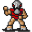

# { .sprite } Leofric

**Where to find Leofric:** [Foaming Flask Tavern, Beekeeper 1](#v-leofric), [Remgard, Remgard tavern 0](#v-leofric_remgard)

<div class="infobox" markdown>

<p class="ib-img">{ .sprite }</p>

| | |
|---|---|
| **Type** | NPC (talk only; never fought) |
| **Role** | Shopkeeper |
| **Found in** | Foaming Flask Tavern, Remgard |
| **Introduced** | [v0.8.12.1](../versions/0.8.12.1.md) |

</div>

## Foaming Flask Tavern, Beekeeper 1 { #v-leofric }

**Where:** Foaming Flask Tavern: [Beekeeper 1](../maps/beekeeper1.md#pin-npc-leofric) · **Role:** Shopkeeper

### Shop stock

| Item | Chance | Qty |
|---|---|---|
| [Honey](../items/honey.md) | 100% | 5 to 9 |
| [Mead](../items/mead.md) | 100% | 3 to 5 |
| [Honeycomb](../items/honeycomb.md) | 2% | 1 |
| [Bees wax](../items/beeswax.md) | 100% | 5 to 9 |

### Quests

- [Feygard story flags (hidden flag)](../quests/feygard_nondisplayed.md): stage 10

### Dialogue simulator

Set your quest stages and items, then talk to Leofric. Same rules as the game: same checks, same options, same effects.

<div class="dlg-sim" data-src="../../assets/dialogue/leofric_welcome.json" data-npc="Leofric" markdown="0"><noscript>The simulator needs JavaScript. The full dialogue is listed below.</noscript></div>

<p class="verified">Rules verified against v0.8.18 game code (ConversationController.java) and dialogue data.</p>

??? quote "Dialogue (5 lines)"

    *Exactly as in the game files. Each line appears once; links jump to where a choice leads.*

    <span id="d-leofric-leofric_welcome"></span>**`leofric_welcome`** Leofric: “Ah, greetings, traveler! What brings you to my humble apiary?”

    - “Hello. Who might you be?” → [leofric_intro](#d-leofric-leofric_intro)

    <span id="d-leofric-leofric_intro"></span>**`leofric_intro`** Leofric: “I be Leofric, master of bees and their keeper. I tend the hives and harvest their golden treasures”

    - “What exactly do you do here, Leofric?” → [leofric_job](#d-leofric-leofric_job)
    - “If you're a master of bees, why do you wear a helmet and mask?” → [leofric_explain](#d-leofric-leofric_explain)

    <span id="d-leofric-leofric_job"></span>**`leofric_job`** Leofric: “I care for the bees, gather their honey and wax, and craft fine goods from their toil. Bees be wondrous creatures, providing both sweet sustenance and warm light.”

    - “Do you have anything for sale?” → [leofric_sell](#d-leofric-leofric_sell)

    <span id="d-leofric-leofric_explain"></span>**`leofric_explain`** Leofric: “Ah, a keen eye you have! The helmet and mask protect me from more than just bee stings. The forest holds dangers aplenty, and it's wise to be prepared. You never know what you might encounter when tending to the hives deep in the woods.”

    - “What exactly do you do here, Leofric?” → [leofric_job](#d-leofric-leofric_job)

    <span id="d-leofric-leofric_sell"></span>**`leofric_sell`** Leofric: “Aye, I have many wares to offer. Jars of honey, beeswax and some fine mead. But that's it for now as my supply is lower than normal. Take a look, and see what catches your fancy.” — **effects:** sets stage 10 of [Feygard story flags (hidden flag)](../quests/feygard_nondisplayed.md#stage-10)

    - “Sounds great.” → *shop opens*


### Version history

| Version | Change |
|---|---|
| [v0.8.12.1](../versions/0.8.12.1.md) | Added<br>Dialogue: 5 lines added |

<p class="verified">Verified against v0.8.18 and every earlier release back to v0.7.0 (game data compared release by release).</p>


## Remgard, Remgard tavern 0 { #v-leofric_remgard }

**Where:** Remgard: [Remgard tavern 0](../maps/remgard_tavern0.md#pin-npc-leofric_remgard) · **Role:** Shopkeeper

### Shop stock

| Item | Chance | Qty |
|---|---|---|
| [Honey](../items/honey.md) | 100% | 5 to 9 |
| [Mead](../items/mead.md) | 100% | 3 to 5 |
| [Honeycomb](../items/honeycomb.md) | 2% | 1 |
| [Bees wax](../items/beeswax.md) | 100% | 5 |
| [Earplugs](../items/earplugs.md) | 100% | 10 |

### Dialogue simulator

Set your quest stages and items, then talk to Leofric. Same rules as the game: same checks, same options, same effects.

<div class="dlg-sim" data-src="../../assets/dialogue/leofric_remgard.json" data-npc="Leofric" markdown="0"><noscript>The simulator needs JavaScript. The full dialogue is listed below.</noscript></div>

<p class="verified">Rules verified against v0.8.18 game code (ConversationController.java) and dialogue data.</p>

??? quote "Dialogue (2 lines)"

    *Exactly as in the game files. Each line appears once; links jump to where a choice leads.*

    <span id="d-leofric_remgard-leofric_remgard"></span>**`leofric_remgard`** Leofric: “Hello kid. Finally, a sober tavern patron!”

    - “Yes, the noise in here is almost unbearable.” → [leofric_remgard_10](#d-leofric_remgard-leofric_remgard_10)

    <span id="d-leofric_remgard-leofric_remgard_10"></span>**`leofric_remgard_10`** Leofric: “That's why I have produced these earplugs from beeswax. I could sell you some of them.”

    - “With pleasure. I'd need 4 pairs for me and the crew. Show me what you have for sale.” → *shop opens*


### Version history

| Version | Change |
|---|---|
| [v0.8.18](../versions/0.8.18.md) | Added<br>Dialogue: 2 lines added |

<p class="verified">Verified against v0.8.18 and every earlier release back to v0.7.0 (game data compared release by release).</p>


## Behind the scenes

*How the game data handles this character. Not needed for playing.*

**2 entries.** The game data defines 2 separate characters named Leofric. The game makes a new entry whenever a character needs different behaviour (another conversation later in a quest, another place, other stats). Some are the same person at different points in the story; others just share a generic name. Here they differ in: conversation, location, loot or shop stock.

| Entry | Type | Section |
|---|---|---|
| `leofric` | NPC | [Foaming Flask Tavern, Beekeeper 1](#v-leofric) |
| `leofric_remgard` | NPC | [Remgard, Remgard tavern 0](#v-leofric_remgard) |

??? info "Technical information: leofric"

    | | |
    |---|---|
    | Entry ID | `leofric` |
    | Type (wiki) | NPC |
    | Spawn group | `leofric` |
    | Loot table | `leofric_dl` |
    | Conversation | `leofric_welcome` |
    | Faction | – |
    | Movement | – |
    | Icon | `monsters_tometik1:85` |
    | Defined in | `res/raw/monsterlist_feygard_1.json` |

    Raw data:

    ```json
    {
     "id": "leofric",
     "name": "Leofric",
     "iconID": "monsters_tometik1:85",
     "monsterClass": "humanoid",
     "phraseID": "leofric_welcome",
     "droplistID": "leofric_dl"
    }
    ```

??? info "Technical information: leofric_remgard"

    | | |
    |---|---|
    | Entry ID | `leofric_remgard` |
    | Type (wiki) | NPC |
    | Spawn group | `leofric_remgard` |
    | Loot table | `leofric_remgard` |
    | Conversation | `leofric_remgard` |
    | Faction | – |
    | Movement | – |
    | Icon | `monsters_tometik1:85` |
    | Defined in | `res/raw/monsterlist_lake_laeroth_2.json` |

    Raw data:

    ```json
    {
     "id": "leofric_remgard",
     "name": "Leofric",
     "iconID": "monsters_tometik1:85",
     "monsterClass": "humanoid",
     "phraseID": "leofric_remgard",
     "droplistID": "leofric_remgard"
    }
    ```


## Community notes

<small>Written by players, not generated from game data. **Observations**: what players notice in-game · **Lore**: the in-world story · **Trivia**: real-world facts, references, development history · **Theory / speculation**: unconfirmed ideas; may just be unfinished content</small>

### Observations

*No notes yet. Contributions are welcome: [add a note](https://github.com/asdfghjkl628/Andor-s-Trail-Wikiiii/new/main/notes/monsters?filename=leofric.md&value=%23%23%20Observations%0A%0A%3C%21--%20what%20players%20notice%20in-game%20--%3E%0A%0A%23%23%20Lore%0A%0A%3C%21--%20the%20in-world%20story%20--%3E%0A%0A%23%23%20Trivia%0A%0A%3C%21--%20real-world%20facts%2C%20references%2C%20development%20history%20--%3E%0A%0A%23%23%20Theory%20/%20speculation%0A%0A%3C%21--%20unconfirmed%20ideas%3B%20may%20just%20be%20unfinished%20content%20--%3E%0A).*

### Lore

*No notes yet. Contributions are welcome: [add a note](https://github.com/asdfghjkl628/Andor-s-Trail-Wikiiii/new/main/notes/monsters?filename=leofric.md&value=%23%23%20Observations%0A%0A%3C%21--%20what%20players%20notice%20in-game%20--%3E%0A%0A%23%23%20Lore%0A%0A%3C%21--%20the%20in-world%20story%20--%3E%0A%0A%23%23%20Trivia%0A%0A%3C%21--%20real-world%20facts%2C%20references%2C%20development%20history%20--%3E%0A%0A%23%23%20Theory%20/%20speculation%0A%0A%3C%21--%20unconfirmed%20ideas%3B%20may%20just%20be%20unfinished%20content%20--%3E%0A).*

### Trivia

*No notes yet. Contributions are welcome: [add a note](https://github.com/asdfghjkl628/Andor-s-Trail-Wikiiii/new/main/notes/monsters?filename=leofric.md&value=%23%23%20Observations%0A%0A%3C%21--%20what%20players%20notice%20in-game%20--%3E%0A%0A%23%23%20Lore%0A%0A%3C%21--%20the%20in-world%20story%20--%3E%0A%0A%23%23%20Trivia%0A%0A%3C%21--%20real-world%20facts%2C%20references%2C%20development%20history%20--%3E%0A%0A%23%23%20Theory%20/%20speculation%0A%0A%3C%21--%20unconfirmed%20ideas%3B%20may%20just%20be%20unfinished%20content%20--%3E%0A).*

### Theory / speculation

*No notes yet. Contributions are welcome: [add a note](https://github.com/asdfghjkl628/Andor-s-Trail-Wikiiii/new/main/notes/monsters?filename=leofric.md&value=%23%23%20Observations%0A%0A%3C%21--%20what%20players%20notice%20in-game%20--%3E%0A%0A%23%23%20Lore%0A%0A%3C%21--%20the%20in-world%20story%20--%3E%0A%0A%23%23%20Trivia%0A%0A%3C%21--%20real-world%20facts%2C%20references%2C%20development%20history%20--%3E%0A%0A%23%23%20Theory%20/%20speculation%0A%0A%3C%21--%20unconfirmed%20ideas%3B%20may%20just%20be%20unfinished%20content%20--%3E%0A).*


<small>Data from v0.8.18</small>
