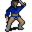

# { .sprite } Thyrope Splathershed

**Where to find Thyrope Splathershed:** Remgard: [Remgard tavern 0](../maps/remgard_tavern0.md#pin-npc-ll2_mapmaker)

<div class="infobox" markdown>

<p class="ib-img">{ .sprite }</p>

| | |
|---|---|
| **Type** | NPC (talk only; never fought) |
| **Role** | Starts [A map of the Great Lake Laeroth](../quests/lake_map.md) |
| **Found in** | Remgard |
| **Introduced** | [v0.8.18](../versions/0.8.18.md) |

</div>

## Quests

- [A map of the Great Lake Laeroth](../quests/lake_map.md): stages 10, 12, 910

## Dialogue simulator

Set your quest stages and items, then talk to Thyrope Splathershed. Same rules as the game: same checks, same options, same effects.

<div class="dlg-sim" data-src="../../assets/dialogue/ll2_mapmaker.json" data-npc="Thyrope Splathershed" markdown="0"><noscript>The simulator needs JavaScript. The full dialogue is listed below.</noscript></div>

<p class="verified">Rules verified against v0.8.18 game code (ConversationController.java) and dialogue data.</p>

??? quote "Dialogue (41 lines)"

    *Exactly as in the game files. Each line appears once; links jump to where a choice leads.*

    <span id="d-ll2_mapmaker"></span>**`ll2_mapmaker`** Thyrope Splathershed: “Hello, child. Sit down, you may keep me company.”

    - “Who are you?” *(if NOT reached stage 10 of [A map of the Great Lake Laeroth](../quests/lake_map.md#stage-10))* → [ll2_mapmaker_10](#d-ll2_mapmaker_10)
    - “I have earplugs now.” *(if carry 4× [Earplugs](../items/earplugs.md))* → [ll2_mapmaker_9](#d-ll2_mapmaker_9)
    - “I have beeswax with me now.” *(if NOT carry 4× [Earplugs](../items/earplugs.md); carry 4× [Bees wax](../items/beeswax.md); reached stage 12 of [A map of the Great Lake Laeroth](../quests/lake_map.md#stage-12))* → [ll2_mapmaker_6a](#d-ll2_mapmaker_6a)
    - “We have a problem sir. There's a rocky reef that the captain doesn't want to sail past. He's afraid of some singing…” *(if reached stage 40 of [A map of the Great Lake Laeroth](../quests/lake_map.md#stage-40); NOT reached stage 42 of [A map of the Great Lake Laeroth](../quests/lake_map.md#stage-42))* → [ll2_mapmaker_2](#d-ll2_mapmaker_2)
    - “I have found all the new parts for your map.” *(if faction “ll2_maps” ≥ 22)* → [ll2_mapmaker_90](#d-ll2_mapmaker_90)
    - “I have found some of the new parts for your map.” *(if faction “ll2_maps” ≥ 1; NOT faction “ll2_maps” ≥ 22)* → [ll2_mapmaker_80](#d-ll2_mapmaker_80)

    <span id="d-ll2_mapmaker_10"></span>**`ll2_mapmaker_10`** Thyrope Splathershed: “I am Thyrope Splathershed, the famous scholar and cartographer.”

    - “Splathershed? Haven't I heard that name before?” → [ll2_mapmaker_11](#d-ll2_mapmaker_11)
    - “A cartographer?” → [ll2_mapmaker_10a](#d-ll2_mapmaker_10a)

    <span id="d-ll2_mapmaker_9"></span>**`ll2_mapmaker_9`** [Thyrope Splathershed](../monsters/ll2_mapmaker.md): “Good, good. Then off you go - the ship is waiting!”


    <span id="d-ll2_mapmaker_6a"></span>**`ll2_mapmaker_6a`** Thyrope Splathershed: “Beeswax? From Leofric I hope. Good, give it to me. I can create earplugs for you.”

    - “Here you are.” → [ll2_mapmaker_7](#d-ll2_mapmaker_7)

    <span id="d-ll2_mapmaker_2"></span>**`ll2_mapmaker_2`** Thyrope Splathershed: “Oh, really? We have sirens here in the lake? Fascinating!”

    - “You know what sirens are?” → [ll2_mapmaker_3](#d-ll2_mapmaker_3)

    <span id="d-ll2_mapmaker_90"></span>**`ll2_mapmaker_90`** Thyrope Splathershed: “Really!! That fast? I am extremely impressed. And delighted!”

    - “The cruise was fun.” → [ll2_mapmaker_91](#d-ll2_mapmaker_91)

    <span id="d-ll2_mapmaker_80"></span>**`ll2_mapmaker_80`** Thyrope Splathershed: “Ohh, I'm almost dying to have the entire map complete.”


    <span id="d-ll2_mapmaker_11"></span>**`ll2_mapmaker_11`** Thyrope Splathershed: “You probably know my brother, who wrote the famous treatise on the history of Dhayavar.”

    - “Maybe. What are you doing here?” → [ll2_mapmaker_13](#d-ll2_mapmaker_13)
    - “Talking of brothers - have you seen my brother Andor?” → [ll2_mapmaker_12](#d-ll2_mapmaker_12)

    <span id="d-ll2_mapmaker_10a"></span>**`ll2_mapmaker_10a`** Thyrope Splathershed: “A map maker.”

    - “Then you must travel a lot. Have you seen my brother Andor?” → [ll2_mapmaker_12](#d-ll2_mapmaker_12)

    <span id="d-ll2_mapmaker_7"></span>**`ll2_mapmaker_7`** [Dummy NPC](../monsters/none.md): “With practiced movements, Thyrope made several pairs of earplugs.”

    - Next *(if hand over 4× [Bees wax](../items/beeswax.md))* → [ll2_mapmaker_8](#d-ll2_mapmaker_8)

    <span id="d-ll2_mapmaker_3"></span>**`ll2_mapmaker_3`** Thyrope Splathershed: “Of course! Everyone with a bit of education knows about them.”

    - Next → [ll2_mapmaker_4](#d-ll2_mapmaker_4)

    <span id="d-ll2_mapmaker_91"></span>**`ll2_mapmaker_91`** *(silent check: the first matching branch below is taken)*

    - branch 1 *(if reached stage 26 of [A map of the Great Lake Laeroth](../quests/lake_map.md#stage-26))* → [ll2_mapmaker_91a](#d-ll2_mapmaker_91a)
    - branch 2 → [ll2_mapmaker_91b](#d-ll2_mapmaker_91b)

    <span id="d-ll2_mapmaker_13"></span>**`ll2_mapmaker_13`** Thyrope Splathershed: “There's less and less terra incognita... sorry, children don't understand these technical terms - I mean unknown parts of the world. My work is getting more and more difficult.”

    - Next → [ll2_mapmaker_14](#d-ll2_mapmaker_14)

    <span id="d-ll2_mapmaker_12"></span>**`ll2_mapmaker_12`** Thyrope Splathershed: “Probably not. I mainly focus on the environment so I can create the most accurate maps possible.”

    - Next → [ll2_mapmaker_13](#d-ll2_mapmaker_13)

    <span id="d-ll2_mapmaker_8"></span>**`ll2_mapmaker_8`** [Thyrope Splathershed](../monsters/ll2_mapmaker.md): “Here, take these earplugs. The wax was perfect for them, they'll work well.” — **effects:** gives 4× [Earplugs](../items/earplugs.md)

    - “Thank you. I'm going to go and try them out right away.” → *conversation ends*

    <span id="d-ll2_mapmaker_4"></span>**`ll2_mapmaker_4`** Thyrope Splathershed: “However, no one has yet returned alive to report what they sing - if that's what they do.”

    - “Then my trip is already over.” → [ll2_mapmaker_5](#d-ll2_mapmaker_5)

    <span id="d-ll2_mapmaker_91a"></span>**`ll2_mapmaker_91a`** [Dummy NPC](../monsters/none.md): “You talk of how you nearly got stuck at Kalypso on a paradise island.”

    - Next → [ll2_mapmaker_91b](#d-ll2_mapmaker_91b)

    <span id="d-ll2_mapmaker_91b"></span>**`ll2_mapmaker_91b`** [Dummy NPC](../monsters/none.md): “You explain how you passed by the sirens.”

    - Next → [ll2_mapmaker_92](#d-ll2_mapmaker_92)

    <span id="d-ll2_mapmaker_14"></span>**`ll2_mapmaker_14`** Thyrope Splathershed: “Here in Remgard, I've struck gold. The great lake here is well known in the coastal regions - but what's in the lake itself?”

    - Next → [ll2_mapmaker_15](#d-ll2_mapmaker_15)

    <span id="d-ll2_mapmaker_5"></span>**`ll2_mapmaker_5`** Thyrope Splathershed: “No, of course not. Just put something into your ears. Wax should work. Do you have beeswax with you?”

    - “Luckily yes, here it is.” *(if carry 4× [Bees wax](../items/beeswax.md))* → [ll2_mapmaker_7](#d-ll2_mapmaker_7)
    - “Unfortunately no.” *(if NOT carry 4× [Bees wax](../items/beeswax.md))* → [ll2_mapmaker_6](#d-ll2_mapmaker_6)

    <span id="d-ll2_mapmaker_92"></span>**`ll2_mapmaker_92`** *(silent check: the first matching branch below is taken)*

    - branch 1 *(if reached stage 36 of [A map of the Great Lake Laeroth](../quests/lake_map.md#stage-36))* → [ll2_mapmaker_92a](#d-ll2_mapmaker_92a)
    - branch 2 → [ll2_mapmaker_93](#d-ll2_mapmaker_93)

    <span id="d-ll2_mapmaker_15"></span>**`ll2_mapmaker_15`** Thyrope Splathershed: “That's what I want to find out, and then I'll become famous with my map of the great lake.”

    - “So you want to charter a ship and explore the lake? Sounds exciting.” → [ll2_mapmaker_16](#d-ll2_mapmaker_16)

    <span id="d-ll2_mapmaker_6"></span>**`ll2_mapmaker_6`** Thyrope Splathershed: “You can get the best beeswax directly from a beekeeper. I know one: Leofric, I would trust him.” — **effects:** sets stage 12 of [A map of the Great Lake Laeroth](../quests/lake_map.md#stage-12)

    - “Leofric? Where can I find him?” → [ll2_mapmaker_6b](#d-ll2_mapmaker_6b)
    - “Oh, that guy. I remember him.” → [ll2_mapmaker_6c](#d-ll2_mapmaker_6c)

    <span id="d-ll2_mapmaker_92a"></span>**`ll2_mapmaker_92a`** [Dummy NPC](../monsters/none.md): “You talk of the captain and his crew being turned into pigs.”

    - Next → [ll2_mapmaker_93](#d-ll2_mapmaker_93)

    <span id="d-ll2_mapmaker_93"></span>**`ll2_mapmaker_93`** *(silent check: the first matching branch below is taken)*

    - branch 1 *(if reached stage 59 of [A map of the Great Lake Laeroth](../quests/lake_map.md#stage-59))* → [ll2_mapmaker_93a](#d-ll2_mapmaker_93a)
    - branch 2 → [ll2_mapmaker_94](#d-ll2_mapmaker_94)

    <span id="d-ll2_mapmaker_16"></span>**`ll2_mapmaker_16`** Thyrope Splathershed: “What? No, absolutely not!”

    - Next → [ll2_mapmaker_17](#d-ll2_mapmaker_17)

    <span id="d-ll2_mapmaker_6b"></span>**`ll2_mapmaker_6b`** Thyrope Splathershed: “When he isn't out and about, he's at his bee meadow behind the Foaming Flask - in case you know it, kid.”

    - “A rather crowded and noisy place.” → [ll2_mapmaker_6c](#d-ll2_mapmaker_6c)

    <span id="d-ll2_mapmaker_6c"></span>**`ll2_mapmaker_6c`** Thyrope Splathershed: “You need one piece of wax for each pair of earplugs. So, four in total - for yourself, and for the crew.”


    <span id="d-ll2_mapmaker_93a"></span>**`ll2_mapmaker_93a`** [Dummy NPC](../monsters/none.md): “You talk of blinded cyclops and sheep.”

    - Next → [ll2_mapmaker_94](#d-ll2_mapmaker_94)

    <span id="d-ll2_mapmaker_94"></span>**`ll2_mapmaker_94`** *(silent check: the first matching branch below is taken)*

    - branch 1 *(if reached stage 60 of [A map of the Great Lake Laeroth](../quests/lake_map.md#stage-60))* → [ll2_mapmaker_94a](#d-ll2_mapmaker_94a)
    - branch 2 → [ll2_mapmaker_95](#d-ll2_mapmaker_95)

    <span id="d-ll2_mapmaker_17"></span>**`ll2_mapmaker_17`** Thyrope Splathershed: “I'm not allowed to go myself. It would be an immeasurable loss to humanity if something were to happen to me.”

    - Next → [ll2_mapmaker_18](#d-ll2_mapmaker_18)

    <span id="d-ll2_mapmaker_94a"></span>**`ll2_mapmaker_94a`** [Dummy NPC](../monsters/none.md): “And how the six-headed monster Scylla had attacked your ship.”

    - Next → [ll2_mapmaker_95](#d-ll2_mapmaker_95)

    <span id="d-ll2_mapmaker_95"></span>**`ll2_mapmaker_95`** *(silent check: the first matching branch below is taken)*

    - branch 1 *(if reached stage 78 of [A map of the Great Lake Laeroth](../quests/lake_map.md#stage-78))* → [ll2_mapmaker_95a](#d-ll2_mapmaker_95a)
    - branch 2 → [ll2_mapmaker_96](#d-ll2_mapmaker_96)

    <span id="d-ll2_mapmaker_18"></span>**`ll2_mapmaker_18`** Thyrope Splathershed: “But I'm looking for someone to make the trip and tell me about it.”

    - Next → [ll2_mapmaker_19](#d-ll2_mapmaker_19)

    <span id="d-ll2_mapmaker_95a"></span>**`ll2_mapmaker_95a`** [Dummy NPC](../monsters/none.md): “And finally, you raved about the gloomy land beneath the lake. What it was like to be swept into the abyss with the ship, and then to resurface again.”

    - Next → [ll2_mapmaker_96](#d-ll2_mapmaker_96)

    <span id="d-ll2_mapmaker_96"></span>**`ll2_mapmaker_96`** [Dummy NPC](../monsters/none.md): “Thyrope Splathershed didn't seem entirely sure whether to believe your incredible story.”

    - Next → [ll2_mapmaker_97](#d-ll2_mapmaker_97)

    <span id="d-ll2_mapmaker_19"></span>**`ll2_mapmaker_19`** Thyrope Splathershed: “You look like you don't have anything better to do right now anyway. Will you make the trip for me?”

    - “[muttering] Nothing to do? If you only knew...” → [ll2_mapmaker_20](#d-ll2_mapmaker_20)

    <span id="d-ll2_mapmaker_97"></span>**`ll2_mapmaker_97`** [Thyrope Splathershed](../monsters/ll2_mapmaker.md): “Thank you so much for these extremely entertaining experiences. Perhaps I'll write a story about them sometime.”

    - Next → [ll2_mapmaker_99](#d-ll2_mapmaker_99)

    <span id="d-ll2_mapmaker_20"></span>**`ll2_mapmaker_20`** Thyrope Splathershed: “The ship is ready to depart from the dock, and the passage has already been paid for.”

    - “Hmm. It sounds exciting. I agree to your proposal.” → [ll2_mapmaker_21](#d-ll2_mapmaker_21)

    <span id="d-ll2_mapmaker_99"></span>**`ll2_mapmaker_99`** Thyrope Splathershed: “As a reward you can use Captain Burry and his ship whenever you want. I will pay for it.” — **effects:** sets stage 910 of [A map of the Great Lake Laeroth](../quests/lake_map.md#stage-910)

    - “Oh, nice - thank you!” → *conversation ends*

    <span id="d-ll2_mapmaker_21"></span>**`ll2_mapmaker_21`** Thyrope Splathershed: “So then, Captain Burry will greet you on board!” — **effects:** sets stage 10 of [A map of the Great Lake Laeroth](../quests/lake_map.md#stage-10)


## Version history

| Version | Change |
|---|---|
| [v0.8.18](../versions/0.8.18.md) | Added<br>Dialogue: 41 lines added |

<p class="verified">Verified against v0.8.18 and every earlier release back to v0.7.0 (game data compared release by release).</p>


## Behind the scenes

*How the game data handles this character. Not needed for playing.*

??? info "Technical information"

    | | |
    |---|---|
    | Entry ID | `ll2_mapmaker` |
    | Type (wiki) | NPC |
    | Spawn group | `ll2_mapmaker` |
    | Loot table | – |
    | Conversation | `ll2_mapmaker` |
    | Faction | – |
    | Movement | – |
    | Icon | `monsters_ld1:17` |
    | Defined in | `res/raw/monsterlist_lake_laeroth_2.json` |

    Raw data:

    ```json
    {
     "id": "ll2_mapmaker",
     "name": "Thyrope Splathershed",
     "iconID": "monsters_ld1:17",
     "monsterClass": "humanoid",
     "spawnGroup": "ll2_mapmaker",
     "phraseID": "ll2_mapmaker"
    }
    ```


## Community notes

<small>Written by players, not generated from game data. **Observations**: what players notice in-game · **Lore**: the in-world story · **Trivia**: real-world facts, references, development history · **Theory / speculation**: unconfirmed ideas; may just be unfinished content</small>

### Observations

*No notes yet. Contributions are welcome: [add a note](https://github.com/asdfghjkl628/Andor-s-Trail-Wikiiii/new/main/notes/monsters?filename=ll2_mapmaker.md&value=%23%23%20Observations%0A%0A%3C%21--%20what%20players%20notice%20in-game%20--%3E%0A%0A%23%23%20Lore%0A%0A%3C%21--%20the%20in-world%20story%20--%3E%0A%0A%23%23%20Trivia%0A%0A%3C%21--%20real-world%20facts%2C%20references%2C%20development%20history%20--%3E%0A%0A%23%23%20Theory%20/%20speculation%0A%0A%3C%21--%20unconfirmed%20ideas%3B%20may%20just%20be%20unfinished%20content%20--%3E%0A).*

### Lore

*No notes yet. Contributions are welcome: [add a note](https://github.com/asdfghjkl628/Andor-s-Trail-Wikiiii/new/main/notes/monsters?filename=ll2_mapmaker.md&value=%23%23%20Observations%0A%0A%3C%21--%20what%20players%20notice%20in-game%20--%3E%0A%0A%23%23%20Lore%0A%0A%3C%21--%20the%20in-world%20story%20--%3E%0A%0A%23%23%20Trivia%0A%0A%3C%21--%20real-world%20facts%2C%20references%2C%20development%20history%20--%3E%0A%0A%23%23%20Theory%20/%20speculation%0A%0A%3C%21--%20unconfirmed%20ideas%3B%20may%20just%20be%20unfinished%20content%20--%3E%0A).*

### Trivia

*No notes yet. Contributions are welcome: [add a note](https://github.com/asdfghjkl628/Andor-s-Trail-Wikiiii/new/main/notes/monsters?filename=ll2_mapmaker.md&value=%23%23%20Observations%0A%0A%3C%21--%20what%20players%20notice%20in-game%20--%3E%0A%0A%23%23%20Lore%0A%0A%3C%21--%20the%20in-world%20story%20--%3E%0A%0A%23%23%20Trivia%0A%0A%3C%21--%20real-world%20facts%2C%20references%2C%20development%20history%20--%3E%0A%0A%23%23%20Theory%20/%20speculation%0A%0A%3C%21--%20unconfirmed%20ideas%3B%20may%20just%20be%20unfinished%20content%20--%3E%0A).*

### Theory / speculation

*No notes yet. Contributions are welcome: [add a note](https://github.com/asdfghjkl628/Andor-s-Trail-Wikiiii/new/main/notes/monsters?filename=ll2_mapmaker.md&value=%23%23%20Observations%0A%0A%3C%21--%20what%20players%20notice%20in-game%20--%3E%0A%0A%23%23%20Lore%0A%0A%3C%21--%20the%20in-world%20story%20--%3E%0A%0A%23%23%20Trivia%0A%0A%3C%21--%20real-world%20facts%2C%20references%2C%20development%20history%20--%3E%0A%0A%23%23%20Theory%20/%20speculation%0A%0A%3C%21--%20unconfirmed%20ideas%3B%20may%20just%20be%20unfinished%20content%20--%3E%0A).*


<small>Data from v0.8.18</small>
