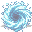

# { .sprite } Charybdis

| Stat | Value |
|---|---|
| Class | construct |
| HP | 0 |
| Max AP | 10 |
| Attack cost | 10 |
| Move cost | 10 |
| Damage | 0 |
| Attack chance | 0 |
| Block chance | 0 |
| Damage resistance | 0 |
| Critical skill | 0 |
| Critical multiplier | 0 |

!!! note "Immune to critical hits"
    Ghosts, constructs and demons can't be critically hit. Your crit build will have to sit this one out.

## Found on

- [mountainlake_sub](../maps/mountainlake_sub.md)

## Quests

- [A map of the Great Lake Laeroth](../quests/lake_map.md): stages 78

??? quote "Dialogue (7 lines)"

    *What the dialogue says, exactly as in the game files. Lines are listed once; links jump to the line a choice leads to.*

    **`ll2_whirl_return`** *(silent check: the first matching branch below is taken)*

    - branch 1 *(if reached stage 37 of [Lake Laeroth nondisplay (hidden flag)](../quests/ll2_nd.md#stage-37))* → [ll2_whirl_return_to_37](#d-ll2_whirl_return_to_37)
    - branch 2 *(if reached stage 36 of [Lake Laeroth nondisplay (hidden flag)](../quests/ll2_nd.md#stage-36))* → [ll2_whirl_return_to_36](#d-ll2_whirl_return_to_36)
    - branch 3 *(if reached stage 35 of [Lake Laeroth nondisplay (hidden flag)](../quests/ll2_nd.md#stage-35))* → [ll2_whirl_return_to_35](#d-ll2_whirl_return_to_35)
    - branch 4 *(if reached stage 34 of [Lake Laeroth nondisplay (hidden flag)](../quests/ll2_nd.md#stage-34))* → [ll2_whirl_return_to_34](#d-ll2_whirl_return_to_34)
    - branch 5 *(if reached stage 33 of [Lake Laeroth nondisplay (hidden flag)](../quests/ll2_nd.md#stage-33))* → [ll2_whirl_return_to_33](#d-ll2_whirl_return_to_33)
    - branch 6 → [ll2_whirl_return_to_31](#d-ll2_whirl_return_to_31)

    **`ll2_whirl_return_to_37`** Charybdis: “The ship has made it back up again!” — **effects:** moves you to [mountainlake37](../maps/mountainlake37.md), sets stage 78 of [A map of the Great Lake Laeroth](../quests/lake_map.md#stage-78)

    **`ll2_whirl_return_to_36`** Charybdis: “The ship has made it back up again!” — **effects:** moves you to [mountainlake36](../maps/mountainlake36.md), sets stage 78 of [A map of the Great Lake Laeroth](../quests/lake_map.md#stage-78)

    **`ll2_whirl_return_to_35`** Charybdis: “The ship has made it back up again!” — **effects:** moves you to [mountainlake35](../maps/mountainlake35.md), sets stage 78 of [A map of the Great Lake Laeroth](../quests/lake_map.md#stage-78)

    **`ll2_whirl_return_to_34`** Charybdis: “The ship has made it back up again!” — **effects:** moves you to [mountainlake34](../maps/mountainlake34.md), sets stage 78 of [A map of the Great Lake Laeroth](../quests/lake_map.md#stage-78)

    **`ll2_whirl_return_to_33`** Charybdis: “The ship has made it back up again!” — **effects:** moves you to [mountainlake33](../maps/mountainlake33.md), sets stage 78 of [A map of the Great Lake Laeroth](../quests/lake_map.md#stage-78)

    **`ll2_whirl_return_to_31`** Charybdis: “The ship has made it back up again!” — **effects:** moves you to [mountainlake31](../maps/mountainlake31.md), sets stage 78 of [A map of the Great Lake Laeroth](../quests/lake_map.md#stage-78)

## Community notes

<small>Written by players, not generated from game data. **Observations**: what players notice in-game · **Lore**: the in-world story · **Trivia**: real-world facts, references, development history · **Theory / speculation**: unconfirmed ideas; may just be unfinished content</small>

### Observations

*Nothing here yet. Know something? [Add it](https://github.com/asdfghjkl628/Andor-s-Trail-Wikiiii/new/main/notes/monsters?filename=ll2_whirl_return.md&value=%23%23%20Observations%0A%0A%3C%21--%20what%20players%20notice%20in-game%20--%3E%0A%0A%23%23%20Lore%0A%0A%3C%21--%20the%20in-world%20story%20--%3E%0A%0A%23%23%20Trivia%0A%0A%3C%21--%20real-world%20facts%2C%20references%2C%20development%20history%20--%3E%0A%0A%23%23%20Theory%20/%20speculation%0A%0A%3C%21--%20unconfirmed%20ideas%3B%20may%20just%20be%20unfinished%20content%20--%3E%0A).*

### Lore

*Nothing here yet. Know something? [Add it](https://github.com/asdfghjkl628/Andor-s-Trail-Wikiiii/new/main/notes/monsters?filename=ll2_whirl_return.md&value=%23%23%20Observations%0A%0A%3C%21--%20what%20players%20notice%20in-game%20--%3E%0A%0A%23%23%20Lore%0A%0A%3C%21--%20the%20in-world%20story%20--%3E%0A%0A%23%23%20Trivia%0A%0A%3C%21--%20real-world%20facts%2C%20references%2C%20development%20history%20--%3E%0A%0A%23%23%20Theory%20/%20speculation%0A%0A%3C%21--%20unconfirmed%20ideas%3B%20may%20just%20be%20unfinished%20content%20--%3E%0A).*

### Trivia

*Nothing here yet. Know something? [Add it](https://github.com/asdfghjkl628/Andor-s-Trail-Wikiiii/new/main/notes/monsters?filename=ll2_whirl_return.md&value=%23%23%20Observations%0A%0A%3C%21--%20what%20players%20notice%20in-game%20--%3E%0A%0A%23%23%20Lore%0A%0A%3C%21--%20the%20in-world%20story%20--%3E%0A%0A%23%23%20Trivia%0A%0A%3C%21--%20real-world%20facts%2C%20references%2C%20development%20history%20--%3E%0A%0A%23%23%20Theory%20/%20speculation%0A%0A%3C%21--%20unconfirmed%20ideas%3B%20may%20just%20be%20unfinished%20content%20--%3E%0A).*

### Theory / speculation

*Nothing here yet. Know something? [Add it](https://github.com/asdfghjkl628/Andor-s-Trail-Wikiiii/new/main/notes/monsters?filename=ll2_whirl_return.md&value=%23%23%20Observations%0A%0A%3C%21--%20what%20players%20notice%20in-game%20--%3E%0A%0A%23%23%20Lore%0A%0A%3C%21--%20the%20in-world%20story%20--%3E%0A%0A%23%23%20Trivia%0A%0A%3C%21--%20real-world%20facts%2C%20references%2C%20development%20history%20--%3E%0A%0A%23%23%20Theory%20/%20speculation%0A%0A%3C%21--%20unconfirmed%20ideas%3B%20may%20just%20be%20unfinished%20content%20--%3E%0A).*

<small>Monster ID: `ll2_whirl_return` · Data from v0.8.18</small>
