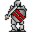

# { .sprite } Lleglaris

<div class="infobox" markdown>

<p class="ib-img">{ .sprite }</p>

| | |
|---|---|
| **Monster ID** | `lleglaris` |
| **Type** | Shopkeeper |
| **Class** | ? |
| **HP** | 1 |
| **Found in** | Foaming Flask Tavern |
| **Introduced** | v0.7.0 or earlier |

</div>

## Combat stats

| Stat | Value |
|---|---|
| HP | 1 |
| Damage | 0 |
| Attack chance | 0 |
| Block chance | 0 |
| Damage resistance | 0 |
| Max AP | 10 |
| Attack cost | 10 AP |
| Attacks per turn | 1 |
| Move cost | 10 AP |
| Critical skill | 0 |
| Critical multiplier | – |
| Crit chance | none (needs critical skill and a multiplier) |

**XP formula** (from the game's loader): ⌈(attacks per turn × attack chance × average damage × (1 + critical skill × multiplier) × 3 + HP × (1 + block chance) + 9 × damage resistance) × 0.7⌉, +50 if its hits inflict a condition. More Exp adds a percentage on top.

<p class="verified">Verified against v0.8.18 monster data and game code (`MonsterTypeParser.java`).</p>


## Shop stock

| Item | Chance | Qty |
|---|---|---|
| [Giant's claymore](../items/clmr_gnt.md) | 100% | 1 to 5 |
| [Axe of whirlwind](../items/axe_whirl.md) | 100% | 1 to 5 |
| [Superior defender's claymore](../items/clmr_def2.md) | 100% | 1 to 5 |
| [Sharpened hatchet](../items/hatchet_sharp.md) | 100% | 1 to 5 |
| [Serpent's fang](../items/clmr_serp.md) | 100% | 1 to 5 |
| [Worn plated gloves](../items/hglv_plat1.md) | 100% | 1 to 5 |
| [Executioner's greataxe](../items/graxe_exec.md) | 100% | 1 to 5 |
| [Light black axe](../items/axe_lightblack.md) | 100% | 1 to 5 |
| [Axe of fear](../items/axe_fear.md) | 100% | 1 to 5 |
| [Steel glaive](../items/glaive_steel.md) | 100% | 1 |

## Locations

| Map | Region | Up to | Notes |
|---|---|---|---|
| [tradehouse1](../maps/tradehouse1.md) | Foaming Flask Tavern | 1 | – |


## Quests

- [Long lost memories](../quests/lleglaris.md): stages 10, 15, 30, 40

## Dialogue simulator

Set up your situation (quest stages, items, kills…), then talk to Lleglaris. The simulator follows the game's own rules: it takes the same silent checks, offers only the options you'd really see, and applies their effects (quest stages, items handed over, rewards) as you go.

<div class="dlg-sim" data-src="../../assets/dialogue/lleglaris.json" data-npc="Lleglaris" markdown="0"><noscript>The simulator needs JavaScript. The full dialogue is listed below.</noscript></div>

<p class="verified">Rules verified against v0.8.18 game code (ConversationController.java) and dialogue data.</p>

??? quote "Dialogue (24 lines)"

    *What the dialogue says, exactly as in the game files. Lines are listed once; links jump to the line a choice leads to.*

    <span id="d-lleglaris"></span>**`lleglaris`** *(silent check: the first matching branch below is taken)*

    - branch 1 *(if reached stage 30 of [Long lost memories](../quests/lleglaris.md#stage-30))* → [lleglaris_r4](#d-lleglaris_r4)
    - branch 2 *(if reached stage 15 of [Long lost memories](../quests/lleglaris.md#stage-15))* → [lleglaris_r1](#d-lleglaris_r1)
    - branch 3 *(if reached stage 10 of [Long lost memories](../quests/lleglaris.md#stage-10))* → [lleglaris15](#d-lleglaris15)
    - branch 4 → [lleglaris0](#d-lleglaris0)

    <span id="d-lleglaris_r4"></span>**`lleglaris_r4`** Lleglaris: “Thank you for finding my amulet.”

    - Next → [lleglaris_r5](#d-lleglaris_r5)

    <span id="d-lleglaris_r1"></span>**`lleglaris_r1`** Lleglaris: “Hi again. Did you find my amulet?”

    - “Can you tell me your story again?” → [lleglaris8](#d-lleglaris8)
    - “Yes, here it is.” *(if hand over 1× [Lleglaris' amulet](../items/lleglaris.md))* → [lleglaris_r3](#d-lleglaris_r3)
    - “Still looking for it.” → [lleglaris_r2](#d-lleglaris_r2)

    <span id="d-lleglaris15"></span>**`lleglaris15`** Lleglaris: “Go look just east of my cabin here. You probably need to take the path north when you exit the cabin, and then head east.” — **effects:** sets stage 15 of [Long lost memories](../quests/lleglaris.md#stage-15)


    <span id="d-lleglaris0"></span>**`lleglaris0`** Lleglaris: “Are you sure you should be here? Maybe you should go play with ... your toys or something?”

    - “Watch it. Do you even know who you're talking to?” → [lleglaris2](#d-lleglaris2)
    - “Fine. I'll leave.” → *conversation ends*
    - “Hey, no need to be rude.” → [lleglaris1](#d-lleglaris1)
    - “Hey, those look like some nice items you have there. Care to trade?” → [lleglaris_rej](#d-lleglaris_rej)

    <span id="d-lleglaris_r5"></span>**`lleglaris_r5`** Lleglaris: “Maybe you really are an experienced adventurer after all.”

    - Next → [lleglaris_r6](#d-lleglaris_r6)

    <span id="d-lleglaris8"></span>**`lleglaris8`** Lleglaris: “I've lost an amulet of mine. I was out in the woods around the cabin here and heard a noise coming from the east.”

    - Next → [lleglaris9](#d-lleglaris9)

    <span id="d-lleglaris_r3"></span>**`lleglaris_r3`** Lleglaris: “Yes, that's the one. It's good to see it back in my hands again.” — **effects:** sets stage 30 of [Long lost memories](../quests/lleglaris.md#stage-30)

    - Next → [lleglaris_r4](#d-lleglaris_r4)

    <span id="d-lleglaris_r2"></span>**`lleglaris_r2`** Lleglaris: “OK then. I won't keep you.”


    <span id="d-lleglaris2"></span>**`lleglaris2`** Lleglaris: “Hah! Please enlighten me.”

    - “I was the one who slew the lich Toszylae between Loneford and Brimhaven.” *(if reached stage 70 of [An involuntary carrier](../quests/toszylae.md#stage-70))* → [lleglaris3](#d-lleglaris3)
    - “See this amulet that I'm wearing? This is Marrowtaint.” *(if wearing [Marrowtaint](../items/marrowtaint.md))* → [lleglaris4](#d-lleglaris4)
    - “See this ring that I am wearing? This is the Ring of lesser Shadow.” *(if wearing [Ring of lesser Shadow](../items/ring_shadow0.md))* → [lleglaris4](#d-lleglaris4)
    - “I was the one who helped solve the mystery in Loneford.” *(if reached stage 54 of [Flows through the veins](../quests/loneford.md#stage-54))* → [lleglaris3](#d-lleglaris3)
    - “I saved the settlement of Prim from the attacks from Blackwater mountain.” *(if reached stage 240 of [Clouded intent](../quests/prim_hunt.md#stage-240))* → [lleglaris3](#d-lleglaris3)
    - “I helped the Blackwater mountain settlement make the attacks from Prim stop.” *(if reached stage 240 of [The agent and the beast](../quests/bwm_agent.md#stage-240))* → [lleglaris3](#d-lleglaris3)
    - “I am the son of an ordinary farmer in a minor settlement called Crossglen, not far west from here! I've even killed a…” → [lleglaris5](#d-lleglaris5)
    - “Never mind.” → *conversation ends*

    <span id="d-lleglaris1"></span>**`lleglaris1`** Lleglaris: “Ha ha. I can be as rude as I want!”

    - “Whatever.” → *conversation ends*
    - “Watch it. Do you even know who you're talking to?” → [lleglaris2](#d-lleglaris2)

    <span id="d-lleglaris_rej"></span>**`lleglaris_rej`** Lleglaris: “With you? No way. You look way to inexperienced.”

    - “Watch it. Do you even know who you're talking to?” → [lleglaris2](#d-lleglaris2)
    - “Fine. Maybe later then.” → *conversation ends*

    <span id="d-lleglaris_r6"></span>**`lleglaris_r6`** Lleglaris: “Anyway, see this table here? It's just some old trinkets that I've gathered along the years. Maybe some of them could come in handy for you?” — **effects:** sets stage 40 of [Long lost memories](../quests/lleglaris.md#stage-40)

    - “Let me see what you have.” → *shop opens*

    <span id="d-lleglaris9"></span>**`lleglaris9`** Lleglaris: “Tired as I was, I didn't notice the things coming out from behind the trees fast enough.”

    - Next → [lleglaris10](#d-lleglaris10)

    <span id="d-lleglaris3"></span>**`lleglaris3`** Lleglaris: “That was you? Hah! And you expect me to believe that?”

    - Next → [lleglaris7](#d-lleglaris7)

    <span id="d-lleglaris4"></span>**`lleglaris4`** Lleglaris: “Good for you. It looks just like any other trinket to me.”

    - Next → [lleglaris7](#d-lleglaris7)

    <span id="d-lleglaris5"></span>**`lleglaris5`** Lleglaris: “Ha ha! Now, that's funny!”

    - Next → [lleglaris6](#d-lleglaris6)

    <span id="d-lleglaris10"></span>**`lleglaris10`** Lleglaris: “Undead things. Yuck, that smell.”

    - Next → [lleglaris11](#d-lleglaris11)

    <span id="d-lleglaris7"></span>**`lleglaris7`** Lleglaris: “If you're such an experienced adventurer, I'm sure a small task of mine wouldn't be any problem for you?”

    - “What task?” → [lleglaris8](#d-lleglaris8)

    <span id="d-lleglaris6"></span>**`lleglaris6`** Lleglaris: “You have my best wishes, kid. Hope you'll get to see the world some day.”


    <span id="d-lleglaris11"></span>**`lleglaris11`** Lleglaris: “I saw this hole in the ground that they seemed to come out of. The ground had been completely corrupted around it.”

    - Next → [lleglaris12](#d-lleglaris12)

    <span id="d-lleglaris12"></span>**`lleglaris12`** Lleglaris: “Anyway, I ran away and my amulet must have gotten stuck on a branch or something like that.”

    - “I'll go look for your amulet.” → [lleglaris14](#d-lleglaris14)
    - “Undead? No way, I'm out.” → [lleglaris13](#d-lleglaris13)

    <span id="d-lleglaris14"></span>**`lleglaris14`** Lleglaris: “Good.” — **effects:** sets stage 10 of [Long lost memories](../quests/lleglaris.md#stage-10)

    - Next → [lleglaris15](#d-lleglaris15)

    <span id="d-lleglaris13"></span>**`lleglaris13`** Lleglaris: “Yeah, that's what I though as well.”


## Version history

| Version | Change |
|---|---|
| [v0.7.0](../versions/0.7.0.md) | Present in v0.7.0 (earliest release tracked) |
| [v0.7.2](../versions/0.7.2.md) | Dialogue: 4 lines changed<br>· text: “Ok then. I won't keep you.” → “OK then. I won't keep you.”<br>· text: “Are you sure you should be here? Maybe you should go play with .. you…” → “Are you sure you should be here? Maybe you should go play with ... yo…” |
| [v0.8.18](../versions/0.8.18.md) | Dialogue: 1 line changed |

<p class="verified">Verified against v0.8.18 and every earlier release back to v0.7.0 (game data compared release by release).</p>


## Community notes

<small>Written by players, not generated from game data. **Observations**: what players notice in-game · **Lore**: the in-world story · **Trivia**: real-world facts, references, development history · **Theory / speculation**: unconfirmed ideas; may just be unfinished content</small>

### Observations

*Nothing here yet. Know something? [Add it](https://github.com/asdfghjkl628/Andor-s-Trail-Wikiiii/new/main/notes/monsters?filename=lleglaris.md&value=%23%23%20Observations%0A%0A%3C%21--%20what%20players%20notice%20in-game%20--%3E%0A%0A%23%23%20Lore%0A%0A%3C%21--%20the%20in-world%20story%20--%3E%0A%0A%23%23%20Trivia%0A%0A%3C%21--%20real-world%20facts%2C%20references%2C%20development%20history%20--%3E%0A%0A%23%23%20Theory%20/%20speculation%0A%0A%3C%21--%20unconfirmed%20ideas%3B%20may%20just%20be%20unfinished%20content%20--%3E%0A).*

### Lore

*Nothing here yet. Know something? [Add it](https://github.com/asdfghjkl628/Andor-s-Trail-Wikiiii/new/main/notes/monsters?filename=lleglaris.md&value=%23%23%20Observations%0A%0A%3C%21--%20what%20players%20notice%20in-game%20--%3E%0A%0A%23%23%20Lore%0A%0A%3C%21--%20the%20in-world%20story%20--%3E%0A%0A%23%23%20Trivia%0A%0A%3C%21--%20real-world%20facts%2C%20references%2C%20development%20history%20--%3E%0A%0A%23%23%20Theory%20/%20speculation%0A%0A%3C%21--%20unconfirmed%20ideas%3B%20may%20just%20be%20unfinished%20content%20--%3E%0A).*

### Trivia

*Nothing here yet. Know something? [Add it](https://github.com/asdfghjkl628/Andor-s-Trail-Wikiiii/new/main/notes/monsters?filename=lleglaris.md&value=%23%23%20Observations%0A%0A%3C%21--%20what%20players%20notice%20in-game%20--%3E%0A%0A%23%23%20Lore%0A%0A%3C%21--%20the%20in-world%20story%20--%3E%0A%0A%23%23%20Trivia%0A%0A%3C%21--%20real-world%20facts%2C%20references%2C%20development%20history%20--%3E%0A%0A%23%23%20Theory%20/%20speculation%0A%0A%3C%21--%20unconfirmed%20ideas%3B%20may%20just%20be%20unfinished%20content%20--%3E%0A).*

### Theory / speculation

*Nothing here yet. Know something? [Add it](https://github.com/asdfghjkl628/Andor-s-Trail-Wikiiii/new/main/notes/monsters?filename=lleglaris.md&value=%23%23%20Observations%0A%0A%3C%21--%20what%20players%20notice%20in-game%20--%3E%0A%0A%23%23%20Lore%0A%0A%3C%21--%20the%20in-world%20story%20--%3E%0A%0A%23%23%20Trivia%0A%0A%3C%21--%20real-world%20facts%2C%20references%2C%20development%20history%20--%3E%0A%0A%23%23%20Theory%20/%20speculation%0A%0A%3C%21--%20unconfirmed%20ideas%3B%20may%20just%20be%20unfinished%20content%20--%3E%0A).*


??? info "Technical information"

    | | |
    |---|---|
    | Monster ID | `lleglaris` |
    | Spawn group | `lleglaris` |
    | Loot table | `shop_lleglaris` |
    | Conversation | `lleglaris` |
    | Faction | – |
    | Movement | – |
    | Icon | `monsters_ld1:41` |
    | Defined in | `res/raw/monsterlist_v070_npcs.json` |

    Raw data:

    ```json
    {
     "id": "lleglaris",
     "name": "Lleglaris",
     "iconID": "monsters_ld1:41",
     "phraseID": "lleglaris",
     "droplistID": "shop_lleglaris"
    }
    ```


<small>Data from v0.8.18</small>
