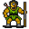

# { .sprite } Forest guardian

**Where to find Forest guardian:** Loneford: [Lodar 0](../maps/lodar0.md#pin-npc-lodar0_g)

<div class="infobox" markdown>

<p class="ib-img"></p>

| | |
|---|---|
| **Type** | NPC (talk only; never fought) |
| **Found in** | Loneford |
| **Introduced** | v0.7.0 or earlier |

</div>

## Quests

- [A lost potion](../quests/lodar.md): stages 40, 45

## Dialogue simulator

Talk to Forest guardian as you would in the game. When the conversation depends on your progress (a quest, an item, a dice roll…), the simulator asks you. Try another answer with **Undo**.

<div class="dlg-sim" data-src="../../assets/dialogue/lodar0_g.json" data-npc="Forest guardian" markdown="0"><noscript>The simulator needs JavaScript. The full dialogue is listed below.</noscript></div>

<p class="verified">Follows the game's own conversation rules (v0.8.18).</p>

??? quote "Dialogue (9 lines)"

    *Exactly as in the game files. Each line appears once; links jump to where a choice leads.*

    <span id="d-lodar0_g"></span>**`lodar0_g`** *(silent check: the first matching branch below is taken)*

    - branch 1 *(if reached stage 45 of [A lost potion](../quests/lodar.md#stage-45))* → [lodar0_g4](#d-lodar0_g4)
    - branch 2 *(if reached stage 40 of [A lost potion](../quests/lodar.md#stage-40))* → [lodar0_g0a](#d-lodar0_g0a)
    - branch 3 → [lodar0_g0](#d-lodar0_g0)

    <span id="d-lodar0_g4"></span>**`lodar0_g4`** Forest guardian: “[The creature moves out of the way, and gestures with its hands almost like it is welcoming you further into the forest]” — **effects:** sets stage 45 of [A lost potion](../quests/lodar.md#stage-45)

    - Next → *NPC leaves*

    <span id="d-lodar0_g0a"></span>**`lodar0_g0a`** Forest guardian: “You again?”

    - Next → [lodar0_g0](#d-lodar0_g0)

    <span id="d-lodar0_g0"></span>**`lodar0_g0`** Forest guardian: “Teehee. You funny looking.”

    - Next → [lodar0_g1](#d-lodar0_g1)

    <span id="d-lodar0_g1"></span>**`lodar0_g1`** Forest guardian: “He he, but funny not enough to let you pass.”

    - Next → [lodar0_g2](#d-lodar0_g2)

    <span id="d-lodar0_g2"></span>**`lodar0_g2`** Forest guardian: “Master says only ones with password can pass. You have password?” — **effects:** sets stage 40 of [A lost potion](../quests/lodar.md#stage-40)

    - “No, I don't have the password.” → [lodar0_gfail](#d-lodar0_gfail)
    - “'Giant'” → [lodar0_gfail](#d-lodar0_gfail)
    - “'Bones'” → [lodar0_gfail](#d-lodar0_gfail)
    - “[Lie] Your master has allowed me to get through without the password.” → [lodar0_gfail](#d-lodar0_gfail)
    - “'By the moon and stars, the path is laid clear to me.'” → [lodar0_gfail](#d-lodar0_gfail)
    - “'Lord Geomyr'” → [lodar0_gfail](#d-lodar0_gfail)
    - “'The Shadow'” → [lodar0_gfail](#d-lodar0_gfail)
    - “'Glow of the Shadow'” *(if reached stage 20 of [A lost potion](../quests/lodar.md#stage-20))* → [lodar0_g3](#d-lodar0_g3)
    - “'Password'” → [lodar0_gfail](#d-lodar0_gfail)

    <span id="d-lodar0_gfail"></span>**`lodar0_gfail`** Forest guardian: “You not know password! Teehee.”

    - Next → [lodar0_gfail1](#d-lodar0_gfail1)

    <span id="d-lodar0_g3"></span>**`lodar0_g3`** Forest guardian: “You know! You know!”

    - Next → [lodar0_g4](#d-lodar0_g4)

    <span id="d-lodar0_gfail1"></span>**`lodar0_gfail1`** Forest guardian: “[The guardian pushes you away and shakes its head]”


## Version history

| Version | Change |
|---|---|
| [v0.7.0](../versions/0.7.0.md) | Present in v0.7.0 (earliest release tracked) |
| [v0.7.2](../versions/0.7.2.md) | Dialogue: 2 lines changed |

<p class="verified">Verified against v0.8.18 and every earlier release back to v0.7.0 (game data compared release by release).</p>


## Behind the scenes

*How the game data handles this character. Not needed for playing.*

??? info "Technical information"

    | | |
    |---|---|
    | Entry ID | `lodar0_g` |
    | Type (wiki) | NPC |
    | Spawn group | `lodar0_g` |
    | Loot table | – |
    | Conversation | `lodar0_g` |
    | Faction | – |
    | Movement | – |
    | Icon | `monsters_tometik5:80` |
    | Defined in | `res/raw/monsterlist_v070_lodarnpcs.json` |

    Raw data:

    ```json
    {
     "id": "lodar0_g",
     "name": "Forest guardian",
     "iconID": "monsters_tometik5:80",
     "unique": 1,
     "spawnGroup": "lodar0_g",
     "phraseID": "lodar0_g"
    }
    ```


## Community notes

<small>Written by players, not generated from game data. **Observations**: what players notice in-game · **Lore**: the in-world story · **Trivia**: real-world facts, references, development history · **Theory / speculation**: unconfirmed ideas; may just be unfinished content</small>

### Observations

*No notes yet. Contributions are welcome: [add a note](https://github.com/asdfghjkl628/Andor-s-Trail-Wikiiii/new/main/notes/monsters?filename=lodar0_g.md&value=%23%23%20Observations%0A%0A%3C%21--%20what%20players%20notice%20in-game%20--%3E%0A%0A%23%23%20Lore%0A%0A%3C%21--%20the%20in-world%20story%20--%3E%0A%0A%23%23%20Trivia%0A%0A%3C%21--%20real-world%20facts%2C%20references%2C%20development%20history%20--%3E%0A%0A%23%23%20Theory%20/%20speculation%0A%0A%3C%21--%20unconfirmed%20ideas%3B%20may%20just%20be%20unfinished%20content%20--%3E%0A).*

### Lore

*No notes yet. Contributions are welcome: [add a note](https://github.com/asdfghjkl628/Andor-s-Trail-Wikiiii/new/main/notes/monsters?filename=lodar0_g.md&value=%23%23%20Observations%0A%0A%3C%21--%20what%20players%20notice%20in-game%20--%3E%0A%0A%23%23%20Lore%0A%0A%3C%21--%20the%20in-world%20story%20--%3E%0A%0A%23%23%20Trivia%0A%0A%3C%21--%20real-world%20facts%2C%20references%2C%20development%20history%20--%3E%0A%0A%23%23%20Theory%20/%20speculation%0A%0A%3C%21--%20unconfirmed%20ideas%3B%20may%20just%20be%20unfinished%20content%20--%3E%0A).*

### Trivia

*No notes yet. Contributions are welcome: [add a note](https://github.com/asdfghjkl628/Andor-s-Trail-Wikiiii/new/main/notes/monsters?filename=lodar0_g.md&value=%23%23%20Observations%0A%0A%3C%21--%20what%20players%20notice%20in-game%20--%3E%0A%0A%23%23%20Lore%0A%0A%3C%21--%20the%20in-world%20story%20--%3E%0A%0A%23%23%20Trivia%0A%0A%3C%21--%20real-world%20facts%2C%20references%2C%20development%20history%20--%3E%0A%0A%23%23%20Theory%20/%20speculation%0A%0A%3C%21--%20unconfirmed%20ideas%3B%20may%20just%20be%20unfinished%20content%20--%3E%0A).*

### Theory / speculation

*No notes yet. Contributions are welcome: [add a note](https://github.com/asdfghjkl628/Andor-s-Trail-Wikiiii/new/main/notes/monsters?filename=lodar0_g.md&value=%23%23%20Observations%0A%0A%3C%21--%20what%20players%20notice%20in-game%20--%3E%0A%0A%23%23%20Lore%0A%0A%3C%21--%20the%20in-world%20story%20--%3E%0A%0A%23%23%20Trivia%0A%0A%3C%21--%20real-world%20facts%2C%20references%2C%20development%20history%20--%3E%0A%0A%23%23%20Theory%20/%20speculation%0A%0A%3C%21--%20unconfirmed%20ideas%3B%20may%20just%20be%20unfinished%20content%20--%3E%0A).*


<small>Data from v0.8.18</small>
