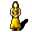

# { .sprite } Villager

<div class="infobox" markdown>

<p class="ib-img">{ .sprite }</p>

| | |
|---|---|
| **Type** | NPC (can be spoken to; cannot be attacked) |
| **Role** | Starts [Flows through the veins](../quests/loneford.md) |
| **Found in** | Loneford |
| **Entries in game data** | 5 |
| **Introduced** | v0.7.0 or earlier |

</div>

!!! info "5 entries in the game data"
    The game's data files define 5 separate characters named Villager. Andor's Trail stores a character as a new entry whenever it needs different behaviour, for example a different conversation at a later stage of a quest, a different location, or different combat statistics. Some entries represent the same person at different points in the story; others are different people who share a generic name. Here the entries differ in: conversation, appearance. This page combines them; each entry is described in its own section below.

| Entry | Type | Location | Role |
|---|---|---|---|
| [`loneford_villager0`](#v-loneford_villager0) | NPC | Loneford: [loneford2](../maps/loneford2.md#pin-npc-loneford_villager0) | starts [Flows through the veins](../quests/loneford.md) |
| [`loneford_villager1`](#v-loneford_villager1) | NPC | Loneford: [loneford2](../maps/loneford2.md#pin-npc-loneford_villager1) | starts [Flows through the veins](../quests/loneford.md) |
| [`loneford_villager2`](#v-loneford_villager2) | NPC | Loneford: [loneford2](../maps/loneford2.md#pin-npc-loneford_villager2) | – |
| [`loneford_villager3`](#v-loneford_villager3) | NPC | Loneford: [loneford2](../maps/loneford2.md#pin-npc-loneford_villager3) | starts [Flows through the veins](../quests/loneford.md) |
| [`loneford_villager4`](#v-loneford_villager4) | NPC | Loneford: [loneford2](../maps/loneford2.md#pin-npc-loneford_villager4) | – |

## Loneford, Loneford2 (loneford_villager0) { #v-loneford_villager0 }

**Entry ID:** `loneford_villager0` · **Type:** NPC · **Role:** Starts [Flows through the veins](../quests/loneford.md)

**Location:** Loneford: [loneford2](../maps/loneford2.md#pin-npc-loneford_villager0)

### Quests

- [Flows through the veins](../quests/loneford.md): stages 10, 11

### Dialogue simulator

Set the quest stages, items and other conditions that apply to your game, then start the conversation with Villager. The simulator applies the game's own rules: it performs the same silent checks, offers only the options that would be shown in the game, and applies their effects (quest stages, items handed over, rewards) as the conversation proceeds.

<div class="dlg-sim" data-src="../../assets/dialogue/loneford_villager0.json" data-npc="Villager" markdown="0"><noscript>The simulator needs JavaScript. The full dialogue is listed below.</noscript></div>

<p class="verified">Rules verified against v0.8.18 game code (ConversationController.java) and dialogue data.</p>

??? quote "Dialogue (9 lines)"

    *What the dialogue says, exactly as in the game files. Lines are listed once; links jump to the line a choice leads to.*

    <span id="d-loneford_villager0-loneford_villager0"></span>**`loneford_villager0`** Villager: “*cough* Please help us, soon there won't be many left of us!”

    - “What's wrong?” → [loneford_farmer0_1](#d-loneford_villager0-loneford_farmer0_1)

    <span id="d-loneford_villager0-loneford_farmer0_1"></span>**`loneford_farmer0_1`** Villager: “Didn't you hear about the illness?”

    - “What illness?” → [loneford_farmer_il_1](#d-loneford_villager0-loneford_farmer_il_1)

    <span id="d-loneford_villager0-loneford_farmer_il_1"></span>**`loneford_farmer_il_1`** Villager: “It all started a few days ago. Selgan found Hesor passed out on his old crop field, completely white faced and shivering.”

    - Next → [loneford_farmer_il_2](#d-loneford_villager0-loneford_farmer_il_2)

    <span id="d-loneford_villager0-loneford_farmer_il_2"></span>**`loneford_farmer_il_2`** Villager: “A few days later, Selgan started showing the same symptoms as Hesor, with stomach aches. I also started feeling the pains and got the shivers.”

    - Next → [loneford_farmer_il_3](#d-loneford_villager0-loneford_farmer_il_3)

    <span id="d-loneford_villager0-loneford_farmer_il_3"></span>**`loneford_farmer_il_3`** Villager: “Then, all people showed the symptoms in one way or another.”

    - Next → [loneford_farmer_il_4](#d-loneford_villager0-loneford_farmer_il_4)

    <span id="d-loneford_villager0-loneford_farmer_il_4"></span>**`loneford_farmer_il_4`** Villager: “Poor old Selgan and Hesor apparently got the worst of it, and both died the day before yesterday.”

    - Next → [loneford_farmer_il_5](#d-loneford_villager0-loneford_farmer_il_5)

    <span id="d-loneford_villager0-loneford_farmer_il_5"></span>**`loneford_farmer_il_5`** Villager: “Cursed illness, why did it have to be Selgan and Hesor? I wonder who is next.”

    - Next → [loneford_farmer_il_6](#d-loneford_villager0-loneford_farmer_il_6)

    <span id="d-loneford_villager0-loneford_farmer_il_6"></span>**`loneford_farmer_il_6`** Villager: “We all started to investigate what could be the cause. We still aren't certain what the cause is, but we have our suspicions.” — **effects:** sets stage 10 of [Flows through the veins](../quests/loneford.md#stage-10)

    - Next → [loneford_farmer_il_7](#d-loneford_villager0-loneford_farmer_il_7)

    <span id="d-loneford_villager0-loneford_farmer_il_7"></span>**`loneford_farmer_il_7`** Villager: “Luckily, now Feygard has sent patrols up here to help guard the village at least. We are still suffering though, and we fear who will be taken by the illness next.” — **effects:** sets stage 11 of [Flows through the veins](../quests/loneford.md#stage-11)


### Version history

| Version | Change |
|---|---|
| [v0.7.0](../versions/0.7.0.md) | Present in v0.7.0 (earliest release tracked) |

<p class="verified">Verified against v0.8.18 and every earlier release back to v0.7.0 (game data compared release by release).</p>


??? info "Technical information (loneford_villager0)"

    | | |
    |---|---|
    | Entry ID | `loneford_villager0` |
    | Spawn group | `loneford_villager0` |
    | Loot table | – |
    | Conversation | `loneford_villager0` |
    | Faction | – |
    | Movement | – |
    | Icon | `monsters_karvis2:0` |
    | Defined in | `res/raw/monsterlist_v0610_npcs1.json` |

    Raw data:

    ```json
    {
     "id": "loneford_villager0",
     "name": "Villager",
     "iconID": "monsters_karvis2:0",
     "monsterClass": "humanoid",
     "spawnGroup": "loneford_villager0",
     "phraseID": "loneford_villager0"
    }
    ```


## Loneford, Loneford2 (loneford_villager1) { #v-loneford_villager1 }

**Entry ID:** `loneford_villager1` · **Type:** NPC · **Role:** Starts [Flows through the veins](../quests/loneford.md)

**Location:** Loneford: [loneford2](../maps/loneford2.md#pin-npc-loneford_villager1)

### Quests

- [Flows through the veins](../quests/loneford.md): stages 10, 11

### Dialogue simulator

Set the quest stages, items and other conditions that apply to your game, then start the conversation with Villager. The simulator applies the game's own rules: it performs the same silent checks, offers only the options that would be shown in the game, and applies their effects (quest stages, items handed over, rewards) as the conversation proceeds.

<div class="dlg-sim" data-src="../../assets/dialogue/loneford_villager1.json" data-npc="Villager" markdown="0"><noscript>The simulator needs JavaScript. The full dialogue is listed below.</noscript></div>

<p class="verified">Rules verified against v0.8.18 game code (ConversationController.java) and dialogue data.</p>

??? quote "Dialogue (1 lines)"

    *What the dialogue says, exactly as in the game files. Lines are listed once; links jump to the line a choice leads to.*

    <span id="d-loneford_villager1-loneford_villager1"></span>**`loneford_villager1`** Villager: “I can't feel my face anymore, please help us!”

    - “What's wrong?” → [loneford_farmer0_1](#d-loneford_villager0-loneford_farmer0_1) (listed above)


### Version history

| Version | Change |
|---|---|
| [v0.7.0](../versions/0.7.0.md) | Present in v0.7.0 (earliest release tracked) |

<p class="verified">Verified against v0.8.18 and every earlier release back to v0.7.0 (game data compared release by release).</p>


??? info "Technical information (loneford_villager1)"

    | | |
    |---|---|
    | Entry ID | `loneford_villager1` |
    | Spawn group | `loneford_villager1` |
    | Loot table | – |
    | Conversation | `loneford_villager1` |
    | Faction | – |
    | Movement | – |
    | Icon | `monsters_karvis2:1` |
    | Defined in | `res/raw/monsterlist_v0610_npcs1.json` |

    Raw data:

    ```json
    {
     "id": "loneford_villager1",
     "name": "Villager",
     "iconID": "monsters_karvis2:1",
     "monsterClass": "humanoid",
     "spawnGroup": "loneford_villager1",
     "phraseID": "loneford_villager1"
    }
    ```


## Loneford, Loneford2 (loneford_villager2) { #v-loneford_villager2 }

**Entry ID:** `loneford_villager2` · **Type:** NPC

**Location:** Loneford: [loneford2](../maps/loneford2.md#pin-npc-loneford_villager2)

### Quests

- [It makes no fence](../quests/tunlon_fence.md): stages 150, 210, 230

### Dialogue simulator

Set the quest stages, items and other conditions that apply to your game, then start the conversation with Villager. The simulator applies the game's own rules: it performs the same silent checks, offers only the options that would be shown in the game, and applies their effects (quest stages, items handed over, rewards) as the conversation proceeds.

<div class="dlg-sim" data-src="../../assets/dialogue/loneford_villager2.json" data-npc="Villager" markdown="0"><noscript>The simulator needs JavaScript. The full dialogue is listed below.</noscript></div>

<p class="verified">Rules verified against v0.8.18 game code (ConversationController.java) and dialogue data.</p>

??? quote "Dialogue (7 lines)"

    *What the dialogue says, exactly as in the game files. Lines are listed once; links jump to the line a choice leads to.*

    <span id="d-loneford_villager2-loneford_villager2"></span>**`loneford_villager2`** Villager: “Don't disturb me, I need to finish chopping this wood. Go bother someone else.”

    - “Do you by any chance have some fences?” *(if reached stage 100 of [It makes no fence](../quests/tunlon_fence.md#stage-100); NOT reached stage 150 of [It makes no fence](../quests/tunlon_fence.md#stage-150))* → [loneford_villager2_fence](#d-loneford_villager2-loneford_villager2_fence)
    - “Do you by any chance have some fences?” *(if reached stage 110 of [It makes no fence](../quests/tunlon_fence.md#stage-110); NOT reached stage 150 of [It makes no fence](../quests/tunlon_fence.md#stage-150))* → [loneford_villager2_fence](#d-loneford_villager2-loneford_villager2_fence)
    - “Unfortunately the fences you gave me are not tall enough. Do you have others?” *(if reached stage 200 of [It makes no fence](../quests/tunlon_fence.md#stage-200); NOT reached stage 210 of [It makes no fence](../quests/tunlon_fence.md#stage-210))* → [loneford_villager2_fence2](#d-loneford_villager2-loneford_villager2_fence2)
    - “The Craftsman told me that I should get some wood from you.” *(if reached stage 220 of [It makes no fence](../quests/tunlon_fence.md#stage-220); NOT reached stage 230 of [It makes no fence](../quests/tunlon_fence.md#stage-230))* → [loneford_villager2_fence4](#d-loneford_villager2-loneford_villager2_fence4)

    <span id="d-loneford_villager2-loneford_villager2_fence"></span>**`loneford_villager2_fence`** Villager: “Oh actually I do right here. You can have them for 100 gold pieces.”

    - “Great, I'll take them.” *(if pay 100 gold)* → [loneford_villager2_fence1](#d-loneford_villager2-loneford_villager2_fence1)
    - “100 gold is too much.” → [loneford_villager2_fence1a](#d-loneford_villager2-loneford_villager2_fence1a)

    <span id="d-loneford_villager2-loneford_villager2_fence2"></span>**`loneford_villager2_fence2`** Villager: “No, I don't.”

    - “So ... could you make any?” → [loneford_villager2_fence3](#d-loneford_villager2-loneford_villager2_fence3)

    <span id="d-loneford_villager2-loneford_villager2_fence4"></span>**`loneford_villager2_fence4`** Villager: “[pointing to a pile of wood] There.” — **effects:** sets stage 230 of [It makes no fence](../quests/tunlon_fence.md#stage-230), gives [Pile of wood](../items/tunlon_wood.md)

    - “Thank you ... I guess.” → *conversation ends*

    <span id="d-loneford_villager2-loneford_villager2_fence1"></span>**`loneford_villager2_fence1`** Villager: “Here you go.” — **effects:** sets stage 150 of [It makes no fence](../quests/tunlon_fence.md#stage-150), gives [Sturdy fence](../items/tunlon_fence1.md)

    - “Thank you! [and I won't tell you that Tunlon gave me 200 gold]” → *conversation ends*

    <span id="d-loneford_villager2-loneford_villager2_fence1a"></span>**`loneford_villager2_fence1a`** Villager: “Take it or leave it. 100 gold pieces.”

    - “OK. I'll take them.” *(if pay 100 gold)* → [loneford_villager2_fence1](#d-loneford_villager2-loneford_villager2_fence1)
    - “Forget it.” → *conversation ends*

    <span id="d-loneford_villager2-loneford_villager2_fence3"></span>**`loneford_villager2_fence3`** Villager: “Kid, look. I am a woodcutter, not a craftsman. Go east to Brimhaven if you want other fences.” — **effects:** sets stage 210 of [It makes no fence](../quests/tunlon_fence.md#stage-210)

    - “Thank you. I will go there now.” → *conversation ends*


### Version history

| Version | Change |
|---|---|
| [v0.7.0](../versions/0.7.0.md) | Present in v0.7.0 (earliest release tracked) |
| [v0.8.10](../versions/0.8.10.md) | Dialogue: 6 lines added, 1 line changed |

<p class="verified">Verified against v0.8.18 and every earlier release back to v0.7.0 (game data compared release by release).</p>


??? info "Technical information (loneford_villager2)"

    | | |
    |---|---|
    | Entry ID | `loneford_villager2` |
    | Spawn group | `loneford_villager2` |
    | Loot table | – |
    | Conversation | `loneford_villager2` |
    | Faction | – |
    | Movement | – |
    | Icon | `monsters_karvis2:3` |
    | Defined in | `res/raw/monsterlist_v0610_npcs1.json` |

    Raw data:

    ```json
    {
     "id": "loneford_villager2",
     "name": "Villager",
     "iconID": "monsters_karvis2:3",
     "monsterClass": "humanoid",
     "spawnGroup": "loneford_villager2",
     "phraseID": "loneford_villager2"
    }
    ```


## Loneford, Loneford2 (loneford_villager3) { #v-loneford_villager3 }

**Entry ID:** `loneford_villager3` · **Type:** NPC · **Role:** Starts [Flows through the veins](../quests/loneford.md)

**Location:** Loneford: [loneford2](../maps/loneford2.md#pin-npc-loneford_villager3)

### Quests

- [Flows through the veins](../quests/loneford.md): stages 10, 11

### Dialogue simulator

Set the quest stages, items and other conditions that apply to your game, then start the conversation with Villager. The simulator applies the game's own rules: it performs the same silent checks, offers only the options that would be shown in the game, and applies their effects (quest stages, items handed over, rewards) as the conversation proceeds.

<div class="dlg-sim" data-src="../../assets/dialogue/loneford_villager3.json" data-npc="Villager" markdown="0"><noscript>The simulator needs JavaScript. The full dialogue is listed below.</noscript></div>

<p class="verified">Rules verified against v0.8.18 game code (ConversationController.java) and dialogue data.</p>

??? quote "Dialogue (1 lines)"

    *What the dialogue says, exactly as in the game files. Lines are listed once; links jump to the line a choice leads to.*

    <span id="d-loneford_villager3-loneford_villager3"></span>**`loneford_villager3`** Villager: “I fear for our survival. It seems we are getting worse every day that passes. It's a good thing Feygard helps us at least.”

    - “What's wrong?” → [loneford_farmer0_1](#d-loneford_villager0-loneford_farmer0_1) (listed above)


### Version history

| Version | Change |
|---|---|
| [v0.7.0](../versions/0.7.0.md) | Present in v0.7.0 (earliest release tracked) |

<p class="verified">Verified against v0.8.18 and every earlier release back to v0.7.0 (game data compared release by release).</p>


??? info "Technical information (loneford_villager3)"

    | | |
    |---|---|
    | Entry ID | `loneford_villager3` |
    | Spawn group | `loneford_villager3` |
    | Loot table | – |
    | Conversation | `loneford_villager3` |
    | Faction | – |
    | Movement | – |
    | Icon | `monsters_karvis2:5` |
    | Defined in | `res/raw/monsterlist_v0610_npcs1.json` |

    Raw data:

    ```json
    {
     "id": "loneford_villager3",
     "name": "Villager",
     "iconID": "monsters_karvis2:5",
     "monsterClass": "humanoid",
     "spawnGroup": "loneford_villager3",
     "phraseID": "loneford_villager3"
    }
    ```


## Loneford, Loneford2 (loneford_villager4) { #v-loneford_villager4 }

**Entry ID:** `loneford_villager4` · **Type:** NPC

**Location:** Loneford: [loneford2](../maps/loneford2.md#pin-npc-loneford_villager4)

### Dialogue simulator

Set the quest stages, items and other conditions that apply to your game, then start the conversation with Villager. The simulator applies the game's own rules: it performs the same silent checks, offers only the options that would be shown in the game, and applies their effects (quest stages, items handed over, rewards) as the conversation proceeds.

<div class="dlg-sim" data-src="../../assets/dialogue/loneford_villager4.json" data-npc="Villager" markdown="0"><noscript>The simulator needs JavaScript. The full dialogue is listed below.</noscript></div>

<p class="verified">Rules verified against v0.8.18 game code (ConversationController.java) and dialogue data.</p>

??? quote "Dialogue (1 lines)"

    *What the dialogue says, exactly as in the game files. Lines are listed once; links jump to the line a choice leads to.*

    <span id="d-loneford_villager4-loneford_villager4"></span>**`loneford_villager4`** Villager: “Don't I know you from somewhere? You look familiar somehow.”


### Version history

| Version | Change |
|---|---|
| [v0.7.0](../versions/0.7.0.md) | Present in v0.7.0 (earliest release tracked) |

<p class="verified">Verified against v0.8.18 and every earlier release back to v0.7.0 (game data compared release by release).</p>


??? info "Technical information (loneford_villager4)"

    | | |
    |---|---|
    | Entry ID | `loneford_villager4` |
    | Spawn group | `loneford_villager4` |
    | Loot table | – |
    | Conversation | `loneford_villager4` |
    | Faction | – |
    | Movement | – |
    | Icon | `monsters_men:2` |
    | Defined in | `res/raw/monsterlist_v0610_npcs1.json` |

    Raw data:

    ```json
    {
     "id": "loneford_villager4",
     "name": "Villager",
     "iconID": "monsters_men:2",
     "monsterClass": "humanoid",
     "spawnGroup": "loneford_villager4",
     "phraseID": "loneford_villager4"
    }
    ```


## Community notes

<small>Written by players, not generated from game data. **Observations**: what players notice in-game · **Lore**: the in-world story · **Trivia**: real-world facts, references, development history · **Theory / speculation**: unconfirmed ideas; may just be unfinished content</small>

### Observations

*No notes yet. Contributions are welcome: [add a note](https://github.com/asdfghjkl628/Andor-s-Trail-Wikiiii/new/main/notes/monsters?filename=loneford_villager0.md&value=%23%23%20Observations%0A%0A%3C%21--%20what%20players%20notice%20in-game%20--%3E%0A%0A%23%23%20Lore%0A%0A%3C%21--%20the%20in-world%20story%20--%3E%0A%0A%23%23%20Trivia%0A%0A%3C%21--%20real-world%20facts%2C%20references%2C%20development%20history%20--%3E%0A%0A%23%23%20Theory%20/%20speculation%0A%0A%3C%21--%20unconfirmed%20ideas%3B%20may%20just%20be%20unfinished%20content%20--%3E%0A).*

### Lore

*No notes yet. Contributions are welcome: [add a note](https://github.com/asdfghjkl628/Andor-s-Trail-Wikiiii/new/main/notes/monsters?filename=loneford_villager0.md&value=%23%23%20Observations%0A%0A%3C%21--%20what%20players%20notice%20in-game%20--%3E%0A%0A%23%23%20Lore%0A%0A%3C%21--%20the%20in-world%20story%20--%3E%0A%0A%23%23%20Trivia%0A%0A%3C%21--%20real-world%20facts%2C%20references%2C%20development%20history%20--%3E%0A%0A%23%23%20Theory%20/%20speculation%0A%0A%3C%21--%20unconfirmed%20ideas%3B%20may%20just%20be%20unfinished%20content%20--%3E%0A).*

### Trivia

*No notes yet. Contributions are welcome: [add a note](https://github.com/asdfghjkl628/Andor-s-Trail-Wikiiii/new/main/notes/monsters?filename=loneford_villager0.md&value=%23%23%20Observations%0A%0A%3C%21--%20what%20players%20notice%20in-game%20--%3E%0A%0A%23%23%20Lore%0A%0A%3C%21--%20the%20in-world%20story%20--%3E%0A%0A%23%23%20Trivia%0A%0A%3C%21--%20real-world%20facts%2C%20references%2C%20development%20history%20--%3E%0A%0A%23%23%20Theory%20/%20speculation%0A%0A%3C%21--%20unconfirmed%20ideas%3B%20may%20just%20be%20unfinished%20content%20--%3E%0A).*

### Theory / speculation

*No notes yet. Contributions are welcome: [add a note](https://github.com/asdfghjkl628/Andor-s-Trail-Wikiiii/new/main/notes/monsters?filename=loneford_villager0.md&value=%23%23%20Observations%0A%0A%3C%21--%20what%20players%20notice%20in-game%20--%3E%0A%0A%23%23%20Lore%0A%0A%3C%21--%20the%20in-world%20story%20--%3E%0A%0A%23%23%20Trivia%0A%0A%3C%21--%20real-world%20facts%2C%20references%2C%20development%20history%20--%3E%0A%0A%23%23%20Theory%20/%20speculation%0A%0A%3C%21--%20unconfirmed%20ideas%3B%20may%20just%20be%20unfinished%20content%20--%3E%0A).*


<small>Data from v0.8.18</small>
